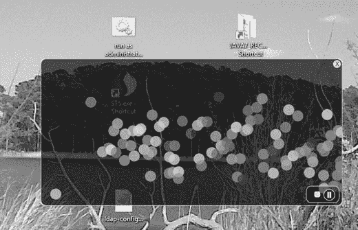
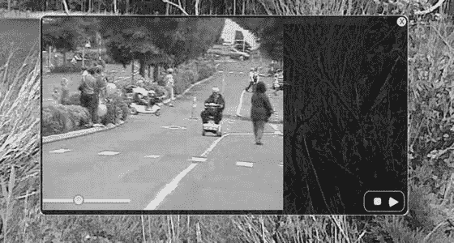
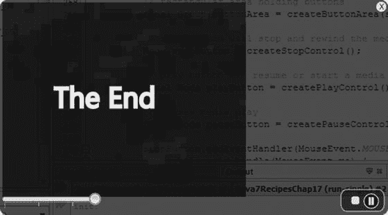

# 十六、使用 JavaFX 的媒体

JavaFX 提供了能够播放音频和视频的富媒体 API。媒体 API 允许开发人员将音频和视频合并到他们的富客户端应用中。Media API 的一个主要优点是在通过 web 分发媒体内容时它的跨平台能力。对于一系列需要播放多媒体内容的设备(平板电脑、音乐播放器、电视等等)，对跨平台 API 的需求是必不可少的。

想象一下在不久的将来，你的电视或墙壁能够以你做梦也想不到的方式与你互动。例如，在观看电影时，您可以选择电影中使用的物品或衣服立即购买，所有这些都可以在您舒适的家中完成。考虑到这种未来，开发人员寻求提高他们基于媒体的应用的交互质量。

在本章中，你将学习如何以互动的方式播放音频和视频。找到您在 JavaFX 第三幕的座位，因为音频和视频占据了中心舞台——如图 [16-1](#Fig1) 所示。


###### 图 16-1。音频和视频

## 16-1.播放音频

### 问题

您希望编写一个应用，让您可以听音乐，并通过图形可视化来娱乐。

### 解决办法

利用下面的类创建一个 MP3 播放器:

*   javafx.scene.media.Media

*   javafx.scene.media.MediaPlayer

*   Java FX . scene . media . audiospectrumlistener

下面的源代码是一个简单 MP3 播放器的实现:

```java
package org.java9recipes.chapter16.recipe16_01;

import java.io.File;
import java.util.Random;
import javafx.application.Application;
import javafx.application.Platform;
import javafx.geometry.Point2D;
import javafx.scene.Group;
import javafx.scene.Node;
import javafx.scene.Scene;
import javafx.scene.input.DragEvent;
import javafx.scene.input.Dragboard;
import javafx.scene.input.MouseEvent;
import javafx.scene.input.TransferMode;
import javafx.scene.media.AudioSpectrumListener;
import javafx.scene.media.Media;
import javafx.scene.media.MediaPlayer;
import javafx.scene.paint.Color;
import javafx.scene.shape.Arc;
import javafx.scene.shape.ArcType;
import javafx.scene.shape.Circle;
import javafx.scene.shape.Line;
import javafx.scene.shape.Rectangle;
import javafx.scene.text.Text;
import javafx.stage.Stage;
import javafx.stage.StageStyle;

public class PlayingAudio extends Application {

    private MediaPlayer mediaPlayer;
    private Point2D anchorPt;
    private Point2D previousLocation;

    /**
     * @param args the command line arguments
     */
    public static void main(String[] args) {
        Application.launch(args);
    }

    @Override
    public void start(final Stage primaryStage) {
        primaryStage.setTitle("Chapter 16-1 Playing Audio");
        primaryStage.centerOnScreen();
        primaryStage.initStyle(StageStyle.TRANSPARENT);

        Group root = new Group();
        Scene scene = new Scene(root, 551, 270, Color.rgb(0, 0, 0, 0));

        // application area
        Rectangle applicationArea = new Rectangle();
        applicationArea.setArcWidth(20);
        applicationArea.setArcHeight(20);
        applicationArea.setFill(Color.rgb(0, 0, 0, .80));
        applicationArea.setX(0);
        applicationArea.setY(0);
        applicationArea.setStrokeWidth(2);
        applicationArea.setStroke(Color.rgb(255, 255, 255, .70));

        root.getChildren().add(applicationArea);
        applicationArea.widthProperty().bind(scene.widthProperty());
        applicationArea.heightProperty().bind(scene.heightProperty());

        final Group phaseNodes = new Group();
        root.getChildren().add(phaseNodes);

        // starting initial anchor point
        scene.setOnMousePressed((MouseEvent event) -> {
            anchorPt = new Point2D(event.getScreenX(), event.getScreenY());
        });

        // dragging the entire stage
        scene.setOnMouseDragged((MouseEvent event) -> {
            if (anchorPt != null && previousLocation != null) {
                primaryStage.setX(previousLocation.getX() + event.getScreenX() - anchorPt.getX());
                primaryStage.setY(previousLocation.getY() + event.getScreenY() - anchorPt.getY());
            }
        });

        // set the current location
        scene.setOnMouseReleased((MouseEvent event) -> {
            previousLocation = new Point2D(primaryStage.getX(), primaryStage.getY());
        });

        // Dragging over surface
        scene.setOnDragOver((DragEvent event) -> {
            Dragboard db = event.getDragboard();
            if (db.hasFiles()) {
                event.acceptTransferModes(TransferMode.COPY);
            } else {
                event.consume();
            }
        });

        // Dropping over surface
        scene.setOnDragDropped((DragEvent event) -> {
            Dragboard db = event.getDragboard();
            boolean success = false;
            if (db.hasFiles()) {
                success = true;
                String filePath = null;
                for (File file : db.getFiles()) {
                    filePath = file.getAbsolutePath();
                    System.out.println(filePath);
                }
                // play file
                Media media = new Media(new File(filePath).toURI().toString());

                if (mediaPlayer != null) {
                    mediaPlayer.stop();
                }

                mediaPlayer = new MediaPlayer(media);

                // Maintained Inner Class for Tutorial, could be changed to lambda
                mediaPlayer.setAudioSpectrumListener(new AudioSpectrumListener() {
                    @Override
                    public void spectrumDataUpdate(double timestamp, double duration, float[] magnitudes, float[] phases) {
                        phaseNodes.getChildren().clear();
                        int i = 0;
                        int x = 10;
                        int y = 150;
                        final Random rand = new Random(System.currentTimeMillis());
                        for (float phase : phases) {
                            int red = rand.nextInt(255);
                            int green = rand.nextInt(255);
                            int blue = rand.nextInt(255);

                            Circle circle = new Circle(10);
                            circle.setCenterX(x + i);
                            circle.setCenterY(y + (phase * 100));
                            circle.setFill(Color.rgb(red, green, blue, .70));
                            phaseNodes.getChildren().add(circle);
                            i += 5;
                        }
                    }
                });

                mediaPlayer.setOnReady(mediaPlayer::play);
            }

            event.setDropCompleted(success);
            event.consume();
        });

        // create slide controls
        final Group buttonGroup = new Group();

        // rounded rect
        Rectangle buttonArea = new Rectangle();
        buttonArea.setArcWidth(15);
        buttonArea.setArcHeight(20);
        buttonArea.setFill(new Color(0, 0, 0, .55));
        buttonArea.setX(0);
        buttonArea.setY(0);
        buttonArea.setWidth(60);
        buttonArea.setHeight(30);
        buttonArea.setStroke(Color.rgb(255, 255, 255, .70));

        buttonGroup.getChildren().add(buttonArea);
        // stop audio control
        Rectangle stopButton = new Rectangle();
        stopButton.setArcWidth(5);
        stopButton.setArcHeight(5);
        stopButton.setFill(Color.rgb(255, 255, 255, .80));
        stopButton.setX(0);
        stopButton.setY(0);
        stopButton.setWidth(10);
        stopButton.setHeight(10);
        stopButton.setTranslateX(15);
        stopButton.setTranslateY(10);
        stopButton.setStroke(Color.rgb(255, 255, 255, .70));

        stopButton.setOnMousePressed((MouseEvent me) -> {
            if (mediaPlayer != null) {
                mediaPlayer.stop();
            }
        });
        buttonGroup.getChildren().add(stopButton);

        // play control
        final Arc playButton = new Arc();
        playButton.setType(ArcType.ROUND);
        playButton.setCenterX(12);
        playButton.setCenterY(16);
        playButton.setRadiusX(15);
        playButton.setRadiusY(15);
        playButton.setStartAngle(180 - 30);
        playButton.setLength(60);
        playButton.setFill(new Color(1, 1, 1, .90));
        playButton.setTranslateX(40);

        playButton.setOnMousePressed((MouseEvent me) -> {
            mediaPlayer.play();
        });

        // pause control
        final Group pause = new Group();
        final Circle pauseButton = new Circle();
        pauseButton.setCenterX(12);
        pauseButton.setCenterY(16);
        pauseButton.setRadius(10);
        pauseButton.setStroke(new Color(1, 1, 1, .90));
        pauseButton.setTranslateX(30);

        final Line firstLine = new Line();
        firstLine.setStartX(6);
        firstLine.setStartY(16 - 10);
        firstLine.setEndX(6);
        firstLine.setEndY(16 - 2);
        firstLine.setStrokeWidth(3);
        firstLine.setTranslateX(34);
        firstLine.setTranslateY(6);
        firstLine.setStroke(new Color(1, 1, 1, .90));

        final Line secondLine = new Line();
        secondLine.setStartX(6);
        secondLine.setStartY(16 - 10);
        secondLine.setEndX(6);
        secondLine.setEndY(16 - 2);
        secondLine.setStrokeWidth(3);
        secondLine.setTranslateX(38);
        secondLine.setTranslateY(6);
        secondLine.setStroke(new Color(1, 1, 1, .90));

        pause.getChildren().addAll(pauseButton, firstLine, secondLine);

        pause.setOnMousePressed((MouseEvent me) -> {
            if (mediaPlayer != null) {
                buttonGroup.getChildren().remove(pause);
                buttonGroup.getChildren().add(playButton);
                mediaPlayer.pause();
            }
        });

        playButton.setOnMousePressed((MouseEvent me) -> {
            if (mediaPlayer != null) {
                buttonGroup.getChildren().remove(playButton);
                buttonGroup.getChildren().add(pause);
                mediaPlayer.play();
            }
        });

        buttonGroup.getChildren().add(pause);
        // move button group when scene is resized
        buttonGroup.translateXProperty().bind(scene.widthProperty().subtract(buttonArea.getWidth() + 6));
        buttonGroup.translateYProperty().bind(scene.heightProperty().subtract(buttonArea.getHeight() + 6));
        root.getChildren().add(buttonGroup);

        // close button
        final Group closeApp = new Group();
        Circle closeButton = new Circle();
        closeButton.setCenterX(5);
        closeButton.setCenterY(0);
        closeButton.setRadius(7);
        closeButton.setFill(Color.rgb(255, 255, 255, .80));

        Node closeXmark = new Text(2, 4, "X");
        closeApp.translateXProperty().bind(scene.widthProperty().subtract(15));
        closeApp.setTranslateY(10);
        closeApp.getChildren().addAll(closeButton, closeXmark);
        closeApp.setOnMouseClicked((MouseEvent event) -> {
            Platform.exit();
        });

        root.getChildren().add(closeApp);

        primaryStage.setScene(scene);
        primaryStage.show();
        previousLocation = new Point2D(primaryStage.getX(), primaryStage.getY());

    }
}
```

图 [16-2](#Fig2) 显示了一个带有可视化效果的 JavaFX MP3 播放器。



###### 图 16-2。JavaFX MP3 播放器

### 它是如何工作的

在您开始之前，我将讨论如何操作所创建的 MP3 播放器应用的说明。用户可以将音频文件拖放到应用区域进行播放。位于应用右下角的是停止、暂停和恢复播放音频媒体的按钮。(按钮控制如图 [16-2](#Fig2) 所示。)当音乐播放时，用户还会注意到随机的彩色球随着音乐来回跳动。一旦用户听完音乐，他们可以通过点击右上角的白色圆形关闭按钮来退出应用。

它类似于食谱 15-1，其中您学习了如何使用拖放桌面隐喻将文件加载到 JavaFX 应用中。然而，用户访问的不是图像文件，而是音频文件。JavaFX 目前支持以下音频文件格式:. mp3，.wav，还有. aiff。

遵循相同的外观和感觉，您将使用与配方 15-1 相同的样式。在这个方法中，您将按钮控件修改为类似于按钮，类似于许多媒体播放器应用。当按下暂停按钮时，它将暂停音频媒体的播放并切换到播放按钮控制，从而允许用户继续。作为一个额外的奖励，MP3 播放器将显示为一个不规则形状的半透明无边框窗口，也可以用鼠标在桌面上拖动。现在您已经知道了音乐播放器将如何操作，让我们浏览一下代码。

首先，您需要创建在应用的生命周期内维护状态信息的实例变量。表 [16-1](#Tab1) 描述了该音乐播放器应用中使用的所有实例变量。第一个变量是对媒体播放器(media player)对象的引用，该对象将与包含音频文件的媒体对象一起创建。接下来，创建一个 anchorPt 变量，用于在用户开始在屏幕上拖动窗口时保存鼠标按下的起始坐标。在鼠标拖动操作期间计算应用窗口的左上边界时，previousLocation 变量将包含前一个窗口的屏幕 X 和 Y 坐标。

###### 表 16-1。MP3 播放器应用实例变量

<colgroup class="calibre15"><col class="calibre16"> <col class="calibre16"> <col class="calibre16"> <col class="calibre16"></colgroup> 
| 

可变的

 | 

数据类型

 | 

例子

 | 

描述

 |
| --- | --- | --- | --- |
| 媒体播放机 | 媒体播放机 | 不适用的 | 播放音频和视频的媒体播放器控件 |
| anchorPt | 点 2D | One hundred thousand one hundred | 用户开始拖动窗口的坐标 |
| 先前位置 | 点 2D | 0,0 | 舞台上一个坐标的左上角；协助拖动窗口 |

表 [16-1](#Tab1) 列出了 MP3 播放器应用的实例变量。

在前面关于 GUI 的章节中，你看到了 GUI 应用通常包含一个标题栏和围绕场景的窗口边框。在这里，我想通过向您展示如何创建不规则形状的半透明窗口，从而使事物看起来更加时尚或现代，来提高标准。当您开始创建媒体播放器时，您会注意到在 start()方法中，您通过使用 StageStyle.TRANSPARENT 初始化样式来准备 Stage 对象。透明，窗口将不被修饰，整个窗口区域的不透明值设置为零(不可见)。以下代码向您展示了如何创建一个没有标题栏或窗口边框的透明窗口:

```java
primaryStage.initStyle(StageStyle.TRANSPARENT);
```

使用不可见的舞台，您可以创建一个圆角矩形区域，该区域将成为应用的表面或主要内容区域。接下来，注意绑定到场景对象的矩形的宽度和高度，以防窗口被调整大小。因为窗口不会被调整大小，所以绑定是不必要的(然而，在方法 16-2 中，当你提供放大视频屏幕以呈现全屏模式的能力时，它是需要的)。

在创建一个黑色、半透明的圆角矩形区域(applicationArea)之后，您将创建一个简单的 Group 对象来保存所有随机着色的圆形节点，这些节点将在播放音频时展示图形可视化效果。稍后，您将看到如何使用 AudioSpectrumListener 根据声音信息更新 phaseNodes (Group)变量。

接下来，将 EventHandler <mouseevent>实例添加到 Scene 对象(该示例使用 lambda 表达式)中，以便在用户在屏幕上拖动窗口时监视鼠标事件。这个场景中的第一个事件是鼠标按下，这将把光标的当前(X，Y)坐标保存到变量 anchorPt 中。以下代码将 EventHandler 添加到场景的 mouse-press 属性中:</mouseevent>

```java
// starting initial anchor point
scene.setOnMousePressed((MouseEvent event) -> {
    anchorPt = new Point2D(event.getScreenX(), event.getScreenY());
});
```

实现鼠标按下事件处理程序后，可以为场景的鼠标拖动属性创建一个事件处理程序。鼠标拖动事件处理程序将根据前一个窗口的位置(左上角)以及 anchorPt 变量，动态更新和定位应用窗口(舞台)。这里显示的是负责场景对象上鼠标拖动事件的事件处理程序:

```java
// dragging the entire stage
scene.setOnMouseDragged((MouseEvent event) -> {
    if (anchorPt != null && previousLocation != null) {
        primaryStage.setX(previousLocation.getX() + event.getScreenX() - anchorPt.getX());
        primaryStage.setY(previousLocation.getY() + event.getScreenY() - anchorPt.getY());
    }
});
```

您将需要处理鼠标释放事件来执行操作。一旦释放鼠标，事件处理程序将为随后的鼠标拖动事件更新 previousLocation 变量，以在屏幕上移动应用窗口。以下代码片段更新了 previousLocation 变量:

```java
// set the current location
scene.setOnMouseReleased((MouseEvent event) -> {
    previousLocation = new Point2D(primaryStage.getX(), primaryStage.getY());
});
```

接下来，您将实现拖放场景来从文件系统加载音频文件(使用文件管理器)。当处理拖放场景时，它类似于配方 15-1，其中您创建了一个 EventHandler 来处理 DragEvents。您将从主机文件系统加载音频文件，而不是加载图像文件。为了简洁起见，我只提到拖放事件处理程序的代码行。一旦音频文件可用，您将通过将文件作为 URI 传入来创建媒体对象。以下代码片段是如何创建媒体对象的:

```java
Media media = new Media(new File(filePath).toURI().toString());
```

一旦创建了媒体对象，就必须创建一个 MediaPlayer 实例来播放声音文件。Media 和 MediaPlayer 对象都是不可变的，这就是为什么每次用户将文件拖动到应用中时，都会创建每个对象的新实例。接下来，您将检查前一个实例的实例变量 mediaPlayer，以确保它在创建新的 MediaPlayer 实例之前已经停止。以下代码检查要停止的前一个媒体播放器:

```java
  if (mediaPlayer != null) {
    mediaPlayer.stop();
  }
```

因此，这里是您创建 MediaPlayer 实例的地方。MediaPlayer 对象负责控制媒体对象的播放。请注意，MediaPlayer 在播放、暂停和停止媒体方面将声音或视频媒体视为相同。创建媒体播放器时，需要指定 media 和 audioSpectrumListener 属性方法。将 autoPlay 属性设置为 true 将在加载音频媒体后立即播放它。在 MediaPlayer 实例上最后要指定的是 AudioSpectrumListener。你说，这种类型的听众到底是什么样的？根据 Javadoc，它是一个接收音频频谱定期更新的观察者。通俗地说，就是音频媒体的声音数据，比如音量、节奏等等。要创建 AudioSpectrumListener 的实例，需要创建一个内部类来重写 spectrumDataUpdate()方法。你也可以在这里使用 lambda 表达式；该示例使用内部类来更好地了解功能。表 [16-2](#Tab2) 列出了音频频谱监听器方法的所有入站参数。更多详情请参考[http://docs . Oracle . com/javase/8/Java FX/API/Java FX/scene/media/audiospectrumlistener . html](http://docs.oracle.com/javase/8/javafx/api/javafx/scene/media/AudioSpectrumListener.html)的 Javadoc。

###### 表 16-2。AudioSpectrumListener 的方法 spectrumDataUpdate()入站参数

<colgroup class="calibre15"><col class="calibre16"> <col class="calibre16"> <col class="calibre16"> <col class="calibre16"></colgroup> 
| 

可变的

 | 

数据类型

 | 

例子

 | 

描述

 |
| --- | --- | --- | --- |
| 时间戳 | 两倍 | 2.4261 | 事件发生的时间(秒) |
| 期间 | 两倍 | Zero point one | 计算光谱的持续时间(秒) |
| 重要 | 浮动[] | -50.474335 | 浮点值数组，以分贝表示每个波段的频谱幅度(非正浮点值) |
| 阶段 | 浮动[] | 1.2217305 | 表示每个波段相位的浮点值数组 |

在该示例中，基于可变相位(浮动数组)创建、定位和放置随机着色的圆形节点。要绘制每个彩色圆，圆的中心 X 增加 5 个像素，圆的中心 Y 加上每个相位值乘以 100。此处显示的是绘制每个随机彩色圆圈的代码片段:

```java
circle.setCenterX(x + i);
circle.setCenterY(y + (phase * 100));
... // setting the circle
i+=5;
```

以下是 AudioSpectrumListener 的内部类实现:

```java
new AudioSpectrumListener() {
    @Override
    public void spectrumDataUpdate(double timestamp, double duration, float[] magnitudes, float[] phases) {

       phaseNodes.getChildren().clear();
       int i = 0;
       int x = 10;
       int y = 150;
       final Random rand = new Random(System.currentTimeMillis());
       for(float phase:phases) {
       int red = rand.nextInt(255);
       int green = rand.nextInt(255);
       int blue = rand.nextInt(255);

         Circle circle = new Circle(10);
         circle.setCenterX(x + i);
         circle.setCenterY(y + (phase * 100));
         circle.setFill(Color.rgb(red, green, blue, .70));
         phaseNodes.getChildren().add(circle);
         i+=5;
      }

    }
 };
```

一旦创建了媒体播放器，就可以创建一个 java.lang.Runnable 来设置 onReady 属性，以便在媒体处于就绪状态时调用。一旦实现了 ready 事件，run()方法将调用媒体播放器对象的 play()方法来开始播放音频。拖放序列完成后，通过调用事件的值为 true 的 setDropCompleted()方法来通知拖放系统。下面的代码片段演示了如何使用方法引用实现 Runnable，以便在媒体播放器处于就绪状态时立即启动媒体播放器:

```java
   mediaPlayer.setOnReady(mediaPlayer::play);
```

最后，用 JavaFX 形状创建按钮来表示停止、播放、暂停和关闭按钮。创建形状或自定义节点时，可以向节点添加事件处理程序，以便响应鼠标单击。尽管在 JavaFX 中有一些高级的方法来构建自定义控件，但是本例使用了简单的矩形、弧形、圆形和线条来构建自定义的按钮图标。要查看创建自定义控件的更高级的方法，请参考 Skinnable API 上的 Javadoc 或食谱 16-5。要为鼠标按压附加事件处理程序，只需通过传入 EventHandler <mouseevent>实例来调用 setOnMousePress()方法。下面的代码演示如何添加一个 EventHandler 来响应 stopButton 节点上的鼠标按键:</mouseevent>

```java
stopButton.setOnMousePressed((MouseEvent me) -> {
    if (mediaPlayer != null) {
        mediaPlayer.stop();
    }
});
```

因为所有按钮都使用相同的代码片段，所以只列出了每个按钮将在媒体播放器上执行的方法调用。最后一个按钮 Close 与媒体播放器无关，但它提供了一种退出 MP3 播放器应用的方法。以下操作负责停止、暂停、播放和退出 MP3 播放器应用:

```java
Stop - mediaPlayer.stop();  
Pause - mediaPlayer.pause();
Play - mediaPlayer.play();
Close - Platform.exit();
```

## 16-2.播放视频

### 问题

您希望创建一个应用来查看一个视频文件，该文件带有播放、暂停、停止和搜索的控件。

### 解决办法

利用以下类创建一个视频媒体播放器应用:

*   javafx.scene.media.Media

*   javafx.scene.media.MediaPlayer

*   javafx.scene.media.MediaView

以下代码是 JavaFX 基本视频播放器的实现:

```java
public void start(final Stage primaryStage) {
    primaryStage.setTitle("Chapter 16-2 Playing Video");
    primaryStage.centerOnScreen();
    primaryStage.initStyle(StageStyle.TRANSPARENT);

    final Group root = new Group();
    final Scene scene = new Scene(root, 540, 300, Color.rgb(0, 0, 0, 0));

    // rounded rectangle with slightly transparent
    Node applicationArea = createBackground(scene);
    root.getChildren().add(applicationArea);

    // allow the user to drag window on the desktop
    attachMouseEvents(scene, primaryStage);

    // allow the user to see the progress of the video playing
    progressSlider = createSlider(scene);
    root.getChildren().add(progressSlider);

    // Dragging over surface
    scene.setOnDragOver((DragEvent event) -> {
        Dragboard db = event.getDragboard();
        if (db.hasFiles() || db.hasUrl() || db.hasString()) {
            event.acceptTransferModes(TransferMode.COPY);
            if (mediaPlayer != null) {
                mediaPlayer.stop();
            }
        } else {
            event.consume();
        }
    });

    // update slider as video is progressing (later removal)
    progressListener = (ObservableValue<? extends Duration> observable, Duration oldValue, Duration newValue) -> {
        progressSlider.setValue(newValue.toSeconds());
    };

    // Dropping over surface
    scene.setOnDragDropped((DragEvent event) -> {
        Dragboard db = event.getDragboard();
        boolean success = false;
        URI resourceUrlOrFile = null;

        // dragged from web browser address line?
        if (db.hasContent(DataFormat.URL)) {
            try {
                resourceUrlOrFile = new URI(db.getUrl());
            } catch (URISyntaxException ex) {
                ex.printStackTrace();
            }
        } else if (db.hasFiles()) {
            // dragged from the file system
            String filePath = null;
            for (File file:db.getFiles()) {
                filePath = file.getAbsolutePath();
            }
            resourceUrlOrFile = new File(filePath).toURI();
            success = true;
        }
        // load media
        Media media = new Media(resourceUrlOrFile.toString());

        // stop previous media player and clean up
        if (mediaPlayer != null) {
            mediaPlayer.stop();
            mediaPlayer.currentTimeProperty().removeListener(progressListener);
            mediaPlayer.setOnPaused(null);
            mediaPlayer.setOnPlaying(null);
            mediaPlayer.setOnReady(null);
        }

        // create a new media player
        mediaPlayer = new MediaPlayer(media);

        // as the media is playing move the slider for progress
        mediaPlayer.currentTimeProperty().addListener(progressListener);

        // play video when ready status
        mediaPlayer.setOnReady(() -> {
            progressSlider.setValue(1);
            progressSlider.setMax(mediaPlayer.getMedia().getDuration().toMillis()/1000);
            mediaPlayer.play();
        });

        // Lazy init media viewer
        if (mediaView == null) {
            mediaView = new MediaView();
            mediaView.setMediaPlayer(mediaPlayer);
            mediaView.setX(4);
            mediaView.setY(4);
            mediaView.setPreserveRatio(true);
            mediaView.setOpacity(.85);
            mediaView.setSmooth(true);

            mediaView.fitWidthProperty().bind(scene.widthProperty().subtract(220));
            mediaView.fitHeightProperty().bind(scene.heightProperty().subtract(30));

            // make media view as the second node on the scene.
            root.getChildren().add(1, mediaView);
        }

        // sometimes loading errors occur, print error when this happens
        mediaView.setOnError((MediaErrorEvent event1) -> {
            event1.getMediaError().printStackTrace();
        });

        mediaView.setMediaPlayer(mediaPlayer);

        event.setDropCompleted(success);
        event.consume();
    });

    // rectangular area holding buttons
    final Group buttonArea = createButtonArea(scene);

    // stop button will stop and rewind the media
    Node stopButton = createStopControl();

    // play button can resume or start a media
    final Node playButton = createPlayControl();

    // pause media play
    final Node pauseButton = createPauseControl();

    stopButton.setOnMousePressed((MouseEvent me) -> {
        if (mediaPlayer!= null) {
            buttonArea.getChildren().removeAll(pauseButton, playButton);
            buttonArea.getChildren().add(playButton);
            mediaPlayer.stop();
        }
    });
    // pause media and swap button with play button
    pauseButton.setOnMousePressed((MouseEvent me) -> {
        if (mediaPlayer!=null) {
            buttonArea.getChildren().removeAll(pauseButton, playButton);
            buttonArea.getChildren().add(playButton);
            mediaPlayer.pause();
            paused = true;
        }
    });

    // play media and swap button with pause button
    playButton.setOnMousePressed((MouseEvent me) -> {
        if (mediaPlayer != null) {
            buttonArea.getChildren().removeAll(pauseButton, playButton);
            buttonArea.getChildren().add(pauseButton);
            paused = false;
            mediaPlayer.play();
        }
    });

    // add stop button to button area
    buttonArea.getChildren().add(stopButton);

    // set pause button as default
    buttonArea.getChildren().add(pauseButton);

    // add buttons
    root.getChildren().add(buttonArea);

    // create a close button
    Node closeButton= createCloseButton(scene);
    root.getChildren().add(closeButton);

    primaryStage.setOnShown((WindowEvent we) -> {
        previousLocation = new Point2D(primaryStage.getX(), primaryStage.getY());
    });

    primaryStage.setScene(scene);
    primaryStage.show();

}
```

下面是 attachMouseEvents()方法，该方法向场景添加一个 EventHandler，以便视频播放器可以进入全屏模式。

```java
private void attachMouseEvents(Scene scene, final Stage primaryStage) {

    // Full screen toggle
    scene.setOnMouseClicked((MouseEvent event) -> {
        if (event.getClickCount() == 2) {
            primaryStage.setFullScreen(!primaryStage.isFullScreen());
        }
    });
        ... // the rest of the EventHandlers
}
```

下面的方法创建一个带有 ChangeListener 的 slider 控件，使用户能够在视频中向前和向后搜索:

```java
private Slider createSlider(Scene scene) {
    Slider slider = new Slider();
    slider.setMin(0);
    slider.setMax(100);
    slider.setValue(1);
    slider.setShowTickLabels(true);
    slider.setShowTickMarks(true);

    slider.valueProperty().addListener((ObservableValue<? extends Number> observable,
            Number oldValue, Number newValue) -> {
        if (paused) {
            long dur = newValue.intValue() * 1000;
            mediaPlayer.seek(new Duration(dur));
        }
    });

    slider.translateYProperty().bind(scene.heightProperty().subtract(30));
    return slider;
}
```

图 [16-3](#Fig3) 描述了带有滑块控件的 JavaFX 基本视频播放器。



###### 图 16-3。JavaFX 基本视频播放器

### 它是如何工作的

要创建一个视频播放器，你将通过重用相同的应用特性，如拖放文件、媒体按钮控件等，来模拟与配方 16-1 中的例子相似的应用。为了清楚起见，我采用了前面的方法，将大部分 UI 代码移到了方便的函数中，这样您将能够专注于媒体 API，而不会迷失在 UI 代码中。本章的其余方法包括向本方法中创建的 JavaFX basic media player 添加简单的功能。也就是说，下面食谱中的代码片段将会很简短，只包含每个新特性所必需的代码。

值得注意的是，JavaFX 媒体播放器支持各种媒体格式。支持的格式如下:

*   伊法夫

*   FXM， FLV

*   HLS (*)

*   MP3 文件

*   MP4

*   声音资源文件

有关支持的媒体类型的完整摘要，请参见位于[http://docs . Oracle . com/javase/8/Java FX/API/Java FX/scene/media/package-summary . html](http://docs.oracle.com/javase/8/javafx/api/javafx/scene/media/package-summary.html)的在线文档。

就像上一个菜谱中创建的音频播放器一样，JavaFX 基本视频播放器具有相同的基本媒体控件，包括停止、暂停和播放。除了这些简单的控件，您还添加了新的功能，如搜索和全屏模式。

播放视频时，您需要一个视图区域(javafx.scene.media.MediaView)来显示它。您还可以创建一个滑块控件来监控视频的进度，该控件位于图 [16-3](#Fig3) 所示应用的左下方。滑块控件允许用户在视频中向后和向前搜索。最后一个额外的功能是通过双击应用窗口使视频全屏显示。要恢复窗口，用户重复双击或按 Escape 键。

为了快速入门，让我们直接进入代码。在 start()方法中设置舞台后，通过调用 createBackground()方法(applicationArea)创建一个黑色半透明背景。接下来，调用 attachMouseEvents()方法来设置 EventHandlers，以便用户能够在桌面上拖动应用窗口。附加到场景的另一个 EventHandler 将允许用户切换到全屏模式。条件用于检查应用窗口中的双击，以便调用全屏模式。执行双击后，将调用 Stage 的方法 setFullScreen()，调用的布尔值与当前设置的值相反。这里显示的是使窗口进入全屏模式所需的代码:

```java
// Full screen toggle
scene.setOnMouseClicked((MouseEvent event) -> {
    if (event.getClickCount() == 2) {
        primaryStage.setFullScreen(!primaryStage.isFullScreen());
    }
});
```

当您继续 start()方法中的步骤时，通过调用方便的方法 createSlider()创建一个 slider 控件。createSlider()方法实例化一个 Slider 控件，并添加一个 ChangeListener 以在视频播放时移动滑块。每当滑块的值发生变化时，就会调用 ChangeListener 的 changed()方法。调用 changed()方法后，您将有机会看到旧值和新值。以下代码创建了一个 ChangeListener，用于在视频播放时更新滑块:

```java
// update slider as video is progressing (later removal)
progressListener = (ObservableValue<? extends Duration> observable,
                   Duration oldValue, Duration newValue) -> {
    progressSlider.setValue(newValue.toSeconds());
};
```

在创建进度监听器(progress listener)之后，需要为场景创建拖放的 EventHandler。目标是确定在用户可以移动滑块之前是否按下了暂停按钮。一旦确定了 slider.isPressed()标志，您将获得要转换为毫秒的新值。当用户向左或向右滑动控件时，dur 变量用于移动 mediaPlayer 以在视频中寻找位置。每当滑块的值发生变化时，就会调用 ChangeListener 的 changed()方法。下面的代码负责根据用户移动滑块将搜索位置移动到视频中。

```java
slider.valueProperty().addListener((ObservableValue<? extends Number> observable,
        Number oldValue, Number newValue) -> {
    if (slider.isPressed()) {
        long dur = newValue.intValue() * 1000;
        mediaPlayer.seek(new Duration(dur));
    }
});
```

接下来，您将实现一个拖放事件处理程序来处理放入应用窗口区域的媒体文件。在这里，该示例首先检查是否有以前的 mediaPlayer。如果有，则停止先前的 mediaPlayer 对象并执行清理:

```java
        // stop previous media player and clean up
        if (mediaPlayer != null) {
           mediaPlayer.stop();
           mediaPlayer.currentTimeProperty().removeListener(progressListener);
           mediaPlayer.setOnPaused(null);
           mediaPlayer.setOnPlaying(null);
           mediaPlayer.setOnReady(null);
        }
       ...
       // play video when ready status
       mediaPlayer.setOnReady(() -> {
           progressSlider.setValue(1);
           progressSlider.setMax(mediaPlayer.getMedia().getDuration().toMillis() / 1000);
           mediaPlayer.play();
       });// setOnReady()
```

与音频播放器一样，您可以创建一个 Runnable 实例，在媒体播放器处于就绪状态时运行。您还会注意到 progressSlider 控件使用以秒为单位的值。

一旦媒体播放器对象处于就绪状态，就会创建一个 MediaView 实例来显示媒体。以下代码创建了一个 MediaView 对象，该对象将被放入场景图中以显示视频内容:

```java
// Lazy init media viewer
if (mediaView == null) {
    mediaView = new MediaView();
    mediaView.setMediaPlayer(mediaPlayer);
    mediaView.setX(4);
    mediaView.setY(4);
    mediaView.setPreserveRatio(true);
    mediaView.setOpacity(.85);
    mediaView.setSmooth(true);

    mediaView.fitWidthProperty().bind(scene.widthProperty().subtract(220));
    mediaView.fitHeightProperty().bind(scene.heightProperty().subtract(30));

    // make media view as the second node on the scene.
    root.getChildren().add(1, mediaView);
}

// sometimes loading errors occur, print error when this happens
mediaView.setOnError((MediaErrorEvent event1) -> {
    event1.getMediaError().printStackTrace();
});

mediaView.setMediaPlayer(mediaPlayer);

event.setDropCompleted(success);
event.consume();
});
```

咻！您最终完成了场景的拖放事件处理程序。接下来几乎是媒体按钮控件的其余部分，类似于食谱 16-1 末尾的代码。唯一的区别是一个名为 paused 的 Boolean 类型的实例变量，它表示视频是否暂停。以下代码显示了 pauseButton 和 playButton 控制 mediaPlayer 对象并相应地设置暂停标志:

```java
// pause media and swap button with play button
pauseButton.setOnMousePressed((MouseEvent me) -> {
    if (mediaPlayer != null) {
        buttonArea.getChildren().removeAll(pauseButton, playButton);
        buttonArea.getChildren().add(playButton);
        mediaPlayer.pause();
        paused = true;
    }
});

// play media and swap button with pause button
playButton.setOnMousePressed((MouseEvent me) -> {
    if (mediaPlayer != null) {
        buttonArea.getChildren().removeAll(pauseButton, playButton);
        buttonArea.getChildren().add(pauseButton);
        paused = false;
        mediaPlayer.play();
    }
});
```

这就是你如何创建一个视频媒体播放器。在下一个菜谱中，您将学习如何侦听媒体事件和调用操作。

## 16-3.控制媒体动作和事件

### 问题

您希望媒体播放器应用提供反馈来响应某些事件，例如当媒体播放器的暂停事件被触发时，在屏幕上显示文本“暂停”。

### 解决办法

您可以使用一个或多个媒体事件处理程序方法。表 [16-3](#Tab3) 中显示的是所有可能的媒体事件，它们被引发以允许开发者附加事件处理程序或可运行程序。

###### 表 16-3。媒体事件

<colgroup class="calibre15"><col class="calibre16"> <col class="calibre16"> <col class="calibre16"> <col class="calibre16"></colgroup> 
| 

班级

 | 

设置方法

 | 

论方法属性方法

 | 

描述

 |
| --- | --- | --- | --- |
| 媒体 | setOnError() | onErrorProperty() | 当错误发生时 |
| 媒体播放机 | setOnEndOfMedia() | onEndOfMediaProperty() | 已到达媒体播放的结尾 |
| 媒体播放机 | setOnError() | onErrorProperty() | 出现错误 |
| 媒体播放机 | setOnHalted() | onHaltedProperty() | 介质状态更改为暂停 |
| 媒体播放机 | 西顿马克 | onMarkerProperty() | 触发标记事件 |
| 媒体播放机 | setOnPaused() | onPausedProperty() | 发生暂停事件 |
| 媒体播放机 | setOnPlaying() | onPlayingProperty() | 媒体当前正在播放 |
| 媒体播放机 | setOnReady() | onReadyProperty() | 媒体播放器处于就绪状态 |
| 媒体播放机 | setOnRepeat() | onRepeatProperty() | 重复属性已设置 |
| 媒体播放机 | setOnStalled() | onStalledProperty() | 媒体播放器停止 |
| 媒体播放机 | setOnStopped() | onStoppedProperty() | 媒体播放器已停止 |
| MediaView(媒体检视) | setOnError() | onErrorProperty() | 媒体视图中出现错误 |

以下代码向用户显示“暂停”文本，其中“持续时间”的小数位数为毫秒。当用户点击暂停按钮时，该文本覆盖在视频顶部(参见图 [16-4](#Fig4) )。


###### 图 16-4。暂停事件

```java
   // when paused event display pause message
mediaPlayer.setOnPaused(() -> {
    pauseMessage.setText("Paused \nDuration: " +
       mediaPlayer.currentTimeProperty().getValue().toMillis());
    pauseMessage.setOpacity(.90);
});
```

### 它是如何工作的

事件驱动架构(EDA)是一种*突出的*架构模式，用于对异步传递消息的松散耦合组件和服务进行建模。JavaFX 团队将媒体 API 设计成事件驱动的，这个方法演示了如何实现它来响应媒体事件。

记住基于事件的编程，您将在调用函数时发现非阻塞或回调行为。在这个菜谱中，您将实现文本显示来响应 onPaused 事件，而不是将代码放入暂停按钮逻辑中。不是通过 EventHandler 将代码直接绑定到按钮，而是实现代码来响应媒体播放器被触发的 onPaused 事件。当响应媒体事件时，您将实现 java.lang.Runnables。

您会很高兴知道您一直在使用事件属性和实现 Runnables，尽管通常是以 lambda 表达式的形式。希望你在本章的所有食谱中都注意到了这一点。当媒体播放器处于就绪状态时，将调用可运行代码。为什么这是正确的？嗯，当媒体播放器加载完媒体时，onReady 属性会得到通知。这样，您可以确保调用 MediaPlayer 的 play()方法。我相信你会习惯事件风格的编程。以下代码片段演示了如何使用 lambda 表达式将 Runnable 实例设置到媒体播放器对象的 OnReady 属性中:

```java
mediaPlayer.setOnReady(() -> {
   mediaPlayer.play();
});
```

为了让您看到 lambda 编程风格与旧风格之间的区别，下面是在没有使用 lambda 表达式的情况下实现的相同代码:

```java
mediaPlayer.setOnReady(new Runnable() {
    @Override
    public void run() {
        mediaPlayer.play();
    }
});
```

看看你用 lambdas 去掉了多少行代码？您将采取与 onReady 属性类似的步骤。一旦暂停事件被触发，将调用 run()方法向用户显示一条消息，该消息包含一个带有单词 Paused 的文本节点和一个显示视频时间(毫秒)的持续时间。一旦文本显示出来，你可能想写下持续时间作为标记(你将在食谱 16-4 中学习)。下面的代码片段显示了一个附加的 Runnable 实例，该实例负责在视频中暂停时显示暂停的消息和持续时间(以毫秒为单位):

```java
// when paused event display pause message
mediaPlayer.setOnPaused(() -> {
pauseMessage.setText("Paused \nDuration: " +
       mediaPlayer.currentTimeProperty().getValue().toMillis());
pauseMessage.setOpacity(.90);
});
```

## 16-4.标记视频中的位置

### 问题

您希望在媒体播放器应用中播放视频时提供隐藏式字幕文本。

### 解决办法

首先应用配方 16-3 中的溶液。通过从之前的配方中获取标记的持续时间(以毫秒为单位)，您将在视频中的点创建媒体标记事件。对于每个媒体标记，您将关联将显示为隐藏字幕的文本。当标记经过时，文本将显示在右上角。

以下代码片段演示了在 Scene 对象的 onDragDropped 事件属性中处理的媒体标记事件:

```java
... // inside the start() method

final VBox messageArea = createClosedCaptionArea(scene);
root.getChildren().add(messageArea);

// Dropping over surface
scene.setOnDragDropped((DragEvent event) -> {
    Dragboard db = event.getDragboard();
    boolean success = false;
    URI resourceUrlOrFile = null;

    // dragged from web browser address line?
    if (db.hasContent(DataFormat.URL)) {
        try {
            resourceUrlOrFile = new URI(db.getUrl().toString());
        } catch (URISyntaxException ex) {
            ex.printStackTrace();
        }
    } else if (db.hasFiles()) {
        // dragged from the file system
        String filePath = null;
        for (File file:db.getFiles()) {
            filePath = file.getAbsolutePath();
        }
        resourceUrlOrFile = new File(filePath).toURI();
        success = true;
    }
    // load media
    Media media = new Media(resourceUrlOrFile.toString());

    // stop previous media player and clean up
    if (mediaPlayer != null) {
        mediaPlayer.stop();
        mediaPlayer.currentTimeProperty().removeListener(progressListener);
        mediaPlayer.setOnPaused(null);
        mediaPlayer.setOnPlaying(null);
        mediaPlayer.setOnReady(null);
    }

    // create a new media player
    mediaPlayer = new MediaPlayer(media);

    // as the media is playing move the slider for progress
    mediaPlayer.currentTimeProperty().addListener(progressListener);

    // when paused event display pause message
    mediaPlayer.setOnPaused(() -> {
        pauseMessage.setOpacity(.90);
    });

    // when playing make pause text invisible
    mediaPlayer.setOnPlaying(() -> {
        pauseMessage.setOpacity(0);
    });

    // play video when ready status
    mediaPlayer.setOnReady(() -> {
        progressSlider.setValue(1);
        progressSlider.setMax(mediaPlayer.getMedia().getDuration().toMillis()/1000);
        mediaPlayer.play();
    });

    // Lazy init media viewer
    if (mediaView == null) {
        mediaView = new MediaView(mediaPlayer);
        mediaView.setX(4);
        mediaView.setY(4);
        mediaView.setPreserveRatio(true);
        mediaView.setOpacity(.85);
        mediaView.setSmooth(true);

        mediaView.fitWidthProperty().bind(scene.widthProperty().subtract(messageArea.widthProperty().add(70)));
        mediaView.fitHeightProperty().bind(scene.heightProperty().subtract(30));

        // make media view as the second node on the scene.
        root.getChildren().add(1, mediaView);
    }

    // sometimes loading errors occur
    mediaView.setOnError((MediaErrorEvent event1) -> {
        event1.getMediaError().printStackTrace();
    });

    mediaView.setMediaPlayer(mediaPlayer);

    media.getMarkers().put("First marker", Duration.millis(10000));
    media.getMarkers().put("Second marker", Duration.millis(20000));
    media.getMarkers().put("Last one...", Duration.millis(30000));

    // display closed caption
    mediaPlayer.setOnMarker((MediaMarkerEvent event1) -> {
        closedCaption.setText(event1.getMarker().getKey());
    });

    event.setDropCompleted(success);
    event.consume();
}); // end of setOnDragDropped
```

以下代码显示了一个工厂方法，该方法返回一个区域，该区域将包含显示在视频右侧的隐藏字幕:

```java
private VBox createClosedCaptionArea(final Scene scene) {
    // create message area
    final VBox messageArea = new VBox(3);
    messageArea.setTranslateY(30);
    messageArea.translateXProperty().bind(scene.widthProperty().subtract(152) );
    messageArea.setTranslateY(20);
    closedCaption = new Text();
    closedCaption.setStroke(Color.WHITE);
    closedCaption.setFill(Color.YELLOW);
    closedCaption.setFont(new Font(15));

    messageArea.getChildren().add(closedCaption);
    return messageArea;
}
```

图 [16-5](#Fig5) 描绘了显示隐藏字幕文本的视频媒体播放器。


###### 图 16-5。隐藏字幕文本

### 它是如何工作的

媒体 API 有许多事件属性，开发人员可以将 EventHandlers 或 Runnables 实例附加到这些属性上，以便它们可以在事件被触发时做出响应。这个配方主要关注 OnMarker 事件属性。Marker 属性负责接收标记事件(MediaMarkerEvent)。

让我们从给媒体对象添加标记开始。它包含一个返回 Java FX . collections . observable map<string duration="">的 getMarkers()方法。使用可观察映射，您可以添加表示每个标记的键/值对。添加键应该是唯一的标识符，值是 Duration 的一个实例。为简单起见，此示例使用隐藏式字幕文本作为每个媒体标记的关键字。标记持续时间是指用户在配方 16-3 中确定的视频点按下暂停按钮时记录下来的时间。请注意，这不是用于生产质量代码的推荐方法。您可能希望使用平行贴图来代替。</string>

添加标记后，您将使用 setOnMarker()方法在 MediaPlayer 对象的 OnMarker 属性中设置一个 EventHandler。接下来，通过 lambda 表达式实现一个 EventHandler 来处理引发的 MediaMarkerEvents。一旦接收到一个事件，您就获得了表示隐藏字幕中要使用的文本的键。实例变量 closed caption(Java FX . scene . text . text 节点)将通过使用与标记相关联的键或字符串调用 setText()方法来简单地显示。

这就是媒体标记。这说明了如何在视频中轻松地协调特效、动画等。

## 16-5.同步动画和媒体

### 问题

您希望在媒体显示应用中加入动画效果，例如在视频播放完毕后滚动文本“结束”。

### 解决办法

只需将配方 16-3 与配方 16-2 一起使用，即可获得所需的结果。配方 16-3 显示了如何响应媒体事件，配方 16-2 演示了如何使用翻译过渡来激活文本。

以下代码演示了触发媒体事件结束时的附加操作:

```java
mediaPlayer.setOnEndOfMedia(() -> {
    closedCaption.setText("");
    animateTheEnd.getNode().setOpacity(.90);
    animateTheEnd.playFromStart();
    });
```

以下方法创建包含字符串“The End”的文本节点的 translateTransition，该字符串在触发媒体结束事件后出现:

```java
    public TranslateTransition createTheEnd(Scene scene) {
    Text theEnd = new Text("The End");
    theEnd.setFont(new Font(40));
    theEnd.setStrokeWidth(3);
    theEnd.setFill(Color.WHITE);
    theEnd.setStroke(Color.WHITE);
    theEnd.setX(75);

    TranslateTransition scrollUp = new TranslateTransition();
    scrollUp.setNode(theEnd);
    scrollUp.setDuration(Duration.seconds(1));
    scrollUp.setInterpolator(Interpolator.EASE_IN);
    scrollUp.setFromY(scene.getHeight() + 40);
    scrollUp.setToY(scene.getHeight()/2);

    return scrollUp;
}
```

图 [16-6](#Fig6) 描绘了 OnEndOfMedia 事件被触发后“结束”文本节点的滚动。



###### 图 16-6。制作“结束”的动画

### 它是如何工作的

这个食谱展示了如何将事件与动画效果同步。在代码示例中，当视频到达结尾时，OnEndOfMedia 属性事件会启动一个 Runnable 实例。实例启动后，通过向上滚动包含字符串“The End”的文本节点来执行 TranslateTransition 动画。

让我们来看看与 MediaPlayer 对象相关联的 setOnEndOfMedia()方法。就像在菜谱 16-3 中一样，你只需通过传入一个实现 Runnable 的 lambda 表达式来调用 setOnEndOfMedia()方法，该表达式包含调用动画的代码。如果你不知道动画是如何工作的，参考食谱 16-2。一旦事件发生，您将看到文本向上滚动。以下代码片段来自 scene.setOnDragDropped()方法内部:

```java
mediaPlayer.setOnEndOfMedia(() -> {
    closedCaption.setText("");
    animateTheEnd.getNode().setOpacity(.90);
    animateTheEnd.playFromStart();
    });
```

出于篇幅的考虑，我相信您知道代码块会放在哪里。如果没有，参考配方 16-3，其中你会注意到其他 OnXXX 属性方法。要查看完整的代码清单并下载源代码，请访问该书的网站。

要制作“结尾”的动画，需要创建一个方便的 createTheEnd()方法来创建一个文本节点的实例，并将 TranslateTransition 对象返回给调用者。返回的 TranslateTransition 执行以下操作:在播放视频之前等待一秒钟。接下来是您使用插值器的插值器。EASE_IN 通过在句号前缓入来移动文本节点。最后，设置节点的 Y 属性，从查看区域的底部移动到中心。

下面的代码创建了一个向上滚动节点的动画:

```java
TranslateTransition scrollUp = new TranslateTransition();
scrollUp.setNode(theEnd);
scrollUp.setDuration(Duration.seconds(1));
scrollUp.setInterpolator(Interpolator.EASE_IN);
scrollUp.setFromY(scene.getHeight() + 40);
scrollUp.setToY(scene.getHeight()/2);
```

## 摘要

JavaFX 从一开始就是开发基于媒体的应用的场所。JavaFX Media API 使开发人员能够轻松地向任何应用添加媒体和基于媒体的控件。在 JavaFX 的早期版本中，视频和音频类型更加有限。Java 8 增加了对不同媒体类型的支持，还增加了通过 lambda 表达式实现媒体控制的能力。

本章简要概述了一些 JavaFX 媒体 API 功能。然而，我们甚至还没有触及可能性的表面。有关 JavaFX 媒体 API 的更多信息，请参见位于[http://docs . Oracle . com/javase/8/Java FX/API/Java FX/scene/Media/package-summary . html](http://docs.oracle.com/javase/8/javafx/api/javafx/scene/media/package-summary.html)的在线文档。