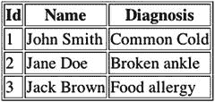

2017

，Java 9 食谱，10.1007/978-1-4842-1976-8_20

# 20.JSON 和 XML 处理

JSON 是最新的，也是最广泛使用的媒体形式之一，用于在两台或多台机器之间发送通信。在扩展形式中，它代表 JavaScript 对象符号。在 Java 9 的规划阶段，计划在发行版中包含一个标准的 JSON 处理(JSON-P) API，但是，增强建议并没有包含在发行版中。相反，通过简单地包含 JSON-P 库(目前包含在 Java EE 中),使用 JSON 数据仍然非常容易。即将发布的 JSON-P 的部分计划是为 Java SE 提供直接支持。

XML APIs 对 Java 开发人员总是可用的，通常作为第三方库提供，可以添加到运行时类路径中。从 Java 7 开始，Java API for XML Processing (JAXP)、Java API for XML Binding (JAXB)和 Java API for XML Web Services(JAX-WS)都包含在核心运行时库中。您将遇到的最基本的 XML 处理任务只涉及几个用例:编写和读取 XML 文档，验证这些文档，以及使用 JAXB 来帮助编组/解组 Java 对象。

本章提供了执行 XML 和 JSON-P 任务的方法。JSON-P 方法需要包含 JSON-P API，这可以通过向 maven 应用程序添加依赖项来实现。在本章中，您将学习如何创建 JSON，以及将它写入磁盘并执行解析。

###### 注意

本章示例的源代码可以在 org.java9recipes.chapter20 包中找到。

## 20-1.编写 XML 文件

### 问题

您希望创建一个 XML 文档来存储应用程序数据。

### 解决办法

若要编写 XML 文档，请使用 javax . XML . stream . XML streamwriter 类。下面的代码循环访问 Patient 对象的数组，并将数据写入。xml 文件。这个示例代码来自 org . Java 9 recipes . chapter 20 . recipe 20 _ 1。DocWriter 示例:

```java
import javax.xml.stream.XMLOutputFactory;
import javax.xml.stream.XMLStreamException;
import javax.xml.stream.XMLStreamWriter;
...
public void run(String outputFile) throws FileNotFoundException, XMLStreamException,
        IOException {
    List<Patient> patients = new ArrayList<>();
    Patient p1 = new Patient();
    Patient p2 = new Patient();
    Patient p3 = new Patient();
    p1.setId(BigInteger.valueOf(1));
    p1.setName("John Smith");
    p1.setDiagnosis("Common Cold");
    p2.setId(BigInteger.valueOf(2));
    p2.setName("Jane Doe");
    p2.setDiagnosis("Broken Ankle");
    p3.setId(BigInteger.valueOf(3));
    p3.setName("Jack Brown");
    p3.setDiagnosis("Food Allergy");
    patients.add(p1);
    patients.add(p2);
    patients.add(p3);
    XMLOutputFactory factory = XMLOutputFactory.newFactory();
    try (FileOutputStream fos = new FileOutputStream(outputFile)) {
        XMLStreamWriter writer = factory.createXMLStreamWriter(fos, "UTF-8");
        writer.writeStartDocument();
        writer.writeCharacters("\n");
        writer.writeStartElement("patients");
        writer.writeCharacters("\n");
        for (Patient p : patients) {
            writer.writeCharacters("\t");
            writer.writeStartElement("patient");
            writer.writeAttribute("id", String.valueOf(p.getId()));
            writer.writeCharacters("\n\t\t");
            writer.writeStartElement("name");
            writer.writeCharacters(p.getName());
            writer.writeEndElement();
            writer.writeCharacters("\n\t\t");
            writer.writeStartElement("diagnosis");
            writer.writeCharacters(p.getDiagnosis());
            writer.writeEndElement();
            writer.writeCharacters("\n\t");
            writer.writeEndElement();
            writer.writeCharacters("\n");
        }
        writer.writeEndElement();
        writer.writeEndDocument();
        writer.close();
    }

}
```

前面的代码写入了以下文件内容:

```java
<?xml version="1.0" ?>
<patients>
    <patient id="1">
        <name>John Smith</name>
        <diagnosis>Common Cold</diagnosis>
    </patient>
    <patient id="2">
        <name>Jane Doe</name>
        <diagnosis>Broken ankle</diagnosis>
    </patient>
    <patient id="3">
        <name>Jack Brown</name>
<diagnosis>Food allergy</diagnosis>
</patient>
</patients>
```

### 它是如何工作的

Java 标准库提供了几种编写 XML 文档的方法。一个模型是 XML 的简单 API(SAX)。更新、更简单、更高效的模型是 XML 流 API(StAX)。这个菜谱使用 javax.xml.stream 包中定义的 StAX。编写 XML 文档需要五个步骤:

1.  创建文件输出流。

2.  创建 XML 输出工厂和 XML 输出流编写器。

3.  在 XML 流编写器中包装文件流。

4.  使用 XML 流编写器的写入方法创建文档并写入 XML 元素。

5.  关闭输出流。

使用 java.io.FileOutputStream 类创建文件输出流。您可以使用 try-block 来打开和关闭该流。在第 [9](09.html) 章中了解更多关于新 try-block 语法的信息。

javax . XML . stream . xmloutputfactory 提供了一个创建输出工厂的静态方法。使用工厂创建 javax . XML . stream . XML streamwriter。

一旦有了编写器，就将文件流对象包装在 XML 编写器实例中。您将使用各种写方法来创建 XML 文档元素和属性。最后，当您完成写入文件时，只需关闭 writer。XMLStreamWriter 实例的一些更有用的方法如下:

*   writeStartDocument()

*   writestartelemont_)

*   writeendelemont_)

*   writeEndDocument()

*   writesttribute _)

创建文件和 XMLStreamWriter 后，应该总是通过调用 writeStartDocumentMethod()方法来开始文档。接下来，通过组合使用 writeStartElement()和 writeEndElement()方法来编写单个元素。当然，元素可以有嵌套元素。您有责任按正确的顺序调用这些方法来创建格式良好的文档。使用 writeAttribute()方法将属性名称和值放入当前元素中。您应该在调用 writeStartElement()方法后立即调用 writeAttribute()。最后，用 writeEndDocument()方法通知文档结束，并关闭 Writer 实例。

使用 XMLStreamWriter 的一个有趣之处是它不格式化文档输出。除非您专门使用 writeCharacters()方法来输出空格和换行符，否则输出将流至单个无格式行。当然，这不会使生成的 XML 文件无效，但是它确实给人们阅读带来了不便和困难。因此，您应该考虑使用 writeCharacters()方法根据需要输出空格和换行符，以创建人类可读的文档。如果不需要文档具有可读性，可以安全地忽略这种编写额外空白和换行符的方法。不管格式如何，XML 文档都是格式良好的，因为它符合正确的 XML 语法。

该示例代码的命令行使用模式如下:

```java
java org.java9recipes.chapter20.recipe20_1.DocWriter <outputXmlFile>
```

调用此应用程序以如下方式创建名为 patients.xml 的文件:

```java
java org.java9recipes.chapter20.recipe20_1.DocWriter patients.xml
```

## 20-2.读取 XML 文件

### 问题

您需要解析 XML 文档，检索已知的元素和属性。

### 解决方案 1

使用 javax . XML . stream . XML streamreader 接口读取文档。使用这个 API，您的代码将使用类似于 SQL 中的类似光标的接口提取 XML 元素，依次处理每个元素。org.java9recipes.DocReader 中的以下代码片段演示了如何读取在前面的配方中生成的 patients.xml 文件:

```java
public void cursorReader(String xmlFile)
throws FileNotFoundException, IOException, XMLStreamException {
    XMLInputFactory factory = XMLInputFactory.newFactory();
    try (FileInputStream fis = new FileInputStream(xmlFile)) {
        XMLStreamReader reader = factory.createXMLStreamReader(fis);
        boolean inName = false;
        boolean inDiagnosis = false;
        String id = null;
        String name = null;
        String diagnosis = null;

        while (reader.hasNext()) {
            int event = reader.next();
            switch (event) {
                case XMLStreamConstants.START_ELEMENT:
                    String elementName = reader.getLocalName();
                    switch (elementName) {
                        case "patient":
                            id = reader.getAttributeValue(0);
                            break;
                        case "name":
                            inName = true;
                            break;
                        case "diagnosis":
                            inDiagnosis = true;
                            break;
                        default:
                            break;
                    }
                    break;
                case XMLStreamConstants.END_ELEMENT:
                    String elementname = reader.getLocalName();
                    if (elementname.equals("patient")) {
                        System.out.printf("Patient: %s\nName: %s\nDiagnosis: %s\n\n",id, name,
                        diagnosis);
                        id = name = diagnosis = null;
                        inName = inDiagnosis = false;
                    }
                    break;
                case XMLStreamConstants.CHARACTERS:
                    if (inName) {
                        name = reader.getText();
                        inName = false;
                    } else if (inDiagnosis) {
                        diagnosis = reader.getText();
                        inDiagnosis = false;
                    }
                    break;
                default:
                    break;
            }
        }
        reader.close();
    }
}
```

### 解决方案 2

使用 XMLEventReader 通过面向事件的接口读取和处理事件。这个 API 也被称为面向迭代器的 API。以下代码与解决方案 1 中的代码非常相似，只是它使用了面向事件的 API，而不是面向光标的 API。这个代码片段可以从同一个 org . Java 9 recipes . chapter 20 . recipe 20 _ 1 获得。解决方案 1 中使用的 DocReader 类:

```java
public void eventReader(String xmlFile)
        throws FileNotFoundException, IOException, XMLStreamException {
    XMLInputFactory factory = XMLInputFactory.newFactory();
    XMLEventReader reader = null;
    try(FileInputStream fis = new FileInputStream(xmlFile)) {
        reader = factory.createXMLEventReader(fis);
        boolean inName = false;
        boolean inDiagnosis = false;
        String id = null;
        String name = null;
        String diagnosis = null;

        while(reader.hasNext()) {
            XMLEvent event = reader.nextEvent();
            String elementName = null;
            switch(event.getEventType()) {
                case XMLEvent.START_ELEMENT:
                    StartElement startElement = event.asStartElement();
                    elementName = startElement.getName().getLocalPart();
                    switch(elementName) {
                        case "patient":
                            id = startElement.getAttributeByName(QName.valueOf("id")).getValue();
                            break;
                        case "name":
                            inName = true;
                            break;
                        case "diagnosis":
                            inDiagnosis = true;
                            break;
                        default:
                            break;
                    }
                    break;
                case XMLEvent.END_ELEMENT:
                    EndElement endElement = event.asEndElement();
                    elementName = endElement.getName().getLocalPart();
                    if (elementName.equals("patient")) {
                        System.out.printf("Patient: %s\nName: %s\nDiagnosis: %s\n\n",id, name, diagnosis);
                        id = name = diagnosis = null;
                        inName = inDiagnosis = false;
                    }
                    break;
                case XMLEvent.CHARACTERS:
                    String value = event.asCharacters().getData();
                    if (inName) {
                        name = value;
                        inName = false;
                    } else if (inDiagnosis) {
                        diagnosis = value;
                        inDiagnosis = false;
                    }
                    break;
            }
        }
    }
    if(reader != null) {
        reader.close();
    }
}
```

### 它是如何工作的

Java 提供了几种读取 XML 文档的方法。一种方法是使用 StAX，一种流模型。它比旧的 SAX API 更好，因为它允许您读写 XML 文档。尽管 StAX 不如 DOM API 强大，但它是一个优秀而高效的 API，对内存资源的消耗较少。

StAX 提供了两种读取 XML 文档的方法:游标 API 和迭代器 API。面向游标的 API 利用游标从头到尾遍历 XML 文档，一次指向一个元素，并且总是向前移动。迭代器 API 将 XML 文档流表示为一组离散的事件对象，按照它们在源 XML 中的读取顺序提供。此时，面向事件的迭代器 API 优于游标 API，因为它为 XMLEvent 对象提供了以下好处:

*   XMLEvent 对象是不可变的，即使 StAX 解析器已经转移到后续事件，这些对象也可以保持不变。您可以将这些 XMLEvent 对象传递给其他进程，或者将它们存储在列表、数组和映射中。

*   您可以子类化 XMLEvent，根据需要创建您自己的专用事件。

*   您可以通过添加或移除事件来修改传入的事件流，这比游标 API 更灵活。

要使用 StAX 读取文档，请在文件输入流上创建一个 XML 事件读取器。使用 hasNext()方法检查事件是否仍然可用，并使用 nextEvent()方法读取每个事件。nextEvent()方法将返回特定类型的 XMLEvent，它对应于 XML 文件中的开始和停止元素、属性和值数据。当您使用完这些对象时，记得关闭您的阅读器和文件流。

您可以像这样调用示例应用程序，使用 patients.xml 文件作为您的<xmlfile>参数:</xmlfile>

```java
java org.java9recipes.chapter20.recipe20_2.DocReader <xmlFile>
```

## 20-3.转换 XML

### 问题

您希望将 XML 文档转换为另一种格式，例如 HTML。

### 解决办法

使用 javax.xml.transform 包将 xml 文档转换为另一种文档格式。

下面的代码演示如何读取源文档，应用可扩展样式表语言(XSL)转换文件，并生成转换后的新文档。使用 org . Java 9 recipes . chapter 20 . recipe 20 _ 3 中的示例代码。TransformXml 类读取 patients.xml 文件并创建 patients.xml 文件。下面的代码片段展示了这个类的重要部分:

```java
import javax.xml.transform.TransformerConfigurationException;
import javax.xml.transform.TransformerException;
import javax.xml.transform.TransformerFactory;
import javax.xml.transform.Transformer;
import javax.xml.transform.Source;
import javax.xml.transform.stream.StreamResult;
import javax.xml.transform.stream.StreamSource;
...
public void run(String xmlFile, String xslFile, String outputFile)
        throws FileNotFoundException, TransformerConfigurationException, TransformerException {
    InputStream xslInputStream = new FileInputStream(xslFile);
    Source xslSource = new StreamSource(xslInputStream);
    TransformerFactory factory = TransformerFactory.newInstance();
    Transformer transformer = factory.newTransformer(xslSource);
    InputStream xmlInputStream = new FileInputStream(xmlFile);
    StreamSource in = new StreamSource(xmlInputStream);
    StreamResult out = new StreamResult(outputFile);
    transformer.transform(in, out);    
    ...
}
```

### 它是如何工作的

javax.xml.transform 包包含将 xml 文档转换成任何其他文档类型所需的所有类。最常见的用例是将面向数据的 XML 文档转换成用户可读的 HTML 文档。

从一种文档类型转换到另一种文档类型需要三个文件:

*   XML 源文档

*   将 XML 元素映射到新文档元素的 XSL 转换文档

*   目标输出文件

XML 源文档当然是您的源数据文件。它通常包含易于编程解析的面向数据的内容。然而，人们不容易阅读 XML 文件，尤其是复杂的、数据丰富的文件。相反，人们更愿意阅读正确呈现的 HTML 文档。

XSL 转换文档指定如何将 XML 文档转换成不同的格式。XSL 文件通常包含一个 HTML 模板，该模板指定了动态字段，这些字段将保存源 XML 文件的提取内容。

在这个例子的源代码中，您会发现两个源文档:

*   第 20 章/recipe20_3/patients.xml

*   第 20 章/收件人 20_3/patients.xsl

patients.xml 文件很短，包含以下数据:

```java
<?xml version="1.0" encoding="UTF-8"?>
<patients>
    <patient id="1">
        <name>John Smith</name>
        <diagnosis>Common Cold</diagnosis>
    </patient>
    <patient id="2">
        <name>Jane Doe</name>
        <diagnosis>Broken ankle</diagnosis>
    </patient>
    <patient id="3">
        <name>Jack Brown</name>
        <diagnosis>Food allergy</diagnosis>
    </patient>
</patients>
```

patients.xml 文件定义了名为 patients 的根元素。它有三个嵌套的病人元素。患者元素包含三段数据:

*   患者标识符，作为患者元素的 id 属性提供

*   患者姓名，作为姓名子元素提供

*   患者诊断，作为诊断子元素提供

转换 xsl 文档(patients.xsl)也很小，它只是使用 XSL 将患者数据映射为更易于用户阅读的 HTML 格式:

```java
<?xml version="1.0" encoding="UTF-8"?>
<xsl:stylesheet xmlns:xsl="http://www.w3.org/1999/XSL/Transform" version="1.0">
<xsl:output method="html"/>
<xsl:template match="/">
<html>
<head>
    <title>Patients</title>
</head>
<body>
    <table border="1">
        <tr>
            <th>Id</th>
            <th>Name</th>
            <th>Diagnosis</th>
        </tr>
        <xsl:for-each select="patients/patient">
        <tr>
            <td>
        <xsl:value-of select="@id"/>
            </td>
            <td>
        <xsl:value-of select="name"/>
            </td>
            <td>
        <xsl:value-of select="diagnosis"/>
            </td>
            </tr>
        </xsl:for-each>
    </table>
</body>
</html>
        </xsl:template>
        </xsl:stylesheet>
```

使用这个样式表，示例代码将 XML 转换成包含所有患者及其数据的 HTML 表。在浏览器中呈现时，HTML 表格应该如图 [20-1](#Fig1) 所示。



###### 图 20-1。HTML 表格的常见呈现

使用这个 XSL 文件将 XML 转换成 HTML 文件的过程很简单，但是每一步都可以通过额外的错误检查和处理来增强。对于此示例，请参考解决方案一节中前面的代码。

最基本的转换步骤如下:

1.  将 XSL 文档作为源对象读入 Java 应用程序。

2.  创建一个 Transformer 实例，并提供您的 XSL 源实例供它在操作过程中使用。

3.  创建表示源 XML 内容的 SourceStream。

4.  为输出文档创建一个 StreamResult 实例，在本例中是一个 HTML 文件。

5.  使用 Transformer 对象的 transform()方法来执行转换。

6.  根据需要关闭所有相关的流和文件实例。

如果您选择执行示例代码，您应该以下列方式调用它，使用 patients.xml、patients.xsl 和 patients.xml 作为参数:

```java
java org.java9recipes.chapter20.recipe20_3.TransformXml <xmlFile><xslFile><outputFile>
```

## 20-4.验证 XML

### 问题

您希望确认您的 XML 是有效的——它符合已知的文档定义或模式。

### 解决办法

使用 javax.xml.validation 包验证您的 XML 是否符合特定的模式。以下代码片段来自 org . Java 9 recipes . chapter 20 . recipe 20 _ 4。ValidateXml 演示了如何根据 Xml 模式文件进行验证:

```java
import java.io.File;
import java.io.IOException;
import javax.xml.XMLConstants;
import javax.xml.transform.Source;
import javax.xml.transform.stream.StreamSource;
import javax.xml.validation.Schema;
import javax.xml.validation.SchemaFactory;
import javax.xml.validation.Validator;
import org.xml.sax.SAXException;
...
public void run(String xmlFile, String validationFile) {
    boolean valid = true;
    SchemaFactory sFactory =
            SchemaFactory.newInstance(XMLConstants.W3C_XML_SCHEMA_NS_URI);
    try {
        Schema schema = sFactory.newSchema(new File(validationFile));
        Validator validator = schema.newValidator();
        Source source = new StreamSource(new File(xmlFile));
        validator.validate(source);
    } catch (SAXException | IOException | IllegalArgumentException ex) {
        valid = false;
    }
    System.out.printf("XML file is %s.\n", valid ? "valid" : "invalid");
}
...
```

### 它是如何工作的

使用 XML 时，验证它以确保语法正确，并确保 XML 文档是指定 XML 模式的实例是很重要的。验证过程包括比较模式和 XML 文档，找出任何差异。javax.xml.validation 包提供了根据各种模式可靠地验证 xml 文件所需的所有类。将用于 XML 验证的最常见模式被定义为 XMLConstants 类中的常量 URIs:

*   XMLConstants。W3C _ XML _ 架构 _NS_URI

*   XML 常量。松弛 _NS_URI

首先为特定类型的模式定义创建一个 SchemaFactory。SchemaFactory 知道如何解析特定的模式类型，并为验证做准备。使用 SchemaFactory 实例创建架构对象。模式对象是模式定义语法的内存表示。您可以使用 Schema 实例来检索理解这种语法的验证器实例。最后，使用 validate()方法检查 XML。如果在验证过程中出现任何问题，方法调用将生成几个异常。否则，validate()方法会安静地返回，您可以继续使用 XML 文件。

###### 注意

XML 模式在 2001 年第一次获得万维网联盟(W3C)的“推荐”地位。竞争模式从此变得可用。一个竞争模式是 XML 下一代正则语言(RELAX NG)模式。RELAX NG 可能是一种更简单的模式，它的规范也定义了一种非 XML 的紧凑语法。这个食谱的例子使用了 XML 模式。

使用以下命令行语法运行示例代码，最好使用示例。xml 文件和验证文件分别作为 resources/patients.xml 和 patients.xsl 提供:

```java
java org.java9recipes.chapter20.recipe20_4.ValidateXml <xmlFile><validationFile>
```

## 20-5.为 XML 模式创建 Java 绑定

### 问题

您希望生成一组 Java 类(Java 绑定),它们代表 XML 模式中的对象。

### 解决办法

JDK 提供了一个工具，可以将模式文档转换成有代表性的 Java 类文件。使用 <jdk_home>/bin/xjc 命令行工具为 XML 模式生成 Java 绑定。要从配方 20-3 中为 patients.xsd 文件创建 Java 类，您可以在控制台中发出以下命令:</jdk_home>

```java
xjc –p org.java9recipes.chapter20.recipe20_5 patients.xsd
```

该命令将处理 patients.xsd 文件，并创建处理用该模式验证的 XML 文件所需的所有类。对于此示例，patients.xsd 文件如下所示:

```java
<?xml version="1.0" encoding="UTF-8"?>
<xs:schema xmlns:xs="http://www.w3.org/2001/XMLSchema" elementFormDefault="qualified">
<xs:element name="patients">
<xs:complexType>
<xs:sequence>
<xs:element maxOccurs="unbounded" name="patient" type="Patient"/>
</xs:sequence>
</xs:complexType>
</xs:element>
<xs:complexType name="Patient">
<xs:sequence>
<xs:element name="name" type="xs:string"/>
<xs:element name="diagnosis" type="xs:string"/>
</xs:sequence>
<xs:attribute name="id" type="xs:integer" use="required"/>
</xs:complexType>
</xs:schema>
```

在前面的 xsd 文件上执行的 xjc 命令在 org . Java 9 recipes . chapter 20 . recipe 20 _ 5 包中创建以下文件:

*   ObjectFactory.java

*   Patients.java

*   Patient.java

### 它是如何工作的

JDK 包括了 <jdk_home>/bin/xjc 实用程序。xjc 实用程序是一个命令行应用程序，它从模式文件创建 Java 绑定。源模式文件可以有多种类型，包括 XML 模式、RELAX NG 等。</jdk_home>

xjc 命令有几个选项来执行它的工作。一些最常见的选项指定了源模式文件、生成的 Java 绑定文件的包以及将接收 Java 绑定文件的输出目录。

您可以通过使用工具的–help 选项获得所有命令行选项的详细描述:

```java
xjc –help
```

Java 绑定包含带注释的字段，这些字段对应于 XML 模式文件中定义的字段。这些注释标记了模式文件的根元素和所有其他子元素。这在 XML 处理的下一步中非常有用，包括解组或编组这些绑定。

## 20-6.将 XML 解组到 Java 对象

### 问题

您希望解组一个 XML 文件，并创建其对应的 Java 对象树。

### 解决办法

解组是将数据格式(在本例中为 XML)转换成对象的内存表示形式以便用于执行任务的过程。JAXB 提供了一个解组服务，它解析一个 XML 文件，并根据您在 Recipe 20-4 中创建的绑定生成 Java 对象。以下代码可以从 org . Java 9 recipes . chapter 20 . recipe 20-6 包中读取 patients.xml 文件，以创建 patients 根对象及其 Patient 对象列表:

```java
public void run(String xmlFile, String context)
        throws JAXBException, FileNotFoundException {
    JAXBContext jc = JAXBContext.newInstance(context);
    Unmarshaller u = jc.createUnmarshaller();
    FileInputStream fis = new FileInputStream(xmlFile);
    Patients patients = (Patients)u.unmarshal(fis);
    for (Patient p: patients.getPatient()) {
        System.out.printf("ID: %s\n", p.getId());
        System.out.printf("NAME: %s\n", p.getName());
        System.out.printf("DIAGNOSIS: %s\n\n", p.getDiagnosis());
    }
}
```

如果您在 chapter 20/recipe 20 _ 6/patients . XML 文件上运行示例代码并使用 org.java9recipes.chapter20 上下文，应用程序将在遍历患者对象列表时向控制台打印以下内容:

```java
ID: 1
NAME: John Smith
DIAGNOSIS: Common Cold

ID: 2
NAME: Jane Doe
DIAGNOSIS: Broken ankle

ID: 3
NAME: Jack Brown
DIAGNOSIS: Food allergy
```

###### 注意

前面的输出直接来自 Java Patient 类的实例，该类是由 XML 表示创建的。代码不直接打印 XML 文件的内容。相反，在 XML 被整理成适当的 Java 绑定实例之后，它打印 Java 绑定的内容。

### 它是如何工作的

将 XML 文件解组为 Java 对象表示至少有两个标准:

*   一个格式良好且有效的 XML 文件

*   一组相应的 Java 绑定

Java 绑定不必通过 xjc 命令自动生成。一旦您获得了一些 Java 绑定和注释特性的经验，您可能更喜欢通过手工制作 Java 绑定来创建和控制 Java 绑定的所有方面。无论您的偏好是什么，Java 的解组服务都利用绑定及其注释将 XML 对象映射到目标 Java 对象，并将 XML 元素映射到目标对象字段。

使用以下语法执行该配方的示例应用程序，用 patients.xml 和 org . Java 9 recipes . chapter 20 . recipe 20 _ 6 替换相应的参数:

```java
java org.java9recipes.chapter20.recipe20_6.UnmarshalPatients <xmlfile><context>
```

## 20-7.用 JAXB 构建 XML 文档

### 问题

您需要将对象的数据写入 XML 表示。

### 解决办法

假设您已经按照 Recipe 20-4 中的描述为 XML 模式创建了 Java 绑定文件，那么您可以使用 JAXBContext 实例来创建一个编组器对象。然后使用 Marshaller 对象将 Java 对象树序列化为 XML 文档。下面的代码演示了这一点:

```java
public void run(String xmlFile, String context)
        throws JAXBException, FileNotFoundException {
    Patients patients = new Patients();
    List<Patient> patientList = patients.getPatient();
    Patient p = new Patient();
    p.setId(BigInteger.valueOf(1));
    p.setName("John Doe");
    p.setDiagnosis("Schizophrenia");
    patientList.add(p);

    JAXBContext jc = JAXBContext.newInstance(context);
    Marshaller m = jc.createMarshaller();
    m.marshal(patients, new FileOutputStream(xmlFile));
}
```

前面的代码生成了一个无格式但格式良好的有效 XML 文档。为了提高可读性，XML 文档的格式如下:

```java
<?xml version="1.0" encoding="UTF-8" standalone="yes"?>
    <patients>
    <patient id="1">
        <name>John Doe</name>
        <diagnosis>Schizophrenia</diagnosis>
    </patient>
    </patients>
```

###### 注意

前面代码中的 getPatient()方法返回患者对象的列表，而不是单个患者。在这个例子中，这是从 XSD 模式生成的 JAXB 代码的一个奇怪的命名。

### 它是如何工作的

编组器对象理解 JAXB 注释。在处理类时，它使用 JAXB 注释来提供用 XML 创建对象树所需的上下文。

您可以从 org . Java 9 recipes . chapter 20 . recipe 20 _ 7 运行前面的代码。使用以下命令行封送患者应用程序:

```java
java org.java9recipes.chapter20.recipe20_7.MarshalPatients <xmlfile><context>
```

上下文参数指的是您将封送的 Java 类的包。在前面的示例中，因为代码封送了一个 Patients 对象树，所以正确的上下文是 Patients 类的包名。在本例中，上下文是 org.java9recipes.chapter20。

## 20-8.解析 XML 目录

### 问题

出于安全目的或其他需要，您需要解析 XML 目录，以便将远程外部引用指向本地目录。

### 解决办法

利用 Java 9 中的标准 XML 目录 API。在本例中，使用 API 读取并解析本地目录。

```java
public static void main(String[] args) {
        // Create a CatalogFeatures object
        CatalogFeatures defaults = CatalogFeatures.defaults();

        // Resolve using properties
        // System.setProperty("javax.xml.catalog.files", "catalog.xml");

        // Resolve by passing
        Catalog catalog = CatalogManager.catalog(defaults, "catalog.xml", "catalog-alt.xml");

        // Use CatalogFeatures to specify catalog files and/or additional features
        // CatalogFeatures catalogFeatures = CatalogFeatures.builder()
        //         .with(Feature.FILES, "catalog.xml")
        //         .with(Feature.RESOLVE, "ignore")
        //         .build();

        // Stream and filter to find the catalog matching your specification
        Optional<Catalog> cat = catalog.catalogs()
                .filter((c)->c.matchURI("calstblx.dtd") != null)
                .findFirst();

        // Do something with catalog
    }
```

### 它是如何工作的

JDK 历来将 XML 解析器作为其核心的一部分。然而，这个解析器是私有的，仅由 JDK 使用。随着时间的推移，实现公共 XML 解析器的需求变得越来越明显，因此私有解析器被改进为一个新的公共 API。API 允许管理 XML 目录和解析器的创建，它实现了 OASIS XML 目录 1.1 规范，并且实现了现有的 JAXP 接口。

有许多关键的接口和类组成了 Catalog API。目录接口可用于表示实体目录。CatalogManager 用于通过传递 CatalogFeatures 配置对象以及包含 XML 目录文件路径的变量参数来解析目录。它还可以用于生成 CatalogResolvers。还可以通过指定“javax.xml.catalog.files”属性来传递一个或多个目录文件的路径，如示例所示。

```java
System.setProperty("javax.xml.catalog.files", "catalog.xml");
```

CatalogFeatures 对象包含许多属性和功能，调用 CatalogFeatures.defaults()方法可以获得默认实现。要为 CatalogFeatures 对象指定不同的值，可以利用构建器模式来指示每个不同特性的值。这些特征可以在表 [20-1](#Tab1) 中看到。

###### 表 20-1。目录功能

<colgroup class="calibre15"><col class="calibre16"> <col class="calibre16"> <col class="calibre16"></colgroup> 
| 

特征

 | 

财产

 | 

描述

 |
| --- | --- | --- |
| 文件 | javax.xml.catalog.files | 分号分隔的目录文件列表。 |
| 更喜欢 | javax.xml.catalog.prefer | 指示公共标识符和系统标识符之间的首选项。 |
| 推迟 | javax.xml.catalog.defer | 指示只有在需要时才会读取委托目录。 |
| 分解 | javax.xml.catalog.resolve | 确定未找到匹配目录时要采取的操作。 |

有关 CatalogFeatures 的更多信息，请参考 JavaDoc([http://download . Java . net/Java/JDK 9/docs/API/javax/XML/catalog/catalog features . html](http://download.java.net/java/jdk9/docs/api/javax/xml/catalog/CatalogFeatures.html))。

可以调用 Catalog.catalogs()方法，使用当前目录中的 nextCatalog 条目生成一个备选目录流。这种解析可以用来匹配 XML 目录中的条目。

XML Catalog API 是对 JDK 的一个很好的补充，使得在需要时利用本地目录而不是远程目录变得容易。Java 很早就有了目录解析器，但是它不能在 JDK 内部之外使用。新的 API 是旧的私有 API 的更新形式，它完全符合 OASIS XML Catalogs 1.1 规范。

## 20-9.使用 JSON

### 问题

您对在 Java SE 9 应用程序中使用 JSON 感兴趣。

### 解决办法

将 JSON-P API 作为依赖项添加到 Java SE 9 应用程序中。有几个选项可以添加依赖项。可以下载 JAR 并将其放入类路径，或者如果使用 Maven 之类的构建工具，只需添加项目存储库的坐标。下面几行摘自 POM 文件(Maven 的项目对象模块)，说明如何添加依赖项。

```java
<dependencies>
        <dependency>
            <groupId>javax.json</groupId>
            <artifactId>javax.json-api</artifactId>
            <version>1.0</version>
        </dependency>
        <dependency>
            <groupId>org.glassfish</groupId>
            <artifactId>javax.json</artifactId>
            <version>1.0.4</version>
        </dependency>
...
</dependencies>
```

### 它是如何工作的

随着 Java EE 7 的发布，JavaScript Object Notation(JSON-P)API 被添加到 Java 企业平台中。JSON-P，也称为“JSON 处理”，已经成为使用 Java 构建 JSON 对象的标准方式。因为 Java 9 没有捆绑 JSON 构建和解析 API，所以必须引入必要的依赖项来利用标准化的 JSON-P API。JSON-P 是 Java EE 的一部分，但是在这一点上 Java SE 没有提供支持。因此，通过将下载的 JAR 文件添加到类路径中，或者将 Maven 坐标添加到项目 POM 文件中，很容易包含 API。在解决方案中，我介绍了如何利用 Maven 坐标。但是，请确保相应地更新版本。

## 20-10.构建 JSON 对象

### 问题

您希望在 Java 应用程序中构建一个 JSON 对象。

### 解决办法

利用 JSON-P API 构建一个 JSON 对象。在下面的代码中，构建了一个属于一本书的 JSON 对象。

```java
public JsonObject buildBookObject() {
    JsonBuilderFactory factory = Json.createBuilderFactory(null);
    JsonObject obj = factory.createObjectBuilder()
            .add("title", "Java 9 Recipes")
            .add("author", "Josh Juneau")
            .add("projectCoordinator", "Jill Balzano")
            .add("editor", "Jonathan Gennick")
            .build();

    return obj;
}
```

### 它是如何工作的

JSON-P API 包括一个 helper 类，可以使用 builder 模式创建 JSON 对象。使用 JsonObjectBuilder，可以通过一系列方法调用构建 JSON 对象，每个方法调用都建立在另一个方法调用的基础上——因此，就有了构建器模式。一旦构建了 JSON 对象，就可以调用 JsonObjectBuilder.build()方法来返回 JSON object。

在这个菜谱的例子中，您构建了一个 JSON 对象，它提供了关于一本书的详细信息。JsonObjectBuilder.beginObject()方法用于表示正在创建一个新对象。add 方法用于添加更多的名称/值属性，非常类似于映射。因此，下面一行添加了一个名为 title 的属性，其值为“Java 9 Recipes”:

```java
.add("title", "Java 9 Recipes")
```

对象可以相互嵌入，在一个 JsonObject 中创建子部分的层次结构。例如，在第一次调用 add()之后，通过调用 jsonbuilderfactory . createobjectbuilder()作为 add()操作的值，并传递嵌入对象的名称，可以将另一个对象嵌入到初始 JsonObject 中。嵌入对象也可以包含属性；因此，要向嵌入对象添加属性，请在嵌入对象中调用 add()方法。JsonObjects 可以根据需要包含任意多的嵌入对象。如果我们要修改示例中的源代码，按名字和姓氏分解作者，下面几行代码演示了嵌入对象定义的开始和结束:

```java
.add("author", factory.createObjectBuilder()
    .add("first", "Josh")
    .add("last", "Juneau"))
.add("projectCoordinator", "Jill Balzano")
```

JsonObject 也可能有一个相关子对象的数组。若要添加子对象的数组，请调用 jsonbuilderfactory . createarraybuilder()方法，并将数组的名称作为参数传递。数组可以由对象组成，甚至可以由对象、数组等的层次结构组成。

一旦创建了 JsonObject，就可以将其传递给客户机。WebSockets 可以很好地将 JsonObjects 传递回客户机，但是有许多不同的技术可以用来与 JSON 通信。

## 20-11.将 JSON 对象写入文件

### 问题

您已经生成或解析了一个 JSON 对象，并且希望将它以文件格式存储在磁盘上。

### 解决办法

利用 JSON-P API 构建一个 JSON 对象，然后将它存储到文件系统中。JsonWriter 类可以在磁盘上创建一个文件，然后将 JSON 写入该文件。在下面的例子中，在配方 20-10 中生成的 JsonObject 使用这种技术写入磁盘。

```java
public static void writeJson() {
    JsonObject jsonObject = buildBookObject();
    try (javax.json.JsonWriter jsonWriter = Json.createWriter(new FileWriter("Book.json"))) {
        jsonWriter.writeObject(jsonObject);
    } catch (IOException ex) {
        System.out.println(ex);
    }
}
```

### 它是如何工作的

JsonWriter 类可用于将 JsonObject 写入 Java writer 对象。通过将 Writer 对象作为参数传递给 Json.createWriter()方法来实例化 JsonWriter。创建 JsonWriter 后，可以调用 JsonWriter.writeObject()方法，传递要编写的 JsonObject。一旦编写了 JsonObject，就可以通过调用它的 close()方法来关闭 JsonWriter。这些是将 JSON 对象写入 Java Writer 类类型所必需的唯一步骤。

## 20-12.解析 JSON 对象

### 问题

您创建的应用程序需要能够读取 JSON 对象并相应地解析它。

### 解决办法

利用 JsonReader 对象读取 JSON 对象，然后利用 JsonParser 对象对 JSON 数据执行操作。下面的例子演示了如何从磁盘读取一个文件，然后解析它以显示一些内容。

```java
public void parseObject() {
    Reader fileReader = new InputStreamReader(getClass().getResourceAsStream("Book.json"));
    JsonParser parser = Json.createParser(fileReader);
    while (parser.hasNext()) {
        Event ev = parser.next();
        System.out.println(ev);
        if (ev.equals(Event.VALUE_STRING)) {
            System.out.println(parser.getString());
        }
    }
}
```

在这个例子中，名为 Book.json 的 Json 文件被读取和解析。当解析过程中遇到 VALUE_STRING 事件时，将打印该字符串。还会打印每个遇到的事件。以下输出是结果:

```java
START_OBJECT
KEY_NAME
VALUE_STRING
Java 9 Recipes
KEY_NAME
VALUE_STRING
Josh Juneau
KEY_NAME
VALUE_STRING
Jill Balzano
KEY_NAME
VALUE_STRING
Jonathan Gennick
END_OBJECT
```

### 它是如何工作的

一旦 JSON 对象被持久化到磁盘上，以后就需要将它读回以供使用。JsonReader 对象负责这项任务。要创建 JsonReader 对象，请调用 Json.createReader()方法，传递 InputStream 或 Reader 对象。一旦创建了 JsonReader 对象，就可以通过调用它的 readObject 方法来生成 JsonObject。

为了执行某些任务，必须对 JSON 对象进行解析，以便只找到对当前任务有用的内容。利用 JSON 解析器可以使这样的工作变得更容易，因为解析器能够将对象分解成多个部分，以便可以根据需要检查每个不同的部分，从而产生想要的结果。

javax.json.Json 类包含一个静态工厂方法 createParser()，该方法接受一组输入并返回一个可迭代的 JsonParser。表 [20-2](#Tab2) 列出了通过 createParser()方法接受的不同可能的输入类型。

###### 表 20-2。createParser 方法输入类型

<colgroup class="calibre15"><col class="calibre16"> <col class="calibre16"></colgroup> 
| 

输入类型

 | 

方法调用

 |
| --- | --- |
| 输入流 | createpresser(input stream in) |
| JsonArray | createpresser(jsonaarray arr) |
| JsonObject | createParser(JsonObject obj) |
| 读者 | createParser(阅读器阅读器) |

一旦创建了 JsonParser，就可以将它变成事件对象的迭代器。每个事件都与 JSON 对象中的不同结构相关联。例如，当创建 JSON 对象时，会发生 START_OBJECT 事件，添加名称/值对会触发 KEY_NAME 和 VALUE_STRING 事件。可以利用这些事件从 JSON 对象中获取所需的信息。在本例中，事件名称只是打印到服务器日志中。然而，在现实生活的应用程序中，条件最有可能测试每个迭代，以找到一个特定的事件，然后执行一些处理。表 [20-3](#Tab3) 列出了不同的 JSON 事件，以及每个事件发生的时间描述。

###### 表 20-3。JSON 对象事件

<colgroup class="calibre15"><col class="calibre16"> <col class="calibre16"></colgroup> 
| 

事件

 | 

出现

 |
| --- | --- |
| 开始 _ 对象 | 对象的开始。 |
| 结束对象 | 对象的结尾。 |
| 开始 _ 数组 | 数组的开始。 |
| END _ 数组 | 数组结尾。 |
| KEY_NAME | 密钥的名称。 |
| 值 _ 字符串 | 字符串格式的名称/值对的值。 |
| 值 _ 数字 | 数值格式的名称/值对的值。 |
| 值 _ 真 | 布尔格式的名称/值对的值。 |
| VALUE_FALSE | 布尔格式的名称/值对的值。 |
| 值为空 | 名称/值对的值为 NULL。 |

## 摘要

XML 通常用于在不同的应用程序之间传输数据，或者将某种类型的数据存储到文件中。因此，理解在应用程序开发平台中使用 XML 的基础非常重要。本章概述了如何使用 Java 执行一些处理 XML 的关键任务。本章从编写和阅读 XML 的基础开始。然后演示了如何将 XML 转换成不同的格式，以及如何根据 XML 模式进行验证。

这一章还提到了使用 JSON。尽管 Java SE 9 没有附带 JSON API，但是可以很容易地利用 JSON-P API 来生成、编写和解析 JSON 数据。本章演示了如何执行这些任务。