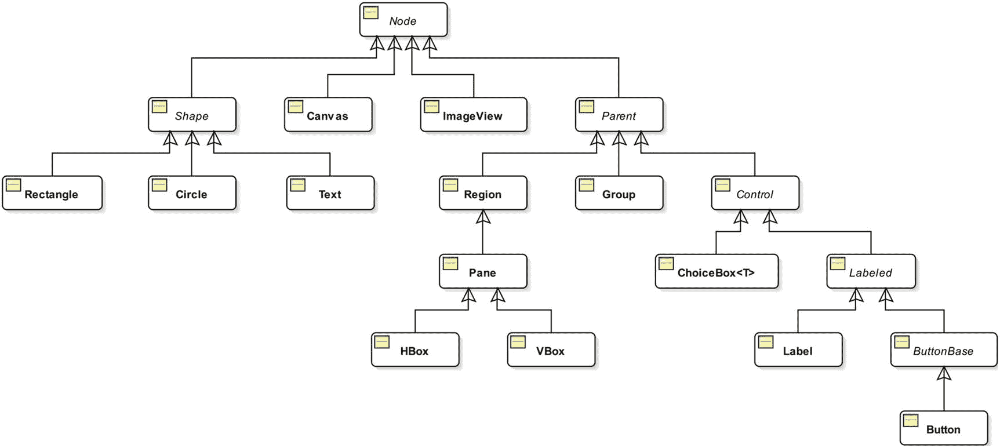
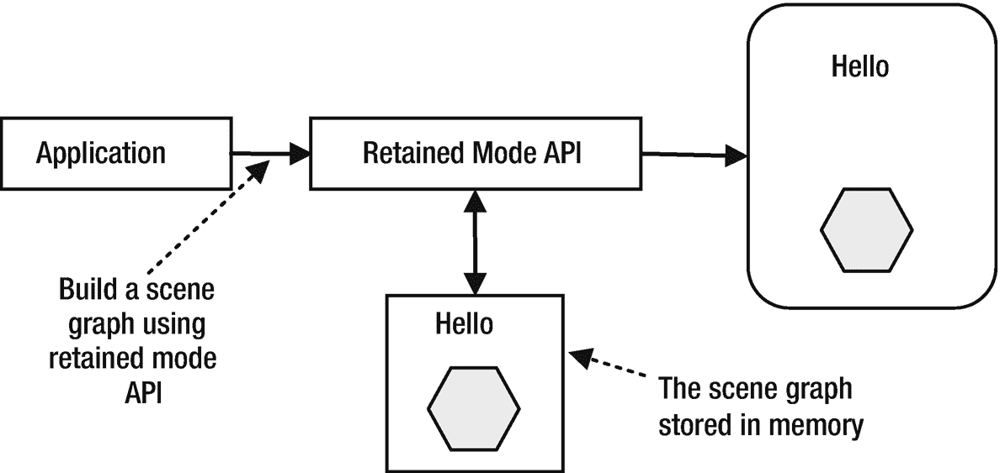
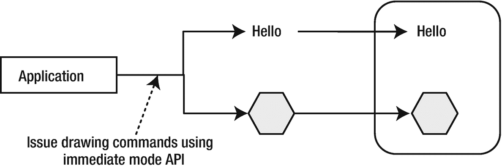

# 5.制造场景

在本章中，您将学习:

*   JavaFX 应用程序中的场景和场景图是什么

*   关于场景图形的不同渲染模式

*   如何为场景设置光标

*   如何确定场景中的焦点所有者

*   如何使用`Platform`和`HostServices`类

本章的例子在`com.jdojo.scene`包中。为了让它们工作，您必须在`module-info.java`文件中添加相应的一行:

```java
...
opens com.jdojo.scene to javafx.graphics, javafx.base;
...

```

## 什么是场景？

一个*场景*代表一个舞台的视觉内容。`javafx.scene`包中的`Scene`类表示 JavaFX 程序中的一个场景。一个`Scene`对象一次最多只能连接到一个载物台。如果已经附加的场景被附加到另一个舞台，它将首先与前一个舞台分离。一个舞台在任何时候最多只能附加一个场景。

场景包含由可视节点组成的场景图。在这个意义上，场景充当了场景图的容器。场景图是一个树形数据结构，其元素被称为*节点*。场景图中的节点形成父子层次关系。场景图中的节点是`javafx.scene.Node`类的一个实例。节点可以是分支节点或叶节点。分支节点可以有子节点，而叶节点则不能。场景图中的第一个节点称为*根*节点。根节点可以有子节点；但是，它从来没有父节点。图 [5-1](#Fig1) 显示了场景图中节点的排列。分支节点显示在圆角矩形中，叶节点显示在矩形中。


图 5-1

场景图中节点的排列

JavaFX 类库提供了许多类来表示场景图中的分支和叶节点。`javafx.scene`包中的`Node`类是场景图中所有节点的超类。图 [5-2](#Fig2) 显示了代表节点的类的部分类图。



图 5-2

`javafx.scene.Node`类的部分类图

场景总是有一个根节点。如果根节点是可调整大小的，例如一个`Region`或一个`Control`，它跟踪场景的大小。也就是说，如果调整了场景的大小，可调整大小的根节点会调整自身的大小以填充整个场景。基于根节点的策略，当场景的大小改变时，场景图可以被再次布局。

`Group`是一个不可调整大小的`Parent`节点，它可以被设置为场景的根节点。如果一个`Group`是一个场景的根节点，那么场景图的内容会被场景的大小裁剪掉。如果调整了场景的大小，场景图形将不会重新布局。

`Parent`是一个抽象类。它是场景图中所有分支节点的基类。如果要将分支节点添加到场景图形，请使用其具体子类之一的对象，例如，`Group`、`Pane`、`HBox`或`VBox`。作为`Node`类而不是`Parent`类的子类的类表示叶节点，例如`Rectangle`、`Circle`、`Text`、`Canvas`或`ImageView`。场景图的根节点是一个特殊的分支节点，它是最顶端的节点。这就是创建`Scene`对象时使用`Group`或`VBox`作为根节点的原因。我将在第 [10](10.html) 和 [12](12.html) 章详细讨论表示分支和叶节点的类。表 [5-1](#Tab1) 列出了`Scene`类的一些常用属性。

表 5-1

`Scene`类的常用属性

<colgroup><col class="tcol1 align-left"> <col class="tcol2 align-left"> <col class="tcol3 align-left"></colgroup> 
| 

类型

 | 

名字

 | 

属性和描述

 |
| --- | --- | --- |
| `ObjectProperty<Cursor>` | `cursor` | 它为`Scene`定义了鼠标光标。 |
| `ObjectProperty<Paint>` | `fill` | 它定义了`Scene`的背景填充。 |
| `ReadOnlyObjectProperty<Node>` | `focusOwner` | 它定义了`Scene`中拥有焦点的节点。 |
| `ReadOnlyDoubleProperty` | `height` | 它定义了`Scene`的高度。 |
| `ObjectProperty<Parent>` | `root` | 它定义了场景图的根`Node`。 |
| `ReadOnlyDoubleProperty` | `width` | 它定义了`Scene`的宽度。 |
| `ReadOnlyObjectProperty<Window>` | `window` | 它为`Scene`定义了`Window`。 |
| `ReadOnlyDoubleProperty` | `x` | 它定义了`Scene`在窗口上的水平位置。 |
| `ReadOnlyDoubleProperty` | `y` | 它定义了`Scene`在窗口上的垂直位置。 |

## 图形渲染模式

场景图在屏幕上呈现 JavaFX 应用程序的内容时起着至关重要的作用。通常，有两种类型的 API 用于在屏幕上呈现图形:

*   即时模式 API

*   保留模式 API

在即时模式 API 中，当屏幕上需要一个框架时，应用程序负责发出绘制命令。图形直接画在屏幕上。当屏幕需要重新绘制时，应用程序需要向屏幕重新发出绘制命令。Java2D 是即时模式图形渲染 API 的一个例子。

在保留模式 API 中，应用程序创建图形对象并将其附加到图形。图形库，而不是应用程序代码，将图形保存在内存中。需要时，图形库会将图形呈现在屏幕上。应用程序只负责创建图形对象——“什么”部分；图形库负责存储和渲染图形，即“何时”和“如何”部分。保留模式呈现 API 将开发人员从编写呈现图形的逻辑中解放出来。例如，通过使用高级 API 从图形中添加或移除图形对象，从屏幕中添加或移除图形的一部分是简单的；图形库负责剩下的工作。与即时模式相比，保留模式 API 使用更多的内存，因为图形存储在内存中。JavaFX 场景图使用保留模式 API。

您可能认为使用即时模式 API 总是比使用保留模式 API 更快，因为前者直接在屏幕上呈现图形。然而，使用保留模式 API 打开了类库优化的大门，这在即时模式下是不可能的，在即时模式下，每个开发人员负责编写关于应该呈现什么以及何时呈现的逻辑。

图 [5-3](#Fig3) 和 [5-4](#Fig4) 分别说明了立即模式和保留模式 API 是如何工作的。它们展示了如何使用这两个 API 在屏幕上绘制文本、Hello 和六边形。



图 5-4

保留模式 API 的示例



图 5-3

即时模式 API 的示例

## 为场景设置光标

`javafx.scene.Cursor`类的一个实例代表一个鼠标光标。`Cursor`类包含许多常量，例如，`HAND`，`CLOSED_HAND`，`DEFAULT`，`TEXT`，`NONE`，`WAIT`，用于标准鼠标光标。以下代码片段为场景设置`WAIT`光标:

```java
Scene scene;
...
scene.setCursor(Cursor.WAIT);

```

您也可以为场景创建和设置自定义光标。如果指定的`name`是一个标准光标的名字，`Cursor`类的`cursor(String name)`静态方法返回一个标准光标。否则，它将指定的`name`视为光标位图的 URL。下面的代码片段从一个名为`mycur.png`的位图文件中创建一个光标，该文件假定位于`CLASSPATH`中:

```java
// Create a Cursor from a bitmap
URL url = getClass().getClassLoader().getResource("mycur.png");
Cursor myCur = Cursor.cursor(url.toExternalForm());
scene.setCursor(myCur);

// Get the WAIT standard cursor using its name
Cursor waitCur = Cursor.cursor("WAIT")
scene.setCursor(waitCur);

```

## 场景中的焦点所有者

场景中只有一个节点可以是焦点所有者。`Scene`类的`focusOwner`属性跟踪拥有焦点的`Node`类。注意`focusOwner`属性是只读的。如果您希望场景中的特定节点成为焦点所有者，您需要调用`Node`类的`requestFocus()`方法。

您可以使用`Scene`类的`getFocusOwner()`方法来获取场景中具有焦点的节点的引用。一个场景可能没有焦点所有者，在这种情况下，`getFocusOwner()`方法返回`null`。例如，场景在创建时没有焦点所有者，但没有附加到窗口。

理解焦点所有者和拥有焦点的节点之间的区别很重要。每个场景可能有一个焦点所有者。比如打开两个窗口，就有两个场景，可以有两个焦点拥有者。但是，一次只能有两个焦点所有者中的一个拥有焦点。活动窗口的焦点所有者将获得焦点。要检查焦点所有者节点是否也有焦点，您需要使用`Node`类的`focused`属性。下面的代码片段显示了使用焦点所有者的典型逻辑:

表 5-2

平台类的方法

<colgroup><col class="tcol1 align-left"> <col class="tcol2 align-left"></colgroup> 
| 

方法

 | 

描述

 |
| --- | --- |
| `void exit()` | 它终止一个 JavaFX 应用程序。 |
| `boolean isFxApplicationThread()` | 如果调用线程是 JavaFX 应用程序线程，则返回`true`。否则返回`false`。 |
| `boolean isImplicitExit()` | 它返回应用程序的隐式`implicitExit`属性的值。如果它返回`true`，意味着应用程序将在最后一个窗口关闭后终止。否则，你需要调用这个类的`exit()`方法来终止应用程序。 |
| `boolean isSupported(ConditionalFeature feature)` | 如果平台支持指定的条件特性，则返回`true`。否则返回`false`。 |
| `void runLater(Runnable runnable)` | 它在 JavaFX 应用程序线程上执行指定的`Runnable`。执行的时间没有规定。该方法将`Runnable`发送到事件队列并立即返回。如果使用这种方法提交了多个`Runnables`，它们将按照提交到队列的顺序执行。 |
| `void setImplicitExit(boolean value)` | 它将`implicitExit`属性设置为指定的值。 |

```java
Scene scene;
...
Node focusOwnerNode = scene.getFocusOwner();
if (focusOwnerNode == null) {
        // The scene does not have a focus owner
}
else if (focusOwnerNode.isFocused()) {
        // The focus owner is the one that has the focus
}
else {
        // The focus owner does not have the focus
}

```

## 了解*平台*类

`javafx.application`包中的`Platform`类是用于支持平台相关功能的实用程序类。它由所有静态方法组成，这些方法在表 [5-2](#Tab2) 中列出。

`runLater()`方法用于向事件队列提交一个`Runnable`任务，因此它在 JavaFX 应用程序线程上执行。JavaFX 允许开发人员只在 JavaFX 应用程序线程上执行一些代码。清单 [5-1](#PC5) 在`init()`方法中创建一个在 JavaFX 启动器线程上调用的任务。它使用`Platform.runLater()`方法提交稍后要在 JavaFX 应用程序线程上执行的任务。

Tip

使用`Platform.runLater()`方法执行在 JavaFX 应用程序线程之外的线程上创建的任务，但该任务需要在 JavaFX 应用程序线程上运行。

```java
// RunLaterApp.java
package com.jdojo.scene;

import javafx.application.Application;
import javafx.application.Platform;
import javafx.scene.Group;
import javafx.scene.Scene;
import javafx.stage.Stage;

public class RunLaterApp extends Application {
        public static void main(String[] args) {
                Application.launch(args);
        }

        @Override
        public void init() {
                System.out.println("init(): " +
                         Thread.currentThread().getName());

                // Create a Runnable task
                Runnable task = () ->
                         System.out.println("Running the task on the "
                       + Thread.currentThread().getName());

                // Submit the task to be run on the JavaFX Application
                // Thread
                Platform.runLater(task);
        }

        @Override
        public void start(Stage stage) throws Exception {
                stage.setScene(new Scene(new Group(), 400, 100));
                stage.setTitle("Using Platform.runLater() Method");
                stage.show();
        }
}
init(): JavaFX-Launcher
Running the task on the JavaFX Application Thread

Listing 5-1Using the Platform.runLater() Method

```

JavaFX 实现中的一些特性是可选的(或有条件的)。它们可能无法在所有平台上使用。在不支持可选功能的平台上使用该功能不会导致错误；可选特性被简单地忽略了。可选特性被定义为`javafx.application`包中`ConditionalFeature`枚举的枚举常量，如表 [5-3](#Tab3) 所列。

表 5-3

在`ConditionalFeature`枚举中定义的常量

<colgroup><col class="tcol1 align-left"> <col class="tcol2 align-left"></colgroup> 
| 

枚举常量

 | 

描述

 |
| --- | --- |
| `EFFECT` | 指示滤镜效果的可用性，例如，倒影、阴影等。 |
| `INPUT_METHOD` | 指示文本输入法的可用性。 |
| `SCENE3D` | 指示 3D 功能的可用性。 |
| `SHAPE_CLIP` | 指示可以针对任意形状裁剪节点。 |
| `TRANSPARENT_WINDOW` | 指示全窗口透明度的可用性。 |

假设您的 JavaFX 应用程序根据用户需求使用 3D GUI。您可以编写启用 3D 功能的逻辑，如以下代码所示:

```java
import javafx.application.Platform;
import static javafx.application.ConditionalFeature.SCENE3D;
...
if (Platform.isSupported(SCENE3D)) {
        // Enable 3D features
}
else {
        // Notify the user that 3D features are not available
}

```

## 了解主机环境

`javafx.application`包中的`HostServices`类提供与托管 JavaFX 应用程序的启动环境(本书的桌面)相关的服务。您不能直接创建`HostServices`类的实例。`Application`类的`getHostServices()`方法返回`HostServices`类的一个实例。以下是如何在从`Application`类继承的类中获取`HostServices`实例的示例:

```java
HostServices host = getHostServices();

```

`HostServices`类包含以下方法:

*   `String getCodeBase()`

*   `String getDocumentBase()`

*   `String resolveURI(String base, String relativeURI)`

*   `void showDocument(String uri)`

`getCodeBase()`方法返回应用程序的代码库统一资源标识符(URI)。在独立模式下，它返回包含用于启动应用程序的 JAR 文件的目录的 URI。如果应用程序是使用类文件启动的，它将返回一个空字符串。

`getDocumentBase()`方法返回文档库的 URI。它返回以独立模式启动的应用程序的当前目录的 URI。

`resolveURI()`方法根据指定的基本 URI 解析指定的相对 URI，并返回解析后的 URI。

方法在新的浏览器窗口中打开指定的 URI。视浏览器偏好而定，它可能会在新标签页中打开 URI。以下代码片段打开 Yahoo！主页:

```java
getHostServices().showDocument("http://www.yahoo.com");

```

清单 [5-2](#PC9) 中的程序使用了`HostServices`类的所有方法。它显示了一个带有两个按钮和主机详细信息的阶段。一键打开雅虎！另一个显示一个警告框。根据应用程序的启动方式，舞台上显示的输出会有所不同。

```java
// KnowingHostDetailsApp.java
package com.jdojo.scene;

import java.util.HashMap;
import java.util.Map;
import javafx.application.Application;
import javafx.application.HostServices;
import javafx.scene.Group;
import javafx.scene.Scene;
import javafx.scene.control.Button;
import javafx.scene.control.Label;
import javafx.scene.layout.VBox;
import javafx.stage.Modality;
import javafx.stage.Stage;
import javafx.stage.StageStyle;

public class KnowingHostDetailsApp extends Application {
        public static void main(String[] args) {
                Application.launch(args);
        }

        @Override
        public void start(Stage stage) {
                String yahooURL = "http://www.yahoo.com";
                Button openURLButton = new Button("Go to Yahoo!");
                openURLButton.setOnAction(e →
                         getHostServices().showDocument(yahooURL));

                Button showAlert = new Button("Show Alert");
                showAlert.setOnAction(e -> showAlert());

                VBox root = new VBox();

                // Add buttons and all host related details to the VBox
                root.getChildren().addAll(openURLButton, showAlert);

                Map<String, String> hostdetails = getHostDetails();
                for(Map.Entry<String, String> entry :
                                hostdetails.entrySet()) {
                    String desc = entry.getKey() + ": " +
                              entry.getValue();
                    root.getChildren().add(new Label(desc));
                }

                Scene scene = new Scene(root);
                stage.setScene(scene);
                stage.setTitle("Knowing the Host");
                stage.show();
        }

        protected Map<String, String> getHostDetails() {
                Map<String, String> map = new HashMap<>();
                HostServices host = this.getHostServices();

                String codeBase = host.getCodeBase();
                map.put("CodeBase", codeBase);

                String documentBase = host.getDocumentBase();
                map.put("DocumentBase", documentBase);

                String splashImageURI =
                         host.resolveURI(documentBase, "splash.jpg");
                map.put("Splash Image URI", splashImageURI);

                return map;
        }

        protected void showAlert() {
                Stage s = new Stage(StageStyle.UTILITY);
                s.initModality(Modality.WINDOW_MODAL);

                Label msgLabel = new Label("This is an FX alert!");
                Group root = new Group(msgLabel);
                Scene scene = new Scene(root);
                s.setScene(scene);

                s.setTitle("FX Alert");
                s.show();
        }
}

Listing 5-2Knowing the Details of the Host Environment for a JavaFX Application

```

## 摘要

场景代表舞台的视觉内容。`javafx.scene`包中的`Scene`类表示 JavaFX 程序中的一个场景。一个`Scene`对象一次最多被附加到一个阶段。如果已经附加的场景被附加到另一个舞台，它将首先与前一个舞台分离。一个舞台在任何时候最多只能附加一个场景。

场景包含由可视节点组成的场景图。在这个意义上，场景充当了场景图的容器。场景图是一种树形数据结构，其元素称为节点。场景图中的节点形成父子层次关系。场景图中的节点是`javafx.scene.Node`类的一个实例。节点可以是分支节点或叶节点。分支节点可以有子节点，而叶节点则不能。场景图中的第一个节点称为根节点。根节点可以有子节点；但是，它从来没有父节点。

`javafx.scene.Cursor`类的一个实例代表一个鼠标光标。`Cursor`类包含许多常量，例如，`HAND`，`CLOSED_HAND`，`DEFAULT`，`TEXT`，`NONE`，`WAIT`，用于标准鼠标光标。您可以使用`Scene`类的`setCursor()`方法为场景设置光标。

场景中只有一个节点可以是焦点所有者。`Scene`类的只读属性`focusOwner`跟踪拥有焦点的节点。如果您希望场景中的特定节点成为焦点所有者，您需要调用`Node`类的`requestFocus()`方法。每个场景可能有一个焦点所有者。例如，如果你打开两个窗口，你将有两个场景，你可能有两个焦点所有者。但是，一次只能有两个焦点所有者中的一个拥有焦点。活动窗口的焦点所有者将获得焦点。要检查焦点所有者节点是否也有焦点，您需要使用`Node`类的`focused`属性。

`javafx.application`包中的`Platform`类是用于支持平台相关功能的实用程序类。它包含终止应用程序、检查正在执行的代码是否在 JavaFX 应用程序线程上执行等方法。

`javafx.application`包中的`HostServices`类提供与托管 JavaFX 应用程序的启动环境(本书的桌面)相关的服务。您不能直接创建`HostServices`类的实例。`Application`类的`getHostServices()`方法返回`HostServices`类的一个实例。

下一章将详细讨论节点。