# 六、了解节点

在本章中，您将学习:

*   JavaFX 中的节点是什么

*   关于笛卡尔坐标系

*   关于节点的边界和边界框

*   如何设置节点的大小以及如何定位节点

*   如何在节点中存储用户数据

*   什么是受管节点

*   如何在坐标空间之间转换节点的边界

本章的例子在`com.jdojo.node`包中。为了让它们工作，您必须在`module-info.java`文件中添加相应的一行:

```java
...
opens com.jdojo.node to javafx.graphics, javafx.base;
...

```

## 什么是节点？

第 [5](05.html) 章向你介绍了场景和场景图。场景图是一种树形数据结构。场景图中的每一项都称为一个*节点*。`javafx.scene.Node`类的一个实例表示场景图中的一个节点。注意，`Node`类是一个抽象类，存在几个具体的类来表示特定类型的节点。

一个节点可以有子项(也称为子节点)，这些节点称为分支节点。分支节点是`Parent`的一个实例，它的具体子类是`Group`、`Region`和`WebView`。不能有子项的节点称为*叶节点*。诸如`Rectangle`、`Text`、`ImageView`和`MediaView`之类的实例是叶节点的例子。每个场景图树中只有一个节点没有父节点，称为*根节点*。一个节点在场景图中的任何地方最多出现一次。

如果节点尚未附加到场景，则可以在任何线程上创建和修改节点。将节点附加到场景中以及随后的修改必须发生在 JavaFX 应用程序线程上。

一个节点有几种类型的边界。界限是相对于不同的坐标系确定的。下一节将讨论一般的笛卡尔坐标系；以下部分解释了如何使用笛卡尔坐标系来计算 JavaFX 中节点的边界。

## 笛卡尔坐标系

如果你在高中的坐标几何课上学习过(并且还记得)笛卡尔坐标系，你可以跳过这一节。

笛卡尔坐标系是唯一定义 2D 平面上每个点的方法。有时，它也被称为*直角坐标系*。它由两条垂直的直线组成，即 x 轴和 y 轴。两轴相交的点称为*原点*。

2D 平面中的一个点由两个值定义，即它的 x 和 y 坐标。一个点的 x 和 y 坐标分别是它与 y 轴和 x 轴的垂直距离。沿着轴，距离在原点的一侧测量为正，在另一侧测量为负。原点有(x，y)坐标，比如(0，0)。这些轴将平面分成四个象限。注意，2D 平面本身是无限的，四个象限也是无限的。笛卡尔坐标系中所有点的集合定义了该系统的*坐标空间*。

图 [6-1](#Fig1) 显示了笛卡尔坐标系的图解。它显示了具有 x1 和 y1 的 x 和 y 坐标的点 P。它显示了每个象限中 x 和 y 坐标的值的类型。例如，右上象限显示(+、+)，这意味着该象限中所有点的 x 和 y 坐标都为正值。

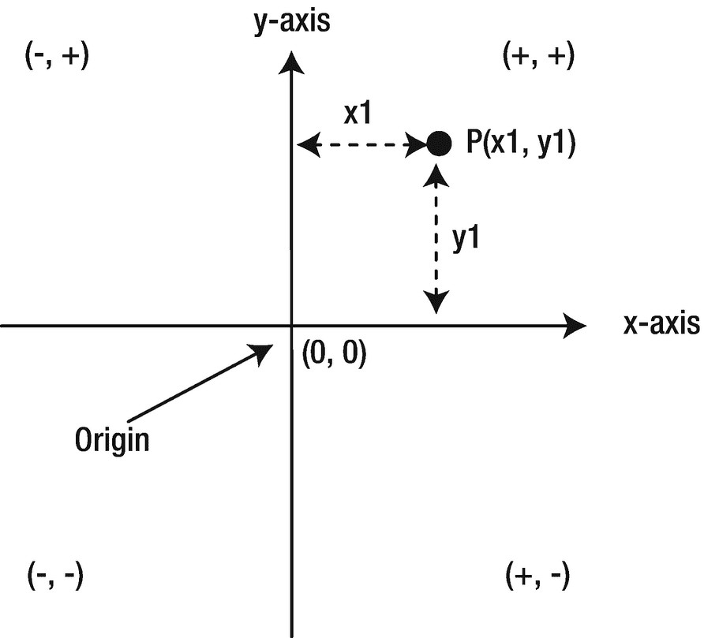

图 6-1

坐标几何中使用的二维笛卡尔坐标系

变换是坐标空间中的点到同一坐标空间的映射，保留一组预定义的几何属性。几种类型的变换可以应用于坐标空间中的点。变换类型的一些例子是*平移*、*旋转*、*缩放*和*剪切*。

在平移变换中，一对固定的数字被添加到所有点的坐标中。假设您想通过(a，b)将平移应用于坐标空间。如果一个点在平移之前具有坐标(x，y ),那么它在平移之后将具有坐标(x + a，y + b)。

在旋转变换中，轴围绕坐标空间中的轴心点旋转，并且点的坐标被映射到新的轴。图 [6-2](#Fig2) 显示了平移和旋转变换的例子。

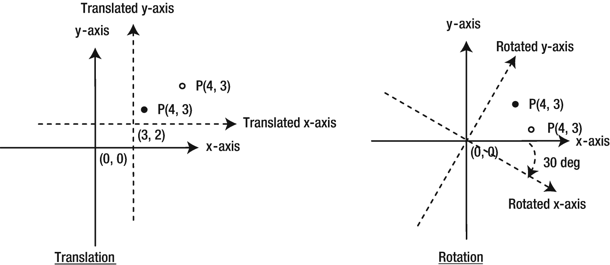

图 6-2

平移和旋转变换的示例

在图 [6-2](#Fig2) 中，变换前的轴用实线表示，变换后的轴用虚线表示。注意，点 P 在(4，3)处的坐标在平移和旋转的坐标空间中保持不变。但是，该点相对于原始坐标空间的坐标在变换后会发生变化。原始坐标空间中的点以纯黑色填充颜色显示，而在转换后的坐标空间中，该点没有填充颜色。在旋转变换中，您已经使用原点作为轴心点。因此，原始坐标空间和变换坐标空间的原点是相同的。

## 节点的笛卡尔坐标系

场景图中的每个节点都有自己的坐标系。节点使用由 x 轴和 y 轴组成的笛卡尔坐标系。在计算机系统中，x 轴上的值向右增加，y 轴上的值向下增加，如图 [6-3](#Fig3) 所示。通常，当显示节点的坐标系时，x 轴和 y 轴的负边不会显示，即使它们总是存在。图 [6-3](#Fig3) 的右部显示了简化版坐标系。一个节点可以有负的 x 和 y 坐标。


图 6-3

节点的坐标系

在典型的 GUI 应用程序中，节点被放置在它们的父节点中。根节点是所有节点的最终父节点，它位于场景内部。场景放置在舞台内，舞台放置在屏幕内。组成一个窗口的每个元素，从节点到屏幕，都有自己的坐标系，如图 [6-4](#Fig4) 所示。

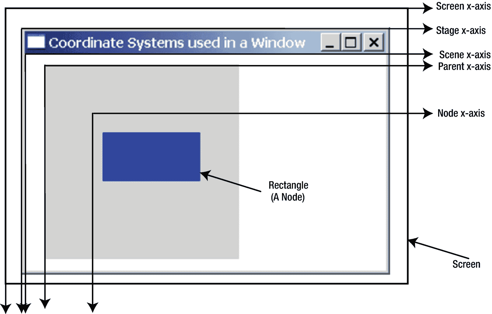

图 6-4

构成 GUI 窗口的所有元素的坐标系

最外面的矩形区域是屏幕，带有粗黑边框。剩下的是一个 JavaFX stage，带有一个区域和一个矩形。该区域的背景颜色为浅灰色，矩形的背景颜色为蓝色。该区域是矩形的父区域。这个简单的窗口使用五个坐标空间，如图 [6-4](#Fig4) 所示。我只标注了 x 轴。所有 y 轴都是垂直线，在原点与各自的 x 轴相交。

矩形左上角的坐标是什么？问题不完整。点的坐标是相对于坐标系定义的。如图 [6-4](#Fig4) 所示，你有五个坐标系，因此有五个坐标空间。因此，必须指定要知道矩形左上角坐标的坐标系。在一个节点的坐标系中，它们是(10，15)；在父母的坐标系中，它们是(40，45)；在一个场景的坐标系中，它们是(60，55)；在一个阶段的坐标系中，它们是(64，83)；在屏幕的坐标系中，它们是(80，99)。

## 边界和包围盒的概念

每个节点都有一个几何形状，它位于一个坐标空间中。节点的大小和位置统称为其*边界*。节点的边界是根据包围该节点的整个几何形状的边界矩形框来定义的。图 [6-5](#Fig5) 显示了一个三角形、一个圆形、一个圆角矩形和一个带实线边框的矩形。用虚线边框显示的矩形是这些形状(节点)的边界框。

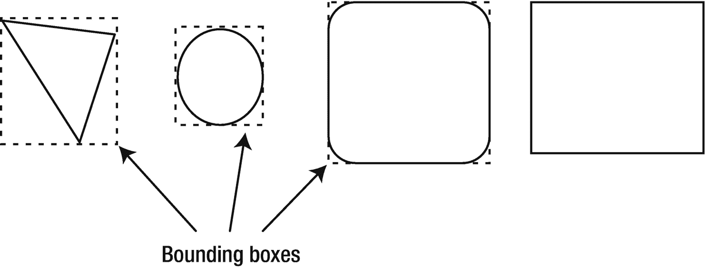

图 6-5

定义节点几何形状的边界矩形框

由节点的几何形状及其边界框覆盖的面积(2D 空间中的面积和 3D 空间中的体积)可以不同。比如图 [6-5](#Fig5) 中的前三个节点，从左边数，节点的面积和它们的包围盒是不一样的。然而，对于没有圆角的最后一个矩形，其面积和其边界框的面积是相同的。

`javafx.geometry.Bounds`类的一个实例代表一个节点的边界。`Bounds`类是一个抽象类。`BoundingBox`类是`Bounds`类的具体实现。`Bounds`类被设计用来处理 3D 空间中的边界。它用边界框中的最小深度以及边界框的宽度、高度和深度封装左上角的坐标。方法`getMinX()`、`getMinY()`和`getMinZ()`用于获取坐标。使用`getWidth()`、`getHeight()`和`getDepth()`方法访问边界框的三个维度。`Bounds`类包含`getMaxX()`、`getMaxY()`和`getMaxZ()`方法，这些方法返回边界框中右下角最大深度的坐标。

在 2D 空间中，`minX`和`minY`分别定义边界框左上角的 x 和 y 坐标，`maxX`和`maxY`分别定义右下角的 x 和 y 坐标。在 2D 空间中，边界框的 z 坐标值和深度值为零。图 [6-6](#Fig6) 显示了 2D 坐标空间中边界框的细节。

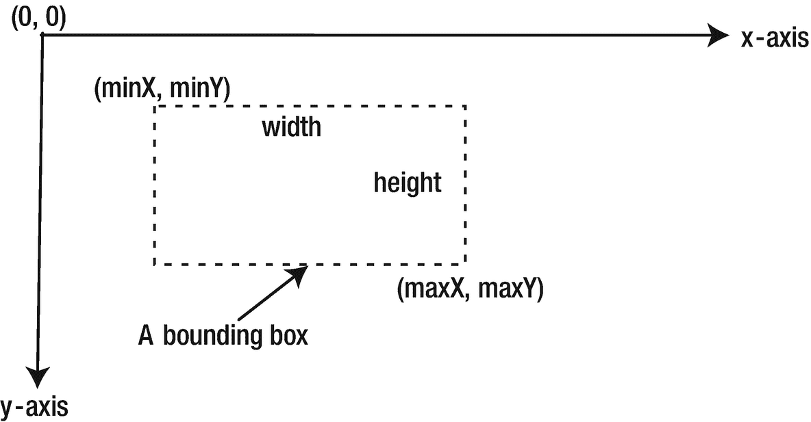

图 6-6

2D 空间中边界框的制作

`Bounds`类包含`isEmpty()`、`contains()`和`intersects()`实用方法。如果一个`Bounds`的三个维度(宽度、高度或深度)中的任何一个是负数，`isEmpty()`方法返回`true`。`contains()`方法允许您检查一个`Bounds`是否包含另一个`Bounds`、一个 2D 点或一个 3D 点。`intersects()`方法允许您检查一个`Bounds`的内部是否与另一个`Bounds`、2D 点或 3D 点的内部相交。

## 知道节点的边界

到目前为止，我已经讨论了与节点相关的坐标系统、边界和边界框等主题。那个讨论是为了让你为这一节做准备，这一节是关于知道一个节点的边界。您可能已经猜到(虽然不正确)了`Node`类应该有一个`getBounds()`方法来返回节点的边界。要是这么简单就好了！在这一节中，我将讨论不同类型的节点边界的细节。在下一节中，我将带您看一些例子。

图 [6-7](#Fig7) 显示了一个带有三种形式文本“关闭”的按钮。

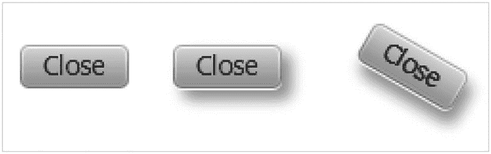

图 6-7

有和没有效果和变形的按钮

第一个，从左边开始，没有效果或变换。第二个有投影效果。第三个有投影效果和旋转变换。图 [6-8](#Fig8) 显示了代表这三种形式的按钮边界的边界框。暂时忽略坐标，您可能会注意到按钮的边界会随着效果和变换的应用而改变。

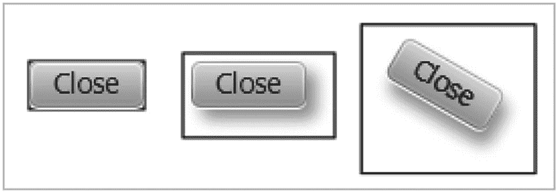

图 6-8

具有和不具有效果的按钮以及具有边界框的变换

场景图中的节点有三种类型的边界，在`Node`类中定义为三个只读属性:

*   `layoutBounds`

*   `boundsInLocal`

*   `boundsInParent`

当你试图理解一个节点的三种界限时，你需要寻找三个点:

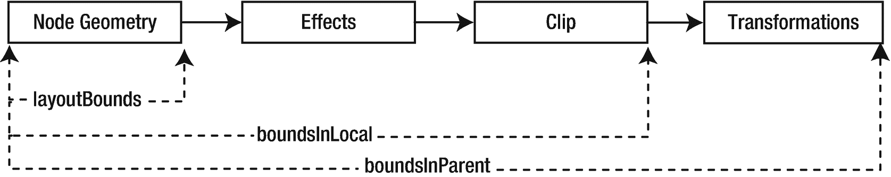

图 6-9

影响节点大小的因素

*   (`minX`，`minY`)值是如何定义的。它们定义了由`Bounds`对象描述的边界框左上角的坐标。

*   请记住，点的坐标总是相对于坐标空间来定义的。因此，请注意在第一步中描述的定义坐标的坐标空间。

*   特定类型的边界中包含节点的哪些属性(几何图形、描边、效果、剪辑和变换)。

图 [6-9](#Fig9) 显示了构成节点边界的节点属性。它们按顺序从左到右应用。一些节点类型(例如，`Circle`、`Rectangle`)可能具有非零笔画。非零笔划被认为是节点几何的一部分，用于计算其边界。

表 [6-1](#Tab1) 列出了有助于特定类型节点边界的属性以及定义边界的坐标空间。节点的`boundsInLocal`和`boundsInParent`也被称为其*物理边界*，因为它们对应于节点的物理属性。节点的`layoutBounds`被称为*逻辑边界*，因为它不一定绑定到节点的物理边界。当一个节点的几何图形改变时，所有的边界都被重新计算。

表 6-1

为节点边界提供属性

<colgroup><col class="tcol1 align-left"> <col class="tcol2 align-left"> <col class="tcol3 align-left"></colgroup> 
| 

界限类型

 | 

坐标空间

 | 

贡献者

 |
| --- | --- | --- |
| `layoutBounds` | 节点(未转换) | 节点的几何形状非零笔划 |
| `boundsInLocal` | 节点(未转换) | 节点的几何形状非零笔划效果夹子 |
| `boundsInParent` | 父母 | 节点的几何形状非零笔划效果夹子转换 |

Tip

`boundsInLocal`和`BoundsInParent`被称为物理或可视边界，因为它们对应于节点的可视外观。`layoutBounds`也被称为*逻辑边界*，因为它不一定对应于节点的物理边界。

### *布局绑定*属性

`layoutBounds`属性是基于节点在*未变换的*局部坐标空间中的几何属性来计算的。不包括效果、剪辑和变换。根据节点的可调整行为，使用不同的规则来计算由`layoutBounds`描述的边界框左上角的坐标:

*   对于一个可调整大小的节点(一个`Region`、一个`Control`和一个`WebView`)，边界框左上角的坐标总是被设置为(0，0)。例如，对于一个按钮，`layoutBounds`属性中的(`minX`，`minY)`)值总是(0，0)。

*   对于一个不可调整大小的节点(一个`Shape`，一个`Text`，和一个`Group`，边界框左上角的坐标是基于几何属性计算的。对于一种形状(矩形、圆形等。)或者一个`Text`，可以指定节点中特定点相对于该节点未变换坐标空间的(x，y)坐标。例如，对于一个矩形，您可以指定左上角的(x，y)坐标，该坐标成为由其`layoutBounds`属性描述的边界框的左上角的(x，y)坐标。对于一个圆，可以指定`centerX`、`centerY`和`radius`属性，其中`centerX`和`centerY`分别是圆心的 x 和 y 坐标。由`layoutBounds`描述的圆形边界框左上角的(x，y)坐标计算如下(`centerX`–半径，`centerY`–半径)。

`layoutBounds`中的宽度和高度是节点的宽度和高度。有些节点允许您设置它们的宽度和高度；但是有些会自动为您计算它们，并让您覆盖它们。

在哪里使用节点的`layoutBounds`属性？容器根据它们的`layoutBounds`分配空间来布局子节点。让我们看一个如清单 [6-1](#PC2) 所示的例子。它在一个`VBox`中显示四个按钮。第一个按钮有投影效果。第三个按钮有投影效果和 30 度旋转变换。第二个和第四个按钮没有效果或变形。产生的屏幕如图 [6-10](#Fig10) 所示。输出显示，不管效果和变换如何，所有按钮都具有相同的`layoutBounds`值。所有按钮的`layoutBounds`对象的大小(宽度和高度)由按钮的文本和字体决定，这对于所有按钮都是一样的。在您的平台上，输出可能有所不同。


图 6-10

`layoutBounds`属性不包括效果和变换

```java
// LayoutBoundsTest.java
package com.jdojo.node;

import javafx.application.Application;
import javafx.scene.Scene;
import javafx.scene.control.Button;
import javafx.scene.effect.DropShadow;
import javafx.scene.layout.VBox;
import javafx.stage.Stage;

public class LayoutBoundsTest extends Application {
        public static void main(String[] args) {
                Application.launch(args);
        }

        @Override
        public void start(Stage stage) {
                Button b1 = new Button("Close");
                b1.setEffect(new DropShadow());

                Button b2 = new Button("Close");

                Button b3 = new Button("Close");
                b3.setEffect(new DropShadow());
                b3.setRotate(30);

                Button b4 = new Button("Close");

                VBox root = new VBox();
                root.getChildren().addAll(b1, b2, b3, b4);

                Scene scene = new Scene(root);
                stage.setScene(scene);
                stage.setTitle("Testing LayoutBounds");
                stage.show();

                System.out.println("b1=" + b1.getLayoutBounds());
                System.out.println("b2=" + b2.getLayoutBounds());
                System.out.println("b3=" + b3.getLayoutBounds());
                System.out.println("b4=" + b4.getLayoutBounds());
        }
}
b1=BoundingBox [minX:0.0, minY:0.0, minZ:0.0, width:57.0, height:23.0, depth:0.0, maxX:57.0, maxY:23.0, maxZ:0.0]
b2=BoundingBox [minX:0.0, minY:0.0, minZ:0.0, width:57.0, height:23.0, depth:0.0, maxX:57.0, maxY:23.0, maxZ:0.0]
b3=BoundingBox [minX:0.0, minY:0.0, minZ:0.0, width:57.0, height:23.0, depth:0.0, maxX:57.0, maxY:23.0, maxZ:0.0]
b4=BoundingBox [minX:0.0, minY:0.0, minZ:0.0, width:57.0, height:23.0, depth:0.0, maxX:57.0, maxY:23.0, maxZ:0.0]

Listing 6-1Accessing the layoutBounds of Buttons with and Without Effects

```

有时，您可能希望在节点的`layoutBounds`中包含显示节点效果和变换所需的空间。解决这个问题的方法很简单。您需要将节点包装在一个`Group`中，将`Group`包装在一个容器中。现在，容器将向`Group`查询它的`layoutBounds`。一个`Group`的`layoutBounds`是其所有子节点的`boundsInParent`的并集。回想一下(见表 [6-1](#Tab1) )节点的`boundsInParent`包括显示效果和节点变换所需的空间。如果你改变陈述

```java
root.getChildren().addAll(b1, b2, b3, b4);

```

在清单 [6-1 中](#PC2)为

```java
root.getChildren().addAll(new Group(b1), b2, new Group(b3), b4);

```

产生的屏幕如图 [6-11](#Fig11) 所示。这一次，`VBox`为第一组和第三组分配了足够的空间，以考虑应用于包装按钮的效果和变换。


图 6-11

使用`Group`为节点的效果和变换分配空间

Tip

基于节点的几何属性来计算节点的`layoutBounds`。因此，您不应该将节点的这种属性绑定到包含节点的`layoutBounds`的表达式。

### *boundsInLocal* 属性

`boundsInLocal`属性是在节点的未变换坐标空间中计算的。它包括节点、效果和剪辑的几何属性。不包括应用于节点的变换。

清单 [6-2](#PC5) 打印一个按钮的`layoutBounds`和`boundsInLocal`。`boundsInLocal`属性包括按钮周围的阴影效果。注意，`layoutBounds`定义的边界框左上角的坐标是(0.0，0.0)，`boundsInLocal`的坐标是(–9.0，–9.0)。不同平台上的输出可能会有所不同，因为节点的大小是根据运行程序的平台自动计算的。

```java
// BoundsInLocalTest.java
package com.jdojo.node;

import javafx.application.Application;
import javafx.scene.Scene;
import javafx.scene.control.Button;
import javafx.scene.effect.DropShadow;
import javafx.scene.layout.VBox;
import javafx.stage.Stage;

public class BoundsInLocalTest extends Application {
        public static void main(String[] args) {
                Application.launch(args);
        }

        @Override
        public void start(Stage stage) {
                Button b1 = new Button("Close");
                b1.setEffect(new DropShadow());

                VBox root = new VBox();
                root.getChildren().addAll(b1);

                Scene scene = new Scene(root);
                stage.setScene(scene);
                stage.setTitle("Testing LayoutBounds");
                stage.show();

                System.out.println("b1(layoutBounds)=" +
                         b1.getLayoutBounds());
                System.out.println("b1(boundsInLocal)=" +
                         b1.getBoundsInLocal());
        }
}
b1(layoutBounds)=BoundingBox [minX:0.0, minY:0.0, minZ:0.0, width:57.0, height:23.0, depth:0.0, maxX:57.0, maxY:23.0, maxZ:0.0]
b1(boundsInLocal)=BoundingBox [minX:-9.0, minY:-9.0, minZ:0.0, width:75.0, height:42.0, depth:0.0, maxX:66.0, maxY:33.0, maxZ:0.0]

Listing 6-2Accessing the boundsInLocal Property of a Node

```

什么时候使用节点的`boundsInLocal`？当你需要包含一个节点的效果和剪辑时，你可以使用`boundsInLocal`。假设你有一个带反射的`Text`节点，你想让它垂直居中。如果你使用`Text`节点的`layoutBounds`，它只会将节点的文本部分居中，而不会包括反射。如果您使用`boundsInLocal`，它将使文本与其倒影居中。另一个例子是检查有影响的球的碰撞。如果两个球之间发生碰撞，当一个球在另一个球的边界内移动，包括它们的效果，使用球的`boundsInLocal`。如果碰撞只发生在它们的几何边界相交时，使用`layoutBounds`。

### *boundsInParent* 属性

节点的`boundsInParent`属性位于其父节点的坐标空间中。它包括节点、效果、剪辑和变换的几何属性。它很少直接用在代码中。

## 群的界限

一个`Group`的`layoutBounds`、`boundsInLocal`和`boundsInParent`的计算不同于一个节点的计算。一个`Group`承担其子节点的集合边界。您可以对每个`Group`子对象分别应用效果、剪辑和变换。您还可以直接在`Group`上应用效果、剪辑和变换，它们会应用到它的所有子节点。

一个`Group`的`layoutBounds`是其所有子节点的`boundsInParent`的并集。它包括直接应用到子对象的效果、剪辑和变换。它不包括直接应用于`Group`的效果、剪辑和变换。`Group`的`boundsInLocal`是通过取其`layoutBounds`并包括直接应用于`Group`的效果和剪辑来计算的。`Group`的`boundsInParent`通过取其`boundsInLocal`并包括直接应用于`Group`的变换来计算。

当您想要为应该包括效果、剪辑和变换的节点分配空间时，您需要尝试将节点包装在`Group`中。假设您有一个带有效果和变换的节点，并且您只想为它的效果而不是它的变换分配布局空间。您可以通过在节点上应用效果并将其包装在一个`Group`中，然后在`Group`上应用变换来实现这一点。

## 一个关于界限的详细例子

在这一节中，我将通过一个例子向您展示如何计算节点的边界。在本例中，您将使用一个矩形及其不同的属性、效果和变换。

请考虑下面的代码片段，它创建了一个 50 x 20 的矩形，并将其放置在矩形的局部坐标空间中的(0，0)处。生成的矩形如图 [6-12](#Fig12) 所示，其中显示了父节点的轴和节点未变换的局部轴(本例中为矩形)，此时是相同的:

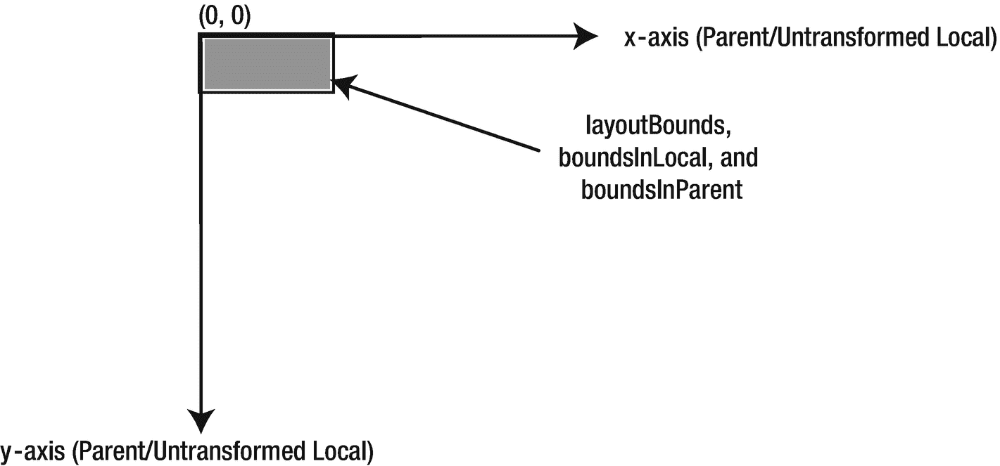

图 6-12

一个 50 x 20 的矩形，放置在(0，0)处，没有任何效果和变换

```java
Rectangle r = new Rectangle(0, 0, 50, 20);
r.setFill(Color.GRAY);

```

矩形的三种边界是相同的，如下所示:

```java
layoutBounds[minX=0.0, minY=0.0, width=50.0, height=20.0]
boundsInLocal[minX=0.0, minY=0.0, width=50.0, height=20.0]
boundsInParent[minX=0.0, minY=0.0, width=50.0, height=20.0]

```

让我们修改矩形，将其放置在(75，50)处，如下所示:

```java
Rectangle r = new Rectangle(75, 50, 50, 20);

```

结果节点如图 [6-13](#Fig13) 所示。

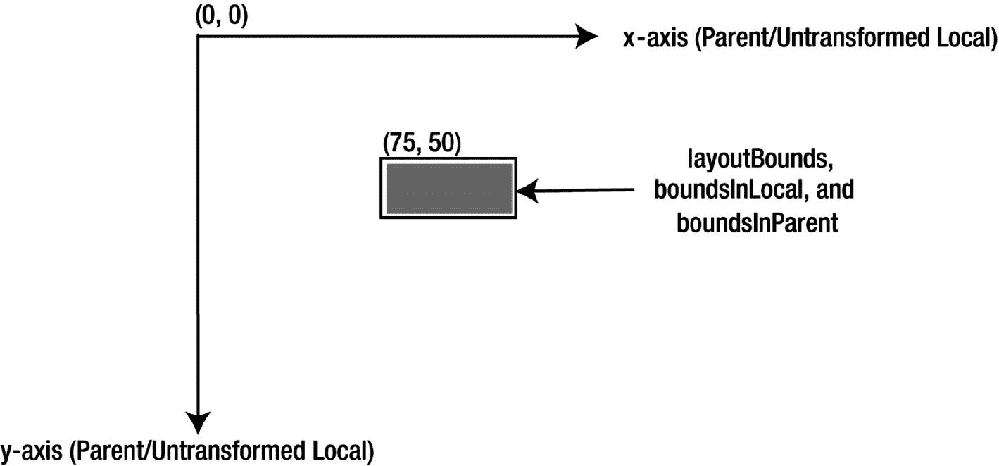

图 6-13

放置在(75，50)处的 50 乘 20 的矩形，没有效果和变换

父节点和节点的轴仍然相同。所有界限都是相同的，如下所示。所有边界框的左上角已经移动到(75，50)，宽度和高度都相同:

```java
layoutBounds[minX=75.0, minY=50.0, width=50.0, height=20.0]
boundsInLocal[minX=75.0, minY=50.0, width=50.0, height=20.0]
boundsInParent[minX=75.0, minY=50.0, width=50.0, height=20.0]

```

让我们修改矩形，并给它一个阴影效果，如下所示:

```java
Rectangle r = new Rectangle(75, 50, 50, 20);
r.setEffect(new DropShadow());

```

结果节点如图 [6-14](#Fig14) 所示。


图 6-14

放置在(75，50)处的一个 50 x 20 的矩形，带有投影，没有变换

父节点和节点的轴仍然相同。现在，`layoutBounds`没有改变。为了适应投影效果，`boundsInLocal`和`boundsInParent`已经改变，它们具有相同的值。回想一下，`boundsInLocal`是在节点的未变换坐标空间中定义的，而`boundsInParent`是在父节点的坐标空间中定义的。在这种情况下，两个坐标空间是相同的。因此，两个边界的相同值定义了相同的边界框。界限的值如下:

```java
layoutBounds[minX=75.0, minY=50.0, width=50.0, height=20.0]
boundsInLocal[minX=66.0, minY=41.0, width=68.0, height=38.0]
boundsInParent[minX=66.0, minY=41.0, width=68.0, height=38.0]

```

让我们修改前面的矩形，使其具有(150，75)的(x，y)平移，如下所示:

```java
Rectangle r = new Rectangle(75, 50, 50, 20);
r.setEffect(new DropShadow());
r.getTransforms().add(new Translate(150, 75));

```

结果节点如图 [6-15](#Fig15) 所示。转换(在本例中是平移)转换了节点的坐标空间，结果，您看到的是被转换的节点。在这种情况下，您需要考虑三个坐标空间:父节点的坐标空间以及节点的未转换和已转换坐标空间。`layoutBounds`和`boundsInParent`是相对于节点未变换的局部坐标空间。`boundsInParent`是相对于父对象的坐标空间。图 [6-15](#Fig15) 显示了游戏中的所有坐标空间。界限的值如下:

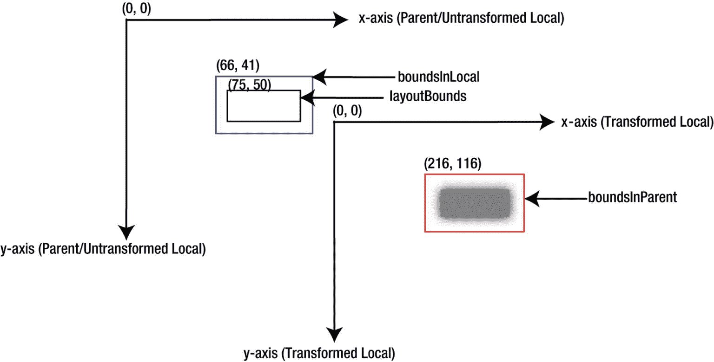

图 6-15

一个 50 x 20 的矩形，放置在(75，50)处，带有投影和(150，75)平移

```java
layoutBounds[minX=75.0, minY=50.0, width=50.0, height=20.0]
boundsInLocal[minX=66.0, minY=41.0, width=68.0, height=38.0]
boundsInParent[minX=216.0, minY=116.0, width=68.0, height=38.0]

```

让我们修改矩形，使其具有(150，75)的(x，y)平移和 30 度顺时针旋转:

```java
Rectangle r = new Rectangle(75, 50, 50, 20);
r.setEffect(new DropShadow());
r.getTransforms().addAll(new Translate(150, 75), new Rotate(30));

```

产生的节点如图 [6-16](#Fig16) 所示。请注意，平移和旋转已应用于矩形的局部坐标空间，矩形出现在相对于其变换后的局部坐标轴的相同位置。`layoutBounds`和`boundsInLocal`保持不变，因为你没有改变矩形的几何形状和效果。`boundsInParent`已经改变，因为你添加了一个旋转。界限的值如下:

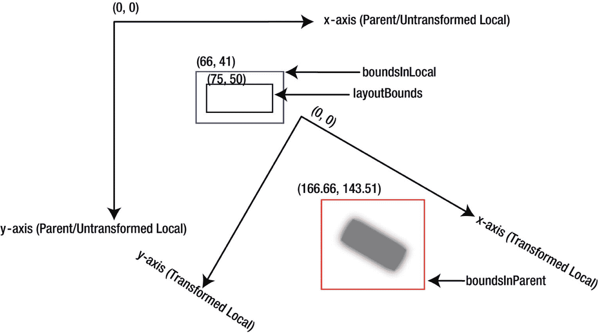

图 6-16

一个 50 x 20 的矩形，放置在(75，50)处，带有投影，平移(150，75)，顺时针旋转 30 度

```java
layoutBounds[minX=75.0, minY=50.0, width=50.0, height=20.0]
boundsInLocal[minX=66.0, minY=41.0, width=68.0, height=38.0]
boundsInParent[minX=167.66, minY=143.51, width=77.89, height=66.91]

```

作为最后一个示例，您将向矩形添加缩放和剪切变换:

```java
Rectangle r = new Rectangle(75, 50, 50, 20);
r.setEffect(new DropShadow());
r.getTransforms().addAll(new Translate(150, 75), new Rotate(30),
                         new Scale(1.2, 1.2), new Shear(0.30, 0.10));

```

结果节点如图 [6-17](#Fig17) 所示。

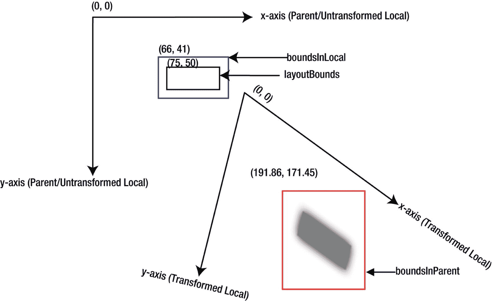

图 6-17

一个放置在(75，50)处的 50 乘 20 的矩形，带有投影，一个(150，75)平移，一个 30 度顺时针旋转，一个 1.2 英寸的 x 和 y 缩放，以及一个 0.30 x 剪切和 0.10 y 剪切

请注意，只有`boundsInParent`发生了变化。界限的值如下:

```java
layoutBounds[minX=75.0, minY=50.0, width=50.0, height=20.0]
boundsInLocal[minX=66.0, minY=41.0, width=68.0, height=38.0]
boundsInParent[minX=191.86, minY=171.45, width=77.54, height=94.20]

```

对于初学者来说，掌握节点不同类型界限背后的概念并不容易。初学者是第一次学习某样东西的人。我开始是一个初学者，学习边界。在学习过程中，另一个美丽的概念以及它在 JavaFX 程序中的实现出现了。这个程序是一个非常详细的演示应用程序，它帮助您直观地理解改变节点的状态是如何影响边界的。您可以保存带有所有坐标轴的场景图形。您可以运行清单 [6-3](#PC18) 中所示的`NodeBoundsApp`类来查看本节中的所有示例。

```java
// NodeBoundsApp.java
package com.jdojo.node;
...
public class NodeBoundsApp extends Application {
        // The code for this class is not included here as it is very big.
        // Please refer to the source code. You can download the source code
        // for all programs in this book from
          // http://www.apress.com/source-code
}

Listing 6-3Computing the Bounds of a Node

```

## 使用*布局*和*布局*定位节点

如果您不理解所有与布局相关的属性背后的细节和原因，那么在 JavaFX 中布置节点是非常令人困惑的。`Node`类有两个属性，`layoutX`和`layoutY`，分别定义其坐标空间沿 x 轴和 y 轴的平移。`Node`类有做同样事情的`translateX`和`translateY`属性。节点坐标空间的最终平移是两者之和:

```java
finalTranslationX = layoutX + translateX
finalTranslationY = layoutY + translateY

```

为什么有两个属性来定义同类翻译？原因很简单。它们的存在是为了在不同的情况下获得相似的结果。使用`layoutX`和`layoutY`定位稳定布局的节点。使用`translateX`和`translateY`为动态布局定位一个节点，例如在动画过程中。

记住`layoutX`和`layoutY`属性不指定节点的最终位置是很重要的。它们是应用于节点的*坐标空间*的平移。当您计算`layoutX`和`layoutY`的值以将节点定位在特定位置时，您需要考虑`layoutBounds`的`minX`和`minY`值。要将节点边界框的左上角定位在`finalX`和`finalY`，请使用以下公式:

```java
layoutX = finalX - node.getLayoutBounds().getMinX()
layoutY = finalY - node.getLayoutBounds().getMinY()

```

Tip

`Node`类有一个方便的方法`relocate(double finalX, double finalY)`，将节点定位在(`finalX, finalY`)位置。该方法计算并正确设置`layoutX`和`layoutY`值，考虑`layoutBounds`的`minX`和`minY`值。为了避免错误和节点的错位，我更喜欢使用`relocate()`方法，而不是`setLayoutX()`和`setLayoutY()`方法。

有时，设置节点的`layoutX`和`layoutY`属性可能无法将它们定位在其父节点内的所需位置。如果遇到这种情况，请检查父类型。大多数父母是`Region`类的子类，他们使用自己的定位策略，忽略孩子的`layoutX`和`layoutY`设置。比如`HBox`和`VBox`使用自己的定位策略，他们会忽略`layoutX`和`layoutY`的值给孩子。

下面的代码片段将忽略两个按钮的`layoutX`和`layoutY`值，因为它们被放在使用自己的定位策略的`VBox`中。最终布局如图 [6-18](#Fig18) 所示。


图 6-18

两个按钮使用`layoutX`和`layoutY`属性并放置在一个`VBox`内

```java
Button b1 = new Button("OK");
b1.setLayoutX(20);
b1.setLayoutY(20);

Button b2 = new Button("Cancel");
b2.setLayoutX(50);
b2.setLayoutY(50);

VBox vb = new VBox();
vb.getChildren().addAll(b1, b2);

```

如果您想完全控制一个节点在其父节点中的位置，请使用`Pane`或`Group`。一个`Pane`是一个`Region`，不定位其子节点。您需要使用`layoutX`和`layoutY`属性来定位孩子。下面的代码片段将布局两个按钮，如图 [6-19](#Fig19) 所示，其中显示了坐标网格，线之间相隔 10px:


图 6-19

使用`layoutX`和`layoutY`属性的两个按钮，放置在`Group`或`Pane`中

```java
Button b1 = new Button("OK");
b1.setLayoutX(20);
b1.setLayoutY(20);

Button b2 = new Button("Cancel");
b2.setLayoutX(50);
b2.setLayoutY(50);

Group parent = new Group(); //Or. Pane parent = new Pane();
parent.getChildren().addAll(b1, b2);

```

## 设置节点的大小

每个节点都有一个大小(宽度和高度)，可以更改。也就是说，每个节点都可以调整大小。有两种类型的节点:*可调整大小的*节点和*不可调整大小的*节点。前面两句话不矛盾吗？答案是肯定的，也是否定的。的确，每个节点都有调整大小的潜力。但是，可调整大小的节点意味着在布局过程中，节点可以由其父节点调整大小。例如，按钮是可调整大小的节点，矩形是不可调整大小的节点。当一个按钮被放置在一个容器中时，例如，在一个`HBox`中，`HBox`决定了按钮的最佳大小。`HBox`根据按钮显示所需的空间和`HBox`可用的空间来调整按钮的大小。当一个矩形被放置在一个`HBox`中时，`HBox`并不决定它的大小；相反，它使用应用程序指定的矩形大小。

Tip

在布局过程中，可调整大小的节点可以由其父节点调整大小。在布局过程中，不可调整大小的节点不会被其父节点调整大小。如果要调整不可调整大小的节点的大小，需要修改影响其大小的属性。例如，要调整矩形的大小，您需要更改它的`width`和`height`属性。`Region`、`Control`和`WebView`是可调整大小的节点的例子。`Group`、`Text`和`Shape`是不可调整大小的节点的例子。

如何知道一个节点是否可以调整大小？`Node`类中的`isResizable()`方法为可调整大小的节点返回`true`；对于不可调整大小的节点，它返回`false`。

清单 [6-4](#PC23) 中的程序显示了布局期间可调整大小和不可调整大小的节点的行为。它向一个`HBox`添加一个按钮和一个矩形。运行程序后，缩短载物台的宽度。当按钮显示省略号(…)时，它会变得更小。矩形始终保持相同的大小。图 [6-20](#Fig20) 显示了调整尺寸过程中三个不同点的载物台。

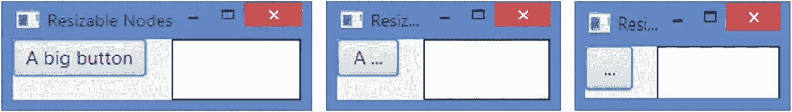

图 6-20

调整舞台大小后，以全尺寸显示的按钮和矩形

```java
// ResizableNodeTest.java
package com.jdojo.node;

import javafx.application.Application;
import javafx.scene.Scene;
import javafx.scene.control.Button;
import javafx.scene.layout.HBox;
import javafx.scene.paint.Color;
import javafx.scene.shape.Rectangle;
import javafx.stage.Stage;

public class ResizableNodeTest extends Application {
        public static void main(String[] args) {
                Application.launch(args);
        }

        @Override
        public void start(Stage stage) {
                Button btn = new Button("A big button");
                Rectangle rect = new Rectangle(100, 50);
                rect.setFill(Color.WHITE);
                rect.setStrokeWidth(1);
                rect.setStroke(Color.BLACK);

                HBox root = new HBox();
                root.setSpacing(20);
                root.getChildren().addAll(btn, rect);

                Scene scene = new Scene(root);
                stage.setScene(scene);
                stage.setTitle("Resizable Nodes");
                stage.show();

                System.out.println("btn.isResizable(): " +
                         btn.isResizable());
                System.out.println("rect.isResizable(): " +
                         rect.isResizable());
        }
}
btn.isResizable(): true
rect.isResizable(): false

Listing 6-4A Button and a Rectangle in an HBox

```

### 可调整大小的节点

可调整大小的节点的实际大小由两个因素决定:

*   放置节点的容器的大小调整策略

*   由节点本身指定的大小范围

每个容器都有一个针对其子容器的调整大小策略。我将在第 10 章讨论容器的尺寸调整策略。一个可调整大小的节点可以指定其大小的范围(宽度和高度)，这应该被一个用于布局节点的*荣誉*容器所考虑。可调整大小的节点指定构成其大小范围的三种类型的大小:

*   首选尺寸

*   最小尺寸

*   最大尺寸

节点的*首选大小*是显示其内容的理想宽度和高度。例如，根据图像、文本、字体和文本换行等当前属性，一个按钮的首选大小足以显示其所有内容。节点的*最小尺寸*是它想要的最小宽度和高度。例如，最小尺寸的按钮足以显示图像和文本的省略号。节点的最大尺寸是它想要的最大宽度和高度。在按钮的情况下，按钮的最大大小与其首选大小相同。有时，您可能希望将节点扩展到无限大小。在这些情况下，最大宽度和高度被设置为`Double.MAX_VALUE`。

大多数可调整大小的节点根据其内容和属性设置自动计算其首选、最小和最大大小。这些尺寸被称为它们的*内在尺寸*。`Region`和`Control`类定义了两个常量，作为节点固有大小的标记值。这些常量是

*   `USE_COMPUTED_SIZE`

*   `USE_PREF_SIZE`

两个常量都是`double`类型。`USE_COMPUTED_SIZE`和`USE_PREF_SIZE`的值分别为–1 和`Double.NEGATIVE_INFINITY`。没有记载为什么相同的常量被定义了两次。也许设计者不想将它们在类层次结构中上移，因为它们不适用于所有类型的节点。

如果节点的大小设置为 sentinel 值`USE_COMPUTED_SIZE`，节点将根据其内容和属性设置自动计算该大小。`USE_PREF_SIZE`标记值用于设置最小和最大尺寸，如果它们与首选尺寸相同的话。

`Region`和`Control`类有六个`DoubleProperty`类型的属性来定义它们的宽度和高度的首选值、最小值和最大值:

*   `prefWidth`

*   `prefHeight`

*   `minWidth`

*   `minHeight`

*   `maxWidth`

*   `maxHeight`

默认情况下，这些属性被设置为标记值`USE_COMPUTED_SIZE`。这意味着节点会自动计算这些大小。您可以设置这些属性之一来覆盖节点的固有大小。例如，您可以将按钮的首选、最小和最大宽度设置为 50 像素，如下所示:

```java
Button btn = new Button("Close");
btn.setPrefWidth(50);
btn.setMinWidth(50);
btn.setMaxWidth(50);

```

前面的代码片段将按钮的首选宽度、最小宽度和最大宽度设置为相同的值，使按钮在水平方向不可调整大小。

以下代码片段将按钮的最小和最大宽度设置为首选宽度，其中首选宽度本身是内部计算的:

```java
Button btn = new Button("Close");
btn.setMinWidth(Control.USE_PREF_SIZE);
btn.setMaxWidth(Control.USE_PREF_SIZE);

```

Tip

在大多数情况下，节点的首选、最小和最大大小的内部计算值是合适的。仅当内部计算的大小不满足应用程序的需要时，才使用这些属性来重写内部计算的大小。如果您需要将一个节点的大小绑定到一个表达式，您将需要绑定`prefWidth`和`prefHeight`属性。

如何获得节点的实际首选、最小和最大大小？您可能会猜测您可以使用`getPrefWidth()`、`getPrefHeight()`、`getMinWidth()`、`getMinHeight()`、`getMaxWidth()`和`getMaxHeight()`方法来获得它们。但是您不应该使用这些方法来获取节点的实际大小。这些大小可以设置为 sentinel 值，节点将在内部计算实际大小。这些方法返回标记值或覆盖值。清单 [6-5](#PC26) 创建了两个按钮，并将其中一个按钮的首选固有宽度覆盖为 100 像素。产生的屏幕如图 [6-21](#Fig21) 所示。以下输出证明，这些方法对于了解用于布局目的的节点的实际大小不是很有用。


图 6-21

按钮使用 sentinel 并覆盖其宽度值

```java
// NodeSizeSentinelValues.java
package com.jdojo.node;

import javafx.application.Application;
import javafx.scene.Scene;
import javafx.scene.control.Button;
import javafx.scene.layout.VBox;
import javafx.stage.Stage;

public class NodeSizeSentinelValues extends Application {
        public static void main(String[] args) {
                Application.launch(args);
        }

        @Override
        public void start(Stage stage) {
                Button okBtn = new Button("OK");
                Button cancelBtn = new Button("Cancel");

                // Override the intrinsic width of the cancel button
                cancelBtn.setPrefWidth(100);

                VBox root = new VBox();
                root.getChildren().addAll(okBtn, cancelBtn);

                Scene scene = new Scene(root);
                stage.setScene(scene);
                stage.setTitle("Overriding Node Sizes");
                stage.show();

                System.out.println("okBtn.getPrefWidth(): " +
                         okBtn.getPrefWidth());
                System.out.println("okBtn.getMinWidth(): " +
                         okBtn.getMinWidth());
                System.out.println("okBtn.getMaxWidth(): " +
                         okBtn.getMaxWidth());

                System.out.println("cancelBtn.getPrefWidth(): " +
                         cancelBtn.getPrefWidth());
                System.out.println("cancelBtn.getMinWidth(): " +
                         cancelBtn.getMinWidth());
                System.out.println("cancelBtn.getMaxWidth(): " +
                         cancelBtn.getMaxWidth());
        }
}
okBtn.getPrefWidth(): -1.0
okBtn.getMinWidth(): -1.0
okBtn.getMaxWidth(): -1.0
cancelBtn.getPrefWidth(): 100.0
cancelBtn.getMinWidth(): -1.0
cancelBtn.getMaxWidth(): -1.0

Listing 6-5Using getXXXWidth() and getXXXHeight() Methods of Regions and Controls

```

要获得节点的实际大小，需要在`Node`类中使用以下方法。请注意，`Node`类没有定义任何与大小相关的属性。与尺寸相关的属性在`Region`、`Control`和其他类中定义。

*   `double prefWidth(double height)`

*   `double prefHeight(double width)`

*   `double minWidth(double height)`

*   `double minHeight(double width)`

*   `double maxWidth(double height)`

*   `double maxHeight(double width)`

在这里，您可以看到获取节点实际大小的另一个变化。您需要传递它的高度值来获得它的宽度，反之亦然。对于 JavaFX 中的大多数节点，宽度和高度是独立的。但是，对于某些节点，高度取决于宽度，反之亦然。当一个节点的宽度依赖于它的高度时，或者反之亦然，该节点被称为具有*内容偏差*。如果一个节点的高度取决于它的宽度，那么这个节点有一个*水平内容偏差*。如果一个节点的宽度取决于它的高度，那么这个节点有一个*垂直内容偏差*。请注意，一个节点不能同时具有水平和垂直内容偏好，这将导致循环依赖。

`Node`类的`getContentBias()`方法返回一个节点的内容偏差。它的返回类型是`javafx.geometry.Orientation`枚举类型，有两个常量:`HORIZONTAL`和`VERTICAL`。如果一个节点没有内容偏向，例如`Text`或`ChoiceBox`，该方法返回`null`。

所有属于`Labeled`类的子类的控件，例如`Label`、`Button`或`CheckBox`，当它们启用了文本换行属性时，都有一个`HORIZONTAL`内容偏好。对于某些节点，它们的内容偏向取决于它们的方向。比如一个`FlowPane`的方位是`HORIZONTAL`，它的内容偏置是`HORIZONTAL`；如果它的方向是`VERTICAL`，那么它的内容偏差就是`VERTICAL`。

您应该使用上面列出的六种方法来获得用于布局目的的节点的大小。如果一个节点类型没有内容偏向，您需要将–1 作为另一个维度的值传递给这些方法。例如，`ChoiceBox`没有内容偏好，您将获得其首选大小，如下所示:

```java
ChoiceBox choices = new ChoiceBox();
...
double prefWidth = choices.prefWidth(-1);
double prefHeight = choices.prefHeight(-1);

```

对于那些有内容偏向的节点，您需要传递偏向的维度来获得另一个维度。例如，对于一个按钮，它有一个`HORIZONTAL`内容偏差，您可以传递–1 来获得它的宽度，并且可以传递它的宽度值来获得它的高度，如下所示:

```java
Button b = new Button("Hello JavaFX");

// Enable text wrapping for the button, which will change its
// content bias from null (default) to HORIZONTAL
b.setWrapText(true);
...
double prefWidth = b.prefWidth(-1);
double prefHeight = b.prefHeight(prefWidth);

```

如果按钮没有启用文本换行属性，您可以将–1 传递给方法`prefWidth()`和`prefHeight()`，因为它没有内容偏向。

获取用于布局目的的节点的宽度和高度的一般方法概述如下。该代码显示了如何获取首选的宽度和高度，该代码类似于获取节点的最小和最大宽度和高度:

```java
Node node = get the reference of the node;
...
double prefWidth = -1;
double prefHeight = -1;

Orientation contentBias = b.getContentBias();

if (contentBias == HORIZONTAL) {
        prefWidth = node.prefWidth(-1);
        prefHeight = node.prefHeight(prefWidth);
} else if (contentBias == VERTICAL) {
        prefHeight = node.prefHeight(-1);
        prefWidth = node.prefWidth(prefHeight);
} else {
        // contentBias is null
        prefWidth = node.prefWidth(-1);
        prefHeight = node.prefHeight(-1);
}

```

现在您知道了如何获得节点的首选、最小和最大大小的指定值和实际值。这些值表示节点大小的范围。当一个节点被放置在一个容器中时，容器会尝试给这个节点一个自己喜欢的大小。但是，根据容器的策略和指定的节点大小，节点可能无法获得其首选大小。相反，一个荣誉容器会给一个节点一个在其指定范围内的大小。这被称为*电流大小*。如何获得一个节点的当前大小？`Region`和`Control`类定义了两个只读属性`width`和`i` ght，它们保存了节点的当前宽度和高度值。

现在让我们看看所有这些方法的实际应用。清单 [6-6](#PC30) 将一个按钮放在一个`HBox`中，为按钮打印不同类型的尺寸，更改一些属性，并再次打印按钮的尺寸。以下输出显示，随着按钮的首选宽度变小，其首选高度变大。

```java
// NodeSizes.java
package com.jdojo.node;

import javafx.application.Application;
import javafx.scene.Scene;
import javafx.scene.control.Button;
import javafx.scene.layout.HBox;
import javafx.stage.Stage;

public class NodeSizes extends Application {
        public static void main(String[] args) {
                Application.launch(args);
        }

        @Override
        public void start(Stage stage) {
                Button btn = new Button("Hello JavaFX!");

                HBox root = new HBox();
                root.getChildren().addAll(btn);

                Scene scene = new Scene(root);
                stage.setScene(scene);
                stage.setTitle("Sizes of a Node");
                stage.show();

                // Print button's sizes
                System.out.println("Before changing button properties:");
                printSizes(btn);

                // Change button's properties
                btn.setWrapText(true);
                btn.setPrefWidth(80);
                stage.sizeToScene();

                // Print button's sizes
                System.out.println(
                         "\nAfter changing button properties:");
                printSizes(btn);

        }

        public void printSizes(Button btn) {
                System.out.println("btn.getContentBias() = " +
                         btn.getContentBias());

                System.out.println("btn.getPrefWidth() = " +
                         btn.getPrefWidth() +
                   ", btn.getPrefHeight() = " + btn.getPrefHeight());

                System.out.println("btn.getMinWidth() = " +
                         btn.getMinWidth() +
                    ", btn.getMinHeight() = " + btn.getMinHeight());

                System.out.println("btn.getMaxWidth() = " +
                         btn.getMaxWidth() +
                   ", btn.getMaxHeight() = " + btn.getMaxHeight());

                double prefWidth = btn.prefWidth(-1);
                System.out.println("btn.prefWidth(-1) = " + prefWidth +
                   ", btn.prefHeight(prefWidth) = " +
                         btn.prefHeight(prefWidth));

                double minWidth = btn.minWidth(-1);
                System.out.println("btn.minWidth(-1) = " + minWidth +
                   ", btn.minHeight(minWidth) = " +
                         btn.minHeight(minWidth));

                double maxWidth = btn.maxWidth(-1);
                System.out.println("btn.maxWidth(-1) = " + maxWidth +
                       ", btn.maxHeight(maxWidth) = " +
                               btn.maxHeight(maxWidth));

                System.out.println("btn.getWidth() = " + btn.getWidth() +
                    ", btn.getHeight() = " + btn.getHeight());
        }
}
Before changing button properties:
btn.getContentBias() = null
btn.getPrefWidth() = -1.0, btn.getPrefHeight() = -1.0
btn.getMinWidth() = -1.0, btn.getMinHeight() = -1.0
btn.getMaxWidth() = -1.0, btn.getMaxHeight() = -1.0
btn.prefWidth(-1) = 107.0, btn.prefHeight(prefWidth) = 22.8984375
btn.minWidth(-1) = 37.0, btn.minHeight(minWidth) = 22.8984375
btn.maxWidth(-1) = 107.0, btn.maxHeight(maxWidth) = 22.8984375
btn.getWidth() = 107.0, btn.getHeight() = 23.0

After changing button properties:
btn.getContentBias() = HORIZONTAL
btn.getPrefWidth() = 80.0, btn.getPrefHeight() = -1.0
btn.getMinWidth() = -1.0, btn.getMinHeight() = -1.0
btn.getMaxWidth() = -1.0, btn.getMaxHeight() = -1.0
btn.prefWidth(-1) = 80.0, btn.prefHeight(prefWidth) = 39.796875
btn.minWidth(-1) = 37.0, btn.minHeight(minWidth) = 22.8984375
btn.maxWidth(-1) = 80.0, btn.maxHeight(maxWidth) = 39.796875
btn.getWidth() = 80.0, btn.getHeight() = 40.0

Listing 6-6Using Different Size-Related Methods of a Node

```

获取或设置可调整大小的节点的方法还不止这些。有一些方便的方法可以用来执行与本节中讨论的方法相同的任务。表 [6-2](#Tab2) 列出了与尺寸相关的方法及其定义类别和用法。

表 6-2

可调整大小的节点的大小相关方法

<colgroup><col class="tcol1 align-left"> <col class="tcol2 align-left"> <col class="tcol3 align-left"></colgroup> 
| 

方法/属性

 | 

定义类别

 | 

使用

 |
| --- | --- | --- |
| **属性:**`prefWidth``prefHeight``minWidth``minHeight``maxWidth``maxHeight` | `Region`，`Control` | 它们定义了首选、最小和最大尺寸。默认情况下，它们被设置为标记值。使用它们来覆盖默认值。 |
| **方法:**`double prefWidth(double h)``double prefHeight(double w)``double minWidth(double h)``double minHeight(double w)``double maxWidth(double h)``double maxHeight(double w)` | `Node` | 使用它们来获得节点的实际大小。如果节点没有内容偏向，则传递–1 作为参数。如果节点有内容偏差，则将另一维的实际值作为参数传递。请注意，这些方法没有对应的属性。 |
| **属性:**`width``height` | `Region`，`Control` | 这些是*只读的*属性，保存可调整大小的节点的当前宽度和高度。 |
| **方法:**`void setPrefSize(double w, double h)``void setMinSize(double w, double h)``void setMaxSize(double w, double h)` | `Region`，`Control` | 这些是覆盖节点的默认计算宽度和高度的方便方法。 |
| **方法:**`void resize(double w, double h)` | `Node` | 它将节点调整到指定的宽度和高度。它由节点的父节点在布局期间调用。您不应该在代码中直接调用此方法。如果您需要设置节点的大小，请使用`setMinSize()`、`setPrefSize()`或`setMaxSize()`方法。此方法对不可调整大小的节点无效。 |
| **方法:**`void autosize()` | `Node` | 对于可调整大小的节点，它将布局边界设置为其当前首选的宽度和高度。它会处理内容偏差。此方法对不可调整大小的节点无效。 |

### 不可调整的节点

在布局过程中，不可调整大小的节点不会被其父节点调整大小。但是，您可以通过更改它们的属性来更改它们的大小。不可调整大小的节点(例如，所有形状)具有决定其大小的不同属性。例如，矩形的宽度和高度、圆的半径以及直线的(`startX`、`startY`、`endX`、`endY`)决定了它们的大小。

在`Node`类中定义了几个与大小相关的方法。当在不可调整大小的节点上调用这些方法或它们返回当前大小时，这些方法不起作用。例如，在不可调整大小的节点上调用`Node`类的`resize(double w, double h)`方法没有任何效果。对于不可调整大小的节点，`Node`类中的`prefWidth(double h)`、`minWidth(double h)`和`maxWidth(double h)`方法返回其`layoutBounds`宽度；而`prefHeight(double w)`、`minHeight(double w)`和`maxHeight(double w)`方法返回其`layoutBounds`高度。不可调整大小的节点没有内容偏见。将–1 作为其他维度的参数传递给所有这些方法。

## 在节点中存储用户数据

每个节点都维护一个用户定义属性(键/值对)的可见映射。你可以用它来储存任何有用的信息。假设您有一个`TextField`让用户操作一个人的名字。您可以将最初从数据库中检索到的人名存储为`TextField`的属性。您可以稍后使用该属性来重置名称，或者生成一个`UPDATE`语句来更新数据库中的名称。属性的另一个用途是存储微帮助文本。当节点获得焦点时，您可以读取它的 micro help 属性并显示它，例如，在状态栏中，以帮助用户理解节点的用法。

`Node`类的`getProperties()`方法返回一个`ObservableMap<Object, Object>`，您可以在其中添加或删除节点的属性。以下代码片段将带有值`"Advik"`的属性`"originalData"`添加到`TextField`节点:

```java
TextField nameField = new TextField();
...
ObservableMap<Object, Object> props = nameField.getProperties();
props.put("originalData", "Advik");

```

以下代码片段从`nameField`节点读取`"originalData"`属性的值:

```java
ObservableMap<Object, Object> props = nameField.getProperties();
if (props.containsKey("originalData")) {
        String originalData = (String)props.get("originalData");
} else {
        // originalData property is not set yet
}

```

`Node`类有两个方便的方法，`setUserData(Object value)`和`getUserData()`，用来存储用户定义的值作为节点的属性。在`setUserData()`方法中指定的`value`使用相同的`ObservableMap`来存储`getProperties()`方法返回的数据。`Node`类使用内部的`Object`作为键来存储值。您需要使用`getUserData()`方法来获取使用`setUserData()`方法存储的值，如下所示:

```java
nameField.setUserData("Saved"); // Set the user data
...
String userData = (String)nameField.getUserData(); // Get the user data

```

Tip

除非使用`getUserData()`方法，否则不能直接访问节点的用户数据。因为它存储在由`getProperties()`方法返回的同一个`ObservableMap`中，所以您可以通过迭代该映射中的值来间接访问它。

`Node`类有一个`hasProperties()`方法。您可以使用它来查看是否为该节点定义了任何属性。

## 什么是受管节点？

`Node`类有一个托管属性，它的类型是`BooleanProperty`。默认情况下，所有节点都被管理。受管节点的布局由其父节点管理。一个`Parent`节点在计算自己的大小时会考虑到它所有被管理的子节点的`layoutBounds`。一个`Parent`节点负责调整其托管的可调整大小的子节点的大小，并根据其布局策略定位它们。当被管理子节点的`layoutBounds`发生变化时，场景图的相关部分被重新显示。

如果一个节点是非托管的，应用程序单独负责布局(计算它的大小和位置)。也就是说，`Parent`节点不布局它的非托管子节点。非托管节点的`layoutBounds`中的变化不会触发其上的重新布局。非托管的`Parent`节点充当*布局根*。如果一个子节点调用了`Parent.requestLayout()`方法，那么只有以非托管`Parent`节点为根的分支才会被重发。

Tip

对比`Node`类的`visible`属性和它的`managed`属性。出于布局目的，`Parent`节点会考虑其所有不可见子节点的`layoutBounds`，并忽略非托管子节点。

什么时候使用非托管节点？通常，您不需要在应用程序中使用非托管节点，因为它们需要您做额外的工作。然而，只要知道它们的存在，如果需要的话，你就可以使用它们。

当您想在容器中显示一个节点而不考虑它的`layoutBounds`时，您可以使用一个非托管节点。您需要自己调整节点的大小和位置。清单 [6-7](#PC34) 演示了如何使用非托管节点。当一个节点获得焦点时，它使用一个非托管的`Text`节点来显示一个微帮助。该节点需要有一个名为`"microHelpText"`的属性。当显示微帮助时，整个应用程序的布局不会被打乱，因为显示微帮助的`Text`节点是一个非托管节点。您在`focusChanged()`方法中将节点放置在适当的位置。该程序向场景的`focusOwner`属性注册了一个更改监听器，因此当场景内的焦点发生变化时，您可以显示或隐藏微帮助`Text`节点。当两个不同的节点具有焦点时，产生的屏幕如图 [6-22](#Fig22) 所示。注意，在这个例子中，定位`Text`节点很容易，因为所有节点都在同一个父节点`GridPane`中。如果节点放在不同的父节点中，定位`Text`节点的逻辑变得复杂。

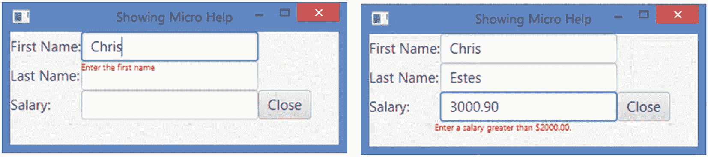

图 6-22

使用非托管的`Text`节点显示微帮助

```java
// MicroHelpApp.java
package com.jdojo.node;

import javafx.application.Application;
import javafx.application.Platform;
import javafx.beans.value.ObservableValue;
import javafx.geometry.VPos;
import javafx.scene.Node;
import javafx.scene.Scene;
import javafx.scene.control.Button;
import javafx.scene.control.Label;
import javafx.scene.control.TextField;
import javafx.scene.layout.GridPane;
import javafx.scene.paint.Color;
import javafx.scene.text.Font;
import javafx.scene.text.Text;
import javafx.stage.Stage;

public class MicroHelpApp extends Application {
        // An instance variable to store the Text node reference
        private Text helpText = new Text();

        public static void main(String[] args) {
                Application.launch(args);
        }

        @Override
        public void start(Stage stage) {
                TextField fName = new TextField();
                TextField lName = new TextField();
                TextField salary = new TextField();

                Button closeBtn = new Button("Close");
                closeBtn.setOnAction(e -> Platform.exit());

                fName.getProperties().put("microHelpText",
                         "Enter the first name");
                lName.getProperties().put("microHelpText",
                         "Enter the last name");
                salary.getProperties().put("microHelpText",
                   "Enter a salary greater than $2000.00.");

                // The help text node is unmanaged
                helpText.setManaged(false);
                helpText.setTextOrigin(VPos.TOP);
                helpText.setFill(Color.RED);
                helpText.setFont(Font.font(null, 9));
                helpText.setMouseTransparent(true);

                // Add all nodes to a GridPane
                GridPane root = new GridPane();

                root.add(new Label("First Name:"), 1, 1);
                root.add(fName, 2, 1);
                root.add(new Label("Last Name:"), 1, 2);
                root.add(lName, 2, 2);

                root.add(new Label("Salary:"), 1, 3);
                root.add(salary, 2, 3);
                root.add(closeBtn, 3, 3);
                root.add(helpText, 4, 3);

                Scene scene = new Scene(root, 300, 100);

                // Add a change listener to the scene, so you know when
                     // the focus owner changes and display the micro help
                scene.focusOwnerProperty().addListener(
                     (ObservableValue<? extends Node> value,
                            Node oldNode, Node newNode)
                          -> focusChanged(value, oldNode, newNode));
                stage.setScene(scene);
                stage.setTitle("Showing Micro Help");
                stage.show();
        }

        public void focusChanged(ObservableValue<? extends Node> value,
                    Node oldNode, Node newNode) {
                // Focus has changed to a new node
                String microHelpText =
                         (String)newNode.getProperties().get("microHelpText");

                if (microHelpText != null &&
                                    microHelpText.trim().length() > 0)  {
                        helpText.setText(microHelpText);
                        helpText.setVisible(true);

                        // Position the help text node
                        double x = newNode.getLayoutX() +
                            newNode.getLayoutBounds().getMinX() –
                            helpText.getLayoutBounds().getMinX();
                        double y = newNode.getLayoutY() +
                            newNode.getLayoutBounds().getMinY() +
                            newNode.getLayoutBounds().getHeight() -
                            helpText.getLayoutBounds().getMinX();

                        helpText.setLayoutX(x);
                        helpText.setLayoutY(y);
                        helpText.setWrappingWidth(
                                    newNode.getLayoutBounds().getWidth());
                }
                else {
                        helpText.setVisible(false);
                }
        }
}

Listing 6-7Using an Unmanaged Text Node to Show Micro Help

```

有时，如果某个节点变得不可见，您可能希望使用该节点所使用的空间。假设你有一个有几个按钮的`HBox`。当其中一个按钮变得不可见时，您希望从右向左滑动所有按钮。可以在`VBox`中实现上滑效果。通过将节点的`managed`属性绑定到`visible`属性，很容易在`HBox`和`VBox`(或任何其他具有相对定位的容器)中实现滑动效果。清单 [6-8](#PC36) 展示了如何在`HBox`中实现向左滑动的特性。它显示四个按钮。第一个按钮用于使第三个按钮`b2`可见和不可见。`b2`按钮的托管属性绑定到它的 visible 属性:

```java
b2.managedProperty().bind(b2.visibleProperty());

```

当`b2`按钮变得不可见时，它就变得不受管理，并且`HBox`在计算它自己的`layoutBounds`时不使用它的`layoutBounds`。这使得`b3`按钮向左滑动。图 [6-23](#Fig23) 显示了应用程序运行时的两个屏幕截图。

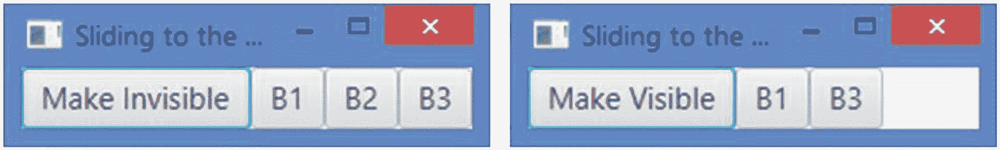

图 6-23

模拟 B2 按钮的向左滑动功能

```java
// SlidingLeftNodeTest.java
package com.jdojo.node;

import javafx.application.Application;
import javafx.beans.binding.When;
import javafx.scene.Scene;
import javafx.scene.control.Button;
import javafx.scene.layout.HBox;
import javafx.stage.Stage;

public class SlidingLeftNodeTest extends Application {
        public static void main(String[] args) {
                Application.launch(args);
        }

        @Override
        public void start(Stage stage) {
                Button b1 = new Button("B1");
                Button b2 = new Button("B2");
                Button b3 = new Button("B3");
                Button visibleBtn = new Button("Make Invisible");

                // Add an action listener to the button to make
                // b2 visible if it is invisible and invisible if it
                // is visible
                visibleBtn.setOnAction(e ->
                         b2.setVisible(!b2.isVisible()));

                // Bind the text property of the button to the visible
                // property of the b2 button
                visibleBtn.textProperty().bind(
                         new When(b2.visibleProperty())
                .then("Make Invisible")
                .otherwise("Make Visible"));

                // Bind the managed property of b2 to its visible
                // property
                b2.managedProperty().bind(b2.visibleProperty());

                HBox root = new HBox();
                root.getChildren().addAll(visibleBtn, b1, b2, b3);

                Scene scene = new Scene(root);
                stage.setScene(scene);
                stage.setTitle("Sliding to the Left");
                stage.show();
        }
}

Listing 6-8Simulating the Slide-Left Feature Using Unmanaged Nodes

```

## 变换坐标空间之间的界限

我已经介绍了节点使用的坐标空间。有时，您可能需要将一个`Bounds`或一个点从一个坐标空间转换到另一个坐标空间。`Node`类包含几个方法来支持这一点。支持以下`Bounds`或点的变换:

*   本地到父

*   本地到场景

*   父到本地

*   场景到本地

`localToParent()`方法将节点的本地坐标空间中的一个`Bounds`或一个点转换到其父节点的坐标空间。`localToScene()`方法将节点的局部坐标空间中的一个`Bounds`或一个点转换到其场景的坐标空间。`parentToLocal()`方法将节点的父节点的坐标空间中的一个`Bounds`或一个点转换到该节点的局部坐标空间。`sceneToLocal()`方法将节点的场景坐标空间中的`Bounds`或点转换到该节点的局部坐标空间。所有方法都有三个重载版本；一个版本将一个`Bounds`作为参数，并返回转换后的`Bounds`；另一个版本将一个`Point2D`作为参数，并返回转换后的`Point2D`；另一个版本获取一个点的 x 和 y 坐标，并返回转换后的`Point2D`。

这些方法足以将一个坐标空间中的点的坐标变换到场景图形中的另一个坐标空间。有时，您可能需要将节点的局部坐标空间中的点的坐标转换到舞台或屏幕的坐标空间。您可以使用`Scene`和`Stage`类的`x`和`y`属性来实现这一点。场景的(x，y)属性定义了场景左上角在其舞台坐标空间中的坐标。舞台的(x，y)属性定义了屏幕坐标空间中舞台左上角的坐标。例如，如果(x1，y1)是场景坐标空间中的一个点，(x1 + x2，y1 + y2)定义了舞台坐标空间中的同一点，其中 x2 和 y2 分别是舞台的`x`和`y`属性。应用相同的逻辑来获得屏幕坐标空间中的点的坐标。

让我们看一个使用节点、其父节点及其场景的坐标空间之间的变换的例子。一个场景有三个`Label`和三个`TextField`放置在不同的父对象下。一个红色的小圆圈被放置在具有焦点的节点的边界框的左上角。随着焦点的改变，需要计算圆的位置，该位置与当前节点左上角相对于圆的父节点的位置相同。圆心需要与具有焦点的节点的左上角重合。图 [6-24](#Fig24) 显示焦点在名和姓节点的阶段。清单 [6-9](#PC43) 有完整的程序来实现这一点。

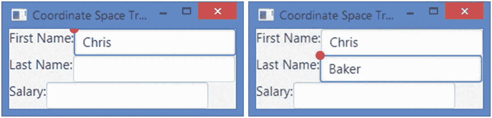

图 6-24

使用坐标空间变换将圆移动到焦点节点

该节目有一个由三个`Label`和`TextField`组成的场景，一对`Label`和一对`TextField`被放置在一个`HBox`中。所有的`HBox`都放在一个`VBox`中。一个非托管的`Circle`被放置在`VBox`中。该程序向场景的`focusOwner`属性添加了一个变化监听器来跟踪焦点变化。当焦点改变时，圆被放置在具有焦点的节点的左上角。

`placeMarker()`包含主逻辑。它获取局部坐标空间中焦点节点边界框左上角的(x，y)坐标:

```java
double nodeMinX = newNode.getLayoutBounds().getMinX();
double nodeMinY = newNode.getLayoutBounds().getMinY();

```

它将节点左上角的坐标从局部坐标空间转换到场景的坐标空间:

```java
Point2D nodeInScene = newNode.localToScene(nodeMinX, nodeMinY);

```

现在节点左上角的坐标从场景的坐标空间转换到圆的坐标空间，程序中命名为`marker`:

```java
Point2D nodeInMarkerLocal = marker.sceneToLocal(nodeInScene);

```

最后，节点左上角的坐标被转换到圆的父节点的坐标空间:

```java
Point2D nodeInMarkerParent = marker.localToParent(nodeInMarkerLocal);

```

此时，`nodeInMarkerParent`是相对于圆的父点的点(焦点节点的左上角)。如果将圆重新定位到此点，则将圆边界框的左上角放置到焦点节点的左上角:

```java
marker.relocate(nodeInMarkerParent.getX(), nodeInMarkerParent.getY())

```

如果要将圆心放在焦点节点的左上角，则需要相应地调整坐标:

```java
// CoordinateConversion.java
package com.jdojo.node;

import javafx.application.Application;
import javafx.geometry.Point2D;
import javafx.scene.Node;
import javafx.scene.Scene;
import javafx.scene.control.Label;
import javafx.scene.control.TextField;
import javafx.scene.layout.HBox;
import javafx.scene.layout.VBox;
import javafx.scene.paint.Color;
import javafx.scene.shape.Circle;
import javafx.stage.Stage;

public class CoordinateConversion extends Application {
        // An instance variable to store the reference of the circle
        private Circle marker;

        public static void main(String[] args) {
                Application.launch(args);
        }

        @Override
        public void start(Stage stage) {
                TextField fName = new TextField();
                TextField lName = new TextField();
                TextField salary = new TextField();

                // The Circle node is unmanaged
                marker = new Circle(5);
                marker.setManaged(false);
                marker.setFill(Color.RED);
                marker.setMouseTransparent(true);

                HBox hb1 = new HBox();
                HBox hb2 = new HBox();
                HBox hb3 = new HBox();
                hb1.getChildren().addAll(
                         new Label("First Name:"), fName);
                hb2.getChildren().addAll(new Label("Last Name:"), lName);
                hb3.getChildren().addAll(new Label("Salary:"), salary);

                VBox root = new VBox();
                root.getChildren().addAll(hb1, hb2, hb3, marker);

                Scene scene = new Scene(root);

                // Add a focus change listener to the scene
                scene.focusOwnerProperty().addListener(
                    (prop, oldNode, newNode) -> placeMarker(newNode));

                stage.setScene(scene);
                stage.setTitle("Coordinate Space Transformation");
                stage.show();
        }

        public void placeMarker(Node newNode) {
                double nodeMinX = newNode.getLayoutBounds().getMinX();
                double nodeMinY = newNode.getLayoutBounds().getMinY();
                Point2D nodeInScene =
                         newNode.localToScene(nodeMinX, nodeMinY);
                Point2D nodeInMarkerLocal =
                         marker.sceneToLocal(nodeInScene);
                Point2D nodeInMarkerParent =
                         marker.localToParent(nodeInMarkerLocal);

                // Position the circle approperiately
                marker.relocate(
                         nodeInMarkerParent.getX()
                             + marker.getLayoutBounds().getMinX(),
                   nodeInMarkerParent.getY()e
                             + marker.getLayoutBounds().getMinY());
        }
}

Listing 6-9Transforming the Coordinates of a Point from One Coordinate Space to Another

```

```java
marker.relocate(
    nodeInMarkerParent.getX() + marker.getLayoutBounds().getMinX(),
   nodeInMarkerParent.getY() + marker.getLayoutBounds().getMinY());

```

## 摘要

场景图是一种树形数据结构。场景图中的每个项目称为一个节点。`javafx.scene.Node`类的一个实例表示场景图中的一个节点。一个节点可以有子项(也称为子节点)，这样的节点称为分支节点。分支节点是`Parent`类的一个实例，它的具体子类是`Group`、`Region`和`WebView`。不能有子项的节点称为叶节点。诸如`Rectangle`、`Text`、`ImageView`和`MediaView`之类的实例是叶节点的例子。每个场景图树中只有一个节点没有父节点，它被称为根节点。一个节点在场景图中的任何地方最多出现一次。

如果节点尚未附加到场景，则可以在任何线程上创建和修改节点。将节点附加到场景中以及随后的修改必须发生在 JavaFX 应用程序线程上。一个节点有几种类型的边界。界限是相对于不同的坐标系确定的。场景图中的节点有三种类型的边界:`layoutBounds`、`boundsInLocal`和`boundsInParent`。

`layoutBounds`属性是基于节点在*未变换的*局部坐标空间中的几何属性来计算的。不包括效果、剪辑和变换。`boundsInLocal`属性是在节点的未变换坐标空间中计算的。它包括节点、效果和剪辑的几何属性。不包括应用于节点的变换。节点的`boundsInParent`属性位于其父节点的坐标空间中。它包括节点、效果、剪辑和变换的几何属性。它很少直接用在代码中。

一个`Group`的`layoutBounds`、`boundsInLocal`和`boundsInParent`的计算不同于一个节点的计算。一个`Group`承担其子节点的集合边界。您可以对每个`Group`子对象分别应用效果、剪辑和变换。您还可以直接在`Group`上应用效果、剪辑和变换，它们会应用到它的所有子节点。一个`Group`的`layoutBounds`是其所有子节点`boundsInParent`的并集。它包括直接应用到子对象的效果、剪辑和变换。它不包括直接应用于`Group`的效果、剪辑和变换。`Group`的`boundsInLocal`通过取其`layoutBounds`并包括直接应用于`Group`的效果和剪辑来计算。`Group`的`boundsInParent`通过取其`boundsInLocal`并包括直接应用于`Group`的变换来计算。

每个节点都维护一个用户定义属性(键/值对)的可见映射。你可以用它来储存任何有用的信息。节点可以是托管的，也可以是非托管的。托管节点由其父节点布局，而应用程序负责布局非托管节点。

下一章将讨论如何在 JavaFX 中使用颜色。