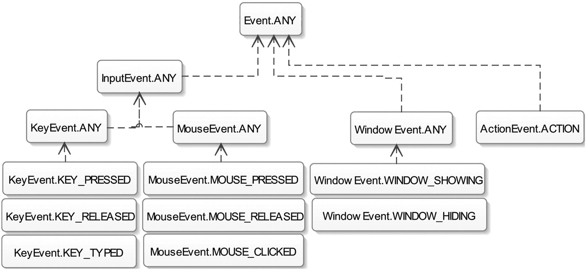
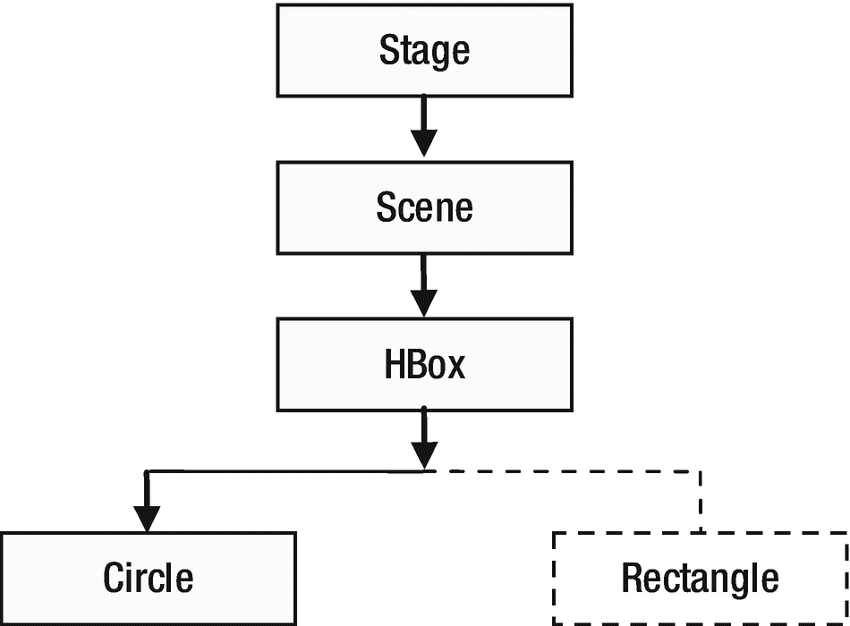
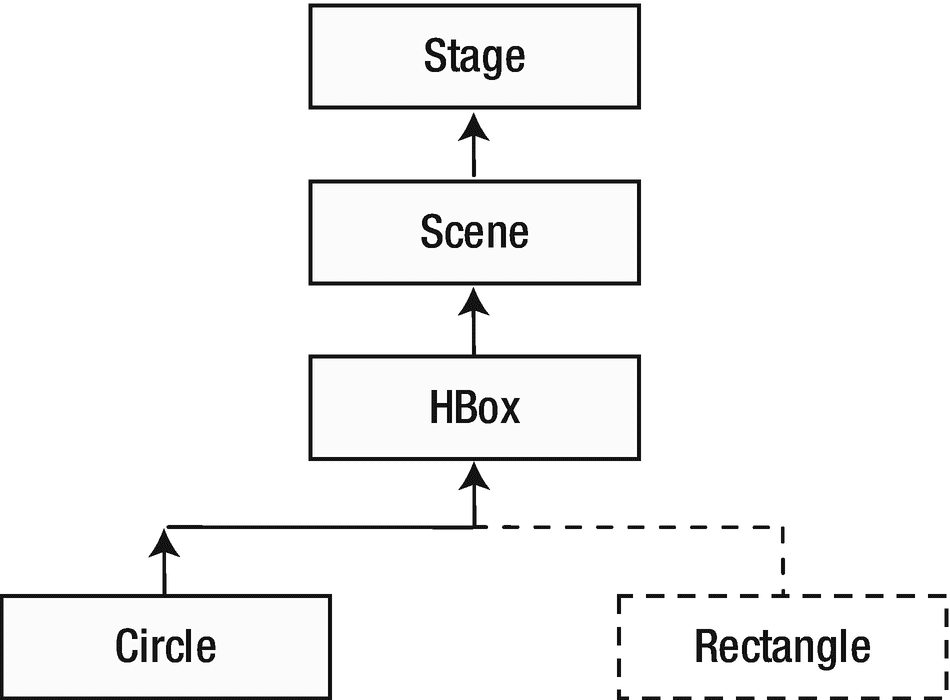
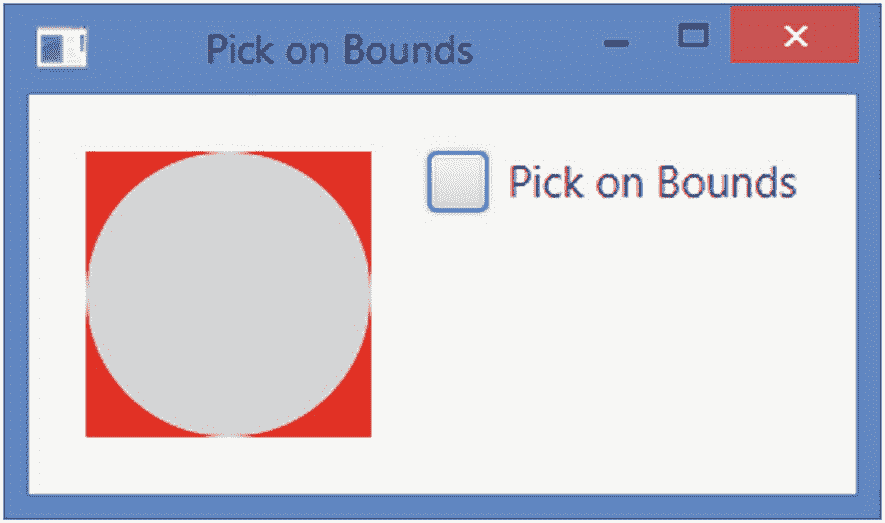
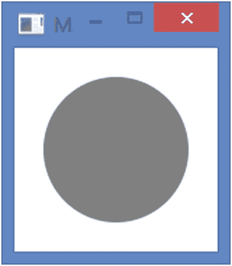

# 九、事件处理

在本章中，您将学习:

*   什么是事件

*   什么是事件源、事件目标和事件类型

*   关于事件处理机制

*   如何使用事件过滤器和事件处理程序处理事件

*   如何处理鼠标事件、按键事件和窗口事件

本章的例子在`com.jdojo.event`包中。为了让它们工作，您必须在`module-info.java`文件中添加相应的一行:

```java
...
opens com.jdojo.event to javafx.graphics, javafx.base;
...

```

## 什么是事件？

通常，术语*事件*用于描述感兴趣的事件。在 GUI 应用程序中，事件是用户与应用程序交互的发生。单击鼠标和按键盘上的键是 JavaFX 应用程序中的事件示例。

JavaFX 中的事件由`javafx.event.Event`类或其任何子类的对象表示。JavaFX 中的每个事件都有三个属性:

*   事件源

*   事件目标

*   事件类型

当应用程序中发生事件时，通常通过执行一段代码来执行一些处理。响应事件而执行的代码片段被称为*事件处理器*或*事件过滤器*。我将很快澄清这两者之间的区别。现在，把两者都看作一段代码，我将把它们都称为事件处理程序。当您想要处理 UI 元素的事件时，您需要向 UI 元素添加事件处理程序，例如，`Window`、`Scene`或`Node`。当 UI 元素检测到事件时，它会执行您的事件处理程序。

调用事件处理程序的 UI 元素是这些事件处理程序的事件源。当一个事件发生时，它会通过一连串的事件调度程序。事件的源是事件调度程序链中的当前元素。当事件通过事件调度程序链中的一个调度程序传递到另一个调度程序时，事件源会发生变化。

事件目标是事件的目的地。事件目标决定了事件在处理过程中行进的路线。假设鼠标点击发生在一个`Circle`节点上。在这种情况下，`Circle`节点是鼠标点击事件的事件目标。

事件类型描述发生的事件的类型。事件类型以分层的方式定义。每个事件类型都有一个名称和一个父类型。

JavaFX 中所有事件共有的三个属性由三个不同类的对象表示。特定事件定义了附加的事件属性；例如，表示鼠标事件的 event 类添加了描述鼠标光标位置和鼠标按钮状态等属性。表 [9-1](#Tab1) 列出了事件处理中涉及的类和接口。JavaFX 有一个事件交付机制，它定义了事件发生和处理的细节。我将在随后的章节中详细讨论所有这些。

表 9-1

事件处理中涉及的类

<colgroup><col class="tcol1 align-left"> <col class="tcol2 align-left"> <col class="tcol3 align-left"></colgroup> 
| 

名字

 | 

类别/接口

 | 

描述

 |
| --- | --- | --- |
| `Event` | 班级 | 此类的一个实例表示一个事件。存在几个`Event`类的子类来表示特定类型的事件。 |
| `EventTarget` | 连接 | 此接口的一个实例代表一个事件目标。 |
| `EventType` | 班级 | 此类的一个实例代表一个事件类型，例如，按下鼠标、释放鼠标、移动鼠标。 |
| `EventHandler` | 连接 | 此接口的一个实例表示一个事件处理程序或一个事件过滤器。它的`handle()`方法在它注册的事件发生时被调用。 |

## 事件类层次结构

JavaFX 中表示事件的类通过类继承以分层的方式排列。图 [9-1](#Fig1) 显示了`Event`类的部分类图。`Event`类位于类层次结构的顶端，它继承了图中没有显示的`java.util.EventObject`类。


图 9-1

`javafx.event.Event`类的分部类层次结构

`Event`类的子类代表特定类型的事件。有时，`Event`类的一个子类被用来表示某种普通事件。例如，`InputEvent`类代表一个通用事件来指示一个用户输入事件，而`KeyEvent`和`MouseEvent`类分别代表特定的输入事件，比如来自键盘和鼠标的用户输入。`WindowEvent`类的对象代表一个窗口的事件，例如窗口的显示和隐藏。`ActionEvent`的一个对象用来表示几种事件，表示某种类型的动作，例如，触发一个按钮或一个菜单项。如果用户用鼠标点击按钮、按下某些键或在触摸屏上触摸它，可能会触发按钮。

`Event`类提供了所有事件通用的属性和方法。`getSource()`方法返回一个`Object`，它是事件的来源。`Event`类从`EventObject`类继承了这个方法。`getTarget()`方法返回`EventTarget`接口的一个实例，它是事件的目标。`getEventType()`方法返回一个`EventType`类的对象，它指示事件的类型。

`Event`类包含了`consume()`和`isConsumed()`方法。如前所述，在事件调度链中，事件从一个元素传递到另一个元素。在一个`Event`对象上调用`consume()`方法表明事件已经被消费，不需要进一步处理。在调用了`consume()`方法之后，事件不会移动到事件处理链中的下一个元素。如果调用了`consume()`方法，则`isConsumed()`方法返回`true`；否则返回`false`。

特定的`Event`子类定义了更多的属性和方法。例如，`MouseEvent`类定义了`getX()`和`getY()`方法，它们返回鼠标光标相对于事件源的 x 和 y 坐标。当我在本章或后续章节中讨论这些方法时，我将在特定于事件的类中解释这些方法的细节。

## 事件目标

一个*事件目标*是一个可以响应事件的 UI 元素(不一定只是`Node` s)。从技术上讲，想要响应事件的 UI 元素必须实现`EventTarget`接口。也就是说，在 JavaFX 中，实现`EventTarget`接口使得 UI 元素有资格成为事件目标。

`Window`、`Scene`和`Node`类实现了`EventTarget`接口。这意味着所有节点，包括窗口和场景，都可以响应事件。一些 UI 元素的类，例如`Tab`、`TreeItem`和`MenuItem`，并不从`Node`类继承。它们仍然可以响应事件，因为它们实现了`EventTarget`接口。如果开发自定义 UI 元素，并且希望 UI 元素响应事件，则需要实现此接口。

事件目标的职责是建立一个事件调度器链，也称为*事件路径*。一个*事件调度器*是一个`EventDispatcher`接口的实例。链中的每个调度程序都可以通过处理和使用来影响事件。链中的事件调度程序还可以修改事件属性，用新事件替换该事件，或者链接事件路由。通常，事件目标路由由与容器子层次结构中的所有 UI 元素关联的调度程序组成。假设您将一个`Circle`节点放在一个`HBox`中，后者放在一个`Scene`中。将`Scene`加到一个`Stage`上。如果鼠标点击`Circle`，则`Circle`成为事件目标。`Circle`构建了一个事件调度器链，其路线从头到尾依次为`Stage`、`Scene`、`HBox`和`Circle`。

## 事件类型

`EventType`类的一个实例定义了一个事件类型。为什么需要一个单独的类来定义事件类型？每个事件单独的事件类，例如`KeyEvent`、`MouseEvent`，不足以定义事件类型吗？不能根据事件类来区分一个事件和另一个事件吗？`EventType`类用于对事件类中的事件进行进一步分类。例如，`MouseEvent`类只告诉我们用户使用了鼠标。它没有告诉我们鼠标使用的细节，例如，鼠标是否被按下、释放、拖动或点击。`EventType`类用于对事件的这些子事件类型进行分类。`EventType`类是一个泛型类，其类型参数定义如下:

```java
EventType<T extends Event>

```

事件类型是分层的。它们是按实现而不是按类继承来分层的。每个事件类型都有一个名称和一个父类型。`EventType`类中的`getName()`和`getSuperType()`方法返回事件类型的名称和父类型。常量`Event.ANY`，与常量`EventType.ROOT`相同，是 JavaFX 中所有事件的超类型。图 [9-2](#Fig2) 显示了在一些事件类中预定义的一些事件类型的部分列表。



图 9-2

某些事件类的预定义事件类型的部分列表

注意，图中的箭头并不表示类继承。它们表示依赖关系。例如，`InputEvent.ANY`事件类型依赖于`Event.ANY`事件类型，因为后者是前者的超类型。

具有子事件类型的事件类定义了一个`ANY`事件类型。例如，`MouseEvent`类定义了一个`ANY`事件类型，表示任何类型的鼠标事件，例如，鼠标释放、鼠标点击、鼠标移动。`MOUSE_PRESSED`和`MOUSE_RELEASED`是`MouseEvent`类中定义的其他事件类型。事件类中的`ANY`事件类型是同一事件类中所有其他事件类型的超类型。例如，`MouseEvent.ANY`事件类型是`MOUSE_RELEASED`和`MOUSE_PRESSED`鼠标事件的超类型。

## 事件处理机制

当事件发生时，作为事件处理的一部分，会执行几个步骤:

*   事件目标选择

*   事件路线构建

*   事件路径遍历

### 事件目标选择

事件处理的第一步是选择事件目标。回想一下，事件目标是事件的目的节点。基于事件类型选择事件目标。

对于鼠标事件，事件目标是鼠标光标处的节点。鼠标光标处可以有多个节点。例如，您可以在矩形上放置一个圆。鼠标光标处最顶端的节点被选为事件目标。

关键事件的事件目标是具有焦点的节点。节点如何获得焦点取决于节点的类型。例如，`TextField`可以通过在其中单击鼠标或使用焦点遍历键(如 Windows 格式的 Tab 或 Shift + Tab)来获得焦点。默认情况下，`Circles`或`Rectangles`等形状不会获得焦点。如果你想让它们接收按键事件，你可以通过调用`Node`类的`requestFocus()`方法给它们焦点。

JavaFX 支持支持触摸的设备上的触摸和手势事件。通过触摸触摸屏产生触摸事件。每个触摸动作都有一个称为*触摸点*的接触点。可以用多个手指触摸触摸屏，从而产生多个触摸点。触摸点的每种状态，例如按压、释放等，都会产生触摸事件。触摸点的位置决定了触摸事件的目标。例如，如果触摸事件的位置是圆内的点，则该圆成为触摸事件的目标。在触摸点处有多个节点的情况下，选择最上面的节点作为目标。

用户可以使用手势与 JavaFX 应用程序进行交互。通常，触摸屏和跟踪板上的手势由具有触摸动作的多个触摸点组成。手势事件的例子是旋转、滚动、滑动和缩放。旋转手势是通过绕着彼此旋转两个手指来执行的。通过在触摸屏上拖动手指来执行滚动手势。通过在触摸屏上向一个方向拖动一个手指(或多个手指)来执行滑动手势。执行缩放手势以通过将两个手指拖开或拉近来缩放节点。

手势事件的目标是根据手势的类型选择的。对于直接手势，例如在触摸屏上执行的手势，在手势开始时所有触摸点的中心点处的最顶端节点被选择作为事件目标。对于间接手势，例如在跟踪板上执行的手势，鼠标光标处最顶端的节点被选为事件目标。

### 事件路线构建

事件通过事件调度链中的事件调度程序传播。事件调度链是*事件路由*。事件的初始和默认路线由事件目标决定。默认事件路由由从阶段开始到事件目标节点的容器子路径组成。

假设你在一个`HBox`中放置了一个`Circle`和一个`Rectangle`，并且`HBox`是一个`Stage`的`Scene`的根节点。当您点击`Circle`时，`Circle`成为事件目标。`Circle`构造默认的事件路径，它是从阶段开始到事件目标(`Circle`)的路径。

事实上，事件路由由与节点相关联的事件调度程序组成。然而，出于实际和理解的目的，您可以将事件路由视为包含节点的路径。通常，您不直接与事件调度程序打交道。

图 [9-3](#Fig3) 显示了鼠标点击事件的事件路径。事件路线上的节点以灰色背景填充显示。事件路线上的节点由实线连接。注意，当点击`Circle`时，作为场景图一部分的`Rectangle`不是事件路径的一部分。


图 9-3

为事件构造默认的事件路径

一个事件调度链(或事件路线)有一个*头*和一个*尾*。在图 [9-3](#Fig3) 中，`Stage`和`Circle`分别是事件调度链的头和尾。随着事件处理的进展，可以修改初始事件路线。通常，但不是必须的，在事件遍历步骤中，事件通过其路由中的所有节点两次，如下一节所述。

### 事件路径遍历

事件路径遍历包括两个阶段:

*   捕获阶段

*   起泡阶段

一个事件在其路由中经过每个节点两次:一次在捕获阶段，一次在冒泡阶段。您可以为特定的事件类型向节点注册事件过滤器和事件处理程序。在捕获阶段和冒泡阶段，当事件通过节点时，分别执行注册到节点的事件过滤器和事件处理程序。事件过滤器和处理程序作为事件源在当前节点的引用中传递。随着事件从一个节点传播到另一个节点，事件源不断变化。然而，事件目标从事件路径遍历的开始到结束保持不变。

在路由遍历期间，节点可以使用事件过滤器或处理程序中的事件，从而完成事件的处理。消费一个事件只需调用事件对象上的`consume()`方法。当一个事件被消费时，事件处理被停止，即使路由中的一些节点根本没有被遍历。

#### 事件捕获阶段

在捕获阶段，事件从其事件调度链的头部移动到尾部。图 [9-4](#Fig4) 显示了在我们的例子中的`Circle`在捕获阶段鼠标点击事件的移动。图中的向下箭头表示事件传播的方向。当事件通过一个节点时，为该节点注册的事件过滤器被执行。请注意，对于当前节点，事件捕获阶段只执行事件过滤器，而不执行事件处理程序。



图 9-4

事件捕获阶段

在图 [9-4](#Fig4) 中，`Stage`、`Scene`、`HBox`和`Circle`的事件过滤器按顺序执行，假设没有事件过滤器消耗事件。

您可以为一个节点注册多个事件过滤器。如果节点使用了它的一个事件过滤器中的事件，那么在事件处理停止之前，它的其他尚未执行的事件过滤器将被执行。假设您在我们的示例中为`Scene`注册了五个事件过滤器，执行的第一个事件过滤器使用该事件。在这种情况下，`Scene`的其他四个事件过滤器仍将被执行。对`Scene`执行第五个事件过滤器后，事件处理将停止，事件不会传播到剩余的节点(`HBox`和`Circle`)。

在事件捕获阶段，您可以拦截针对节点子节点的事件(并提供通用响应)。例如，在我们的示例中，您可以将鼠标点击事件的事件过滤器添加到`Stage`中，以拦截其所有子节点的所有鼠标点击事件。您可以通过在父节点的事件过滤器中使用事件来阻止事件到达其目标。例如，如果您在过滤器中为`Stage`使用鼠标点击事件，那么该事件将不会到达它的目标，在我们的例子中是`Circle`。

#### 事件冒泡阶段

在冒泡阶段，事件从其事件调度链的尾部移动到头部。图 [9-5](#Fig5) 显示了`Circle`在冒泡阶段鼠标点击事件的行进。



图 9-5

事件冒泡阶段

图 [9-5](#Fig5) 中的向上箭头表示事件行进的方向。当事件通过一个节点时，执行该节点的注册事件处理程序。注意，事件冒泡阶段执行当前节点的事件处理程序，而事件捕获阶段执行事件过滤器。

在我们的例子中，`Circle`、`HBox`、`Scene`和`Stage`的事件处理程序按顺序执行，假设没有事件过滤器消耗事件。请注意，事件冒泡阶段从事件的目标开始，向上行进到父子层次结构中的最高父级。

您可以为一个节点注册多个事件处理程序。如果节点使用了它的一个事件处理程序中的事件，那么在事件处理停止之前，它的其他尚未执行的事件处理程序将被执行。假设在我们的例子中，您已经为`Circle`注册了五个事件处理程序，执行的第一个事件处理程序使用该事件。在这种情况下，`Circle`的其他四个事件处理程序仍然会被执行。在执行了`Circle`的第五个事件处理程序后，事件处理将停止，事件不会传播到剩余的节点(`HBox`、`Scene`和`Stage`)。

通常，事件处理程序注册到目标节点，以提供对事件的特定响应。有时，事件处理程序安装在父节点上，为其所有子节点提供默认事件响应。如果事件目标决定为事件提供特定的响应，它可以通过添加事件处理程序和使用事件来实现，从而阻止事件在事件冒泡阶段到达父节点。

让我们看一个微不足道的例子。假设您想在用户单击窗口中的任意位置时向用户显示一个消息框。您可以向窗口注册一个事件处理程序来显示消息框。当用户在窗口的圆圈内单击时，您希望显示特定的消息。您可以向 circle 注册一个事件处理程序，以提供特定的消息并使用该事件。这将在单击圆圈时提供特定的事件响应，而对于其他节点，窗口提供默认的事件响应。

## 处理事件

处理事件意味着执行应用程序逻辑以响应事件的发生。应用程序逻辑包含在事件过滤器和处理程序中，它们是`EventHandler`接口的对象，如以下代码所示:

```java
public interface EventHandler<T extends Event> extends EventListener
        void handle(T event);
}

```

`EventHandler`类是`javafx.event`包中的通用类。它扩展了`java.util`包中的`EventListener`标记接口。`handle()`方法接收事件对象的引用，例如`KeyEvent`和`MouseEvent`的引用等等。

事件过滤器和处理程序都是同一个`EventHandler`接口的对象。仅仅看着一个`EventHandler`对象是一个事件过滤器还是一个事件处理器，你是无法分辨的。事实上，您可以将同一个`EventHandler`对象同时注册为事件过滤器和处理程序。这两者之间的区别是在它们注册到节点时确定的。节点提供不同的方法来注册它们。在内部，节点知道一个`EventHandler`对象是注册为事件过滤器还是处理程序。它们之间的另一个区别是基于调用它们的事件遍历阶段。在事件捕获阶段，注册过滤器的`handle()`方法被调用，而注册处理程序的`handle()`方法在事件冒泡阶段被调用。

Tip

本质上，处理事件意味着为`EventHandler`对象编写应用程序逻辑，并将它们注册到节点，作为事件过滤器、处理程序或两者。

### 创建事件过滤器和处理程序

创建事件过滤器和处理程序就像创建实现`EventHandler`接口的类的对象一样简单。使用 lambda 表达式是创建事件过滤器和处理程序的最佳选择，如以下代码所示:

```java
EventHandler<MouseEvent> aHandler = e -> /* Event handling code goes here */;

```

我在本书中使用 lambda 表达式来创建事件过滤器和处理程序。如果您不熟悉 lambda 表达式，我建议您至少学习一些基础知识，以便能够理解事件处理代码。

下面的代码片段创建了一个`MouseEvent`处理程序。它打印发生的鼠标事件的类型:

```java
EventHandler<MouseEvent> mouseEventHandler =
        e -> System.out.println("Mouse event type: " + e.getEventType());

```

### 注册事件过滤器和处理程序

如果您希望某个节点处理特定类型的事件，您需要向该节点注册这些事件类型的事件过滤器和处理程序。当事件发生时，节点的已注册事件过滤器和处理程序的`handle()`方法按照前面章节中讨论的规则被调用。如果节点不再对处理事件感兴趣，您需要从节点中注销事件过滤器和处理程序。注册和取消注册事件筛选器和处理程序也分别称为添加和删除事件筛选器和处理程序。

JavaFX 提供了两种向节点注册和取消注册事件过滤器和处理程序的方法:

*   使用`addEventFilter()`、`addEventHandler()`、`removeEventFilter()`和`removeEventHandler()`方法

*   使用`onXXX`便利属性

#### 使用 *addXXX( )* 和 *removeXXX( )* 方法

您可以使用`addEventFilter()`和`addEventHandler()`方法分别向节点注册事件过滤器和处理程序。这些方法在`Node`类、`Scene`类和`Window`类中定义。一些类(例如`MenuItem`和`TreeItem`)可以是事件目标；然而，它们不是从`Node`类继承的。这些类只为事件处理程序注册提供了`addEventHandler()`方法，例如

*   `<T extends Event> void addEventFilter(EventType<T> eventType, EventHandler<? super T> eventFilter)`

*   `<T extends Event> void addEventHandler(EventType<T> eventType, EventHandler<? super T> eventHandler)`

这些方法有两个参数。第一个参数是事件类型，第二个是`EventHandler`接口的一个对象。

您可以使用下面的代码片段来处理`Circle`的鼠标点击事件:

```java
import javafx.scene.shape.Circle;
import javafx.event.EventHandler;
import javafx.scene.input.MouseEvent;
...
Circle circle = new Circle (100, 100, 50);

// Create a MouseEvent filter
EventHandler<MouseEvent> mouseEventFilter =
         e -> System.out.println("Mouse event filter has been called.");

// Create a MouseEvent handler
EventHandler<MouseEvent> mouseEventHandler =
         e -> System.out.println("Mouse event handler has been called.");

// Register the MouseEvent filter and handler to the Circle
// for mouse-clicked events
circle.addEventFilter(MouseEvent.MOUSE_CLICKED, mouseEventFilter);
circle.addEventHandler(MouseEvent.MOUSE_CLICKED, mouseEventHandler);

```

这段代码创建两个`EventHandler`对象，在控制台上打印一条消息。在这个阶段，它们不是事件过滤器或处理程序。他们只是两个`EventHandler`物体。请注意，给引用变量命名并打印使用单词 filter 和 handler 的消息，不会对它们作为过滤器和处理程序的状态产生任何影响。最后两条语句将一个`EventHandler`对象注册为事件过滤器，将另一个注册为事件处理程序；两者都注册了鼠标单击事件。

允许将同一个`EventHandler`对象注册为事件过滤器和处理程序。下面的代码片段使用一个`EventHandler`对象作为`Circle`的过滤器和处理程序来处理鼠标点击事件:

```java
// Create a MouseEvent EventHandler object
EventHandler<MouseEvent> handler = e ->
    System.out.println("Mouse event filter or handler has been called.");

// Register the same EventHandler object as the MouseEvent filter and handler
// to the Circle for mouse-clicked events
circle.addEventFilter(MouseEvent.MOUSE_CLICKED, handler);
circle.addEventHandler(MouseEvent.MOUSE_CLICKED, handler);

```

Tip

您可以使用`addEventFilter()`和`addEventHandler()`方法为一个节点添加多个事件过滤器和处理程序。您需要为要添加的事件过滤器和处理程序的每个实例调用一次这些方法。

清单 [9-1](#PC8) 有完整的程序来演示如何处理一个`Circle`对象的鼠标点击事件。它使用一个事件过滤器和一个事件处理器。运行程序并在圆圈内单击。单击圆圈时，首先调用事件过滤器，然后调用事件处理程序。从输出中可以明显看出这一点。每当您单击圆内的任何一点时，都会发生鼠标单击事件。如果在圆圈外单击，鼠标单击事件仍会发生；但是，您看不到任何输出，因为您没有在`HBox`、`Scene`和`Stage`上注册事件过滤器或处理程序。

```java
// EventRegistration.java
package com.jdojo.event;

import javafx.application.Application;
import javafx.event.EventHandler;
import javafx.scene.Scene;
import javafx.scene.input.MouseEvent;
import javafx.scene.layout.HBox;
import javafx.scene.paint.Color;
import javafx.scene.shape.Circle;
import javafx.stage.Stage;

public class EventRegistration extends Application {
        public static void main(String[] args) {
                Application.launch(args);
        }

        @Override
        public void start(Stage stage) {
                Circle circle = new Circle (100, 100, 50);
                circle.setFill(Color.CORAL);

                // Create a MouseEvent filter
                EventHandler<MouseEvent> mouseEventFilter = e ->
                         System.out.println(
                             "Mouse event filter has been called.");

                // Create a MouseEvent handler
                EventHandler<MouseEvent> mouseEventHandler = e ->
                         System.out.println(
                             "Mouse event handler has been called.");

                // Register the MouseEvent filter and handler to
                     // the Circle for mouse-clicked events
                circle.addEventFilter(MouseEvent.MOUSE_CLICKED,
                         mouseEventFilter);
                circle.addEventHandler(MouseEvent.MOUSE_CLICKED,
                         mouseEventHandler);

                HBox root = new HBox();
                root.getChildren().add(circle);
                Scene scene = new Scene(root);
                stage.setScene(scene);
                stage.setTitle("Registering Event Filters and Handlers");
                stage.show();
                stage.sizeToScene();
        }

}
Mouse event filter has been called.
Mouse event handler has been called.
...

Listing 9-1Registering Event Filters and Handlers

```

要注销事件过滤器和事件处理程序，您需要分别调用`removeEventFilter()`和`removeEventHandler()`方法:

*   `<T extends Event> void removeEventFilter(EventType<T> eventType, EventHandler<? super T> eventFilter)`

*   `<T extends Event> void removeEventHandler(EventType<T> eventType, EventHandler<? super T> eventHandler)`

下面的代码片段向一个`Circle`添加和移除一个事件过滤器，然后移除它们。注意，一旦从一个节点中删除了一个`EventHandler`,当事件发生时就不会调用它的`handle()`方法:

```java
// Create a MouseEvent EventHandler object
EventHandler<MouseEvent> handler = e ->
    System.out.println("Mouse event filter or handler has been called.");

// Register the same EventHandler object as the MouseEvent filter and handler
// to the Circle for mouse-clicked events
circle.addEventFilter(MouseEvent.MOUSE_CLICKED, handler);
circle.addEventHandler(MouseEvent.MOUSE_CLICKED, handler);

...

// At a later stage, when you are no longer interested in handling the mouse
// clicked event for the Circle, unregister the event filter and handler
circle.removeEventFilter(MouseEvent.MOUSE_CLICKED, handler);
circle.removeEventHandler(MouseEvent.MOUSE_CLICKED, handler);

```

#### 在 XXX 上使用*便利属性*

`Node`、`Scene`和`Window`类包含事件属性来存储一些选定事件类型的事件处理程序。属性名使用事件类型模式。它们被命名为`onXXX`。例如，`onMouseClicked`属性存储鼠标点击事件类型的事件处理程序；属性存储键类型事件的事件处理程序；等等。您可以使用这些属性的`setOnXXX()`方法来注册节点的事件处理程序。例如，使用`setOnMouseClicked()`方法为鼠标点击事件注册一个事件处理程序，使用`setOnKeyTyped()`方法为键入事件注册一个事件处理程序，等等。各种类中的`setOnXXX()`方法被认为是注册事件处理程序的便利方法。

您需要记住关于`onXXX`便利属性的一些要点:

*   它们只支持事件处理程序的注册，不支持事件过滤器。如果您需要注册事件过滤器，请使用`addEventFilter()`方法。

*   他们只支持为一个节点注册*一个事件处理程序*。可以使用`addEventHandler()`方法为一个节点注册多个事件处理程序。

*   这些属性只存在于节点类型的常用事件中。例如，`onMouseClicked`属性存在于`Node`和`Scene`类中，但不存在于`Window`类中；`onShowing`属性存在于`Window`类中，但不存在于`Node`和`Scene`类中。

清单 [9-2](#PC10) 中的程序与清单 [9-1](#PC8) 中的程序工作相同。这一次，您已经使用了`Node`类的`onMouseClicked`属性为这个圆注册了鼠标点击事件处理程序。注意，要注册事件过滤器，您必须像以前一样使用`addEventFilter()`方法。运行程序并在圆圈内单击。您将得到与运行清单 [9-1](#PC8) 中的代码相同的输出。

```java
// EventHandlerProperties.java
package com.jdojo.event;

import javafx.application.Application;
import javafx.event.EventHandler;
import javafx.scene.Scene;
import javafx.scene.input.MouseEvent;
import javafx.scene.layout.HBox;
import javafx.scene.paint.Color;
import javafx.scene.shape.Circle;
import javafx.stage.Stage;

public class EventHandlerProperties extends Application {
        public static void main(String[] args) {
                Application.launch(args);
        }

        @Override
        public void start(Stage stage) {
                Circle circle = new Circle (100, 100, 50);
                circle.setFill(Color.CORAL);

                HBox root = new HBox();
                root.getChildren().add(circle);
                Scene scene = new Scene(root);
                stage.setScene(scene);
                stage.setTitle(

                         "Using convenience event handler properties");
                stage.show();
                stage.sizeToScene();

                // Create a MouseEvent filter
                EventHandler<MouseEvent> eventFilter = e ->
                         System.out.println(
                             "Mouse event filter has been called.");

                // Create a MouseEvent handler
                EventHandler<MouseEvent> eventHandler = e ->
                         System.out.println(
                             "Mouse event handler has been called.");

                // Register the filter using the addEventFilter() method
                circle.addEventFilter(MouseEvent.MOUSE_CLICKED,
                         eventFilter);

                // Register the handler using the setter method for
                // the onMouseCicked convenience event property
                circle.setOnMouseClicked(eventHandler);
        }
}

Listing 9-2Using the Convenience Event Handler Properties

```

便利事件属性没有提供单独的方法来注销事件处理程序。将属性设置为`null`会取消注册已经注册的事件处理程序:

```java
// Register an event handler for the mouse-clicked event
circle.setOnMouseClicked(eventHandler);

...

// Later, when you are no longer interested in processing the mouse-clicked
// event, unregister it.
circle.setOnMouseClicked(null);

```

定义`onXXX`事件属性的类也定义了返回注册事件处理程序的引用的`getOnXXX()` getter 方法。如果没有设置事件处理程序，getter 方法返回`null`。

## 事件过滤器和处理程序的执行顺序

相似和不同节点的事件过滤器和处理程序都有一些执行顺序规则:

*   事件过滤器在事件处理程序之前被调用。事件过滤器按照父子顺序从最顶端的父对象到事件目标执行。事件处理程序以与事件过滤器相反的顺序执行。也就是说，事件处理程序的执行从事件目标开始，并按父子顺序向上移动。

*   对于同一节点，特定事件类型的事件筛选器和处理程序在通用类型的事件筛选器和处理程序之前被调用。假设您已经为节点`MouseEvent.ANY`和`MouseEvent.MOUSE_CLICKED`注册了事件处理程序。两种事件类型的事件处理程序都能够处理鼠标单击事件。当鼠标点击节点时，`MouseEvent.MOUSE_CLICKED`事件类型的事件处理程序在`MouseEvent.ANY`事件类型的事件处理程序之前被调用。请注意，鼠标按下事件和鼠标释放事件发生在鼠标单击事件发生之前。在我们的例子中，这些事件将由`MouseEvent.ANY`事件类型的事件处理程序来处理。

*   没有指定节点的相同事件类型的事件过滤器和处理程序的执行顺序。这条规则有一个例外。使用`addEventHandler()`方法注册到节点的事件处理程序在使用`setOnXXX()`方便方法注册的事件处理程序之前执行。

清单 [9-3](#PC12) 展示了不同节点的事件过滤器和处理程序的执行顺序。程序给一个`HBox`增加一个`Circle`和一个`Rectangle`。`HBox`被添加到`Scene`中。为鼠标点击事件的`Stage`、`Scene`、`HBox`和`Circle`添加事件过滤器和事件处理程序。运行程序，点击圆圈内的任意位置。输出显示了过滤器和处理程序的调用顺序。输出包含事件阶段、类型、目标、源和位置。请注意，当事件从一个节点传播到另一个节点时，事件源会发生变化。该位置相对于事件源。因为每个节点都使用自己的局部坐标系，所以鼠标单击的同一点相对于不同的节点具有不同的(x，y)坐标值。

```java
// CaptureBubblingOrder.java
package com.jdojo.event;

import javafx.application.Application;
import javafx.event.EventHandler;
import javafx.geometry.Insets;
import javafx.scene.Scene;
import javafx.scene.input.MouseEvent;
import javafx.scene.layout.HBox;
import javafx.scene.paint.Color;
import javafx.scene.shape.Circle;
import javafx.scene.shape.Rectangle;
import javafx.stage.Stage;
import static javafx.scene.input.MouseEvent.MOUSE_CLICKED;

Listing 9-3Execution Order for Event Filters and Handlers

```

如果单击矩形，您会注意到输出显示了事件通过其父级的相同路径，就像它通过圆形一样。事件仍然通过矩形，这是事件目标。但是，您看不到任何输出，因为您没有为矩形注册任何事件过滤器或处理程序来输出任何消息。您可以点按圆形和矩形外的任何点，以查看事件目标和事件路径。

```java
public class CaptureBubblingOrder extends Application {
        public static void main(String[] args) {
                Application.launch(args);
        }

        @Override
        public void start(Stage stage) {
                Circle circle = new Circle (50, 50, 50);
                circle.setFill(Color.CORAL);

                Rectangle rect = new Rectangle(100, 100);
                rect.setFill(Color.TAN);

                HBox root = new HBox();
                root.setPadding(new Insets(20));
                root.setSpacing(20);
                root.getChildren().addAll(circle, rect);

                Scene scene = new Scene(root);

                // Create two EventHandlders
                EventHandler<MouseEvent> filter = e ->
                         handleEvent("Capture", e);
                EventHandler<MouseEvent> handler = e ->
                         handleEvent("Bubbling", e);

                // Register filters

                stage.addEventFilter(MOUSE_CLICKED, filter);
                scene.addEventFilter(MOUSE_CLICKED, filter);
                root.addEventFilter(MOUSE_CLICKED, filter);
                circle.addEventFilter(MOUSE_CLICKED, filter);

                // Register handlers
                stage.addEventHandler(MOUSE_CLICKED, handler);
                scene.addEventHandler(MOUSE_CLICKED, handler);
                root.addEventHandler(MOUSE_CLICKED, handler);
                circle.addEventHandler(MOUSE_CLICKED, handler);

                stage.setScene(scene);
                stage.setTitle(
                         "Event Capture and Bubbling Execution Order");
                stage.show();
        }

        public void handleEvent(String phase, MouseEvent e) {
                String type = e.getEventType().getName();
                String source = e.getSource().getClass().getSimpleName();
                String target = e.getTarget().getClass().getSimpleName();

                // Get coordinates of the mouse cursor relative to the
                // event source
                double x = e.getX();
                double y = e.getY();

                System.out.println(phase + ": Type=" + type +
                    ", Target=" + target +
                    ", Source=" +  source +
                    ", location(" + x + ", " + y + ")");
        }
}

```

清单 [9-4](#PC14) 展示了一个节点的事件处理程序的执行顺序。它显示一个圆。它为循环注册了三个事件处理程序:

*   一个用于`MouseEvent.ANY`事件类型

*   一个用于使用`addEventHandler()`方法的`MouseEvent.MOUSE_CLICKED`事件类型

*   一个用于使用`setOnMouseClicked()`方法的`MouseEvent.MOUSE_CLICKED`事件类型

运行程序并在圆圈内单击。输出显示了调用三个事件处理程序的顺序。该顺序将类似于本节开始时的讨论中提出的顺序。

```java
// HandlersOrder.java
package com.jdojo.event;

import javafx.application.Application;
import javafx.scene.Scene;
import javafx.scene.input.MouseEvent;
import javafx.scene.layout.HBox;
import javafx.scene.paint.Color;
import javafx.scene.shape.Circle;
import javafx.stage.Stage;

public class HandlersOrder extends Application {
        public static void main(String[] args) {
                Application.launch(args);
        }

        @Override
        public void start(Stage stage) {
                Circle circle = new Circle(50, 50, 50);
                circle.setFill(Color.CORAL);

                HBox root = new HBox();
                root.getChildren().addAll(circle);
                Scene scene = new Scene(root);

                /* Register three handlers for the circle that can handle

                          mouse-clicked events */
                // This will be called last
                circle.addEventHandler(MouseEvent.ANY, e ->
                         handleAnyMouseEvent(e));

                // This will be called first
                circle.addEventHandler(MouseEvent.MOUSE_CLICKED, e ->
                         handleMouseClicked("addEventHandler()", e));

                // This will be called second
                circle.setOnMouseClicked(e ->
                         handleMouseClicked("setOnMouseClicked()", e));

                stage.setScene(scene);
                stage.setTitle(
                         "Execution Order of Event Handlers of a Node");
                stage.show();
        }

        public void handleMouseClicked(String registrationMethod,
                         MouseEvent e) {
                System.out.println(registrationMethod +
                    ": MOUSE_CLICKED handler detected a mouse click.");
        }

        public void handleAnyMouseEvent(MouseEvent e) {
                // Print a message only for mouse-clicked events,
                // ignoring other mouse events such as mouse-pressed,
                // mouse-released, etc.
                if (e.getEventType() == MouseEvent.MOUSE_CLICKED) {

                    System.out.println(
                               "MouseEvent.ANY handler detected a mouse click.");
                }
        }
}
addEventHandler(): MOUSE_CLICKED handler detected a mouse click.
setOnMouseClicked(): MOUSE_CLICKED handler detected a mouse click.
MouseEvent.ANY handler detected a mouse click.

Listing 9-4Order of Execution of Event Handlers for a Node

```

## 消费事件

通过调用事件的`consume()`方法来消耗事件。事件类包含方法，它由所有事件类继承。通常，在事件过滤器和处理程序的`handle()`方法中调用`consume()`方法。

使用事件向事件调度程序表明事件处理已完成，并且事件不应在事件调度链中继续传播。如果事件在节点的事件过滤器中被使用，则该事件不会传播到任何子节点。如果事件在节点的事件处理程序中使用，则该事件不会传播到任何父节点。

调用使用节点的所有事件筛选器或处理程序，而不管哪个筛选器或处理程序使用该事件。假设您为一个节点注册了三个事件处理程序，首先调用的事件处理程序使用事件。在这种情况下，仍然调用节点的另外两个事件处理程序。

如果父节点不希望其子节点响应某个事件，它可以在其事件过滤器中使用该事件。如果父节点对事件处理程序中的事件提供默认响应，则子节点可以提供特定响应并使用该事件，从而取消父节点的默认响应。

通常，节点在提供默认响应后会消耗大多数输入事件。规则是调用节点的所有事件过滤器和处理程序，即使其中一个使用了事件。这使得开发人员可以为节点执行他们的事件过滤器和处理程序，即使节点使用事件。

清单 [9-5](#PC15) 中的代码展示了如何使用一个事件。图 [9-6](#Fig6) 显示运行程序时的屏幕。


图 9-6

消费事件

```java
// ConsumingEvents.java
package com.jdojo.event;

import javafx.application.Application;
import javafx.event.EventHandler;
import javafx.geometry.Insets;
import javafx.scene.Scene;
import javafx.scene.control.CheckBox;
import javafx.scene.input.MouseEvent;
import static javafx.scene.input.MouseEvent.MOUSE_CLICKED;
import javafx.scene.layout.HBox;
import javafx.scene.paint.Color;
import javafx.scene.shape.Circle;
import javafx.scene.shape.Rectangle;
import javafx.stage.Stage;

Listing 9-5Consuming Events

```

程序将一个`Circle`、一个`Rectangle`和一个`CheckBox`添加到一个`HBox`中。将`HBox`作为根节点添加到场景中。向`Stage`、`Scene`、`HBox`和`Circle`添加事件处理程序。注意，您有一个不同的事件处理程序用于`Circle`，只是为了保持程序逻辑简单。当复选框被选中时，圆的事件处理程序消耗鼠标点击事件，从而防止事件向上传播到`HBox`、`Scene`和`Stage`。如果未选中该复选框，圆上的鼠标点击事件将从`Circle`移动到`HBox`、`Scene`和`Stage`。运行该程序，并使用鼠标单击场景的不同区域来查看效果。请注意，`HBox`、`Scene`和`Stage`的鼠标单击事件处理程序会被执行，即使您单击了圆圈外的点，因为它们位于所单击节点的事件调度链中。

```java
public class ConsumingEvents extends Application {
        private CheckBox consumeEventCbx =
              new CheckBox("Consume Mouse Click at Circle");

        public static void main(String[] args) {
                Application.launch(args);
        }

        @Override
        public void start(Stage stage) {
                Circle circle = new Circle (50, 50, 50);
                circle.setFill(Color.CORAL);

                Rectangle rect = new Rectangle(100, 100);
                rect.setFill(Color.TAN);

                HBox root = new HBox();
                root.setPadding(new Insets(20));
                root.setSpacing(20);
                root.getChildren().addAll(circle, rect, consumeEventCbx);

                Scene scene = new Scene(root);

                // Register mouse-clicked event handlers to all nodes

,
                // except the rectangle and checkbox
                EventHandler<MouseEvent> handler = e ->
                         handleEvent(e);
                EventHandler<MouseEvent> circleMeHandler = e ->
                         handleEventforCircle(e);

                stage.addEventHandler(MOUSE_CLICKED, handler);
                scene.addEventHandler(MOUSE_CLICKED, handler);
                root.addEventHandler(MOUSE_CLICKED, handler);
                circle.addEventHandler(MOUSE_CLICKED, circleMeHandler);

                stage.setScene(scene);
                stage.setTitle("Consuming Events");
                stage.show();
        }

        public void handleEvent(MouseEvent e) {
                print(e);
        }

        public void handleEventforCircle(MouseEvent e) {
                print(e);
                if (consumeEventCbx.isSelected()) {
                        e.consume();
                }
        }

        public void print(MouseEvent e) {
                String type = e.getEventType().getName();
                String source = e.getSource().getClass().getSimpleName();
                String target = e.getTarget().getClass().getSimpleName();

                // Get coordinates of the mouse cursor relative to the
                     // event source
                double x = e.getX();
                double y = e.getY();

                System.out.println("Type=" + type + ", Target=" + target

                    ", Source=" +  source +
                   ", location(" + x + ", " + y + ")");
        }
}

```

单击复选框不会执行`HBox`、`Scene`和`Stage`的鼠标点击事件处理程序，而单击矩形会执行。你能想出这种行为的原因吗？原因很简单。该复选框有一个默认的事件处理程序，它采取默认的操作并使用该事件，防止它沿事件调度链向上移动。矩形不使用事件，允许它沿事件调度链向上移动。

Tip

事件过滤器中的事件目标使用事件不会影响任何其他事件过滤器的执行。但是，它防止了事件冒泡阶段的发生。在最顶层节点的事件处理程序中使用事件对事件处理没有任何影响，最顶层节点是事件调度链的头。

## 处理输入事件

输入事件指示用户输入(或用户动作)，例如点击鼠标、按键、触摸触摸屏等。JavaFX 支持多种类型的输入事件。图 [9-7](#Fig7) 显示了一些代表输入事件的类的类图。所有与输入事件相关的类都在`javafx.scene.input`包中。`InputEvent`类是所有输入事件类的超类。通常，节点在采取默认操作之前会执行用户注册的输入事件处理程序。如果用户事件处理程序使用事件，节点不会采取默认操作。假设您为一个`TextField`注册了键类型的事件处理程序，它使用该事件。当您键入一个字符时，`TextField`不会将其添加并显示为其内容。因此，使用节点的输入事件使您有机会禁用节点的默认行为。在接下来的部分中，我将讨论鼠标和按键输入事件。


图 9-7

某些输入事件的类层次结构

## 处理鼠标事件

`MouseEvent`类的一个对象代表一个鼠标事件。`MouseEvent`类定义了以下鼠标相关的事件类型常量。所有常量都是`EventType<MouseEvent>`类型。`Node`类包含大多数鼠标事件类型的便利的`onXXX`属性，可用于为节点添加一个特定鼠标事件类型的事件处理程序:

*   `ANY`:是所有鼠标事件类型的超类型。如果一个节点想要接收所有类型的鼠标事件，您应该为这种类型注册处理程序。`InputEvent.ANY`是这个事件类型的超类型。

*   `MOUSE_PRESSED`:按下鼠标按钮产生此事件。`MouseEvent`类的`getButton()`方法返回负责该事件的鼠标按钮。鼠标按钮由`MouseButton`枚举中定义的`NONE`、`PRIMARY`、`MIDDLE`和`SECONDARY`常量表示。

*   `MOUSE_RELEASED`:释放鼠标按钮会产生这个事件。该事件被传递到鼠标被按下的同一个节点。例如，您可以在圆上按下鼠标按钮，将鼠标拖到圆外，然后释放鼠标按钮。`MOUSE_RELEASED`事件将被传递给圆圈，而不是释放鼠标按钮的节点。

*   `MOUSE_CLICKED`:在节点上点击鼠标按钮时产生该事件。应该在同一个节点上按下并释放按钮，此事件才会发生。

*   `MOUSE_MOVED`:在没有按下任何鼠标键的情况下移动鼠标会产生这个事件。

*   `MOUSE_ENTERED`:鼠标进入一个节点时产生该事件。此事件不会发生事件捕获和冒泡阶段。也就是说，不调用该事件的事件目标的父节点的事件过滤器和处理程序。

*   `MOUSE_ENTERED_TARGET`:鼠标进入一个节点时产生该事件。它是`MOUSE_ENTERED`事件类型的变体。与`MOUSE_ENTERED`事件不同，事件捕获和冒泡阶段发生在这个事件中。

*   `MOUSE_EXITED`:当鼠标离开一个节点时产生该事件。此事件不会发生事件捕获和冒泡阶段，也就是说，它只被传递到目标节点。

*   `MOUSE_EXITED_TARGET`:当鼠标离开一个节点时产生该事件。它是`MOUSE_EXITED`事件类型的变体。与`MOUSE_EXITED`事件不同，事件捕获和冒泡阶段发生在这个事件中。

*   `DRAG_DETECTED`:当鼠标在一个节点上按下并拖动超过特定于平台的距离阈值时，会生成此事件。

*   `MOUSE_DRAGGED`:按下鼠标按钮移动鼠标会产生此事件。无论鼠标指针在拖动过程中的位置如何，该事件都被传递到按下鼠标按钮的同一个节点。

### 获取鼠标位置

`MouseEvent`类包含当鼠标事件发生时给你鼠标位置的方法。您可以获得相对于事件源节点、场景和屏幕的坐标系的鼠标位置。`getX()`和`getY()`方法给出了鼠标相对于事件源节点的(x，y)坐标。`getSceneX()`和`getSceneY()`方法给出了鼠标相对于添加节点的场景的(x，y)坐标。`getScreenX()`和`getScreenY()`方法给出了鼠标相对于添加节点的屏幕的(x，y)坐标。

清单 [9-6](#PC17) 包含了展示如何使用`MouseEvent`类中的方法来知道鼠标位置的程序。它向舞台添加了一个`MOUSE_CLICKED`事件处理程序，当鼠标在其区域内的任何地方被单击时，舞台都可以接收到通知。运行程序并单击舞台中的任意位置，如果在桌面上运行，则不包括其标题栏。每次单击鼠标都会打印一条消息，描述源、目标以及鼠标相对于源、场景和屏幕的位置。

```java
// MouseLocation.java
package com.jdojo.event;

import javafx.application.Application;
import javafx.geometry.Insets;
import javafx.scene.Scene;
import javafx.scene.input.MouseEvent;
import javafx.scene.layout.HBox;
import javafx.scene.paint.Color;
import javafx.scene.shape.Circle;
import javafx.scene.shape.Rectangle;
import javafx.stage.Stage;

public class MouseLocation extends Application {
        public static void main(String[] args) {
                Application.launch(args);
        }

        @Override
        public void start(Stage stage) {
                Circle circle = new Circle (50, 50, 50);
                circle.setFill(Color.CORAL);

                Rectangle rect = new Rectangle(100, 100);
                rect.setFill(Color.TAN);

                HBox root = new HBox();
                root.setPadding(new Insets(20));
                root.setSpacing(20);
                root.getChildren().addAll(circle, rect);

                // Add a MOUSE_CLICKED event handler to the stage

                stage.addEventHandler(MouseEvent.MOUSE_CLICKED, e ->
                         handleMouseMove(e));

                Scene scene = new Scene(root);
                stage.setScene(scene);
                stage.setTitle("Mouse Location");
                stage.show();
        }

        public void handleMouseMove(MouseEvent e) {
                String source = e.getSource().getClass().getSimpleName();
                String target = e.getTarget().getClass().getSimpleName();

                // Mouse location relative to the event source
                double sourceX = e.getX();
                double sourceY = e.getY();

                // Mouse location relative to the scene
                double sceneX = e.getSceneX();
                double sceneY = e.getSceneY();

                // Mouse location relative to the screen
                double screenX = e.getScreenX();
                double screenY = e.getScreenY();

                System.out.println("Source=" +  source +
                   ", Target=" + target +
                   ", Location:" +
                   " source(" + sourceX + ", " + sourceY + ")" +
                   ", scene(" + sceneX + ", " + sceneY + ")" +
                   ", screen(" + screenX + ", " + screenY + ")");
        }
}

Listing 9-6Determining the Mouse Location During Mouse Events

```

### 表示鼠标按钮

通常，鼠标有三个按钮。你也会发现有些只有一两个按钮。一些平台提供了模拟丢失鼠标按钮的方法。`javafx.scene.input`包中的`MouseButton`枚举包含代表鼠标按钮的常量。表 [9-2](#Tab2) 包含了在`MouseButton`枚举中定义的常量列表。

表 9-2

`MouseButton`枚举的常量

<colgroup><col class="tcol1 align-left"> <col class="tcol2 align-left"></colgroup> 
| 

*鼠标按钮*枚举常量

 | 

描述

 |
| --- | --- |
| `NONE` | 它表示没有按钮。 |
| `PRIMARY` | 它代表主要按钮。通常，它是鼠标中的左键。 |
| `MIDDLE` | 它代表中间的按钮。 |
| `SECONDARY` | 它代表二级按钮。通常，它是鼠标中的右键。 |

鼠标主按键和第二按键的位置取决于鼠标配置。通常，对于惯用右手的用户，左按钮和右按钮分别被配置为主要按钮和辅助按钮。对于惯用左手的用户，按钮以相反的顺序配置。如果你有一个两键鼠标，你没有中间键。

### 鼠标按钮的状态

代表鼠标事件的`MouseEvent`对象包含事件发生时鼠标按钮的状态。`MouseEvent`类包含许多报告鼠标按钮状态的方法。表 [9-3](#Tab3) 包含了这些方法的列表及其描述。

表 9-3

`MouseEvent`类中与鼠标按钮状态相关的方法

<colgroup><col class="tcol1 align-left"> <col class="tcol2 align-left"></colgroup> 
| 

方法

 | 

描述

 |
| --- | --- |
| `MouseButton getButton()` | 它返回负责鼠标事件的鼠标按钮。 |
| `int getClickCount()` | 它返回与鼠标事件相关的鼠标点击次数。 |
| `boolean isPrimaryButtonDown()` | 如果主按钮当前被按下，则返回`true`。否则返回`false`。 |
| `boolean isMiddleButtonDown()` | 如果当前按下了中间按钮，则返回`true`。否则返回`false`。 |
| `boolean isSecondaryButtonDown()` | 如果次级按钮当前被按下，则返回`true`。否则返回`false`。 |
| `boolean isPopupTrigger()` | 如果鼠标事件是平台的弹出菜单触发事件，则返回`true`。否则返回`false`。 |
| `boolean isStillSincePress()` | 如果鼠标光标停留在一个小区域内，即系统提供的滞后区域，在最后一次鼠标按下事件和当前鼠标事件之间，它返回`true`。 |

在许多情况下，`getButton()`方法可能会返回`MouseButton.NONE`，例如，当使用手指而不是鼠标在触摸屏上触发鼠标事件时，或者当鼠标事件(如鼠标移动事件)不是由鼠标按钮触发时。

理解`getButton()`方法和其他方法之间的区别很重要，例如`isPrimaryButtonDown()`，它返回按钮被按下的状态。`getButton()`方法返回触发事件的按钮。并非所有的鼠标事件都是由按钮触发的。例如，当鼠标移动时触发鼠标移动事件，而不是通过按下或释放按钮。如果一个按钮不负责鼠标事件，`getButton()`方法返回`MouseButton.NONE`。如果主按钮当前被按下，则`isPrimaryButtonDown()`方法返回`true`，不管它是否触发了事件。例如，当您按下主按钮时，鼠标按下事件发生。`getButton()`方法将返回`MouseButton.PRIMARY`，因为这是触发鼠标按下事件的按钮。`isPrimaryButtonDown()`方法返回`true`，因为当鼠标按下事件发生时这个按钮被按下。假设你一直按下主按钮，然后按下辅助按钮。另一个鼠标按下事件发生。然而，这一次，`getButton()`返回`MouseButton.SECONDARY`，并且`isPrimaryButtonDown()`和`isSecondaryButtonDown()`方法都返回`true`，因为这两个按钮在第二次鼠标按下事件时都处于按下状态。

一个*弹出*菜单，也称为*上下文*、*上下文*或*快捷*菜单，是一个给用户一组在应用程序的特定上下文中可用的选项的菜单。例如，当您在 Windows 平台上的浏览器中单击鼠标右键时，会显示一个弹出菜单。使用鼠标或键盘时，不同的平台触发弹出菜单事件的方式不同。在 Windows 平台上，通常是单击鼠标右键或按 Shift + F10 键。

如果鼠标事件是平台的弹出菜单触发事件，`isPopupTrigger()`方法返回`true`。否则，它返回`false`。如果根据此方法的返回值执行操作，则需要在按下鼠标和释放鼠标的事件中使用它。通常，当这个方法返回`true`时，您让系统显示默认的弹出菜单。

Tip

JavaFX 提供了一个*上下文菜单事件*，它是一种特定类型的输入事件。它由`javafx.scene.input`包中的`ContextMenuEvent`类表示。如果你想处理上下文菜单事件，使用`ContextMenuEvent`。

### GUI 应用程序中的滞后现象

滞后是允许用户输入在时间或位置范围内的特征。接受用户输入的时间范围称为*滞后时间*。接受用户输入的区域被称为*滞后区域*。滞后时间和面积取决于系统。例如，现代 GUI 应用程序提供了通过双击鼠标按钮来调用的功能。两次点击之间存在时间差。如果时间间隔在系统的滞后时间内，则两次点击被认为是双击。否则，它们将被视为两次单独的单击。

通常，在鼠标单击事件期间，鼠标在按下和释放事件之间移动非常小的距离。有时，考虑鼠标点击时移动的距离是很重要的。如果从上次按下鼠标事件到当前事件，鼠标停留在系统提供的滞后区域，则`isStillSincePress()`方法返回`true`。当您想考虑鼠标拖动动作时，这个方法很重要。如果这个方法返回`true`，你可以忽略鼠标拖动，因为鼠标移动仍然在距离鼠标最后被按下的点的滞后距离之内。

### 修饰键的状态

修饰键用于更改其他键的正常行为。修饰键的一些例子是 Alt、Shift、Ctrl、Meta、Caps Lock 和 Num Lock。并非所有平台都支持所有的修饰键。元密钥存在于 Mac 上，不存在于 Windows 上。有些系统允许您模拟修饰键的功能，即使修饰键实际上并不存在，例如，您可以使用 Windows 上的`Windows`键作为`Meta`键。`MouseEvent`方法包含了当鼠标事件发生时报告某些修饰键的按下状态的方法。表 [9-4](#Tab4) 列出了`MouseEvent`类中与修饰键相关的方法。

表 9-4

`MouseEvent`类中与修饰键状态相关的方法

<colgroup><col class="tcol1 align-left"> <col class="tcol2 align-left"></colgroup> 
| 

方法

 | 

描述

 |
| --- | --- |
| `boolean isAltDown()` | 如果这个鼠标事件的 Alt 键被按下，它将返回`true`。否则返回`false`。 |
| `boolean isControlDown()` | 如果这个鼠标事件的 Ctrl 键被按下，它将返回`true`。否则返回`false`。 |
| `boolean isMetaDown()` | 如果这个鼠标事件的 Meta 键被按下，它将返回`true`。否则返回`false`。 |
| `boolean isShiftDown()` | 如果这个鼠标事件的 Shift 键被按下，它将返回`true`。否则返回`false`。 |
| `boolean isShortcutDown()` | 如果针对这个鼠标事件按下了特定于平台的快捷键，它将返回`true`。否则返回`false`。快捷修饰键是 Windows 上的 Ctrl 键和 Mac 上的 Meta 键。 |

### 在边界上拾取鼠标事件

`Node`类有一个`pickOnBounds`属性来控制为节点选择(或生成)鼠标事件的方式。一个节点可以有任何几何形状，而它的边界总是定义一个矩形区域。如果属性设置为 true，则当鼠标位于节点的边界上或边界内时，将为节点生成鼠标事件。如果该属性设置为默认值 false，则当鼠标位于其几何形状的外围或内部时，将为该节点生成鼠标事件。一些节点，比如`Text`节点，将`pickOnBounds`属性的默认值设置为 true。

图 [9-8](#Fig8) 显示了一个圆的几何形状和边界的周长。如果圆形的`pickOnBounds`属性为 false，并且鼠标位于几何形状的周长和边界之间的四个角中的一个，则不会为圆形生成鼠标事件。


图 9-8

圆的几何形状和边界之间的差异

清单 [9-7](#PC18) 包含显示一个`Circle`节点的`pickOnBounds`属性的效果的程序。显示如图 [9-9](#Fig9) 所示的窗口。程序给一个`Group`增加了一个`Rectangle`和一个`Circle`。请注意，`Rectangle`被添加到`Circle`之前的`Group`中，以保持前者在 Z 顺序上低于后者。



图 9-9

演示一个`Circle`节点的`pickOnBounds`属性的效果

`Rectangle`使用红色作为填充颜色，而浅灰色作为`Circle`的填充颜色。红色区域是几何图形的周界和`Circle`边界之间的区域。

您有一个控制圆的`pickOnBounds`属性的复选框。如果选中该属性，则该属性设置为 true。否则，它被设置为 false。

当你点击灰色区域时，`Circle`总是选择鼠标点击事件。当您在复选框未选中的情况下单击红色区域时，`Rectangle`会拾取该事件。当您在复选框被选中的情况下单击红色区域时，`Circle`会拾取该事件。输出显示了谁选择了鼠标点击事件。

```java
// PickOnBounds.java
package com.jdojo.event;

import javafx.application.Application;
import javafx.event.ActionEvent;
import javafx.geometry.Insets;
import javafx.scene.Group;
import javafx.scene.Scene;
import javafx.scene.control.CheckBox;
import javafx.scene.input.MouseEvent;
import javafx.scene.layout.HBox;
import javafx.scene.paint.Color;
import javafx.scene.shape.Circle;
import javafx.scene.shape.Rectangle;
import javafx.stage.Stage;

public class PickOnBounds extends Application {
        private CheckBox pickonBoundsCbx = new CheckBox("Pick on Bounds");
        Circle circle = new Circle(50, 50, 50, Color.LIGHTGRAY);

        public static void main(String[] args) {
                Application.launch(args);
        }

        @Override
        public void start(Stage stage) {
                Rectangle rect = new Rectangle(100, 100);
                rect.setFill(Color.RED);

                Group group = new Group();
                group.getChildren().addAll(rect, circle);

                HBox root = new HBox();
                root.setPadding(new Insets(20));
                root.setSpacing(20);
                root.getChildren().addAll(group, pickonBoundsCbx);

                // Add MOUSE_CLICKED event handlers to the circle and

                // rectangle
                circle.setOnMouseClicked(e -> handleMouseClicked(e));
                rect.setOnMouseClicked(e -> handleMouseClicked(e));

                // Add an Action handler to the checkbox
                pickonBoundsCbx.setOnAction(e -> handleActionEvent(e));

                Scene scene = new Scene(root);
                stage.setScene(scene);
                stage.setTitle("Pick on Bounds");
                stage.show();
        }

        public void handleMouseClicked(MouseEvent e) {
                String target = e.getTarget().getClass().getSimpleName();
                String type = e.getEventType().getName();
                System.out.println(type + " on " + target);
        }

        public void handleActionEvent(ActionEvent e) {
                if (pickonBoundsCbx.isSelected()) {
                        circle.setPickOnBounds(true);
                } else {
                        circle.setPickOnBounds(false);
                }
        }
}

Listing 9-7Testing the Effects of the pickOnBounds Property for a Circle Node

```

### 鼠标透明度

`Node`类有一个`mouseTransparent`属性来控制一个节点及其子节点是否接收鼠标事件。对比`pickOnBounds`和`mouseTransparent`属性:前者决定生成鼠标事件的节点区域，后者决定节点及其子节点是否生成鼠标事件，与前者的值无关。前者仅影响设置它的节点；后者影响设置它的节点及其所有子节点。

清单 [9-8](#PC19) 中的代码展示了`Circle`的`mouseTransparent`属性的效果。这是清单 [9-7](#PC18) 中程序的变体。它显示了一个与图 [9-9](#Fig9) 所示非常相似的窗口。当复选框`MouseTransparency`被选中时，它将圆的`mouseTransparent`属性设置为真。当复选框未被选中时，它将圆的`mouseTransparent`属性设置为 false。

当复选框被选中时，单击灰色区域中的圆圈，所有鼠标单击事件都将被传递到矩形中。这是因为圆圈是鼠标透明的，它让鼠标事件通过。取消选中该复选框，所有灰色区域中的鼠标单击都将传递到该圆。注意，单击红色区域总是将事件传递给矩形，因为默认情况下圆形的`pickOnBounds`属性设置为 false。输出显示了接收鼠标单击事件的节点。

```java
// MouseTransparency.java
package com.jdojo.event;

import javafx.application.Application;
import javafx.event.ActionEvent;
import javafx.geometry.Insets;
import javafx.scene.Group;
import javafx.scene.Scene;
import javafx.scene.control.CheckBox;
import javafx.scene.input.MouseEvent;
import javafx.scene.layout.HBox;
import javafx.scene.paint.Color;
import javafx.scene.shape.Circle;
import javafx.scene.shape.Rectangle;
import javafx.stage.Stage;

public class MouseTransparency extends Application {

        private CheckBox mouseTransparentCbx =
              new CheckBox("Mouse Transparent");
        Circle circle = new Circle(50, 50, 50, Color.LIGHTGRAY);

        public static void main(String[] args) {
                Application.launch(args);
        }

        @Override
        public void start(Stage stage) {
                Rectangle rect = new Rectangle(100, 100);
                rect.setFill(Color.RED);

                Group group = new Group();
                group.getChildren().addAll(rect, circle);

                HBox root = new HBox();
                root.setPadding(new Insets(20));
                root.setSpacing(20);
                root.getChildren().addAll(group, mouseTransparentCbx);

                // Add MOUSE_CLICKED event handlers to the circle
                // and rectangle
                circle.setOnMouseClicked(e -> handleMouseClicked(e));
                rect.setOnMouseClicked(e -> handleMouseClicked(e));

                // Add an Action handler to the checkbox
                mouseTransparentCbx.setOnAction(e ->
                         handleActionEvent(e));

                Scene scene = new Scene(root);
                stage.setScene(scene);
                stage.setTitle("Mouse Transparency");
                stage.show();
        }

        public void handleMouseClicked(MouseEvent e) {
                String target = e.getTarget().getClass().getSimpleName();
                String type = e.getEventType().getName();
                System.out.println(type + " on " + target);
        }

        public void handleActionEvent(ActionEvent e) {
                if (mouseTransparentCbx.isSelected()) {
                        circle.setMouseTransparent(true);
                } else {
                        circle.setMouseTransparent(false);
                }
        }
}

Listing 9-8Testing the Effects of the mouseTransparent Property for a Circle Node

```

### 合成鼠标事件

可以使用多种类型的设备生成鼠标事件，如鼠标、跟踪板或触摸屏。触摸屏上的一些动作产生鼠标事件，这些事件被认为是*合成鼠标事件*。如果事件是使用触摸屏合成的，`MouseEvent`类的`isSynthesized()`方法返回`true`。否则返回`false`。

当手指在触摸屏上拖动时，它会生成滚动手势事件和鼠标拖动事件。可以在鼠标拖动事件处理程序中使用`isSynthesized()`方法的返回值来检测事件是通过在触摸屏上拖动手指还是通过拖动鼠标生成的。

### 处理鼠标进入和退出的事件

四种鼠标事件类型处理鼠标进入或退出节点时的事件:

*   `MOUSE_ENTERED`

*   `MOUSE_EXITED`

*   `MOUSE_ENTERED_TARGET`

*   `MOUSE_EXITED_TARGET`

鼠标进入事件和鼠标退出事件有两组事件类型。一套包含两种类型，称为`MOUSE_ENTERED`和`MOUSE_EXITED`，另一套包含`MOUSE_ENTERED_TARGET`和`MOUSE_EXITED_TARGET`。两者都有共同点，比如什么时候触发。它们的传送机制不同。我将在本节中讨论所有这些问题。

当鼠标进入一个节点时，会产生一个`MOUSE_ENTERED`事件。当鼠标离开一个节点时，会生成一个`MOUSE_EXITED`事件。这些事件不会经历捕获和冒泡阶段。也就是说，它们被直接传递到目标节点，而不是它的任何父节点。

Tip

`MOUSE_ENTERED`和`MOUSE_EXITED`事件不参与捕获和冒泡阶段。然而，所有的事件*过滤器*和*处理程序*都是按照事件处理规则为目标执行的。

清单 [9-9](#PC20) 中的程序展示了鼠标进入和鼠标退出事件是如何传递的。程序显示如图 [9-10](#Fig10) 所示的窗口。它在一个`HBox`内显示一个灰色填充的圆。鼠标进入和退出事件的事件处理程序被添加到`HBox`和`Circle`中。运行程序，将鼠标移进移出圆圈。当鼠标进入窗口的白色区域时，它的`MOUSE_ENTERED`事件被传递给`HBox`。当您将鼠标移进和移出圆圈时，输出显示`MOUSE_ENTERED`和`MOUSE_EXITED`事件仅传递给`Circle`，而不是`HBox`。请注意，在输出中，这些事件的源和目标总是相同的，这证明这些事件不会发生捕获和冒泡阶段。当您将鼠标移进和移出圆圈并保持在白色区域时，不会触发`HBox`的`MOUSE_EXITED`事件，因为鼠标停留在`HBox`上。要在`HBox`上触发`MOUSE_EXITED`事件，您需要将鼠标移动到场景区域之外，例如，在窗口之外或在窗口的标题栏上。



图 9-10

演示鼠标进入和鼠标退出事件

```java
// MouseEnteredExited.java
package com.jdojo.event;

import javafx.application.Application;
import javafx.geometry.Insets;
import javafx.scene.Scene;
import javafx.scene.input.MouseEvent;
import javafx.scene.layout.HBox;
import javafx.scene.paint.Color;
import javafx.scene.shape.Circle;
import javafx.event.EventHandler;
import javafx.stage.Stage;
import static javafx.scene.input.MouseEvent.MOUSE_ENTERED;
import static javafx.scene.input.MouseEvent.MOUSE_EXITED;

public class MouseEnteredExited  extends Application {
        public static void main(String[] args) {
                Application.launch(args);
        }

        @Override
        public void start(Stage stage) {
                Circle circle = new Circle (50, 50, 50);
                circle.setFill(Color.GRAY);

                HBox root = new HBox();
                root.setPadding(new Insets(20));
                root.setSpacing(20);
                root.getChildren().addAll(circle);

                // Create a mouse event handler
                EventHandler<MouseEvent> handler = e -> handle(e);

                // Add mouse-entered and mouse-exited event handlers to

                // the HBox
                root.addEventHandler(MOUSE_ENTERED, handler);
                root.addEventHandler(MOUSE_EXITED, handler);

                // Add mouse-entered and mouse-exited event handlers to
                // the Circle
                circle.addEventHandler(MOUSE_ENTERED, handler);
                circle.addEventHandler(MOUSE_EXITED, handler);

                Scene scene = new Scene(root);
                stage.setScene(scene);
                stage.setTitle("Mouse Entered and Exited Events");
                stage.show();
        }

        public void handle(MouseEvent e) {
                String type = e.getEventType().getName();
                String source = e.getSource().getClass().getSimpleName();
                String target = e.getTarget().getClass().getSimpleName();
                System.out.println("Type=" + type +
                         ", Target=" + target + ", Source=" +  source);
        }
}
Type=MOUSE_ENTERED, Target=HBox, Source=HBox
Type=MOUSE_ENTERED, Target=Circle, Source=Circle
Type=MOUSE_EXITED, Target=Circle, Source=Circle
Type=MOUSE_ENTERED, Target=Circle, Source=Circle
Type=MOUSE_EXITED, Target=Circle, Source=Circle
Type=MOUSE_EXITED, Target=HBox, Source=HBox
...

Listing 9-9Testing Mouse-Entered and Mouse-Exited Events

```

`MOUSE_ENTERED`和`MOUSE_EXITED`事件类型提供了大多数情况下所需的功能。有时，您需要这些事件经历正常的捕获和冒泡阶段，以便父节点可以应用过滤器并提供默认响应。`MOUSE_ENTERED_TARGET`和`MOUSE_EXITED_TARGET`事件类型提供了这些特性。他们参与事件捕获和冒泡阶段。

`MOUSE_ENTERED`和`MOUSE_EXITED`事件类型是`MOUSE_ENTERED_TARGET`和`MOUSE_EXITED_TARGET`事件类型的子类型。对其子节点的鼠标输入事件感兴趣的节点应该为`MOUSE_ENTERED_TARGET`类型添加事件过滤器和处理程序。子节点可以添加`MOUSE_ENTERED`、`MOUSE_ENTERED_TARGET`，或者同时添加事件过滤器和处理程序。当鼠标进入子节点时，父节点接收到`MOUSE_ENTERED_TARGET`事件。在事件被传递到子节点(事件的目标节点)之前，事件类型被改变为`MOUSE_ENTERED`类型。因此，在同一个事件处理中，目标节点接收`MOUSE_ENTERED`事件，而其所有父节点接收`MOUSE_ENTERED_TARGET`事件。因为`MOUSE_ENTERED`事件类型是`MOUSE_ENTERED_TARGET`类型的子类型，所以目标上的任一类型的事件处理程序都可以处理这个事件。这同样适用于鼠标退出事件及其相应的事件类型。

有时，在父事件处理程序内部，有必要区分触发`MOUSE_ENTERED_TARGET`事件的节点。当鼠标进入父节点本身或它的任何子节点时，父节点接收此事件。您可以在事件过滤器和处理程序中使用`Event`类的`getTarget()`方法检查目标节点引用是否与父节点的引用相等，以了解事件是否是由父节点触发的。

清单 [9-10](#PC21) 中的程序展示了如何使用鼠标进入目标和鼠标离开目标事件。它给一个`HBox`增加了一个`Circle`和一个`CheckBox`。`HBox`被添加到`Scene`中。它向`HBox`添加鼠标进入目标和鼠标退出目标事件过滤器，并向`Circle`添加事件处理程序。它还向`Circle`添加了鼠标进入和鼠标退出的事件处理程序。当复选框被选中时，事件被`HBox`消费，因此它们不会到达`Circle`。以下是运行该程序时的一些观察结果:

*   不选中该复选框，当鼠标进入或离开`Circle`时，`HBox`接收到`MOUSE_ENTERED_TARGET`和`MOUSE_EXITED_TARGET`事件。`Circle`接收`MOUSE_ENTERED`和`MOUSE_EXITED`事件。

*   选中复选框后，`HBox`接收`MOUSE_ENTERED_TARGET`和`MOUSE_EXITED_TARGET`事件并消费它们。`Circle`不接收任何事件。

*   当鼠标进入或离开`HBox,`窗口的白色区域时，`HBox`接收到`MOUSE_ENTERED`和`MOUSE_EXITED`事件，因为`HBox`是事件的目标。

通过移动鼠标，选择和取消选择复选框来玩应用程序。查看输出，了解这些事件是如何处理的。

```java
// MouseEnteredExitedTarget.java
package com.jdojo.event;

import javafx.application.Application;
import javafx.event.EventHandler;
import javafx.geometry.Insets;
import javafx.scene.Scene;
import javafx.scene.control.CheckBox;
import javafx.scene.input.MouseEvent;
import static javafx.scene.input.MouseEvent.MOUSE_ENTERED;
import static javafx.scene.input.MouseEvent.MOUSE_EXITED;
import static javafx.scene.input.MouseEvent.MOUSE_ENTERED_TARGET;
import static javafx.scene.input.MouseEvent.MOUSE_EXITED_TARGET;
import javafx.scene.layout.HBox;
import javafx.scene.paint.Color;
import javafx.scene.shape.Circle;
import javafx.stage.Stage;

public class MouseEnteredExitedTarget extends Application {
        private CheckBox consumeCbx = new CheckBox("Consume Events");

        public static void main(String[] args) {
                Application.launch(args);
        }

        @Override
        public void start(Stage stage) {
                Circle circle = new Circle(50, 50, 50);
                circle.setFill(Color.GRAY);

                HBox root = new HBox();
                root.setPadding(new Insets(20));
                root.setSpacing(20);
                root.getChildren().addAll(circle, consumeCbx);

                // Create mouse event handlers
                EventHandler<MouseEvent> circleHandler = e ->
                         handleCircle(e);
                EventHandler<MouseEvent> circleTargetHandler = e ->
                         handleCircleTarget(e);
                EventHandler<MouseEvent> hBoxTargetHandler = e ->

                         handleHBoxTarget(e);

                // Add mouse-entered-target and mouse-exited-target event
                // handlers to HBox
                root.addEventFilter(MOUSE_ENTERED_TARGET,
                         hBoxTargetHandler);
                root.addEventFilter(MOUSE_EXITED_TARGET,
                         hBoxTargetHandler);

                // Add mouse-entered-target and mouse-exited-target event
                // handlers to the Circle
                circle.addEventHandler(MOUSE_ENTERED_TARGET,
                         circleTargetHandler);
                circle.addEventHandler(MOUSE_EXITED_TARGET,
                         circleTargetHandler);

                // Add mouse-entered and mouse-exited event handlers to
                // the Circle
                circle.addEventHandler(MOUSE_ENTERED, circleHandler);
                circle.addEventHandler(MOUSE_EXITED, circleHandler);

                Scene scene = new Scene(root);
                stage.setScene(scene);
                stage.setTitle(
                         "Mouse Entered Target and Exited Target Events");
                stage.show();
        }

        public void handleCircle(MouseEvent e) {
                print(e, "Circle Handler");
        }

        public void handleCircleTarget(MouseEvent e) {
                print(e, "Circle Target Handler");
        }

        public void handleHBoxTarget(MouseEvent e) {
                print(e, "HBox Target Filter");
                if (consumeCbx.isSelected()) {
                    e.consume();
                    System.out.println(
                               "HBox consumed the " + e.getEventType() + " event");
                }
        }

        public void print(MouseEvent e, String msg) {
                String type = e.getEventType().getName();
                String source = e.getSource().getClass().getSimpleName();
                String target = e.getTarget().getClass().getSimpleName();
                System.out.println(msg + ": Type=" + type +
                                         ", Target=" + target +
                                         ", Source=" + source);
        }
}

Listing 9-10Using the Mouse-Entered-Target and Mouse-Exited-Target Events

```

## 处理关键事件

按键事件是一种表示击键发生的输入事件。它被传送到具有焦点的节点。在`javafx.scene.input`包中声明的`KeyEvent`类的一个实例代表一个键事件。按键、按键释放和按键输入是按键事件的三种类型。表 [9-5](#Tab5) 列出了`KeyEvent`类中的所有常量，它们代表关键事件类型。

表 9-5

在`KeyEvent`类中的常量代表关键事件类型

<colgroup><col class="tcol1 align-left"> <col class="tcol2 align-left"></colgroup> 
| 

常量

 | 

描述

 |
| --- | --- |
| `ANY` | 它是其他关键事件类型的超类型。 |
| `KEY_PRESSED` | 它在按键时发生。 |
| `KEY_RELEASED` | 它在释放一个键时发生。 |
| `KEY_TYPED` | 当输入 Unicode 字符时会出现这种情况。 |

Tip

形状(例如圆形或矩形)也可以接收按键事件，这一点可能并不明显。节点接收键事件的标准是节点应该有焦点。默认情况下，形状不是焦点遍历链的一部分，鼠标单击不会为它们带来焦点。`Shape`节点可以通过调用`requestFocus()`方法获得焦点。

与键入事件相比，按键和按键释放事件是较低级别的事件；它们分别在按键和释放时发生，并且取决于平台和键盘布局。

键类型事件是更高级别的事件。一般不依赖于平台和键盘布局。它在键入 Unicode 字符时发生。通常，按键会生成键入事件。然而，按键释放也可以生成按键类型的事件。例如，在 Windows 上使用 Alt 键和数字键盘时，释放 Alt 键会生成键入的事件，而不管在数字键盘上输入的击键次数。按键式事件也可以通过一系列按键和释放来生成。例如，通过按 Shift + A 输入字符 A，这包括两次按键(Shift 和 A)。在这种情况下，两次按键会生成一个键入事件。并非所有的按键或释放都会生成按键事件。例如，当您按下功能键(F1、F2 等。)或修饰键(Shift、Ctrl 等。)，没有输入 Unicode 字符，因此不会生成键入的事件。

`KeyEvent`类维护三个变量来描述与事件相关的键:代码、文本和字符。这些变量可以使用表 [9-6](#Tab6) 中列出的`KeyEvent`类中的 getter 方法来访问。

表 9-6

返回关键细节的`KeyEvent`类中的方法

<colgroup><col class="tcol1 align-left"> <col class="tcol2 align-left"> <col class="tcol3 align-left"></colgroup> 
| 

方法

 | 

有效期为

 | 

描述

 |
| --- | --- | --- |
| `KeyCode getCode()` | `KEY_PRESSED``KEY_RELEASED` | `KeyCode`枚举包含一个常量来表示键盘上的所有键。该方法返回与被按下或释放的键相关联的`KeyCode`枚举常量。对于击键事件，它总是返回`KeyCode.UNDEFINED`，因为击键事件不一定由一次击键触发。 |
| `String getText()` | `KEY_PRESSED``KEY_RELEASED` | 它返回与按键和按键释放事件相关联的`KeyCode`的`String`描述。对于键类型的事件，它总是返回一个空字符串。 |
| `String getCharacter()` | `KEY_TYPED` | 它返回一个字符或一系列与键入事件相关的字符作为一个`String`。对于按键和按键释放事件，它总是返回`KeyEvent.CHAR_UNDEFINED`。 |

有趣的是，`getCharacter()`方法的返回类型是`String`，而不是`char`。这个设计是有意的。基本多语言平面之外的 Unicode 字符不能用一个字符表示。一些设备可以通过一次击键产生多个字符。`getCharacter()`方法的返回类型`String`涵盖了这些奇怪的情况。

`KeyEvent`类包含`isAltDown()`、`isControlDown()`、`isMetaDown()`、`isShiftDown()`和`isShortcutDown()`方法，这些方法可以让您检查当一个按键事件发生时，修饰键是否被按下。

### 处理按键和按键释放事件

简单地通过向`KEY_PRESSED`和`KEY_RELEASED`事件类型的节点添加事件过滤器和处理程序来处理按键和按键释放事件。通常，您使用这些事件来了解按下或释放了哪些键，并执行某个操作。例如，您可以检测 F1 功能键的按下，并显示焦点节点的自定义帮助窗口。

清单 [9-11](#PC22) 中的程序展示了如何处理按键和按键释放事件。它显示一个`Label`和一个`TextField`。当你运行程序时，`TextField`有焦点。运行该程序时使用击键时，请注意以下几点:

*   按下并释放一些键。输出将显示事件发生时的详细信息。不是每个按键事件都会发生按键释放事件。

*   按键和按键释放事件之间的映射不是一一对应的。按键事件可能没有按键释放事件(参考下一项)。对于几个按键事件，可能有一个按键释放事件。长时间按住一个键会发生这种情况。有时，您这样做是为了多次键入同一个字符。按住 A 键一段时间，然后松开。这将生成几个按键事件和一个按键释放事件。

*   按 F1 键。它将显示帮助窗口。请注意，按下 F1 键不会为按键释放事件生成输出，即使在您释放按键之后也是如此。你能想到这是什么原因吗？在按键事件中，将显示帮助窗口，该窗口将获取焦点。主窗口上的`TextField`不再有焦点。回想一下，关键事件被交付给具有焦点的节点，并且在 JavaFX 应用程序中只有一个节点可以具有焦点。因此，按键释放事件被传递到帮助窗口，而不是`TextField`。

```java
// KeyPressedReleased.java
package com.jdojo.event;

import javafx.application.Application;
import javafx.geometry.Insets;
import javafx.scene.Scene;
import javafx.scene.control.Label;
import javafx.scene.control.TextField;
import javafx.scene.input.KeyCode;
import javafx.scene.input.KeyEvent;
import static javafx.scene.input.KeyEvent.KEY_PRESSED;
import javafx.scene.layout.HBox;
import javafx.scene.text.Text;
import javafx.stage.Stage;

public class KeyPressedReleased extends Application {
        public static void main(String[] args) {
                Application.launch(args);
        }

        @Override

        public void start(Stage stage) {
                Label nameLbl = new Label("Name:");
                TextField nameTfl = new TextField();

                HBox root = new HBox();
                root.setPadding(new Insets(20));
                root.setSpacing(20);
                root.getChildren().addAll(nameLbl, nameTfl);

                // Add key pressed and released events to the TextField
                nameTfl.setOnKeyPressed(e -> handle(e));
                nameTfl.setOnKeyReleased(e -> handle(e));

                Scene scene = new Scene(root);
                stage.setScene(scene);
                stage.setTitle("Key Pressed and Released Events");
                stage.show();
        }

        public void handle(KeyEvent e) {
                String type = e.getEventType().getName();
                KeyCode keyCode = e.getCode();
                System.out.println(type + ": Key Code=" +
                   keyCode.getName() +
                   ", Text=" + e.getText());

                // Show the help window when the F1 key is pressed
                if (e.getEventType() == KEY_PRESSED &&
                               e.getCode() == KeyCode.F1) {
                    displayHelp();
                    e.consume();
                }
        }

        public void displayHelp() {
                Text helpText = new Text("Please enter a name.");
                HBox root = new HBox();
                root.setStyle("-fx-background-color: yellow;");
                root.getChildren().add(helpText);

                Scene scene = new Scene(root, 200, 100);
                Stage helpStage = new Stage();
                helpStage.setScene(scene);
                helpStage.setTitle("Help");
                helpStage.show();
        }
}

Listing 9-11Handling Key-Pressed and Key-Released Events

```

### 处理键入的事件

键入的事件用于检测特定的击键。您不能使用它来阻止用户输入某些字符，为此，您可以使用格式化程序。这里我们不解释如何使用格式化程序，但是如果您需要使用这种功能，例如，TextField 控件的 API 文档中的`setTextFormatter()`方法描述会为您提供一个起点。

清单 [9-12](#PC23) 中的程序显示了一个`Label`和一个`TextField`。它向`TextField`添加了一个按键类型的事件处理程序，该处理程序打印按键的一些信息。

```java
// KeyTyped.java
package com.jdojo.event;

import javafx.application.Application;
import javafx.geometry.Insets;
import javafx.scene.Scene;
import javafx.scene.control.Label;
import javafx.scene.control.TextField;
import javafx.scene.input.KeyEvent;
import javafx.scene.layout.HBox;
import javafx.stage.Stage;

public class KeyTyped extends Application {
        public static void main(String[] args) {
                Application.launch(args);
        }

        @Override
        public void start(Stage stage) {
                Label nameLbl = new Label("Name:");
                TextField nameTfl = new TextField();

                HBox root = new HBox();
                root.setPadding(new Insets(20));
                root.setSpacing(20);
                root.getChildren().addAll(nameLbl, nameTfl);

                // Add key-typed event to the TextField
                nameTfl.setOnKeyTyped(e -> handle(e));

                Scene scene = new Scene(root);
                stage.setScene(scene);
                stage.setTitle("Key Typed Event");
                stage.show();
        }

        public void handle(KeyEvent e) {
                String type = e.getEventType().getName();
                System.out.println(type + ": Character=" +
                                e.getCharacter());
        }
}

Listing 9-12Using the Key-Typed Event

```

## 处理窗口事件

当显示、隐藏或关闭窗口时，会发生窗口事件。`javafx.stage`包中的`WindowEvent`类的一个实例代表一个窗口事件。表 [9-7](#Tab7) 列出了`WindowEvent`类中的常量。

表 9-7

`WindowEvent`类中的常量来表示窗口事件类型

<colgroup><col class="tcol1 align-left"> <col class="tcol2 align-left"></colgroup> 
| 

常量

 | 

描述

 |
| --- | --- |
| `ANY` | 它是所有其他窗口事件类型的超类型。 |
| `WINDOW_SHOWING` | 它发生在窗口显示之前。 |
| `WINDOW_SHOWN` | 它发生在窗口显示之后。 |
| `WINDOW_HIDING` | 它发生在窗口隐藏之前。 |
| `WINDOW_HIDDEN` | 它发生在窗口隐藏之后。 |
| `WINDOW_CLOSE_REQUEST` | 当有关闭此窗口的外部请求时，就会发生这种情况。 |

窗口显示和窗口显示事件很简单。它们发生在窗口显示之前和之后。窗口显示事件的事件处理程序应该具有耗时的逻辑，因为它会延迟向用户显示窗口，从而降低用户体验。初始化一些窗口级别的变量是您需要在这个事件中编写的代码的一个很好的例子。通常，窗口显示事件为用户设置开始方向，例如，将焦点设置到窗口上的第一个可编辑字段，并向用户显示关于需要他们注意的任务的警告等。

窗口隐藏和窗口隐藏事件是窗口显示和窗口显示事件的对应物。它们发生在隐藏窗口之前和之后。

当存在关闭窗口的外部请求时，window-close-request 事件发生。使用上下文菜单中的关闭菜单或窗口标题栏中的关闭图标，或者在 Windows 上按 Alt + F4 组合键，都被视为关闭窗口的外部请求。注意，以编程方式关闭窗口，例如，使用`Stage`类的`close()`方法或`Platform.exit()`方法，不被认为是外部请求。如果使用了 window-close-request 事件，则不会关闭窗口。

清单 [9-13](#PC24) 中的程序展示了如何使用所有的窗口事件。您可能会得到与代码下面所示不同的输出。它向主要阶段添加了一个复选框和两个按钮。如果未选中该复选框，则会消耗关闭窗口的外部请求，从而阻止窗口关闭。“关闭”按钮关闭窗口。“隐藏”按钮隐藏主窗口并打开一个新窗口，因此用户可以再次显示主窗口。

该程序将事件处理程序添加到窗口事件类型的主要阶段。当调用舞台上的`show()`方法时，会生成窗口显示和窗口显示事件。当您单击隐藏按钮时，将生成窗口隐藏和窗口隐藏事件。当您单击弹出窗口上的按钮以显示主窗口时，将再次生成窗口显示和窗口显示事件。尝试单击标题栏上的关闭图标来生成窗口关闭请求事件。如果未选中“可以关闭窗口”复选框，则不会关闭窗口。当您使用关闭按钮关闭窗口时，会生成窗口隐藏和窗口隐藏事件，但不会生成窗口关闭请求事件，因为它不是关闭窗口的外部请求。

```java
// WindowEventApp.java
package com.jdojo.event;

import javafx.application.Application;
import javafx.event.EventType;
import javafx.geometry.Insets;
import javafx.scene.Scene;
import javafx.scene.control.Button;
import javafx.scene.control.CheckBox;
import javafx.scene.layout.HBox;
import javafx.stage.Stage;
import javafx.stage.WindowEvent;
import static javafx.stage.WindowEvent.WINDOW_CLOSE_REQUEST;

public class WindowEventApp  extends Application {
        private CheckBox canCloseCbx = new CheckBox("Can Close Window");

        public static void main(String[] args) {
                Application.launch(args);
        }

        @Override
        public void start(Stage stage) {
                Button closeBtn = new Button("Close");
                closeBtn.setOnAction(e -> stage.close());

                Button hideBtn = new Button("Hide");
                hideBtn.setOnAction(e -> {
                         showDialog(stage); stage.hide(); });

                HBox root = new HBox();
                root.setPadding(new Insets(20));
                root.setSpacing(20);
                root.getChildren().addAll(
                         canCloseCbx, closeBtn, hideBtn);

                // Add window event handlers to the stage
                stage.setOnShowing(e -> handle(e));
                stage.setOnShown(e -> handle(e));
                stage.setOnHiding(e -> handle(e));
                stage.setOnHidden(e -> handle(e));
                stage.setOnCloseRequest(e -> handle(e));

                Scene scene = new Scene(root);
                stage.setScene(scene);
                stage.setTitle("Window Events");
                stage.show();
        }

        public void handle(WindowEvent e) {

                // Consume the event if the CheckBox is not selected
                // thus preventing the user from closing the window
                EventType<WindowEvent> type = e.getEventType();
                if (type == WINDOW_CLOSE_REQUEST &&
                             !canCloseCbx.isSelected()) {
                         e.consume();
                }

                System.out.println(type + ": Consumed=" +
                         e.isConsumed());
        }

        public void showDialog(Stage mainWindow) {
                Stage popup = new Stage();

                Button closeBtn =
                         new Button("Click to Show Main Window");
                closeBtn.setOnAction(e -> {
                         popup.close(); mainWindow.show();});

                HBox root = new HBox();
                root.setPadding(new Insets(20));
                root.setSpacing(20);
                root.getChildren().addAll(closeBtn);

                Scene scene = new Scene(root);
                popup.setScene(scene);
                popup.setTitle("Popup");
                popup.show();
        }
}
WINDOW_SHOWING: Consumed=false
WINDOW_SHOWN: Consumed=false
WINDOW_HIDING: Consumed=false
WINDOW_HIDDEN: Consumed=false
WINDOW_SHOWING: Consumed=false
WINDOW_SHOWN: Consumed=false
WINDOW_CLOSE_REQUEST: Consumed=true

Listing 9-13Using Window Events

```

## 摘要

一般来说，术语“事件”用于描述感兴趣的事件。在 GUI 应用程序中，事件是用户与应用程序交互的发生，例如点击鼠标、按下键盘上的键等等。JavaFX 中的事件由`javafx.event.Event`类或其任何子类的对象表示。JavaFX 中的每个事件都有三个属性:事件源、事件目标和事件类型。

当应用程序中发生事件时，通常通过执行一段代码来执行一些处理。为响应事件而执行的这段代码称为事件处理程序或事件过滤器。当您想要处理 UI 元素的事件时，您需要向 UI 元素添加事件处理程序，例如，`Window`、`Scene`或`Node`。当 UI 元素检测到事件时，它会执行您的事件处理程序。

调用事件处理程序的 UI 元素是这些事件处理程序的事件源。当一个事件发生时，它会通过一连串的事件调度程序。事件的源是事件调度程序链中的当前元素。当事件通过事件调度程序链中的一个调度程序传递到另一个调度程序时，事件源会发生变化。事件目标是事件的目的地，它决定了事件在处理过程中的行进路线。事件类型描述发生的事件的类型。它们是以分层的方式定义的。每个事件类型都有一个名称和一个父类型。

当事件发生时，依次执行以下三个步骤:事件目标选择、事件路径构建和事件路径遍历。事件目标是基于事件类型选择的事件的目的节点。事件通过事件调度链中的事件调度程序传播。事件调度链是事件路由。事件的初始和默认路线由事件目标决定。默认事件路由由从阶段开始到事件目标节点的容器子路径组成。

事件路由遍历包括两个阶段:捕获和冒泡。一个事件在其路由中经过每个节点两次:一次在捕获阶段，一次在冒泡阶段。您可以为特定的事件类型向节点注册事件过滤器和事件处理程序。在捕获和冒泡阶段，当事件通过节点时，分别执行注册到节点的事件过滤器和事件处理程序。

在路由遍历期间，节点可以使用事件过滤器或处理程序中的事件，从而完成事件的处理。消费一个事件只需调用事件对象上的`consume()`方法。当一个事件被消费时，事件处理被停止，即使路由中的一些节点根本没有被遍历。

用户使用鼠标与 UI 元素的交互(如单击、移动或按下鼠标)会触发鼠标事件。`MouseEvent`类的一个对象代表一个鼠标事件。

按键事件表示击键的发生。它被传送到具有焦点的节点。`KeyEvent`类的一个实例代表一个按键事件。按键、按键释放和按键输入是按键事件的三种类型。

当显示、隐藏或关闭窗口时，会发生窗口事件。`javafx.stage`包中的`WindowEvent`类的一个实例代表一个窗口事件。

下一章讨论用作其他控件和节点的容器的布局窗格。