# 10.了解布局窗格

在本章中，您将学习:

*   什么是布局窗格

*   JavaFX 中表示布局窗格的类

*   如何向布局窗格添加子项

*   实用类如`Insets`、`HPos`、`VPos`、`Side`、`Priority`等。

*   如何使用一个`Group`来布局节点

*   如何使用`Region`及其属性

*   如何使用不同类型的布局窗格，如`HBox`、`VBox`、`FlowPane`、`BorderPane`、`StackPane`、`TilePane`、`GridPane`、`AnchorPane`和`TextFlow`

本章的例子在`com.jdojo.container`包中。为了让它们工作，您必须在`module-info.java`文件中添加相应的一行:

```java
...
opens com.jdojo.container to javafx.graphics, javafx.base;
...

```

本章中所有编号的 Java 代码清单都只是简短地标记了一下。完整的列表，请到这本书的下载区。在`container`文件夹中找到本章的列表。

## 什么是布局窗格？

可以使用两种类型的布局来排列场景图中的节点:

*   静态布局

*   动态布局

在静态布局中，节点的位置和大小只计算一次，在调整窗口大小时保持不变。当窗口具有节点最初布局的大小时，用户界面看起来很好。

在动态布局中，每当用户动作需要改变节点的位置、大小或两者时，场景图中的节点被布局。通常，更改一个节点的位置或大小会影响场景图中所有其他节点的位置和大小。当调整窗口大小时，动态布局强制重新计算一些或所有节点的位置和大小。

静态和动态布局各有优缺点。静态布局让开发人员可以完全控制用户界面的设计。它能让你在合适的时候利用可用空间。动态布局需要更多的编程工作，逻辑也更加复杂。通常，支持 GUI 的编程语言，例如 JavaFX，通过库支持动态布局。库解决了动态布局的大部分用例。如果它们不能满足你的需求，你必须努力推出你自己的动态布局。

一个*布局窗格*是一个包含其他节点的节点，这些节点被称为其子节点(或子节点)。布局窗格的职责是在需要时对其子元素进行布局。布局窗格也称为*容器*或*布局容器*。

布局窗格有一个*布局策略*，控制布局窗格如何布局其子元素。例如，布局窗格可以水平、垂直或以任何其他方式布置其子元素。

JavaFX 包含几个与布局相关的类，这是本章讨论的主题。布局窗格执行两件事:

*   它计算节点在其父节点中的位置(x 和 y 坐标)。

*   它计算节点的大小(宽度和高度)。

对于 3D 节点，布局窗格还会计算大小的位置和深度的 z 坐标。

容器的布局策略是一组计算其子容器的位置和大小的规则。当我在本章中讨论容器时，请注意容器的布局策略，它们是如何计算子容器的位置和大小的。节点有三种大小:首选大小、最小大小和最大大小。大多数容器试图给孩子他们喜欢的尺寸。节点的实际(或当前)大小可能与其首选大小不同。节点的当前大小取决于窗口的大小、容器的布局策略、节点的扩展和收缩策略等。

## 布局窗格类

JavaFX 包含几个容器类。图 [10-1](#Fig1) 显示了容器类的部分类图。容器类是`Parent`类的直接或间接子类。

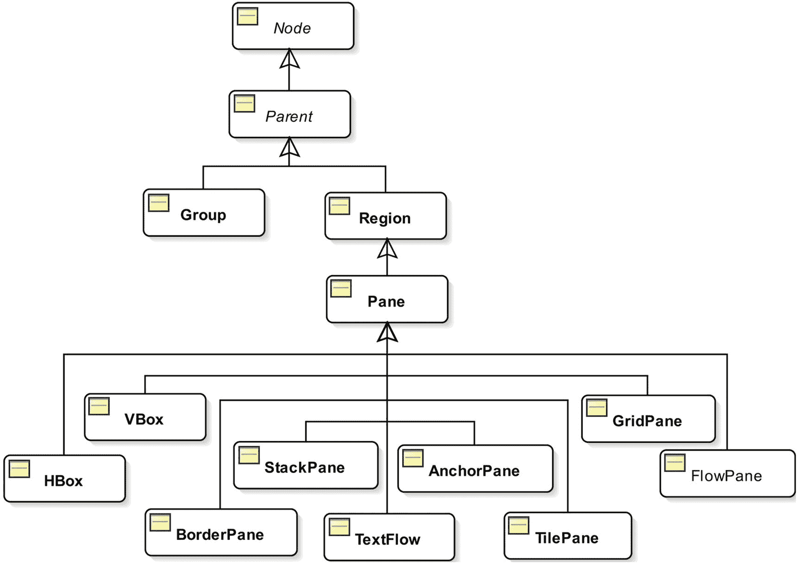

图 10-1

JavaFX 中容器类的类图

一个`Group`允许你将效果和变换应用到它的所有子节点上。`Group`级在`javafx.scene`包里。

`Region`类的子类用于布局子元素。它们可以用 CSS 样式化。`Region`类及其大多数子类都在`javafx.scene.layout`包中。

诚然，容器需要是`Parent`类的子类。然而，并不是所有的`Parent`类的子类都是容器。例如，`Button`类是`Parent`类的子类；但是，它是一个控件，而不是一个容器。必须将节点添加到容器中，使其成为场景图的一部分。容器根据其布局策略来布局其子容器。如果不希望容器管理节点的布局，需要将节点的`managed`属性设置为 false。请参考第 [6](06.html) 章，了解更多关于托管和非托管节点的详细信息和示例。

一个节点一次只能是一个容器的子节点。如果将一个节点添加到一个容器中，而该节点已经是另一个容器的子节点，则在将该节点添加到第二个容器之前，会将其从第一个容器中删除。通常，需要嵌套容器来创建复杂的布局。也就是说，您可以将一个容器作为子节点添加到另一个容器中。

`Parent`类包含三个方法来获取容器的子容器列表:

*   `protected ObservableList<Node> getChildren()`

*   `public ObservableList<Node> getChildrenUnmodifiable()`

*   `protected <E extends Node> List<E> getManagedChildren()`

`getChildren()`方法返回一个容器的子节点的可修改的`ObservableList`。如果您想要将节点添加到容器中，您可以将该节点添加到此列表中。这是容器类最常用的方法。我们一直用这种方法给`Group`、`HBox`、`VBox`等容器添加孩子。从第一个节目开始。

注意对`getChildren()`方法的`protected`访问。如果`Parent`类的子类不想成为一个容器，它将保持对这个方法的访问为`protected`。比如控制相关类(`Button`、`TextField`等)。)将这个方法保持为`protected`，这样就不能向它们添加子节点。一个容器类覆盖了这个方法并使其成为`public`。例如，`Group`和`Pane`类将这个方法公开为`public`。

在`Parent`类中`getChildrenUnmodifiable()`方法被声明为`public`。它返回一个只读的`ObservableList`子节点。它在两种情况下很有用:

*   您需要将容器的子列表传递给一个不应该修改该列表的方法。

*   你想知道控件是由什么组成的，而不是容器。

`getManagedChildren()`方法具有`protected`访问。容器类不会将其公开为`public`。在布局过程中，他们在内部使用它来获取托管子级的列表。您将使用这个方法推出您自己的容器类。

表 [10-1](#Tab1) 简要描述了容器类别。我们将在随后的章节中通过示例详细讨论它们。

表 10-1

容器类别列表

<colgroup><col class="tcol1 align-left"> <col class="tcol2 align-left"></colgroup> 
| 

集装箱等级

 | 

描述

 |
| --- | --- |
| `Group` | A `Group`将效果和变换一起应用到它的所有子节点。 |
| `Pane` | 它用于其子节点的绝对定位。 |
| `HBox` | 它将子对象水平排列在一行中。 |
| `VBox` | 它将子元素垂直排列在一列中。 |
| `FlowPane` | 它以行或列的形式水平或垂直排列其子节点。如果一行或一列放不下它们，它们将按指定的宽度或高度换行。 |
| `BorderPane` | 它将其布局区域划分为顶部、右侧、底部、左侧和中间区域，并将每个子区域放在五个区域之一。 |
| `StackPane` | 它以从后到前的堆栈方式排列其子元素。 |
| `TilePane` | 它将子节点排列在一个大小一致的网格中。 |
| `GridPane` | 它将子节点排列在大小可变的单元格网格中。 |
| `AnchorPane` | 它通过将子元素的边缘锚定到布局区域的边缘来排列子元素。 |
| `TextFlow` | 它展示了富文本，其内容可能由几个`Text`节点组成。 |

## 向布局窗格添加子项

容器是用来装孩子的。您可以在创建容器对象时或创建后将子对象添加到容器中。所有容器类都提供接受 var-args `Node`类型参数的构造器来添加初始的子集合。有些容器提供构造器来添加初始的一组子容器，并为容器设置初始属性。

创建容器后，您还可以随时向容器中添加子容器。容器将它们的子容器存储在一个可观察的列表中，可以使用`getChildren()`方法检索该列表。向容器添加节点就像向可观察列表添加节点一样简单。下面的代码片段显示了如何在创建`HBox`时和创建后向其添加子元素:

```java
// Create two buttons
Button okBtn = new Button("OK");
Button cancelBtn = new Button("Cancel");

// Create an HBox with two buttons as its children
HBox hBox1 = new HBox(okBtn, cancelBtn);

// Create an HBox with two buttons with 20px horizontal spacing between them
double hSpacing = 20;
HBox hBox2 = new HBox(hSpacing, okBtn, cancelBtn);

// Create an empty HBox, and afterwards, add two buttons to it
HBox hBox3 = new HBox();
hBox3.getChildren().addAll(okBtn, cancelBtn);

```

Tip

当你需要在一个容器中添加多个子节点时，使用`ObservableList`的`addAll()`方法，而不是多次使用`add()`方法。

## 实用程序类和枚举

使用布局窗格时，您需要使用几个与间距和方向相关的类和枚举。这些类和枚举在独立使用时没有用。它们总是被用作节点的属性。本节描述了其中的一些类和枚举。

### Insets 类

`Insets`类表示矩形区域四个方向的内部偏移:上、右、下、左。它是一个不可变的类。它有两个构造器，一个让您为所有四个方向设置相同的偏移，另一个让您为每个方向设置不同的偏移:

*   `Insets(double topRightBottomLeft)`

*   `Insets(double top, double right, double bottom, double left)`

`Insets`类声明了一个常数`Insets.EMPTY`，表示所有四个方向的零偏移。使用`getTop()`、`getRight()`、`getBottom()`和`getLeft()`方法获得特定方向的偏移值。

通过查看对`Insets`类的描述来理解术语 *insets* 的确切含义有点令人困惑。让我们在这一节详细讨论它的含义。我们在两个矩形的上下文中讨论 insets。插入是相同边缘之间的距离(从上到下，从左到左，等等。)的两个矩形。有四个插入值，矩形的每一边一个。`Insets`类的对象存储四个距离。图 [10-2](#Fig2) 显示了两个矩形以及内矩形相对于外矩形的插入。

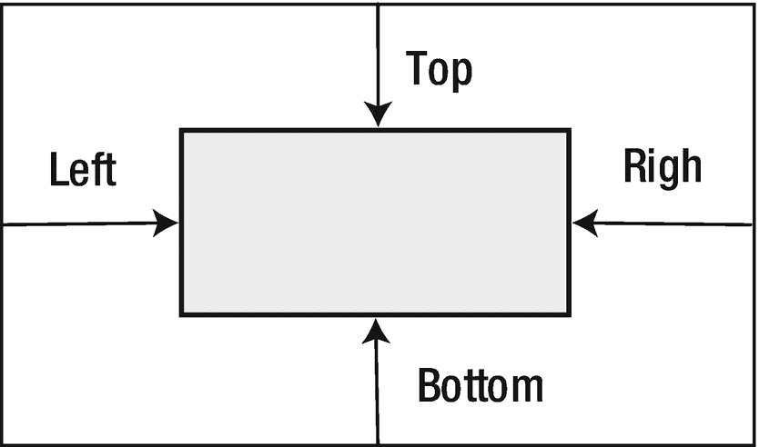

图 10-2

一个矩形区域相对于另一个矩形区域的插入

两个矩形可能重叠，而不是一个完全包含在另一个中。在这种情况下，一些插入值可能为正，一些为负。插入值相对于参考矩形进行解释。为了正确解释插入值，需要获得参考矩形的位置、其边缘以及需要测量插入值的方向。使用术语“插入”的上下文应该使这些信息可用。在图中，我们可以相对于内部或外部矩形定义相同的 insets。插入值不会改变。但是，参考矩形和测量插入的方向(确定插入值的符号)将会改变。

通常，在 JavaFX 中，术语 insets 和`Insets`对象在四种上下文中使用:

*   边框嵌入

*   背景插图

*   出口

*   昆虫

在前两个上下文中，insets 表示布局边界的边缘与边框的内边缘或背景的内边缘之间的距离。在这些内容中，insets 从布局边界的边缘向内测量。负值表示从布局边界边缘向外测量的距离。

边框笔画或图像可能落在`Region`的布局边界之外。外集是一个`Region`的布局边界的边缘和它的边界的外边缘之间的距离。外集也表示为一个`Insets`对象。

Javadoc for JavaFX 多次使用 insets 这个术语来表示从布局边界的所有边缘向内测量的边框和填充的厚度之和。在 Javadoc 中遇到 insets 这个术语时，要小心解释它的含义。

### HPos 枚举

`HPos`枚举定义了三个常量:`LEFT`、`CENTER`和`RIGHT`，用来描述水平定位和对齐。

### VPos 枚举

枚举的常量描述了垂直定位和对齐。它有四个常量:`TOP`、`CENTER`、`BASELINE`和`BOTTOM`。

### Pos 枚举

`Pos`枚举中的常量描述了垂直和水平定位和对齐。它拥有所有`VPos`和`HPos`常量组合的常量。`Pos`枚举中的常量有`BASELINE_CENTER`、`BASELINE_LEFT`、`BASELINE_RIGHT`、`BOTTOM_CENTER`、`BOTTOM_LEFT`、`BOTTOM_RIGHT`、`CENTER`、`CENTER_LEFT`、`CENTER_RIGHT`、`TOP_CENTER`、`TOP_LEFT`和`TOP_RIGHT`。它有两个方法——`getHpos()`和`getVpos()`——返回`HPos`和`VPos`枚举类型的对象，分别描述水平和垂直定位和对齐。

### 水平方向枚举

`HorizontalDirection`枚举有两个常量，`LEFT`和`RIGHT`，分别表示向左和向右的方向。

### VerticalDirection 枚举

`VerticalDirection`枚举有两个常量，`UP`和`DOWN`，分别表示向上和向下的方向。

### 方向枚举

`Orientation`枚举有两个常量，`HORIZONTAL`和`VERTICAL`，分别表示水平和垂直方向。

### 侧枚举

`Side`枚举有四个常量:`TOP`、`RIGHT`、`BOTTOM`和`LEFT`，用来表示矩形的四条边。

### 优先级枚举

有时，一个容器的可用空间可能多于或少于按照子容器的首选大小来布局子容器所需的空间。`Priority`枚举用于表示当其父节点有更多或更少的空间时，节点增长或收缩的优先级。它包含三个常量:`ALWAYS`、`NEVER`和`SOMETIMES`。具有`ALWAYS`优先级的节点总是随着可用空间的增加或减少而增加或减少。具有`NEVER`优先级的节点不会随着可用空间的增加或减少而增长或缩小。当没有其他具有`ALWAYS`优先级的节点或具有`ALWAYS`优先级的节点无法消耗所有增加或减少的空间时，具有`SOMETIMES`优先级的节点会增大或缩小。

## 理解小组

一个`Group`具有容器的特征；比如它有自己的布局策略和坐标系，是`Parent`类的子类。然而，将其称为节点的*集合或*组*，而不是*容器*，可以最好地反映其含义。它用于将节点集合作为单个节点(或一个组)进行操作。应用于`Group`的变换、效果和属性会应用于`Group`中的所有节点。*

A `Group`有自己的布局策略，除了给孩子他们喜欢的尺寸外，不提供任何特定的布局:

*   它按照添加节点的顺序呈现节点。

*   它不定位其子节点。默认情况下，所有子对象都位于(0，0)处。您需要编写代码来定位一个`Group`的子节点。使用子节点的`layoutX`和`layoutY`属性将它们定位在`Group`中。

*   默认情况下，它会将所有子元素的大小调整为自己喜欢的大小。可以通过将其`autoSizeChildren`属性设置为 false 来禁用自动调整大小行为。请注意，如果禁用自动调整大小属性，所有节点(形状除外)都将不可见，因为默认情况下它们的大小为零。

A `Group`没有自己的尺寸。它不能直接调整大小。它的大小是其子代的集合界限。当它的任何或所有子元素的边界改变时，它的边界也会改变。第 6 章[解释了如何计算不同类型的界限。](06.html)

### 创建组对象

您可以使用无参数构造器创建一个空的`Group`:

```java
Group emptyGroup = new Group();

```

`Group`类的其他构造器允许您向`Group`添加子元素。一个构造器以一个`Collection<Node>`作为初始子体；另一个采用了一个`Node`类型的 var-args。

```java
Button smallBtn = new Button("Small Button");
Button bigBtn = new Button("This is a big button");

// Create a Group with two buttons using its var-args constructor
Group group1 = new Group(smallBtn, bigBtn);

List<Node> initialList = new ArrayList<>();
initailList.add(smallBtn);
initailList.add(bigBtn);

// Create a Group with all Nodes in the initialList as its children
Group group2 = new Group(initailList);

```

### 渲染组中的节点

一个`Group`的子元素按照它们被添加的顺序被渲染。以下代码片段在阶段中显示时，如图 [10-3](#Fig3) 所示:


图 10-3

组中子对象的渲染顺序:第一个较小，第二个较大

```java
Button smallBtn = new Button("Small button");
Button bigBtn = new Button("This is a big button");
Group root = new Group();
root.getChildren().addAll(smallBtn, bigBtn);
Scene scene = new Scene(root);

```

注意，我们在`Group`中添加了两个按钮。仅显示了其中一个按钮。较小的按钮首先呈现，因为它是集合中的第一个按钮。较大的按钮呈现为覆盖较小的按钮。两个按钮都存在。一个藏在另一个下面。如果我们交换添加按钮的顺序，使用下面的语句，产生的屏幕将如图 [10-4](#Fig4) 所示。请注意，较大按钮的左边部分被较小按钮覆盖，而右边部分仍然显示。

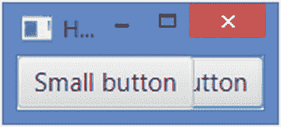

图 10-4

组中子对象的渲染顺序:第一个大，第二个小

```java
// Add the bigger button first
root.getChildren().addAll(bigBtn, smallBtn);

```

Tip

如果您不希望`Group`中的节点重叠，您需要设置它们的位置。

### 在组中定位节点

您可以通过使用节点的`layoutX`和`layoutY`属性为子节点分配绝对位置来定位子节点。或者，您可以使用绑定 API 来定位它们相对于`Group`中其他节点的位置。

清单 [10-1](#PC7) 展示了如何在`Group`中使用绝对和相对定位。图 [10-5](#Fig5) 显示了结果屏幕。程序在`Group`上增加了两个按钮( *OK* 和 *Cancel* )。 *OK* 按钮采用绝对定位；它被放置在(10，10)处。`Cancel`按钮相对于 *OK* 按钮放置；其垂直位置与 *OK* 按钮相同；其水平位置在 *OK* 按钮右边缘后 10px。注意使用*流畅绑定 API* 来完成*取消*按钮的相对定位。

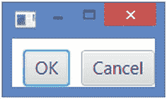

图 10-5

具有两个使用相对位置的按钮的组

```java
// NodesLayoutInGroup.java
// ... full listing in the book's download area.

Listing 10-1Laying Out Nodes in a Group

```

### 将效果和变换应用到群组

当您将效果和变换应用到`Group`时，它们会自动应用到它的所有子对象。在`Group`上设置属性，例如`disable`或`opacity`属性，会在它的所有子节点上设置属性。

清单 [10-2](#PC8) 展示了如何将效果、变换和状态应用到`Group`中。程序给`Group`增加了两个按钮。它应用 10 度的旋转变换、投影效果和 80%的不透明度。图 [10-6](#Fig6) 显示应用于`Group`的变换、效果和状态应用于它的所有子节点(本例中为两个按钮)。

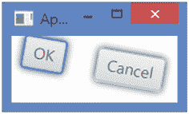

图 10-6

效果、变换和状态应用到群组后，群组中的两个按钮

```java
// GroupEffect.java
// ... full listing in the book's download area.

Listing 10-2Applying Effects and Transformations to a Group

```

### 用 CSS 样式化一个组

这个类没有提供太多的 CSS 样式。`Node`类的所有 CSS 属性都可用于`Group`类:例如`-fx-cursor`、`-fx-opacity`、`-fx-rotate`等。一个`Group`不能有自己的外观，比如填充、背景和边框。

## 了解区域

`Region`是所有布局窗格的基类。可以用 CSS 样式化。不像`Group`，它有自己的大小。它可以调整大小。它可以具有视觉外观，例如，具有填充、多种背景和多种边框。你不能直接使用`Region`类作为布局窗格。如果你想推出你自己的布局面板，扩展`Pane`类，它扩展了`Region`类。

Tip

`Region`类被设计成支持背景和边框的 CSS3 规范，因为它们适用于 JavaFX。“CSS 背景和边框模块三级”的规范可以在 [`www.w3.org/TR/css-backgrounds-3/`](http://www.w3.org/TR/css-backgrounds-3/) 在线找到。

默认情况下，`Region`定义一个矩形区域。然而，它可以被改变成任何形状。一个`Region`的绘图区域被分成几个部分。根据属性设置，`Region`可能会超出其布局边界。`Region`的零件:

*   背景(填充和图像)

*   内容区域

*   填料

*   边框(笔画和图像)

*   边缘

*   区域插图

图 [10-7](#Fig7) 显示了`Region`的部分。从 JavaFX 2 开始，不直接支持边距。使用`Insets`作为边框也可以得到同样的效果。


图 10-7

一个地区的不同部分

一个区域可以具有首先绘制的背景。内容区域是绘制`Region`(如控件)内容的区域。

填充是内容区域周围的可选空间。如果填充宽度为零，则填充边缘和内容区域边缘相同。

边界区域是填充周围的空间。如果边框宽度为零，则边框边缘和填充边缘相同。

边距是边框周围的空间。填充和边距非常相似。它们之间的唯一区别是边距定义了边框外边缘周围的空间，而填充定义了边框内边缘周围的空间。控件添加到窗格时支持边距，例如`HBox`、`VBox`等。然而，`Region`并不直接支持边距。

内容区域、填充和边框会影响`Region`的布局边界。您可以在`Region`的布局边界之外绘制边界，这些边界不会影响`Region`的布局边界。边距不影响`Region`的布局边界。

`Region`的布局边界边缘和它的内容区域之间的距离定义了`Region`的插入。`Region`类根据它的属性自动计算它的插入。它有一个只读的`insets`属性，您可以通过读取来了解它的 insets。请注意，布局容器需要知道放置其子容器的区域，并且它们可以在知道布局边界和插入的情况下计算内容区域。

Tip

按顺序绘制背景填充、背景图像、边框线条、边框图像和`Region`的内容。

### 设置背景

一个`Region`可以有一个由填充、图像或两者组成的背景。填充由颜色、四个角的半径和四条边的插入组成。填充按指定的顺序应用。颜色定义用于绘制背景的颜色。半径定义了用于拐角的半径；如果您想要矩形角，请将它们设置为零。插图定义了`Region`的边和背景填充的外边缘之间的距离。例如，顶部 10px 的插入意味着布局边界顶部边缘内 10px 的水平条带不会被背景填充绘制。填充的插图可能是负数。负插图将绘制区域扩展到`Region`的布局边界之外；在这种情况下，`Region`的绘制区域超出了它的布局边界。

以下 CSS 属性定义了`Region`的背景填充:

*   `-fx-background-color`

*   `-fx-background-radius`

*   `-fx-background-insets`

以下 CSS 属性用红色填充了`Region`的整个布局边界:

```java
-fx-background-color: red;
-fx-background-insets: 0;
-fx-background-radius: 0;

```

下列 CSS 属性使用两种填充:

```java
-fx-background-color: lightgray, red;
-fx-background-insets: 0, 4;
-fx-background-radius: 4, 2;

```

第一次填充用浅灰色覆盖整个`Region`(见 0px 插图)；它对所有四个角使用 4px 半径，`making the Region look like a rounded rectangle`。第二次填充用红色覆盖`Region`；它在所有四个边上都使用了 4px 插入，这意味着来自`Region`边缘的 4px 没有被该填充绘制，并且该区域仍然具有第一次填充使用的浅灰色。第二次填充使用所有四个角的 2px 半径。

您也可以使用 Java 对象在代码中设置`Region`的背景。一个`Background`类的实例代表了一个`Region`的背景。该类定义了一个`Background.EMPTY`常量来表示空背景(没有填充和图像)。

Tip

一个`Background`对象是不可变的。可以放心用作多个`Region`的背景。

一个`Background`对象有零个或多个填充和图像。`BackgroundFill`类的一个实例代表一种填充；`BackgroundImage`类的一个实例代表一幅图像。

`Region`类包含一个`ObjectProperty<Background>`类型的`background`属性。使用`setBackground(Background bg)`方法设置`Region`的背景。

下面的代码片段创建了一个带有两个`BackgroundFill`对象的`Background`对象。将此设置为`Region`会产生与使用 CSS 样式绘制两种填充的背景相同的效果，如前面的代码片段所示。注意，`Insets`和`CornerRadii`类用于定义填充的插入和圆角半径。

```java
import javafx.geometry.Insets;
import javafx.scene.layout.Background;
import javafx.scene.layout.BackgroundFill;
import javafx.scene.layout.CornerRadii;
import javafx.scene.paint.Color;
...
BackgroundFill lightGrayFill =
        new BackgroundFill(Color.LIGHTGRAY,
                           new CornerRadii(4), new Insets(0));

BackgroundFill redFill =
           new BackgroundFill(Color.RED,
                              new CornerRadii(2), new Insets(4));

// Create a Background object with two BackgroundFill objects

Background bg = new Background(lightGrayFill, redFill);

```

清单 [10-3](#PC12) 中的程序展示了如何使用 CSS 属性和`Background`对象为`Pane`(T1)设置背景。结果屏幕如图 [10-8](#Fig8) 所示。`getCSSStyledPane()`方法创建一个`Pane`，使用 CSS 添加两种填充的背景，并返回`Pane`。`getObjectStyledPane()`方法创建一个`Pane`，使用 Java 类添加带有两种填充的背景，并返回`Pane`。`start()`方法将两个`Pane`加到另一个`Pane`上，并将它们并排放置。


图 10-8

两个具有相同背景设置的窗格:一个使用 CSS，一个使用 Java 对象

```java
// BackgroundFillTest.java
// ... full listing in the book's download area.

Listing 10-3Using Background Fills As the Background for a Region

```

以下 CSS 属性定义了`Region`的背景图像:

*   `-fx-background-image`

*   `-fx-background-repeat`

*   `-fx-background-position`

*   `-fx-background-size`

属性是图片的 CSS URL。`-fx-background-repeat`属性指示图像将如何重复(或不重复)以覆盖`Region`的绘图区域。`-fx-background-position`决定图像在区域中的位置。`-fx-background-size`属性决定了图像相对于区域的大小。

以下 CSS 属性用红色填充了`Region`的整个布局边界:

```java
-fx-background-image: URL('your_image_url_goes_here');
-fx-background-repeat: space;
-fx-background-position: center;
-fx-background-size: cover;

```

下面的代码片段和前面的 CSS 属性集在设置到`Region`时会产生相同的效果:

```java
import javafx.scene.image.Image;
import javafx.scene.layout.Background;
import javafx.scene.layout.BackgroundImage;
import javafx.scene.layout.BackgroundPosition;
import javafx.scene.layout.BackgroundRepeat;
import javafx.scene.layout.BackgroundSize;
...
Image image = new Image("your_image_url_goes_here");
BackgroundSize bgSize = new BackgroundSize(100, 100, true, true, false, true);
BackgroundImage bgImage =
    new BackgroundImage(image,
                        BackgroundRepeat.SPACE,
                        BackgroundRepeat.SPACE,
                        BackgroundPosition.DEFAULT,
                        bgSize);

// Create a Background object with an BackgroundImage object

Background bg = new Background(bgImage);

```

### 设置填充

`Region`的填充是其内容区域周围的空间。`Region`类包含一个`ObjectProperty<Insets>`类型的`padding`属性。您可以为四条边中的每一条边设置单独的填充宽度:

```java
// Create an HBox
HBox hb = new HBox();

// A uniform padding of 10px around all edges
hb.setPadding(new Insets(10));

// A non-uniform padding: 2px top, 4px right, 6px bottom, and 8px left
hb.setPadding(new Insets(2, 4, 6, 8));

```

### 设置边框

一个`Region`可以有一个边框，由笔画、图像或两者组成。如果笔画和图像不存在，则边框被认为是空的。笔画和图像按指定的顺序应用；所有描边都在图像之前应用。您可以使用 CSS 和代码中的`Border`类来设置边框。

Note

在本节中，我们将同义地使用短语“a `Region`的边缘”和“a `Region`的布局边界”，它们表示由`Region`的布局边界定义的矩形的边缘。

笔画由五个属性组成:

*   一种颜色

*   一种风格

*   宽度

*   四个角的半径

*   四面有插图

颜色定义了笔画使用的颜色。您可以为四条边指定四种不同的颜色。

样式定义了笔画的样式:例如，实线、虚线等。样式还定义了边框相对于其插入的位置:例如，`inside`、`outside`或`centered`。您可以为四条边指定四种不同的样式。

半径定义了拐角的半径；如果您想要矩形角，请将它们设置为零。

笔画的宽度决定了它的粗细。您可以为四条边指定四种不同的宽度。

笔画的插入定义了从绘制边界的`Region`的布局边界边的距离。侧边插入的正值是从`Region`边缘向内测量的。侧面的插入负值是从`Region`的边缘向外测量的。边上零的插入表示布局的边缘限制自身。一些侧面(例如顶部和底部)可能具有正插入，而另一些侧面(例如右侧和左侧)可能具有负插入。图 [10-9](#Fig9) 显示了正负插入相对于 a `Region`布局边界的位置。实线中的矩形是`Region`的布局边界，虚线中的矩形是插入线。

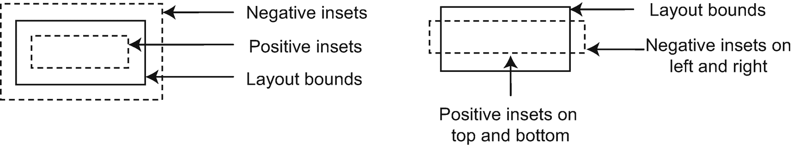

图 10-9

正插入和负插入相对于布局边界的位置

边框笔画可以画在`Region`布局边界的内部、外部，或者部分在内部，部分在外部。要确定一个笔画相对于布局边界的确切位置，需要查看它的两个属性， *insets* 和 *style* :

*   如果笔画的样式是`inside`，则笔画会画在插图内。

*   如果样式是外部的，它将绘制在插图的外部。

*   如果样式是居中的，它一半画在插图的里面，一半画在插图的外面。

图 [10-10](#Fig10) 显示了`Region`的边界位置的一些例子。虚线中的矩形表示`Region`的布局边界。边框以浅灰色显示。每个`Region`下面的标签显示了边框属性的一些细节(例如，样式、插入和宽度)。

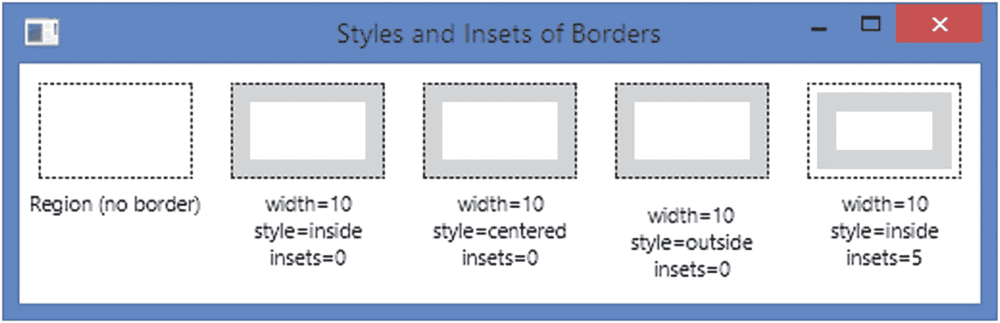

图 10-10

根据样式和插入内容确定边框位置的示例

以下 CSS 属性定义了`Region`的边框线条:

*   `-fx-border-color`

*   `-fx-border-style`

*   `-fx-border-width`

*   `-fx-border-radius`

*   `-fx-border-insets`

下面的 CSS 属性绘制一个宽度为 10px、颜色为红色的边框。边框的外边缘将与`Region`的边缘相同，因为我们已经分别将 insets 和 style 设置为零和内部。由于我们已经将所有角的半径设置为 5px，因此边界将在角上变圆:

```java
-fx-border-color: red;
-fx-border-style: solid inside;
-fx-border-width: 10;
-fx-border-insets: 0;
-fx-border-radius: 5;

```

下列 CSS 属性使用两种线条作为边框。第一个笔画画在`Region`的边缘内，第二个笔画画在边缘外:

```java
-fx-border-color: red, green;
-fx-border-style: solid inside, solid outside;
-fx-border-width: 5, 2 ;
-fx-border-insets: 0, 0;
-fx-border-radius: 0, 0;

```

Tip

在`Region`边缘外绘制的边框部分不影响其布局边界。在`Region`边缘外绘制的边框部分在`Region`的布局边界内。换句话说，落在`Region`边缘内的边界区域会影响那个`Region`的布局边界。

到目前为止，我们已经讨论了边框笔画的插入。一个边框也有*插入*和*输出*，这是根据其笔画和图像的属性自动计算的。考虑到在`Region`的边缘内*绘制的所有笔画和图像，`Region`的边缘与其边框的内边缘之间的距离被称为*边框的*插入。考虑到在`Region`的边缘*之外*绘制的所有笔画和图像，`Region`的边缘与其边框的外边缘之间的距离被称为边框的*外集*。你必须能够区分笔画的嵌入和边框的嵌入/外嵌。笔画的嵌入决定了笔画的位置，而边框的嵌入/外嵌告诉您边框在`Region`边缘的内侧/外侧延伸了多远。图 [10-11](#Fig11) 显示了如何计算一个边框的内插和外插。虚线显示了一个`Region`的布局边界，它的边界有两个笔画:一个红色，一个绿色。当在 150px `X` 50px `Region`上设置以下样式时，会产生如图 [10-11](#Fig11) 所示的边框:*


图 10-11

边框的内插/外插与区域的布局界限之间的关系

```java
-fx-background-color: white;
-fx-padding: 10;
-fx-border-color: red, green, black;
-fx-border-style: solid inside, solid outside, dashed centered;
-fx-border-width: 10, 8, 1;
-fx-border-insets: 12, -10, 0;
-fx-border-radius: 0, 0, 0;

```

边框的四条边的 insets 都是 22px，这是通过将从`Region`的边缘开始在 12px (insets)内绘制的红色边框的 10px 宽度相加得到的(10px + 12px)。所有四条边的边框外集都是 18px，这是通过将从`Region`的边缘画在 10px(–10 英寸)之外的绿色边框的 8px 宽度相加计算出来的(8px + 10px)。

您也可以使用 Java 对象在代码中设置`Region`的边框。一个`Border`类的实例代表了一个`Region`的边界。该类定义了一个`Border.EMPTY`常量来表示空边框(没有笔画和图像)。

Tip

一个`Border`对象是不可变的。它可以安全地用于多个`Region`

一个`Border`对象有零个或多个笔画和图像。`Border`类提供了几个接受多个笔画和图像作为参数的构造器。`Region`类包含一个`ObjectProperty<Border>`类型的`border`属性。使用`setBorder(Border b)`方法设置`Region`的边界。

`BorderStroke`类的一个实例代表一个笔画；`BorderImage`类的一个实例代表一幅图像。`BorderStroke`类提供了设置笔画样式的构造器。下面是两个常用的构造器。第三个构造器允许你在四边设置不同的颜色和风格。

*   `BorderStroke(Paint stroke, BorderStrokeStyle style, CornerRadii radii, BorderWidths widths)`

*   `BorderStroke(Paint stroke, BorderStrokeStyle style, CornerRadii radii, BorderWidths widths, Insets insets)`

`BorderStrokeStyle`类表示笔画的样式。`BorderWidths`类表示边框四边的笔画宽度。它允许您将宽度设置为绝对值或`Region`尺寸的百分比。下面的代码片段创建了一个`Border`，并将其设置为一个`Pane`:

```java
BorderStrokeStyle style =
    new BorderStrokeStyle(StrokeType.INSIDE,
                   StrokeLineJoin.MITER,
                   StrokeLineCap.BUTT,
                   10,
                   0,
                   null);
BorderStroke stroke =
    new BorderStroke(Color.GREEN,
                style,
                CornerRadii.EMPTY,
                new BorderWidths(8),
                new Insets(10));
Pane p = new Pane();
p.setPrefSize(100, 50);
Border b = new Border(stroke);
p.setBorder(b);

```

`Border`类提供了`getInsets()`和`getOutsets()`方法，为`Border`返回 insets 和 outsets。两种方法都返回一个`Insets`对象。请记住`Border`的插入和伸出与笔画的插入是不同的。它们是根据`Border`拥有的笔画和图像的插图和样式自动计算的。

您可以使用`Border`的`getStrokes()`和`getImages()`方法来获取`Border`的所有笔画和所有图像，这两个方法分别返回`List<BorderStroke>`和`List<BorderImage>`。您可以使用两个 Border 对象和两个`BorderStroke`对象的`equals()`方法来比较它们是否相等。

清单 [10-4](#PC20) 演示了如何创建和设置一个`Pane`的边框。它显示一个有两个`Pane`的屏幕。一个`Pane`使用 CSS 样式，另一个使用`Border`对象。`Pane` s 看起来与图 [10-11](#Fig11) 中所示的相似。该程序打印边界的插入和输出，并检查两个边界是否相同。两种边框都使用三种笔画。`getCSSStyledPane()`方法返回一个用 CSS 样式的`Pane`；`getObjectStyledPane()`方法使用一个`Border`对象返回一个`Pane`样式。

```java
// BorderStrokeTest.java

// ... full listing in the book's download area.
cssBorder insets:Insets [top=22.0, right=22.0, bottom=22.0, left=22.0]
cssBorder outsets:Insets [top=18.0, right=18.0, bottom=18.0, left=18.0]
objectBorder insets:Insets [top=22.0, right=22.0, bottom=22.0, left=22.0]
objectBorder outsets:Insets [top=18.0, right=18.0, bottom=18.0, left=18.0]
Borders are equal.

Listing 10-4Using Strokes As the Border for a Region

```

使用图像作为边框不像使用笔画那样简单。一幅图像定义了一个矩形区域；一个`Region`也是。在称为边界图像区域的区域中，围绕`Region`绘制边界。一个`Region`的边界区域可能是整个`Region`的区域；它可能部分或全部在`Region`的内部或外部。`Region`四边的插图定义了边界图像区域。为了使图像成为围绕`Region`的边界，边界图像区域和图像都被分成九个区域:四个角、四个边和一个中间。通过指定四边(上、右、下和左)的宽度，边框区域被分为九个部分。宽度是沿着那些边的边界的宽度。通过指定每边的切片宽度，图像也被切片(分割)成九个区域。图 [10-12](#Fig12) 显示了一个`Region`，一个图像及其九个区域(或切片)的边界图像区域。在图中，边界图像区域与区域的面积相同。


图 10-12

将区域和图像分割成九个部分

Tip

如果区域使用矩形以外的形状，则不会绘制边框图像。

注意，在划分边界区域和图像时，来自边缘的四个宽度不一定必须一致。例如，您可以将宽度指定为顶部 2px、右侧 10px、底部 2px 和左侧 10px。

将边框图像区域和图像分成九个区域后，需要指定控制图像切片的定位和调整大小行为的属性。图像的九个切片中的每一个都必须被定位并适合其在边界图像区域中的相应部分。例如，图像左上角的图像切片必须适合边界图像区域的左上角部分。图像切片及其对应的边界图像切片这两个分量可能大小不同。您将需要指定如何填充边界图像区域中的区域(缩放、重复等)。)和相应的图像切片。通常，图像的中间部分被丢弃。但是，如果您想要填充边界图像区域的中间区域，您可以使用图像的中间部分。

在图 [10-12](#Fig12) 中，`Region`和边界图像区域的边界是相同的。图 [10-13](#Fig13) 举例说明了边界图像区域的边界落在`Region`边界的内部和外部。边界图像区域的一些区域可能落在`Region`之外，而一些区域落在里面。

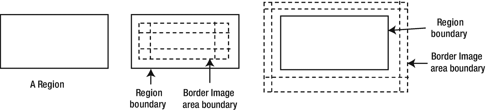

图 10-13

区域的面积和边界图像面积之间的关系

以下 CSS 属性定义了`Region`的边框图像:

*   `-fx-border-image-source`

*   `-fx-border-image-repeat`

*   `-fx-border-image-slice`

*   `-fx-border-image-width`

*   `-fx-border-image-insets`

属性是图片的 CSS URL。对于多个图像，使用图像的 CSS URLs 的逗号分隔列表。

`-fx-border-image-repeat`属性指定图像的一部分如何覆盖`Region`的相应部分。您可以分别为 x 轴和 y 轴指定属性。有效值:

*   `no-repeat`

*   `repeat`

*   `round`

*   `space`

`no-repeat`值指定应该缩放图像切片以填充该区域，而不重复它。`repeat`值指定图像应该重复(平铺)以填充该区域。`round`值指定图像应该重复(平铺)以使用整数个平铺块填充区域，并且如果需要，缩放图像以使用整数个平铺块。`space`值指定应重复(平铺)图像，以使用整数个平铺块填充该区域，而不缩放图像，并在平铺块周围均匀分布额外空间。

`-fx-border-image-slice`属性指定从图像的上、右、下和左边缘向内偏移，将图像分成九个部分。属性可以指定为数字文字或图像边长的百分比。如果值中存在单词 fill，则保留图像的中间部分，并用于填充边界图像区域的中间区域；否则，中间的切片被丢弃。

`-fx-border-image-width`属性指定从边界图像区域的四边向内偏移，将边界图像区域分成九个区域。请注意，我们将边界图像区域划分为九个区域，而不是区域。该属性可以指定为数字文本或边框图像区域边长的百分比。

`-fx-border-image-insets`属性指定了`Region`的边缘和四边的边框图像区域的边缘之间的距离。正嵌入是从`Region`的边缘向其中心测量的。从`Region`的边缘向外测量一个负嵌入。在图 [10-13](#Fig13) 中，中间`Region`的边界图像区域有正插图，而该区域(左三)的边界图像区域有负插图。

让我们看一些使用图像作为边框的例子。在所有的例子中，我们将使用图 [10-12](#Fig12) 所示的图像作为 200px X 70px `Pane`的边框。

清单 [10-5](#PC21) 包含 CSS，图 [10-14](#Fig14) 显示了当`-fx-border-image-repeat`属性设置为`no-repeat`、`repeat`、`space`和`round`时得到的`Pane` s。注意，我们已经将`-fx-border-image-width`和`-fx-border-image-slice`属性设置为相同的 9px 值。这将使角切片恰好适合边界图像区域的角。边界图像区域的中间区域没有被填充，因为我们没有为`-fx-border-image-slice`属性指定`fill`值。我们已经用笔画出了`Pane`的边界。


图 10-14

对重复使用不同的值，而不使用切片属性的填充值

```java
-fx-border-image-source: url('image_url_goes_here') ;
-fx-border-image-repeat: no-repeat;
-fx-border-image-slice: 9;
-fx-border-image-width: 9;
-fx-border-image-insets: 10;
-fx-border-color: black;
-fx-border-width: 1;
-fx-border-style: dashed inside;

Listing 10-5Using an Image As a Border Without Filling the Middle Region

```

清单 [10-6](#PC22) 包含 CSS，它是清单 [10-5](#PC21) 的一个微小变化。图 [10-15](#Fig15) 显示了结果`Panes`。这一次，边界图像区域的中间区域被填充，因为我们已经为`-fx-border-image-slice`属性指定了`fill`值。


图 10-15

对切片属性的填充值使用不同的重复值

```java
-fx-border-image-source: url('image_url_goes_here') ;
-fx-border-image-repeat: no-repeat;
-fx-border-image-slice: 9 fill;
-fx-border-image-width: 9;
-fx-border-image-insets: 10;
-fx-border-color: black;
-fx-border-width: 1;
-fx-border-style: dashed inside;

Listing 10-6Using an Image As a Border Filling the Middle Region

```

不可变的`BorderImage`类表示`Border`中的边框图像。边框图像的所有属性都在构造器中指定:

```java
BorderImage(Image image,
            BorderWidths widths,
            Insets insets,
            BorderWidths slices,
            boolean filled,
            BorderRepeat repeatX,
            BorderRepeat repeatY)

```

`BorderRepeat`枚举包含`STRETCH`、`REPEAT`、`SPACE`和`ROUND`常量，用于指示图像切片如何在 x 和 y 方向重复以填充边界图像区域。它们具有在 CSS 中指定`no-repeat`、`repeat`、`space`和`round`的相同效果。

```java
BorderWidths regionWidths = new BorderWidths(9);
BorderWidths sliceWidth = new BorderWidths(9);
boolean filled = false;
BorderRepeat repeatX = BorderRepeat.STRETCH;
BorderRepeat repeatY = BorderRepeat.STRETCH;
BorderImage borderImage =
    new BorderImage(new Image("image_url_goes_here"),
                    regionWidths,
                    new Insets(10),
                    sliceWidth,
                    filled,
                    repeatX,
                    repeatY);

```

清单 [10-7](#PC25) 有一个使用 CSS 和 Java 类创建边框的程序。产生的屏幕如图 [10-16](#Fig16) 所示。左边和右边的`Panes`用相同的边框装饰:一个使用 CSS，另一个使用 Java 类。


图 10-16

使用 CSS 和 Java 类创建带有笔画和图像的边框

```java
// BorderImageTest.java
// ... full listing in the book's download area.

Listing 10-7Using Strokes and Images As a Border

```

### 设置边距

不直接支持在`Region`上设置边距。大多数布局窗格支持其子窗格的边距。如果您想要一个`Region`的边距，将其添加到一个布局窗格，例如一个`HBox`，并使用布局窗格而不是`Region`:

```java
Pane p1 = new Pane();
p1.setPrefSize(100, 20);

HBox box = new HBox();

// Set a margin of 10px around all four sides of the Pane
HBox.setMargin(p1, new Insets(10));
box.getChildren().addAll(p1);

```

现在，使用`box`而不是`p1`来获得围绕`p1`的边距。

## 了解窗格

`Pane`是`Region`类的子类。它公开了`Parent`类的`getChildren()`方法，该类是`Region class`的超类。这意味着`Pane`类及其子类的实例可以添加任何子类。

一个`Pane`提供以下布局特征:

*   需要绝对定位时可以使用。默认情况下，它将其所有子节点定位在(0，0)处。您需要显式设置子项的位置。

*   它将所有可调整大小的子对象调整到他们喜欢的大小。

默认情况下，`Pane`有最小、首选和最大尺寸。它的最小宽度是左右插入的总和；它的最小高度是顶部和底部插入的总和。其首选宽度是在当前 x 位置以其首选宽度显示其所有子级所需的宽度；它的首选高度是在当前 y 位置显示其所有子级所需的高度，以及它们的首选高度。其最大宽度和高度设置为`Double.MAX_VALUE`。

清单 [10-8](#PC27) 中的程序展示了如何创建一个`Pane`，给它添加两个`Buttons`，以及如何定位`Buttons`。产生的屏幕如图 [10-17](#Fig17) 所示。`Pane`使用边框显示它在屏幕上占据的区域。试着调整窗口大小，你会发现`Pane`会收缩和扩张。


图 10-17

有两个按钮的窗格

```java
// PaneTest.java
// ... full listing in the book's download area.

Listing 10-8Using Panes

```

一个`Pane`让你设置它的首选大小:

```java
Pane root = new Pane();
root.setPrefSize(300, 200); // 300px wide and 200px tall

```

您可以通过将其首选宽度和高度重置为计算出的宽度和高度，告诉`Pane`根据其子尺寸计算其首选尺寸:

```java
Pane root = new Pane();

// Set the preferred size to 300px wide and 200px tall
root.setPrefSize(300, 200);

/* Do some processing... */

// Set the default preferred size

root.setPrefSize(Region.USE_COMPUTED_SIZE, Region.USE_COMPUTED_SIZE);

```

Tip

A `Pane`不剪辑其内容；它的子对象可能会显示在其边界之外。

## 了解 HBox

一个`HBox`在一个水平行中布置它的子元素。它允许您设置相邻子元素之间的水平间距、任何子元素的边距、调整子元素的行为等。它使用 0px 作为相邻子项之间的默认间距。内容区域和 HBox 的默认宽度足以以其首选宽度显示其所有子级，默认高度是其所有子级的最大高度。

您不能在`HBox`中设置孩子的位置。它们由 HBox 自动计算。您可以通过定制`HBox`的属性和设置子节点的约束，在一定程度上控制子节点的位置。

### 创建 HBox 对象

HBox 类的构造器允许您创建`HBox`对象，指定或不指定间距和初始子对象集:

```java
// Create an empty HBox with the default spacing (0px)
HBox hbox1 = new HBox();

// Create an empty HBox with a 10px spacing
HBox hbox2 = new HBox(10);

// Create an HBox with two Buttons and a 10px spacing
Button okBtn = new Button("OK");
Button cancelBtn = new Button("Cancel");
HBox hbox3 = new HBox(10, okBtn, cancelBtn);

```

清单 [10-9](#PC31) 中的程序展示了如何使用`HBox`。它给一个`HBox`增加了一个`Label`、一个`TextField`和两个`Buttons`。相邻子项之间的间距设置为 10px。10px 的填充用于保持`HBox`的边缘与其子项的边缘之间的距离。产生的窗口如图 [10-18](#Fig18) 所示。


图 10-18

一个带有标签、文本字段和两个按钮的 HBox

```java
// HBoxTest.java
// ... full listing in the book's download area.

Listing 10-9Using the HBox Layout Pane

```

### HBox 属性

`HBox`类声明了表 [10-2](#Tab2) 中列出的三个属性。

表 10-2

HBox 类中声明的属性

<colgroup><col class="tcol1 align-left"> <col class="tcol2 align-left"> <col class="tcol3 align-left"></colgroup> 
| 

财产

 | 

类型

 | 

描述

 |
| --- | --- | --- |
| `alignment` | `ObjectProperty<Pos>` | 它指定子元素相对于`HBox`内容区域的对齐方式。如果垂直对齐设置为`BASELINE`，则`fillHeight`属性被忽略。默认值为`Pos.TOP_LEFT`。 |
| `fillHeight` | `BooleanProperty` | 它指定是否调整可调整大小的子元素的大小以填充`HBox`的整个高度，或者给它们自己喜欢的高度。如果垂直对齐设置为`BASELINE`，该属性被忽略。默认值为 true。 |
| `spacing` | `DoubleProperty` | 它指定相邻子项之间的水平间距。默认值为零。 |

#### 对齐属性

使用`alignment`属性很简单。它指定了如何在`HBox`的内容区域内对齐子元素。默认情况下，`HBox`会为其内容分配足够的空间，以他们喜欢的大小排列所有的子元素。当`HBox`变得比它的首选大小时，对齐属性的效果是显而易见的。

清单 [10-10](#PC32) 中的程序使用了一个带有两个按钮的 HBox。它设置`HBox`到`Pos.BOTTOM_RIGHT`的对准。它将`HBox`的首选大小设置为比容纳其所有子节点所需的大小稍大一些，因此您可以看到对齐的效果。产生的窗口如图 [10-19](#Fig19) 所示。当您调整窗口大小时，子窗口在右下角区域保持对齐。


图 10-19

具有两个按钮和设置为 Pos 的对齐属性的 HBox。右下

```java
// HBoxAlignment.java
// ... full listing in the book's download area.

Listing 10-10Using the HBox Alignment Property

```

#### fillHeight 属性

`fillHeight`属性指定`HBox`是垂直扩展其子元素以填充其内容区域的高度，还是保持其首选高度。请注意，该属性只影响那些允许垂直扩展的子节点。例如，默认情况下，`Button`的最大高度被设置为其首选高度，即使有垂直空间，在`HBox`中，`Button`也不会变得比其首选宽度高。如果您想要一个按钮垂直扩展，将其最大高度设置为`Double.MAX_VALUE`。默认情况下，`TextArea`被设置为展开。因此，`HBox`内的`TextArea`会随着`HBox`高度的增加而变高。如果您不希望可调整大小的子元素填充`HBox`的内容区域的高度，请将`fillHeight`属性设置为 false。

Tip

一个`HBox`的内容区域的首选高度是其子元素的首选高度中最大的一个。如果可调整大小的子级的最大高度属性允许它们扩展，则它们将填充内容区域的整个高度。否则，它们会保持在自己喜欢的高度。

清单 [10-11](#PC33) 中的程序展示了`fillHeight`属性如何影响一个`HBox`的子元素的高度。它显示了一个`HBox`中的一些控件。一个`TextArea`默认可以垂直生长。*取消*按钮的最大高度设置为`Double.MAX_VALUE`，可以垂直增长。提供一个`CheckBox`来改变`HBox`的`fillHeight`属性的值。初始窗口如图 [10-20](#Fig20) 所示。注意`Ok`按钮具有首选高度，而*取消*按钮垂直扩展以填充由`TextArea`确定的内容区域的高度。调整窗口大小使其变高，并使用`CheckBox`更改`fillHeight`属性；`TextArea`和*取消*按钮垂直伸缩。

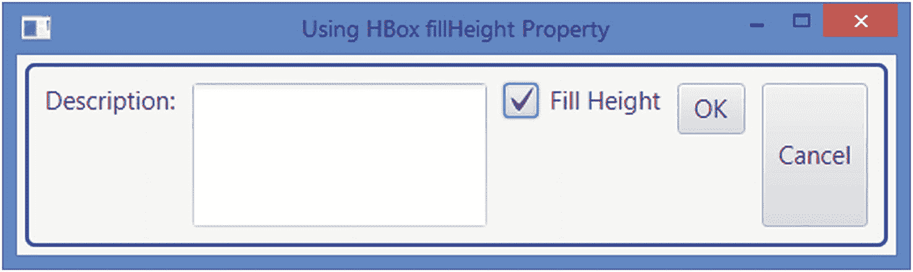

图 10-20

一个带有一些控件的 HBox，用户可以在其中更改 fillHeight 属性

```java
// HBoxFillHeight.java
// ... full listing in the book's download area.

Listing 10-11Using the fillHeight Property of an HBox

```

#### 间距属性

spacing 属性指定了`HBox`中相邻子元素之间的水平距离。默认情况下，它设置为 0px。它可以在构造器中设置或者使用`setSpacing()`方法。

### 在 HBox 中为孩子设置约束

`HBox`支持两种类型的约束， *hgrow* 和 *margin* ，可以在每个子节点上单独设置。`hgrow`约束指定当额外空间可用时，子节点是否水平扩展。边距约束指定子节点边缘之外的空间。`HBox`类提供了`setHgrow()`和`setMargin()`静态方法来指定这些约束。您可以使用`null`和这些方法单独移除约束。使用`clearConstraints(Node child)`方法一次删除子节点的两个约束。

#### 让孩子横向成长

默认情况下，`HBox`中的子元素会得到他们喜欢的宽度。如果`HBox`是水平扩展的，它的子节点可以获得额外的可用空间，前提是它们的`hgrow`优先级设置为增长。如果一个`HBox`被水平展开，并且它的所有子节点都没有设置`hgrow`约束，那么额外的空间就没有被使用。

通过指定子节点和优先级，使用`HBox`类的`setHgrow()`静态方法设置子节点的`hgrow`优先级:

```java
HBox root = new HBox(10);
TextField nameFld = new TextField();

// Let the TextField always grow horizontally
root.setHgrow(nameFld, Priority.ALWAYS);

```

要重置子节点的 hgrow 优先级，使用`null`作为优先级:

```java
// Stop the TextField from growing horizontally
root.setHgrow(nameFld, null);

```

清单 [10-12](#PC36) 中的程序展示了如何将一个`TextField`的优先级设置为`Priority.ALWAYS`，这样当`HBox`展开时，它可以占用所有额外的水平空间。图 [10-21](#Fig21) 显示了初始和扩展窗口。请注意，在窗口水平扩展后，除了`TextField`之外的所有控件都保持其首选宽度。

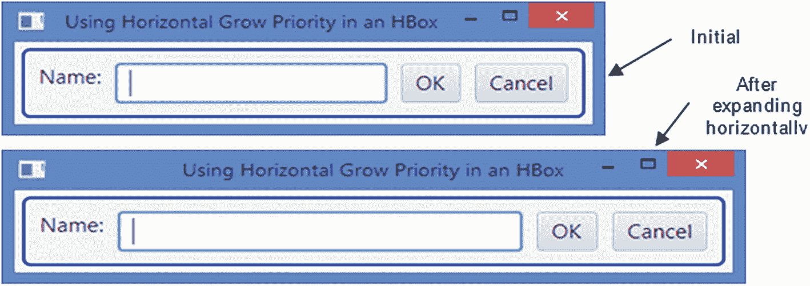

图 10-21

文本字段设置为总是水平增长的 HBox

```java
// HBoxHGrow.java
// ... full listing in the book's download area.

Listing 10-12Letting a TextField Grow Horizontally

```

#### 为孩子设置边距

边距是在节点边缘之外添加的额外空间。以下代码片段显示了如何向`HBox`的子对象添加边距:

```java
Label nameLbl = new Label("Name:");
TextField nameFld = new TextField();
Button okBtn = new Button("OK");
Button cancelBtn = new Button("Cancel");

HBox hbox = new HBox(nameLbl, nameFld, okBtn, cancelBtn);

// Set a margin for all children:
// 10px top, 2px right, 10px bottom, and 2px left
Insets margin = new Insets(10, 2, 10, 2);
HBox.setMargin(nameLbl, margin);
HBox.setMargin(nameFld, margin);
HBox.setMargin(okBtn, margin);
HBox.setMargin(cancelBtn, margin);

```

通过将 margin 值设置为 null，可以删除子节点的边距:

```java
// Remove margins for okBtn
HBox.setMargin(okBtn, null);

```

Tip

使用`HBox`的`spacing`属性和其子元素的边距约束时要小心。两者都会增加相邻孩子之间的水平差距。如果希望应用边距，请保持子项之间的水平间距一致，并将子项的左右边距设置为零。

## 了解 VBox

一个`VBox`在一个单独的垂直列中布置它的子元素。它允许您设置相邻子元素之间的垂直间距、任何子元素的边距、调整子元素的行为等。它使用 0px 作为相邻子项之间的默认间距。一个`VBox`的内容区域的默认高度足够以他们喜欢的高度显示它的所有子元素，并且默认宽度是它所有子元素的最大宽度。

您不能在`VBox`中设置孩子的位置。它们由`VBox`自动计算。您可以通过定制`VBox`的属性和设置子节点的约束，在一定程度上控制子节点的位置。

与`VBox`一起工作类似于与`HBox`一起工作，不同之处在于它们的工作方向相反。比如在一个`HBox`中，子项默认填充内容区域的高度，在一个`VBox`中，子项默认填充内容的宽度；一个`HBox`让您在子节点上设置`hgrow`约束，一个`VBox`让您设置`vgrow`约束。

### 创建 VBox 对象

`VBox`类的构造器允许您创建`VBox`对象，指定或不指定间距和初始子对象集:

```java
// Create an empty VBox with the default spacing (0px)
VBox vbox1 = new VBox();

// Create an empty VBox with a 10px spacing
VBox vbox2 = new VBox(10);

// Create a VBox with two Buttons and a 10px spacing
Button okBtn = new Button("OK");
Button cancelBtn = new Button("Cancel");
VBox vbox3 = new VBox(10, okBtn, cancelBtn);

```

清单 [10-13](#PC40) 中的程序展示了如何使用`VBox`。它给一个`VBox`增加了一个`Label`，一个`TextField`，两个`Buttons`。相邻子项之间的间距设置为 10px。10px 的填充用于保持`VBox`的边缘与其子项的边缘之间的距离。产生的窗口如图 [10-22](#Fig22) 所示。


图 10-22

一个带有标签、文本字段和两个按钮的 VBox

```java
// VBoxTest.java
// ... full listing in the book's download area.

Listing 10-13Using the VBox Layout Pane

```

### VBox 属性

`VBox`类声明了表 [10-3](#Tab3) 中列出的三个属性。

表 10-3

VBox 类中声明的属性

<colgroup><col class="tcol1 align-left"> <col class="tcol2 align-left"> <col class="tcol3 align-left"></colgroup> 
| 

财产

 | 

类型

 | 

描述

 |
| --- | --- | --- |
| `alignment` | `ObjectProperty<Pos>` | 它指定子元素相对于`VBox`内容区域的对齐方式。默认值为`Pos.TOP_LEFT`。 |
| `fillWidth` | `BooleanProperty` | 它指定可调整大小的子元素是调整大小以填充`VBox`的整个宽度，还是给它们自己喜欢的宽度。默认值为 true。 |
| `spacing` | `DoubleProperty` | 它指定相邻子项之间的垂直间距。默认值为零。 |

#### 对齐属性

使用`alignment`属性很简单。它指定了如何在`VBox`的内容区域内对齐子元素。默认情况下，`VBox`会为其内容分配足够的空间，以他们喜欢的大小来布局所有的孩子。当`VBox`变得比它的首选大小时，对齐属性的效果是显而易见的。

清单 [10-14](#PC41) 中的程序使用一个带有两个`Button`的`VBox`，它将`VBox`的对齐设置为`Pos.BOTTOM_RIGHT`。它将`VBox`的首选大小设置为比容纳其所有子节点所需的大小稍大一些，因此您可以看到对齐的效果。产生的窗口如图 [10-23](#Fig23) 所示。当您调整窗口大小时，子窗口在右下角区域保持对齐。

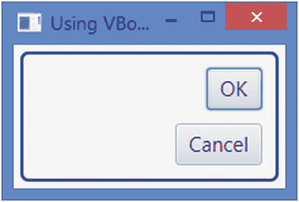

图 10-23

带有两个按钮和一个设置为 Pos 的对齐属性的 VBox。右下

```java
// VBoxAlignment.java
// ... full listing in the book's download area.

Listing 10-14Using the VBox Alignment Property

```

#### fullwidth 属性

`fillWidth`属性指定`VBox`是水平扩展其子元素以填充其内容区域的宽度，还是将它们保持在自己喜欢的高度。请注意，该属性仅影响那些允许水平扩展的子节点。例如，默认情况下，`Button`的最大宽度被设置为其首选宽度，即使水平空间可用，`Button`也不会变得比其在`VBox`中的首选宽度更宽。如果你想要一个`Button`水平扩展，设置它的最大宽度为两倍。`MAX_VALUE`。默认情况下，`TextField`被设置为展开。因此，`VBox`内的`TextField`会随着`VBox`宽度的增加而变宽。如果您不希望可调整大小的子元素填充`VBox`内容区域的宽度，请将`fillWidth`属性设置为 false。运行清单 [10-13](#PC40) 中的程序，尝试水平扩展窗口。随着窗口的扩展，`TextField`将水平扩展。

Tip

一个`VBox`的内容区域的首选宽度是其子元素的首选宽度的最大值。如果可调整大小的子级的最大宽度属性允许它们扩展，则它们会填充内容区域的整个宽度。否则，它们将保持其首选宽度。

在 GUI 应用程序中，经常需要在垂直列中排列一组`Button`并使它们大小相同。您需要将`buttons`添加到一个`VBox`中，并将所有按钮的最大宽度设置为`Double.MAX_VALUE`，这样它们就可以增长以匹配组中最宽的`button`的宽度。清单 [10-15](#PC42) 中的程序展示了如何实现这一点。图 [10-24](#Fig24) 显示了该窗口。

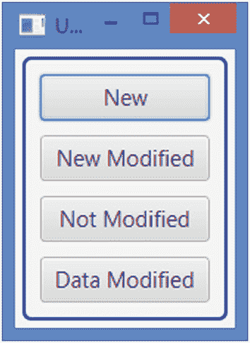

图 10-24

带有一些控件的 VBox，用户可以在其中更改 fillWidth 属性

```java
// VBoxFillWidth.java
// ... full listing in the book's download area.

Listing 10-15Using the fillWidth Property of a VBox

```

当您水平展开清单 [10-16](#PC45) 中的`VBox`时，所有按钮都会增长以填充可用的额外空间。为了防止`VBox`在水平方向扩展时按钮变大，可以在`HBox`中添加`VBox`，并在场景中添加`HBox`。

Tip

您可以通过嵌套`HBox`和`VBox`布局窗格来创建强大的视觉效果。您还可以在`GridPane`的一列中添加按钮(或任何其他类型的节点),使它们大小相同。更多详情请参考“*了解网格板*章节。

#### 间距属性

spacing 属性指定了`VBox`中相邻子元素之间的垂直距离。默认情况下，它设置为 0px。它可以在构造器中设置或者使用`setSpacing()`方法。

### 在 VBox 中为子对象设置约束

`VBox`支持两种类型的约束， *vgrow* 和 *margin* ，可以在每个子节点上单独设置。`vgrow`约束指定当额外空间可用时，子节点是否垂直扩展。边距约束指定子节点边缘之外的空间。`VBox`类提供了`setVgrow()`和`setMargin()`静态方法来指定这些约束。您可以使用`null`和这些方法单独移除约束。使用`clearConstraints(Node child)`方法一次删除子节点的两个约束。

#### 让孩子垂直成长

默认情况下，`VBox`中的孩子会得到他们喜欢的身高。如果`VBox`垂直扩展，它的子节点可以获得额外的可用空间，前提是它们的`vgrow`优先级设置为增长。如果一个`VBox`被垂直展开，并且它的子节点都没有设置`vgrow`约束，那么额外的空间就没有被使用。

通过指定子节点和优先级，使用`VBox`类的`setVgrow()`静态方法设置子节点的 vgrow 优先级:

```java
VBox root = new VBox(10);
TextArea desc = new TextArea();

// Let the TextArea always grow vertically
root.setVgrow(desc, Priority.ALWAYS);

```

要重置子节点的 vgrow 优先级，使用`null`作为优先级:

```java
// Stop the TextArea from growing horizontally
root.setVgrow(desc, null);

```

清单 [10-16](#PC45) 中的程序展示了如何设置`TextArea`到`Priority.ALWAYS`的优先级，这样当`VBox`展开时，它可以占用所有额外的垂直空间。图 [10-25](#Fig25) 显示了初始窗口和扩展窗口。请注意，在窗口垂直展开后，`Label`保持在它的首选高度。


图 10-25

TextArea 设置为始终垂直增长的 VBox

```java
// VBoxVGrow.java
// ... full listing in the book's download area.

Listing 10-16Letting a TextArea Grow Vertically

```

#### 为儿童设置边距

您可以使用`setMargin()`静态方法为`VBox`的子对象设置边距:

```java
Button okBtn = new Button("OK");
Button cancelBtn = new Button("Cancel");
VBox vbox = new VBox(okBtn, cancelBtn);

// Set margins for OK and cancel buttons
Insets margin = new Insets(5);
VBox.setMargin(okBtn, margin);
VBox.setMargin(cancelBtn, margin);
...
// Remove margins for okBtn
VBox.setMargin(okBtn, null);

```

## 了解 FlowPane

一个`FlowPane`是一个简单的布局窗格，它以指定的宽度或高度将它的子元素排列成行或列。它让其子元素水平或垂直流动，因此得名“流动窗格”您可以指定首选的换行长度，这是水平流的首选宽度和垂直流的首选高度，内容在垂直流中换行。一个`FlowPane`用在孩子的相对位置不重要的场合:比如显示一系列图片或者按钮。一个`FlowPane`给所有的孩子他们喜欢的尺寸。行和列可以具有不同的高度和宽度。您可以自定义行中子级的垂直对齐和列中子级的水平对齐。

Tip

水平`FlowPane`中的子元素可以从左到右或从右到左排列，这由在`Node`类中声明的`nodeOrientation`属性控制。该属性的默认值设置为`NodeOrientation.LEFT_TO_RIGHT`。如果希望子元素从右向左流动，请将该属性设置为`NodeOrientation.RIGHT_TO_LEFT`。这适用于所有按行排列子元素的布局窗格(如`HBox`、`TilePane`等)。).

可以设置为水平或垂直的`FlowPane`的方向决定了其内容的流向。在水平的`FlowPane`中，内容按行流动。在垂直的`FlowPane`中，内容以列的形式流动。图 [10-26](#Fig26) 和 [10-27](#Fig27) 显示了一个带有十个按钮的`FlowPane`。按钮是按照它们被标记的顺序添加的。即`Button 1`加在`Button 2`之前。图 [10-26](#Fig26) 中的`FlowPane`为水平方向，而图 [10-27](#Fig27) 中的`FlowPane`为垂直方向。默认情况下，`FlowPane`具有水平方向。

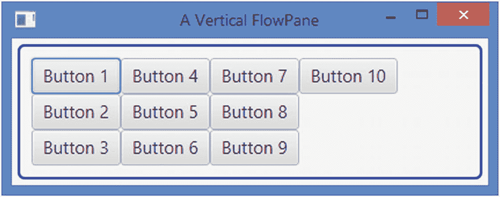

图 10-27

显示十个按钮的垂直流程窗格

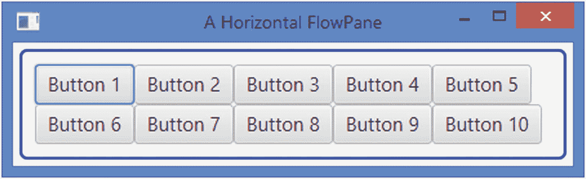

图 10-26

显示十个按钮的水平流程窗格

### 创建流程窗格对象

`FlowPane`类提供了几个构造器来创建具有指定方向(水平或垂直)、子对象之间的指定水平和垂直间距以及指定初始子对象列表的`FlowPane`对象:

```java
// Create an empty horizontal FlowPane with 0px spacing
FlowPane fpane1 = new FlowPane();

// Create an empty vertical FlowPane with 0px spacing
FlowPane fpane2 = new FlowPane(Orientation.VERTICAL);

// Create an empty horizontal FlowPane with 5px horizontal and 10px
// vertical spacing
FlowPane fpane3 = new FlowPane(5, 10);

// Create an empty vertical FlowPane with 5px horizontal and 10px
// vertical spacing
FlowPane fpane4 = new FlowPane(Orientation.VERTICAL, 5, 10);

// Create a horizontal FlowPane with two Buttons and 0px spacing
FlowPane fpane5 =
    new FlowPane(new Button("Button 1"), new Button("Button 2"));

```

清单 [10-17](#PC48) 中的程序展示了如何创建一个`FlowPane`并添加子节点。它增加了十个`Buttons`并使用 5px 水平和 10px 垂直间隙。窗口如图 [10-28](#Fig28) 所示。


图 10-28

带有十个按钮的水平窗格，使用 5px hgap 和 10px vgap

```java
// FlowPaneTest.java
// ... full listing in the book's download area.

Listing 10-17Using a Horizontal FlowPane

```

### 流程窗格属性

表 [10-4](#Tab4) 列出了几个`FlowPane`类属性，用于定制其子元素的布局。

表 10-4

FlowPane 类中声明的属性列表

<colgroup><col class="tcol1 align-left"> <col class="tcol2 align-left"> <col class="tcol3 align-left"></colgroup> 
| 

财产

 | 

类型

 | 

描述

 |
| --- | --- | --- |
| `alignment` | `ObjectProperty<Pos>` | 它指定了行和列相对于`FlowPane`内容区域的对齐方式。默认值为`Pos.TOP_LEFT`。 |
| `rowValignment` | `ObjectProperty<VPos>` | 它指定了水平`FlowPane`中每一行内的子元素的垂直对齐。对于垂直`FlowPane`它被忽略。 |
| `columnHalignment` | `ObjectProperty<HPos>` | 它指定了垂直`FlowPane`中每一列内的子元素的水平对齐方式。对于水平`FlowPane`它被忽略。 |
| `hgap, vgap` | `DoubleProperty` | 它们指定子对象之间的水平和垂直间距。默认值为零。 |
| `orientation` | `ObjectProperty <Orientation>` | 它指定了`FlowPane`的方向。默认为`HORIZONTAL`。 |
| `prefWrapLength` | `DoubleProperty` | 这是内容应该换行的水平方向的首选宽度`FlowPane`和垂直方向的首选高度`FlowPane`。默认值为 400。 |

#### 对齐属性

`FlowPane`的`alignment`属性控制其内容的对齐方式。一个`Pos`值包含垂直对齐(vpos)和水平对齐(hpos)。例如，`Pos.TOP_LEFT`将垂直对齐作为顶部，水平对齐作为左侧。在水平`FlowPane`中，每行使用`alignment,`的 hpos 值对齐，而行(整个内容)使用 vpos 值对齐。在竖排`FlowPane`中，使用`alignment,`的 vpos 值对齐每一列，使用 hpos 值对齐各列(整个内容)。

清单 [10-18](#PC49) 中的程序在一个`HBox`中显示三个`FlowPane`。每个`FlowPane`都有不同的排列。每个`FlowPane`中的`Text`节点显示使用的校准。图 [10-29](#Fig29) 显示了该窗口。


图 10-29

为其内容使用不同对齐方式的流程窗格

```java
// FlowPaneAlignment.java
// ... full listing in the book's download area.

Listing 10-18Using the Alignment Property of the FlowPane

```

#### rowValignment 和 columnHalignment 属性

一个`FlowPane`以他们喜欢的尺寸布局它的孩子。行和列可以具有不同的大小。您可以使用`rowValignment`和`columnHalignment`属性对齐每行或每列中的子元素。

在一个横排`FlowPane`中，一排的孩子可能身高不同。行的高度是该行中所有子级的最大首选高度。`rowValignment`属性允许您指定每行中子元素的垂直对齐方式。它的值可以被设置为`VPos`枚举的常量之一:`BASELINE`、`TOP`、`CENTER`和`BOTTOM`。如果子节点的最大高度值允许垂直扩展，则子节点将被扩展以填充行的高度。如果`rowValignment`属性被设置为`VPos.BASELINE`，子元素的大小将被调整到它们的首选高度，而不是扩展以填充行的整个高度。

在垂直`FlowPane`中，一列中的子元素可能有不同的宽度。列的宽度是该列中所有子列的最大首选宽度。`columnHalignment`属性允许您指定每列中子元素的水平对齐方式。它的值可以设置为`HPos`枚举的常量之一:`LEFT`、`RIGHT`和`CENTER`。如果子节点的最大宽度值允许水平扩展，子节点将被扩展以填充列的宽度。

清单 [10-19](#PC50) 中的程序创建了三个`FlowPane`并将它们添加到一个`HBox`中。图 [10-30](#Fig30) 显示了该窗口。前两个`FlowPanes`有水平方向，最后一个有垂直方向。行和列的对齐显示在`Text`节点，而`FlowPane`的方向显示在`TextArea`节点。


图 10-30

使用不同行和列对齐方式的流程窗格

```java
// FlowPaneRowColAlignment.java
// ... full listing in the book's download area.

Listing 10-19Using Row and Column Alignments in a FlowPane

```

#### hgap 和 vgap 属性

使用`hgap`和`vgap`属性很简单。在水平`FlowPane`中，`hgap`属性指定一行中相邻子元素之间的水平间距，`vgap`属性指定相邻行之间的间距。在垂直`FlowPane`中，`hgap`属性指定相邻列之间的水平间距，`vgap`属性指定一列中相邻子列之间的间距。您可以在构造器中或使用 setter 方法来设置这些属性。我们已经在本节讨论的例子中使用了这些属性。

```java
// Create a FlowPane with 5px hgap and 10px vgap
FlowPane fpane = new FlowPane(5, 10);
...
// Change the hgap to 15px and vgap to 25px
fpane.setHgap(15);
fpane.setVgap(25);

```

#### 方向属性

属性指定了一个`FlowPane`中的内容流。如果设置为默认值`Orientation.HORIZONTAL`，内容将按行排列。如果设置为`Orientation.VERTICAL`，内容将按列流动。您可以在构造器中指定`orientation`,或者使用 setter 方法:

```java
// Create a horizontal FlowPane
FlowPane fpane = new FlowPane();
...
// Change the orientation of the FlowPane to vertical
fpane.setOrientation(Orientation.VERTICAL);

```

#### prefWrapLength 属性

`prefWrapLength`属性是内容应该换行的水平`FlowPane`中的首选宽度或垂直`FlowPane`中的首选高度。这仅用于计算`FlowPane`的首选尺寸。默认为 400。将该属性的值视为调整您的`FlowPane`大小的提示。假设您将该值设置为小于子节点的最大首选宽度或高度。在这种情况下，不会考虑该值，因为行不能短于水平方向上最宽的子节点`FlowPane`，或者列不能短于垂直方向上最高的子节点`FlowPane`。如果 400px 对您的`FlowPane`来说太宽或太高，请将该值设置为一个合理的值。

### 流窗格的内容偏差

注意，水平`FlowPane`中的行数取决于其宽度，垂直`FlowPane`中的列数取决于其高度。也就是说，水平`FlowPane`具有水平内容偏差，垂直`FlowPane`具有垂直内容偏差。因此，当你得到一个`FlowPane`的大小时，一定要考虑到它的内容偏差。

## 了解边框窗格

A `BorderPane`将其布局区域分为五个区域:顶部、右侧、底部、左侧和中心。您最多可以在五个区域中的每个区域放置一个节点。图 [10-31](#Fig31) 显示五个`Buttons`放置在`BorderPane` — `one Button`的五个区域中。`Button`的标签与它们所在的地区相同。任何区域都可能是`null`。如果一个区域是`null`，则没有空间分配给它。

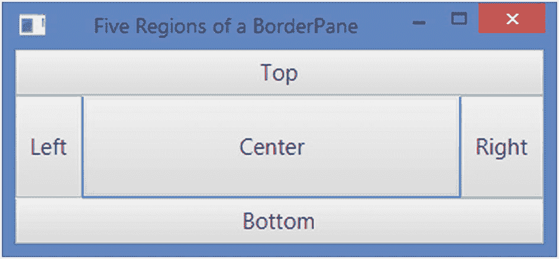

图 10-31

边框的五个区域

在典型的 Windows 应用程序中，屏幕使用五个区域来放置内容:

*   顶部的菜单或工具栏

*   底部的状态栏

*   左侧的导航面板

*   右侧的附加信息

*   中心的主要内容

一个`BorderPane`满足一个典型的基于 Windows 的 GUI 屏幕的所有布局要求。这就是为什么`BorderPane`通常被用作场景的根节点。通常，一个窗口中有五个以上的节点。如果您要在`BorderPane`的五个区域中的一个区域放置多个节点，请将这些节点添加到布局窗格中，例如`HBox`、`VBox`等。，然后将布局窗格添加到`BorderPane`的所需区域。

A `BorderPane`对其子节点使用以下调整大小策略:

*   顶部和底部区域中的子区域将被调整到其首选高度。它们的宽度被扩展以填充可用的额外水平空间，只要子元素的最大宽度允许扩展它们的宽度超过它们的首选宽度。

*   右区域和左区域中的子区域被调整到它们的首选宽度。他们的高度被延长以填充额外的垂直空间，只要儿童的最大高度允许他们的高度超过他们的首选高度。

*   中间的子节点将在两个方向上填充剩余的可用空间。

如果将`BorderPane`的尺寸调整到比其首选尺寸更小，则其中的子元素可能会重叠。重叠规则基于添加子项的顺序。子对象是按照添加的顺序绘制的。这意味着一个子节点可能会与之前添加的所有子节点重叠。假设区域按右、中、左的顺序填充。左区域可以与中心区域和右区域重叠，并且中心区域可以与右区域重叠。

Tip

您可以为区域内的所有子对象设置对齐方式。您可以为孩子设置边距。和所有布局窗格一样，你也可以用 CSS 来设计一个`BorderPane`的样式。

### 创建边框窗格对象

`BorderPane`类提供构造器来创建有或没有子对象的`BorderPane`对象:

```java
// Create an empty BorderPane
BorderPane bpane1 = new BorderPane();

// Create a BorderPane with a TextArea in the center
TextArea center = new TextArea();
BorderPane bpane2 = new BorderPane(center);

// Create a BorderPane with a Text node in each of the five regions
Text center = new Text("Center");
Text top = new Text("Top");
Text right = new Text("Right");
Text bottom = new Text("Bottom");
Text left = new Text("Left");
BorderPane bpane3 = new BorderPane(center, top, right, bottom, left);

```

`BorderPane`类声明了名为 top、right、bottom、left 和 center 的五个属性，这些属性存储了五个区域中五个孩子的引用。使用这些属性的设置器向五个区域中的任何一个添加子节点。例如，使用`setTop(Node topChild)`方法向顶部区域添加一个子节点。要获取这五个区域中任何一个区域的子元素的引用，可以使用这些属性的 getters。例如，`getTop()`方法返回顶部区域中子节点的引用。

```java
// Create an empty BorderPane and add a text node in each of the five regions
BorderPane bpane = new BorderPane();
bpane.setTop(new Text("Top"));
bpane.setRight(new Text("Right"));
bpane.setBottom(new Text("Bottom"));
bpane.setLeft(new Text("Left"));
bpane.setCenter(new Text("Center"));

```

Tip

不要使用`BorderPane`的`getChildren()`方法返回的`ObservableList<Node>`向`BorderPane`添加子节点。添加到此列表中的孩子将被忽略。请改用`top`、`right`、`bottom`、`left`和`center`属性。

清单 [10-20](#PC55) 中的程序展示了如何创建一个`BorderPane`并添加子节点。它将子项添加到右侧、底部和中心区域。两个`Label`、一个`TextField`和一个`TextArea`被添加到中心区域。一个带有两个按钮的`VBox`被添加到右侧区域。显示状态的`Label`被添加到底部区域。顶部和左侧区域设置为`null`。`BorderPane`被设置为场景的根节点。图 [10-32](#Fig32) 所示为窗口。

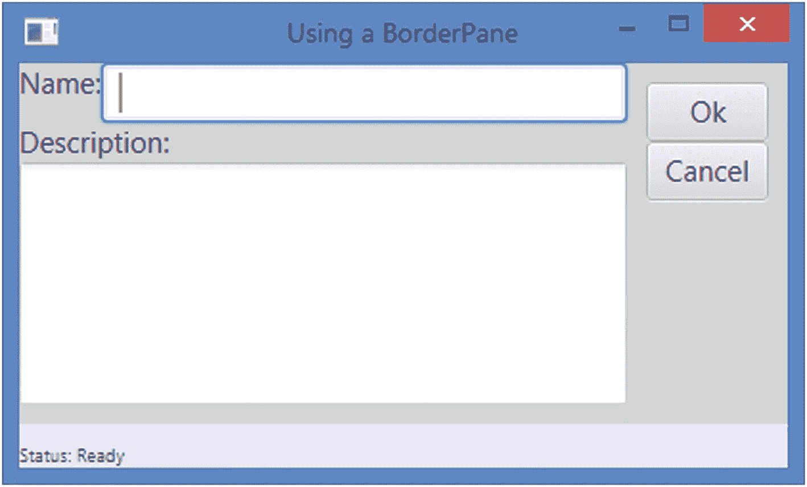

图 10-32

在顶部、右侧、底部和中间区域使用一些控件的边框窗格

```java
// BorderPaneTest.java
// ... full listing in the book's download area.

Listing 10-20Using the BorderPane Layout Pane

```

### 边框窗格属性

`BorderPane`类声明了五个属性:`top`、`right`、`bottom`、`left`和`center`。它们是`ObjectProperty<Node>`型的。它们将子节点的引用存储在`BorderPane`的五个区域中。使用这些属性的设置器向`BorderPane`添加子元素。使用属性的 getters 获取任何区域中子节点的引用。

回想一下，不是所有的五个区域都需要有节点。如果一个区域没有节点，则不会为其分配空间。使用 null 从区域中移除子节点。例如，`setTop(null)`将删除已经添加到顶部区域的节点。默认情况下，所有区域都有空节点作为其子节点。

### 为 BorderPane 中的子对象设置约束

一个`BorderPane`允许你在单个子节点上设置对齐和边距约束。子节点的对齐是相对于其区域定义的。默认对齐方式:

*   `Pos.TOP_LEFT`为顶层子节点

*   `Pos.BOTTOM_LEFT`为底层子节点

*   `Pos.TOP_LEFT`为左侧子节点

*   `Pos.TOP_RIGHT`为右子节点

*   `Pos.CENTER`为中心子节点

使用`BorderPane`类的`setAlignment(Node child, Pos value)`静态方法为子级设置对齐方式。`getAlignment(Node child)`静态方法返回子节点的对齐方式:

```java
BorderPane root = new BorderPane();
Button top = new Button("OK");
root.setTop(top);

// Place the OK button in the top right corner (default is top left)
BorderPane.setAlignment(top, Pos.TOP_RIGHT);
...
// Get the alignment of the top node
Pos alignment = BorderPane.getAlignment(top);

```

使用`BorderPane`类的`setMargin(Node child, Insets value)`静态方法为子元素设置边距。`getMargin(Node child)`静态方法返回子节点的边距:

```java
// Set 10px margin around the top child node
BorderPane.setMargin(top, new Insets(10));
...
// Get the margin of the top child node
Insets margin = BorderPane.getMargin(top);

```

使用`null`将约束重置为默认值。使用`BorderPane`的`clearConstraints(Node child)`静态方法一次重置子对象的所有约束:

```java
// Clear the alignment and margin constraints for the top child node
BorderPane.clearConstraints(top);

```

## 了解堆栈面板

一个`StackPane`在一个节点堆栈中布局它的子节点。使用起来很简单。然而，它提供了覆盖节点的强大手段。子对象是按照添加的顺序绘制的。即先画第一个子节点；接下来绘制第二个子节点，依此类推。例如，在形状上覆盖文本就像使用`StackPane`一样简单:添加形状作为第一个子节点，添加文本作为第二个子节点。首先绘制形状，然后绘制文本，这使得文本看起来好像是形状的一部分。

图 [10-33](#Fig33) 显示了一个将`StackPane`设置为场景根节点的窗口。一个`Rectangle`形状和一个带有文本“矩形”的`Text`节点被添加到`StackPane`中。最后添加`Text`，覆盖`Rectangle`。外边框是`StackPane`的边框。虚线内边框是`Rectangle`的边框。

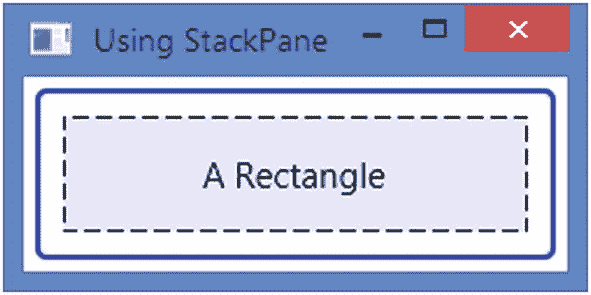

图 10-33

在堆栈窗格中覆盖矩形的文本节点

Tip

通过叠加不同类型的节点，您可以使用`StackPane`创建非常吸引人的 GUI。您可以在图像上叠加文本，以获得文本是图像一部分的效果。您可以叠加不同类型的形状来创建复杂的形状。请记住，覆盖其他节点的节点是最后添加到`StackPane`的。

`StackPane`的首选宽度是其最宽子对象的宽度。它的首选高度是它最高的孩子的高度。`StackPane`确实剪辑了它的内容。因此，它的子对象可能会被绘制到它的边界之外。

一个`StackPane`调整它的可调整大小的子元素的大小来填充它的内容区域，只要它们的最大大小允许它们扩展超过它们的首选大小。默认情况下，一个`StackPane`将它的所有子元素对齐到其内容区域的中心。您可以单独更改子节点的对齐方式，也可以更改所有子节点的对齐方式以使用相同的对齐方式。

### 创建 StackPane 对象

`StackPane`类提供构造器来创建有或没有子对象的对象:

```java
// Create an empty StackPane
StackPane spane1 = new StackPane();

// Add a Rectangle and a Text to the StackPane
Rectangle rect = new Rectangle(200, 50);
rect.setFill(Color.LAVENDER);
Text text = new Text("A Rectangle");
spane1.getChildren().addAll(rect, text);

// Create a StackPane with a Rectangle and a Text
Rectangle r = new Rectangle(200, 50);
r.setFill(Color.LAVENDER);
StackPane spane2 = new StackPane(r, new Text("A Rectangle"));

```

清单 [10-21](#PC60) 中的程序展示了如何创建一个`StackPane`。它给一个`StackPane`增加了一个`Rectangle`和一个`Text`。首先添加的是`Rectangle`，因此它与`Text`重叠。图 [10-33](#Fig33) 显示了该窗口。

```java
// StackPaneTest.java
// ... full listing in the book's download area.

Listing 10-21Using StackPane

```

您必须以特定的顺序将孩子添加到`StackPane`中，以创建所需的覆盖。孩子是按照他们在列表中的顺序绘制的。以下两条语句不会得到相同的结果:

```java
// Overlay a Text on a Rectangle
spane1.getChildren().addAll(rect, text);

// Overlay a Rectangle on a Text
spane1.getChildren().addAll(text, rect);

```

如果`Text`小于`Rectangle`，在`Text`上叠加`Rectangle`将隐藏`Text`。如果`Text`尺寸大于`Rectangle`，则`Text`在`Rectangle`边界之外的部分将可见。

清单 [10-22](#PC62) 中的程序显示了覆盖规则如何在`StackPane`中工作。`createStackPane()`方法创建一个带有`Rectangle`和`Text`的`StackPane`。它接受文本节点的文本、`Rectangle`的不透明度和一个`boolean`值，该值指示是否应该首先将`Rectangle`添加到`StackPane`。start 方法创建五个`StackPane`并将它们添加到一个`HBox`中。图 [10-34](#Fig34) 为窗口。

*   在第一个`StackPane`中，文本覆盖在矩形上。首先绘制矩形，然后绘制文本。两者都可见。

*   在第二个`StackPane`中，矩形覆盖在文本上。当矩形绘制在文本上并且比文本大时，文本隐藏在矩形后面。

*   在第三个`StackPane`中，矩形覆盖在文本上。与第二个 StackPane 不同，文本是可见的，因为我们将矩形的不透明度设置为 0.5，这使得它的透明度为 50%。

*   在第四个`StackPane`中，矩形覆盖在一个大文本上。矩形的不透明度为 100%。因此，我们只能看到矩形边界之外的文本部分。

*   在第五个`StackPane`中，矩形覆盖在一个大文本上。矩形的不透明度为 50%。我们可以看到整篇文章。矩形边界内的文本可见性为 50%，边界外的文本可见性为 100%。

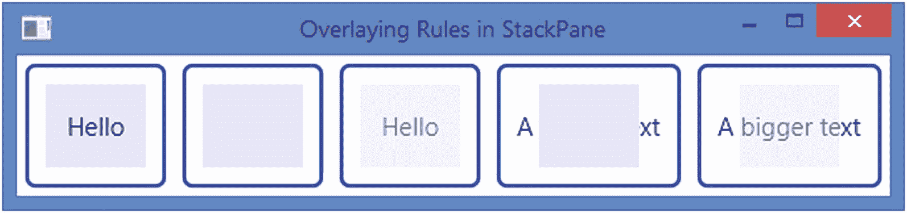

图 10-34

在文本上覆盖一个矩形，反之亦然

```java
// StackPaneOverlayTest.java
// ... full listing in the book's download area.

Listing 10-22Overlaying Rules in a StackPane

```

### 堆栈面板属性

`StackPane`类有一个`ObjectProperty<Pos>`类型的`alignment`属性。该属性定义了`StackPane`内容区域内所有子元素的默认对齐方式。默认情况下，它的值被设置为`Pos.CENTER`，这意味着默认情况下，所有子元素都在`StackPane`的内容区域的中心对齐。这就是我们在前面的例子中看到的。如果不希望所有子对象都使用默认对齐方式，可以将其更改为任何其他对齐方式值。请注意，更改`alignment`属性的值会为所有子对象设置默认对齐方式。

通过设置其`alignment`约束，单个子对象可以覆盖默认对齐。我们将在下一节讨论如何在子节点上设置对齐约束。

`StackPane`除了覆盖节点还有其他几个用途。每当您需要在特定位置对齐一个节点或一组节点时，请尝试使用`StackPane`。例如，如果您想在屏幕中央显示文本，请使用带有`Text`节点的`StackPane`作为场景的根节点。StackPane 负责在调整窗口大小时将文本保持在中心。如果没有`StackPane`，你将需要使用绑定来保持文本位于窗口的中心。

清单 [10-23](#PC63) 中的程序在一个`HBox`中使用了五个`StackPane`。每个`StackPane`都有一个覆盖着`Text`的`Rectangle`。`StackPane`及其所有子节点的对齐方式被用作文本节点的文本。图 [10-35](#Fig35) 为窗口。请注意，`StackPane` s 中的`Rectangle` s 比`Text` s 大。因此，`Rectangle` s 占据了 StackPanes 的整个内容区域，并且它们似乎不受对齐属性的影响。


图 10-36

在 StackPane 中使用不同对齐约束的子项

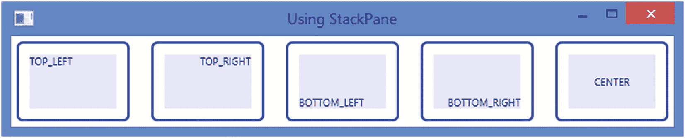

图 10-35

使用不同对齐值的堆栈窗格

```java
// StackPaneAlignment.java
// ... full listing in the book's download area.

Listing 10-23Using the Alignment Property of a StackPane

```

### 为孩子设置约束

一个`StackPane`允许你在单个子节点上设置对齐和边距约束。子节点的对齐是相对于`StackPane`的内容区域定义的。

您应该能够区分`StackPane`的`alignment`属性和其子元素上的对齐约束。`alignment`房产影响所有孩子。默认情况下，它的值用于对齐子级。子节点上的对齐约束覆盖了由`alignment`属性设置的默认对齐值。子节点上的对齐约束只影响该子节点的对齐，而`alignment`属性影响所有子节点。当绘制一个子节点时，JavaFX 使用子节点的对齐约束在`StackPane`的内容区域内对齐它。如果未设置对齐约束，则使用`StackPane`的`alignment`属性。

Tip

`StackPane`的`alignment`属性的默认值为`Pos.CENTER`。子对象对齐约束的默认值是`null`。

使用`StackPane`类的`setAlignment(Node child, Pos value)`静态方法为子对象设置对齐约束。`getAlignment(Node child)`静态方法返回子节点的对齐方式，参见清单 [10-24](#PC65) 和图 [10-36](#Fig36) 。：

```java
// StackPaneAlignmentConstraint.java
// ... full listing in the book's download area.

Listing 10-24Using the Alignment Constraints for Children in a StackPane

```

```java
// Place a Text node in the top left corner of the StackPane
Text topLeft = new Text("top-left");
StackPane.setAlignment(topLeft, Pos.TOP_LEFT);
StackPane root = new StackPane(topLeft);
...
// Get the alignment of the topLeft node
Pos alignment = StackPane.getAlignment(topLeft);

```

使用`StackPane`类的`setMargin(Node child, Insets value)`静态方法为子级设置边距。`getMargin(Node child)`静态方法返回子节点的边距:

```java
// Set 10px margin around the topLeft child node
StackPane.setMargin(topLeft, new Insets(10));
...
// Get the margin of the topLeft child node
Insets margin = StackPane.getMargin(topLeft);

```

使用`null`将约束重置为默认值。使用`StackPane`的`clearConstraints(Node child)`静态方法一次重置子对象的所有约束:

```java
// Clear the alignment and margin constraints for the topLeft child node
StackPane.clearConstraints(topLeft);

```

清除子节点的所有约束后，它将使用`StackPane`的`alignment`属性的当前值作为其对齐方式，并使用 0px 作为边距。

## 了解 TilePane

一个`TilePane`把它的子节点放在一个统一大小的网格中，这个网格被称为瓦片。`TilePane`的工作方式类似于`FlowPane`的工作方式，但有一点不同:在`FlowPane`中，行和列可以有不同的高度和宽度，而在`TilePane`中，所有的行都有相同的高度，所有的列都有相同的宽度。最宽的子节点的宽度和最高的子节点的高度是 TilePane 中所有图块的默认宽度和高度。

可以设置为水平或垂直的`TilePane`的方向决定了其内容的流向。默认情况下，`TilePane`具有水平方向。在水平的`TilePane`中，内容按行流动。行中的内容可以从左到右(默认)或从右到左排列。在垂直`TilePane`中，内容以列的形式流动。图 [10-37](#Fig37) 和 [10-38](#Fig38) 显示水平和垂直`TilePanes`。

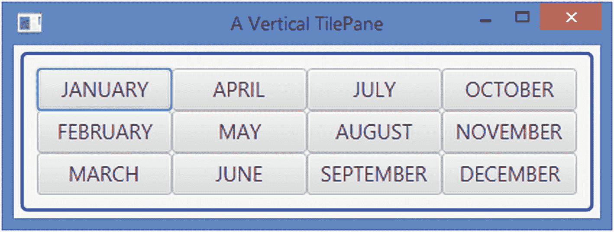

图 10-38

显示一年中月份的垂直平铺窗格


图 10-37

显示一年中月份的水平平铺窗格

您可以使用`TilePane`的属性或在单个子节点上设置约束来自定义其布局:

*   您可以覆盖平铺的默认大小。

*   您可以定制`TilePane`的整个内容在其内容区域内的对齐方式，默认为`Pos.TOP_LEFT`。

*   您还可以定制每个子节点在其 tile 中的对齐方式，默认为`Pos.CENTER`。

*   您可以指定相邻行和列之间的间距，默认为 0px。

*   您可以指定水平方向的首选列数`TilePane`和垂直方向的首选行数`TilePane`。首选行数和列数的默认值是五。

### 创建平铺窗格对象

`TilePane`类提供了几个构造器来创建具有指定方向(水平或垂直)、子对象之间的指定水平和垂直间距以及指定初始子对象列表的`TilePane`对象:

```java
// Create an empty horizontal TilePane with 0px spacing
TilePane tpane1 = new TilePane();

// Create an empty vertical TilePane with 0px spacing
TilePane tpane2 = new TilePane(Orientation.VERTICAL);

// Create an empty horizontal TilePane with 5px horizontal
// and 10px vertical spacing
TilePane tpane3 = new TilePane(5, 10);

// Create an empty vertical TilePane with 5px horizontal
// and 10px vertical spacing
TilePane tpane4 = new TilePane(Orientation.VERTICAL, 5, 10);

// Create a horizontal TilePane with two Buttons and 0px spacing
TilePane tpane5 = new TilePane(
    new Button("Button 1"), new Button("Button 2"));

```

清单 [10-25](#PC69) 中的程序展示了如何创建一个`TilePane`并添加子节点。它使用来自`java.time`包的`Month`枚举来获取 ISO 月份的名称。产生的窗口如图 [10-37](#Fig37) 所示。

```java
// TilePaneTest.java
// ... full listing in the book's download area.

Listing 10-25Using TilePane

```

您可以修改清单 [10-25](#PC69) 中的代码，得到图 [10-38](#Fig38) 中的窗口。您需要将`TilePane`的方向指定为`Orientation.VERTICAL`，并使用 3 作为首选行数:

```java
import javafx.geometry.Orientation;
...
double hgap = 5.0;
double vgap = 5.0;
TilePane root = new TilePane(Orientation.VERTICAL, hgap, vgap);
root.setPrefRows(3);

```

### TilePane 属性

`TilePane`类包含几个属性，如表 [10-5](#Tab5) 中所列，这些属性允许你定制其子类的布局。

表 10-5

TilePane 类中声明的属性列表

<colgroup><col class="tcol1 align-left"> <col class="tcol2 align-left"> <col class="tcol3 align-left"></colgroup> 
| 

财产

 | 

类型

 | 

描述

 |
| --- | --- | --- |
| `alignment` | `ObjectProperty<Pos>` | 它指定了`TilePane`的内容相对于其内容区域的对齐方式。默认为`Pos.TOP_LEFT`。 |
| `tileAlignment` | `ObjectProperty<Pos>` | 它指定了平铺中所有子元素的默认对齐方式。默认为`Pos.CENTER`。 |
| `hgap, vgap` | `DoubleProperty` | `hgap`属性指定一行中相邻子元素之间的水平间距。属性指定一列中相邻子元素之间的垂直间距。两个属性的默认值都是零。 |
| `orientation` | `ObjectProperty<Orientation>` | 它指定了`TilePane`的方向–水平或垂直。默认为`HORIZONTAL`。 |
| `prefRows` | `IntegerProperty` | 它指定了垂直`TilePane`的首选行数。对于水平`TilePane`它被忽略。 |
| `prefColumns` | `IntegerProperty` | 它指定了水平`TilePane`的首选列数。对于垂直`TilePane`它被忽略。 |
| `prefTileWidth` | `DoubleProperty` | 它指定了每个单幅图块的首选宽度。默认情况下，使用最宽子项的宽度。 |
| `prefTileHeight` | `DoubleProperty` | 它指定了每个单幅图块的首选高度。默认情况下，使用最高的孩子的高度。 |
| `tileHeight` | `ReadOnlyDoubleProperty` | 它是一个只读属性，存储每个图块的实际高度。 |
| `tileWidth` | `ReadOnlyDoubleProperty` | 它是一个只读属性，存储每个单幅图块的实际宽度。 |

#### 对齐属性

`TilePane`的`alignment`属性控制其内容在其内容区域内的对齐方式。当`TilePane`的大小大于其内容时，您可以看到该属性的效果。该属性的工作方式与`FlowPane`的对齐属性相同。更多细节和说明请参见`FlowPane`的`alignment`属性描述。

#### titlealignment 属性

`tileAlignment`属性指定子元素在它们的图块中的默认对齐方式。请注意，该属性会影响小于图块大小的子对象。此属性会影响平铺中所有子对象的默认对齐方式。这可以通过设置单个子对象的对齐约束来覆盖。清单 [10-26](#PC71) 中的程序展示了如何使用`tileAlignment`属性。它显示显示窗口，如图 [10-39](#Fig39) 所示，有两个`TilePane`，一个`tileAlignment`属性设置为`Pos.CENTER`，另一个`Pos.TOP_LEFT`。


图 10-39

使用 titlealignment 属性

```java
// TilePaneTileAlignment.java
// ... full listing in the book's download area.

Listing 10-26Using the TileAlignment Property of TilePane

```

#### hgap 和 vgap 属性

`hgap`和`vgap`属性指定相邻列和相邻行之间的间距。它们默认为零。它们可以在构造器中指定，或者使用`TilePane`的`setHgap(double hg)`和`setVgap(double vg)`方法指定。

#### 方向属性

属性指定了一个`TilePane`中的内容流。如果设置为默认值`Orientation.HORIZONTAL`，内容将按行排列。如果设置为`Orientation.VERTICAL`，内容将按列流动。您可以在构造器中指定`orientation`,或者使用 setter 方法:

```java
// Create a horizontal TilePane
TilePane tpane = new TilePane();
...
// Change the orientation of the TilePane to vertical

tpane.setOrientation(Orientation.VERTICAL);

```

#### prefRows 和 prefColumns 属性

`prefRows`属性指定垂直`TilePane`的首选行数。对于一个横`TilePane`来说是忽略的。

`prefColumns`指定了水平`TilePane`的首选列数。对于一个垂直的`TilePane`，它被忽略。

`prefRows`和`prefColumns`的默认值为 5。建议您为这些属性使用合理的值。

请注意，这些属性仅用于计算`TilePane`的优选尺寸。如果`TilePane`的大小被调整到不同于其首选大小，这些值可能不会反映实际的行数或列数。在列表 [10-26](#PC71) 中，我们指定了三列作为首选列数。如果您将列表 [10-26](#PC71) 显示的窗口调整到更小的宽度，您可能只得到一两列，行数也会相应增加。

Tip

调用`FlowPane`的`prefWrapLength`属性，该属性用于确定`FlowPane`的首选宽度或高度。在`TilePane`中，`prefRows`和`prefColumns`属性的作用是一样的，在流程窗格中也是如此。

#### prefTileWidth 和 prefTileHeight 属性

A `TilePane`根据最宽和最高的孩子计算其瓷砖的首选尺寸。您可以使用`prefTileWidth`和`prefTileHeight`属性覆盖计算出的平铺宽度和高度。他们默认为`Region.USE_COMPUTED_SIZE`。如果它们的最小和最大尺寸允许它们被调整，那么`TilePane`试图调整它的子元素的大小以适合平铺的尺寸。

```java
// Create a TilePane and set its preferred tile width and height to 40px
TilePane tpane = new TilePane();
tpane.setPrefTileWidth(40);
tpane.setPrefTileHeight(40);

```

#### tileWidth 和 tileHeight 属性

`tileWidth`和`tileHeight`属性指定每个图块的实际宽度和高度。它们是只读属性。如果您指定了`prefTileWidth`和`prefTileHeight`属性，它们将返回它们的值。否则，它们会返回计算出的图块大小。

### 在 TilePane 中为子级设置约束

一个`TilePane`允许你在单个子节点上设置对齐和边距约束。子节点的对齐是在包含该子节点的图块中定义的。

您应该能够区分这三者:

*   一个`TilePane`的`alignment`属性

*   `TilePane`的`tileAlignment`属性

*   对`TilePane`的单个子对象的对齐约束

`alignment`属性用于对齐`TilePane`的内容区域内的内容(所有子内容)。它影响了整个`TilePane`的内容。

默认情况下,`tileAlignment`属性用于对齐图块中的所有子元素。修改此属性会影响所有子级。

子节点上的对齐约束用于在其图块内对齐子节点。它只影响设置它的子节点。它覆盖了使用`TilePane`的`tileAlignment`属性设置的子节点的默认对齐值。

Tip

一个`TilePane`的`tileAlignment`属性的默认值是`Pos.CENTER`。子对象对齐约束的默认值是`null`。

使用`TilePane`类的`setAlignment(Node child, Pos value)`静态方法为孩子设置对齐约束。`getAlignment(Node child)`静态方法返回子节点的对齐方式:

```java
// Place a Text node in the top left corner in a tile
Text topLeft = new Text("top-left");
TilePane.setAlignment(topLeft, Pos.TOP_LEFT);

TilePane root = new TilePane();
root.getChildren().add(topLeft);
...
// Get the alignment of the topLeft node
Pos alignment = TilePane.getAlignment(topLeft);

```

清单 [10-27](#PC75) 中的程序给一个`TilePane`添加了五个按钮。标有“三”的按钮使用了一个定制的图块对齐约束`Pos.BOTTOM_RIGHT`。所有其他按钮都使用默认的平铺对齐方式，即`Pos.CENTER`。图 [10-40](#Fig40) 为窗口。


图 10-40

在 TilePane 中使用不同对齐约束的子级

```java
// TilePaneAlignmentConstraint.java
// ... full listing in the book's download area.

Listing 10-27Using the Alignment Constraints for Children in a TilePane

```

使用`TilePane`类的`setMargin(Node child, Insets value)`静态方法为子级设置边距。`getMargin(Node child)`静态方法返回子节点的边距:

```java
// Set 10px margin around the topLeft child node
TilePane.setMargin(topLeft, new Insets(10));
...
// Get the margin of the topLeft child node
Insets margin = TilePane.getMargin(topLeft);

```

使用`null`将约束重置为默认值。使用`TilePane`的`clearConstraints(Node child)`静态方法一次重置子对象的所有约束:

```java
// Clear the tile alignment and margin constraints for the topLeft child node
TilePane.clearConstraints(topLeft);

```

清除子节点的所有约束后，它将使用`TilePane`的`tileAlignment`属性的当前值作为其对齐方式，并使用 0px 作为边距。

## 理解网格

`GridPane`是最强大的布局窗格之一。随着权力而来的是复杂性。所以，学起来也有点复杂。

一个`GridPane`在一个动态的单元格网格中布置它的子元素，单元格按行和列排列。网格是动态的，因为网格中单元的数量和大小是根据子单元的数量确定的。它们取决于对孩子的约束。网格中的每个单元格都由其在列和行中的位置来标识。列和行的索引从零开始。子节点可以放置在跨越多个单元的网格中的任何位置。一行中的所有单元格高度相同。不同行中的单元可以具有不同的高度。一列中的所有单元格宽度相同。不同列中的单元格可能具有不同的宽度。默认情况下，一行的高度足以容纳其中最高的子节点。一个列的宽度足以容纳其中最宽的子节点。您可以自定义每行和每列的大小。`GridPane`还允许行与行之间的垂直间距和列与列之间的水平间距。

`GridPane`默认不显示网格线。出于调试目的，您可以显示网格线。图 [10-41](#Fig41) 显示了`GridPane`的三个实例。第一个`GridPane`只显示网格线，没有子节点。第二个`GridPane`显示单元格位置，由行和列索引标识。在该图中，(cM，rN)表示第(M+1)列和第(N+1)行的单元。例如，(c3，r2)表示第四列第三行的单元格。第三个`GridPane`显示了网格中的六个按钮。五个按钮横跨一行和一列；其中一个横跨两行一列。

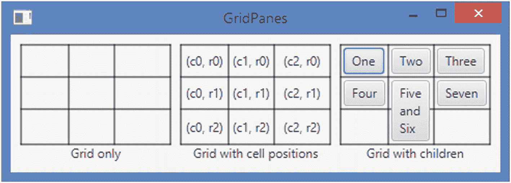

图 10-41

GridPanes 仅包含网格、单元格位置以及放置在网格中的子元素

在`GridPane`中，行从上到下被索引。最上面一行的索引为零。列从左到右或从右到左进行索引。如果`GridPane`的`nodeOrientation`属性被设置为`LEFT_TO_RIGHT`，则最左边的列的索引为 0。如果设置为`RIGHT_TO_LEFT`，最右边的列的索引为零。图 [10-41](#Fig41) 中的第二个网格显示了索引为零的最左边的列，这意味着它的`nodeOrientation`属性从`LEFT_TO_RIGHT`开始设置。

Tip

关于`GridPane`经常被问到的一个问题是，“我们需要在`GridPane`中布置多少个单元，多大的单元？”答案很简单，但有时令初学者困惑。您可以为子级指定单元位置和单元跨度。`GridPane`会计算出单元格的数量(行和列)以及它们的大小。也就是说，`GridPane`根据您为子元素设置的约束来计算单元格的数量及其大小。

### 创建网格对象

`GridPane`类包含一个无参数的构造器。它创建一个空的`GridPane`,行和列之间的间距为 0px，将需要稍后添加的子元素放在内容区域的左上角:

```java
GridPane gpane = new GridPane();

```

### 使网格线可见

`GridPane`类包含一个`BooleanProperty`类型的`gridLinesVisible`属性。它控制网格线的可见性。默认情况下，它设置为 false，并且栅格线不可见。它仅用于调试目的。当您想要查看子节点在网格中的位置时，请使用它。

```java
GridPane gpane = new GridPane();
gpane.setGridLinesVisible(true); // Make grid lines visible

```

### 向 GridPane 添加子项

像大多数其他布局窗格一样，GridPane 将其子元素存储在一个由`getChildren()`方法返回引用的`ObservableList<Node>`中。你不应该把孩子直接添加到`GridPane`列表中。相反，您应该使用一种方便的方法将子对象添加到 GridPane 中。当您将孩子添加到`GridPane`时，您应该为他们指定约束。最小约束是列和行索引，以标识它们所在的单元格。

让我们首先来看看将孩子直接添加到`GridPane`的可观察列表中的效果。清单 [10-28](#PC80) 包含了将三个按钮直接添加到一个`GridPane`的子列表中的程序。图 [10-42](#Fig42) 为窗口。请注意，这些按钮是重叠的。它们都被放置在相同的单元(c0，r0)中。它们按照添加到列表中的顺序绘制。

Tip

在`GridPane`中，默认情况下，所有子代都添加到仅跨越一列和一行的第一个单元格(c0，r0)中，因此彼此重叠。它们是按照添加的顺序绘制的。


图 10-42

三个按钮直接添加到 GridPane 的子列表中

```java
// GridPaneChildrenList.java
// ... full listing in the book's download area.

Listing 10-28Adding Children to the List of Children for a GridPane Directly

```

有两种方法可以解决清单 [10-28](#PC80) 中的子元素重叠问题:

*   我们可以在将它们添加到列表之前或之后设置它们的位置。

*   我们可以使用`GridPane`类的便利方法，这些方法允许在向`GridPane`添加孩子时指定位置和其他约束。

#### 设定儿童的位置

您可以使用`GridPane`类的以下三个静态方法之一来设置子节点的列和行索引:

*   `public static void setColumnIndex(Node child, Integer value)`

*   `public static void setRowIndex(Node child, Integer value)`

*   `public static void setConstraints(Node child,int columnIndex, int rowIndex)`

清单 [10-29](#PC81) 中的程序是清单 [10-28](#PC80) 中程序的修改版本。它将列索引和行索引添加到三个按钮中，因此它们位于一行中不同的列中。图 [10-43](#Fig43) 为窗口。


图 10-43

将三个按钮直接添加到 GridPane 中，然后设置它们的位置

```java
// GridPaneChildrenPositions.java
// ... full listing in the book's download area.

Listing 10-29Setting Positions for Children in a GridPane

```

#### 使用方便的方法添加孩子

`GridPane`类包含以下方便的方法来添加带有约束的子元素:

*   `void add(Node child, int columnIndex, int rowIndex)`

*   `void add(Node child, int columnIndex, int rowIndex, int colspan,int rowspan)`

*   `void addRow(int rowIndex, Node... children)`

*   `void addColumn(int columnIndex, Node... children)`

`add()`方法允许您添加一个指定列索引、行索引、列跨度和行跨度的子节点。

`addRow()`方法将指定的`children`添加到由指定的`rowIndex`标识的行中。子节点是按顺序添加的。如果该行已经包含子行，则指定的`children`将按顺序追加。例如，如果`GridPane`在指定的行中没有子节点，它将在列索引 0 处添加第一个子节点，在列索引 1 处添加第二个子节点，依此类推。假设指定的行已经有两个子行占据了列索引 0 和 1。`addRow()`方法将从列索引 2 开始添加子元素。

Tip

使用`addRow()`方法添加的所有子元素只跨越一个单元格。可以使用`GridPane`类的`setRowSpan(Node child, Integer value)`和`setColumnSpan(Node child, Integer value)`静态方法修改子节点的行和列跨度。修改子节点的行和列跨度时，请确保更新受影响子节点的行和列索引，以便它们不会重叠。

`addColumn()`方法将指定的`children`依次添加到由指定的`columnIndex`标识的列中。这个方法将子元素添加到列中，就像`addRow()`方法将子元素添加到行中一样。

下面的代码片段创建了三个`GridPane`并使用三种不同的方式向它们添加了四个按钮。图 [10-44](#Fig44) 显示了其中一个`GridPane` s。它们看起来都一样。

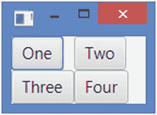

图 10-44

一个有四个按钮的格子

```java
// Add a child node at a time
GridPane gpane1 = new GridPane();
gpane1.add(new Button("One"), 0, 0);         // (c0, r0)
gpane1.add(new Button("Two"), 1, 0);         // (c1, r0)
gpane1.add(new Button("Three"), 0, 1);       // (c0, r1)
gpane1.add(new Button("Four"), 1, 1);        // (c1, r1)

// Add a row at a time
GridPane gpane2 = new GridPane();
gpane2.addRow(0, new Button("One"), new Button("Two"));
gpane2.addRow(1, new Button("Three"), new Button("Four"));

// Add a column at a time
GridPane gpane3 = new GridPane();
gpane3.addColumn(0, new Button("One"), new Button("Three"));
gpane3.addColumn(1, new Button("Two"), new Button("Four"));

```

#### 指定行和列跨度

子节点可能跨越多个行和列，这可以使用`rowSpan`和`colSpan`约束来指定。默认情况下，子节点跨越一列和一行。这些约束可以在添加子节点时指定，或者稍后在`GridPane`类中使用以下任何方法指定:

*   `void add(Node child, int columnIndex, int rowIndex, int colspan, int rowspan)`

*   `static void setColumnSpan(Node child, Integer value)`

*   `static void setConstraints(Node child, int columnIndex, int rowIndex, int columnspan, int rowspan)`

`setConstraints()`方法被重载。该方法的其他版本也允许您指定列/行跨度。

`GridPane`类定义了一个名为`REMAINING`的常量，用于指定列/行跨度。这意味着子节点跨越了剩余的列或剩余的行。

下面的代码片段将一个`Label`和一个`TextField`添加到第一行。它将一个`TextArea`添加到第二行的第一列，其`colSpan`为`REMAINING`。这使得`TextArea`占据了两列，因为添加到第一行的控件创建了两列。图 [10-45](#Fig45) 为窗口。


图 10-45

使用 GridPane 的 TextArea。保留为列跨度值

```java
// Create a GridPane and set its background color to lightgray
GridPane root = new GridPane();
root.setGridLinesVisible(true);
root.setStyle("-fx-background-color: lightgray;");

// Add a Label and a TextField to the first row
root.addRow(0, new Label("First Name:"), new TextField());

// Add a TextArea in the second row to span all columns in row 2
TextArea ta = new TextArea();
ta.setPromptText("Enter your resume here");
ta.setPrefColumnCount(10);
ta.setPrefRowCount(3);
root.add(ta, 0, 1, GridPane.REMAINING, 1);

```

假设您在第一列中再添加两个孩子，以占据第三和第四列:

```java
// Add a Label and a TextField to the first row
root.addRow(0, new Label("Last Name:"), new TextField());

```

现在，列的数量从两列增加到了四列。这将使`TextArea`占据四列，因为我们将其`colSpan`设置为`REMAINING`。图 [10-46](#Fig46) 显示新窗口。


图 10-46

使用 GridPane 的 TextArea。保留为列跨度值

### 使用 gridpanel 创建表单

最适合创建表单。让我们用一个`GridPane`构建一个表单。该表单将类似于图 [10-32](#Fig32) 所示的使用`BorderPane`创建的表单。我们的新表单将如图 [10-47](#Fig47) 所示。该图显示了窗口的两个实例:带有子窗口的窗体(左侧)和只带有网格的窗体(右侧)。只显示了带有网格的表单，因此您可以直观地看到网格中子节点的位置和跨度。


图 10-47

一个 GridPane，带有一些创建表单的控件

网格将有三列四行。它有七个孩子:

*   第一排的一个`Label`、一个`TextField`和一个 *OK* 按钮

*   第二排的一个`Label`和一个`Cancel`按钮

*   第三排的一个`TextArea`

*   第四排的一位

以下代码片段创建所有子节点:

```java
// A Label and a TextField
Label nameLbl = new Label("Name:");
TextField nameFld = new TextField();

// A Label and a TextArea
Label descLbl = new Label("Description:");
TextArea descText = new TextArea();
descText.setPrefColumnCount(20);
descText.setPrefRowCount(5);

// Two buttons
Button okBtn = new Button("OK");
Button cancelBtn = new Button("Cancel");

```

第一行中的所有子元素仅跨越一个单元格。第二行的“描述”标签跨越了两列(c0 和 c1)，而*取消*按钮只有一列。第三行的`TextArea`横跨两列(c0 和 c1)。第四行的`Label`跨越三列(c0、c1 和 c1)。以下代码片段将所有子节点放在网格中:

```java
// Create a GridPane
GridPane root = new GridPane();

// Add children to the GridPane
root.add(nameLbl, 0, 0, 1, 1);   // (c0, r0, colspan=1, rowspan=1)
root.add(nameFld, 1, 0, 1, 1);   // (c1, r0, colspan=1, rowspan=1)
root.add(descLbl, 0, 1, 3, 1);   // (c0, r1, colspan=3, rowspan=1)
root.add(descText, 0, 2, 2, 1);  // (c0, r2, colspan=2, rowspan=1)
root.add(okBtn, 2, 0, 1, 1);     // (c2, r0, colspan=1, rowspan=1)
root.add(cancelBtn, 2, 1, 1, 1); // (c2, r1, colspan=1, rowspan=1)

// Let the status bar start at column 0 and take up all remaning columns
// (c0, r3, colspan=REMAININg, rowspan=1)
root.add(statusBar, 0, 3, GridPane.REMAINING, 1);

```

如果我们将`GridPane`添加到一个场景中，它将给出我们想要的表单外观，但不是想要的调整大小行为。调整窗口大小时，子窗口将无法正确调整大小。我们需要为一些孩子指定正确的调整大小行为:

*   *确定*和*取消*按钮的大小应该相同。

*   输入姓名的`TextField`应该水平展开。

*   输入描述的`TextArea`应水平和垂直展开。

*   底部用作状态栏的`Label`要水平展开。

让 *OK* 和 *Cancel* 按钮大小相同很容易。默认情况下，`GridPane`会调整其子元素的大小以填充它们的单元格，前提是子元素的最大大小允许。`Button`的最大尺寸被夹紧到其首选尺寸。我们需要将 *OK* 按钮的最大尺寸设置得足够大，这样它就可以扩展以填充其单元格的宽度，这将与其列中最宽节点的首选宽度相同(按钮*取消*):

```java
// The max width of the OK button should be big enough, so it can fill the
// width of its cell
okBtn.setMaxWidth(Double.MAX_VALUE);

```

默认情况下，当调整`GridPane`大小时，`GridPane`中的行和列保持其首选大小。它们的水平和垂直增长约束指定了当有额外空间可用时它们如何增长。为了让名称、描述和状态栏字段在`GridPane`展开时增长，我们将适当地设置它们的`hgrow`和`vgrow`约束:

```java
// The name field in the first row should grow horizontally
GridPane.setHgrow(nameFld, Priority.ALWAYS);

// The description field in the third row should grow vertically
GridPane.setVgrow(descText, Priority.ALWAYS);

// The status bar in the last row should fill its cell
statusBar.setMaxWidth(Double.MAX_VALUE);

```

当`GridPane`水平扩展时，由 name 字段占据的第二列通过获取额外的可用宽度而增长。它使描述和状态栏字段填充第二列中生成的额外宽度。

当`GridPane`垂直展开时，由描述字段占据的第三行通过获取额外的可用高度而增长。一个`TextArea`的最大大小是无界的。也就是说，它可以增长以填充两个方向的可用空间。清单 [10-30](#PC89) 中的程序包含完整的代码。

```java
// GridPaneForm.java
// ... full listing in the book's download area.

Listing 10-30Using a GridPane to Create Forms

```

### 网格板属性

`GridPane`类包含几个属性，如表 [10-6](#Tab6) 所列，用于定制其布局。

表 10-6

GridPane 类中声明的属性列表

<colgroup><col class="tcol1 align-left"> <col class="tcol2 align-left"> <col class="tcol3 align-left"></colgroup> 
| 

财产

 | 

类型

 | 

描述

 |
| --- | --- | --- |
| `alignment` | `ObjectProperty<Pos>` | 它指定了网格(`GridPane`的内容)相对于其内容区域的对齐方式。默认为`Pos.TOP_LEFT`。 |
| `gridLinesVisible` | `BooleanProperty` | 建议仅用于调试目。它控制网格线是否可见。它默认为 false。 |
| `hgap, vgap` | `DoubleProperty` | 它们指定相邻列和行之间的间隙。属性指定了相邻列之间的水平间距。属性指定了相邻行之间的垂直间距。它们默认为零。 |

#### 对齐属性

`GridPane`的`alignment`属性控制其内容在其内容区域内的对齐方式。当`GridPane`的大小大于其内容时，您可以看到该属性的效果。该属性的工作方式与`FlowPane`的对齐属性相同。更多细节和说明请参见`FlowPane`的`alignment`属性描述。

#### gridLinesVisible 属性

当`gridLinesVisible`设置为 true 时，GridPane 中的网格线可见。否则，他们是看不见的。您应该仅出于调试目的使用此功能:

```java
GridPane gpane = new GridPane();
gpane.setGridLinesVisible(true); // Make grid lines visible

```

有时，您可能希望展示网格而不展示给孩子看，以了解网格是如何形成的。您可以通过隐藏所有孩子来做到这一点。`GridPane`计算所有受管理子节点的网格大小，而不考虑它们的可见性。

下面的代码片段创建了一个`GridPane`并将`gridLinesVisible`属性设置为 true。它创建了四个`Buttons`，使它们不可见，并将它们添加到`GridPane`中。图 [10-48](#Fig48) 显示了`GridPane`作为根节点添加到场景时的窗口。


图 10-48

显示没有子网格的网格面板

```java
GridPane root = new GridPane();

// Make the grid lines visible
root.setGridLinesVisible(true);

// Set the padding to 10px
root.setStyle("-fx-padding: 10;");

// Make the gridLInes

Button b1 = new Button("One");
Button b2 = new Button("Two");
Button b3 = new Button("Three");
Button b4 = new Button("Four and Five");

// Make all children invisible to see only grid lines
b1.setVisible(false);
b2.setVisible(false);
b3.setVisible(false);
b4.setVisible(false);

// Add children to the GridPane
root.addRow(1, b1, b2);
root.addRow(2, b3, b4);

```

### hgap 和 vgap 属性

您可以分别使用`hgap`和`vgap`属性指定相邻列和行之间的间距。默认情况下，它们为零。清单 [10-31](#PC92) 中的程序使用了`GridPane`的这些属性。网格线清晰可见，可以清楚地显示间隙。图 [10-49](#Fig49) 为窗口。

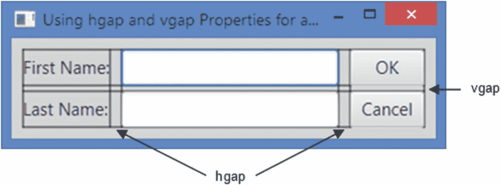

图 10-49

使用 hgap 和 vgap 属性的 gridpanel

```java
// GridPaneHgapVgap.java
// ... full listing in the book's download area.

Listing 10-31Using the hgap and vgap Properties of a GridPane

```

### 自定义列和行

您可以使用列和行约束自定义`GridPane`中的列和行。例如，对于列/行，您可以指定

*   如何计算宽度/高度。应该根据其内容、固定的宽度/高度还是可用宽度/高度的百分比来计算？

*   孩子应该填充列/行的宽度/高度吗？

*   当`GridPane`的大小调整到大于其首选的宽度/高度时，列/行应该增长吗？

*   列/行中的子元素应该如何在其布局区域(单元格)内对齐？

`ColumnConstraints`类的对象表示对列的约束，`RowConstraints`类的对象表示对行的约束。两个类都声明了几个表示约束的属性。表 [10-7](#Tab7) 和 [10-8](#Tab8) 列出了`ColumnConstraints`和`RowConstraints`类的属性和简要描述。

表 10-8

RowConstraints 类的属性

<colgroup><col class="tcol1 align-left"> <col class="tcol2 align-left"> <col class="tcol3 align-left"></colgroup> 
| 

**属性**

 | 

**类型**

 | 

**描述**

 |
| --- | --- | --- |
| `fillHeight` | `BooleanProperty` | 它指定行中的子级是否扩展到超出其首选高度，以填充行的高度。默认值为真。 |
| `valignment` | `ObjectProperty<HPos>` | 它指定行中子级的默认垂直对齐方式。其默认值为`null`。默认情况下，一行中的所有子元素都与`VPos.CENTER`垂直对齐。行中的单个子节点可能会覆盖此约束。 |
| `vgrow` | `ObjectProperty<Priority>` | 它指定行的垂直增长优先级。当`GridPane`的大小调整到大于其首选高度时，该属性用于为行提供额外的空间。如果设置了`percentHeight`属性，该属性的值将被忽略。 |
| `MinHeight,prefHeight,maxHeight` | `DoubleProperty` | 它们指定行的最小、首选和最大高度。如果设置了`percentHeight`属性，这些属性的值将被忽略。这些属性的默认值被设置为`USE_COMPUTED_SIZE`。默认情况下，行的最小高度是该行中子级的最大最小高度；首选高度是该行中儿童首选高度的最大值；并且最大高度是该行中孩子的最大高度中的最小高度。 |
| `percentHeight` | `DoubleProperty` | 它指定了行相对于`GridPane`内容区域高度的百分比。如果它被设置为一个大于零的值，那么该行的大小将被调整为其高度是`GridPane`的可用高度的百分比。如果设置了该属性，则`minHeight`、`prefHeight`、`maxHeight`和`vgrow`属性将被忽略。 |

表 10-7

ColumnConstraints 类的属性列表

<colgroup><col class="tcol1 align-left"> <col class="tcol2 align-left"> <col class="tcol3 align-left"></colgroup> 
| 

财产

 | 

类型

 | 

描述

 |
| --- | --- | --- |
| `fillWidth` | `BooleanProperty` | 它指定列中的子级是否扩展到超出其首选宽度，以填充列的宽度。默认值为 true。 |
| `halignment` | `ObjectProperty<HPos>` | 它指定列中子级的默认水平对齐方式。其默认值为`null`。默认情况下，一列中的所有子元素都与`HPos.LEFT`水平对齐。列中的单个子节点可能会覆盖此约束。 |
| `hgrow` | `ObjectProperty<Priority>` | 它指定列的水平增长优先级。当`GridPane`的大小调整到大于其首选宽度时，该属性用于为列提供额外的空间。如果设置了`percentWidth`属性，该属性的值将被忽略。 |
| `MinWidth,prefWidth,maxWidth` | `DoubleProperty` | 它们指定列的最小、首选和最大宽度。如果设置了`percentWidth`属性，这些属性的值将被忽略。这些属性的默认值被设置为`USE_COMPUTED_SIZE`。默认情况下，列的最小宽度是该列中子列的最大最小宽度；首选宽度是列中子级的最大首选宽度；并且最大宽度是该列中子的最大宽度中的最小宽度。 |
| `percentWidth` | `DoubleProperty` | 它指定列的宽度相对于`GridPane`内容区域宽度的百分比。如果它被设置为一个大于零的值，那么列的大小将被调整为等于`GridPane`的可用宽度的百分比。如果设置了该属性，则`minWidth`、`prefWidth`、`maxWidth`和`hgrow`属性将被忽略。 |

ColumnConstraints 和 RowConstraints 类提供了几个构造器来创建它们的对象。它们的无参数构造器用默认属性值创建它们的对象:

```java
// Create a ColumnConstraints object with default property values
ColumnConstraints cc1 = new ColumnConstraints();

// Set the percentWidth to 30% and horizontal alignment to center
cc1.setPercentWidth(30);
cc1.setHalignment(HPos.CENTER);

```

如果您想要创建一个固定宽度/高度的列/行，您可以使用一个方便的构造器:

```java
// Create a ColumnConstraints object with a fixed column width of 100px
ColumnConstraints cc2 = new ColumnConstraints(100);

// Create a RowConstraints object with a fixed row height of 80px
RowConstraints rc2 = new RowConstraints(80);

```

如果希望获得与固定宽度列相同的效果，可以通过将首选宽度设置为所需的固定宽度值，并将最小和最大宽度设置为使用首选宽度来实现，如下所示:

```java
// Create a ColumnConstraints object with a fixed column width of 100px
ColumnConstraints cc3 = new ColumnConstraints();
cc3.setPrefWidth(100);
cc3.setMinWidth(Region.USE_PREF_SIZE);
cc3.setMaxWidth(Region.USE_PREF_SIZE);

```

下面的代码片段将列宽设置为`GridPane`宽度的 30%,并将列中子级的水平对齐方式设置为居中:

```java
ColumnConstraints cc4 = new ColumnConstraints();
cc4.setPercentWidth(30);                // 30% width
cc4.setHalignment(HPos.CENTER);

```

在`GridPane`中，不同列/行的宽度/高度可以不同地计算。一些列/行可以设置百分比宽度/高度，一些固定大小，一些可以选择基于它们的内容来计算它们的大小。在分配空间时，百分比大小是第一优先选择。例如，如果两列根据百分比设置宽度，而一列使用固定宽度，则可用宽度将首先分配给使用百分比宽度的两列，然后分配给使用固定宽度的列。

Tip

所有列/行的百分比宽度/高度之和可能超过 100。例如，允许将`GridPane`中的列宽百分比设置为 30%、30%、30%和 30%。在这种情况下，百分比值用作权重，四列中的每一列都将被赋予四分之一(30/120)的可用宽度。又如，如果列使用 30%、30%、60%和 60%作为百分比宽度，它们将被视为权重，分别分配给可用宽度的六分之一(30/180)、六分之一(30/180)、三分之一(60/180)和三分之一(60/180)。

A `GridPane`将列和行的约束存储在`ColumnConstraints and RowConstraints`的`ObservableList`中。您可以使用`getColumnConstraints()`和`getRowConstraints()`方法获取列表的引用。列表中特定索引处的元素存储了`GridPane`中相同索引处的列/行的约束对象。例如，列表中的第一个元素存储第一列/行的列/行约束，第二个元素存储第二列/行的列/行约束，等等。可以为某些列/行设置列/行约束，但不能为其他列/行设置。在这种情况下，将根据默认值计算缺少列/行约束的列/行的约束。下面的代码片段创建三个`ColumnConstraints`对象，设置它们的属性，并将它们添加到`GridPane`的列约束列表中。使用`RowConstraints`对象设置行约束将使用类似的逻辑。

```java
// Set the fixed width to 100px
ColumnConstraints cc1 = new ColumnConstraints(100);

// Set the percent width to 30% and horizontal alignment to center
ColumnConstraints cc2 = new ColumnConstraints();
cc2.setPercentWidth(30);
cc1.setHalignment(HPos.CENTER);

// Set the percent width to 50%
ColumnConstraints cc3 = new ColumnConstraints();
cc3.setPercentWidth(30);

// Add all column constraints to the column constraints list
GridPane root = new GridPane();
root.getColumnConstraints().addAll(cc1, cc2, cc3);

```

清单 [10-32](#PC98) 中的程序使用列和行约束来定制`GridPane`中的列和行。图 [10-50](#Fig50) 显示了调整大小后的窗口。


图 10-50

使用列和行约束的 gridpanel

```java
// GridPaneColRowConstraints.java
// ... full listing in the book's download area.

Listing 10-32Using Column and Row Constraints in a GridPane

```

第一列的宽度设置为 100px 固定宽度。第二列和第三列各占宽度的 35%。如图所示，如果所需宽度(35% + 35% + 100px)小于可用宽度，则多余的宽度将不会被使用。第一列的水平对齐方式设置为居中，因此第一列中的所有按钮都水平居中对齐。其他两列中的按钮使用左作为水平对齐方式，这是默认设置。我们有三排。但是，程序只为前两行添加约束。第三行的约束将根据其内容进行计算。

设置列/行约束时，不能跳过中间的一些列/行。也就是说，必须从第一列/行开始按顺序设置列/行的约束。为约束的对象设置`null`会在运行时抛出一个`NullPointerException`。如果要跳过为列表中的行/列设置自定义约束，请将其设置为使用无参数构造器创建的 constraints 对象，该对象将使用默认设置。下面的代码片段设置了前三列的列约束。第二列使用约束的默认设置:

```java
// With 100px fixed width
ColumnConstraints cc1 = new ColumnConstraints(100);

// Use all default settings
ColumnConstraints defaultCc2 = new ColumnConstraints();

// With 200px fixed width

ColumnConstraints cc3 = new ColumnConstraints(200);

GridPane gpane = new GridPane();
gpane.getColumnConstraints().addAll(cc1, defaultCc2, cc3);

```

Tip

在列/行上设置的某些列/行约束可以被列/行中的子级单独覆盖。一些约束可以在列/行中的子级上设置，并且可能影响整个列/行。我们将在下一节讨论这些情况。

### 在 GridPane 中为子对象设置约束

表 [10-9](#Tab9) 列出了可以为`GridPane`中的子节点设置的约束。我们已经讨论了列/行索引和跨度约束。我们将在本节中讨论其余部分。`GridPane`类包含两组静态方法来设置这些约束:

表 10-9

可以为 GridPane 中的子级设置的约束列表

<colgroup><col class="tcol1 align-left"> <col class="tcol2 align-left"> <col class="tcol3 align-left"></colgroup> 
| 

限制

 | 

类型

 | 

描述

 |
| --- | --- | --- |
| `columnIndex` | `Integer` | 这是子节点布局区域开始的列索引。第一列的索引为 0。默认值为 0。 |
| `rowIndex` | `Integer` | 这是子节点布局区域开始的行索引。第一行的索引为 0。默认值为 0。 |
| `columnSpan` | `Integer` | 它是子节点布局区域跨越的列数。默认值为 1。 |
| `rowSpan` | `Integer` | 它是子节点的布局区域跨越的行数。默认值为 1。 |
| `halignment` | `HPos` | 它指定子节点在其布局区域内的水平对齐方式。 |
| `valignment` | `VPos` | 它指定子节点在其布局区域内的垂直对齐方式。 |
| `hgrow` | `Priority` | 它指定子节点的水平增长优先级。 |
| `vgrow` | `Priority` | 它指定子节点的垂直增长优先级。 |
| `margin` | `Insets` | 它指定子节点布局边界外部的边距空间。 |

*   `setConstraints()`方法

*   `setXxx(Node child, CType cvalue)`方法，其中`Xxx`是约束名，`CType`是它的类型

要删除子节点的约束，将其设置为`null`。

#### 对齐和对齐约束

`halignment`和`valignment`约束指定子节点在其布局区域内的对齐方式。他们默认为`HPos.LEFT`和`VPos.CENTER`。它们可以在影响所有子代的列/行上设置。儿童可以单独设置它们。适用于子节点的最终值取决于一些规则:

*   当没有为列/行和子节点设置它们时，子节点将使用默认值。

*   当它们是为列/行设置的而不是为子节点设置的时，子节点将使用为列/行设置的值。

*   当为列/行和子节点设置它们时，子节点将使用为其设置的值，而不是为列/行设置的值。本质上，子节点可以覆盖默认值或为这些约束的列/行设置的值。

清单 [10-33](#PC100) 中的程序演示了前面提到的规则。图 [10-51](#Fig51) 为窗口。该程序在一列中添加三个按钮。列约束覆盖子节点的`halignment`约束的默认值`HPos.LEFT`，并将其设置为`HPos.RIGHT`。标有“Two”的按钮将该设置覆盖为`HPos.CENTER`。因此，该列中的所有按钮都是水平向右对齐的，除了标记为“Two”的按钮是居中对齐的。我们为所有三行设置了约束。第一排和第二排将`valignment`设置为`VPos.TOP`。第三行保留默认值`VPos.CENTER`。标签为“One”的按钮覆盖第一行上设置的`valignment`约束，将其设置为`VPos.BOTTOM`。注意，所有的子节点都遵循前面的三个规则来使用`valignment`和`halignment`约束。

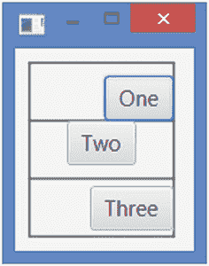

图 10-51

子级重写 GridPane 中的 halignment 和 valignment 约束

```java
// GridPaneHValignment.java
// ... full listing in the book's download area.

Listing 10-33Using the halignment and valignment Constraints for Children in a GridPane

```

#### hgrow 和 vgrow 约束

`hgrow`和`vgrow`约束指定整个列和行的水平和垂直增长优先级，即使它可以为子元素单独设置。这些约束也可以使用列和行的`ColumnConstraints`和`RowConstraints`对象来设置。默认情况下，列和行不会增长。使用以下规则计算列/行的这些约束的最终值:

*   如果没有为列/行设置约束，也没有为列/行中的任何子元素设置约束，那么如果`GridPane`的宽度/高度被调整为大于首选宽度/高度，列/行不会增长。

*   如果为列/行设置了约束，则使用在`hgrow`和`vgrow`的`ColumnConstraints`和`RowConstraints`对象中设置的值，而不管子对象是否设置了这些约束。

*   如果没有为列/行设置约束，则为列/行中的子级设置的这些约束的最大值将用于整个列/行。假设一个列有三个子列，并且没有为该列设置列约束。第一个子节点将`hgrow`设置为`Priority.NEVER`；第二对`Priority.ALWAYS`；而第三个到`Priority.SOMETIMES`。在这种情况下，三个优先级中的最大值是`Priority.ALWAYS`，它将用于整个列。`ALWAYS`优先级最高，`SOMETIMES`第二高，`NEVER`最低。

*   如果列/行设置为固定或百分比宽度/高度，则`hgrow/vgrow`约束将被忽略。

清单 [10-34](#PC101) 中的程序演示了前面的规则。图 [10-52](#Fig52) 显示了水平展开时的窗口。请注意，第二列会增长，但第一列不会。该程序添加了排列在两列中的六个按钮。第一列将`hgrow`约束设置为`Priority.NEVER`。该列设置的`hgrow`值优先；当`GridPane`水平展开时，第一列不增长。第二列不使用列约束。该列中的孩子使用三种不同类型的优先级:`ALWAYS`、`NEVER`和`SOMETIMES`。三个优先级中最大的是`ALWAYS`，使得第二列横向增长。


图 10-52

在 GridPane 中使用 hgrow 约束的列和子级

```java
// GridPaneHVgrow.java
// ... full listing in the book's download area.

Listing 10-34Using the hgrow Constraints for Columns and Rows in a GridPane

```

#### 利润限制

使用`GridPane`类的`setMargin(Node child, Insets value)`静态方法为孩子设置边距(布局边界周围的空间)。`getMargin(Node child)`静态方法返回子节点的边距:

```java
// Set 10px margin around the b1 child node
GridPane.setMargin(b1, new Insets(10));
...
// Get the margin of the b1 child node
Insets margin = GridPane.getMargin(b1);

```

使用`null`将余量重置为零的默认值。

#### 清除所有约束

使用`GridPane`类的`clearConstraints(Node child)`静态方法一次为一个子级重置所有约束(`columnIndex`、`rowIndex`、`columnSpan`、`rowSpan`、`halignment`、`valignment`、`hgrow`、`vgrow`、`margin`):

```java
// Clear all constraints for the b1 child node
GridPane.clearConstraints(b1);

```

## 了解锚定窗格

一个`AnchorPane`通过将它的子节点的四条边锚定到它自己的四条边上指定的距离来布局它的子节点。图 [10-53](#Fig53) 显示了一个`AnchorPane`内的子节点，其四边都指定了锚定距离。


图 10-53

锚定窗格中子节点的四个边约束

一个`AnchorPane`可用于两个目的:

*   用于沿`AnchorPane`的一个或多个边缘对齐子对象

*   用于在调整`AnchorPane`大小时拉伸孩子

子对象的边和`AnchorPane`的边之间的指定距离被称为指定边的*锚点*约束。例如，子对象的顶边与`AnchorPane`的顶边之间的距离称为`topAnchor` *约束*等。一个子节点最多可以指定四个锚约束:`topAnchor`、`rightAnchor`、`bottomAnchor`和`leftAnchor`。

当您将一个子节点锚定到两条相对的边(上/下或左/右)时，子节点的大小会随着`AnchorPane`的大小调整而调整，以保持指定的锚定距离。

Tip

锚点距离是从`AnchorPane`的内容区域的边缘和子项的边缘开始测量的。也就是说，如果`AnchorPane`有边框和填充，则距离是从插入的内边缘开始测量的(边框+填充)。

### 创建锚定窗格对象

您可以使用无参数构造器创建一个空的`AnchorPane`:

```java
AnchorPane apane1 = new AnchorPane();

```

您还可以在创建`AnchorPane`时指定它的初始子列表，如下所示:

```java
Button okBtn = new Button("OK");
Button cancelBtn = new Button("Cancel");
AnchorPane apane2 = new AnchorPane(okBtn, cancelBtn);

```

您可以在创建之后向`AnchorPane`添加子对象，如下所示:

```java
Button okBtn = new Button("OK");
Button cancelBtn = new Button("Cancel");
AnchorPane apane3 = new AnchorPane();
apane3.getChildren().addAll(okBtn, cancelBtn);

```

与`AnchorPane`一起工作时，你需要记住两点:

*   默认情况下，一个`AnchorPane`将它的子节点放在(0，0)处。您需要为子节点指定锚定约束，以将它们锚定到`AnchorPane`的一个或多个指定距离的边上。

*   `AnchorPane`的首选大小是基于子首选大小和它们的锚约束计算的。它为每个子节点添加首选宽度、左锚和右锚。该值最大的孩子决定了`AnchorPane`的首选宽度。它为每个子节点添加首选高度、左锚点和右锚点。具有该值最大值的孩子决定了`AnchorPane`的首选高度。有可能孩子会重叠。子对象是按照添加的顺序绘制的。

清单 [10-35](#PC107) 中的程序给一个`AnchorPane`增加了两个按钮。一个按钮有一个长标签，另一个有一个短标签。首先添加带有长标签的按钮，因此首先绘制它。第二个按钮被第二次绘制，覆盖在第一个按钮上，如图 [10-54](#Fig54) 所示。该图显示了窗口的两个视图:一个是程序运行时的视图，另一个是调整窗口大小时的视图。两个按钮都放置在(0，0)处。该程序没有利用`AnchorPane`的锚定功能。

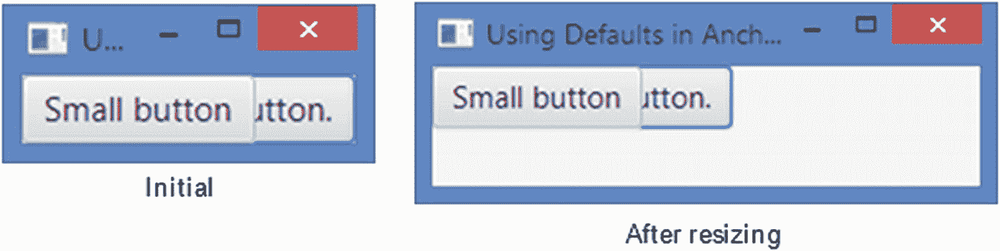

图 10-54

具有两个按钮但未指定锚定约束的锚定窗格

```java
// AnchorPaneDefaults.java
// ... full listing in the book's download area.

Listing 10-35Using Default Positions in an AnchorPane

```

### 为 AnchorPane 中的子对象设置约束

表 [10-10](#Tab10) 列出了可以为`AnchorPane`中的孩子设置的约束。请注意，锚点距离是从`AnchorPane`的内容区域的边缘开始测量的，而不是从布局边界的边缘开始测量的。回想一下，`Region`在内容区域的边缘和布局边界之间有填充和边框插入。

表 10-10

可以为 AnchorPane 中的子级设置的约束列表

<colgroup><col class="tcol1 align-left"> <col class="tcol2 align-left"> <col class="tcol3 align-left"></colgroup> 
| 

限制

 | 

类型

 | 

描述

 |
| --- | --- | --- |
| `topAnchor` | `Double` | 它指定了`AnchorPane`的内容区域的上边缘与子节点的上边缘之间的距离。 |
| `rightAnchor` | `Double` | 它指定了`AnchorPane`的内容区域的右边缘与子节点的右边缘之间的距离。 |
| `bottomAnchor` | `Double` | 它指定了`AnchorPane`的内容区域的下边缘与子节点的下边缘之间的距离。 |
| `leftAnchor` | `Double` | 它指定了`AnchorPane`的内容区域的左边缘与子节点的左边缘之间的距离。 |

AnchorPane 类包含四个静态方法，允许您设置四个定位约束的值。若要移除子节点的约束，请将其设置为 null。

```java
// Create a Button and anchor it to top and left edges at 10px from each
Button topLeft = new Button("Top Left");
AnchorPane.setTopAnchor(topLeft, 10.0);  // 10px from the top edge
AnchorPane.setLeftAnchor(topLeft, 10.0); // 10px from the left edge

AnchorPane root = new AnchorPane(topLeft);

```

使用`clearConstraints(Node child)`静态方法清除一个子节点的所有四个锚约束的值。

`setXxxAnchor(Node child, Double value)`方法将一个`Double`值作为它的第二个参数。因此，必须向这些方法传递一个双精度值或一个`Double`对象。当您传递一个 double 值时，Java 的自动装箱特性会将该值装箱到一个`Double`对象中。一个常见的错误是传递一个 int 值:

```java
Button b1 = new Button("A button");
AnchorPane.setTopAnchor(b1, 10); // An error: 10 is an int, not a double

```

前面的代码会生成一个错误:

```java
Error(18): error: method setTopAnchor in class AnchorPane cannot be applied to given types;

```

产生这个错误是因为我们将 10 作为第二个参数进行了传递。值 10 是一个`int`文字，它被装箱成一个`Integer`对象，而不是一个`Double`对象。将 10 更改为 10D 或 10.0 将使其成为`double`值，并将修复错误。

清单 [10-36](#PC111) 中的程序给一个`AnchorPane. The first button`添加了两个`Button`，并设置了它的顶部和左侧锚点。第二个按钮设置了底部和右侧锚点。图 [10-55](#Fig55) 显示了窗口的两种状态:一种是程序运行时，另一种是调整窗口大小时。窗口的初始大小不够宽，无法显示两个按钮，因此按钮重叠。JavaFX 运行时根据右下角按钮的首选大小(具有最大的首选宽度)及其右锚点值来计算窗口内容区域的宽度。该图还显示了调整大小后的窗口。你需要为一个`AnchorPane`设置一个合理的首选大小，这样所有的孩子都是可见的，没有重叠。

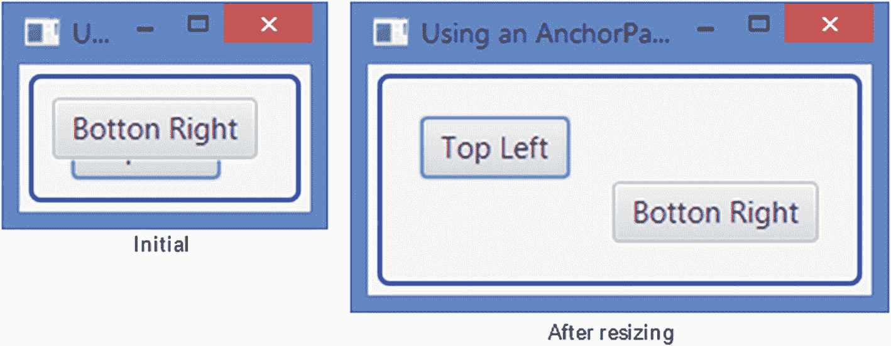

图 10-55

锚定窗格中的两个按钮在左上角和右下角对齐

```java
// AnchorPaneTest.java
// ... full listing in the book's download area.

Listing 10-36Using an AnchorPane to Align Children to Its Corners

```

当`AnchorPane`中的子节点被锚定到相对的边时，例如，顶部/底部或左侧/右侧，`AnchorPane`拉伸子节点以保持指定的锚。

清单 [10-37](#PC112) 中的程序给一个`AnchorPane`添加了一个按钮，并使用距离每条边 10px 的锚将它锚定到左边和右边(相对的边)。这将使按钮在`AnchorPane`被调整到比其首选宽度更大的宽度时被拉伸。该按钮也锚定到顶部边缘。图 [10-56](#Fig56) 显示了初始窗口和调整后的窗口。

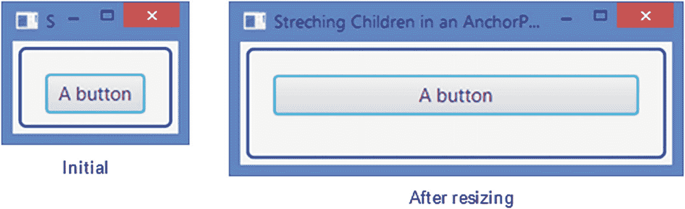

图 10-56

有一个按钮锚定在相对两侧的锚定窗格

```java
// AnchorPaneStretching.java
// ... full listing in the book's download area.

Listing 10-37Anchoring Children to Opposite Sides in an AnchorPane

```

## 了解 TextFlow

一个`TextFlow`布局窗格被设计用来显示富文本。富文本由多个`Text`节点组成。`TextFlow`将所有`Text`节点中的文本组合在一个文本流中显示。在`Text`子节点的文本中的换行符(`'\n'`)表示一个新段落的开始。文本以`TextFlow`的宽度换行。

一个`Text`节点有它的位置、大小和环绕宽度。然而，当它被添加到一个`TextFlow`窗格时，这些属性被忽略。`Text`节点被一个接一个地放置，必要时将它们包裹起来。一个`TextFlow`中的文本可以跨越多行，而在一个`Text`节点中，它只显示在一行中。图 [10-57](#Fig57) 显示了一个以`TextFlow`为根节点的窗口。

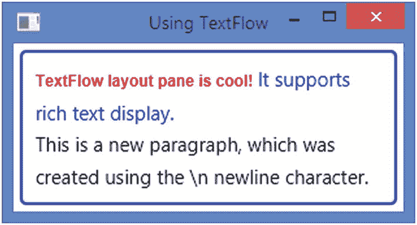

图 10-57

显示富文本的 TextFlow

`TextFlow`是专门为使用多个文本节点显示富文本而设计的。然而，您并不仅限于向一个`TextFlow`添加文本节点。你可以添加任何其他节点，例如，按钮，`TextField`等。文本节点以外的节点使用其首选大小显示。

Tip

你可以认为`TextFlow`和`FlowPane`非常相似。像`FlowPane`一样，`TextFlow`通过不同地对待文本节点，在从一端到另一端的流中布置其子节点。当文本节点超出其宽度边界时，它会按文本节点的宽度断开文本节点的文本，并在下一行显示剩余的文本。

### 创建 TextFlow 对象

与其他布局窗格的类不同，`TextFlow`类在`javafx.scene.text`包中，所有其他与文本相关的类都在这里。

您可以使用无参数构造器创建一个空的`TextFlow`:

```java
TextFlow tflow1 = new TextFlow ();

```

您也可以在创建`TextFlow`时指定它的初始子列表:

```java
Text tx1 = new Text("TextFlow layout pane is cool! ");
Text tx2 = new Text("It supports rich text display.");
TextFlow tflow2 = new TextFlow(tx1, tx2);

```

您可以在创建之后向`TextFlow`添加子项:

```java
Text tx1 = new Text("TextFlow layout pane is cool! ");
Text tx2 = new Text("It supports rich text display.");
TextFlow tflow3 = new TextFlow();
tflow3.getChildren().addAll(tx1, tx2);

```

清单 [10-38](#PC116) 中的程序展示了如何使用`TextFlow`。它给一个`TextFlow`增加了三个`Text`节点。第三个文本节点中的文本以换行符(\n)开始，这将开始一个新段落。程序将`TextFlow`的首选宽度设置为 300 像素，行距设置为 5 像素。图 [10-58](#Fig58) 为窗口。当您调整窗口大小时，`TextFlow`会根据需要以新的宽度重新绘制文本换行。

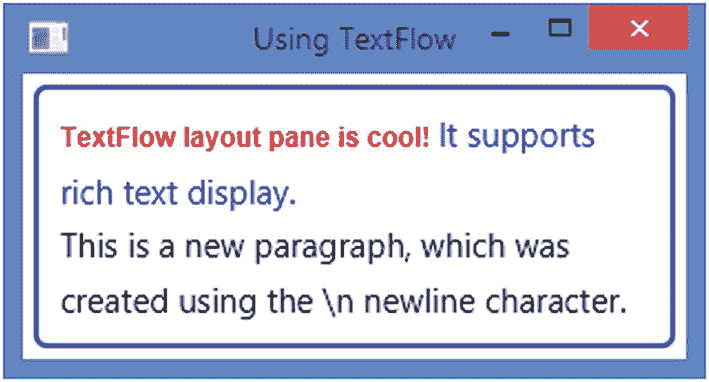

图 10-58

在 TextFlow 中显示为富文本的几个文本节点

```java
// TextFlowTest.java
// ... full listing in the book's download area.

Listing 10-38Using the TextFlow Layout Pane to Display Rich Text

```

一个`TextFlow`也可以让你嵌入除了`Text`节点之外的节点。您可以创建一个表单来显示与用户可以使用的其他类型节点混合在一起的文本。清单 [10-39](#PC117) 中的程序将一对`RadioButton`、一个`TextField`和一个`Button`嵌入到一个`TextFlow`中，以创建一个带有文本的在线表单。用户可以使用这些节点与表单进行交互。

图 [10-59](#Fig59) 显示了窗口。在测试这个例子的时候，`RadioButton` s 和`TextField`节点没有使用鼠标获得焦点。使用`Tab`键导航到这些节点，使用`spacebar`键选择一个`RadioButton`。


图 10-59

文本流中嵌入的文本节点以外的节点

```java
// TextFlowEmbeddingNodes.java
// ... full listing in the book's download area.

Listing 10-39Embedding Nodes Other Than Text Nodes in a TextFlow

```

### TextFlow 属性

`TextFlow`类包含两个属性，如表 [10-11](#Tab11) 所列，用于定制其布局。

表 10-11

TextFlow 类中声明的属性列表

<colgroup><col class="tcol1 align-left"> <col class="tcol2 align-left"> <col class="tcol3 align-left"></colgroup> 
| 

财产

 | 

类型

 | 

描述

 |
| --- | --- | --- |
| `lineSpacing` | `DoubleProperty` | 它指定行与行之间的垂直间距。其默认值为 0px。 |
| `tabSize` | `IntegerProperty` | 制表符在空格中的大小。 |
| `textAlignment` | `ObjectProperty<TextAlignment>` | 它指定了`TextFlow`内容的对齐方式。它的值是`TextAlignment`枚举的常量之一:`LEFT`、`RIGHT`、`CENTER`和`JUSTIFY`。其默认值为`LEFT`。 |

lineSpacing 属性指定了`TextFlow`中各行之间的垂直间距(以像素为单位)。我们已经在前面的例子中使用过了。

```java
TextFlow tflow = new TextFlow();
tflow.setLineSpacing(5); // 5px lineSpacing

```

`textAlignment`属性指定了`TextFlow`的全部内容的对齐方式。默认情况下，内容靠左对齐。图 [10-60](#Fig60) 显示了在程序中创建`TextFlow`对象后添加以下语句时清单 [10-39](#PC117) 中程序的窗口:


图 10-60

使用 CENTER 作为 textAlignment 的 TextFlow

```java
// Set the textAlignment to CENTER
root.setTextAlignment(TextAlignment.CENTER);

```

### 在 TextFlow 中为子对象设置约束

`TextFlow`不允许你给它的子节点添加任何约束，甚至没有一个边距。

## 对齐像素

图 [10-61](#Fig61) 显示了一个五像素宽五像素高的设备屏幕。图中的圆圈代表一个像素。坐标(0，0)被映射到左上角像素的左上角。左上角像素的中心映射到坐标(0.5，0.5)。所有整数坐标都落在像素之间的角落和裂缝中。在该图中，实线穿过像素的裂缝，虚线穿过像素的中心。

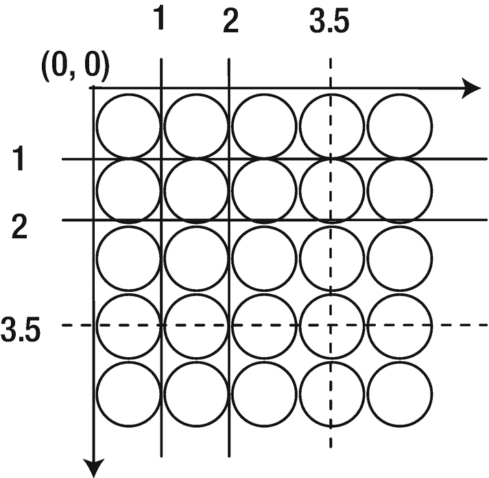

图 10-61

屏幕上的 5X5 像素区域

在 JavaFX 中，可以用浮点数指定坐标，例如 0.5、6.0 等。，这使您可以表示像素的任何部分。如果浮点数是整数(例如 2.0、3.0 等)。)，它将代表像素的角点。

使用浮点数作为坐标的 A `Region`不会精确对齐像素边界，其边界可能看起来模糊。`Region`类包含一个`snapToPixel`属性来解决这个问题。默认情况下，它被设置为 true，并且一个`Region`将它的子节点的位置、间距和大小值调整为一个整数，以匹配像素边界，从而为子节点产生清晰的边界。如果您不希望`Region`将这些值调整为整数，请将`snapToPixel`属性设置为 false。

## 摘要

一个*布局窗格*是一个包含其他节点的节点，这些节点被称为其子节点(或子节点)。布局窗格的职责是在需要时对其子窗格进行布局。布局窗格也称为*容器*或*布局容器*。布局窗格有一个*布局策略*，它控制布局窗格如何布局其子元素。例如，布局窗格可以水平、垂直或以任何其他方式布置其子元素。JavaFX 包含几个与布局相关的类。布局窗格计算其子窗格的位置和大小。布局窗格的布局策略是一组计算其子窗格的位置和大小的规则。

以下类别的对象代表布局窗格:`HBox`、`VBox`、`FlowPane`、`BorderPane`、`StackPane`、`TilePane`、`GridPane`、`AnchorPane`和`TextFlow`。所有布局窗格类都继承自`Pane`类。

一个`Group`具有容器的特征；比如它有自己的布局策略和坐标系，是`Parent`类的子类。然而，将其称为节点的*集合或*组*，而不是*容器*，可以最好地反映其含义。它用于将节点集合作为单个节点(或一个组)进行操作。应用于`Group`的变换、效果和属性会应用于`Group`中的所有节点。一个`Group`有它自己的布局策略，除了给他们自己喜欢的尺寸，它不提供任何特定的布局给它的孩子。*

一个`HBox`在一个水平行中布置它的子元素。它允许您设置相邻子元素之间的水平间距、任何子元素的边距、调整子元素的行为等。它使用 0px 作为相邻子项之间的默认间距。内容区域和 HBox 的默认宽度足以以其首选宽度显示其所有子级，默认高度是其所有子级的最大高度。

一个`VBox`在一个单独的垂直列中布置它的子元素。它允许您设置相邻子元素之间的垂直间距、任何子元素的边距、调整子元素的行为等。它使用 0px 作为相邻子项之间的默认间距。一个`VBox`的内容区域的默认高度足够以他们喜欢的高度显示它的所有子元素，并且默认宽度是它所有子元素的最大宽度。

一个`FlowPane`是一个简单的布局窗格，它以指定的宽度或高度将它的子元素排列成行或列。它让其子元素水平或垂直流动，因此得名“流动窗格”您可以指定首选的换行长度，这是水平流的首选宽度和垂直流的首选高度，内容在垂直流中换行。一个`FlowPane`用在孩子的相对位置不重要的场合，比如显示一系列图片或者按钮。

A `BorderPane`将其布局区域分为五个区域:顶部、右侧、底部、左侧和中心。您最多可以在五个区域中的每个区域放置一个节点。顶部和底部区域中的子区域将被调整到其首选高度。它们的宽度被扩展以填充可用的额外水平空间，只要子元素的最大宽度允许扩展它们的宽度超过它们的首选宽度。右区域和左区域中的子区域被调整到它们的首选宽度。他们的高度被延长以填充额外的垂直空间，只要儿童的最大高度允许他们的高度超过他们的首选高度。中间的子节点将在两个方向上填充剩余的可用空间。

一个`StackPane`在一个节点堆栈中布局它的子节点。它提供了覆盖节点的强大手段。子对象是按照添加的顺序绘制的。

一个`TilePane`把它的子节点放在一个统一大小的网格中，这个网格被称为瓦片。`TilePane`的工作方式类似于`FlowPane`的工作方式，但有一点不同:在`FlowPane`中，行和列可以有不同的高度和宽度，而在`TilePane`中，所有的行都有相同的高度，所有的列都有相同的宽度。最宽子节点的宽度和最高子节点的高度是`TilePane`中所有图块的默认宽度和高度。可以设置为水平或垂直的`TilePane`的方向决定了其内容的流向。默认情况下，`TilePane`具有水平方向。

一个`GridPane`在一个动态的单元格网格中布置它的子元素，单元格按行和列排列。网格是动态的，因为网格中单元的数量和大小是根据子单元的数量确定的。它们取决于对孩子的约束。网格中的每个单元格都由其在列和行中的位置来标识。列和行的索引从零开始。子节点可以放置在跨越多个单元的网格中的任何位置。一行中的所有单元格高度相同。不同行中的单元可以具有不同的高度。一列中的所有单元格宽度相同。不同列中的单元格可能具有不同的宽度。默认情况下，一行的高度足以容纳其中最高的子节点。一个列的宽度足以容纳其中最宽的子节点。您可以自定义每行和每列的大小。`GridPane`还允许行与行之间的垂直间距和列与列之间的水平间距。出于调试目的，您可以显示网格线。图 [10-41](#Fig41) 显示了`GridPane`的三个实例。

一个`AnchorPane`通过将它的子节点的四条边锚定到它自己的四条边上指定的距离来布局它的子节点。一个`AnchorPane`可以用于沿着`AnchorPane`的一个或多个边缘对齐子节点，或者在`AnchorPane`调整大小时拉伸子节点。

子节点的边和`AnchorPane`的边之间的指定距离被称为指定边的*锚*约束。当您将一个子节点锚定到两个相对的边(上/下或左/右)时，子节点的大小会随着`AnchorPane`的大小调整而调整，以保持指定的锚定距离。

一个`TextFlow`布局窗格被设计用来显示富文本。富文本由多个`Text`节点组成。`TextFlow`将所有`Text`节点中的文本组合在一个文本流中显示。在`Text`子节点的文本中的换行符(`'\n'`)表示一个新段落的开始。文本以`TextFlow`的宽度换行。