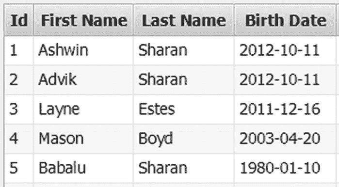
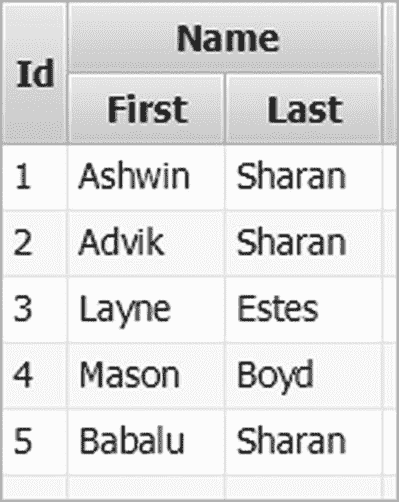
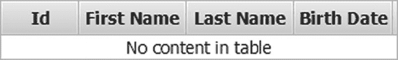
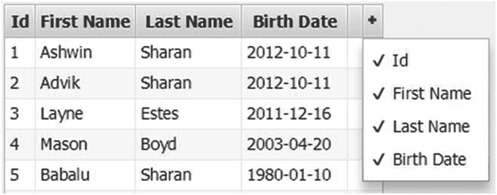
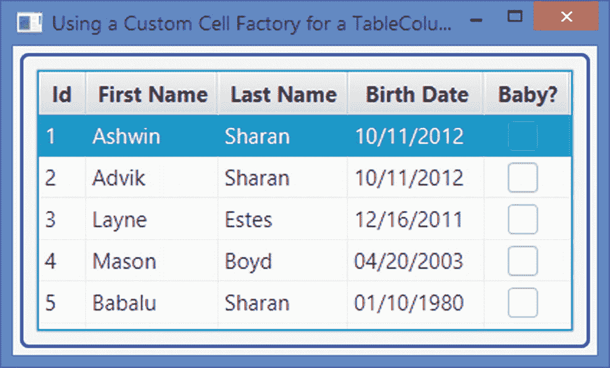
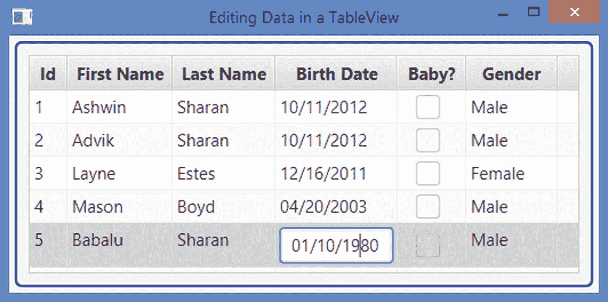

# 13.了解*表格视图*

在本章中，您将学习:

*   什么是`TableView`

*   如何创建一个`TableView`

*   关于将列添加到`TableView`

*   关于用数据填充`TableView`

*   关于在`TableView`中显示、隐藏和重新排序列

*   关于排序和编辑`TableView`中的数据

*   关于在`TableView`中添加和删除行

*   关于在`TableView`中调整列的大小

*   关于用 CSS 样式化一个`TableView`

本章的例子在`com.jdojo.control`包中。为了让它们工作，您必须在`module-info.java`文件中添加相应的一行:

```java
...
opens com.jdojo.control to javafx.graphics, javafx.base;
...

```

本章中一些较长的列表是以缩略方式显示的。要获得完整的列表，请查阅该书的下载区。

## 什么是*表格视图*？

`TableView`是一个强大的控件，以表格形式显示和编辑数据模型中的数据。一个`TableView`由行和列组成。单元格是行和列的交集。单元格包含数据值。列的标题描述了它们包含的数据类型。列可以嵌套。调整列数据的大小和排序具有内置支持。图 [13-1](#Fig1) 显示了一个有四列的`TableView`，这四列有标题文本 Id、名字、姓氏和出生日期。它有五行，每行包含一个人的数据。例如，第四行第三列中的单元格包含姓氏 Boyd。



图 13-1

显示人员名单的

是一个强大但不简单的控件。您需要编写几行代码来使用最简单的向用户显示一些有意义的数据的`TableView`。与`TableView`一起工作的有几个类。当我讨论`TableView`的不同特性时，我将详细讨论这些类:

*   `TableView`

*   `TableColumn`

*   `TableRow`

*   `TableCell`

*   `TablePosition`

*   `TableView.TableViewFocusModel`

*   `TableView.TableViewSelectionModel`

`TableView`类代表一个`TableView`控件。`TableColumn`类表示`TableView`中的一列。通常，一个`TableView`包含多个`TableColumn`实例。一个`TableColumn`由单元格组成，这些单元格是`TableCell`类的实例。一个`TableColumn`使用两个属性来填充单元格并在其中呈现值。它使用单元格值工厂从项目列表中提取其单元格的值。它使用单元格工厂来呈现单元格中的数据。您必须为一个`TableColumn`指定一个单元格值工厂来查看其中的一些数据。一个`TableColumn`使用默认的单元格工厂，它知道如何呈现文本和图形节点。

`TableRow`类继承自`IndexedCell`类。一个`TableRow`的实例代表一个`TableView`中的一行。除非您想为行提供一个定制的实现，否则您几乎不会在应用程序中使用这个类。通常，您自定义单元格，而不是行。

`TableCell`类的一个实例代表了`TableView`中的一个单元格。单元格是高度可定制的。它们显示 TableView 的基础数据模型中的数据。它们能够显示数据和图形。

`TableColumn`、`TableRow`和`TableCell`类包含一个`tableView`属性，该属性保存对包含它们的`TableView`的引用。当`TableColumn`不属于某个`TableView`时，`tableView`属性包含`null`。

一个`TablePosition`代表一个单元格的位置。它的`getRow()`和`getColumn()`方法分别返回单元格所属的行和列的索引。

`TableViewFocusModel`类是`TableView`类的内部静态类。它代表了`TableView`管理行和单元格焦点的焦点模型。

`TableViewSelectionModel`类是`TableView`类的内部静态类。它代表了`TableView`管理行和单元格选择的选择模型。

像`ListView`和`TreeView`控件一样，`TableView`是虚拟化的。它创建了刚好足够显示可视内容的单元格。当您滚动浏览内容时，单元格会被回收。这有助于将场景图形中的节点数量保持在最小。假设在一个`TableView`中有 10 列 1000 行，一次只能看到 10 行。低效的方法是创建 10，000 个单元，每个单元代表一条数据。`TableView`只创建了 100 个单元格，所以它可以显示十行十列。当您滚动内容时，同样的 100 个单元格将被循环显示其他可见的行。虚拟化使得将`TableView`与大型数据模型结合使用成为可能，并且在查看数据块时不会影响性能。

对于本章中的例子，我将使用 MVC 第 [11](11.html) 章中的`Person`类。`Person`级在`com.jdojo.mvc.model`包里。在我开始详细讨论`TableView`控件之前，我将介绍一个`PersonTableUtil`类，如清单 [13-1](#PC2) 所示。我将在给出的例子中多次重用它。它有静态方法来返回一个可见的 persona 列表和一个`TableColumn`类的实例来表示一个`TableView`中的列。

```java
// PersonTableUtil.java
package com.jdojo.control;

import com.jdojo.mvc.model.Person;
import java.time.LocalDate;
import javafx.collections.FXCollections;
import javafx.collections.ObservableList;
import javafx.scene.control.TableColumn;
import javafx.scene.control.cell.PropertyValueFactory;

public class PersonTableUtil {
    /* Returns an observable list of persons */
    public static ObservableList<Person> getPersonList() {
      Person p1 =
            new Person("Ashwin", "Sharan", LocalDate.of(2012, 10, 11));
      Person p2 =
            new Person("Advik", "Sharan", LocalDate.of(2012, 10, 11));
      Person p3 =
            new Person("Layne", "Estes", LocalDate.of(2011, 12, 16));
      Person p4 =
            new Person("Mason", "Boyd", LocalDate.of(2003, 4, 20));
      Person p5 =
            new Person("Babalu", "Sharan", LocalDate.of(1980, 1, 10));
      return FXCollections.<Person>observableArrayList(p1, p2, p3, p4, p5);
    }

    /* Returns Person Id TableColumn */
    public static TableColumn<Person, Integer> getIdColumn() {
        TableColumn<Person, Integer> personIdCol = new TableColumn<>("Id");
        personIdCol.setCellValueFactory(
               new PropertyValueFactory<>("personId"));
        return personIdCol;
    }

    /* Returns First Name TableColumn */
    public static TableColumn<Person, String> getFirstNameColumn() {
      TableColumn<Person, String> fNameCol =
            new TableColumn<>("First Name");
      fNameCol.setCellValueFactory(new PropertyValueFactory<>("firstName"));
      return fNameCol;
    }

    /* Returns Last Name TableColumn */
    public static TableColumn<Person, String> getLastNameColumn() {
        TableColumn<Person, String> lastNameCol =
               new TableColumn<>("Last Name");
        lastNameCol.setCellValueFactory(
               new PropertyValueFactory<>("lastName"));
        return lastNameCol;
    }

    /* Returns Birth Date TableColumn */
    public static TableColumn<Person, LocalDate> getBirthDateColumn() {
        TableColumn<Person, LocalDate> bDateCol =
            new TableColumn<>("Birth Date");
        bDateCol.setCellValueFactory(
               new PropertyValueFactory<>("birthDate"));
        return bDateCol;
    }
}

Listing 13-1A PersonTableUtil Utility Class

```

后续部分将带您完成在`TableView`中显示和编辑数据的步骤。

## 创建一个*表格视图*

在下面的例子中，您将使用`TableView`类来创建一个`TableView`控件。`TableView`是一个参数化的类，它接受`TableView`包含的项目类型。或者，您可以将模型传递给提供数据的构造函数。构造函数创建了一个没有模型的`TableView`。下面的语句创建了一个`TableView`，它将使用`Person`类的对象作为它的项目:

```java
TableView<Person> table = new TableView<>();

```

当你将前面的`TableView`添加到场景中时，它会显示一个占位符，如图 [13-2](#Fig2) 所示。占位符让您知道您需要向`TableView`添加列。在`TableView`数据中必须至少有一个可见的叶列。


图 13-2

没有显示占位符的列和数据的`TableView`

您可以使用另一个`TableView`类的构造函数来指定模型。它接受一个可观察的项目列表。以下语句传递一个可观察的`Person`对象列表作为`TableView`的初始数据:

```java
TableView<Person> table = new TableView<>(PersonTableUtil.getPersonList());

```

### 将列添加到*表格视图*

`TableColumn`类的一个实例代表了`TableView`中的一列。一个`TableColumn`负责显示和编辑其单元格中的数据。一个`TableColumn`有一个可以显示标题文本和/或图形的标题。您可以为一个`TableColumn`创建一个上下文菜单，当用户在列标题中单击鼠标右键时，就会显示这个菜单。使用`contextMenu`属性设置一个上下文菜单。

`TableColumn<S, T>`类是一个泛型类。`S`参数为项目类型，与`TableView`的参数类型相同。`T`参数是该列所有单元格中的数据类型。例如，`TableColumn<Person, Integer>`的一个实例可以用来表示一个显示一个人的 ID 的列，它是`int`类型；一个`TableColumn<Person, String>`的实例可以用来表示一个显示一个人的*名字*的列，它是`String`类型的。以下代码片段创建了一个`TableColumn with`名字作为其标题文本:

```java
TableColumn<Person, String> fNameCol = new TableColumn<>("First Name");

```

`TableColumn`需要知道如何从模型中获取其单元格的值(或数据)。要填充单元格，您需要设置`TableColumn`的`cellValueFactory`属性。如果`TableView`的模型包含基于 JavaFX 属性的类的对象，您可以使用`PropertyValueFactory`类的对象作为单元格值工厂，该工厂接受属性名。它从模型中读取属性值，并填充列中的所有单元格，如下面的代码所示:

```java
// Use the firstName property of Person object to populate the column cells
PropertyValueFactory<Person, String> fNameCellValueFactory =
        new PropertyValueFactory<>("firstName");
fNameCol.setCellValueFactory(fNameCellValueFactory);

```

您需要为`TableView`中的每一列创建一个`TableColumn`对象，并设置其单元格值工厂属性。下一节将解释如果您的 item 类不基于 JavaFX 属性，或者您希望用计算值填充单元格，该怎么办。

设置`TableView`的最后一步是将`TableColumns`添加到它的列列表中。一个`TableView`将它的列的引用存储在一个`ObservableList<TableColumn>`中，T3 的引用可以使用`TableView`的`getColumns()`方法获得:

```java
// Add the First Name column to the TableView
table.getColumns().add(fNameCol);

```

这就是使用最简单形式的`TableView`所要做的一切，毕竟它并不那么“简单”!清单 [13-2](#PC8) 中的程序展示了如何创建一个带有模型的`TableView`并向其中添加列。它使用`PersonTableUtil`类来获取人员和列的列表。程序显示如图 [13-3](#Fig3) 所示的窗口。


图 13-3

带有一个显示四列五行的`TableView`的窗口

```java
// SimplestTableView.java
package com.jdojo.control;

import com.jdojo.mvc.model.Person;
import javafx.application.Application;
import javafx.scene.Scene;
import javafx.scene.control.TableView;
import javafx.scene.layout.VBox;
import javafx.stage.Stage;

public class SimplestTableView extends Application {
        public static void main(String[] args) {
                Application.launch(args);
        }

        @Override
        public void start(Stage stage) {
                // Create a TableView with a list of persons
                TableView<Person> table =
                         new TableView<>(PersonTableUtil.getPersonList());

                // Add columns to the TableView
                table.getColumns().addAll(
                         PersonTableUtil.getIdColumn(),
                         PersonTableUtil.getFirstNameColumn(),
                         PersonTableUtil.getLastNameColumn(),
                         PersonTableUtil.getBirthDateColumn());

                VBox root = new VBox(table);
                root.setStyle("""
                         -fx-padding: 10;
                   -fx-border-style: solid inside;
                   -fx-border-width: 2;
                   -fx-border-insets: 5;
                   -fx-border-radius: 5;
                   -fx-border-color: blue;""");

                Scene scene = new Scene(root);
                stage.setScene(scene);
                stage.setTitle("Simplest TableView");
                stage.show();
        }
}

Listing 13-2Using TableView in Its Simplest Form

```

`TableView`支持列嵌套。例如，您可以在名称列中嵌套两列，第一列和最后一列。一个`TableColumn`将嵌套列的列表存储在一个可观察列表中，该列表的引用可以使用`TableColumn`类的`getColumns()`方法获得。最里面的嵌套列被称为*叶列*。您需要为叶列添加单元格值工厂。嵌套列仅提供视觉效果。下面的代码片段创建了一个`TableView`，并添加了一个 Id 列和两个叶列，第一个和最后一个，它们嵌套在 Name 列中。结果`TableView`如图 [13-4](#Fig4) 所示。注意，您将最顶端的列添加到了`TableView`，而不是嵌套的列。`TableView`负责为最顶端的列添加所有嵌套的列。对列嵌套的级别没有限制。



图 13-4

具有嵌套列的`TableView`

```java
// Create a TableView with data
TableView<Person> table = new TableView<>(PersonTableUtil.getPersonList());

// Create leaf columns - Id, First and Last
TableColumn<Person, String> idCol = new TableColumn<>("Id");
idCol.setCellValueFactory(new PropertyValueFactory<>("personId"));

TableColumn<Person, String> fNameCol = new TableColumn<>("First");
fNameCol.setCellValueFactory(new PropertyValueFactory<>("firstName"));

TableColumn<Person, String> lNameCol = new TableColumn<>("Last");
lNameCol.setCellValueFactory(new PropertyValueFactory<>("lastName"));

// Create Name column and nest First and Last columns in it
TableColumn<Person, String> nameCol = new TableColumn<>("Name");
nameCol.getColumns().addAll(fNameCol, lNameCol);

// Add columns to the TableView
table.getColumns().addAll(idCol, nameCol);

```

`TableView`类中的以下方法提供了关于可见叶列的信息:

```java
TableColumn<S,?> getVisibleLeafColumn(int columnIndex)
ObservableList<TableColumn<S,?>> getVisibleLeafColumns()
int getVisibleLeafIndex(TableColumn<S,?> column)

```

`getVisibleLeafColumn()`方法返回指定列索引的列引用。只对可见的叶列计算列索引，索引从零开始。`getVisibleLeafColumns()`方法返回所有可见叶列的可见列表。`getVisibleLeafIndex()`方法返回可见叶列的指定列索引的列引用。

### 定制*表格视图*占位符

`TableView`当占位符没有任何可见的叶列或内容时，显示占位符。考虑下面的代码片段，它创建了一个`TableView`并向其中添加了列:

```java
TableView<Person> table = new TableView<>();
table.getColumns().addAll(PersonTableUtil.getIdColumn(),
                   PersonTableUtil.getFirstNameColumn(),
                   PersonTableUtil.getLastNameColumn(),
                   PersonTableUtil.getBirthDateColumn());

```

图 [13-5](#Fig5) 显示了前面`TableView`的结果。显示列和占位符，表示`TableView`没有数据。



图 13-5

有列但没有数据的`TableView`控件

您可以使用`TableView`的`placeholder`属性替换内置占位符。属性的值是`Node`类的一个实例。以下语句设置了一个带有作为占位符的`generic`消息的`Label`:

```java
table.setPlaceholder(new Label("No visible columns and/or data exist."));

```

您可以设置一个自定义占位符来通知用户导致`TableView`中不显示数据的具体情况。以下语句使用绑定来随着条件的变化而改变占位符:

```java
table.placeholderProperty().bind(
    new When(new SimpleIntegerProperty(0)
                 .isEqualTo(table.getVisibleLeafColumns().size()))
            .then(new When(new SimpleIntegerProperty(0)
                              .isEqualTo(table.getItems().size()))
                      .then(new Label("No columns and data exist."))
                      .otherwise(new Label("No columns exist.")))
            .otherwise(new When(new SimpleIntegerProperty(0)
                           .isEqualTo(table.getItems().size()))
                           .then(new Label("No data exist."))
                           .otherwise((Label)null)));

```

### 用数据填充*表格列*

`TableView`行中的单元格包含与一个项目相关的数据，比如一个人、一本书等等。一行中某些单元格的数据可能直接来自该项目的属性，也可能是计算出来的。

`TableView`有一个`ObservableList<S>`类型的`items`属性。通用类型`S`与`TableView`的通用类型相同。它是`TableView`的数据模型。项目列表中的每个元素代表`TableView`中的一行。向条目列表添加新条目会向`TableView`添加新行。从项目列表中删除项目会从`TableView`中删除相应的行。

Tip

更新项目列表中的项目是否会更新`TableView`中的相应数据取决于该列的单元格值工厂是如何设置的。我将在本节讨论这两种类型的例子。

下面的代码片段创建了一个`TableView`，其中一行代表一个`Person`对象。它添加两行数据:

```java
TableView<Person> table = new TableView<>();

Person p1 = new Person("John", "Jacobs", null);
Person p2 = new Person("Donna", "Duncan", null);
table.getItems().addAll(p1, p2);

```

向`TableView`添加项目是没有用的，除非你向它添加列。除了其他一些东西，一个`TableColumn`对象定义了

*   列的标题文本和图形

*   用于填充列中单元格的单元格值工厂

`TableColumn`类让你完全控制如何填充一列中的单元格。`TableColumn`类的`cellValueFactory`属性负责填充列的单元格。单元格值工厂是`Callback`类的对象，它接收一个`TableColumn.CellDataFeatures`对象并返回一个`ObservableValue`。

`CellDataFeatures`类是`TableColumn`类的静态内部类，它包装了`TableView`、`TableColumn`的引用，以及正在填充列单元格的行的项目。使用`CellDataFeatures`类的`getTableView()`、`getTableColumn()`和`getValue()`方法分别获取`TableView`、`TableColumn`的引用和该行的项目。

当`TableView`需要单元格的值时，它调用单元格所属列的单元格值工厂对象的`call()`方法。`call()`方法应该返回一个`ObservableValue`对象的引用，该对象被监控是否有任何变化。返回的`ObservableValue`对象可以包含任何类型的对象。如果它包含一个节点，则该节点在单元格中显示为图形。否则调用对象的`toString()`方法，返回的字符串显示在单元格中。

以下代码片段使用匿名类创建了一个单元格值工厂。工厂返回对`Person`类的`firstName`属性的引用。注意，JavaFX 属性是一个`ObservableValue`。

```java
import static javafx.scene.control.TableColumn.CellDataFeatures;
...
// Create a String column with the header "First Name" for Person object
TableColumn<Person, String> fNameCol = new TableColumn<>("First Name");

// Create a cell value factory object
Callback<CellDataFeatures<Person, String>, ObservableValue<String>> fNameCellFactory =
  new Callback<CellDataFeatures<Person, String>, ObservableValue<String>>() {
    @Override
    public ObservableValue<String> call(CellDataFeatures<Person,
            String> cellData) {
      Person p = cellData.getValue();
      return p.firstNameProperty();
}};

// Set the cell value factory
fNameCol.setCellValueFactory(fNameCellFactory);

```

使用 lambda 表达式创建和设置单元格值工厂非常方便。前面的代码片段可以编写如下:

```java
TableColumn<Person, String> fNameCol = new TableColumn<>("First Name");
fNameCol.setCellValueFactory(cellData ->
    cellData.getValue().firstNameProperty());

```

当 JavaFX 属性为列中的单元格提供值时，如果使用`PropertyValueFactory`类的对象，创建单元格值工厂会更容易。您需要将 JavaFX 属性的名称传递给它的构造函数。下面的代码片段与前面显示的代码具有相同的功能。您将采用这种方法在`PersonTableUtil`类的实用方法中创建`TableColumn`对象。

```java
TableColumn<Person, String> fNameCol = new TableColumn<>("First Name");
fNameCol.setCellValueFactory(new PropertyValueFactory<>("firstName"));

```

Tip

使用 JavaFX 属性作为单元格的值有一个很大的优势。`TableView`保持属性和单元格中的值同步。更改模型中的属性值会自动更新单元中的值。

`TableColumn`还支持 POJO (Plain Old Java Object)作为`TableView`中的条目。缺点是当模型更新时，单元值不会自动更新。您使用相同的`PropertyValueFactory`类来创建单元格值工厂。该类将使用您传递的属性名称查找公共 getter 和 setter 方法。如果只找到 getter 方法，该单元格将是只读的。对于一个`xxx`属性，它尝试使用 JavaBeans 命名约定寻找`getXxx()`和`setXxx()`方法。如果`xxx`的类型是 boolean，它也会寻找`isXxx()`方法。如果找不到 getter 或 setter 方法，则会引发运行时异常。以下代码片段创建了一个标题为“年龄类别”的列:

```java
TableColumn<Person, Person.AgeCategory> ageCategoryCol =
    new TableColumn<>("Age Category");
ageCategoryCol.setCellValueFactory(new PropertyValueFactory<>("ageCategory"));

```

表示项目类型为`Person`，列类型为`Person.AgeCategory`。它将`ageCategory`作为属性名传递给`PropertyValueFactory`类的构造函数。首先，这个类将在`Person`类中寻找一个`ageCategory`属性。`Person`类没有这个属性。因此，它将尝试使用`Person`类作为该属性的 POJO。然后它会在`Person`类中寻找`getAgeCategory()`和`setAgeCategory()`方法。它只找到 getter 方法`getAgeCategory()`，因此它将使该列成为只读的。

列单元格中的值不一定来自 JavaFX 或 POJO 属性。它们可以用一些逻辑来计算。在这种情况下，您需要创建一个定制的单元格值工厂，并返回一个包装计算值的`ReadOnlyXxxWrapper`对象。以下代码片段创建了一个年龄列，该列以年为单位显示计算出的年龄:

```java
TableColumn<Person, String> ageCol = new TableColumn<>("Age");
ageCol.setCellValueFactory(cellData -> {
        Person p = cellData.getValue();
        LocalDate dob = p.getBirthDate();
        String ageInYear = "Unknown";
        if (dob != null) {
                long years = YEARS.between(dob, LocalDate.now());
                if (years == 0) {
                        ageInYear = "< 1 year";
                } else if (years == 1) {
                        ageInYear = years + " year";
                } else {
                        ageInYear = years + " years";
                }

        }
        return new ReadOnlyStringWrapper(ageInYear);
});

```

这就完成了在`TableView`中为一列单元格设置单元格值工厂的不同方式。清单 [13-3](#PC20) 中的程序为 JavaFX 属性、POJO 属性和计算值创建单元格值工厂。显示如图 [13-6](#Fig6) 所示的窗口。


图 13-6

一个`TableView`包含 JavaFX 属性、POJO 属性和计算值的列

```java
// TableViewDataTest.java
// ...find in the book's download area

Listing 13-3Setting Cell Value Factories for Columns

```

`TableView`中的单元格可以显示文本和图形。如果单元格值工厂返回一个`Node`类的实例，它可能是一个`ImageView`，单元格将它显示为图形。否则，它显示从对象的`toString()`方法返回的字符串。可以在单元格中显示其他控件和容器。然而，`TableView`并不意味着，这种用途是不鼓励的。有时，在单元格中使用特定类型的控件(例如复选框)来显示或编辑布尔值可以提供更好的用户体验。我将很快介绍这种单元格的定制。

## 使用*地图*作为*表格视图*中的项目

有时，`TableView`的一行中的数据可能不会映射到域对象，例如，您可能希望在`TableView`中显示动态查询的结果集。物品清单包括一份可观察的`Map`清单。列表中的`Map`包含该行中所有列的值。您可以定义一个自定义的单元格值工厂来从`Map`中提取数据。`MapValueFactory`级就是为此目的专门设计的。它是单元格值工厂的一个实现，从一个指定键的`Map`中读取数据。

下面的代码片段创建了一个`Map`的`TableView`。它创建一个 Id 列，并将`MapValueFactory`类的一个实例设置为它的单元格值工厂，将`idColumnKey`指定为包含 Id 列值的键。它创建一个`Map`，并使用`idColumnKey`填充 Id 列。您需要对所有的列和行重复这些步骤。

```java
TableView<Map> table = new TableView<>();

// Define the column, its cell value factory and add it to the TableView
String idColumnKey = "id";
TableColumn<Map, Integer> idCol = new TableColumn<>("Id");
idCol.setCellValueFactory(new MapValueFactory<>(idColumnKey));
table.getColumns().add(idCol);

// Create and populate a Map an item
Map row1 = new HashMap();
row1.put(idColumnKey, 1);

// Add the Map to the TableView items list

table.getItems().add(row1);

```

清单 [13-4](#PC22) 中的程序展示了如何使用`MapValueFactory`作为`TableView`中列的单元格值工厂。它显示由`PersonTableUtil`类中的`getPersonList()`方法返回的人的数据。

```java
// TableViewMapDataTest.java
// ...find in the book's download area

Listing 13-4Using MapValueFactory As a Cell Value Factory for Cells in a TableView

```

### 显示和隐藏列

默认情况下，`TableView`中的所有列都是可见的。`TableColumn`类有一个`visible`属性来设置列的可见性。如果关闭父列(具有嵌套列的列)的可见性，其所有嵌套列也将不可见:

```java
TableColumn<Person, String> idCol = new TableColumn<>("Id");

// Make the Id column invisible
idCol.setVisible(false);
...
// Make the Id column visible
idCol.setVisible(true);

```

有时，您可能希望让用户控制列的可见性。`TableView`类有一个`tableMenuButtonVisible`属性。如果设置为`true`，标题区会显示一个菜单按钮:

```java
// Create a TableView
TableView<Person> table = create the TableView here...

// Make the table menu button visible
table.setTableMenuButtonVisible(true);

```

单击菜单按钮会显示所有叶列的列表。列显示为单选菜单项，可用于切换它们的可见性。图 [13-7](#Fig7) 显示了一个有四列的`TableView`。它的`tableMenuButtonVisible`属性被设置为 true。该图显示了一个菜单，其中所有列的名称都带有复选标记。单击菜单按钮时会显示菜单。列名旁边的复选标记表示这些列可见。单击列名可切换其可见性。



图 13-7

一个带有菜单按钮的`TableView`来切换列的可见性

### 对*表格视图*中的列进行重新排序

您可以用两种方式重新排列`TableView`中的列:

*   通过将列拖放到不同的位置

*   通过改变它们在由`TableView`类的`getColumns()`方法返回的可观察列表中的位置

默认情况下，第一个选项可用。用户需要在新位置拖放一列。当列被重新排序时，它在列列表中的位置会发生变化。第二个选项将直接在列列表中对列进行重新排序。

没有简单的方法来禁用默认的列重新排序特性。如果您想禁用这个特性，您需要向由`TableView`的`getColumns()`方法返回的`ObservableList`添加一个`ChangeListener`。当报告更改时，重置列，使它们再次处于原始顺序。

要启用或禁用列重新排序特性，请对列使用`setReorderable()`方法:

```java
table.getColumns().forEach(c -> {
      boolean b = ...; // determine whether column is reorderable

      c.setReorderable(b);
});

```

## 对表格视图中的数据进行排序

`TableView`内置了对列中数据排序的支持。默认情况下，它允许用户通过单击列标题对数据进行排序。它还支持以编程方式对数据进行排序。您还可以对`TableView`中的一列或所有列禁用排序。

### 按用户排序数据

默认情况下，可以对`TableView`中所有列的数据进行排序。用户可以通过单击列标题对列中的数据进行排序。第一次单击按升序对数据进行排序。第二次单击按降序对数据进行排序。第三次单击会从排序顺序列表中删除该列。

默认情况下，启用单列排序。也就是说，如果你点击一列，那么`TableView`中的记录只根据被点击列中的数据进行排序。要启用多列排序，您需要在单击要排序的列的标题时按住 Shift 键。

`TableView`在已排序列的标题中显示视觉线索，以指示排序类型和排序顺序。默认情况下，列标题中会显示一个指示排序类型的三角形。对于升序排序类型，它指向上；对于降序排序类型，它指向下。列的排序顺序由点或数字表示。点用于排序顺序列表中的前三列。从第四列开始使用数字。例如，排序顺序列表中的第一列显示一个点，第二列显示两个点，第三列显示三个点，第四列显示数字 4，第五列显示数字 5，依此类推。

图 [13-8](#Fig8) 显示了一个有四列的`TableView`。列标题显示了排序类型和排序顺序。姓氏的排序类型是降序，其他的排序类型是升序。姓氏、名字、出生日期和 Id 的排序顺序分别为 1、2、3 和 4。请注意，点用于前三列中的排序顺序，数字 4 用于 Id 列，因为它是排序顺序列表中的第四列。这种排序是通过按以下顺序单击列标题来实现的:姓氏(两次)、名字、出生日期和 Id。


图 13-8

显示排序类型和排序顺序的列标题

### 以编程方式排序数据

可以通过编程方式对列中的数据进行排序。`TableView`和`TableColumn`类为排序提供了一个非常强大的 API。排序 API 由两个类中的几个属性和方法组成。分拣的每个部分和每个阶段都是可定制的。以下部分通过示例描述了 API。

#### 使列可排序

`TableColumn`的`sortable`属性决定了该列是否可排序。默认情况下，它被设置为 true。将其设置为 false 可禁用列的排序:

```java
// Disable sorting for fNameCol column
fNameCol.setSortable(false);

```

#### 指定列的排序类型

一个`TableColumn`有一个排序类型，可以是升序也可以是降序。它是通过`sortType`属性指定的。`TableColumn.SortType`枚举的`ASCENDING`和`DESCENDING`常量分别代表列的升序和降序排序类型。`sortType`属性的默认值是`TableColumn.SortType.ASCENDING`。`DESCENDING`常量设置如下:

```java
// Set the sort type for fNameCol column to descending
fNameCol.setSortType(TableColumn.SortType.DESCENDING);

```

#### 为列指定*比较器*

一个`TableColumn`使用一个`Comparator`来排序它的数据。您可以使用`comparator`属性为`TableColumn`指定`Comparator`。被比较的两个单元格中的对象被传入`comparator`。A `TableColumn`使用默认的`Comparator`，用常数`TableColumn.DEFAULT_COMPARATOR`表示。默认比较器使用以下规则比较两个单元格中的数据:

*   它检查`null`值。首先对`null`值进行排序。如果两个单元格都有`null`，则认为它们相等。

*   如果被比较的第一个值是`Comparable`接口的实例，它调用第一个对象的`compareTo()`方法，将第二个对象作为参数传递给该方法。

*   如果前面两个条件都不成立，它将两个对象转换成字符串，调用它们的`toString()`方法，并使用一个`Comparator`来比较两个`String`值。

大多数情况下，默认比较器就足够了。下面的代码片段为`String`列使用了一个自定义比较器，该比较器只比较单元格数据的第一个字符:

```java
TableColumn<Person, String> fNameCol = new TableColumn<>("First Name");
...
// Set a custom comparator
fNameCol.setComparator((String n1, String n2) -> {
        if (n1 == null && n2 == null) {
                return 0;
        }

        if (n1 == null) {
                return -1;
        }

        if (n2 == null) {
                return 1;
        }

        String c1 = n1.isEmpty()? n1:String.valueOf(n1.charAt(0));
        String c2 = n2.isEmpty()? n2:String.valueOf(n2.charAt(0));
        return c1.compareTo(c2);
});

```

#### 指定列的排序节点

`TableColumn`类包含一个`sortNode`属性，该属性指定一个节点在列标题中显示关于列的当前排序类型和排序顺序的可视线索。当排序类型为升序时，节点旋转 180 度。当列不是排序的一部分时，节点不可见。默认情况下，它是`null`，而`TableColumn`提供了一个三角形作为排序节点。

#### 指定列的排序顺序

`TableView`类包含几个用于排序的属性。要对列进行排序，您需要将它们添加到`TableView`的排序顺序列表中。`sortOrder`属性指定了排序顺序。它是`TableColumn`的一只`ObservableList`。列表中`TableColumn`的顺序指定了列在排序中的顺序。根据列表中的第一列对行进行排序。如果列中两行的值相等，则排序顺序列表中的第二列用于确定两行的排序顺序，依此类推。

下面的代码片段将两列添加到一个`TableView`中，并指定它们的排序顺序。请注意，这两列都将按升序排序，这是默认的排序类型。如果您想按降序对它们进行排序，请按如下方式设置它们的`sortType`属性:

```java
// Create a TableView with data
TableView<Person> table = new TableView<>(PersonTableUtil.getPersonList());

TableColumn<Person, String> lNameCol = PersonTableUtil.getLastNameColumn();
TableColumn<Person, String> fNameCol = PersonTableUtil.getFirstNameColumn();

// Add columns to the TableView
table.getColumns().addAll(lNameCol, fNameCol );

// Add columns to the sort order to sort by last name followed by first name
table.getSortOrder().addAll(lNameCol, fNameCol);

```

监视`TableView`的`sortOrder`属性的变化。如果修改了，`TableView`会立即根据新的排序顺序进行排序。向排序顺序列表中添加列并不保证该列包含在排序中。该列也必须是可排序的，才能包含在排序中。还监视`TableColumn`的`sortType`属性的变化。在排序顺序列表中更改列的排序类型，会立即重新排序`TableView`数据。

#### 获取*表格视图*的比较器

`TableView`包含一个只读的`comparator`属性，它是一个基于当前排序顺序列表的`Comparator`。您很少需要在代码中使用这个`Comparator`。如果将两个`TableView`项传递给`Comparator`的`compare()`方法，它将返回一个负整数、零或正整数，分别表示第一项小于、等于或大于第二项。

回想一下，`TableColumn`也有一个`comparator`属性，用于指定如何确定`TableColumn`单元格中值的顺序。`TableView`的`comparator`属性组合了其排序顺序列表中所有`TableColumns`的`comparator`属性。

#### 指定排序策略

一个`TableView`有一个排序策略来指定如何执行排序。它是一个`Callback`对象。`TableView`作为参数传递给`call()`方法。如果排序成功，该方法返回`true`。如果排序失败，则返回`false`或`null`。

`TableView`类包含一个`DEFAULT_SORT_POLICY`常量，用作`TableView`的默认排序策略。它使用`comparator`属性对`TableView`的条目列表进行排序。指定一个排序策略来完全控制排序算法。排序策略`Callback`对象的`call()`方法将对`TableView`的项目进行排序。

举个简单的例子，将排序策略设置为`null`将禁用排序，因为当用户或程序请求排序时，将不执行排序:

```java
TableView<Person> table = ...

// Disable sorting for the TableView
table.setSortPolicy(null);

```

有时，出于性能原因，暂时禁用排序是有用的。假设您有一个包含大量条目的已排序的`TableView`，并且您想要对排序顺序列表进行一些更改。排序顺序列表中的每次更改都会触发对项目的排序。在这种情况下，您可以通过将排序策略设置为`null`来禁用排序，进行所有更改，并通过恢复原始排序策略来启用排序。排序策略的变化会触发立即排序。这项技术将只对项目排序一次:

```java
TableView<Person> table = ...
...
// Store the current sort policy
Callback<TableView<Person>, Boolean> currentSortPolicy =
    table.getSortPolicy();

// Disable the sorting
table.setSortPolicy(null)

// Make all changes that might need or trigger sorting

...

// Restore the sort policy that will sort the data once immediately
table.setSortPolicy(currentSortPolicy);

```

#### 手动排序数据

`TableView`包含一个`sort()`方法，该方法使用当前排序顺序列表对`TableView`中的项目进行排序。在向一个`TableView`添加了许多项目之后，您可以调用这个方法来对项目进行排序。当列的排序类型、排序顺序或排序策略发生变化时，会自动调用此方法。

#### 处理排序事件

`TableView`在收到排序请求时，在将排序算法应用于项目之前，触发一个`SortEvent`。添加一个`SortEvent`监听器，在实际排序之前执行任何操作:

```java
TableView<Person> table = ...
table.setOnSort(e -> {/* Code to handle the sort event */});

```

如果`SortEvent`被消耗，分类中止。如果您想禁用对一个`TableView`的排序，按如下方式消耗`SortEvent`:

```java
// Disable sorting for the TableView
table.setOnSort(e -> e.consume());

```

#### 禁用表视图的排序

有几种方法可以禁用对`TableView`的排序:

*   为`TableColumn`设置`sortable`属性只会禁用该列的排序。如果将`TableView`中所有列的`sortable`属性设置为 false，那么`TableView`的排序将被禁用。

*   您可以为`TableView`到`null`设置分类策略。

*   你可以用`SortEvent`换`TableView`。

*   从技术上来说，可以覆盖`TableView`类的`sort()`方法，并为该方法提供一个空体，但不推荐这样做。

对一个`TableView`部分或完全禁用排序的最好方法是对它的部分或全部列禁用排序。

## 自定义单元格中的数据呈现

`TableColumn`中的单元格是`TableCell`类的一个实例，它显示单元格中的数据。一个`TableCell`是一个`Labeled`控件，它能够显示文本和/或图形。

您可以为`TableColumn`指定一个细胞工厂。单元工厂的工作是呈现单元中的数据。`TableColumn`类包含一个`cellFactory`属性，它是一个`Callback`对象。它的`call()`方法在单元格所属的`TableColumn`的引用中传递。该方法返回一个`TableCell`的实例。`TableCell`的`updateItem()`方法被覆盖以提供单元格数据的自定义呈现。

如果未指定`cellFactory`属性，`TableColumn`将使用默认的单元格工厂。默认单元工厂根据数据类型显示单元数据。如果单元格数据包含一个节点，则数据显示在单元格的`graphic`属性中。否则，调用单元格数据的`toString()`方法，返回的字符串显示在单元格的`text`属性中。

到目前为止，您已经使用了一系列的`Person`对象作为示例中的数据模型，用于在`TableView`中显示数据。出生日期列的格式为 yyyy-mm-dd，这是由`LocalDate`类的`toString()`方法返回的默认 ISO 日期格式。如果要将出生日期格式化为 mm/dd/yyyy 格式，可以通过为出生日期列设置自定义单元格工厂来实现:

```java
TableColumn<Person, LocalDate> birthDateCol = ...;
birthDateCol.setCellFactory (col -> {
    TableCell<Person, LocalDate> cell =
        new TableCell<Person, LocalDate>() {
          @Override
          public void updateItem(LocalDate item, boolean empty) {
              super.updateItem(item, empty);

              // Cleanup the cell before populating it
              this.setText(null);
              this.setGraphic(null);

              if (!empty) {
                  // Format the birth date in mm/dd/yyyy format
                  String formattedDob =
                      DateTimeFormatter.ofPattern("MM/dd/yyyy").
                         format(item);
                  this.setText(formattedDob);
              }
          }

    };
    return cell;
});

```

您还可以使用前面的技术在单元格中显示图像。在`updateItem()`方法中，为图像创建一个`ImageView`对象，并使用`TableCell`的`setGraphic()`方法显示它。`TableCell`包含`tableColumn`、`tableRow`和`tableView`属性，分别存储其`TableColumn`、`TableRow`和`TableView`的引用。这些属性对于访问数据模型中表示单元格行的项目非常有用。

如果将前面代码片段中的`if`语句替换为以下代码，则出生日期列将显示出生日期和年龄类别，例如 10/11/2012(婴儿):

```java
if (!empty) {
    String formattedDob =
         DateTimeFormatter.ofPattern("MM/dd/yyyy").format(item);

    if (this.getTableRow() != null ) {
        // Get the Person item for this cell
        int rowIndex = this.getTableRow().getIndex();
        Person p = this.getTableView().getItems().get(rowIndex);
        String ageCategory = p.getAgeCategory().toString();

        // Display birth date and age category together
        this.setText(formattedDob + " (" + ageCategory + ")" );
    }
}

```

下面是以不同方式呈现单元格数据的`TableCell`的子类。例如，`CheckBoxTableCell`在复选框中显示单元格数据，而`ProgressBarTableCell`使用进度条显示数字:

*   `CheckBoxTableCell`

*   `ChoiceBoxTableCell`

*   `ComboBoxTableCell`

*   `ProgressBarTableCell`

*   `TextFieldTableCell`

下面的代码片段创建了一个标签为 Baby？并设置一个单元格工厂来显示一个`CheckBoxTableCell`中的值。`CheckBoxTableCell`类的`forTableColumn(TableColumn<S, Boolean> col)`方法返回一个用作单元格工厂的`Callback`对象:

```java
// Create a "Baby?" column
TableColumn<Person, Boolean> babyCol = new TableColumn<>("Baby?");
babyCol.setCellValueFactory(cellData -> {
        Person p = cellData.getValue();
        Boolean v =  (p.getAgeCategory() == Person.AgeCategory.BABY);
        return new ReadOnlyBooleanWrapper(v);
});

// Set a cell factory that will use a CheckBox to render the value
babyCol.setCellFactory(CheckBoxTableCell.<Person>forTableColumn(babyCol));

```

请浏览 API 文档了解`TableCell`的其他子类以及如何使用它们。例如，您可以在列的单元格中显示一个带有选项列表的组合框。用户可以选择其中一个选项作为单元格数据。

清单 [13-5](#PC37) 有一个完整的程序来展示如何使用定制的细胞工厂。显示如图 [13-9](#Fig9) 所示的窗口。该程序使用单元格工厂将出生日期格式化为 mm/dd/yyyy 格式，并使用复选框显示一个人是否是婴儿。



图 13-9

使用自定义单元格工厂格式化单元格中的数据并在复选框中显示单元格数据

```java
// TableViewCellFactoryTest.java

// ...find in the book's download area

Listing 13-5Using a Custom Cell Factory for a TableColumn

```

## 选择*表格视图*中的单元格和行

`TableView`具有由其属性`selectionModel`表示的选择模型。选择模型是`TableViewSelectionModel`类的一个实例，它是`TableView`类的一个内部静态类。选择模型支持单元格级和行级选择。它还支持两种选择模式:单个和多个。在单一选择模式下，一次只能选择一个单元格或一行。在多选模式下，可以选择多个单元格或行。默认情况下，单行选择处于启用状态。您可以启用多行选择，如下所示:

```java
TableView<Person> table = ...

// Turn on multiple-selection mode for the TableView
TableViewSelectionModel<Person> tsm = table.getSelectionModel();
tsm.setSelectionMode(SelectionMode.MULTIPLE);

```

通过将选择模型的`cellSelectionEnabled`属性设置为 true，可以启用单元格级别的选择，如下面的代码片段所示。当该属性设置为 true 时，`TableView`被置于单元格级选择模式，并且您不能选择整行。如果启用了多重选择模式，您仍然可以选择一行中的所有单元格。但是，行本身并没有被报告为选中，因为`TableView`处于单元格级别的选择模式。默认情况下，单元格级别的选择模式为 false。

```java
// Enable cell-level selection
tsm.setCellSelectionEnabled(true);

```

选择模型提供关于所选单元格和行的信息。如果指定的`rowIndex`处的行被选中，`isSelected(int rowIndex)`方法返回`true`。使用`isSelected(int rowIndex, TableColumn<S,?> column)`方法了解指定的`rowIndex`和列中的单元格是否被选中。选择模型提供了几种方法来选择单元格和行，并获得所选单元格和行的报告:

*   `selectAll()`方法选择所有单元格或行。

*   `select()`方法被重载。它选择一行、一项的一行和一个单元格。

*   如果没有选择，`isEmpty()`方法返回`true`。否则，它返回`false`。

*   `getSelectedCells()`方法返回一个只读的`ObservableList<TablePosition>`，它是当前选中单元格的列表。当`TableView`中的选择改变时，列表也会改变。

*   `getSelectedIndices()`方法返回一个只读的`ObservableList<Integer>`，它是当前选择的索引的列表。当`TableView`中的选择改变时，列表也会改变。如果启用了行级选择，则列表中的项目是选定行的行索引。如果启用了单元格级别的选择，则列表中的一项是选择了一个或多个单元格的行的行索引。

*   `getSelectedItems()`方法返回一个只读的`ObservableList<S>`，其中`S`是`TableView`的通用类型。该列表包含已选择相应行或单元格的所有项目。

*   `clearAndSelect()`方法被重载。它允许您在选择一行或一个单元格之前清除所有选择。

*   `clearSelection()`方法被重载。它允许您清除对一行、一个单元格或整个`TableView`的选择。

当`TableView`中的单元格或行选择发生变化时，通常需要做出一些改变或采取一些行动。例如，`TableView`可以作为主-详细数据视图中的主列表。当用户在主列表中选择一行时，您希望刷新详细视图中的数据。如果您对处理选择更改事件感兴趣，您需要将一个`ListChangeListener`添加到前面列出的方法返回的一个`ObservableList`中，该方法报告选定的单元格或行。下面的代码片段将一个`ListChangeListener`添加到由`getSelectedIndices()`方法返回的`ObservableList`中，以跟踪`TableView`中的行选择更改:

```java
TableView<Person> table = ...
TableViewSelectionModel<Person> tsm = table.getSelectionModel();
ObservableList<Integer> list = tsm.getSelectedIndices();

// Add a ListChangeListener
list.addListener((ListChangeListener.Change<? extends Integer> change) -> {
        System.out.println("Row selection has changed");
});

```

## 编辑*表格视图*中的数据

可以编辑`TableView`中的单元格。可编辑单元格在编辑和非编辑模式之间切换。在编辑模式下，用户可以修改单元格数据。要使单元格进入编辑模式，`TableView`、`TableColumn`和`TableCell`必须是可编辑的。它们都有一个`editable`属性，可以使用`setEditable(true)`方法将其设置为 true。默认情况下，`TableColumn`和`TableCell`是可编辑的。要使单元格在`TableView`中可编辑，您需要使`TableView`可编辑:

```java
TableView<Person> table = ...
table.setEditable(true);

```

`TableColumn`类支持三种类型的事件:

*   `onEditStart`

*   `onEditCommit`

*   `onEditCancel`

当列中的单元格进入编辑模式时，触发`onEditStart`事件。当用户成功提交编辑时，例如通过按下`TextField`中的回车键，触发`onEditCommit`事件。当用户取消编辑时，例如通过在`TextField`中按下 Esc 键，触发`onEditCancel`事件。

事件由一个`TableColumn.CellEditEvent`类的对象表示。事件对象封装了单元格中的旧值和新值，`TableView`、`TableColumn`、`TablePosition`的项目列表中的 row 对象(表示正在进行编辑的单元格位置)以及`TableView`的引用。使用`CellEditEvent`类的方法获得这些值。

使`TableView`可编辑并不能让您编辑它的单元格数据。在编辑单元格中的数据之前，您需要做更多的准备工作。单元格编辑功能是通过`TableCell`类的专门实现提供的。JavaFX 库提供了其中的一些实现。将列的单元格工厂设置为使用以下`TableCell`实现之一来编辑单元格数据:

*   `CheckBoxTableCell`

*   `ChoiceBoxTableCell`

*   `ComboBoxTableCell`

*   `TextFieldTableCell`

### 使用复选框编辑数据

一个`CheckBoxTableCell`在单元格内呈现一个复选框。通常，它用于表示列中的布尔值。该类提供了一种使用`Callback`对象将其他类型的值映射到布尔值的方法。如果值为真，则选中该复选框。否则，它将被取消选中。双向绑定用于绑定复选框的选中属性和底层`ObservableValue`。如果用户更改选择，则基础数据会更新，反之亦然。

在`Person`类中没有布尔属性。您必须通过提供单元格值工厂来创建布尔列，如下面的代码所示。如果一个`Person`是婴儿，单元格值工厂返回`true`。否则返回`false`。

```java
TableColumn<Person, Boolean> babyCol = new TableColumn<>("Baby?");
babyCol.setCellValueFactory(cellData -> {
        Person p = cellData.getValue();
        Boolean v =  (p.getAgeCategory() == Person.AgeCategory.BABY);
        return new ReadOnlyBooleanWrapper(v);
});

```

让细胞工厂使用`CheckBoxTableCell`很容易。使用`forTableColumn()`静态方法获取列的单元格工厂:

```java
// Set a CheckBoxTableCell to display the value
babyCol.setCellFactory(CheckBoxTableCell.<Person>forTableColumn(babyCol));

```

一个`CheckBoxTableCell`不会触发单元格编辑事件。复选框的 selected 属性被绑定到代表单元格中数据的`ObservableValue`。如果您对跟踪选择更改事件感兴趣，您需要为单元格的数据添加一个`ChangeListener`。

### 使用选择框编辑数据

一个`ChoiceBoxTableCell`呈现一个选择框，在单元格内有一个指定的值列表。列表中值的类型必须与`TableColumn`的类型相匹配。当单元格未被编辑时，`ChoiceBoxTableCell`中的数据显示在`Label`中。编辑单元格时使用`ChoiceBox`。

`Person`类没有性别属性。您想要向`TableView<Person>`添加一个性别列，可以使用选择框对其进行编辑。下面的代码片段创建了`TableColumn`并设置了一个单元格值工厂，它将所有单元格设置为一个空字符串。如果有的话，您可以设置单元格值工厂来使用`Person`类的性别属性。

```java
// Gender is a String, editable, ComboBox column
TableColumn<Person, String> genderCol = new TableColumn<>("Gender");

// Use an appropriate cell value factory.
// For now, set all cells to an empty string
genderCol.setCellValueFactory(cellData -> new ReadOnlyStringWrapper(""));

```

您可以使用`ChoiceBoxTableCell`类的`forTableColumn()`静态方法创建一个单元格工厂，它使用一个选择框来编辑单元格中的数据。您需要指定要在选择框中显示的项目列表:

```java
// Set a cell factory, so it can be edited using a ChoiceBox
genderCol.setCellFactory(
        ChoiceBoxBoxTableCell.<Person, String>forTableColumn(
               "Male", "Female")
);

```

当在选择框中选择一个项目时，该项目被设置为基础数据模型。例如，如果列基于域对象中的属性，则选定项将被设置为属性。您可以设置一个当用户选择一个项目时触发的`onEditCommit`事件处理程序。下面的代码片段为性别列添加了这样一个处理程序，它在标准输出中打印一条消息:

```java
// Add an onEditCommit handler
genderCol.setOnEditCommit(e -> {
        int row = e.getTablePosition().getRow();
        Person person = e.getRowValue();
        System.out.println("Gender changed (" + person.getFirstName() +
               " " + person.getLastName() + ")" + " at row " + (row + 1) +
           ". New value = " + e.getNewValue());
});

```

单击选定的单元格会将该单元格置于编辑模式。双击未选中的单元格会将该单元格置于编辑模式。将焦点切换到另一个单元格或从列表中选择一项会将编辑单元格置于非编辑模式，当前值显示在`Label`中。

### 使用组合框编辑数据

一个`ComboBoxTableCell`呈现一个组合框，在单元格内有一个指定的值列表。它的工作原理类似于一个`ChoiceBoxTableCell`。请参考“使用选择框编辑数据”一节了解更多详细信息。

### 使用*文本字段*编辑数据

当单元格被编辑时,`TextFieldTableCell`在单元格内呈现一个`TextField`,用户可以在其中修改数据。当单元格未被编辑时，它在`Label`中呈现单元格数据。

单击选中的单元格或双击未选中的单元格会将单元格置于编辑模式，在`TextField`中显示单元格数据。一旦单元格处于编辑模式，您需要单击`TextField`(再单击一次！)将插入符号放在`TextField`中，以便您可以进行更改。注意，编辑一个单元格至少需要三次点击，这对于那些必须编辑大量数据的用户来说是一件痛苦的事情。让我们期待`TableView` API 的设计者在未来的版本中让数据编辑变得不那么麻烦。

如果您正在编辑单元格数据，请按 Esc 键取消编辑，这将使单元格返回到非编辑模式，并恢复到单元格中的旧数据。如果`TableColumn`是基于`Writable ObservableValue`的，按下回车键将数据提交到底层数据模型。

如果您正在使用`TextFieldTableCell`编辑一个单元格，将焦点移动到另一个单元格，例如，通过单击另一个单元格，取消编辑并将旧值放回单元格中。这不是用户所期望的。目前，这个问题没有简单的解决方法。您必须创建一个`TableCell`的子类并添加一个焦点改变监听器，这样您就可以在`TextField`失去焦点时提交数据。

使用`TextFieldTableCell`类的`forTableColumn()`静态方法获得一个使用`TextField`编辑单元格数据的单元格工厂。下面的代码片段展示了如何为 First Name `String`列执行此操作:

```java
TableColumn<Person, String> fNameCol = new TableColumn<>("First Name");
fNameCol.setCellFactory(TextFieldTableCell.<Person>forTableColumn());

```

有时，您需要使用`TextField`来编辑非字符串数据，例如日期。日期可以表示为模型中的`LocalDate`类的对象。您可能希望在`TextField`中将它显示为格式化字符串。当用户编辑日期时，您希望将数据作为`LocalDate`提交给模型。`TextFieldTableCell`类通过`StringConverter`支持这种对象到字符串的转换，反之亦然。下面的代码片段为带有`StringConverter`的出生日期列设置了一个单元格工厂，它将字符串转换为`LocalDate`，反之亦然。列类型为`LocalDate`。默认情况下，`LocalDateStringConverter`采用 mm/dd/yyyy 的日期格式。

```java
TableColumn<Person, LocalDate> birthDateCol = new TableColumn<>("Birth Date");
LocalDateStringConverter converter = new LocalDateStringConverter();
birthDateCol.setCellFactory(
    TextFieldTableCell.<Person, LocalDate>forTableColumn(converter));

```

清单 [13-6](#PC49) 中的程序展示了如何使用不同类型的控件编辑`TableView`中的数据。`TableView`包含 Id、名字、姓氏、出生日期、婴儿和性别列。Id 列不可编辑。名、姓和出生日期列使用`TextFieldTableCell`，因此可以使用`TextField`进行编辑。Baby 列是不可编辑的计算字段，不受数据模型支持。它使用`CheckBoxTableCell`来呈现它的值。性别列是可编辑的计算字段。它不受数据模型的支持。它使用一个`ComboBoxTableCell`在编辑模式下向用户显示一个值列表(男性和女性)。当用户选择一个值时，该值不会保存到数据模型中。它呆在牢房里。添加了一个`onEditCommit`事件处理程序，在标准输出中打印性别选择。程序显示如图 [13-10](#Fig10) 所示的窗口，可以看到您已经为所有人选择了一个性别值。正在编辑第五行的出生日期值。



图 13-10

单元格处于编辑模式的`TableView`

```java
// TableViewEditing.java
// ...find in the book's download area

Listing 13-6Editing Data in a TableView

```

### 使用任何控件编辑 TableCell 中的数据

在上一节中，我讨论了如何使用不同的控件编辑`TableView`单元格中的数据，例如，`TextField`、`CheckBox`和`ChoiceBox`。你可以子类化`TableCell`来使用任何控件来编辑单元格数据。例如，您可能希望使用`DatePicker`在日期列的单元格中选择日期，或者使用`RadioButtons`从多个选项中进行选择。可能性是无穷的。

您需要覆盖`TableCell`类的四个方法:

*   `startEdit()`

*   `commitEdit()`

*   `cancelEdit()`

*   `updateItem()`

单元格从非编辑模式转换到编辑模式的`startEdit()`方法。通常，您可以在带有当前数据的单元格的`graphic`属性中设置您选择的控件。

当用户操作(例如，按下`TextField`中的 Enter 键)表明用户已经完成了对单元格数据的修改，并且数据需要保存在底层数据模型中时，就会调用`commitEdit()`方法。通常，您不需要覆盖这个方法，因为如果`TableColumn`是基于`Writable ObservableValue`的，那么修改后的数据将被提交给数据模型。

当用户动作(例如，在`TextField`中按下 Esc 键)表明用户想要取消编辑过程时，调用`cancelEdit()`方法。当编辑过程取消时，单元格返回到非编辑模式。您需要重写此方法，并将单元格数据恢复为它们的旧值。

当单元格需要再次呈现时，调用`updateItem()`方法。根据编辑模式的不同，您需要适当地设置单元格的文本和图形属性。

现在让我们开发一个继承自`TableCell`类的`DatePickerTableCell`类。当你想用一个`DatePicker`控件编辑一个`TableColumn`的单元格时，你可以使用`DatePickerTableCell`的实例。`TableColumn`必须是`LocalDate`的。清单 [13-7](#PC50) 有`DatePickerTableCell`类的完整代码。

```java
// DatePickerTableCell.java
// ...find in the book's download area

Listing 13-7The DatePickerTableCell Class to Allow Editing Table Cells Using a DatePicker Control

```

`DatePickerTableCell`类支持`StringConverter`和`DatePicker`的可编辑属性值。您可以将它们传递给构造函数或`forTableColumn()`方法。当第一次调用`startEdit()`方法时，它会创建一个`DatePicker`控件。添加了一个`ChangeListener`,它在输入或选择新日期时提交数据。提供了几个版本的静态方法来返回单元工厂。以下代码片段显示了如何使用`DatePickerTableCell`类:

```java
TableColumn<Person, LocalDate> birthDateCol = ...

// Set a cell factory for birthDateCol. The date format is mm/dd/yyyy
// and the DatePicker is editable.
birthDateCol.setCellFactory(DatePickerTableCell.<Person>forTableColumn());

// Set a cell factory for birthDateCol. The date format is "Month day, year"
// and and the DatePicker is non-editable
StringConverter converter = new LocalDateStringConverter("MMMM dd, yyyy");
birthDateCol.setCellFactory(DatePickerTableCell.<Person>forTableColumn(
    converter, false));

```

清单 [13-8](#PC52) 中的程序使用`DatePickerTableCell`来编辑出生日期列单元格中的数据。运行应用程序，然后双击出生日期列中的单元格。该单元格将显示一个`DatePicker`控件。您不能编辑`DatePicker`中的日期，因为它是不可编辑的。您需要从弹出日历中选择一个日期。

```java
// CustomTableCellTest.java
// ...find in the book's download area

Listing 13-8Using DatePickerTableCell to Edit a Date in Cells

```

## 在*表格视图*中添加和删除行

在`TableView`中添加和删除行很容易。注意，`TableView`中的每一行都由项目列表中的一个项目支持。添加一行就像在项目列表中添加一个项目一样简单。当您向项目列表中添加项目时，在`TableView`中会出现一个新行，其索引与项目列表中已添加项目的索引相同。如果`TableView`已排序，则在添加新行后可能需要重新排序。增加一行后，调用`TableView`的`sort()`方法对行进行重新排序。

您可以通过从项目列表中移除项目来删除行。应用程序为用户提供了一种指示应该删除哪些行的方法。通常，用户选择一行或多行来删除。其他选项是为每一行添加一个删除按钮，或者为每一行提供一个删除复选框。单击删除按钮应该会删除该行。选中某行的“删除”复选框表示该行被标记为删除。

清单 [13-9](#PC53) 中的程序展示了如何在`TableView`中添加和删除行。它显示一个包含三个部分的窗口:

*   顶部的`Add Person`表单有三个用于添加个人详细信息的字段和一个 add 按钮。输入一个人的详细信息，然后单击 Add 按钮向`TableView`添加一条记录。代码中跳过了错误检查。

*   中间有两个按钮。一个按钮用于恢复`TableView`中的默认行。另一个按钮删除选定的行。

*   在底部，显示一个带有一些行的`TableView`。启用多行选择。用鼠标按住 Ctrl 或 Shift 键选择多行。

```java
// TableViewAddDeleteRows.java
// ...find in the book's download area

Listing 13-9Adding and Deleting Rows in a TableView

```

代码中的大部分逻辑很简单。`deleteSelectedRows()`方法实现了删除所选行的逻辑。从项目列表中删除项目时，选择模型不会删除其索引。假设选择了第一行。如果从“项目”列表中删除第一个项目，将选择第二行，即第一行。为了确保不会发生这种情况，在将行从项目列表中移除之前，请清除该行的选择。您从最后到第一(从高索引到低索引)删除行，因为当您从列表中删除一个项目时，被删除项目之后的所有项目将具有不同的索引。假设您选择了索引 1 和索引 2 处的行。删除索引 1 处的行首先会将索引 2 的索引更改为 1。从最后到第一个执行删除可以解决这个问题。

## 在*表格视图中滚动*

当行或列超出可用空间时，自动提供垂直和水平滚动条。用户可以使用滚动条滚动到特定的行或列。有时，您需要滚动的编程支持。例如，当您将一行追加到一个`TableView`中时，您可能希望通过将该行滚动到视图中来让用户看到它。`TableView`类包含四种方法，可以用来滚动到特定的行或列:

*   `scrollTo(int rowIndex)`

*   `scrollTo(S item)`

*   `scrollToColumn(TableColumn<S,?> column)`

*   `scrollToColumnIndex(int columnIndex)`

`scrollTo()`方法将带有指定索引或项目的行滚动到视图中。`scrollToColumn()`和`scrollToColumnIndex(`方法分别滚动到指定的列和`columnIndex`。

当请求使用上述滚动方法之一滚动到一行或一列时，`TableView`触发一个`ScrollToEvent`。`ScrollToEvent`类包含一个`getScrollTarget()`方法，根据滚动类型返回行索引或列引用:

```java
TableView<Person> table = ...

// Add a ScrollToEvent for row scrolling
table.setOnScrollTo(e -> {
        int rowIndex = e.getScrollTarget();
        System.out.println("Scrolled to row " + rowIndex);
});

// Add a ScrollToEvent for column scrolling
table.setOnScrollToColumn(e -> {
        TableColumn<Person, ?> column = e.getScrollTarget();
        System.out.println("Scrolled to column " + column.getText());
});

```

Tip

当用户滚动行和列时，不会触发`ScrollToEvent`。当您调用`TableView`类的四个滚动相关方法之一时，它被触发。

## 调整*表格列*的大小

用户是否可以调整一个`TableColumn`的大小是由它的`resizable`属性决定的。默认情况下，`TableColumn`是可调整大小的。如何调整`TableView`中一列的大小由`TableView`的`columnResizePolicy`属性指定。该属性是一个`Callback`对象。它的`call()`方法接受`ResizeFeatures`类的一个对象，该对象是`TableView`类的一个静态内部类。`ResizeFeatures`对象封装了调整列大小的增量、`TableColumn`和`TableView`。如果成功地按增量调整了列的大小，`call()`方法将返回`true`。否则，返回`false`。

`TableView`类提供了两个内置的调整大小策略作为常量:

*   `CONSTRAINED_RESIZE_POLICY`

*   `UNCONSTRAINED_RESIZE_POLICY`

`CONSTRAINED_RESIZE_POLICY`确保所有可见叶列的宽度之和等于`TableView`的宽度。调整列的大小会调整调整后的列右侧所有列的宽度。当列宽增加时，最右边一列的宽度会减少到其最小宽度。如果增加的宽度仍未得到补偿，最右边第二列的宽度将减少到其最小宽度，依此类推。当右边的所有列都达到其最小宽度时，列宽就不能再增加了。当调整列的大小以减小其宽度时，相同的规则适用于相反的方向。

当一列的宽度增加时，`UNCONSTRAINED_RESIZE_POLICY`将所有列向右移动宽度增加的量。当宽度减小时，右边的列向左移动相同的量。如果某列有嵌套列，则调整该列的大小会在直接子列之间均匀分布增量。这是`TableView`的默认列调整策略:

```java
TableView<Person> table = ...;

// Set the column resize policy to constrained resize policy
table.setColumnResizePolicy(TableView.CONSTRAINED_RESIZE_POLICY);

```

您还可以创建自定义的列大小调整策略。以下代码片段将作为模板。您需要编写消耗 delta 的逻辑，delta 是列的新旧宽度之差:

```java
TableView<Person> table = new TableView<>(PersonTableUtil.getPersonList());
table.setColumnResizePolicy(resizeFeatures -> {
    boolean consumedDelta = false; double delta = resizeFeatures.getDelta();
    TableColumn<Person, ?> column = resizeFeatures.getColumn();
    TableView<Person> tableView = resizeFeatures.getTable();

    // Adjust the delta here...

    return consumedDelta;
});

```

您可以通过设置一个不起任何作用的简单回调来禁用列大小调整。它的`call()`简单地返回`true`,表明它已经消耗了增量:

```java
// Disable column resizing
table.setColumnResizePolicy(resizeFeatures -> true);

```

## 用 CSS 设计一个*表格视图*

您可以样式化一个`TableView`及其所有部分，例如，列标题、单元格、占位符等等。将 CSS 应用到`TableView`非常复杂，范围也很广。这一部分简要概述了`TableView`的 CSS 样式。一个`TableView`的默认 CSS 样式类名是`table-view`。单元格、行和列标题的默认 CSS 样式类分别是`table-cell`、`table-row-cell`和`column-header`:

```java
/* Set the font for the cells */
.table-row-cell {
        -fx-font-size: 10pt;
        -fx-font-family: Arial;
}

/* Set the font size and text color for column headers */
.table-view .column-header .label{
        -fx-font-size: 10pt;
        -fx-text-fill: blue;
}

```

`TableView`支持以下 CSS 伪类:

*   `cell-selection`

*   `row-selection`

当单元格级别的选择被启用时，`cell-selection`伪类被应用，而`row-selection`伪类被应用于行级别的选择。当列调整策略为`CONSTRAINED_RESIZE_POLICY`时，应用`constrained-resize`伪类。

默认情况下，`TableView`中的交替行被高亮显示。下面的代码删除了替代行的突出显示。它为所有行设置白色背景色:

```java
.table-row-cell {
    -fx-background-color: white;
}

.table-row-cell .table-cell {
        -fx-border-width: 0.25px;
        -fx-border-color: transparent gray gray transparent;
}

```

`TableView`显示空行以填充其可用高度。下面的代码删除空行。事实上，这使它们看起来像被移走了:

```java
.table-row-cell:empty {
        -fx-background-color: transparent;
}

.table-row-cell:empty .table-cell {
        -fx-border-width: 0px;
}

```

`TableView`包含几个可以单独设计风格的子结构:

*   `column-resize-line`

*   `column-overlay`

*   `placeholder`

*   `column-header-background`

`column-resize-line substructure`是一个`Region`，当用户试图调整列大小时显示。`column-overlay substructure`是一个`Region`，显示为正在移动的列的覆盖图。`placeholder substructure`是一个`StackPane`，当`TableView`没有列或数据时显示，如以下代码所示:

```java
/* Make the text in the placeholder red and bold */
.table-view .placeholder .label {
        -fx-text-fill: red;
        -fx-font-weight: bold;
}

```

`column-header-background`子结构是一个`StackPane`，是列标题后面的区域。它包含几个子结构。它的填充子结构是一个`Region`，是最右边的列和标题区域中`TableView`右边缘之间的区域。它的 show-hide-columns-button 子结构是一个`StackPane`，是显示菜单按钮的区域，用来显示要显示和隐藏的列的列表。请参考`modena.css`文件和 *JavaFX CSS 参考指南*以获得可以被样式化的`TableView`属性的完整列表。下面的代码将填充背景设置为白色:

```java
/* Set the filler background to white*/
.table-view .column-header-background .filler {
        -fx-background-color: white;
}

```

## 摘要

`TableView`是一个用于以表格形式显示和编辑数据的控件。一个`TableView`由行和列组成。行和列的交叉点称为单元格。单元格包含数据值。列的标题描述了它们包含的数据类型。列可以嵌套。调整列数据的大小和排序具有内置支持。以下类别用于使用`TableView`控件:`TableView`、`TableColumn`、`TableRow`、`TableCell`、`TablePosition`、`TableView.TableViewFocusModel`和`TableView.TableViewSelectionModel`。`TableView`类代表一个`TableView`控件。`TableColumn`类表示`TableView`中的一列。通常，一个`TableView`包含多个`TableColumn`实例。一个`TableColumn`由单元格组成，这些单元格是`TableCell`类的实例。一个`TableColumn`负责显示和编辑其单元格中的数据。一个`TableColumn`有一个可以显示标题文本和/或图形的标题。您可以为`TableColumn`创建一个上下文菜单，当用户在列标题中单击鼠标右键时，就会显示这个菜单。使用`contextMenu`属性设置一个上下文菜单。

`TableRow`类继承自`IndexedCell`类。一个`TableRow`的实例代表一个`TableView`中的一行。除非您想为行提供一个定制的实现，否则您几乎从不在应用程序中使用这个类。通常，您自定义单元格，而不是行。

`TableCell`类的一个实例代表了`TableView`中的一个单元格。单元格是高度可定制的。它们为`TableView`显示来自底层数据模型的数据。它们能够显示数据和图形。`TableView`行中的单元格包含与一个项目相关的数据，比如一个人、一本书等等。一行中某些单元格的数据可能直接来自该项目的属性，也可能是计算出来的。

`TableView`有一个`ObservableList<S>`类型的`items`属性。通用类型`S`与`TableView`的通用类型相同。它是`TableView`的数据模型。项目列表中的每个元素代表`TableView`中的一行。向条目列表添加新条目会向`TableView`添加新行。从项目列表中删除项目会从`TableView`中删除相应的行。

`TableColumn`、`TableRow`和`TableCell`类包含一个`tableView`属性，该属性保存对包含它们的`TableView`的引用。当`TableColumn`不属于某个`TableView`时，`tableView`属性包含`null`。

一个`TablePosition`代表一个单元格的位置。它的`getRow()`和`getColumn()`方法分别返回单元格所属的行和列的索引。

`TableViewFocusModel`类是`TableView`类的内部静态类。它代表了`TableView`管理行和单元格焦点的焦点模型。

`TableViewSelectionModel`类是`TableView`类的内部静态类。它代表了`TableView`管理行和单元格选择的选择模型。

默认情况下，`TableView`中的所有列都是可见的。`TableColumn`类有一个`visible`属性来设置列的可见性。如果关闭父列(具有嵌套列的列)的可见性，其所有嵌套列都将不可见。

有两种方法可以重新排列`TableView`中的列:将列拖放到不同的位置，或者改变它们在由`TableView`类的`getColumns()`方法返回的可观察列表中的位置。默认情况下，第一个选项可用。

`TableView`内置了对列中数据排序的支持。默认情况下，它允许用户通过单击列标题对数据进行排序。它还支持以编程方式对数据进行排序。您还可以对`TableView`中的一列或所有列禁用排序。

`TableView`支持多层次定制。它允许您定制列的呈现，例如，您可以使用复选框、组合框或`TextField`在列中显示数据。你也可以使用 CSS 样式化一个`TableView`。

下一章将讨论 2D 形状以及如何将它们添加到场景中。

Tip

本书省略了上一版的`TreeView`和`TreeTableView`章节。这些控件的处理非常类似于表格视图，并且章节非常大，所以为了将这个版本保持在一个合理的范围内，在附录中有一个对树控件的简明介绍。