# 14.理解 2D 形状

在本章中，您将学习:

*   什么是 2D 图形，它们在 JavaFX 中是如何表示的

*   如何画 2D 图形

*   如何使用`Path`类绘制复杂形状

*   如何使用可缩放矢量图形(SVG)绘制形状

*   如何组合形状以构建另一个形状

*   如何为形状使用笔画

*   如何使用级联样式表(CSS)设置形状样式

本章的例子在`com.jdojo.shape`包中。为了让它们工作，您必须在`module-info.java`文件中添加相应的一行:

```java
...
opens com.jdojo.shape to javafx.graphics, javafx.base;
...

```

## 什么是 2D 形状？

任何能在二维平面上画出的形状都叫做 2D 形状。JavaFX 提供了各种节点来绘制不同类型的形状(线条、圆形、矩形等)。).您可以将形状添加到场景图。

形状可以是二维的，也可以是三维的。在这一章，我将讨论 2D 形状。第 [16 章](16.html)讨论 3D 形状。

所有形状类都在`javafx.scene.shape`包中。表示 2D 形状的类继承自抽象的`Shape`类，如图 [14-1](#Fig1) 所示。


图 14-1

表示 2D 形状的类的类图

形状有大小和位置，这是由它们的属性定义的。例如，`width`和`height`属性定义矩形的大小，`radius`属性定义圆的大小，`x`和`y`属性定义矩形左上角的位置，`centerX`和`centerY`属性定义圆心，等等。

在布局过程中，父形状不会调整形状的大小。只有当形状的与大小相关的属性改变时，形状的大小才会改变。您可能会发现类似“JavaFX 形状是不可调整的”这样的短语这意味着在布局过程中，形状不可被其父对象改变大小。它们只能通过更改属性来调整大小。

形状有内部和描边。定义形状内部和笔画的属性在`Shape`类中声明。属性指定了填充 T2 内部的颜色。默认填充为`Color.BLACK`。`stroke`属性指定轮廓线条的颜色，默认为`null`，除了`Line`、`Polyline`和`Path`默认为`stroke`。`strokeWidth`属性指定轮廓的宽度，默认为 1.0px。`Shape`类包含其他与笔画相关的属性，我将在“理解形状的笔画”一节中讨论这些属性

`Shape`类包含一个`smooth`属性，默认为真。其 true 值指示应该使用抗锯齿提示来呈现形状。如果设置为 false，将不使用抗锯齿提示，这可能会导致形状的边缘不清晰。

清单 [14-1](#PC2) 中的程序创建了两个圆。第一个圆有浅灰色填充，没有描边，这是默认设置。第二个圆圈有黄色填充和 2.0 像素宽的黑色描边。图 [14-2](#Fig2) 显示了两个圆。


图 14-2

具有不同填充和描边的两个圆

```java
// ShapeTest.java
package com.jdojo.shape;

import javafx.application.Application;
import javafx.scene.Scene;
import javafx.scene.layout.HBox;
import javafx.scene.paint.Color;
import javafx.scene.shape.Circle;
import javafx.stage.Stage;

public class ShapeTest extends Application {
        public static void main(String[] args) {
            Application.launch(args);
        }

        @Override
        public void start(Stage stage) {
            // Create a circle with a light gray fill and no stroke
            Circle c1 = new Circle(40, 40, 40);
            c1.setFill(Color.LIGHTGRAY);

            // Create a circle with an yellow fill and a black stroke
            // of 2.0px
            Circle c2 = new Circle(40, 40, 40);
            c2.setFill(Color.YELLOW);
            c2.setStroke(Color.BLACK);
            c2.setStrokeWidth(2.0);

            HBox root = new HBox(c1, c2);
            root.setSpacing(10);
            root.setStyle("""
               -fx-padding: 10;
               -fx-border-style: solid inside;
               -fx-border-width: 2;
               -fx-border-insets: 5;
               -fx-border-radius: 5;
               -fx-border-color: blue;""");

            Scene scene = new Scene(root);
            stage.setScene(scene);
            stage.setTitle("Using Shapes");
            stage.show();
        }
}

Listing 14-1Using fill and stroke Properties of the Shape Class

```

## 画 2D 图形

以下部分详细描述了如何使用代表 2D 形状的 JavaFX 类来绘制这些形状。

### 画线

`Line`类的一个实例代表一个线节点。一辆`Line`没有内饰。默认情况下，它的`fill`属性设置为`null`。设置`fill`没有效果。默认`stroke`为`Color.BLACK`，默认`strokeWidth`为 1.0。`Line`类包含四个 double 属性:

*   `startX`

*   `startY`

*   `endX`

*   `endY`

`Line`表示`(startX, startY)`和`(endX, endY)`点之间的线段。`Line`类有一个无参数构造函数，它将所有四个属性默认为零，得到一条从(0，0)到(0，0)的线，表示一个点。另一个构造函数接受`startX`、`startY`、`endX`和`endY`的值。创建了`Line`之后，可以通过改变四个属性中的任何一个来改变它的位置和长度。

清单 [14-2](#PC3) 中的程序创建一些`Line`并设置它们的`stroke`和`strokeWidth`属性。第一个`Line`将显示为一个点。图 [14-3](#Fig3) 为线条。

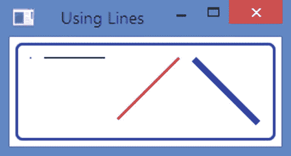

图 14-3

使用线节点

```java
// LineTest.java
package com.jdojo.shape;

import javafx.application.Application;
import javafx.scene.Scene;
import javafx.scene.layout.HBox;
import javafx.scene.paint.Color;
import javafx.scene.shape.Line;
import javafx.stage.Stage;

public class LineTest extends Application {
        public static void main(String[] args) {
            Application.launch(args);
        }

        @Override

        public void start(Stage stage) {
            // It will be just a point at (0, 0)
            Line line1 = new Line();

            Line line2 = new Line(0, 0, 50, 0);
            line2.setStrokeWidth(1.0);

            Line line3 = new Line(0, 50, 50, 0);
            line3.setStrokeWidth(2.0);
            line3.setStroke(Color.RED);

            Line line4 = new Line(0, 0, 50, 50);
            line4.setStrokeWidth(5.0);
            line4.setStroke(Color.BLUE);

            HBox root = new HBox(line1, line2, line3, line4);
            root.setSpacing(10);
            root.setStyle("""
               -fx-padding: 10;
               -fx-border-style: solid inside;
               -fx-border-width: 2;
               -fx-border-insets: 5;
               -fx-border-radius: 5;
               -fx-border-color: blue;""");

            Scene scene = new Scene(root);
            stage.setScene(scene);
            stage.setTitle("Using Lines");
            stage.show();
        }
}

Listing 14-2Using the Line Class to Create Line Nodes

```

### 绘制矩形

`Rectangle`类的一个实例表示一个矩形节点。该类使用六个属性来定义矩形:

*   `x`

*   `y`

*   `width`

*   `height`

*   `arcWidth`

*   `arcHeight`

`x`和`y`属性是矩形左上角在节点局部坐标系中的 x 和 y 坐标。`width`和`height`属性分别是矩形的宽度和高度。指定相同的宽度和高度来绘制正方形。

默认情况下，矩形的角是尖锐的。通过指定`arcWidth`和`arcHeight`属性，矩形可以有圆角。你可以把一个椭圆的一个象限定位在四个角上，使它们变圆。`arcWidth`和`arcHeight`属性是椭圆的水平和垂直直径。默认情况下，它们的值为零，这使得矩形具有尖角。图 [14-4](#Fig4) 显示了两个矩形——一个带尖角，一个带圆角。显示椭圆是为了说明圆角矩形的`arcWidth`和`arcHeight`属性之间的关系。


图 14-4

带尖角和圆角的矩形

`Rectangle`类包含几个构造函数。它们将各种属性作为参数。`x`、`y`、`width`、`height`、`arcWidth`和`arcHeight`属性的默认值为零。构造函数是

*   `Rectangle()`

*   `Rectangle(double width, double height)`

*   `Rectangle(double x, double y, double width, double height)`

*   `Rectangle(double width, double height, Paint fill)`

当您将一个`Rectangle`添加到大多数布局窗格中时，您将看不到为其指定`x`和`y`属性值的效果，因为它们将子元素放置在(0，0)处。A `Pane`使用这些属性。清单 [14-3](#PC4) 中的程序将两个矩形添加到一个`Pane`中。第一个矩形使用 x 和 y 属性的默认值零。第二个矩形为`x`属性指定 120，为`y`属性指定 20。图 [14-5](#Fig5) 显示了`Pane`内两个矩形的位置。请注意，第二个矩形(右侧)的左上角位于(120，20)。

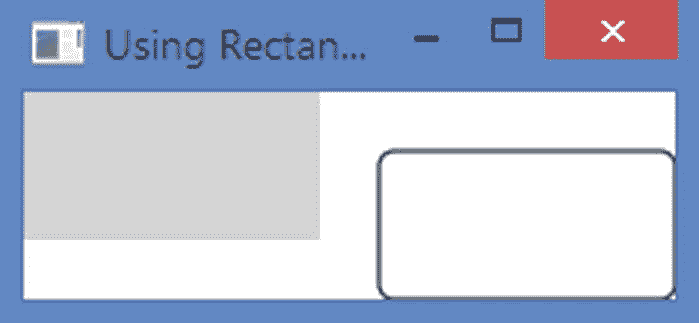

图 14-5

窗格内的矩形，它使用 x 和 y 属性来定位它们

```java
// RectangleTest.java
package com.jdojo.shape;

import javafx.application.Application;
import javafx.scene.Scene;
import javafx.scene.layout.Pane;
import javafx.scene.paint.Color;
import javafx.scene.shape.Rectangle;
import javafx.stage.Stage;

public class RectangleTest extends Application {
        public static void main(String[] args) {
            Application.launch(args);
        }

        @Override
        public void start(Stage stage) {
            // x=0, y=0, width=100, height=50, fill=LIGHTGRAY, stroke=null
            Rectangle rect1 = new Rectangle(100, 50, Color.LIGHTGRAY);

            // x=120, y=20, width=100, height=50, fill=WHITE, stroke=BLACK
            Rectangle rect2 = new Rectangle(120, 20, 100, 50);
            rect2.setFill(Color.WHITE);
            rect2.setStroke(Color.BLACK);
            rect2.setArcWidth(10);
            rect2.setArcHeight(10);

            Pane root = new Pane();
            root.getChildren().addAll(rect1, rect2);
            Scene scene = new Scene(root);
            stage.setScene(scene);
            stage.setTitle("Using Rectangles");
            stage.show();
        }
}

Listing 14-3Using the Rectangle Class to Create Rectangle Nodes

```

### 画圆

`Circle`类的一个实例代表一个圆形节点。该类使用三个属性来定义圆:

*   `centerX`

*   `centerY`

*   `radius`

`centerX`和`centerY`属性是圆心在节点局部坐标系中的 x 和 y 坐标。`radius`属性是圆的半径。这些属性的默认值为零。

`Circle`类包含几个构造函数:

*   `Circle()`

*   `Circle(double radius)`

*   `Circle(double centerX, double centerY, double radius)`

*   `Circle(double centerX, double centerY, double radius, Paint fill)`

*   `Circle(double radius, Paint fill)`

清单 [14-4](#PC5) 中的程序给一个`HBox`增加了两个圆。注意`HBox`没有使用圆的`centerX`和`centerY`属性。将它们添加到一个`Pane`来观察效果。图 [14-6](#Fig6) 显示了两个圆。


图 14-6

使用圆形节点

```java
// CircleTest.java
package com.jdojo.shape;

import javafx.application.Application;
import javafx.scene.Scene;
import javafx.scene.layout.HBox;
import javafx.scene.paint.Color;
import javafx.scene.shape.Circle;
import javafx.stage.Stage;

public class CircleTest extends Application {
        public static void main(String[] args) {
            Application.launch(args);
        }

        @Override
        public void start(Stage stage) {
            // centerX=0, centerY=0, radius=40, fill=LIGHTGRAY,
            // stroke=null
            Circle c1 = new Circle(0, 0, 40);
            c1.setFill(Color.LIGHTGRAY);

            // centerX=10, centerY=10, radius=40\. fill=YELLOW,
            // stroke=BLACK
            Circle c2 = new Circle(10, 10, 40, Color.YELLOW);
            c2.setStroke(Color.BLACK);
            c2.setStrokeWidth(2.0);

            HBox root = new HBox(c1, c2);
            root.setSpacing(10);
            root.setStyle("""
               -fx-padding: 10;
               -fx-border-style: solid inside;
               -fx-border-width: 2;
               -fx-border-insets: 5;
               -fx-border-radius: 5;
               -fx-border-color: blue;""");

            Scene scene = new Scene(root);
            stage.setScene(scene);
            stage.setTitle("Using Circle");
            stage.show();
        }
}

Listing 14-4Using the Circle Class to Create Circle Nodes

```

### 绘制椭圆

`Ellipse`类的一个实例表示一个椭圆节点。该类使用四个属性来定义椭圆:

*   `centerX`

*   `centerY`

*   `radiusX`

*   `radiusY`

`centerX`和`centerY`属性是圆心在节点局部坐标系中的 x 和 y 坐标。`radiusX`和`radiusY`是椭圆在水平和垂直方向上的半径。这些属性的默认值为零。当`radiusX`和`radiusY`相同时，圆是椭圆的特例。

`Ellipse`类包含几个构造函数:

*   `Ellipse()`

*   `Ellipse(double radiusX, double radiusY)`

*   `Ellipse(double centerX, double centerY, double radiusX, double radiusY)`

清单 [14-5](#PC6) 中的程序创建了`Ellipse`类的三个实例。第三个实例画了一个圆，因为程序为`radiusX`和`radiusY`属性设置了相同的值。图 [14-7](#Fig7) 显示了三个椭圆。


图 14-7

使用椭圆节点

```java
// EllipseTest.java
package com.jdojo.shape;

import javafx.application.Application;
import javafx.scene.Scene;
import javafx.scene.layout.HBox;
import javafx.scene.paint.Color;
import javafx.scene.shape.Ellipse;
import javafx.stage.Stage;

public class EllipseTest extends Application {
        public static void main(String[] args) {
            Application.launch(args);
        }

        @Override
        public void start(Stage stage) {
            Ellipse e1 = new Ellipse(50, 30);
            e1.setFill(Color.LIGHTGRAY);

            Ellipse e2 = new Ellipse(60, 30);
            e2.setFill(Color.YELLOW);
            e2.setStroke(Color.BLACK);
            e2.setStrokeWidth(2.0);

            // Draw a circle using the Ellipse class (radiusX=radiusY=30)
            Ellipse e3 = new Ellipse(30, 30);
            e3.setFill(Color.YELLOW);
            e3.setStroke(Color.BLACK);
            e3.setStrokeWidth(2.0);

            HBox root = new HBox(e1, e2, e3);
            root.setSpacing(10);
            root.setStyle("""
               -fx-padding: 10;
               -fx-border-style: solid inside;
               -fx-border-width: 2;
               -fx-border-insets: 5;
               -fx-border-radius: 5;
               -fx-border-color: blue;""");

            Scene scene = new Scene(root);
            stage.setScene(scene);
            stage.setTitle("Using Ellipses");
            stage.show();
        }

}

Listing 14-5Using the Ellipse Class to Create Ellipse Nodes

```

### 绘制多边形

`Polygon`类的一个实例代表一个多边形节点。该类不定义任何公共属性。它允许您使用定义多边形顶点的(x，y)坐标数组来绘制多边形。使用`Polygon`类，你可以绘制任何类型的几何形状，这些几何形状是使用连接线创建的(三角形、五边形、六边形、平行四边形等)。).

`Polygon`类包含两个构造函数:

*   `Polygon()`

*   `Polygon(double... points)`

无参数构造函数创建一个空多边形。您需要添加形状顶点的(x，y)坐标。多边形将从第一个顶点到第二个顶点、从第二个顶点到第三个顶点等等绘制一条线。最后，通过从最后一个顶点到第一个顶点画一条线来闭合形状。

`Polygon`类将顶点的坐标存储在一个`ObservableList<Double>`中。您可以使用`getPoints()`方法获得可观察列表的引用。注意，它将坐标存储在一个列表`Double`中，这个列表只是一个数字。您的工作是成对传递数字，因此它们可以用作顶点的(x，y)坐标。如果传递奇数个数字，则不会创建任何形状。下面的代码片段创建了两个三角形——一个在构造函数中传递顶点的坐标，另一个稍后将它们添加到可观察列表中。两个三角形在几何上是相同的:

```java
// Create an empty triangle and add vertices later
Polygon triangle1 = new Polygon();
triangle1.getPoints().addAll(50.0, 0.0,
                      0.0, 100.0,
                      100.0, 100.0);

// Create a triangle with vertices
Polygon triangle2 = new Polygon(50.0, 0.0,
                        0.0, 100.0,

                        100.0, 100.0);

```

清单 [14-6](#PC8) 中的程序使用`Polygon`类创建了一个三角形、一个平行四边形和一个六边形，如图 [14-8](#Fig8) 所示。

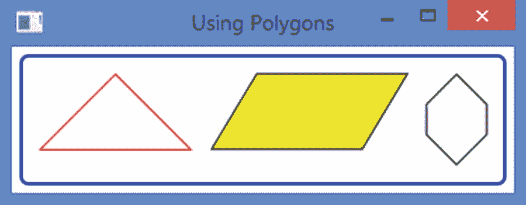

图 14-8

使用多边形节点

```java
// PolygonTest.java
package com.jdojo.shape;

import javafx.application.Application;
import javafx.scene.Scene;
import javafx.scene.layout.HBox;
import javafx.scene.paint.Color;
import javafx.scene.shape.Polygon;
import javafx.stage.Stage;

public class PolygonTest extends Application {
        public static void main(String[] args) {
            Application.launch(args);
        }

        @Override
        public void start(Stage stage) {
            Polygon triangle1 = new Polygon();
            triangle1.getPoints().addAll(50.0, 0.0,
                0.0, 50.0,
                100.0, 50.0);
            triangle1.setFill(Color.WHITE);
            triangle1.setStroke(Color.RED);

            Polygon parallelogram = new Polygon();
            parallelogram.getPoints().addAll(
               30.0, 0.0,
               130.0, 0.0,
               100.00, 50.0,
               0.0, 50.0);
            parallelogram.setFill(Color.YELLOW);
            parallelogram.setStroke(Color.BLACK);

            Polygon hexagon = new Polygon(
                100.0, 0.0,
                120.0, 20.0,
                120.0, 40.0,
                100.0, 60.0,
                80.0, 40.0,
                80.0, 20.0);
            hexagon.setFill(Color.WHITE);
            hexagon.setStroke(Color.BLACK);

            HBox root = new HBox(triangle1, parallelogram, hexagon);
            root.setSpacing(10);
            root.setStyle("""
               -fx-padding: 10;
               -fx-border-style: solid inside;
               -fx-border-width: 2;
               -fx-border-insets: 5;
               -fx-border-radius: 5;
               -fx-border-color: blue;""");

            Scene scene = new Scene(root);
            stage.setScene(scene);
            stage.setTitle("Using Polygons");
            stage.show();
        }

}

Listing 14-6Using the Polygon Class to Create a Triangle, a Parallelogram, and a Hexagon

```

### 绘制多段线

折线类似于多边形，只是它不在最后一点和第一点之间绘制直线。也就是说，折线是一个开放的多边形。然而，`fill`颜色用于填充整个形状，就好像该形状是闭合的一样。

`Polyline`类的一个实例代表一个折线节点。该类不定义任何公共属性。它允许您使用定义折线顶点的(x，y)坐标数组来绘制折线。使用`Polyline`类，你可以绘制任何类型的几何形状，这些几何形状是使用连接线创建的(三角形、五边形、六边形、平行四边形等)。).

`Polyline`类包含两个构造函数:

*   `Polyline()`

*   `Polyline(double... points)`

无参数构造函数创建一条空折线。您需要添加形状顶点的(x，y)坐标。多边形将从第一个顶点到第二个顶点、从第二个顶点到第三个顶点等等绘制一条线。与`Polygon`不同，该形状不会自动闭合。如果要闭合形状，需要添加第一个顶点的坐标作为最后一对数字。

如果您想稍后添加顶点的坐标，请将它们添加到由`Polyline`类的`getPoints()`方法返回的`ObservableList<Double>`中。下面的代码片段使用不同的方法创建了两个具有相同几何属性的三角形。请注意，为了闭合三角形，第一对和最后一对数字是相同的:

```java
// Create an empty triangle and add vertices later
Polygon triangle1 = new Polygon();
triangle1.getPoints().addAll(
    50.0, 0.0,
    0.0, 100.0,
    100.0, 100.0,
    50.0, 0.0);

// Create a triangle with vertices
Polygon triangle2 = new Polygon(
    50.0, 0.0,
    0.0, 100.0,
    100.0, 100.0,
    50.0, 0.0);

```

清单 [14-7](#PC10) 中的程序使用`Polyline`类创建了一个三角形、一个开放的平行四边形和一个六边形，如图 [14-9](#Fig9) 所示。


图 14-9

使用折线节点

```java
// PolylineTest.java
package com.jdojo.shape;

import javafx.application.Application;
import javafx.scene.Scene;
import javafx.scene.layout.HBox;
import javafx.scene.paint.Color;
import javafx.scene.shape.Polyline;
import javafx.stage.Stage;

public class PolylineTest extends Application {
        public static void main(String[] args) {
            Application.launch(args);
        }

        @Override
        public void start(Stage stage) {
            Polyline triangle1 = new Polyline();
            triangle1.getPoints().addAll(
                50.0, 0.0,
                0.0, 50.0,
                100.0, 50.0,
                50.0, 0.0);
            triangle1.setFill(Color.WHITE);
            triangle1.setStroke(Color.RED);

            // Create an open parallelogram

            Polyline parallelogram = new Polyline();
            parallelogram.getPoints().addAll(
                30.0, 0.0,
                130.0, 0.0,
                100.00, 50.0,
                0.0, 50.0);
            parallelogram.setFill(Color.YELLOW);
            parallelogram.setStroke(Color.BLACK);

            Polyline hexagon = new Polyline(
               100.0, 0.0,
               120.0, 20.0,
               120.0, 40.0,
               100.0, 60.0,
               80.0, 40.0,
               80.0, 20.0,
               100.0, 0.0);
            hexagon.setFill(Color.WHITE);
            hexagon.setStroke(Color.BLACK);

            HBox root = new HBox(triangle1, parallelogram, hexagon);
            root.setSpacing(10);
            root.setStyle("""
               -fx-padding: 10;
               -fx-border-style: solid inside;
               -fx-border-width: 2;
               -fx-border-insets: 5;
               -fx-border-radius: 5;
               -fx-border-color: blue;""");

            Scene scene = new Scene(root);
            stage.setScene(scene);
            stage.setTitle("Using Polylines");
            stage.show();
        }
}

Listing 14-7Using the Polyline Class to Create a Triangle, an Open Parallelogram, and a Hexagon

```

### 画弧线

`Arc`类的一个实例代表一个椭圆的一部分。该类使用七个属性来定义椭圆:

*   `centerX`

*   `centerY`

*   `radiusX`

*   `radiusY`

*   `startAngle`

*   `length`

*   `type`

前四个属性定义了一个椭圆。关于如何定义椭圆，请参考“绘制椭圆”一节。最后三个属性定义了椭圆的一个扇区，即`Arc`节点。`startAngle`属性指定从 x 轴正方向逆时针测量的部分的起始角度，单位为度。它定义了弧的起点。`length`是一个角度，以度为单位，从开始角度逆时针测量，以定义扇形的结束。如果`length`属性设置为 360 度，则`Arc`是一个完整的椭圆。图 [14-10](#Fig10) 说明了这些特性。


图 14-10

定义弧的属性

type 属性指定了关闭`Arc`的方式。它是`ArcType`枚举中定义的`OPEN`、`CHORD`和`ROUND`常量之一:

*   `ArcType.OPEN`不关闭圆弧。

*   `ArcType.CHORD`通过用直线连接起点和终点来闭合圆弧。

*   `ArcType.ROUND`通过将起点和终点连接到椭圆的中心来闭合圆弧。

图 [14-11](#Fig11) 显示了弧的三种闭合类型。一个`Arc`的默认类型是`ArcType.OPEN`。如果不对`Arc`应用描边，那么`ArcType.OPEN`和`ArcType.CHORD`看起来是一样的。


图 14-11

弧的闭合类型

`Arc`类包含两个构造函数:

*   `Arc()`

*   `Arc(double centerX, double centerY, double radiusX, double radiusY, double startAngle, double length)`

清单 [14-8](#PC11) 中的程序展示了如何创建`Arc`节点。产生的窗口如图 [14-12](#Fig12) 所示。

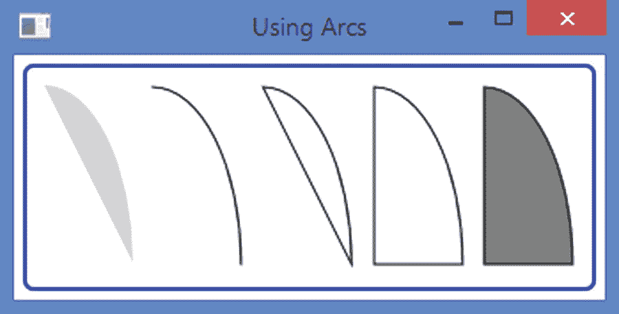

图 14-12

使用弧形节点

```java
// ArcTest.java
package com.jdojo.shape;

import javafx.application.Application;
import javafx.scene.Scene;
import javafx.scene.layout.HBox;
import javafx.scene.paint.Color;
import javafx.scene.shape.Arc;
import javafx.scene.shape.ArcType;
import javafx.stage.Stage;

public class ArcTest extends Application {
        public static void main(String[] args) {
            Application.launch(args);
        }

        @Override
        public void start(Stage stage) {
            // An OPEN arc with a fill
            Arc arc1 = new Arc(0, 0, 50, 100, 0, 90);
            arc1.setFill(Color.LIGHTGRAY);

            // An OPEN arc with no fill and a stroke

            Arc arc2 = new Arc(0, 0, 50, 100, 0, 90);
            arc2.setFill(Color.TRANSPARENT);
            arc2.setStroke(Color.BLACK);

            // A CHORD arc with no fill and a stroke
            Arc arc3 = new Arc(0, 0, 50, 100, 0, 90);
            arc3.setFill(Color.TRANSPARENT);
            arc3.setStroke(Color.BLACK);
            arc3.setType(ArcType.CHORD);

            // A ROUND arc with no fill and a stroke
            Arc arc4 = new Arc(0, 0, 50, 100, 0, 90);
            arc4.setFill(Color.TRANSPARENT);
            arc4.setStroke(Color.BLACK);
            arc4.setType(ArcType.ROUND);

            // A ROUND arc with a gray fill and a stroke
            Arc arc5 = new Arc(0, 0, 50, 100, 0, 90);
            arc5.setFill(Color.GRAY);
            arc5.setStroke(Color.BLACK);
            arc5.setType(ArcType.ROUND);

            HBox root = new HBox(arc1, arc2, arc3, arc4, arc5);
            root.setSpacing(10);
            root.setStyle("""
               -fx-padding: 10;
               -fx-border-style: solid inside;
               -fx-border-width: 2;
               -fx-border-insets: 5;
               -fx-border-radius: 5;
               -fx-border-color: blue;""");

            Scene scene = new Scene(root);
            stage.setScene(scene);
            stage.setTitle("Using Arcs");
            stage.show();
        }
}

Listing 14-8Using the Arc Class to Create Arcs, Which Are Sectors of Ellipses

```

### 绘制二次曲线

贝塞尔曲线在计算机图形学中用于绘制平滑曲线。`QuadCurve`类的一个实例表示使用指定的贝塞尔控制点与两个指定点相交的二次贝塞尔曲线段。`QuadCurve class`包含六个属性来指定三个点:

*   `startX`

*   `startY`

*   `controlX`

*   `controlY`

*   `endX`

*   `endY`

`QuadCurve`类包含两个构造函数:

*   `QuadCurve()`

*   `QuadCurve(double startX, double startY, double controlX, double controlY, double endX, double endY)`

清单 [14-9](#PC12) 中的程序绘制了同一个二次贝塞尔曲线两次——一次用笔画和透明填充，一次没有笔画和浅灰色填充。图 [14-13](#Fig13) 显示了两条曲线。

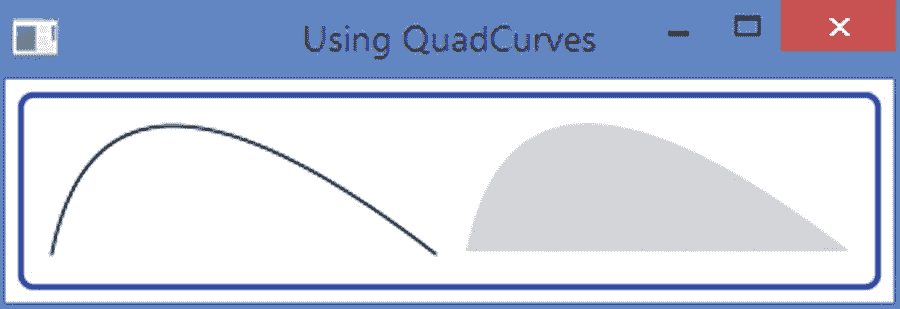

图 14-13

使用二次贝塞尔曲线

```java
// QuadCurveTest.java
package com.jdojo.shape;

import javafx.application.Application;
import javafx.scene.Scene;
import javafx.scene.layout.HBox;
import javafx.scene.paint.Color;
import javafx.scene.shape.QuadCurve;
import javafx.stage.Stage;

public class QuadCurveTest extends Application {
        public static void main(String[] args) {
            Application.launch(args);
        }

        @Override
        public void start(Stage stage) {
            QuadCurve qc1 = new QuadCurve(0, 100, 20, 0, 150, 100);
            qc1.setFill(Color.TRANSPARENT);
            qc1.setStroke(Color.BLACK);

            QuadCurve qc2 = new QuadCurve(0, 100, 20, 0, 150, 100);
            qc2.setFill(Color.LIGHTGRAY);

            HBox root = new HBox(qc1, qc2);
            root.setSpacing(10);
            root.setStyle("""
               -fx-padding: 10;
               -fx-border-style: solid inside;
               -fx-border-width: 2;
               -fx-border-insets: 5;
               -fx-border-radius: 5;
               -fx-border-color: blue;""");

            Scene scene = new Scene(root);
            stage.setScene(scene);
            stage.setTitle("Using QuadCurves");
            stage.show();
        }
}

Listing 14-9Using the QuadCurve Class to Draw Quadratic BezierCurve

```

### 绘制三次曲线

`CubicCurve`类的一个实例使用两个指定的贝塞尔控制点表示与两个指定点相交的三次贝塞尔曲线段。关于贝塞尔曲线的详细解释和演示，请参考 [`http://en.wikipedia.org/wiki/Bezier_curves`](http://en.wikipedia.org/wiki/Bezier_curves) 的维基百科文章。`CubicCurve class`包含八个属性来指定四个点:

*   `startX`

*   `startY`

*   `controlX1`

*   `controlY1`

*   `controlX2`

*   `controlY2`

*   `endX`

*   `endY`

`CubicCurve`类包含两个构造函数:

*   `CubicCurve()`

*   `CubicCurve(double startX, double startY, double controlX1, double controlY1, double controlX2, double controlY2, double endX, double endY)`

清单 [14-10](#PC13) 中的程序绘制同一个三次贝塞尔曲线两次——一次用笔画和透明填充，一次没有笔画和浅灰色填充。图 [14-14](#Fig14) 显示了两条曲线。

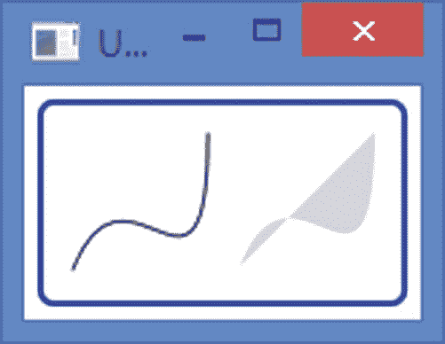

图 14-14

使用三次贝塞尔曲线

```java
// CubicCurveTest.java
package com.jdojo.shape;

import javafx.application.Application;
import javafx.scene.Scene;
import javafx.scene.layout.HBox;
import javafx.scene.paint.Color;
import javafx.scene.shape.CubicCurve;
import javafx.stage.Stage;

public class CubicCurveTest extends Application {
        public static void main(String[] args) {
            Application.launch(args);
        }

        @Override
        public void start(Stage stage) {
            CubicCurve cc1 = new CubicCurve(0, 50, 20, 0, 50, 80, 50, 0);
            cc1.setFill(Color.TRANSPARENT);
            cc1.setStroke(Color.BLACK);

            CubicCurve cc2 = new CubicCurve(0, 50, 20, 0, 50, 80, 50, 0);
            cc2.setFill(Color.LIGHTGRAY);

            HBox root = new HBox(cc1, cc2);
            root.setSpacing(10);
            root.setStyle("""
               -fx-padding: 10;
               -fx-border-style: solid inside;

               -fx-border-width: 2;
               -fx-border-insets: 5;
               -fx-border-radius: 5;
               -fx-border-color: blue;""");

            Scene scene = new Scene(root);
            stage.setScene(scene);
            stage.setTitle("Using CubicCurves");
            stage.show();
        }
}

Listing 14-10Using the CubicCurve Class to Draw a Cubic Bezier Curve

```

## 使用 Path 类构建复杂形状

我在前面的章节中讨论了几个形状类。它们被用来画简单的形状。对于复杂的形状不方便使用它们。您可以使用`Path`类绘制复杂的形状。`Path`类的一个实例定义了形状的路径(轮廓)。路径由一个或多个子路径组成。子路径由一个或多个路径元素组成。每个子路径都有一个起点和一个终点。

path 元素是`PathElement`抽象类的一个实例。`PathElement`类的以下子类代表特定类型的路径元素:

*   `MoveTo`

*   `LineTo`

*   `HLineTo`

*   `VLineTo`

*   `ArcTo`

*   `QuadCurveTo`

*   `CubicCurveTo`

*   `ClosePath`

在您看到一个例子之前，让我们概述一下使用`Path`类创建一个形状的过程。这个过程类似于用铅笔在纸上画一个形状。首先，你把铅笔放在纸上。你可以重述一遍，“你把铅笔移到纸上的一点。”不管你想画什么形状，移动铅笔到一个点必须是第一步。现在，您开始移动铅笔来绘制路径元素(例如，水平线)。当前路径元素的起点与前一个路径元素的终点相同。根据需要绘制尽可能多的路径元素(例如，垂直线、弧线和二次贝塞尔曲线)。最后，您可以在开始的同一点或其他地方结束最后一个路径元素。

定义`PathElement`的坐标可以是绝对的，也可以是相对的。默认情况下，坐标是绝对的。它是由`PathElement`类的`absolute`属性指定的。如果为 true(这是默认值),则坐标是绝对的。如果为假，则坐标是相对的。绝对坐标是相对于节点的局部坐标系测量的。将前一个`PathElement`的终点作为原点，测量相对坐标。

`Path`类包含三个构造函数:

*   `Path()`

*   `Path(Collection<? extends PathElement> elements)`

*   `Path(PathElement... elements)`

无参数构造函数创建一个空形状。另外两个构造函数将路径元素列表作为参数。一个`Path`在一个`ObservableList<PathElement>`中存储路径元素。您可以使用`getElements()`方法获取列表的引用。您可以修改路径元素列表来修改形状。下面的代码片段展示了使用`Path`类创建形状的两种方法:

```java
// Pass the path elements to the constructor
Path shape1 = new Path(pathElement1, pathElement2, pathElement3);

// Create an empty path and add path elements to the elements list
Path shape2 = new Path();

shape2.getElements().addAll(pathElement1, pathElement2, pathElement3);

```

Tip

可以同时将一个`PathElement`实例作为路径元素添加到`Path`对象中。一个`Path`对它所有的路径元素使用相同的`fill`和`stroke`。

### MoveTo 路径元素

一个`MoveTo`路径元素用于将指定的 x 和 y 坐标作为当前点。它具有将铅笔提起并放置在纸上指定点的效果。一个`Path`对象的第一个路径元素必须是一个`MoveTo`元素，并且不能使用相对坐标。`MoveTo`类定义了两个`double`属性，它们是点的 x 和 y 坐标:

*   `x`

*   `y`

`MoveTo`类包含两个构造函数。无参数构造函数将当前点设置为(0.0，0.0)。另一个构造函数将当前点的 x 和 y 坐标作为参数:

```java
// Create a MoveTo path element to move the current point to (0.0, 0.0)
MoveTo mt1 = new MoveTo();

// Create a MoveTo path element to move the current point to (10.0, 10.0)
MoveTo mt2 = new MoveTo(10.0, 10.0);

```

Tip

路径必须以`MoveTo`路径元素开始。一个路径中可以有多个`MoveTo`路径元素。后续的`MoveTo`元素表示新子路径的起点。

### LineTo 路径元素

一个`LineTo`路径元素从当前点到指定点画一条直线。它包含两个`double`属性，分别是线条末端的 x 和 y 坐标:

*   `x`

*   `y`

`LineTo`类包含两个构造函数。无参数构造函数将行尾设置为(0.0，0.0)。另一个构造函数将行尾的 x 和 y 坐标作为参数:

```java
// Create a LineTo path element with its end at (0.0, 0.0)
LineTo lt1 = new LineTo();

// Create a LineTo path element with its end at (10.0, 10.0)
LineTo lt2 = new LineTo(10.0, 10.0);

```

有了`MoveTo`和`LineTo`路径元素的知识，您可以构建仅由线条组成的形状。下面的代码片段创建了一个如图 [14-15](#Fig15) 所示的三角形。图中显示了三角形及其路径元素。箭头显示了图纸的流向。注意，绘图从(0.0)开始，使用第一个`MoveTo`路径元素。

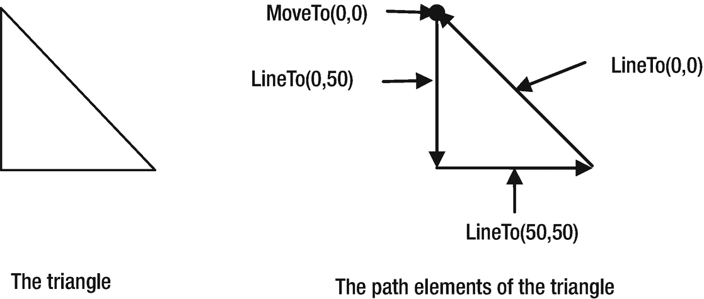

图 14-15

使用 MoveTo 和 LineTo 路径元素创建三角形

```java
Path triangle = new Path(
    new MoveTo(0, 0),
    new LineTo(0, 50),
    new LineTo(50, 50),
    new LineTo(0, 0));

```

`ClosePath` path 元素通过从当前点到路径的起点画一条直线来闭合一条路径。如果路径中存在多个`MoveTo`路径元素，一个`ClosePath`会从当前点到最后一个`MoveTo`标识的点绘制一条直线。你可以用一个`ClosePath`为之前的三角形例子重写路径:

```java
Path triangle = new Path(
    new MoveTo(0, 0),
   new LineTo(0, 50),
   new LineTo(50, 50),
   new ClosePath());

```

清单 [14-11](#PC19) 中的程序创建了两个`Path`节点:一个三角形和一个带有两个倒三角形的节点，给它一个星形的外观，如图 [14-16](#Fig16) 所示。在第二个形状中，每个三角形都被创建为一个子路径，每个子路径都以一个`MoveTo`元素开始。注意`ClosePath`元素的两种用法。每个`ClosePath`关闭其子路径。


图 14-16

基于路径元素的形状

```java
// PathTest.java
package com.jdojo.shape;

import javafx.application.Application;
import javafx.scene.Scene;
import javafx.scene.layout.HBox;
import javafx.scene.shape.ClosePath;
import javafx.scene.shape.LineTo;
import javafx.scene.shape.MoveTo;
import javafx.scene.shape.Path;
import javafx.stage.Stage;

public class PathTest extends Application {
        public static void main(String[] args) {
            Application.launch(args);
        }

        @Override
        public void start(Stage stage) {
           Path triangle = new Path(
              new MoveTo(0, 0),
              new LineTo(0, 50),
              new LineTo(50, 50),
              new ClosePath());

            Path star = new Path();
            star.getElements().addAll(
               new MoveTo(30, 0),
               new LineTo(0, 30),
               new LineTo(60, 30),
               new ClosePath(),/* new LineTo(30, 0), */
               new MoveTo(0, 10),
               new LineTo(60, 10),
               new LineTo(30, 40),
               new ClosePath() /*new LineTo(0, 10)*/);

            HBox root = new HBox(triangle, star);
            root.setSpacing(10);
            root.setStyle("""
               -fx-padding: 10;
               -fx-border-style: solid inside;
               -fx-border-width: 2;
               -fx-border-insets: 5;
               -fx-border-radius: 5;
               -fx-border-color: blue;""");

            Scene scene = new Scene(root);
            stage.setScene(scene);
            stage.setTitle("Using Paths");
            stage.show();
        }

}

Listing 14-11Using the Path Class to Create a Triangle and a Star

```

### lineto 和 lineto 路径元素

`HLineTo` path 元素从当前点到指定的 x 坐标画一条水平线。直线终点的 y 坐标与当前点的 y 坐标相同。`HLineTo`类的`x`属性指定了终点的 x 坐标:

```java
// Create an horizontal line from the current point (x, y) to (50, y)
HLineTo hlt = new HLineTo(50);

```

`VLineTo` path 元素从当前点到指定的 y 坐标画一条垂直线。直线终点的 x 坐标与当前点的 x 坐标相同。`VLineTo`类的`y`属性指定了终点的 y 坐标:

```java
// Create a vertical line from the current point (x, y) to (x, 50)
VLineTo vlt = new VLineTo(50);

```

Tip

`LineTo`路径元素是`HLineTo`和`VLineTo`的通用版本。

下面的代码片段创建了与上一节中讨论的相同的三角形。这一次，您使用`HLineTo`和`VLineTo`路径元素来绘制三角形的底边和高边，而不是使用`LineTo`路径元素:

```java
Path triangle = new Path(
   new MoveTo(0, 0),
   new VLineTo(50),
   new HLineTo(50),
   new ClosePath());

```

### ArcTo 路径元素

一个`ArcTo`路径元素定义了一段连接当前点和指定点的椭圆。它包含以下属性:

*   `radiusX`

*   `radiusY`

*   `x`

*   `y`

*   `XAxisRotation`

*   `largeArcFlag`

*   `sweepFlag`

`radiusX`和`radiusY`属性指定椭圆的水平和垂直半径。`x`和`y`属性指定圆弧终点的 x 和 y 坐标。请注意，圆弧的起点是路径的当前点。

`XAxisRotation`属性指定椭圆 x 轴的旋转角度。请注意，旋转是针对从中获得圆弧的椭圆的 x 轴，而不是节点坐标系的 x 轴。正值逆时针旋转 x 轴。

`largeArcFlag`和`sweepFlag`属性是布尔类型，默认情况下，它们被设置为 false。它们的用途需要详细的解释。两个椭圆可以通过两个给定点，如图 [14-17](#Fig17) 所示，给我们四条弧线来连接这两点。


图 14-17

largeArcFlag 和 sweepFlag 属性对 ArcTo path 元素的影响

图 [14-17](#Fig17) 分别显示了标记为`Start`和`End`的起点和终点。椭圆上的两点可以穿过较大的弧或较小的弧。如果`largeArcFlag`为真，则使用较大的圆弧。否则，使用较小的圆弧。

当决定使用较大或较小的圆弧时，您仍然有两个选择:将使用两个可能椭圆中的哪个椭圆？这由`sweepFlag`属性决定。尝试使用两个选定的圆弧(两个较大的圆弧或两个较小的圆弧)绘制从起点到终点的圆弧。对于一个圆弧，遍历将是顺时针方向，而对于另一个圆弧，遍历将是逆时针方向。如果`sweepFlag`为真，则使用顺时针遍历的椭圆。如果`sweepFlag`为假，则使用逆时针遍历的椭圆。表 [14-1](#Tab1) 显示了根据这两个属性将使用哪个椭圆的哪种类型的圆弧。

表 14-1

基于 largeArcFlag 和 sweepFlag 属性选择弧段和椭圆

<colgroup><col class="tcol1 align-left"> <col class="tcol2 align-left"> <col class="tcol3 align-left"> <col class="tcol4 align-left"></colgroup> 
| 

**长焦**

 | 

**扫雷日**

 | 

弧型

 | 

椭圆

 |
| --- | --- | --- | --- |
| `true` | `true` | 更大的 | 椭圆-2 |
| `true` | `false` | 更大的 | 椭圆-1 |
| `false` | `true` | 较小的 | 椭圆-1 |
| `false` | `false` | 较小的 | 椭圆-2 |

清单 [14-12](#PC23) 中的程序使用一个`ArcTo`路径元素来构建一个`Path`对象。该程序允许用户改变`ArcTo`路径元素的属性。运行程序并更改`largeArcFlag`、`sweepFlag`和其他属性，看看它们如何影响`ArcTo`路径元素。

```java
// ArcToTest.java
package com.jdojo.shape;

import javafx.application.Application;
import javafx.scene.Scene;
import javafx.scene.control.CheckBox;
import javafx.scene.control.Label;
import javafx.scene.control.Slider;
import javafx.scene.layout.BorderPane;
import javafx.scene.layout.GridPane;
import javafx.scene.shape.ArcTo;
import javafx.scene.shape.HLineTo;
import javafx.scene.shape.MoveTo;
import javafx.scene.shape.Path;
import javafx.scene.shape.VLineTo;
import javafx.stage.Stage;

public class ArcToTest extends Application {
        private ArcTo arcTo;

        public static void main(String[] args) {
            Application.launch(args);
        }

        @Override
        public void start(Stage stage) {
            // Create the ArcTo path element
            arcTo = new ArcTo();

            // Use the arcTo element to build a Path
            Path path = new Path(
               new MoveTo(0, 0),
               new VLineTo(100),
               new HLineTo(100),
               new VLineTo(50),
               arcTo);

            BorderPane root = new BorderPane();
            root.setTop(this.getTopPane());
            root.setCenter(path);
            root.setStyle("""
               -fx-padding: 10;
               -fx-border-style: solid inside;

               -fx-border-width: 2;
               -fx-border-insets: 5;
               -fx-border-radius: 5;
               -fx-border-color: blue;""");

            Scene scene = new Scene(root);
            stage.setScene(scene);
            stage.setTitle("Using ArcTo Path Elements");
            stage.show();
        }

        private GridPane getTopPane() {
            CheckBox largeArcFlagCbx = new CheckBox("largeArcFlag");
            CheckBox sweepFlagCbx = new CheckBox("sweepFlag");
            Slider xRotationSlider = new Slider(0, 360, 0);
            xRotationSlider.setPrefWidth(300);
            xRotationSlider.setBlockIncrement(30);
            xRotationSlider.setShowTickMarks(true);
            xRotationSlider.setShowTickLabels(true);

            Slider radiusXSlider = new Slider(100, 300, 100);
            radiusXSlider.setBlockIncrement(10);
            radiusXSlider.setShowTickMarks(true);
            radiusXSlider.setShowTickLabels(true);

            Slider radiusYSlider = new Slider(100, 300, 100);
            radiusYSlider.setBlockIncrement(10);
            radiusYSlider.setShowTickMarks(true);
            radiusYSlider.setShowTickLabels(true);

            // Bind ArcTo properties to the control data

            arcTo.largeArcFlagProperty().bind(
                    largeArcFlagCbx.selectedProperty());
            arcTo.sweepFlagProperty().bind(
                    sweepFlagCbx.selectedProperty());
            arcTo.XaxisRotationProperty().bind(
                    xRotationSlider.valueProperty());
            arcTo.radiusXProperty().bind(
                    radiusXSlider.valueProperty());
            arcTo.radiusYProperty().bind(
                    radiusYSlider.valueProperty());

            GridPane pane = new GridPane();
            pane.setHgap(5);
            pane.setVgap(10);
            pane.addRow(0, largeArcFlagCbx, sweepFlagCbx);
            pane.addRow(1, new Label("XAxisRotation"), xRotationSlider);
            pane.addRow(2, new Label("radiusX"), radiusXSlider);
            pane.addRow(3, new Label("radiusY"), radiusYSlider);

            return pane;
        }
}

Listing 14-12Using ArcTo Path Elements

```

### QuadCurveTo 路径元素

`QuadCurveTo`类的一个实例使用指定的控制点(controlX，controlY)从当前点到指定的终点(x，y)绘制一条二次贝塞尔曲线。它包含四个属性来指定结束点和控制点。

*   `x`

*   `y`

*   `controlX`

*   `controlY`

`x`和`y`属性指定终点的 x 和 y 坐标。`controlX`和`controlY`属性指定控制点的 x 和 y 坐标。

`QuadCurveTo`类包含两个构造函数:

*   `QuadCurveTo()`

*   `QuadCurveTo(double controlX, double controlY, double x, double y)`

下面的代码片段使用了一个带有(10，100)控制点和(0，0)结束点的`QuadCurveTo`。图 [14-18](#Fig18) 显示了结果路径。

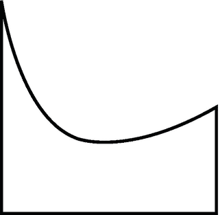

图 14-18

使用 QuadCurveTo 路径元素

```java
Path path = new Path(
   new MoveTo(0, 0),
   new VLineTo(100),
   new HLineTo(100),
   new VLineTo(50),
   new QuadCurveTo(10, 100, 0, 0));

```

### 三次曲线到路径元素

`CubicCurveTo`类的实例使用指定的控制点(controlX1，controlY1)和(controlX2，controlY2)绘制从当前点到指定终点(x，y)的三次贝塞尔曲线。它包含六个属性来指定结束点和控制点:

*   `x`

*   `y`

*   `controlX1`

*   `controlY1`

*   `controlX2`

*   `controlY2`

`x`和`y`属性指定终点的 x 和 y 坐标。`controlX1`和`controlY1`属性指定第一个控制点的 x 和 y 坐标。`controlX2`和`controlY2`属性指定第二个控制点的 x 和 y 坐标。

`CubicCurveTo`类包含两个构造函数:

*   `CubicCurveTo()`

*   `CubicCurveTo(double controlX1, double controlY1, double controlX2, double controlY2, double x, double y)`

下面的代码片段使用了一个`CubicCurveTo`,将(10，100)和(40，80)作为控制点，将(0，0)作为结束点。图 [14-19](#Fig19) 显示了结果路径。

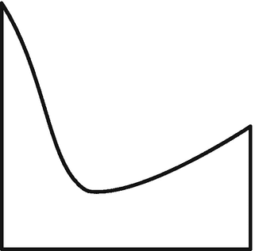

图 14-19

使用 QuadCurveTo 路径元素

```java
Path path = new Path(
   new MoveTo(0, 0),
   new VLineTo(100),
   new HLineTo(100),
   new VLineTo(50),
   new CubicCurveTo(10, 100, 40, 80, 0, 0));

```

### ClosePath 路径元素

`ClosePath` path 元素关闭当前子路径。注意一个`Path`可能由多个子路径组成，因此，一个`Path`中可能有多个`ClosePath`元素。一个`ClosePath`元素从当前点到当前子路径的起始点画一条直线，并结束子路径。一个`ClosePath`元素后面可能跟着一个`MoveTo`元素，在这种情况下，`MoveTo`元素是下一个子路径的起点。如果一个`ClosePath`元素后面是一个路径元素而不是一个`MoveTo`元素，那么下一个子路径从被`ClosePath`元素关闭的子路径的起始点开始。

下面的代码片段创建了一个`Path`对象，它使用了两个子路径。每个子路径画一个三角形。使用`ClosePath`元素关闭子路径。图 [14-20](#Fig20) 显示了最终的形状。

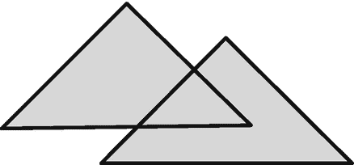

图 14-20

使用两个子路径和一个 ClosePath 元素的形状

```java
Path p1 = new Path(
   new MoveTo(50, 0),
   new LineTo(0, 50),
   new LineTo(100, 50),
   new ClosePath(),
   new MoveTo(90, 15),
   new LineTo(40, 65),
   new LineTo(140, 65),
   new ClosePath());
p1.setFill(Color.LIGHTGRAY);

```

### 路径的填充规则

一个`Path`可以用来画非常复杂的形状。有时，很难确定一个点是在形状内部还是外部。`Path`类包含一个`fillRule`属性，用于确定一个点是否在一个形状内。它的值可以是`FillRule`枚举:`NON_ZERO`和`EVEN_ODD`的常量之一。如果某个点在形状内部，它将使用填充颜色进行渲染。图 [14-21](#Fig21) 显示了由一个`Path`和两个三角形公共区域中的一个点创建的两个三角形。我将讨论该点是否在形状内部。

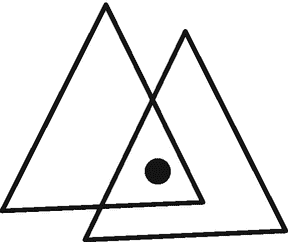

图 14-21

由两个三角形子路径组成的形状

笔划的方向是决定一个点是否在形状内部的重要因素。图 [14-21](#Fig21) 中的形状可以用不同方向的笔画出来。图 [14-22](#Fig22) 显示了其中的两个。在形状-1 中，两个三角形都使用逆时针笔划。在形状-2 中，一个三角形使用逆时针笔划，另一个使用顺时针笔划。

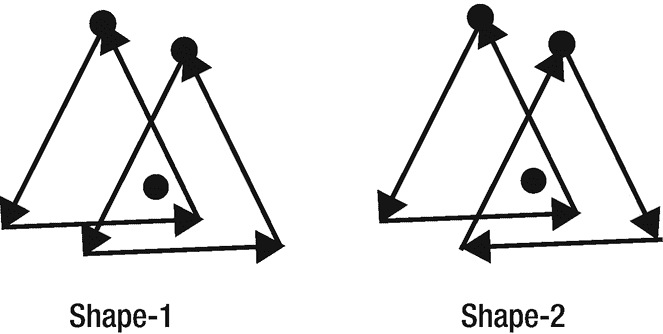

图 14-22

由两个使用不同描边方向的三角形子路径组成的形状

`Path`的填充规则从该点到无限远绘制光线，因此它们可以与所有路径段相交。在`NON_ZERO`填充规则中，如果逆时针和顺时针方向上与射线相交的路径段数量相等，则该点在形状之外。否则，点在形状内部。你可以用一个从零开始的计数器来理解这个规则。对于逆时针方向与路径段相交的每条射线，计数器加 1。对于每一条沿顺时针方向与路径段相交的光线，从计数器中减去 1。最后，如果计数器不为零，则该点在内部；否则，重点就在外面。图 [14-23](#Fig23) 显示了应用`NON_ZERO`填充规则时，由两个三角形子路径组成的相同两条路径及其计数器值。从该点画出的射线用虚线表示。第一个形状中的点得分为 6(非零值)，并且位于路径内部。第二个形状中的点得分为零，它在路径之外。


图 14-23

将非零填充规则应用于两个三角形子路径

像`NON_ZERO`填充规则一样，`EVEN_ODD`填充规则也从一个点向无限远的所有方向绘制光线，因此所有路径段都相交。它计算光线和路径段之间的相交数。如果数字是奇数，则该点在路径内。否则，该点在路径之外。如果将图 [14-23](#Fig23) 中所示的两个图形的`fillRule`属性设置为`EVEN_ODD`，那么这两个图形的点都在路径之外，因为在这两种情况下，光线和路径段之间的交点数量都是六(偶数)。一个`Path`的`fillRule`属性的默认值是`FillRule.NON_ZERO`。

清单 [14-13](#PC27) 中的程序是本节讨论的例子的一个实现。它绘制了四个路径:前两个(从左数)使用`NON_ZERO`填充规则，后两个使用`EVEN_ODD`填充规则。图 [14-24](#Fig24) 显示了路径。第一个和第三个路径使用逆时针笔划绘制两个三角形子路径。第二个和第四个路径是使用逆时针笔划绘制的，对于一个三角形使用顺时针笔划。

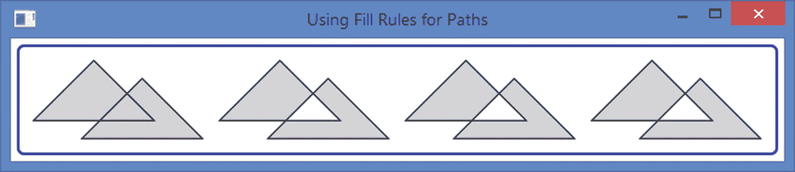

图 14-24

使用不同填充规则的路径

```java
// PathFillRule.java
package com.jdojo.shape;

import javafx.application.Application;
import javafx.scene.Scene;
import javafx.scene.layout.HBox;
import javafx.scene.paint.Color;
import javafx.scene.shape.FillRule;
import javafx.scene.shape.LineTo;
import javafx.scene.shape.MoveTo;
import javafx.scene.shape.Path;
import javafx.scene.shape.PathElement;
import javafx.stage.Stage;

public class PathFillRule extends Application {
        public static void main(String[] args) {
            Application.launch(args);
        }

        @Override
        public void start(Stage stage) {
            // Both triangles use a counterclockwise stroke
            PathElement[] pathElements1 = {
               new MoveTo(50, 0),
               new LineTo(0, 50),
               new LineTo(100, 50),
               new LineTo(50, 0),
               new MoveTo(90, 15),
               new LineTo(40, 65),
               new LineTo(140, 65),
               new LineTo(90, 15)};

            // One triangle uses a clockwise stroke and
            // another uses a counterclockwise stroke
            PathElement[] pathElements2 = {
               new MoveTo(50, 0),
               new LineTo(0, 50),
               new LineTo(100, 50),
               new LineTo(50, 0),
               new MoveTo(90, 15),
               new LineTo(140, 65),
               new LineTo(40, 65),
               new LineTo(90, 15)};

            /* Using the NON-ZERO fill rule by default */
            Path p1 = new Path(pathElements1);
            p1.setFill(Color.LIGHTGRAY);

            Path p2 = new Path(pathElements2);
            p2.setFill(Color.LIGHTGRAY);

            /* Using the EVEN_ODD fill rule */
            Path p3 = new Path(pathElements1);
            p3.setFill(Color.LIGHTGRAY);
            p3.setFillRule(FillRule.EVEN_ODD);

            Path p4 = new Path(pathElements2);
            p4.setFill(Color.LIGHTGRAY);

            p4.setFillRule(FillRule.EVEN_ODD);

            HBox root = new HBox(p1, p2, p3, p4);
            root.setSpacing(10);
            root.setStyle("""
               -fx-padding: 10;
               -fx-border-style: solid inside;
               -fx-border-width: 2;
               -fx-border-insets: 5;
               -fx-border-radius: 5;
               -fx-border-color: blue;""");

            Scene scene = new Scene(root);
            stage.setScene(scene);
            stage.setTitle("Using Fill Rules for Paths");
            stage.show();
        }
}

Listing 14-13Using Fill Rules for Paths

```

## 绘制可缩放矢量图形

`SVGPath`类的一个实例从编码字符串中的路径数据绘制一个形状。你可以在 [`www.w3.org/TR/SVG`](http://www.w3.org/TR/SVG) 找到 SVG 规范。在 [`www.w3.org/TR/SVG/paths.html`](http://www.w3.org/TR/SVG/paths.html) 可以找到构造字符串格式路径数据的详细规则。JavaFX 部分支持 SVG 规范。

`SVGPath`类包含一个无参数构造函数来创建它的对象:

```java
// Create a SVGPath object
SVGPath sp = new SVGPath();

```

`SVGPath`类包含两个属性:

*   `content`

*   `fillRule`

属性定义了 SVG `path`的编码字符串。`fillRule`属性指定形状内部的填充规则，可以是`FillRule.NON_ZERO`或`FillRule.EVEN_ODD`。`fillRule`属性的默认值是`FillRule.NON_ZERO`。有关填充规则的更多详细信息，请参考“路径的填充规则”一节。`Path`和`SVGPath`的填充规则相同。

下面的代码片段将“M50，0 L0，50 L100，50 Z”编码字符串设置为`SVGPath`对象绘制三角形的内容，如图 [14-25](#Fig25) 所示:


图 14-25

使用 SVGPath 的三角形

```java
SVGPath sp2 = new SVGPath();
sp2.setContent("M50, 0 L0, 50 L100, 50 Z");
sp2.setFill(Color.LIGHTGRAY);
sp2.setStroke(Color.BLACK);

```

`SVGPath`的内容是遵循一些规则的编码字符串:

*   该字符串由一系列命令组成。

*   每个命令名的长度正好是一个字母。

*   命令后面是它的参数。

*   命令的参数值由逗号或空格分隔。例如，“M50，0 L0，50 L100，50 Z”和“M50 0 L0 50 L100 50 Z”代表相同的路径。为了可读性，您将使用逗号来分隔两个值。

*   您不需要在命令字符前后添加空格。比如“M50 0 L0 50 L100 50 Z”可以改写为“M50 0L0 50L100 50Z”。

让我们考虑一下上一个例子中使用的 SVG 内容:

```java
M50, 0 L0, 50 L100, 50 Z

```

内容由四个命令组成:

*   `M50, 0`

*   `L0, 50`

*   `L100, 50`

*   `Z`

将 SVG 路径命令与`Path` API 比较，第一个命令是“MoveTo (50，0)”；第二个命令是“LineTo(0，50)”；第三个命令是“LineTo(100，50)”；第四个命令是“ClosePath”。

Tip

`SVGPath`内容中的命令名是代表`Path`对象中路径元素的类的第一个字母。例如，`Path` API 中的绝对`MoveTo`变成了`SVGPath`内容中的`M`，绝对`LineTo`变成了`L`，以此类推。

命令的参数是坐标，可以是绝对的，也可以是相对的。当命令名为大写时(如`M`)，其参数被认为是绝对的。当命令名为小写(例如 m)时，其参数被认为是相对的。“关闭路径”命令是`Z`或`z`。因为“closepath”命令不带任何参数，所以大写和小写版本的行为是相同的。

考虑两个`SVG`路径的内容:

*   `M50, 0 L0, 50 L100, 50 Z`

*   `M50, 0 l0, 50 l100, 50 Z`

第一条路径使用绝对坐标。第二条路径使用绝对和相对坐标。像`Path`一样，`SVGPath`必须以“moveTo”命令开始，该命令必须使用绝对坐标。如果`SVGPath`以相对“移动到”命令开始(如`"m 50, 0"`，其参数被视为绝对坐标。在前面的 SVG 路径中，可以用`"m50, 0"`作为字符串的开头，结果是一样的。

前面的两个 SVG 路径将绘制两个不同的三角形，如图 [14-26](#Fig26) 所示，尽管两者使用相同的参数。第一条路径在左边绘制三角形，第二条路径在右边绘制三角形。第二条路径中的命令解释如下:

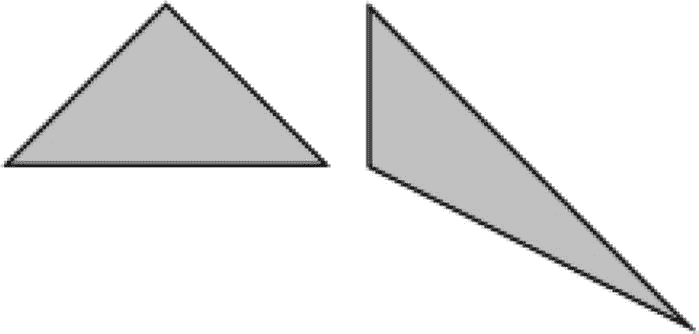

图 14-26

在 SVG 路径中使用绝对和相对坐标

*   移动到(50，0)。

*   从当前点(50，0)到(50，50)画一条线。终点(50，50)是通过将当前点的 x 和 y 坐标添加到相对的“lineto”命令(l)参数中得出的。终点变成(50，50)。

*   从当前点(50，50)到(150，100)画一条线。同样，终点的坐标是通过将当前点的 x 和 y 坐标(50，50)与命令参数“l100，50”相加得出的(“l100，50”中的第一个字符是小写的 L，而不是数字 1)。

*   然后关闭路径(Z)。

表 [14-2](#Tab2) 列出了`SVGPath`对象内容中使用的命令。它还列出了在`Path` API 中使用的等价类。下表列出了使用绝对坐标的命令。命令的相对版本使用小写字母。参数列中的加号(+)表示可以使用多个参数。

表 14-2

SVG 路径命令列表

<colgroup><col class="tcol1 align-left"> <col class="tcol2 align-left"> <col class="tcol3 align-left"> <col class="tcol4 align-left"></colgroup> 
| 

命令

 | 

参数

 | 

命令名称

 | 

路径 API 类

 |
| --- | --- | --- | --- |
| `M` | `(x, y)+` | `moveto` | `MoveTo` |
| `L` | (x，y)+ | `lineto` | `LineTo` |
| `H` | x+ | `lineto` | `HLineTo` |
| `V` | y+ | `lineto` | `VLineTo` |
| `A` | (rx，ry，x 轴旋转，大圆弧标志，扫描标志，x，y)+ | `arcto` | `ArcTo` |
| `Q` | (x1，y1，x，y)+ | `Quadratic Bezier curveto` | `QuadCurveTo` |
| `T` | (x，y)+ | `Shorthand/smooth quadratic Bezier curveto` | `QuadCurveTo` |
| `C` | (x1，y1，x2，y2，x，y)+ | `curveto` | `CubicCurveTo` |
| `S` | (x2，y2，x，y)+ | `Shorthand/smooth curveto` | `CubicCurveTo` |
| `Z` | 没有人 | `closePath` | `ClosePath` |

### “移动到”命令

“moveTo”命令`M`在指定的(x，y)坐标开始一个新子路径。它后面可能是一对或多对坐标。第一对坐标被认为是该点的 x 和 y 坐标，该命令将使其成为当前点。每个额外的对都被视为“lineto”命令的一个参数。如果“moveTo”命令是相对的，则“lineto”命令也是相对的。如果“moveTo”命令是绝对的，则“lineto”命令将是绝对的。例如，以下两个 SVG 路径是相同的:

```java
M50, 0 L0, 50 L100, 50 Z
M50, 0, 0, 50, 100, 50 Z

```

### “lineto”命令

有三个“行到”命令:`L`、`H`和`V`。它们被用来画直线。

命令`L`用于从当前点到指定的(x，y)点画一条直线。如果指定多对(x，y)坐标，它将绘制一条多段线。(x，y)坐标的最后一对成为新的当前点。下面的 SVG 路径将绘制相同的三角形。第一个使用两个`L`命令，第二个只使用一个:

*   `M50, 0 L0, 50 L100, 50 L50, 0`

*   `M50, 0 L0, 50, 100, 50, 50, 0`

`H`和`V`命令用于从当前点绘制水平线和垂直线。命令`H`从当前点(cx，cy)到(x，cy)画一条水平线。命令`V`画一条从当前点(cx，cy)到(cx，y)的垂直线。您可以向它们传递多个参数。最后一个参数值定义了当前点。比如“M0，0H200，100 V50Z”会画一条从(0，0)到(200，0)，从(200，0)到(100，0)的线。第二个命令将(100，0)作为当前点。第三个命令将绘制一条从(100，0)到(100，50)的垂直线。z 命令将绘制一条从(100，50)到(0，0)的直线。下面的代码片段绘制了一个 SVG 路径，如图 [14-27](#Fig27) 所示:


图 14-27

对“lineto”命令使用多个参数

```java
SVGPath p1 = new SVGPath();
p1.setContent("M0, 0H-50, 50, 0 V-50, 50, 0, -25 L25, 0");
p1.setFill(Color.LIGHTGRAY);
p1.setStroke(Color.BLACK);

```

### “arcto”命令

“arcto”命令`A`从当前点到指定的(x，y)点画一个椭圆弧。它使用 rx 和 ry 作为沿 x 轴和 y 轴的半径。x 轴旋转是椭圆 x 轴的旋转角度，以度为单位。大弧标志和扫描标志是用于从四个可能的弧中选择一个弧的标志。使用 0 和 1 作为标志值，其中 1 表示真，0 表示假。有关其所有参数的详细说明，请参考“ArcTo 路径元素”一节。您可以传递多个弧参数，在这种情况下，一个弧的终点将成为下一个弧的当前点。下面的代码片段用弧线绘制了两条 SVG 路径。第一个路径为“arcTo”命令使用一个参数，第二个路径使用两个参数。图 [14-28](#Fig28) 显示了路径。

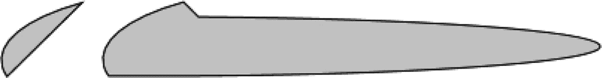

图 14-28

使用“arcTo”命令绘制椭圆弧路径

```java
SVGPath p1 = new SVGPath();

// rx=150, ry=50, x-axis-rotation=0, large-arc-flag=0,
// sweep-flag 0, x=-50, y=50
p1.setContent("M0, 0 A150, 50, 0, 0, 0, -50, 50 Z");
p1.setFill(Color.LIGHTGRAY);
p1.setStroke(Color.BLACK);

// Use multiple arcs in one "arcTo" command
SVGPath p2 = new SVGPath();

// rx1=150, ry1=50, x-axis-rotation1=0, large-arc-flag1=0,
// sweep-flag1=0, x1=-50, y1=50
// rx2=150, ry2=10, x-axis-rotation2=0, large-arc-flag2=0,
// sweep-flag2=0, x2=10, y2=10
p2.setContent("M0, 0 A150 50 0 0 0 -50 50, 150 10 0 0 0 10 10 Z");
p2.setFill(Color.LIGHTGRAY);
p2.setStroke(Color.BLACK);

```

### “二次贝塞尔曲线”命令

命令`Q`和`T`都用于绘制二次贝塞尔曲线。

命令`Q`使用指定的(x1，y1)作为控制点，从当前点到指定的(x，y)点绘制一条二次贝塞尔曲线。

命令`T`使用一个控制点绘制一条从当前点到指定(x，y)点的二次贝塞尔曲线，该控制点是前一个命令的控制点的反射。如果没有先前的命令或先前的命令不是`Q`、`q`、`T`或`t`，则当前点被用作控制点。

命令`Q`将控制点作为参数，而命令`T`采用控制点。以下代码片段使用命令`Q`和`T`绘制二次贝塞尔曲线，如图 [14-29](#Fig29) 所示:


图 14-29

使用 Q 和 T 命令绘制二次贝塞尔曲线

```java
SVGPath p1 = new SVGPath();
p1.setContent("M0, 50 Q50, 0, 100, 50");
p1.setFill(Color.LIGHTGRAY);
p1.setStroke(Color.BLACK);

SVGPath p2 = new SVGPath();
p2.setContent("M0, 50 Q50, 0, 100, 50 T200, 50");
p2.setFill(Color.LIGHTGRAY);
p2.setStroke(Color.BLACK);

```

### “三次贝塞尔曲线”命令

命令`C`和`S`用于绘制三次贝塞尔曲线。

命令`C`使用指定的控制点(x1，y1)和(x2，y2)绘制从当前点到指定点(x，y)的三次贝塞尔曲线。

命令`S`从当前点到指定点(x，y)绘制一条三次贝塞尔曲线。它假设第一个控制点是前一个命令上第二个控制点的反射。如果没有先前的命令或先前的命令不是 C、C、`S`或 s，则当前点用作第一个控制点。指定点(x2，y2)是第二个控制点。多组坐标画出一个凝聚体。

下面这段代码使用命令`C`和`S`绘制三次贝塞尔曲线，如图 [14-30](#Fig30) 所示。第二条路径使用命令`S`将前一个命令`C`的第二个控制点的反射作为其第一个控制点:

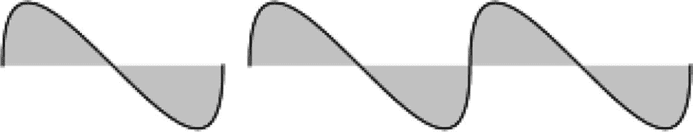

图 14-30

使用 C 和 S 命令绘制三次贝塞尔曲线

```java
SVGPath p1 = new SVGPath();
p1.setContent("M0, 0 C0, -100, 100, 100, 100, 0");
p1.setFill(Color.LIGHTGRAY);
p1.setStroke(Color.BLACK);

SVGPath p2 = new SVGPath();
p2.setContent("M0, 0 C0, -100, 100, 100, 100, 0 S200 100 200, 0");
p2.setFill(Color.LIGHTGRAY);
p2.setStroke(Color.BLACK);

```

### “closepath”命令

“闭合路径”命令`Z`和`z`从当前点到当前子路径的起点画一条直线，并结束子路径。该命令的大写和小写版本工作方式相同。

## 组合形状

`Shape`类提供了三个静态方法，让您执行形状的并集、交集和差集:

*   `union(Shape shape1, Shape shape2)`

*   `intersect(Shape shape1, Shape shape2)`

*   `subtract(Shape shape1, Shape shape2)`

这些方法返回一个新的`Shape`实例。它们对输入形状的区域进行操作。如果形状没有填充和描边，则其面积为零。新形状有一个描边和一个填充。`union()`方法组合两个形状的面积。`intersect()`方法使用形状之间的公共区域来创建新的形状。`subtract()`方法通过从第一个形状中减去指定的第二个形状来创建新的形状。

清单 [14-14](#PC36) 中的程序使用并集、交集和减法运算来组合两个圆。图 [14-31](#Fig31) 显示了最终的形状。


图 14-31

由两个圆组合而成的形状

```java
// CombiningShapesTest.java
package com.jdojo.shape;

import javafx.application.Application;
import javafx.scene.Scene;
import javafx.scene.layout.HBox;
import javafx.scene.paint.Color;
import javafx.scene.shape.Circle;
import javafx.scene.shape.Shape;
import javafx.stage.Stage;

public class CombiningShapesTest extends Application {
        public static void main(String[] args) {
                Application.launch(args);
        }

        @Override
        public void start(Stage stage) {
            Circle c1 = new Circle (0, 0, 20);
            Circle c2 = new Circle (15, 0, 20);

            Shape union = Shape.union(c1, c2);
            union.setStroke(Color.BLACK);
            union.setFill(Color.LIGHTGRAY);

            Shape intersection = Shape.intersect(c1, c2);
            intersection.setStroke(Color.BLACK);
            intersection.setFill(Color.LIGHTGRAY);

            Shape subtraction = Shape.subtract(c1, c2);
            subtraction.setStroke(Color.BLACK);
            subtraction.setFill(Color.LIGHTGRAY);

            HBox root = new HBox(union, intersection, subtraction);
            root.setSpacing(20);
            root.setStyle("""
               -fx-padding: 10;
               -fx-border-style: solid inside;
               -fx-border-width: 2;
               -fx-border-insets: 5;
               -fx-border-radius: 5;
               -fx-border-color: blue;""");

            Scene scene = new Scene(root);
            stage.setScene(scene);
            stage.setTitle("Combining Shapes");
            stage.show();
        }

}

Listing 14-14Combining Shapes to Create New Shapes

```

## 了解形状的笔画

描边是画出形状轮廓的过程。有时，形状的轮廓也称为笔画。`Shape`类包含几个定义形状笔画外观的属性:

*   `stroke`

*   `strokeWidth`

*   `strokeType`

*   `strokeLineCap`

*   `strokeLineJoin`

*   `strokeMiterLimit`

*   `strokeDashOffset`

`stroke`属性指定笔画的颜色。对于除了`Line`、`Path`和`Polyline`之外的所有形状，默认的`stroke`被设置为`null`，它们的默认笔画为`Color.BLACK`。

`strokeWidth`属性指定笔画的宽度。默认为 1.0px。

描边是沿着形状的边界绘制的。`strokeType`属性指定边界上笔画宽度的分布。它的值是`StrokeType`枚举的三个常量`CENTERED`、`INSIDE`和`OUTSIDE`之一。默认值为`CENTERED`。`CENTERED`描边类型将描边宽度的一半画在边界外，另一半画在边界内。`INSIDE`笔划类型在边界内绘制笔划。`OUTSIDE`描边在边界外绘制描边。形状的描边宽度包含在其布局边界内。

清单 [14-15](#PC37) 中的程序创建了四个矩形，如图 [14-32](#Fig32) 所示。所有矩形都有相同的`width`和`height (` 50px 和 50px)。从左边数起，第一个矩形没有描边，其布局边界为 50px X 50px。第二个矩形使用宽度为 4px 的笔画和`INSIDE`笔画类型。`INSIDE`笔画类型绘制在宽度和高度边界内，矩形的布局边界为 50px X 50px。第三个矩形使用 4px 的描边宽度和默认的`CENTERED`描边类型。笔画在边界内绘制 2px，在边界外绘制 2px。2px 外部笔划被添加到所有四个尺寸中，使得布局边界为 54px X 54px。第四个矩形使用 4px 描边宽度和`OUTSIDE`描边类型。整个笔画宽度超出了矩形的宽度和高度，使布局为 58px X 58px。

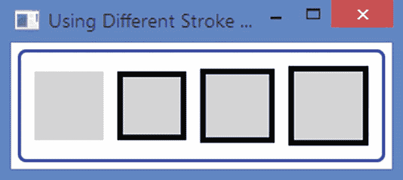

图 14-32

使用不同类型笔画的矩形

```java
// StrokeTypeTest.java
package com.jdojo.shape;

import javafx.application.Application;
import javafx.geometry.Pos;
import javafx.scene.Scene;
import javafx.scene.layout.HBox;
import javafx.scene.paint.Color;
import javafx.scene.shape.Rectangle;
import javafx.scene.shape.StrokeType;
import javafx.stage.Stage;

public class StrokeTypeTest extends Application {
        public static void main(String[] args) {
            Application.launch(args);
        }

        @Override
        public void start(Stage stage) {
            Rectangle r1 = new Rectangle(50, 50);
            r1.setFill(Color.LIGHTGRAY);

            Rectangle r2 = new Rectangle(50, 50);
            r2.setFill(Color.LIGHTGRAY);
            r2.setStroke(Color.BLACK);
            r2.setStrokeWidth(4);
            r2.setStrokeType(StrokeType.INSIDE);

            Rectangle r3 = new Rectangle(50, 50);
            r3.setFill(Color.LIGHTGRAY);
            r3.setStroke(Color.BLACK);
            r3.setStrokeWidth(4);

            Rectangle r4 = new Rectangle(50, 50);
            r4.setFill(Color.LIGHTGRAY);
            r4.setStroke(Color.BLACK);
            r4.setStrokeWidth(4);
            r4.setStrokeType(StrokeType.OUTSIDE);

            HBox root = new HBox(r1, r2, r3, r4);
            root.setAlignment(Pos.CENTER);
            root.setSpacing(10);
            root.setStyle("""
               -fx-padding: 10;
               -fx-border-style: solid inside;
               -fx-border-width: 2;
               -fx-border-insets: 5;
               -fx-border-radius: 5;
               -fx-border-color: blue;""");

            Scene scene = new Scene(root);
            stage.setScene(scene);
            stage.setTitle("Using Different Stroke Types for Shapes");
            stage.show();
        }

}

Listing 14-15Effects of Applying Different Stroke Types on a Rectangle

```

`strokeLineCap`属性为未闭合的子路径和虚线段指定笔画的结束修饰。它的值是`StrokeLineCap`枚举的常量之一:`BUTT`、`SQUARE`和`ROUND`。默认为`BUTT`。`BUTT`线帽不在子路径的末端添加装饰；笔画恰好在起点和终点开始和结束。`SQUARE`线帽延伸末端一半的行程宽度。`ROUND`线帽在末端增加一个圆帽。圆帽使用的半径等于笔划宽度的一半。图 [14-33](#Fig33) 显示三条线，为未闭合的子路径。所有线条的宽度都是 100 像素，使用 10 像素的笔画宽度。图中显示了他们使用的`strokeLineCap`。使用`BUTT`线帽的线条的布局边界宽度保持为 100 像素。但是，对于其他两行，布局边界的宽度增加到 110 像素，两端增加 10 像素。


图 14-33

笔画的不同线帽样式

注意，`strokeLineCap`属性应用于*未闭合的*子路径的线段末端。图 [14-34](#Fig34) 显示了由未闭合子路径创建的三个三角形。他们使用不同的笔画线帽。使用 SVG 路径数据“M50，0L0，50 M0，50 L100，50 M100，50 L50，0”来绘制三角形。填充设置为`null`，笔画宽度设置为 10px。

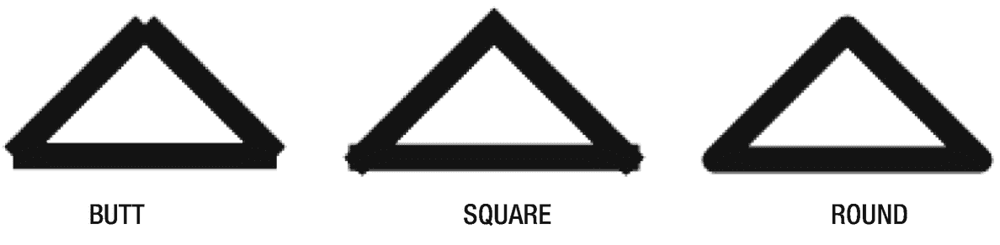

图 14-34

使用未闭合子路径的三角形使用不同的描边线帽

属性指定子路径的两个连续路径元素如何连接。它的值是`StrokeLineJoin`枚举的常量之一:`BEVEL`、`MITER`和`ROUND`。默认为斜接。`BEVEL`线连接通过一条直线连接路径元素的外角。`MITER`线连接延伸两个路径元素的外边缘，直到它们相遇。`ROUND`线条连接通过将两个路径元素的角圆化一半的笔画宽度来连接它们。图 [14-35](#Fig35) 显示了用 SVG 路径数据“M50，0L0，50 L100，50 Z”创建的三个三角形。填充颜色为空，描边宽度为 10px。如图所示，三角形使用不同的线连接。


图 14-35

使用不同线条连接类型的三角形

一个`MITER`线连接通过延伸它们的外边缘来连接两个路径元素。如果路径元素以较小的角度相交，连接的长度可能会变得很大。您可以使用`strokeMiterLimit`属性来限制连接的长度。它指定斜接长度和描边宽度的比率。斜接长度是连接的最内侧点和最外侧点之间的距离。如果两个路径元素不能通过在此范围内扩展它们的外边缘而相遇，则使用一个`BEVEL`连接。默认值为 10.0。也就是说，默认情况下，斜接长度可能高达笔画宽度的十倍。

下面的代码片段创建了两个三角形，如图 [14-36](#Fig36) 所示。默认情况下，两者都使用`MITER`线连接。第一个三角形使用 2.0 作为斜接限制。第二个三角形使用默认的斜接限制，即 10.0。笔画宽度为 10px。第一个三角形尝试通过将两条线延伸到 20px 来连接角，20px 是通过将 10px 描边宽度乘以 2.0 的斜接限制来计算的。在 20px 内不能使用`MITER`连接来连接拐角，所以使用了`BEVEL`连接。


图 14-36

使用不同笔划斜接限制的三角形

```java
SVGPath t1 = new SVGPath();
t1.setContent("M50, 0L0, 50 L100, 50 Z");
t1.setStrokeWidth(10);
t1.setFill(null);
t1.setStroke(Color.BLACK);
t1.setStrokeMiterLimit(2.0);

SVGPath t2 = new SVGPath();
t2.setContent("M50, 0L0, 50 L100, 50 Z");
t2.setStrokeWidth(10);
t2.setFill(null);
t2.setStroke(Color.BLACK);

```

默认情况下，描边绘制实心轮廓。也可以有虚线轮廓。您需要提供一个虚线模式和虚线偏移量。虚线图案是存储在`ObservableList<Double>`中的`double`的数组。您可以使用`Shape`类的`getStrokeDashArray()`方法来获取列表的引用。列表的元素指定了虚线和间隙的模式。第一个元素是虚线长度、第二个间隙、第三个虚线长度、第四个间隙等等。急骤的图案被重复以画出轮廓。`strokeDashOffset`属性指定笔画开始处的虚线图案的偏移量。

下面的代码片段创建了两个`Polygon`实例，如图 [14-37](#Fig37) 所示。两者都使用相同的虚线模式，但虚线偏移不同。第一个使用 0.0 的虚线偏移，这是默认值。第一个矩形的笔画以 15.0px 的虚线开始，这是虚线图案的第一个元素，可以在从(0，0)到(100，0)绘制的虚线中看到。第二个`Polygon`使用虚线偏移量 20.0，这意味着笔画将在虚线图案内 20.0px 处开始。前两个元素 15.0 和 3.0 在虚线偏移 20.0 内。因此，第二个`Polygon`的笔画从第三个元素开始，这是一个 5.0px 的破折号。


图 14-37

两个多边形的轮廓使用虚线图案

```java
Polygon p1 = new Polygon(0, 0, 100, 0, 100, 50, 0, 50, 0, 0);
p1.setFill(null);
p1.setStroke(Color.BLACK);
p1.getStrokeDashArray().addAll(15.0, 5.0, 5.0, 5.0);

Polygon p2 = new Polygon(0, 0, 100, 0, 100, 50, 0, 50, 0, 0);
p2.setFill(null);
p2.setStroke(Color.BLACK);
p2.getStrokeDashArray().addAll(15.0, 5.0, 5.0, 5.0);
p2.setStrokeDashOffset(20.0);

```

## 使用 CSS 设计形状样式

所有形状都没有默认的样式类名。如果您想使用 CSS 将样式应用于形状，您需要向它们添加样式类名。所有形状都可以使用下列 CSS 属性:

*   `-fx-fill`

*   `-fx-smooth`

*   `-fx-stroke`

*   `-fx-stroke-type`

*   `-fx-stroke-dash-array`

*   `-fx-stroke-dash-offset`

*   `-fx-stroke-line-cap`

*   `-fx-stroke-line-join`

*   `-fx-stroke-miter-limit`

*   `-fx-stroke-width`

所有 CSS 属性都对应于`Shape`类中的属性，我在上一节已经详细讨论过了。`Rectangle`支持两个额外的 CSS 属性来指定圆角矩形的弧宽和高度:

*   `-fx-arc-height`

*   `-fx-arc-width`

以下代码片段创建了一个`Rectangle`，并添加了*矩形*作为其样式类名:

```java
Rectangle r1 = new Rectangle(200, 50);
r1.getStyleClass().add("rectangle");

```

下面的样式将产生一个如图 [14-38](#Fig38) 所示的矩形:

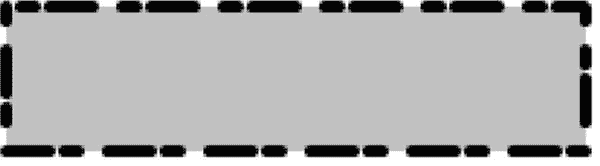

图 14-38

将 CSS 样式应用于矩形

```java
.rectangle {
        -fx-fill: lightgray;
        -fx-stroke: black;
        -fx-stroke-width: 4;
        -fx-stroke-dash-array: 15 5 5 10;
        -fx-stroke-dash-offset: 20;
        -fx-stroke-line-cap: round;
        -fx-stroke-line-join: bevel;
}

```

## 摘要

任何能在二维平面上画出的形状都叫做 2D 形状。JavaFX 提供了各种节点来绘制不同类型的形状(线条、圆形、矩形等)。).您可以将形状添加到场景图。所有形状类都在`javafx.scene.shape`包中。代表 2D 形状的类继承自抽象的`Shape`类。形状可以有定义形状轮廓的笔划。形状可以有填充。

`Line`类的一个实例代表一个线节点。一辆`Line`没有内饰。默认情况下，它的`fill`属性设置为`null`。设置`fill`没有效果。默认`stroke`为`Color.BLACK`，默认`strokeWidth`为 1.0。

`Rectangle`类的一个实例表示一个矩形节点。该类使用六个属性来定义矩形:`x`、`y`、`width`、`height`、`arcWidth`和`arcHeight`。`x`和`y`属性是矩形左上角在节点局部坐标系中的 x 和 y 坐标。`width`和`height`属性分别是矩形的宽度和高度。指定相同的宽度和高度来绘制正方形。默认情况下，矩形的角是尖锐的。通过指定`arcWidth`和`arcHeight`属性，矩形可以有圆角。

`Circle`类的一个实例代表一个圆形节点。该类使用三个属性来定义圆:`centerX`、`centerY`和`radius`。`centerX`和`centerY`属性是圆心在节点本地坐标系中的 x 和 y 坐标。`radius`属性是圆的半径。这些属性的默认值为零。

`Ellipse`类的一个实例表示一个椭圆节点。该类使用四个属性来定义椭圆:`centerX`、`centerY`、`radiusX`、`radiusY`。`centerX`和`centerY`属性是圆心在节点的局部坐标系中的 x 和 y 坐标。`radiusX`和`radiusY`是椭圆在水平和垂直方向上的半径。这些属性的默认值为零。当`radiusX`和`radiusY`相同时，圆是椭圆的特例。

`Polygon`类的一个实例代表一个多边形节点。该类不定义任何公共属性。它允许您使用定义多边形顶点的(x，y)坐标数组来绘制多边形。使用`Polygon`类，你可以绘制任何类型的几何形状，这些几何形状是使用连接线创建的(三角形、五边形、六边形、平行四边形等)。).

折线类似于多边形，只是它不在最后一点和第一点之间绘制直线。也就是说，折线是一个开放的多边形。然而，`fill`颜色用于填充整个形状，就好像该形状是闭合的一样。`Polyline`类的一个实例代表一个折线节点。

`Arc`类的一个实例代表一个椭圆的一部分。该类使用七个属性来定义椭圆:`centerX`、`centerY`、`radiusX`、`radiusY`、`startAngle`、`length`和`type`。前四个属性定义了一个椭圆。最后三个属性定义了椭圆的一个扇区，即`Arc`节点。`startAngle`属性指定从 x 轴正方向逆时针测量的截面起始角度，单位为度。它定义了弧的起点。`length`是一个角度，以度为单位，从开始角度逆时针测量，以定义扇形的结束。如果`length`属性设置为 360 度，则`Arc`是一个完整的椭圆。

贝塞尔曲线在计算机图形学中用于绘制平滑曲线。`QuadCurve`类的一个实例表示使用指定的贝塞尔控制点与两个指定点相交的二次贝塞尔曲线段。

`CubicCurve`类的一个实例使用两个指定的贝塞尔控制点表示与两个指定点相交的三次贝塞尔曲线段。

您可以使用`Path`类绘制复杂的形状。`Path`类的一个实例定义了形状的路径(轮廓)。路径由一个或多个子路径组成。子路径由一个或多个路径元素组成。每个子路径都有一个起点和一个终点。路径元素是`PathElement`抽象类的一个实例。`PathElement`类的几个子类代表特定类型的路径元素；这些级别是`MoveTo`、`LineTo`、`HLineTo`、`VLineTo`、`ArcTo`、`QuadCurveTo`、`CubicCurveTo`和`ClosePath`。

JavaFX 部分支持 SVG 规范。`SVGPath`类的一个实例从编码字符串中的路径数据绘制一个形状。

JavaFX 允许您通过组合多个形状来创建一个形状。`Shape`类提供了三个名为`union()`、`intersect()`和`subtract()`的静态方法，允许您对作为参数传递给这些方法的两个形状执行并集、交集和差集操作。这些方法返回一个新的`Shape`实例。它们对输入形状的区域进行操作。如果形状没有填充和描边，则其面积为零。新形状有一个描边和一个填充。`union()`方法组合两个形状的面积。`intersect()`方法使用形状之间的公共区域来创建新的形状。`subtract()`方法通过从第一个形状中减去指定的第二个形状来创建新的形状。

描边是画出形状轮廓的过程。有时，形状的轮廓也称为笔画。`Shape`类包含几个属性，如`stroke`、`strokeWidth`等，用于定义形状笔画的外观。

JavaFX 允许你用 CSS 设计 2D 形状。

下一章将讨论如何处理文本绘制。