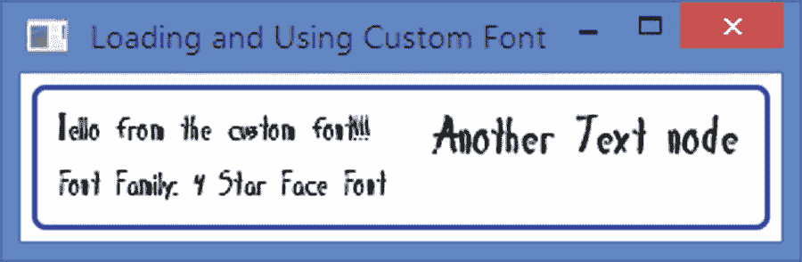

# 15.理解文本节点

在本章中，您将学习:

*   什么是`Text`节点以及如何创建它

*   用于绘制`Text`节点的坐标系

*   如何在`Text`节点中显示多行文本

*   如何设置`Text`节点的字体

*   如何访问已安装的字体以及如何安装自定义字体

*   如何设置`Text`节点的填充和描边

*   如何对`Text`节点应用下划线、删除线等修饰

*   如何应用字体平滑

*   如何使用 CSS 样式化文本节点

本章的例子在`com.jdojo.shape`包中。为了让它们工作，您必须在`module-info.java`文件中添加相应的一行:

```java
...
opens com.jdojo.shape to javafx.graphics, javafx.base;
...

```

## 什么是文本节点？

文本节点是用于呈现文本的`Text`类的一个实例。`Text`类包含几个定制文本外观的属性。`Text`类及其所有相关类——例如，`Font`类、`TextAlignment`枚举、`FontWeight`枚举等。—在`javafx.scene.text`包装中。

`Text`类继承自`Shape`类。也就是说，`Text`是一个`Shape`，它允许你在一个`Text`节点上使用`Shape`类的所有属性和方法。例如，您可以对一个`Text`节点应用填充颜色和描边。因为`Text`是一个节点，所以您可以使用`Node`类的特性:例如，应用效果和变换。您还可以设置文本对齐方式、字体系列、字体大小、文本环绕样式等。，在`Text`节点上。

图 [15-1](#Fig1) 显示了三个文本节点。第一个(左起)是一个简单的文本节点。第二种使用更大字体的粗体文本。第三个使用了`Reflection`效果，一个更大的字体，一个笔画，一个填充。


图 15-1

显示三个文本节点的窗口

## 创建文本节点

`Text`类的一个实例代表一个`Text`节点。一个`Text`节点包含文本和呈现文本的属性。您可以使用`Text`类的一个构造器创建一个`Text`节点:

*   `Text()`

*   `Text(String text)`

*   `Text(double x, double y, String text)`

无参数构造器创建一个以空字符串作为文本的`Text`节点。其他构造器允许您指定文本和定位节点。

`Text`类的`text`属性指定了`Text`节点的文本(或内容)。`x`和`y`属性指定文本原点的 x 和 y 坐标，这将在下一节描述。

```java
// Create an empty Text Node and later set its text
Text t1 = new Text();
t1.setText("Hello from the Text node!");

// Create a Text Node with initial text
Text t2 = new Text("Hello from the Text node!");

// Create a Text Node with initial text and position
Text t3 = new Text(50, 50, "Hello from the Text node!");

```

Tip

文本节点的`width`和`height`由其字体自动确定。默认情况下，`Text`节点使用系统默认字体来呈现文本。

清单 [15-1](#PC3) 中的程序创建三个`Text`节点，设置它们不同的属性，并将它们添加到一个`HBox`中。`Text`节点显示如图 [15-1](#Fig1) 所示。

```java
// TextTest.java
package com.jdojo.shape;

import javafx.application.Application;
import javafx.scene.Scene;
import javafx.scene.effect.Reflection;
import javafx.scene.layout.HBox;
import javafx.scene.paint.Color;
import javafx.scene.text.Font;
import javafx.scene.text.FontWeight;
import javafx.scene.text.Text;
import javafx.stage.Stage;

public class TextTest extends Application {
        public static void main(String[] args) {
                Application.launch(args);
        }

        @Override

        public void start(Stage stage) {
                Text t1 = new Text("Hello Text Node!");

                Text t2 = new Text("Bold and Big");
                t2.setFont(Font.font("Tahoma", FontWeight.BOLD, 16));

                Text t3 = new Text("Reflection");
                t3.setEffect(new Reflection());
                t3.setStroke(Color.BLACK);
                t3.setFill(Color.WHITE);
                t3.setFont(Font.font("Arial", FontWeight.BOLD, 20));

                HBox root = new HBox(t1, t2, t3);
                root.setSpacing(20);
                root.setStyle("""
                         -fx-padding: 10;
                   -fx-border-style: solid inside;
                   -fx-border-width: 2;
                   -fx-border-insets: 5;
                   -fx-border-radius: 5;
                   -fx-border-color: blue;""");

                Scene scene = new Scene(root);
                stage.setScene(scene);
                stage.setTitle("Using Text Nodes");
                stage.show();
        }
}

Listing 15-1Creating Text Nodes

```

## 理解文本来源

除了本地和父坐标系，`Text`节点还有一个附加坐标系。这是用于绘制文本的坐标系。`Text`类的三个属性定义了文本坐标系:

*   `x`

*   `y`

*   `textOrigin`

`x`和`y`属性定义了文本原点的 x 和 y 坐标。`textOrigin`属性的类型是`VPos`。其值可以是`VPos.BASELINE`、`VPos.TOP`、`VPos.CENTER`和`VPos.BOTTOM`。默认是`VPos.BASELINE`。它定义了文本坐标系的 x 轴在文本高度内的位置。图 [15-2](#Fig2) 显示了一个文本节点的局部坐标系和文本坐标系。局部坐标轴用实线表示。文本坐标轴用虚线表示。


图 15-2

textOrigin 属性对文本绘制垂直位置的影响

当`textOrigin`为`VPos.TOP`时，文本坐标系的 x 轴与文本顶部对齐。也就是说，`Text`节点的`y`属性是本地坐标系的 x 轴到显示文本顶部的距离。字体将其字符放在称为*基线*的一行上。`VPos.BASELINE`将文本坐标系的 x 轴与字体的基线对齐。注意，一些字符(例如，g、y、j、p 等。)延伸到基线以下。`VPos.BOTTOM`将文本坐标系的 x 轴与显示文本的底部对齐，说明字体的下降。`VPos.CENTER`(图中未显示)将文本坐标系的 x 轴对准显示文本的中间，说明字体的上升和下降。

Tip

`Text`类包含一个只读的`baselineOffset`属性。它的值是文本顶部和基线之间的垂直距离。它等于字体的最大上升。

大多数时候，您不需要担心`Text`节点的`textOrigin`属性，除非您需要将其相对于另一个节点垂直对齐。清单 [15-2](#PC4) 展示了如何在场景中水平和垂直居中一个`Text`节点。要使节点垂直居中，必须将`textOrigin`属性设置为`VPos.TOP`。文本显示如图 [15-3](#Fig3) 所示。如果不设置`textOrigin`属性，它的 y 轴将与其基线对齐，并出现在场景中心线的上方。


图 15-3

场景中居中的文本节点

```java
// TextCentering.java
package com.jdojo.shape;

import javafx.application.Application;
import javafx.geometry.VPos;
import javafx.scene.Group;
import javafx.scene.Scene;
import javafx.scene.text.Text;
import javafx.stage.Stage;

public class TextCentering extends Application {
        public static void main(String[] args) {
                Application.launch(args);
        }

        @Override
        public void start(Stage stage) {
                Text msg = new Text("A Centered Text Node");

                // Must set the textOrigian to VPos.TOP to center
                // the text node vertcially within the scene
                msg.setTextOrigin(VPos.TOP);

                Group root = new Group();
                root.getChildren().addAll(msg);
                Scene scene = new Scene(root, 200, 50);
                msg.layoutXProperty().bind(
                         scene.widthProperty().subtract(
                     msg.layoutBoundsProperty().get().getWidth()).
                         divide(2));
                msg.layoutYProperty().bind(
                         scene.heightProperty().subtract(
                     msg.layoutBoundsProperty().get().getHeight()).
                         divide(2));

                stage.setTitle("Centering a Text Node in a Scene");
                stage.setScene(scene);
                stage.sizeToScene();
                stage.show();
        }

}

Listing 15-2Centering a Text Node in a Scene

```

## 显示多行文本

一个`Text`节点能够显示多行文本。它在两种情况下创建新行:

*   文本中的换行符“`\n`”会创建一个新行，导致该换行符后面的字符换行到下一行。

*   `Text`类包含一个`wrappingWidth`属性，默认为 0.0。它的值是用像素而不是字符来指定的。如果该值大于零，则每行中的文本将按照指定的值换行。

属性以像素为单位指定两行之间的垂直间距。默认情况下为 0.0。

属性指定边界框中文本行的水平对齐方式。最宽的线定义边界框的宽度。它的值在单行`Text`节点中没有影响。它的值可以是`TextAlignment`枚举的常量之一:`LEFT`、`RIGHT, CENTER`和`JUSTIFY`。默认为`TextAlignment.LEFT`。

清单 [15-3](#PC5) 中的程序创建了三个多线`Text`节点，如图 [15-4](#Fig4) 所示。所有节点的文本都是相同的。文本包含三个换行符。第一个节点使用默认的`LEFT`文本对齐方式和 5px 的行距。第二个节点使用`RIGHT`文本对齐，默认行距为 0px。第三个节点使用 100px 的`wrappingWidth`。在 100 像素处创建一个新行以及一个换行符“`\n`”。


图 15-4

多行文本节点

```java
// MultilineText.java
package com.jdojo.shape;

import javafx.application.Application;
import javafx.scene.Scene;
import javafx.scene.layout.HBox;
import javafx.scene.text.Text;
import javafx.scene.text.TextAlignment;
import javafx.stage.Stage;

public class MultilineText extends Application {
        public static void main(String[] args) {
                Application.launch(args);
        }

        @Override
        public void start(Stage stage) {
                String text = """
                        Strange fits of passion have I known:
                  And I will dare to tell,
                  But in the lover's ear alone,
                  What once to me befell.""".stripIndent();

                Text t1 = new Text(text);
                t1.setLineSpacing(5);

                Text t2 = new Text(text);
                t2.setTextAlignment(TextAlignment.RIGHT);

                Text t3 = new Text(text);
                t3.setWrappingWidth(100);

                HBox root = new HBox(t1, t2, t3);
                root.setSpacing(20);
                root.setStyle("""
                         -fx-padding: 10;
                   -fx-border-style: solid inside;
                   -fx-border-width: 2;
                   -fx-border-insets: 5;
                   -fx-border-radius: 5;
                    -fx-border-color: blue;""");

                Scene scene = new Scene(root);
                stage.setScene(scene);
                stage.setTitle("Using Multiline Text Nodes");
                stage.show();
        }
}

Listing 15-3Using Multiline Text Nodes

```

## 设置文本字体

`Text`类的`font`属性定义文本的字体。使用的默认字体来自“常规”样式的“系统”字体系列。默认字体的大小取决于平台和用户的桌面设置。

一个字体有一个*族*和一个*族名*。字体系列也称为*字样*。字体系列定义了字符的形状(或字形)。当使用属于不同字体系列的字体显示时，相同的字符以不同的方式出现。字体的变体是通过应用样式创建的。字体的每个变体都有一个由系列名称和样式名称组成的名称。例如，“Arial”是字体的系列名称，而“Arial Regular”、“Arial Bold”和“Arial Bold Italic”是“Arial”字体的变体名称。

### 创建字体

`Font`类的一个实例代表一种字体。`Font`类提供了两个构造器:

*   `Font(double size)`

*   `Font(String name, double size)`

第一个构造器创建一个指定大小的`Font`对象，它属于“System”字体族。第二个创建一个指定字体全名和指定大小的`Font`对象。字体的大小以磅为单位。下面的代码片段创建了一些“Arial”系列的字体对象。`Font`类的`getFamily()`、`getName()`和`getSize()`方法分别返回姓氏、全名和字体大小。

```java
// Arial Plain
Font f1 = new Font("Arial", 10);

// Arial Italic
Font f2 = new Font("Arial Italic", 10);

// Arial Bold Italic
Font f3 = new Font("Arial Bold Italic", 10);

// Arial Narrow Bold
Font f4 = new Font("Arial Narrow Bold", 30);

```

如果没有找到完整的字体名称，将创建默认的“系统”字体。很难记住或知道所有字体变体的全名。为了解决这个问题，`Font`类提供了使用字体系列名称、样式和大小创建字体的工厂方法:

*   `font(double size)`

*   `font(String family)`

*   `font(String family, double size)`

*   `font(String family, FontPosture posture, double size)`

*   `font(String family, FontWeight weight, double size)`

*   `font(String family, FontWeight weight, FontPosture posture, double size)`

`font()`方法允许您指定字体系列名称、字体粗细、字体姿态和字体大小。如果只提供了系列名称，则使用默认字体大小，这取决于平台和用户的桌面设置。

字体粗细指定字体的加粗程度。其值是`FontWeight`枚举的常量之一:`THIN`、`EXTRA_LIGHT`、`LIGHT`、`NORMAL`、`MEDIUM`、`SEMI_BOLD`、`BOLD`、`EXTRA_BOLD`、`BLACK`。常数`THIN`代表最细的字体，常数`BLACK`代表最粗的字体。

字体的姿态决定了它是否是斜体。它由`FontPosture`枚举的两个常量之一表示:`REGULAR`和`ITALIC`。

以下代码片段使用 Font 类的工厂方法创建字体:

```java
// Arial Regular
Font f1 = Font.font("Arial", 10);

// Arial Bold
Font f2 = Font.font("Arial", FontWeight.BOLD, 10);

// Arial Bold Italic
Font f3 = Font.font("Arial", FontWeight.BOLD, FontPosture.ITALIC, 10);

// Arial THIN
Font f4 = Font.font("Arial", FontWeight.THIN, 30);

```

Tip

使用`Font`类的`getDefault()`静态方法获取系统默认字体。

清单 [15-4](#PC8) 中的程序创建`Text`节点并设置它们的`font`属性。第一个`Text`节点使用默认字体。图 [15-5](#Fig5) 显示了`Text`节点。`Text`节点的`text`是从它们的`Font`对象的`toString()`方法返回的`String`。


图 15-5

使用“Arial”字体系列变体的文本节点

```java
// TextFontTest.java
package com.jdojo.shape;

import javafx.application.Application;
import javafx.scene.Scene;
import javafx.scene.layout.VBox;
import javafx.scene.text.Font;
import javafx.scene.text.FontPosture;
import javafx.scene.text.FontWeight;
import javafx.scene.text.Text;
import javafx.stage.Stage;

public class TextFontTest extends Application {
        public static void main(String[] args) {
                Application.launch(args);
        }

        @Override
        public void start(Stage stage) {
                Text t1 = new Text();
                t1.setText(t1.getFont().toString());

                Text t2 = new Text();

                t2.setFont(Font.font("Arial", 12));
                t2.setText(t2.getFont().toString());

                Text t3 = new Text();
                t3.setFont(Font.font("Arial", FontWeight.BLACK, 12));
                t3.setText(t2.getFont().toString());

                Text t4 = new Text();
                t4.setFont(Font.font(
                         "Arial", FontWeight.THIN, FontPosture.ITALIC, 12));
                t4.setText(t2.getFont().toString());

                VBox root = new VBox(t1, t2, t3, t4);
                root.setSpacing(10);
                root.setStyle("""
                         -fx-padding: 10;
                   -fx-border-style: solid inside;
                   -fx-border-width: 2;
                   -fx-border-insets: 5;
                   -fx-border-radius: 5;
                   -fx-border-color: blue;""");

                Scene scene = new Scene(root);
                stage.setScene(scene);
                stage.setTitle("Setting Fonts for Text Nodes");
                stage.show();
        }

}

Listing 15-4Setting Fonts for Text Nodes

```

### 访问已安装的字体

您可以获得您的机器上已安装的字体列表。您可以获得所有已安装字体的字体系列名称、完整字体名称和指定字体系列名称的完整字体名称列表。`Font`类中的以下静态方法提供了这些列表:

*   `List<String> getFamilies()`

*   `List<String> getFontNames()`

*   `List<String> getFontNames(String family)`

以下代码片段打印计算机上所有已安装字体的系列名称。输出是在 Windows 上生成的。显示了部分输出:

```java
// Print the family names of all installed fonts
for(String familyName: Font.getFamilies()) {
        System.out.println(familyName);
}
Agency FB
Algerian
Arial
Arial Black
Arial Narrow
Arial Rounded MT Bold
...

```

以下代码片段打印了计算机上所有已安装字体的全名。输出是在 Windows 上生成的。显示了部分输出:

```java
// Print the full names of all installed fonts
for(String fullName: Font.getFontNames()) {
        System.out.println(fullName);
}
Agency FB
Agency FB Bold
Algerian
Arial
Arial Black
Arial Bold
Arial Bold Italic
Arial Italic
Arial Narrow
Arial Narrow Bold

Arial Narrow Bold Italic
More output goes here...

```

以下代码片段打印了“Times New Roman”系列的所有已安装字体的全名:

```java
// Print the full names of “Times New Roman” family
for(String fullName: Font.getFontNames("Times New Roman")) {
        System.out.println(fullName);
}
Times New Roman
Times New Roman Bold
Times New Roman Bold Italic
Times New Roman Italic

```

### 使用自定义字体

您可以从外部来源加载自定义字体:例如，从本地文件系统的文件或从 URL。`Font`类中的`loadFont()`静态方法加载自定义字体:

*   `loadFont(InputStream in, double size)`

*   `loadFont(String urlStr, double size)`

成功加载定制字体后，`loadFont()`方法向 JavaFX 图形引擎注册字体，因此可以使用`Font`类的构造器和工厂方法创建字体。该方法还创建一个指定的`size`的`Font`对象并返回它。因此，`size`参数用于在同一个方法调用中加载字体并创建其对象。如果该方法无法加载字体，则返回`null`。

清单 [15-5](#PC12) 中的程序展示了如何从本地文件系统加载自定义字体。字体文件名为 *4starfac.ttf* 。这只是一个例子，你可以指定任何你喜欢的字体。假设该文件位于 *resources\font* 目录下的类路径中。字体加载成功后，为第一个`Text`节点设置。为它的家族名称创建一个新的`Font`对象，并为第二个文本节点设置。如果字体文件不存在或字体无法加载，窗口中会显示相应的错误消息。图 [15-6](#Fig6) 显示字体加载成功时的窗口。



图 15-6

使用自定义字体的文本节点

```java
// TextCustomFont.java

package com.jdojo.shape;

import java.net.URL;
import javafx.application.Application;
import javafx.scene.Scene;
import javafx.scene.layout.HBox;
import javafx.scene.text.Font;
import javafx.scene.text.FontPosture;
import javafx.scene.text.FontWeight;
import javafx.scene.text.Text;
import javafx.stage.Stage;

public class TextCustomFont extends Application {
        public static void main(String[] args) {
                Application.launch(args);
        }

        @Override
        public void start(Stage stage) {
                Text t1 = new Text();
                t1.setLineSpacing(10);

                Text t2 = new Text("Another Text node");

                // Load the custom font
                String fontFile =
                         "resources/font/4starfac.ttf";
                URL url =
                         this.getClass().getClassLoader().
                         getResource(fontFile);
                if (url != null) {
                    String urlStr = url.toExternalForm();
                    Font customFont = Font.loadFont(urlStr, 16);
                    if (customFont != null ) {
                        // Set the custom font  for the first
                                // Text node
                        t1.setFont(customFont);

                        // Set the text and line spacing

                        t1.setText(
                                    "Hello from the custom font!!! \n" +
                                    "Font Family: " +
                           customFont.getFamily());

                        // Create an object of the custom font and
                                // use it
                        Font font2 =
                                       Font.font(customFont.getFamily(),
                                                 FontWeight.BOLD,
                                   FontPosture.ITALIC,
                                               24);

                            // Set the custom font for the second
                                     // Text node
                            t2.setFont(font2);
                    } else {
                        t1.setText(
                                    "Could not load the custom font from " +
                                    urlStr);
                    }
                } else {
                        t1.setText(
                                    "Could not find the custom font file " +
                           fontFile +
                                    " in CLASSPATH. Used the default font.");
                }

                HBox root = new HBox(t1, t2);
                root.setSpacing(20);
                root.setStyle("""
                         -fx-padding: 10;
                   -fx-border-style: solid inside;
                   -fx-border-width: 2;
                   -fx-border-insets: 5;
                   -fx-border-radius: 5;
                   -fx-border-color: blue;""");

                Scene scene = new Scene(root);
                stage.setScene(scene);
                stage.setTitle("Loading and Using Custom Font");
                stage.show();
        }
}

Listing 15-5Loading and Using Custom Fonts Using the Font Class

```

## 设置文本填充和描边

一个`Text`节点是一个形状。像形状一样，它可以有填充和描边。默认情况下，`Text`节点有一个`null`描边和一个`Color.BLACK`填充。`Text`类从`Shape`类继承了设置其笔画和填充的属性和方法。我在第 14 章中详细讨论了它们。

清单 [15-6](#PC13) 中的程序展示了如何为文本节点设置笔画和填充。图 [15-7](#Fig7) 显示了两个`Text`节点。第一个使用红色笔画和白色填充。第二个使用黑色笔画和白色填充。第二个的笔画样式使用虚线。


图 15-7

使用描边和填充的文本节点

```java
// TextFillAndStroke.java
package com.jdojo.shape;

import javafx.application.Application;
import javafx.scene.Scene;
import javafx.scene.layout.HBox;
import javafx.scene.paint.Color;
import javafx.scene.text.Font;
import javafx.scene.text.Text;
import javafx.stage.Stage;

public class TextFillAndStroke extends Application {
        public static void main(String[] args) {
                Application.launch(args);
        }

        @Override
        public void start(Stage stage) {
                Text t1 = new Text("Stroke and fill!");
                t1.setStroke(Color.RED);
                t1.setFill(Color.WHITE);
                t1.setFont(new Font(36));

                Text t2 = new Text("Dashed Stroke!");
                t2.setStroke(Color.BLACK);
                t2.setFill(Color.WHITE);
                t2.setFont(new Font(36));
                t2.getStrokeDashArray().addAll(5.0, 5.0);

                HBox root = new HBox(t1, t2);
                root.setSpacing(20);
                root.setStyle("""
                         -fx-padding: 10;
                   -fx-border-style: solid inside;
                   -fx-border-width: 2;
                   -fx-border-insets: 5;
                   -fx-border-radius: 5;
                   -fx-border-color: blue;""");

                Scene scene = new Scene(root);
                stage.setScene(scene);
                stage.setTitle("Using Stroke and Fill for Text Nodes");
                stage.show();
        }
}

Listing 15-6Using Stroke and Fill for Text Nodes

```

## 应用文本装饰

`Text`类包含两个布尔属性来对其文本应用文本装饰:

*   `strikethrough`

*   `underline`

默认情况下，这两个属性都被设置为`false`。如果`strikethrough`被设置为真，则在每行文本中画一条线。如果`underline`设置为 true，则在每行文本下面画一条线。下面的代码片段使用了对`Text`节点的修饰。节点如图 [15-8](#Fig8) 所示。


图 15-8

使用下划线和删除线装饰的文本节点

```java
Text t1 = new Text("It uses the \nunderline decoration.");
t1.setUnderline(true);

Text t2 = new Text("It uses the \nstrikethrough decoration.");
t2.setStrikethrough(true);

```

## 应用字体平滑

`Text`类包含一个`fontSmoothingType`属性，可用于应用灰色或 LCD 字体平滑。它的值是`FontSmoothingType`枚举:`GRAY`和`LCD`的常量之一。默认平滑类型为`fontSmoothingType.GRAY`。`LCD`平滑类型用作提示。下面的代码片段创建了两个文本节点:一个使用`LCD`和一个`GRAY`字体平滑类型。`Text`节点如图 [15-9](#Fig9) 所示。


图 15-9

使用 LCD 和灰色字体平滑类型的文本节点

```java
Text t1 = new Text("Hello world in LCD.");
t1.setFontSmoothingType(FontSmoothingType.LCD);

Text t2 = new Text("Hello world in GRAY.");
t2.setFontSmoothingType(FontSmoothingType.GRAY);

```

## 用 CSS 样式化文本节点

一个`Text`节点没有默认的 CSS 样式类名。除了`Shape`的所有 CSS 属性外，`Text`节点还支持以下 CSS 属性:

*   `-fx-font`

*   `-fx-font-smoothing-type`

*   `-fx-text-origin`

*   `-fx-text-alignment`

*   `-fx-strikethrough`

*   `-fx-underline`

我已经在前几节讨论了所有属性。`-fx-font`属性继承自父属性。如果父级没有设置属性，则使用默认的系统字体。-fx-font-smoothing-type 属性的有效值是`lcd`和`gray`。`-fx-text-origin`属性的有效值为`baseline`、`top`和`bottom`。让我们创建一个名为 *my-text* 的样式，如下所示。它设置字体和线性渐变填充。填充以浅灰色开始，以黑色结束:

```java
.my-text {
        -fx-font: 36 Arial;
        -fx-fill: linear-gradient(from 0% 0% to 100% 0%,
                                     lightgray 0%, black 100%);
        -fx-font-smoothing-type: lcd;
        -fx-underline: true;
}

```

下面的代码片段创建了一个文本节点，并将其样式类名设置为 *my-text* 。图 [15-10](#Fig10) 显示了应用了样式的`Text`节点。


图 15-10

使用 CSS 样式的文本节点

```java
Text t1 = new Text("Styling Text Nodes!");
t1.getStyleClass().add("my-text");

```

## 摘要

文本节点是用于呈现文本的`Text`类的一个实例。`Text`类包含几个定制文本外观的属性。`Text`类及其所有相关类都在`javafx.scene.text`包中。`Text`类继承自`Shape`类。也就是说，`Text`是一个`Shape`，它允许您在一个`Text`节点上使用`Shape`类的所有属性和方法。一个`Text`节点能够显示多行文本。

一个`Text`节点包含文本和呈现文本的属性。您可以使用`Text`类的三个构造器之一创建一个`Text`节点。创建节点时，可以指定文本或文本以及文本的位置。无参数构造器使用空文本创建一个文本节点，该节点位于(0，0)处。

无参数构造器创建一个以空字符串作为文本的`Text`节点。其他构造器允许您指定文本和定位节点。文本节点的`width`和`height`由其字体自动确定。默认情况下，`Text`节点使用系统默认字体来呈现其文本。

除了本地和父坐标系，`Text`节点还有一个附加坐标系。这是用于绘制文本的坐标系。`Text`类的`x`、`y`和`textOrigin`属性定义了文本坐标系。`x`和`y`属性定义了文本原点的 x 和 y 坐标。`textOrigin`属性属于`VPos`类型。其值可以是`VPos.BASELINE`、`VPos.TOP`、`VPos.CENTER`和`VPos.BOTTOM`。默认为`VPos.BASELINE`。它定义了文本坐标系的 x 轴在文本高度内的位置。

`Text`类的`font`属性定义文本的字体。使用的默认字体来自“常规”样式的“系统”字体系列。默认字体的大小取决于平台和用户的桌面设置。一个`Font`类的实例代表一种字体。`Font`类包含几个静态方法，让你访问你的计算机上安装的字体，并从字体文件中加载自定义字体。

一个`Text`节点是一个形状。像形状一样，它可以有填充和描边。默认情况下，`Text`节点有一个`null`描边和一个`Color.BLACK`填充。

`Text`类的`strikethrough`和`underline`属性允许你对文本进行修饰。默认情况下，这两个属性都设置为`false`。

`Text`类包含一个`fontSmoothingType`属性，可用于应用灰色或 LCD 字体平滑。它的值是`FontSmoothingType`枚举:`GRAY`和`LCD`的常量之一。默认平滑类型为`fontSmoothingType.GRAY`。`LCD`平滑类型用作提示。

您可以使用 CSS 样式化`Text`节点。CSS 支持设置字体、文本对齐、字体平滑和修饰。

下一章将讨论如何在 JavaFX 中绘制 3D 图形。