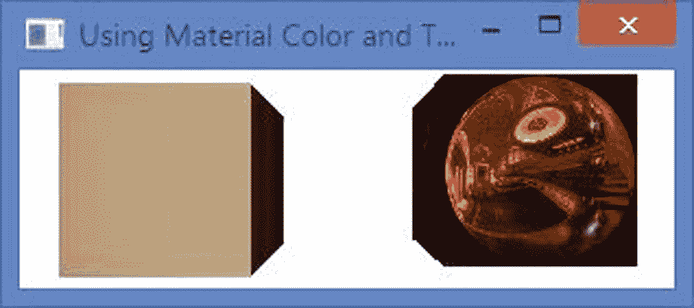
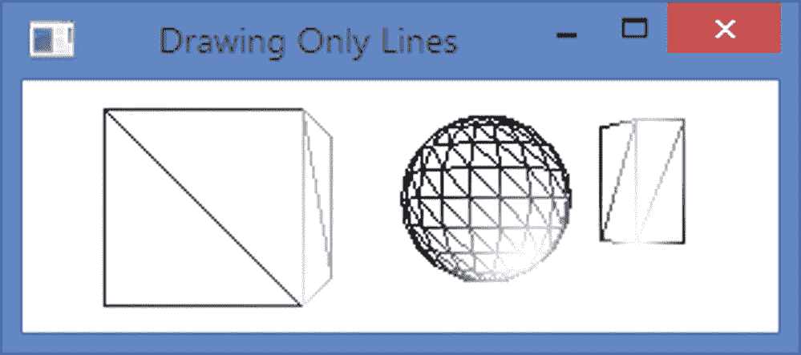
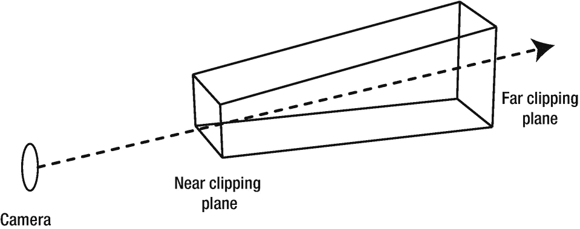
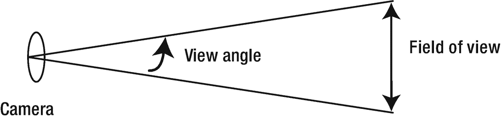
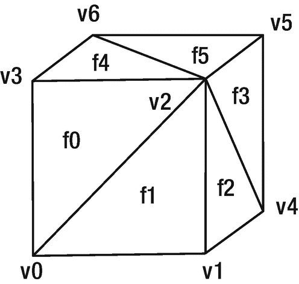
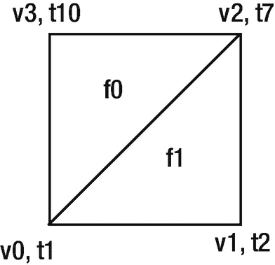
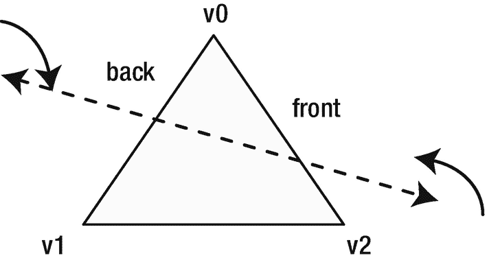
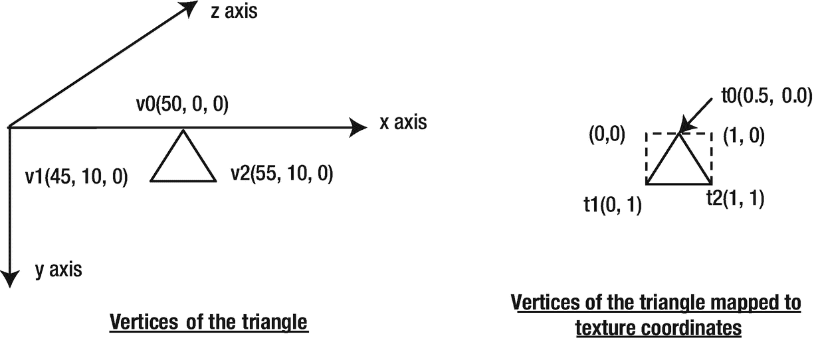
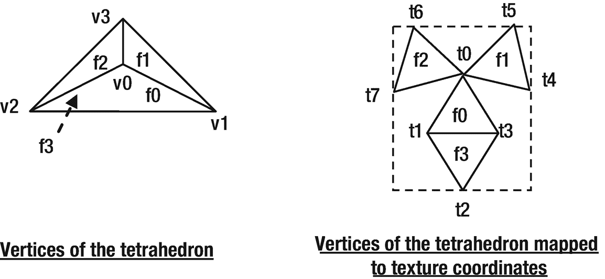
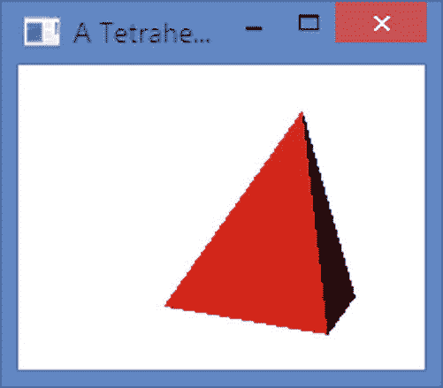

# 16.了解 3D 形状

在本章中，您将学习:

*   关于 3D 形状和 JavaFX 中表示 3D 形状的类

*   如何检查您的机器是否支持 3D

*   关于 JavaFX 中使用的 3D 坐标系

*   关于节点的渲染顺序

*   如何绘制预定义的 3D 形状

*   关于不同类型的相机以及如何使用它们渲染场景

*   如何使用光源查看场景中的 3D 对象

*   如何创建和使用子场景

*   如何在 JavaFX 中绘制用户自定义的 3D 图形

本章的例子在`com.jdojo.shape3d`包中。为了让它们工作，您必须在`module-info.java`文件中添加相应的一行:

```java
...
opens com.jdojo.shape3d to javafx.graphics, javafx.base;
...

```

## 什么是 3D 形状？

在三维空间中绘制的具有三维(长度、宽度和深度)的任何形状被称为 3D 形状。立方体、球体和金字塔都是例子。

JavaFX 提供真正的 3D 形状作为节点。它提供两种类型的 3D 形状:

*   预定义形状

*   用户定义的形状

长方体、球体和圆柱体是三种预定义的 3D 形状，您可以在 JavaFX 应用程序中轻松使用它们。您还可以使用三角形网格创建任何类型的 3D 形状。

图 [16-1](#Fig1) 显示了表示 JavaFX 3D 形状的类的类图。3D 形状类在`javafx.scene.shape`包中。`Box`、`Sphere`和`Cylinder`类代表三种预定义的形状。`MeshView`类表示场景中用户定义的 3D 形状。


图 16-1

表示 3D 形状的类的类图

JavaFX 中的 3D 可视化是使用灯光和摄像机完成的。灯光和摄像机也是节点，它们被添加到场景中。将 3D 节点添加到场景中，用灯光照亮它，然后使用相机查看它。灯光和相机在空间中的位置决定了场景中的照明和可视区域。图 [16-2](#Fig2) 显示了一个 3D 盒子，它是使用`Box`类的一个实例创建的。


图 16-2

3D 盒子形状的示例

## 检查对 3D 的支持

JavaFX 3D 支持是一个有条件的特性。如果您的平台不支持该功能，当您运行试图使用 3D 功能的程序时，控制台上会显示一条警告消息。运行清单 [16-1](#PC2) 中的程序，检查您的机器是否支持 JavaFX 3D。该程序将打印一条消息，说明 3D 支持是否可用。

```java
// Check3DSupport.java
package com.jdojo.shape3d;

import javafx.application.ConditionalFeature;
import javafx.application.Platform;

public class Check3DSupport {
    public static void main(String[] args) {
        boolean supported =
              Platform.isSupported(ConditionalFeature.SCENE3D);
        if (supported) {
            System.out.println("3D is supported on your machine.");
        } else {
            System.out.println("3D is not supported on your machine.");
        }
    }
}

Listing 16-1Checking JavaFX 3D Support on Your Machine

```

## 3D 坐标系统

3D 空间中的点由(x，y，z)坐标表示。3D 对象有三个维度:x、y 和 z。图 [16-3](#Fig3) 显示了 JavaFX 中使用的 3D 坐标系。


图 16-3

JavaFX 中使用的 3D 坐标系

x 轴的正方向从原点指向右边；y 轴的正方向指向下方；z 轴的正方向指向屏幕(远离观察者)。轴上的负方向(未示出)在原点以相反的方向延伸。

## 节点的呈现顺序

假设你在远处看两个重叠的物体。离你较近的对象总是与离你较远的对象重叠，不管它们在视图中出现的顺序如何。在 JavaFX 中处理 3D 对象时，您希望它们以同样的方式出现。

在 JavaFX 中，默认情况下，节点按照添加到场景图的顺序进行渲染。考虑以下代码片段:

```java
Rectangle r1 = new Rectangle(0, 0, 100, 100);
Rectangle r2 = new Rectangle(50, 50, 100, 100);
Group group = new Group(r1, r2);

```

两个矩形被添加到一个组中。矩形`r1`首先被渲染，随后是矩形`r2`。重叠区域将只显示`r2`的区域，不显示`r1`。如果群组被创建为`new Group(r2, r1)`，矩形`r2`将首先被渲染，随后是矩形`r1`。重叠区域将显示`r1`的区域，而不是`r2`。让我们添加两个矩形的 z 坐标，如下所示:

```java
Rectangle r1 = new Rectangle(0, 0, 100, 100);
r1.setTranslateZ(10);

Rectangle r2 = new Rectangle(50, 50, 100, 100);
r2.setTranslateZ(50);

Group group = new Group(r1, r2);

```

前面的代码片段将产生与前面相同的效果。矩形`r1`将首先被渲染，随后是矩形`r2`。矩形的`z`值被忽略。在这种情况下，您希望最后渲染矩形`r1`，因为它离查看者更近(z=10 比 z=50 更近)。

先前的渲染行为在 3D 空间中是不期望的。您希望 3D 对象的显示方式与它们在真实世界中的显示方式相同。要做到这一点，你需要做两件事。

*   当创建一个`Scene`对象时，指定它需要有一个深度缓冲。

*   在节点中指定渲染期间应使用的 z 坐标值。也就是说，需要根据它们的深度(离观察者的距离)来渲染它们。

当您创建一个`Scene`对象时，您需要指定`depthBuffer`标志，默认设置为 false:

```java
// Create a Scene object with depthBuffer set to true
double width = 300;
double height = 200;
boolean depthBuffer = true;
Scene scene = new Scene(root, width, height, depthBuffer);

```

场景创建后，不能更改场景的`depthBuffer`标志。你可以使用`Scene`对象的`isDepthBuffer()`方法来检查场景是否有`depthBuffer`。

`Node`类包含一个`depthTest`属性，可用于 JavaFX 中的所有节点。它的值是`javafx.scene.DepthTest`枚举的常量之一:

*   `ENABLE`

*   `DISABLE`

*   `INHERIT`

d `epthTest`的`ENABLE`值表示在渲染节点时应该考虑 z 坐标值。当为节点启用深度测试时，在渲染之前，它的 z 坐标会与启用深度测试的所有其他节点进行比较。

`DISABLE`值表示节点按照它们被添加到场景图的顺序被渲染。

`INHERIT`值表示节点的`depthTest`属性是从其父节点继承的。如果一个节点有一个`null`父节点，它与`ENABLE`相同。

清单 [16-2](#PC6) 中的程序演示了使用场景深度缓冲和节点深度测试的概念。它将两个矩形添加到一个组中。矩形用红色和绿色填充。红色和绿色矩形的 z 坐标分别是 400 像素和 300 像素。绿色矩形首先被添加到组中。但是，由于它离查看者更近，因此会首先被渲染。您已经向场景中添加了一个摄影机，这是查看具有深度(z 坐标)的对象所必需的。`CheckBox`用于启用和禁用矩形的深度测试。当深度测试被禁用时，矩形按照它们被添加到组中的顺序进行渲染:绿色矩形跟随红色矩形。图 [16-4](#Fig4) 显示了两种状态下的矩形。


图 16-4

depthTest 属性对渲染节点的影响

```java
// DepthTestCheck.java
package com.jdojo.shape3d;

import javafx.application.Application;
import javafx.scene.Group;
import javafx.scene.PerspectiveCamera;
import javafx.scene.Scene;
import javafx.scene.control.CheckBox;
import javafx.scene.layout.BorderPane;
import javafx.scene.paint.Color;
import javafx.scene.shape.Rectangle;
import javafx.scene.DepthTest;
import javafx.stage.Stage;

public class DepthTestCheck  extends Application {
        public static void main(String[] args) {
                Application.launch(args);
        }

        @Override
        public void start(Stage stage) {
                // Create two rectangles and add then to a Group
                Rectangle red = new Rectangle(100, 100);
                red.setFill(Color.RED);
                red.setTranslateX(100);
                red.setTranslateY(100);
                red.setTranslateZ(400);

                Rectangle green = new Rectangle(100, 100);
                green.setFill(Color.GREEN);
                green.setTranslateX(150);
                green.setTranslateY(150);
                green.setTranslateZ(300);

                Group center = new Group(green, red);

                CheckBox depthTestCbx =
                         new CheckBox("DepthTest for Rectangles");
                depthTestCbx.setSelected(true);
                depthTestCbx.selectedProperty().addListener(
                    (prop, oldValue, newValue) -> {
                        if (newValue) {
                            red.setDepthTest(DepthTest.ENABLE);
                            green.setDepthTest(DepthTest.ENABLE);
                        }
                        else {

                            red.setDepthTest(DepthTest.DISABLE);
                            green.setDepthTest(DepthTest.DISABLE);
                        }
                });

                // Create a BorderPane as the root node for the scene.
                // Need to set the background transparent, so the camera
                // can view the rectangles behind the surface of the
                // BorderPane
                BorderPane root = new BorderPane();
                root.setStyle("-fx-background-color: transparent;");
                root.setTop(depthTestCbx);
                root.setCenter(center);

                // Create a scene with depthBuffer enabled
                Scene scene = new Scene(root, 200, 200, true);

                // Need to set a camera to look into the 3D space of
                // the scene
                scene.setCamera(new PerspectiveCamera());

                stage.setScene(scene);
                stage.setTitle("Depth Test");
                stage.show();
        }
}

Listing 16-2Enabling/Disabling the DepthTest Property for Nodes

```

## 使用预定义的三维形状

JavaFX 8 提供了以下三种内置 3D 几何图形:

*   `Box`

*   `Sphere`

*   `Cylinder`

这些形状由`Box`、`Sphere`和`Cylinder`类的实例表示。这些类继承自`Shape3D`类，该类包含所有类型的 3D 形状共有的三个属性:

*   材料

*   绘图模式

*   剔除面

我将在后续章节中详细讨论这些属性。如果没有为形状指定这些属性，则会提供合理的默认值。

特定于形状类型的属性在定义该形状的特定类中定义。例如，盒子的属性是在`Box`类中定义的。所有形状都是节点。因此，您可以对它们应用变换。您可以使用`translateX`、`translateY`和`translateZ`变换将它们定位在 3D 空间中的任意点。

Tip

3D 形状的中心位于该形状的局部坐标系的原点。

一个`Box`由以下三个属性定义:

*   `width`

*   `height`

*   `depth`

`Box`类包含两个构造函数:

*   `Box()`

*   `Box(double width, double height, double depth)`

无参数构造函数创建一个宽度、高度和深度均为 2.0 的`Box`。另一个构造函数让您指定`Box`的尺寸。`Box`的中心位于其本地坐标系的原点；

```java
// Create a Box with width=10, height=20, and depth=50
Box box = new Box(10, 20, 50);

```

一个`Sphere`仅由一个名为`radius`的属性定义。`Sphere`类包含三个构造函数:

*   `Sphere()`

*   `Sphere(double radius)`

*   `Sphere(double radius, int divisions)`

无参数构造函数创建一个半径为 1.0 的球体。

第二个构造函数让您指定球体的`radius`。

第三个构造函数让您指定`radius`和`divisions`。3D 球体由许多分割部分组成，这些分割部分由相连的三角形构成。划分数量的值定义了球体的分辨率。分割数越高，球体看起来越平滑。默认情况下，`divisions`的值为 64。`divisions`的值不能小于 1。

```java
// Create a Sphere with radius =50
Sphere sphere = new Sphere(50);

```

一个`Cylinder`由两个属性定义:

*   `radius`

*   `height`

气缸的`radius`在 XZ 平面上测量。圆柱体的轴沿 y 轴测量。气缸的`height`沿其轴线测量。`Cylinder`类包含三个构造函数:

*   `Cylinder()`

*   `Cylinder(double radius, double height)`

*   `Cylinder(double radius, double height, int divisions)`

无参数构造函数创建一个带有 1.0 `radius`和 2.0 `height`的`Cylinder`。

第二个构造函数让您指定`radius`和`height`属性。

第三个构造函数让您指定`divisions`的编号，它定义圆柱体的分辨率。分段数越高，圆柱体看起来越平滑。它的缺省值是沿 x 轴和 z 轴各 64(文档指定此处为 15，这是错误的)。其值不能小于 3。如果指定的值小于 3，则使用值 3。请注意，分段数不适用于 y 轴。假设除法的个数是 10。这意味着圆柱体的垂直表面是用 10 个三角形创建的。三角形的高度将延伸到圆柱体的整个高度。圆柱体的底部也将使用 10 个三角形来创建。

```java
// Create a cylinder with radius=40 and height=120
Cylinder cylinder = new Cylinder(40, 120);

```

清单 [16-3](#PC10) 中的程序展示了如何创建 3D 形状。图 [16-5](#Fig5) 显示了形状。


图 16-5

基本 3D 形状:长方体、球体和圆柱体

```java
// PreDefinedShapes.java
package com.jdojo.shape3d;

import javafx.application.Application;
import javafx.scene.Group;
import javafx.scene.PerspectiveCamera;
import javafx.scene.PointLight;
import javafx.scene.Scene;
import javafx.scene.shape.Box;
import javafx.scene.shape.Cylinder;
import javafx.scene.shape.Sphere;
import javafx.stage.Stage;

public class PreDefinedShapes extends Application {
        public static void main(String[] args) {
                Application.launch(args);
        }

        @Override

        public void start(Stage stage) {
                // Create a Box
                Box box = new Box(100, 100, 100);
                box.setTranslateX(150);
                box.setTranslateY(0);
                box.setTranslateZ(400);

                // Create a Sphere

                Sphere sphere = new Sphere(50);
                sphere.setTranslateX(300);
                sphere.setTranslateY(-5);
                sphere.setTranslateZ(400);

                // Create a cylinder
                Cylinder cylinder = new Cylinder(40, 120);
                cylinder.setTranslateX(500);
                cylinder.setTranslateY(-25);
                cylinder.setTranslateZ(600);

                // Create a light
                PointLight light = new PointLight();
                light.setTranslateX(350);
                light.setTranslateY(100);
                light.setTranslateZ(300);

                // Add shapes and a light to the group
                Group root = new Group(box, sphere, cylinder, light);

                // Create a Scene with depth buffer enabled
                Scene scene = new Scene(root, 300, 100, true);

                // Set a camera to view the 3D shapes
                PerspectiveCamera camera = new PerspectiveCamera(false);
                camera.setTranslateX(100);
                camera.setTranslateY(-50);
                camera.setTranslateZ(300);
                scene.setCamera(camera);

                stage.setScene(scene);
                stage.setTitle(
                         "Using 3D Shapes: Box, Sphere and Cylinder");
                stage.show();
        }
}

Listing 16-3Creating 3D Primitive Shapes: Box, Sphere, and Cylinder

```

该程序创建了三个形状，并将它们放置在空间中。它创建一个灯光，它是`PointLight`的一个实例，并将其放置在空间中。注意，一盏灯也是一个`Node`。灯光用于照亮 3D 形状。所有形状和灯光被添加到一个组中，该组被添加到场景中。

要查看形状，需要在场景中添加一个摄像机。程序给场景添加了一个`PerspectiveCamera`。请注意，您需要定位相机，因为它在空间中的位置和方向决定了您所看到的内容。相机的局部坐标系的原点位于场景的中心。运行程序后，尝试调整窗口大小。您会注意到，当您调整窗口大小时，形状的视图会发生变化。发生这种情况是因为当您调整窗口大小时，场景的中心发生了变化，从而重新定位了相机，导致视图发生变化。

### 指定形状材料

材质用于渲染形状的表面。您可以使用在`Shape3D`类中定义的`material`属性指定 3D 对象表面的材质。material 属性是抽象类`Material`的一个实例。JavaFX 提供了`PhongMaterial`类作为`Material`的唯一具体实现。这两个类都在`javafx.scene.paint`包中。l 类的一个实例代表 Phong 着色材质。Phong shaded material 基于 Phong shading 和 Phong reflection model(也称为 Phong illumination 和 Phong lighting ),这是裴祥风在 1973 年的博士论文中在犹他大学开发的。对 Phong 模型的完整讨论超出了本书的范围。该模型提供了一个经验公式，根据`PhongMaterial`类中定义的以下属性来计算几何表面上像素的颜色:

*   `diffuseColor`

*   `diffuseMap`

*   `specularColor`

*   `specularMap`

*   `selfIlluminationMap`

*   `specularPower`

*   `bumpMap`

`PhongMaterial`类包含三个构造函数:

*   `PhongMaterial()`

*   `PhongMaterial(Color diffuseColor)`

*   `PhongMaterial(Color diffuseColor, Image diffuseMap, Image specularMap, Image bumpMap, Image selfIlluminationMap)`

无参数构造函数创建一个漫射颜色为`Color.WHITE`的`PhongMaterial`。另外两个构造函数用于创建一个具有指定属性的`PhongMaterial`。

当您没有为 3D 形状提供材质时，将使用漫射颜色为`Color.LIGHTGRAY`的默认材质来渲染形状。清单 [16-3](#PC10) 中的所有形状都使用默认材质。

下面的代码片段创建了一个`Box`，创建了一个带有褐色漫射颜色的`PhongMaterial`，并将材质设置为长方体:

```java
Box box = new Box(100, 100, 100);
PhongMaterial material = new PhongMaterial();
material.setDiffuseColor(Color.TAN);
box.setMaterial(material);

```

你可以使用一个`Image`作为漫反射贴图来获得材质的纹理，如下面的代码所示:

```java
Box boxWithTexture = new Box(100, 100, 100);
PhongMaterial textureMaterial = new PhongMaterial();
Image randomness = new Image("resources/picture/randomness.jpg");
textureMaterial.setDiffuseMap(randomness);
boxWithTexture.setMaterial(textureMaterial);

```

清单 [16-4](#PC13) 中的程序显示了如何创建和设置形状的材质。它创建了两个盒子。它为一个框设置漫射颜色，为另一个框设置漫射贴图。用于漫反射贴图的图像为第二个长方体的表面提供了纹理。这两个盒子的外观如图 [16-6](#Fig6) 所示。



图 16-6

两个盒子:一个有褐色的漫射颜色，一个有使用漫射贴图的纹理

```java
// MaterialTest.java
package com.jdojo.shape3d;

import com.jdojo.util.ResourceUtil;

import javafx.application.Application;
import javafx.scene.Group;
import javafx.scene.PerspectiveCamera;
import javafx.scene.PointLight;
import javafx.scene.Scene;
import javafx.scene.image.Image;
import javafx.scene.paint.Color;
import javafx.scene.paint.PhongMaterial;
import javafx.scene.shape.Box;
import javafx.stage.Stage;

public class MaterialTest extends Application {
        public static void main(String[] args) {
                Application.launch(args);
        }

        @Override
        public void start(Stage stage) {
                // Create a Box
                Box box = new Box(100, 100, 100);

                // Set the material for the box
                PhongMaterial material = new PhongMaterial();
                material.setDiffuseColor(Color.TAN);
                box.setMaterial(material);

                // Place the box in the space
                box.setTranslateX(250);
                box.setTranslateY(0);
                box.setTranslateZ(400);

                // Create a Box with texture
                Box boxWithTexture = new Box(100, 100, 100);
                PhongMaterial textureMaterial = new PhongMaterial();
                     Image randomness =
                         new Image(ResourceUtil.getResourceURLStr(
                             "picture/randomness.jpg"));
                textureMaterial.setDiffuseMap(randomness);
                boxWithTexture.setMaterial(textureMaterial);

                // Place the box in the space
                boxWithTexture.setTranslateX(450);
                boxWithTexture.setTranslateY(-5);
                boxWithTexture.setTranslateZ(400);

                PointLight light = new PointLight();
                light.setTranslateX(250);
                light.setTranslateY(100);
                light.setTranslateZ(300);

                Group root = new Group(box, boxWithTexture);

                // Create a Scene with depth buffer enabled
                Scene scene = new Scene(root, 300, 100, true);

                // Set a camera to view the 3D shapes
                PerspectiveCamera camera = new PerspectiveCamera(false);
                camera.setTranslateX(200);
                camera.setTranslateY(-50);
                camera.setTranslateZ(325);
                scene.setCamera(camera);

                stage.setScene(scene);
                stage.setTitle(

                         "Using Material Color and Texture for 3D Surface");
                stage.show();
        }
}

Listing 16-4Using the Diffuse Color and Diffuse Map to Create PhongMaterial

```

### 指定形状的绘制模式

3D 形状表面由许多由三角形组成的相连多边形组成。例如，`Box`由 12 个三角形组成——`Box`的每一边使用两个三角形。`Shape3D`类中的`drawMode`属性指定如何渲染 3D 形状的表面。它的值是`DrawMode`枚举的常量之一:

*   `DrawMode.FILL`

*   `DrawMode.LINE`

`DrawMode.FILL`是默认值，它填充三角形的内部。`DrawMode.LINE`只画三角形的轮廓。也就是说，它只绘制连接连续三角形顶点的线。

```java
// Create a Box with outline only
Box box = new Box(100, 100, 100);
box.setDrawMode(DrawMode.LINE);

```

清单 [16-5](#PC15) 中的程序显示了如何只绘制 3D 形状的轮廓。图 [16-7](#Fig7) 显示了形状。该程序类似于清单 [16-3](#PC10) 中所示的程序。程序将所有形状的`drawMode`属性设置为`DrawMode.LINE`。程序规定了创建`Sphere`和`Cylinder`的分工。将“分割”的值更改为较小的值。您会注意到，用于创建形状的三角形数量减少，使形状变得不太平滑。



图 16-7

绘制 3D 形状的轮廓

```java
// DrawModeTest.java
package com.jdojo.shape3d;

import javafx.application.Application;
import javafx.scene.Group;
import javafx.scene.PerspectiveCamera;
import javafx.scene.PointLight;
import javafx.scene.Scene;
import javafx.scene.shape.Box;
import javafx.scene.shape.Cylinder;
import javafx.scene.shape.DrawMode;
import javafx.scene.shape.Sphere;
import javafx.stage.Stage;

public class DrawModeTest extends Application {
        public static void main(String[] args) {
                Application.launch(args);
        }

        @Override
        public void start(Stage stage) {
                // Create a Box
                Box box = new Box(100, 100, 100);
                box.setDrawMode(DrawMode.LINE);
                box.setTranslateX(150);
                box.setTranslateY(0);
                box.setTranslateZ(400);

                // Create a Sphere: radius = 50, divisions=20
                Sphere sphere = new Sphere(50, 20);
                sphere.setDrawMode(DrawMode.LINE);
                sphere.setTranslateX(300);
                sphere.setTranslateY(-5);
                sphere.setTranslateZ(400);

                // Create a cylinder: radius=40, height=120, divisions=5
                Cylinder cylinder = new Cylinder(40, 120, 5);
                cylinder.setDrawMode(DrawMode.LINE);
                cylinder.setTranslateX(500);
                cylinder.setTranslateY(-25);
                cylinder.setTranslateZ(600);

                PointLight light = new PointLight();
                light.setTranslateX(350);
                light.setTranslateY(100);
                light.setTranslateZ(300);

                Group root = new Group(box, sphere, cylinder, light);

                // Create a Scene with depth buffer enabled
                Scene scene = new Scene(root, 300, 100, true);

                // Set a camera to view the 3D shapes
                PerspectiveCamera camera = new PerspectiveCamera(false);
                camera.setTranslateX(100);
                camera.setTranslateY(-50);
                camera.setTranslateZ(300);
                scene.setCamera(camera);

                stage.setScene(scene);
                stage.setTitle("Drawing Only Lines");
                stage.show();
        }
}

Listing 16-5Drawing Only Lines for 3D Shapes

```

### 指定形状的面剔除

3D 对象永远不会完全可见。例如，你不可能一次看到整栋建筑。当你改变视角时，你会看到建筑的不同部分。如果你面向建筑物的正面，你只能看到建筑物的正面。站在前面，如果你向右移动，你会看到建筑物的正面和右边。

3D 对象的表面由相连的三角形组成。每个三角形都有两个面:外部面和内部面。当您查看 3D 对象时，您会看到三角形的外表面。不是所有的三角形都是可见的。三角形是否可见取决于相机的位置。有一个简单的规则来确定组成 3D 对象表面的三角形的可见性。画一条从三角形的平面出来的线，这条线垂直于三角形的平面。从第一条线与三角形平面的交点向观察者再画一条线。如果两条线之间的角度大于 90 度，则视图看不到三角形的面。否则，观察者可以看到三角形的面。请注意，三角形的两面不是同时可见的。

面剔除是一种渲染 3D 几何图形的技术，其原理是对象的不可见部分不应被渲染。例如，如果您从正面面对一座建筑，则不需要渲染建筑的侧面、顶部和底部，因为您看不到它们。

Tip

在 3D 渲染中使用面剔除来提高性能。

`Shape3D`类包含一个`cullFace`属性，该属性指定在呈现形状时应用的剔除类型。它的值是`CullFace`枚举的常量之一:

*   `BACK`

*   `FRONT`

*   `NONE`

`CullFace.BACK`指定在当前位置不能通过摄像机看到的所有三角形都应该被剔除(即不渲染)。也就是说，应该剔除所有外部面不面向相机的三角形。如果你正对着建筑物的正面，这个设置将只渲染建筑物的正面。这是默认设置。

`CullFace.FRONT`指定所有外部面向摄像机的三角形都应该被剔除。如果你面对建筑物的正面，这个设置将渲染建筑物的所有部分，除了正面部分。

`CullFace.NONE`指定不应该应用面剔除。也就是说，组成形状的所有三角形都应该被渲染:

```java
// Create a Box with no face culling
Box box = new Box(100, 100, 100);
Box.setCullFace(CullFace.NONE);

```

当您使用`drawMode`作为`DrawMode.LINE`来绘制形状时，很容易看到面剔除的效果。我将只画非空三角形。图 [16-8](#Fig8) 显示了相同的`Box`使用三种不同的面剔除。第一个`Box`(左起)使用背面剔除，第二个正面剔除，第三个不使用剔除。请注意，`Box`的第一张图片显示了正面、正面和顶面，而这些面在第二张`Box`中被剔除。在第二张图片中，你可以看到背面、左面和底面。请注意，当您使用正面剔除时，您会看到三角形的内部面，因为外部面在视图中是隐藏的。


图 16-8

使用不同 cullFace 属性的框

## 使用相机

摄像机用于渲染场景。有两种类型的摄像机可用:

*   透视照相机

*   平行照相机

摄像机的名称暗示了它们用于渲染场景的投影类型。JavaFX 中的摄像机是节点。可以将它们添加到场景图中，并像其他节点一样定位。

抽象基类`Camera`代表一个相机。`Camera`类有两个具体的子类:`PerspectiveCamera`和`ParallelCamera`。这三个职业都在`javafx.scene`计划中。

A `PerspectiveCamera`定义了透视投影的观察体积，它是一个截顶的正棱锥，如图 [16-9](#Fig9) 所示。相机将包含在近剪裁平面和远剪裁平面内的对象投影到投影平面上。因此，剪裁平面外的任何对象都不可见。



图 16-9

由近剪裁平面和远剪裁平面定义的透视相机的观察体积

摄像机将投影到投影平面上的内容由`Camera`类中的两个属性定义:

*   `nearClip`

*   `farClip`

`nearClip`是摄像机和最近的裁剪平面之间的距离。比`nearClip`更靠近摄像机的物体不会被渲染。`The default value is 0.1`。

`farClip`是摄像机和远裁剪平面之间的距离。比`farClip`距离摄像机更远的物体不会被渲染。默认值为 100。

`PerspectiveCamera`类包含两个构造函数:

*   `PerspectiveCamera()`

*   `PerspectiveCamera(boolean fixedEyeAtCameraZero)`

无参数构造函数创建一个`PerspectiveCamera`并将`fixedEyeAtCameraZero`标志设置为 false，这使它的行为或多或少像一个平行相机，其中当场景调整大小时，场景中 Z=0 处的对象保持相同的大小。第二个构造函数让您指定这个标志。如果您想要查看具有真实 3D 效果的 3D 对象，您需要将此标志设置为 true。将此标志设置为 true 将在调整场景大小时调整 3D 对象的投影图像的大小。缩小场景也会使物体看起来更小。

```java
// Create a perspective camera for viewing 3D objects
PerspectiveCamera camera = new PerspectiveCamera(true);

```

`PerspectiveCamera`类声明了两个附加属性:

*   `fieldOfView`

*   `verticalFieldOfView`

`fieldOfView`以度为单位，是相机的视角。其默认值为 30 度。

`verticalFieldOfView`属性指定`fieldOfView`属性是否适用于投影平面的垂直尺寸。默认情况下，其值为 true。图 [16-10](#Fig10) 描述了摄像机及其视角和视野。



图 16-10

透视相机的视角和视野

`ParallelCamera`的一个实例指定了平行投影的观察体积，它是一个矩形框。`ParallelCamera`类没有声明任何额外的属性。它包含一个无参数构造函数:

```java
ParallelCamera camera = new ParallelCamera();

```

您可以使用`Scene`类的`setCamera()`方法为场景设置摄像机:

```java
Scene scene = create a scene....
PerspectiveCamera camera = new PerspectiveCamera(true);
scene.setCamera(camera);

```

因为摄影机是一个节点，所以可以将其添加到场景图形中:

```java
PerspectiveCamera camera = new PerspectiveCamera(true);
Group group = new Group(camera);

```

在移动和旋转节点时，可以移动和旋转摄影机。要将其移动到不同的位置，请使用`translateX`、`translateY`和`translateZ`属性。要旋转，请使用`Rotate`变换。

清单 [16-6](#PC21) 中的程序使用一个`PerspectiveCamera`来查看一个`Box`。您已经使用了两个灯光:一个照亮盒子的正面和顶面，另一个照亮盒子的底面。通过沿 x 轴无限旋转相机来激活相机。随着摄像机的旋转，它将盒子的不同部分带入视野。当盒子底部进入视野时，您可以看到两盏灯的效果。底部显示为绿色，而顶部和前面显示为红色。

```java
// CameraTest.java
package com.jdojo.shape3d;

import javafx.animation.Animation;
import javafx.animation.RotateTransition;
import javafx.application.Application;
import javafx.scene.Group;
import javafx.scene.PerspectiveCamera;
import javafx.scene.PointLight;
import javafx.scene.Scene;
import javafx.scene.paint.Color;
import javafx.scene.shape.Box;
import javafx.scene.shape.CullFace;
import javafx.scene.transform.Rotate;
import javafx.stage.Stage;
import javafx.util.Duration;

public class CameraTest extends Application {
        public static void main(String[] args) {
                Application.launch(args);
        }

        @Override
        public void start(Stage stage) {
                Box box = new Box(100, 100, 100);
                box.setCullFace(CullFace.NONE);
                box.setTranslateX(250);
                box.setTranslateY(100);
                box.setTranslateZ(400);

                PerspectiveCamera camera = new PerspectiveCamera(false);
                camera.setTranslateX(100);
                camera.setTranslateY(-50);
                camera.setTranslateZ(300);

                // Add a Rotation animation to the camera
                RotateTransition rt =
                         new RotateTransition(Duration.seconds(2), camera);
                rt.setCycleCount(Animation.INDEFINITE);
                rt.setFromAngle(0);
                rt.setToAngle(90);
                rt.setAutoReverse(true);
                rt.setAxis(Rotate.X_AXIS);
                rt.play();

                PointLight redLight = new PointLight();
                redLight.setColor(Color.RED);
                redLight.setTranslateX(250);
                redLight.setTranslateY(-100);
                redLight.setTranslateZ(250);

                PointLight greenLight = new PointLight();
                greenLight.setColor(Color.GREEN);
                greenLight.setTranslateX(250);
                greenLight.setTranslateY(300);
                greenLight.setTranslateZ(300);

                Group root = new Group(box, redLight, greenLight);
                root.setRotationAxis(Rotate.X_AXIS);
                root.setRotate(30);

                Scene scene = new Scene(root, 500, 300, true);
                scene.setCamera(camera);
                stage.setScene(scene);
                stage.setTitle("Using camaras");
                stage.show();
        }

}

Listing 16-6Using a PerspectiveCamera As a Node

```

## 使用光源

与真实世界类似，您需要一个光源来查看场景中的 3D 对象。抽象基类`LightBase`的一个实例代表一个光源。它的两个具体子类，`AmbientLight`和`PointLight`，代表环境光和点光。光源类别在`javafx.scene`包中。`LightBase`类继承自`Node`类。因此，光源是一个节点，它可以像任何其他节点一样添加到场景图形中。

光源有三个属性:灯光颜色、开/关开关和受影响的节点列表。`LightBase`类基本上包含以下两个属性:

*   `color`

*   `lightOn`

`color`指定光线的颜色。`lightOn`指定灯是否打开。`LightBase`类的`getScope()`方法返回一个`ObservableList<Node>`，它是受这个光源影响的节点的层次列表。如果列表为空，则光源的范围是 universe，这意味着它影响场景中的所有节点。然而，后者不影响属于排除范围的节点；有关详细信息，请参见 API 文档。

`AmbientLight`类的一个实例代表一个环境光源。环境光是一种似乎来自所有方向的无方向性光。其强度在受影响形状的表面上是恒定的。

```java
// Create a red ambient light
AmbientLight redLight = new AmbientLight(Color.RED);

```

类的一个实例代表一个点光源。点光源是空间中的固定点，向所有方向均匀辐射光线。点光源的强度随着照明点离光源的距离增加而降低。

```java
// Create a Add the point light to a group
PointLight redLight = new PointLight(Color.RED);
redLight.setTranslateX(250);
redLight.setTranslateY(-100);
redLight.setTranslateZ(290);
Group group = new Group(node1, node2, redLight);

```

## 创建子场景

一个场景只能使用一个摄像机。有时，您可能想要使用多个相机查看场景的不同部分。JavaFX 引入了子场景的概念。子场景是场景图的容器。它可以有自己的宽度、高度、填充颜色、深度缓冲、抗锯齿标志和相机。`SubScene`类的一个实例代表一个子场景。`SubScene`继承自`Node`类。因此，只要可以使用节点，就可以使用子场景。子场景可用于分隔应用程序中的 2D 和 3D 节点。您可以在子场景中使用摄像机来查看 3D 对象，这些对象不会影响主场景其他部分的 2D 节点。下面的代码片段创建了一个`SubScene`，并为其设置了一个摄像机:

```java
SubScene ss = new SubScene(root, 200, 200, true, SceneAntialiasing.BALANCED);
PerspectiveCamera camera = new PerspectiveCamera(false);
ss.setCamera(camera);

```

Tip

如果`SubScene`包含具有灯光节点的`Shape3D`节点，则提供具有带`Color.WHITE`光源的`PointLight`的前照灯。前照灯位于摄像机位置。

清单 [16-7](#PC25) 中的程序展示了如何使用子场景。`getSubScene()`方法创建一个带有`Box`、`PerspectiveCamera`和`PointLight`的`SubScene`。动画设置为沿指定轴旋转相机。`start()`方法创建两个子场景并将它们添加到一个`HBox`中。一个子场景沿 y 轴摆动相机，另一个子场景沿 x 轴摆动相机。`HBox`被添加到主场景中。

```java
// SubSceneTest.java
package com.jdojo.shape3d;

import javafx.animation.Animation;
import javafx.animation.RotateTransition;
import javafx.application.Application;
import javafx.geometry.Point3D;
import javafx.scene.Group;
import javafx.scene.PerspectiveCamera;
import javafx.scene.PointLight;
import javafx.scene.Scene;
import javafx.scene.SceneAntialiasing;
import javafx.scene.SubScene;
import javafx.scene.layout.HBox;
import javafx.scene.paint.Color;
import javafx.scene.shape.Box;
import javafx.scene.shape.CullFace;
import javafx.scene.transform.Rotate;
import javafx.stage.Stage;
import javafx.util.Duration;

public class SubSceneTest extends Application {
        public static void main(String[] args) {
                Application.launch(args);
        }

        @Override
        public void start(Stage stage) {
                SubScene ySwing = getSubScene(Rotate.Y_AXIS);
                SubScene xSwing = getSubScene(Rotate.X_AXIS);
                HBox root = new HBox(20, ySwing, xSwing);
                Scene scene = new Scene(root, 500, 300, true);
                stage.setScene(scene);
                stage.setTitle("Using Sub-Scenes");
                stage.show();
        }

        private SubScene getSubScene(Point3D rotationAxis) {
                Box box = new Box(100, 100, 100);
                box.setCullFace(CullFace.NONE);
                box.setTranslateX(250);
                box.setTranslateY(100);
                box.setTranslateZ(400);

                PerspectiveCamera camera = new PerspectiveCamera(false);
                camera.setTranslateX(100);
                camera.setTranslateY(-50);
                camera.setTranslateZ(300);

                // Add a Rotation animation to the camera
                RotateTransition rt =
                         new RotateTransition(Duration.seconds(2), camera);
                rt.setCycleCount(Animation.INDEFINITE);
                rt.setFromAngle(-10);
                rt.setToAngle(10);
                rt.setAutoReverse(true);
                rt.setAxis(rotationAxis);
                rt.play();

                PointLight redLight = new PointLight(Color.RED);
                redLight.setTranslateX(250);
                redLight.setTranslateY(-100);
                redLight.setTranslateZ(290);

                // If you remove the redLight from the following group,
                // a default head light will be provided by the SubScene

.
                Group root = new Group(box, redLight);
                root.setRotationAxis(Rotate.X_AXIS);
                root.setRotate(30);

                SubScene ss =
                          new SubScene(root, 200, 200, true,
                                       SceneAntialiasing.BALANCED);
                ss.setCamera(camera);
                return ss;
        }
}

Listing 16-7Using Subscenes

```

## 创建用户定义的形状

JavaFX 允许您使用多边形网格定义 3D 形状。抽象类`Mesh`的一个实例表示网格数据。`TriangleMesh`类是`Mesh`类的一个具体子类。`TriangleMesh`表示由三角形网格组成的 3D 表面。

Tip

在 3D 建模中，不同类型多边形的网格可用于构建 3D 对象。JavaFX 仅支持三角形网格。

`MeshView`类的一个实例代表一个 3D 表面。用于构造`MeshView`的数据被指定为`Mesh`的实例。

手动提供网格数据不是一件容易的事情。这个问题因为你需要指定数据的方式而变得复杂。我将通过从一个非常简单的用例到一个更复杂的用例来演示网格的使用，使它变得更简单。

一个`TriangleMesh`需要为一个 3D 对象的三个方面提供数据:

*   点

*   纹理坐标

*   表面

Note

如果您以前没有使用三角形网格处理过 3D 对象，解释可能会有点复杂。您需要耐心，一步一步地学习，以理解使用三角形网格创建 3D 对象的过程。

点是网格中三角形的顶点。您需要指定数组中顶点的(x，y，z)坐标。假设 v0、v1、v2、v3、v4 等是 3D 空间中表示网格中三角形顶点的点。一个`TriangleMesh`中的点被指定为一个`floats`的数组。

3D 表面的纹理被提供为作为 2D 对象的图像。纹理坐标是 2D 平面中的点，它们被映射到三角形的顶点。你需要把一个展开的网格中的三角形放到一个 2D 平面上。将为 3D 形状提供表面纹理的图像叠加到同一 2D 平面上。将三角形的顶点映射到图像的 2D 坐标，以获得网格中每个顶点的一对(u，v)坐标。这种(u，v)坐标的数组就是纹理坐标。假设 t0、t1、t2、t3、t4 等等是纹理坐标。

面是通过连接三角形的三条边创建的平面。每个三角形有两个面:一个正面和一个背面。根据`points`和`texture coordinates`数组中的索引指定一个面。一个面被指定为 v0，t0，v1，t1，v2，t2 等等，其中 v1 是顶点在`points`数组中的索引，t1 是顶点在`texture coordinates`数组中的索引。

考虑图 [16-11](#Fig11) 中所示的盒子。



图 16-11

由 12 个三角形组成的盒子

一个盒子由六个面组成。每条边都是长方形。每个矩形由两个三角形组成。每个三角形有两个面:一个正面和一个背面。一个盒子有八个顶点。在图中，您将顶点命名为 v0、v1、v2 等，将面命名为 f0、f1、f2 等。您看不到在长方体的当前方向上不可见的顶点和面的编号。每个顶点由三元组(x，y，z)定义，三元组是顶点在 3D 空间中的坐标。当您使用术语*顶点 v1* 时，从技术上讲，您指的是顶点的坐标(x1，y1，z1)。

要创建三角形网格，您需要指定组成 3D 对象的所有顶点。对于长方体，需要指定八个顶点。在`TriangleMesh`类中，顶点被称为`points`，它们被指定为`float`的可观察数组。下面的伪代码创建顶点数组。第一个数组只是为了便于理解。实际数组指定顶点的坐标:

```java
// For understanding purpose only
float[] points = {
    v0,
    v1,
   v2,
   ...
   v7};

// The actual array contain (x, y, z) coordinates of all vertices
float[] points = {
    x0, y0, z0, // v0
   x1, y1, z1, // v1
   x2, y2, z2, // v2
   ...
   x7, y7, z7  // v7
};

```

在`points`数组中，索引 0 到 2 包含第一个顶点的坐标，索引 3 到 5 包含第二个顶点的坐标，依此类推。你如何给顶点编号？即哪个顶点是#1，哪个是#2，以此类推？没有指定顶点顺序的规则。如何给它们编号完全取决于你。JavaFX 只关心一件事:您必须在`points`数组中包含组成形状的所有顶点。您已经完成了生成`points`数组的工作。你以后会用到它。

现在，您需要创建一个包含 2D 点坐标的数组。创建这个数组有点棘手。初学者很难理解这一点。考虑图 [16-12](#Fig12) 中所示的图形。


图 16-12

映射到 2D 平面上的盒子的曲面

图 [16-11](#Fig11) 和 [16-12](#Fig12) 是同一箱体表面的两个视图。图 [16-12](#Fig12) 将表面从三维空间映射到 2D 平面。把这个盒子想象成一个由 12 张三角形纸片组成的 3D 物体。图 [16-11](#Fig11) 显示了这 12 张纸放在一起形成一个 3D 盒子，而图 [16-12](#Fig12) 显示了同样的纸并排放在地板上(一个 2D 平面)。

Tip

由您决定如何将 3D 对象的表面映射到 2D 平面。例如，在图 [16-12](#Fig12) 中，你也可以将盒子的底边映射到单位正方形的下方、左侧或上方。

想一个你想用作盒子纹理的图像。图像将没有第三维(z 维)。图像需要应用在盒子的表面。JavaFX 需要知道盒子上的顶点如何映射到图像上的点。您可以通过将长方体顶点映射到图像上的点来提供此信息。

现在，想象一个代表纹理图像的单位正方形(1 x 1 正方形)。将单位正方形覆盖在盒子的展开面上。单位正方形如图 [16-12](#Fig12) 中虚线轮廓所示。正方形的左上角有坐标(0，0)；左下角有坐标(0，1)；右上角有坐标(1，0)；右下角的坐标是(1，1)。

在图 [16-12](#Fig12) 中，当你打开盒子的表面把它放到一个 2D 平面上时，一些顶点必须被分割成多个顶点。这个盒子有八个顶点。映射到 2D 平面的盒子有 14 个顶点。该图示出了一些顶点，这些顶点具有与 3D 框中表示相同顶点的那些顶点相同的数目。映射到 2D 平面的每个顶点(在图 [16-12](#Fig12) 中)成为`texture coordinates`数组中的一个元素。图 [16-13](#Fig13) 显示了这 14 个纹理点；它们被编号为 t0、t1、t2 等等。你可以按照任何顺序在 2D 平面上给长方体的顶点编号。纹理点的 x 和 y 坐标将在 0 和 1 之间。这些坐标到实际图像大小的实际映射由 JavaFX 执行。比如，(0.25，0。)可用于顶点 t9 的坐标，而(0.25，0.25)可用于顶点 t10 的坐标。


图 16-13

用纹理坐标映射到 2D 平面上的盒子表面

您可以创建如以下代码所示的`texture coordinates`数组。和`points`数组一样，下面是伪代码。第一个数组用于理解概念，第二个数组是代码中实际使用的数组:

```java
// For understanding purpose-only
float[] texCoords = {
    t0,
   t1,
   t2,
   ...
   t14};

// The actual texture coordinates of vertices
float[] texCoords = {
    x0, y0, // t0
   x1, y1, // t1
   x2, y2, // t2
   ...
   x13, y13 // t13
};

```

您需要指定的第三条信息是一组面孔。注意，每个三角形都有两个面。在我们的图中，你只显示了三角形的正面。指定面是创建一个`TriangleMesh`对象中最令人困惑的步骤。使用`points`数组和`texture coordinates`数组指定一个面。使用`point`数组中顶点的索引和`texture coordinates`数组中纹理点的索引来指定一个面。使用以下格式的六个整数指定一个面:

```java
iv0, it0, iv1, it1, iv2, it2

```

这里

*   `iv0`是`points`数组中顶点`v0`的索引，`it0`是`texture coordinates`数组中点`t0`的索引。

*   `iv1`和`it1`是`points`和`texture coordinates`数组中顶点`v1`和点`t1`的索引。

*   `iv2`和`it2`是`points`和`texture coordinates`数组中顶点`v2`和点`t2`的索引。

图 [16-14](#Fig14) 只显示了两个三角形，它们构成了盒子的正面。



图 16-14

盒子的两个三角形，它们的顶点在点和纹理坐标数组中

图 [16-14](#Fig14) 是图 [16-12](#Fig12) 和 [16-13](#Fig13) 中所示数字的叠加。图中显示了顶点编号及其对应的纹理坐标点数。要指定`faces`数组中的 f0，可以用两种方式指定三角形的顶点，逆时针和顺时针:

```java
ivo, it1, iv2, it7, iv3, it10 (Counterclockwise)
ivo, it1, iv3, it10, iv2, it7 (Clockwise)

```

在指定面时，起始顶点并不重要。你可以从任何顶点开始，顺时针或逆时针方向。当一个面的顶点按逆时针方向指定时，它被认为是正面。否则被认为是背面。以下一系列数字将指定我们图中的面`f1`:

```java
ivo, it1, iv1, it2, iv2, it7 (Counterclockwise: front-face)
ivo, it1, iv2, it7, iv1, it2 (Clockwise: back-face)

```

为了确定您是指定正面还是背面，应用以下规则，如图 [16-15](#Fig15) 所示:



图 16-15

三角形顶点的缠绕顺序

*   画一条垂直于三角形表面向外延伸的线。

*   想象一下，你正沿着这条线看着表面。

*   尝试逆时针遍历顶点。顶点序列会给你一个正面。如果你顺时针遍历顶点，序列会给你一个背面。

下面的伪代码演示了如何创建一个用于指定面的`int`数组。`int`值是来自`points`和`texture coordinates`数组的数组索引:

```java
int[] faces = new int[] {
ivo, it1, iv2, it7, iv3, it10, // f0: front-face
ivo, it1, iv3, it10, iv2, it7, // f0: back-face
ivo, it1, iv1, it2, iv2, it7,  // f1: front-face
ivo, it1, iv2, it7, iv1, it2   // f1: back-face
...
};

```

一旦有了`points`、`texture coordinates`和`faces`数组，就可以如下构造一个`TriangleMesh`对象:

```java
TriangleMesh mesh = new TriangleMesh();
mesh.getPoints().addAll(points);
mesh.getTexCoords().addAll(texCoords);
mesh.getFaces().addAll(faces);

```

`TriangleMesh`为构建用户定义的 3D 对象提供数据。一个`MeshView`对象用指定的`TriangleMesh`为对象创建表面:

```java
// Create a MeshView
MeshView meshView = new MeshView();
meshView.setMesh(mesh);

```

一旦你有了一个`MeshView`对象，你需要把它添加到一个场景图中来查看它。您可以像查看预定义的 3D 形状`Boxes`、`Spheres`和`Cylinders`一样查看它。

在接下来的几节中，您将使用`TriangleMesh`创建 3D 对象。您将从最简单的 3D 对象开始，它是一个三角形。

### 创建 3D 三角形

你可能会认为三角形是 2D 形状，而不是三维形状。人们一致认为三角形是 2D 形状。您将使用`TriangleMesh`在 3D 空间中创建一个三角形。三角形将有两个面。选择这个例子是因为它是你可以用三角形网格创建的最简单的形状。在三角形的情况下，网格只包含一个三角形。图 [16-16](#Fig16) 显示了三维空间中的一个三角形，它的顶点映射到一个 2D 平面上。



图 16-16

三维空间中三角形的顶点，并映射到 2D 平面上

可以使用一个三角形的网格来创建三角形。让我们为`TriangleMesh`对象创建`points`数组:

```java
float[] points = {50, 0, 0,  // v0 (iv0 = 0)
             45, 10, 0, // v1 (iv1 = 1)
             55, 10, 0  // v2 (iv2 = 2)
};

```

图的第二部分显示在右边，将三角形的顶点映射到一个单位正方形。您可以按如下方式创建`texture coordinates`数组:

```java
float[] texCoords = {0.5f, 0.5f,  // t0 (it0 = 0)
     0.0f, 1.0f,  // t1 (it1 = 1)
    1.0f, 1.0f   // t2 (it2 = 2)
};

```

使用`points`和`texture coordinates`数组，您可以如下指定`faces`数组:

```java
int[] faces = {
    0, 0, 2, 2, 1, 1,  // iv0, it0, iv2, it2, iv1, it1 (front face)
   0, 0, 1, 1, 2, 2   // iv0, it0, iv1, it1, iv2, it2 back face
};

```

清单 [16-8](#PC37) 包含使用`TriangleMesh`创建三角形的完整程序。它添加了两种不同的灯光来照亮三角形的两面。动画会旋转相机，因此您可以用不同的颜色查看三角形的两边。`createMeshView()`方法有坐标值和逻辑来创建`MeshView`。

```java
// TriangleWithAMesh.java
package com.jdojo.shape3d;

import javafx.animation.Animation;
import javafx.animation.RotateTransition;
import javafx.application.Application;
import javafx.scene.Group;
import javafx.scene.PerspectiveCamera;
import javafx.scene.PointLight;
import javafx.scene.Scene;
import javafx.scene.paint.Color;
import javafx.scene.shape.MeshView;
import javafx.scene.shape.TriangleMesh;
import javafx.scene.transform.Rotate;
import javafx.stage.Stage;
import javafx.util.Duration;

public class TriangleWithAMesh extends Application {
        public static void main(String[] args) {
                Application.launch(args);
        }

        @Override
        public void start(Stage stage) {
                // Create a MeshView and position it in the space
                MeshView meshView = this.createMeshView();
                meshView.setTranslateX(250);
                meshView.setTranslateY(100);
                meshView.setTranslateZ(400);

                // Scale the Meshview to make it look bigger
                meshView.setScaleX(10.0);
                meshView.setScaleY(10.0);
                meshView.setScaleZ(10.0);

                PerspectiveCamera camera = new PerspectiveCamera(false);
                camera.setTranslateX(100);
                camera.setTranslateY(-50);
                camera.setTranslateZ(300);

                // Add a Rotation animation to the camera
                RotateTransition rt =
                         new RotateTransition(Duration.seconds(2), camera);
                rt.setCycleCount(Animation.INDEFINITE);
                rt.setFromAngle(-30);
                rt.setToAngle(30);
                rt.setAutoReverse(true);
                rt.setAxis(Rotate.Y_AXIS);
                rt.play();

                // Front light is red

                PointLight redLight = new PointLight();
                redLight.setColor(Color.RED);
                redLight.setTranslateX(250);
                redLight.setTranslateY(150);
                redLight.setTranslateZ(300);

                // Back light is green
                PointLight greenLight = new PointLight();
                greenLight.setColor(Color.GREEN);
                greenLight.setTranslateX(200);
                greenLight.setTranslateY(150);
                greenLight.setTranslateZ(450);

                Group root = new Group(meshView, redLight, greenLight);

                // Rotate the triangle with its lights to 90 degrees
                root.setRotationAxis(Rotate.Y_AXIS);
                root.setRotate(90);

                Scene scene = new Scene(root, 400, 300, true);
                scene.setCamera(camera);
                stage.setScene(scene);
                stage.setTitle(
                         "Creating a Triangle using a TriangleMesh");
                stage.show();
        }

        public MeshView createMeshView() {
                float[] points = {50, 0, 0,  // v0 (iv0 = 0)
                              45, 10, 0, // v1 (iv1 = 1)
                              55, 10, 0  // v2 (iv2 = 2)
                             };

                float[] texCoords = { 0.5f, 0.5f, // t0 (it0 = 0)
                                 0.0f, 1.0f, // t1 (it1 = 1)
                                 1.0f, 1.0f  // t2 (it2 = 2)
                               };

                int[] faces = {
                    0, 0, 2, 2, 1, 1, // iv0, it0, iv2, it2, iv1, it1
                                             // (front face)
                    0, 0, 1, 1, 2, 2  // iv0, it0, iv1, it1, iv2, it2
                                             // (back face)
                };

                // Create a TriangleMesh
                TriangleMesh mesh = new TriangleMesh();
                mesh.getPoints().addAll(points);
                mesh.getTexCoords().addAll(texCoords);
                mesh.getFaces().addAll(faces);

                // Create a MeshView
                MeshView meshView = new MeshView();
                meshView.setMesh(mesh);

                return meshView;
        }
}

Listing 16-8Creating a Triangle Using a TriangleMesh

```

### 创建三维矩形

在本节中，您将使用两个三角形的网格创建一个矩形。这将给我们一个机会来运用你到目前为止所学的知识。图 [16-17](#Fig17) 显示了三维空间中的一个矩形，它的顶点被映射到一个 2D 平面上。


图 16-17

三维空间中矩形的顶点，并映射到 2D 平面

这个长方形由两个三角形组成。两个三角形都有两面。在图中，我只显示了两个面 f0 和 f1。以下是矩形四个顶点的`points`数组:

```java
float[] points = {
    50, 0, 0,  // v0 (iv0 = 0)
   50, 10, 0, // v1 (iv1 = 1)
   60, 10, 0, // v2 (iv2 = 2)
   60, 0, 0   // v3 (iv3 = 3)
};

```

`texture coordinates`数组可以按如下方式构建:

```java
float[] texCoords = {
    0.0f, 0.0f,  // t0 (it0 = 0)
   0.0f, 1.0f,  // t1 (it1 = 1)
   1.0f, 1.0f,  // t2 (it2 = 2)
   1.0f, 0.0f   // t3 (it3 = 3)
};

```

您将如下指定四个面:

```java
int[] faces =
      { 0, 0, 3, 3, 1, 1,  // iv0, it0, iv3, it3, iv1, it1 (f0 front face)
        0, 0, 1, 1, 3, 3,  // iv0, it0, iv1, it1, iv3, it3 (f0 back face)
        1, 1, 3, 3, 2, 2,  // iv1, it1, iv3, it3, iv2, it2 (f1 front face)
        1, 1, 2, 2, 3, 3   // iv1, it1, iv2, it2, iv3, it3 (f1 back face)
      };

```

如果您将上述三个数组插入清单 [16-8](#PC37) 中的`createMeshView()`方法，您将得到一个旋转的矩形。

### 创建四面体

现在，您准备创建一个稍微复杂的 3D 对象。您将创建一个四面体。图 [16-18](#Fig18) 显示了四面体的俯视图。


图 16-18

四面体

四面体由四个三角形组成。它有四个顶点。三个三角形相交于一点。图 [16-19](#Fig19) 显示了四面体的两个视图。在左侧，您将四个顶点编号为 v0、v1、v2 和 v3，将四个面编号为 f0、f1、f2 和 f3。请注意，面 f3 是三角形底部的面，从俯视图中看不到。第二个视图展开了四个三角形，在 2D 平面上产生了八个顶点。虚线矩形是八个顶点将被映射到的单位正方形。



图 16-19

三维空间中四面体的顶点，并映射到 2D 平面

您可以按如下方式创建`points`、`faces`和`texture coordinates`数组:

```java
float[] points = {10, 10, 10, // v0 (iv0 = 0)
             20, 20, 0,  // v1 (iv1 = 1)
             0, 20, 0,   // v2 (iv2 = 2)
             10, 20, 20  // v3 (iv3 = 3)
         };

float[] texCoords = {
        0.50f, 0.33f, // t0 (it0 = 0)
        0.25f, 0.75f, // t1 (it1 = 1)
        0.50f, 1.00f, // t2 (it2 = 2)
        0.66f, 0.66f, // t3 (it3 = 3)
        1.00f, 0.35f, // t4 (it4 = 4)
        0.90f, 0.00f, // t5 (it5 = 5)
        0.10f, 0.00f, // t6 (it6 = 6)
        0.00f, 0.35f  // t7 (it7 = 7)
};

int[] faces = {
        0, 0, 2, 1, 1, 3, // f0 front-face
        0, 0, 1, 3, 2, 1, // f0 back-face
        0, 0, 1, 4, 3, 5, // f1 front-face
        0, 0, 3, 5, 1, 4, // f1 back-face
        0, 0, 3, 6, 2, 7, // f2 front-face
        0, 0, 2, 7, 3, 6, // f2 back-face
        1, 3, 3, 2, 2, 1, // f3 front-face
        1, 3, 2, 1, 3, 2  // f3 back-face
};

```

清单 [16-9](#PC42) 包含了一个完整的程序，展示了如何使用`TriangleMesh`构建一个四面体。四面体沿 y 轴旋转，因此您可以查看它的两个垂直面。图 [16-20](#Fig20) 显示了带有四面体的窗口。



图 16-20

使用三角形网格的四面体

```java
// Tetrahedron.java
package com.jdojo.shape3d;

import javafx.application.Application;
import javafx.scene.Group;
import javafx.scene.PerspectiveCamera;
import javafx.scene.PointLight;
import javafx.scene.Scene;
import javafx.scene.paint.Color;
import javafx.scene.shape.MeshView;
import javafx.scene.shape.TriangleMesh;
import javafx.scene.transform.Rotate;
import javafx.stage.Stage;

public class Tetrahedron extends Application {
        public static void main(String[] args) {
                Application.launch(args);
        }

        @Override
        public void start(Stage stage) {
                MeshView meshView = this.createMeshView();
                meshView.setTranslateX(250);
                meshView.setTranslateY(50);
                meshView.setTranslateZ(400);

                meshView.setScaleX(10.0);
                meshView.setScaleY(20.0);
                meshView.setScaleZ(10.0);

                PerspectiveCamera camera = new PerspectiveCamera(false);
                camera.setTranslateX(100);
                camera.setTranslateY(0);
                camera.setTranslateZ(100);

                PointLight redLight = new PointLight();
                redLight.setColor(Color.RED);
                redLight.setTranslateX(250);
                redLight.setTranslateY(-100);
                redLight.setTranslateZ(250);

                Group root = new Group(meshView, redLight);
                root.setRotationAxis(Rotate.Y_AXIS);
                root.setRotate(45);

                Scene scene = new Scene(root, 200, 150, true);
                scene.setCamera(camera);
                stage.setScene(scene);
                stage.setTitle("A Tetrahedron using a TriangleMesh");
                stage.show();
        }

        public MeshView createMeshView() {
                float[] points = {10, 10, 10, // v0 (iv0 = 0)
                             20, 20, 0,  // v1 (iv1 = 1)
                             0, 20, 0,   // v2 (iv2 = 2)
                             10, 20, 20  // v3 (iv3 = 3)
                           };

                float[] texCoords = {
                        0.50f, 0.33f, // t0 (it0 = 0)
                        0.25f, 0.75f, // t1 (it1 = 1)
                        0.50f, 1.00f, // t2 (it2 = 2)
                        0.66f, 0.66f, // t3 (it3 = 3)
                        1.00f, 0.35f, // t4 (it4 = 4)
                        0.90f, 0.00f, // t5 (it5 = 5)
                        0.10f, 0.00f, // t6 (it6 = 6)
                        0.00f, 0.35f  // t7 (it7 = 7)
                };

                int[] faces = {
                        0, 0, 2, 1, 1, 3, // f0 front-face
                        0, 0, 1, 3, 2, 1, // f0 back-face
                        0, 0, 1, 4, 3, 5, // f1 front-face
                        0, 0, 3, 5, 1, 4, // f1 back-face
                        0, 0, 3, 6, 2, 7, // f2 front-face
                        0, 0, 2, 7, 3, 6, // f2 back-face
                        1, 3, 3, 2, 2, 1, // f3 front-face
                        1, 3, 2, 1, 3, 2, // f3 back-face
                };

                TriangleMesh mesh = new TriangleMesh();
                mesh.getPoints().addAll(points);
                mesh.getTexCoords().addAll(texCoords);
                mesh.getFaces().addAll(faces);

                MeshView meshView = new MeshView();
                meshView.setMesh(mesh);

                return meshView;
        }
}

Listing 16-9Creating a Tetrahedron Using a TriangleMesh

```

## 摘要

在三维空间中绘制的具有三维(长度、宽度和深度)的任何形状被称为 3D 形状，例如立方体、球体、金字塔等。JavaFX 提供 3D 形状作为节点。它提供两种类型的 3D 形状:预定义的形状和用户定义的形状。

长方体、球体和圆柱体是三种预定义的 3D 形状，您可以在 JavaFX 应用程序中轻松使用它们。您可以使用三角形网格创建任何类型的 3D 形状。`Box`、`Sphere`和`Cylinder`类代表三种预定义的形状。`MeshView`类表示场景中用户定义的 3D 形状。3D 形状类在`javafx.scene.shape`包中。

JavaFX 3D 支持是一个有条件的特性。如果您的平台不支持该功能，当您运行试图使用 3D 功能的程序时，控制台上会显示一条警告消息。如果您的平台支持 3D，方法`Platform.isSupported(ConditionalFeature.SCENE3D)`将返回`true`。

在 JavaFX 中处理 3D 对象时，您可能希望离您较近的对象与离您较远的对象重叠。在 JavaFX 中，默认情况下，节点按照添加到场景图的顺序进行渲染。为了使 3D 形状看起来像在现实世界中一样，您需要指定两件事情。首先，当您创建一个`Scene`对象时，指定它需要有一个深度缓冲区，其次，指定在渲染时应该使用节点的 z 坐标值。

摄像机用于渲染场景。JavaFX 中的摄像机是节点。可以将它们添加到场景图中，并像其他节点一样定位。透视相机和平行相机是 JavaFX 中使用的两种相机，它们由`PerspectiveCamera`和`ParallelCamera`类表示。透视相机为透视投影定义了观察体积，透视投影是一个截顶的正棱锥体。相机将包含在近剪裁平面和远剪裁平面内的对象投影到投影平面上。因此，剪裁平面外的任何对象都不可见。平行摄像机指定平行投影的观察体积，平行投影是一个矩形框。

与真实世界类似，您需要一个光源来查看场景中的 3D 对象。抽象基类`LightBase`的一个实例代表一个光源。它的两个具体子类，`AmbientLight`和`PointLight`，代表环境光和点光。

一个场景只能使用一个摄像机。有时，您可能想要使用多个相机查看场景的不同部分。JavaFX 包括子场景的概念。子场景是场景图的容器。它可以有自己的宽度、高度、填充颜色、深度缓冲、抗锯齿标志和相机。`SubScene`类的一个实例代表一个子场景。`SubScene`继承自`Node`类。

下一章将讨论如何对场景图中的节点应用不同类型的效果。