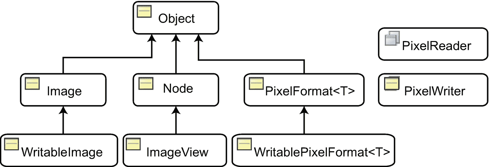
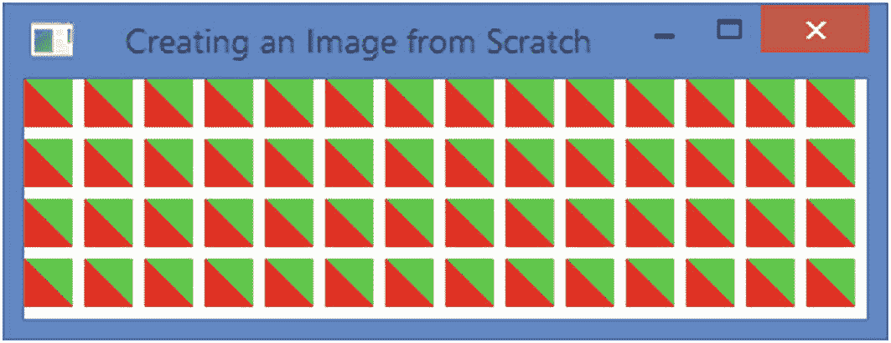
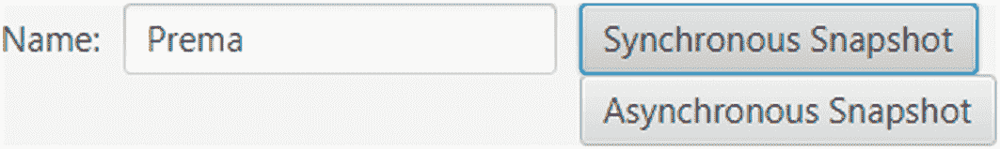

# 21.了解图像 API

在本章中，您将学习:

*   什么是图像 API

*   如何加载图像

*   如何查看`ImageView`节点中的图像

*   如何执行图像操作，例如读取/写入像素、从头开始创建图像以及将图像保存到文件系统

*   如何拍摄节点和场景的快照

本章的例子在`com.jdojo.image`包中。为了让它们工作，您必须在`module-info.java`文件中添加相应的一行:

```java
...
opens com.jdojo.image to javafx.graphics, javafx.base;
...

```

## 什么是图像 API？

JavaFX 提供了 Image API，允许您加载和显示图像，以及读/写原始图像像素。图像 API 中类的类图如图 [21-1](#Fig1) 所示。所有的类都在`javafx.scene.image`包中。该 API 允许您



图 21-1

图像 API 中的类的类图

*   将图像加载到内存中

*   将图像显示为场景图中的节点

*   从图像中读取像素

*   将像素写入图像

*   将场景图形中的节点转换为图像，并将其保存到本地文件系统

`Image`类的一个实例表示内存中的一幅图像。通过向一个`WritableImage`实例提供像素，可以在 JavaFX 应用程序中构造一个图像。

一个`ImageView`就是一个`Node`。它用于在场景图中显示一个`Image`。如果您想在应用程序中显示图像，您需要在`Image`中加载图像，并在`ImageView`中显示图像。

图像由像素构成。图像中像素的数据可以以不同的格式存储。`PixelFormat`定义如何存储给定格式的像素数据。`WritablePixelFormat`表示用全像素颜色信息写入像素的目的格式。

`PixelReader`和`PixelWriter`接口定义了从`Image`读取数据和向`WritableImage`写入数据的方法。除了一个`Image`之外，你可以从任何包含像素的表面读取像素，也可以向任何包含像素的表面写入像素。

我将在接下来的章节中介绍使用这些类的例子。

## 加载图像

`Image`类的一个实例是一个图像的内存表示。该类支持 BMP、PNG、JPEG 和 GIF 图像格式。它从一个源加载一个图像，这个源可以被指定为一个字符串 URL 或者一个`InputStream`。它还可以在加载时缩放原始图像。

`Image`类包含几个构造函数，允许您为加载的图像指定属性:

*   `Image(InputStream is)`

*   `Image(InputStream is, double requestedWidth, double requestedHeight, boolean preserveRatio, boolean smooth)`

*   `Image(String url)`

*   `Image(String url, boolean backgroundLoading)`

*   `Image(String url, double requestedWidth, double requestedHeight, boolean preserveRatio, boolean smooth)`

*   `Image(String url, double requestedWidth, double requestedHeight, boolean preserveRatio, boolean smooth, boolean backgroundLoading)`

如果将`InputStream`指定为来源，则图像的来源没有歧义。如果将字符串 URL 指定为源，它可能是有效的 URL 或类路径中的有效路径。如果指定的 URL 不是有效的 URL，它将被用作路径，并且将在`CLASSPATH`中的路径上搜索图像源:

```java
// Load an image from local machine using an InputStream
String sourcePath = "C:\\mypicture.png";
Image img = new Image(new FileInputStream(sourcePath));

// Load an image from an URL
Image img = new Image("http://jdojo.com/wp-content/uploads/2013/03/randomness.jpg");

// Load an image from the CLASSPATH. The image is located in the resources.picture package
Image img = new Image("resources/picture/randomness.jpg");

```

在前面的语句中，指定的 URL `resources/picture/randomness.jpg`不是有效的 URL。`Image`类将把它视为一条路径，期望它存在于`CLASSPATH`中。它将`resource.picture`视为一个包，将`randomness.jpg`视为该包中的一个资源。

Tip

如果您想测试本章中的代码片段，请确保添加有效的 URL。要么确保使用相对 URL，比如在`CLASSPATH`中的`resources/picture/randomness.jpg`，要么指定绝对 URL，比如`http://path/to/my/server/resources/picture/randomness.jpg`或`file://some/absolute/path/resources/picture/randomness.jpg`。

### 指定图像加载属性

有些构造函数允许您指定一些图像加载属性来控制图像质量和加载过程:

*   `requestedWidth`

*   `requestedHeight`

*   `preserveRatio`

*   `smooth`

*   `backgroundLoading`

`requestedWidth`和`requestedHeight`属性指定图像的缩放宽度和高度。默认情况下，图像以其原始大小加载。

`The preserveRatio`属性指定缩放时是否保留图像的纵横比。默认情况下，它是假的。

`smooth`属性指定在缩放中使用的过滤算法的质量。默认情况下，它是假的。如果设置为 true，将使用质量更好的过滤算法，这会稍微减慢图像加载过程。

属性指定是否异步加载图像。默认情况下，该属性设置为 false，并且同步加载图像。当`Image`对象被创建时，加载过程开始。如果此属性设置为 true，图像将在后台线程中异步加载。

### 读取加载的图像属性

`Image`类包含以下只读属性:

*   `width`

*   `height`

*   `progress`

*   `error`

*   `exception`

`width`和`height`属性分别是加载图像的宽度和高度。如果图像加载失败，则它们为零。

`progress`属性表示加载图像数据的进度。当`backgroundLoading`属性设置为 true 时，了解进度是很有用的。其值介于 0.0 和 1.0 之间，其中 0.0 表示 0%负载，1.0 表示 100%负载。当`backgroundLoading`属性设置为 false(默认值)时，其值为 1.0。您可以在`progress`属性中添加一个`ChangeListener`来了解图像加载的进度。您可以在图像加载时将文本显示为图像的占位符，并在`ChangeListener`中用当前进度更新文本:

```java
// Load an image in the background
String imagePath = "resources/picture/randomness.jpg";
Boolean backgroundLoading = true;
Image image = new Image(imagePath, backgroundLoading);

// Print the loading progress on the standard output
image.progressProperty().addListener((prop, oldValue, newValue) -> {
        System.out.println("Loading:" +
               Math.round(newValue.doubleValue() * 100.0) + "%");
});

```

`error`属性指示加载图像时是否出现错误。如果为真，`exception`属性指定了导致错误的`Exception`。在撰写本文时，Windows 不支持 TIFF 图像格式。以下代码片段试图在 Windows XP 上加载 TIFF 图像，并产生错误。该代码包含一个错误处理逻辑，如果`backgroundLoading`为真，则向`error`属性添加一个`ChangeListener`。否则，它检查`error`属性的值:

```java
String imagePath = "resources/picture/test.tif";
Boolean backgroundLoading = false;
Image image = new Image(imagePath, backgroundLoading);

// Add a ChangeListener to the error property for background loading and
// check its value for non-background loading
if (image.isBackgroundLoading()) {
    image.errorProperty().addListener((prop, oldValue, newValue) -> {
           if (newValue) {
               System.out.println(
                        "An error occurred while loading the image.\n" +
                        "Error message: " +
                        image.getException().getMessage());
           }
    });
}
else if (image.isError()) {

    System.out.println("An error occurred while loading the image.\n" +
                  "Error message: " +
                        image.getException().getMessage());
}

An error occurred while loading the image.
Error message: No loader for image data

```

## 查看图像

`ImageView`类的一个实例用于显示加载到`Image`对象中的图像。`ImageView`类继承自`Node`类，这使得`ImageView`适合添加到场景图形中。该类包含几个构造函数:

*   `ImageView()`

*   `ImageView(Image image)`

*   `ImageView(String url)`

无参数构造函数创建一个没有图像的`ImageView`。使用`image`属性来设置图像。第二个构造函数接受一个`Image`的引用。第三个构造函数让您指定图像源的 URL。在内部，它使用指定的 URL 创建一个`Image`:

```java
// Create an empty ImageView and set an Image for it later
ImageView imageView = new ImageView();
imageView.setImage(new Image("resources/picture/randomness.jpg"));

// Create an ImageView with an Image
ImageView imageView = new ImageView(new Image("resources/picture/randomness.jpg"));

// Create an ImageView with the URL of the image source
ImageView imageView = new ImageView("resources/picture/randomness.jpg");

```

清单 [21-1](#PC6) 中的程序展示了如何在场景中显示图像。它将图像加载到一个`Image`对象中。在不保留纵横比的情况下缩放图像。`Image`对象被添加到一个`ImageView`，后者被添加到一个`HBox`。图 [21-2](#Fig2) 为窗口。


图 21-2

带有图像的窗口

```java
// ImageTest.java
package com.jdojo.image;

import com.jdojo.util.ResourceUtil;

import javafx.application.Application;
import javafx.scene.Scene;
import javafx.scene.image.Image;
import javafx.scene.image.ImageView;
import javafx.scene.layout.HBox;
import javafx.stage.Stage;

public class ImageTest extends Application {
        public static void main(String[] args) {
               Application.launch(args);
        }

        @Override
        public void start(Stage stage) {
           String imagePath =
                   ResourceUtil.getResourceURLStr("picture/randomness.jpg");
           // Scale the image to 200 X 100
           double requestedWidth = 200;
           double requestedHeight = 100;
           boolean preserveRatio = false;
           boolean smooth = true;
           Image image = new Image(imagePath,
                             requestedWidth,
                             requestedHeight,
                             preserveRatio,
                             smooth);
           ImageView imageView = new ImageView(image);

           HBox root = new HBox(imageView);
           Scene scene = new Scene(root);
           stage.setScene(scene);
           stage.setTitle("Displaying an Image");
           stage.show();
        }

}

Listing 21-1Displaying an Image in an ImageView Node

```

### 图像的多个视图

一个`Image`从其来源将图像加载到内存中。同一个`Image`可以有多个视图。一位`ImageView`提供了其中一种观点。

您可以选择在加载和/或显示时调整原始图像的大小。选择哪个选项来调整图像的大小取决于手头的要求:

*   在一个`Image`对象中调整图像的大小会在内存中永久地调整图像的大小，并且图像的所有视图都将使用调整后的图像。一旦调整了`Image`的大小，它的大小就不能改变了。您可能希望缩小`Image`对象中的图像尺寸以节省内存。

*   在`ImageView`中调整图像的大小只会为该视图调整`image`的大小。即使图像已经显示，您也可以在`ImageView`中调整图像视图的大小。

我们已经讨论过如何在一个`Image`对象中调整图像的大小。在这一节中，我们将讨论在`ImageView`中调整图像的大小。

类似于`Image`类，`ImageView`类包含以下四个属性来控制图像视图的大小调整:

*   `fitWidth`

*   `fitHeight`

*   `preserveRatio`

*   `smooth`

`fitWidth`和`fitHeight`属性分别指定调整后的图像的宽度和高度。默认情况下，它们是零，这意味着`ImageView`将使用`Image`中加载图像的宽度和高度。

属性指定在调整大小时是否保持图像的纵横比。默认情况下，它是假的。

属性指定在调整大小时使用的过滤算法的质量。其默认值取决于平台。如果设置为 true，则使用质量更好的过滤算法。

清单 [21-2](#PC7) 中的程序以原始尺寸在`Image`对象中加载图像。它创建了指定不同大小的`Image`的三个`ImageView`对象。图 [21-3](#Fig3) 显示了三幅图像。图片显示的是一辆垃圾校车和一辆垃圾汽车。该图像经理查德·卡斯蒂略( [`www.digitizedchaos.com`](http://www.digitizedchaos.com) )许可使用。


图 21-3

同一图像的三视图

```java
// MultipleImageViews.java
// ...find in the book's download area.

Listing 21-2Displaying the Same Image in Different ImageView in Different Sizes

```

### 在视口中查看图像

视口是一个矩形区域，用于查看图形的一部分。滚动条通常与视口一起使用。当滚动条滚动时，视口显示图形的不同部分。

`ImageView`可让您定义图像的视窗。在 JavaFX 中，视口是`javafx.geometry.Rectangle2D`对象的一个实例。`Rectangle2D`是不可改变的。它由四个属性定义:`minX`、`minY`、`width`和`height`。(minX，minY)值定义矩形左上角的位置。宽度和高度属性指定其大小。您必须在构造函数中指定所有属性:

```java
// Create a viewport located at (0, 0) and of size 200 X 100
Rectangle2D viewport = new Rectangle2D(0, 0, 200,100);

```

`ImageView`类包含一个`viewport`属性，它提供了一个进入显示在`ImageView`中的图像的视窗。`viewport`定义了图像中的一个矩形区域。`ImageView`只显示图像中落在视窗内的区域。视窗的位置是相对于图像定义的，而不是`ImageView`。默认情况下，`ImageView`的视窗为空，`ImageView`显示整个图像。

下面的代码片段在`Image`中加载原始大小的图像。`Image`被设置为`ImageView`的源。为`ImageView`设置尺寸为 200 X 100 的视窗。视口位于(0，0)处。这显示在`ImageView`图像的左上角 200 X 100 的区域:

```java
String imagePath = "resources/picture/school_bus.jpg";
Image image = new Image(imagePath);
imageView = new ImageView(image);
Rectangle2D viewport = new Rectangle2D(0, 0, 200, 100);
imageView.setViewport(viewport);

```

以下代码片段将更改视区以显示图像的 200 X 100 右下角区域:

```java
double minX = image.getWidth() - 200;
double minY = image.getHeight() - 100;
Rectangle2D viewport2 = new Rectangle2D(minX, minY, 200, 100);
imageView.setViewport(viewport2);

```

Tip

`Rectangle2D`类是不可变的。因此，每次想要将视口移动到图像中时，都需要创建一个新的视口。

清单 [21-3](#PC11) 中的程序将图像加载到`ImageView`中。它为`ImageView`设置一个视口。您可以拖动鼠标，同时按下左、右或两个按钮，滚动到视图中图像的不同部分。

```java
// ImageViewPort.java
// ...find in the book's download area.

Listing 21-3Using a Viewport to View Part of an Image

```

程序声明了一些类和实例变量。`VIEWPORT_WIDTH`和`VIEWPORT_HEIGHT`是保存视口宽度和高度的常量。当鼠标被按下或拖动时，`startX`和`startY`实例变量将保存鼠标的 x 和 y 坐标。`ImageView`实例变量保存了`ImageView`的引用。在鼠标拖动的事件处理程序中，我们需要这个引用。

`start()`方法的开始部分很简单。它创建一个`Image`，一个`ImageView`，并为`ImageView`设置一个视口。然后，它将按下鼠标和拖动鼠标的事件处理程序设置为`ImageView`:

```java
// Set the mouse pressed and mouse dragged event handlers
imageView.setOnMousePressed(this::handleMousePressed);
imageView.setOnMouseDragged(this::handleMouseDragged);

```

在`handleMousePressed()`方法中，我们将鼠标的坐标存储在`startX`和`startY`实例变量中。坐标相对于`ImageView`:

```java
startX = e.getX();
startY = e.getY();

```

由于鼠标拖动，`handleMousePressed()`方法计算图像内视窗的新位置，并在新位置设置一个新视窗。首先，它计算鼠标沿 x 轴和 y 轴的拖动距离:

```java
// How far the mouse was dragged
double draggedDistanceX = e.getX() - startX;
double draggedDistanceY = e.getY() - startY;

```

您将`startX`和`startY`值重置为触发当前鼠标拖动事件的鼠标位置。这对于在用户按住鼠标、拖动鼠标、停止而不松开鼠标，然后再次拖动鼠标时获得正确的拖动距离非常重要:

```java
// Reset the starting point for the next drag
// if the user keeps the mouse pressed and drags again
startX = e.getX();
startY = e.getY();

```

计算视口左上角的新位置。在`ImageView`中你总是有一个视窗。新视口将位于旧位置的拖动距离处:

```java
// Get the minX and minY of the current viewport
double curMinX = imageView.getViewport().getMinX();
double curMinY = imageView.getViewport().getMinY();

// Move the new viewport by the dragged distance
double newMinX = curMinX + draggedDistanceX;
double newMinY = curMinY + draggedDistanceY;

```

将视口放在图像区域之外是可以的。当视窗落在图像区域之外时，它只显示一个空白区域。为了将视口限制在图像区域内，我们夹紧视口的位置:

```java
// Make sure the viewport does not fall outside the image area
newMinX = clamp(newMinX, 0, imageView.getImage().getWidth() - VIEWPORT_WIDTH);
newMinY = clamp(newMinY, 0, imageView.getImage().getHeight() - VIEWPORT_HEIGHT);

```

最后，我们使用新位置设置一个新的视口:

```java
// Set a new viewport
imageView.setViewport(new Rectangle2D(newMinX, newMinY, VIEWPORT_WIDTH, VIEWPORT_HEIGHT));

```

Tip

可以缩放或旋转`ImageView`并设置一个视窗来查看由视窗定义的图像区域。

## 了解图像操作

JavaFX 支持从图像中读取像素、向图像中写入像素以及创建场景的快照。它支持从头开始创建图像。如果图像是可写的，您还可以修改内存中的图像，并将其保存到文件系统中。图像 API 提供了对图像中每个像素的访问。它支持一次读写一个像素或一大块像素。本节将通过简单的例子讨论 Image API 支持的操作。

### 像素格式

JavaFX 中的 Image API 允许您访问图像中的每个像素。像素存储有关其颜色(红色、绿色、蓝色)和不透明度(alpha)的信息。像素信息可以以几种格式存储。

一个实例`PixelFormat<T extends Buffer>`代表一个像素的数据布局。当你从图像中读取像素时，你需要知道像素格式。将像素写入图像时，需要指定像素格式。`WritablePixelFormat`类继承自`PixelFormat`类，它的实例代表一种可以存储全彩色信息的像素格式。当向图像写入像素时，使用`WritablePixelFormat`类的一个实例。

类`PixelFormat`和它的子类`WritablePixelFormat`都是抽象的。`PixelFormat`类提供了几个静态方法来获取`PixelFormat`和`WritablePixelFormat`抽象类的实例。在我们讨论如何获得一个`PixelFormat`的实例之前，让我们讨论一下可用于存储像素数据的存储格式的类型。

一个`PixelFormat`有一个指定单个像素的存储格式的类型。`PixelFormat.Type`枚举的常量代表不同类型的存储格式:

*   `BYTE_RGB`

*   `BYTE_BGRA`

*   `BYTE_BGRA_PRE`

*   `BYTE_INDEXED`

*   `INT_ARGB`

*   `INT_ARGB_PRE`

在`BYTE_RGB`格式中，像素被认为是不透明的。像素按顺序以红色、绿色和蓝色存储在相邻的字节中。

在`BYTE_BGRA`格式中，像素按照蓝色、绿色、红色和 alpha 顺序存储在相邻的字节中。颜色值(红色、绿色和蓝色)不会与 alpha 值预先相乘。

`BYTE_BGRA_PRE`类型格式类似于`BYTE_BGRA`，除了在`BYTE_BGRA_PRE`中，存储的颜色分量值预先乘以阿尔法值。

在`BYTE_INDEXED`格式中，一个像素是一个字节。提供了单独的颜色查找列表。像素的单字节值用作查找列表中的索引，以获取像素的颜色值。

在`INT_ARGB`格式中，每个像素以 32 位整数存储。从最高有效字节(MSB)到最低有效字节(LSB)的字节存储 alpha、红色、绿色和蓝色值。颜色值(红色、绿色和蓝色)不会与 alpha 值预先相乘。以下代码片段显示了如何以这种格式从像素值中提取分量:

```java
int pixelValue = get the value for a pixel...
int alpha = (pixelValue >> 24) & 0xff;
int red   = (pixelValue >> 16) & 0xff;
int green = (pixelValue >>  8) & 0xff;
int blue  = pixelValue & 0xff;

```

除了`INT_ARGB_PRE`存储预先乘以 alpha 值的颜色值(红色、绿色和蓝色)之外，`INT_ARGB_PRE`格式类似于`INT_ARGB`格式。

通常，当你写像素来创建一个新的图像时，你需要创建一个`WritablePixelFormat`。当您从图像中读取像素时，像素读取器将为您提供一个`PixelFormat`实例，告诉您像素中的颜色信息是如何存储的。下面的代码片段创建了`WritablePixelFormat`类的一些实例:

```java
import javafx.scene.image.PixelFormat;
import javafx.scene.image.WritablePixelFormat;
import java.nio.ByteBuffer;
import java.nio.IntBuffer;
...
// BYTE_BGRA Format type
WritablePixelFormat<ByteBuffer> format1 = PixelFormat.getByteBgraInstance();

// BYTE_BGRA_PRE Format type
WritablePixelFormat<ByteBuffer> format2 =
    PixelFormat.getByteBgraPreInstance();

// INT_ARGB Format type
WritablePixelFormat<IntBuffer> format3 = PixelFormat.getIntArgbInstance();

// INT_ARGB_PRE Format type
WritablePixelFormat<IntBuffer> format4 = PixelFormat.getIntArgbPreInstance();

```

没有像素信息，像素格式类是没有用的。毕竟它们描述的是信息在一个像素中的布局！在接下来的章节中，当我们读写图像像素时，我们将使用这些类。它们的使用在例子中是显而易见的。

### 从图像中读取像素

接口的一个实例用于从图像中读取像素。使用`Image`类的`getPixelReader()`方法获得一个`PixelReader`。`PixelReader`接口包含以下方法:

*   `int getArgb(int x, int y)`

*   `Color getColor(int x, int y)`

*   `Void getPixels(int x, int y, int w, int h, WritablePixelFormat<ByteBuffer> pixelformat, byte[] buffer, int offset, int scanlineStride)`

*   `void getPixels(int x, int y, int w, int h, WritablePixelFormat<IntBuffer> pixelformat, int[] buffer, int offset, int scanlineStride)`

*   `<T extends Buffer> void getPixels(int x, int y, int w, int h, WritablePixelFormat<T> pixelformat, T buffer, int scanlineStride)`

*   `PixelFormat getPixelFormat()`

`PixelReader`接口包含一次读取一个或多个像素的方法。使用`getArgb()`和`getColor()`方法读取指定(x，y)坐标的像素。使用`getPixels()`方法批量读取像素。使用`getPixelFormat()`方法获得最能描述源中像素存储格式的`PixelFormat`。

只有当图像可读时，`Image`类的`getPixelReader()`方法才返回一个`PixelReader`。否则返回`null`。如果图像尚未完全加载、加载过程中出现错误或其格式不支持读取像素，则图像可能不可读:

```java
Image image = new Image("file://.../resources/picture/ksharan.jpg");

// Get the pixel reader
PixelReader pixelReader = image.getPixelReader();
if (pixelReader == null) {
        System.out.println("Cannot read pixels from the image");
} else {
        // Read image pixels
}

```

一旦有了一个`PixelReader`，就可以调用它的一个方法来读取像素。清单 [21-4](#PC22) 中的程序展示了如何从图像中读取像素。代码是不言自明的:

*   `start()`方法创建一个`Image`。`Image`同步加载。

*   读取像素的逻辑在`readPixelsInfo()`方法中。该方法接收一个完全加载的`Image`。它使用`PixelReader`的`getColor()`方法获取指定位置的像素。它打印所有像素的颜色。最后，它打印像素格式，这是`BYTE_RGB`。

```java
// ReadPixelInfo.java
// ...find in the book's download area.
Color at (0, 0) = 0xb5bb41ff
Color at (1, 0) = 0xb0b53dff
...
Color at (233, 287) = 0x718806ff
Color at (234, 287) = 0x798e0bff
Pixel format type: BYTE_RGB

Listing 21-4Reading Pixels from an Image

```

批量读取像素比一次读取一个像素要困难一些。困难来自于您必须提供给`getPixels()`方法的设置信息。我们将通过使用`PixelReader`的以下方法批量读取所有像素来重复前面的示例:

```java
void getPixels(int x, int y,
               int width, int height,
               WritablePixelFormat<ByteBuffer> pixelformat,
               byte[] buffer,
               int offset,
               int scanlineStride)

```

该方法按顺序从行中读取像素。读取第一行的像素，然后读取第二行的像素，依此类推。理解该方法所有参数的含义非常重要。

方法读取源中矩形区域的像素。

矩形区域左上角的 x 和 y 坐标在`x and y`参数中指定。

`width`和`height`参数指定矩形区域的宽度和高度。

`pixelformat`指定了用于在指定的`buffer`中存储读取像素的像素格式。

`buffer`是一个`byte`数组，其中`PixelReader`将存储读取的像素。数组的长度必须足够大，以存储所有读取的像素。

`offset`指定了`buffer`数组中存储第一个像素数据的起始索引。其零值表示第一个像素的数据将从缓冲区中的索引 0 开始。

`scanlineStride`指定缓冲区中一行数据的起点和下一行数据的起点之间的距离。假设你在一行中有两个像素，你想以一个像素 4 个字节的`BYTE_BGRA`格式读取。一行数据可以存储在 8 个字节中。如果将参数值指定为 8，则下一行的数据将在前一行数据结束后立即在缓冲区中开始。如果将参数值指定为 10，则每行数据的最后 2 个字节将为空。第一行像素将从索引 0 到 7 存储。索引 8 和 9 将为空(或未被写入)。索引 10 至 17 将存储第二行的像素数据，索引 18 和 19 为空。如果以后要用自己的值填充空槽，可能需要为参数指定一个比存储一行像素数据所需的值更大的值。指定一个小于所需的值将会覆盖前一行中的部分数据。

以下代码片段显示了如何以`BYTE_BGRA`格式从一个`byte`数组中读取图像的所有像素:

```java
Image image = ...
PixelReader pixelReader = image.getPixelReader();

int x = 0;
int y = 0;
int width = (int)image.getWidth();
int height = (int)image.getHeight();
int offset = 0;
int scanlineStride = width * 4;
byte[] buffer = new byte[width * height * 4];

// Get a WritablePixelFormat for the BYTE_BGRA format type
WritablePixelFormat<ByteBuffer> pixelFormat = PixelFormat.getByteBgraInstance();

// Read all pixels at once
pixelReader.getPixels(x, y,
                width, height,
                pixelFormat,
                buffer,
                offset,
                scanlineStride);

```

要读取的矩形区域的左上角的 x 和 y 坐标被设置为零。区域的宽度和高度被设置为图像的宽度和高度。这将设置参数来读取整个图像。

您希望从索引 0 开始将像素数据读入缓冲区，因此将`offset`参数设置为 0。

你想读取`BYTE_BGRA`格式类型的像素数据，需要 4 个字节来存储一个像素的数据。我们已经将参数值`scanlineStride`设置为`width * 4`，它是一行数据的长度，因此一行数据从上一行数据结束的下一个索引开始。

您获得了一个`WritablePixelFormat`的实例来读取`BYTE_BGRA`格式类型的数据。最后，我们调用`PixelReader`的`getPixels()`方法来读取像素数据。当`getPixels()`方法返回时，`buffer`将被像素数据填充。

Tip

设置`scanlineStride`参数的值和缓冲区数组的长度取决于`pixelFormat`参数。其他版本的`getPixels()`方法允许读取不同格式的像素数据。

清单 [21-5](#PC25) 中的程序有完整的源代码来批量读取像素。读取所有像素后，它对(0，0)处像素的字节数组中的颜色分量进行解码。它使用`getColor()`方法读取(0，0)处的像素。通过两种方法获得的(0，0)处的像素数据打印在标准输出上。

```java
// BulkPixelReading.java
// ...find in the book's download area.
red=181, green=187, blue=65, alpha=255
red=181, green=187, blue=65, alpha=255

Listing 21-5Reading Pixels from an Image in Bulk

```

### 将像素写入图像

您可以将像素写入图像或任何支持写入像素的表面。例如，您可以将像素写入一个`WritableImage`和一个`Canvas`。

Tip

一个`Image`是一个只读像素表面。您可以从`Image`中读取像素。但是，您不能将像素写入`Image`。如果您想写入图像或从头开始创建图像，请使用`WritableImage`。

接口的一个实例被用来将像素写到一个表面上。可写表面提供了一个`PixelWriter`。例如，您可以使用`Canvas`和`WritableImage`的`getPixelWriter()`方法为它们获取一个`PixelWriter`。

`PixelWriter`接口包含将像素写入表面并获得表面支持的像素格式的方法:

*   `PixelFormat getPixelFormat()`

*   `void setArgb(int x, int y, int argb)`

*   `void setColor(int x, int y, Color c)`

*   `void setPixels(int x, int y, int w, int h, PixelFormat<ByteBuffer> pixelformat, byte[] buffer, int offset, int scanlineStride)`

*   `void setPixels(int x, int y, int w, int h, PixelFormat<IntBuffer> pixelformat, int[] buffer, int offset, int scanlineStride)`

*   `<T extends Buffer> void setPixels(int x, int y, int w, int h, PixelFormat<T> pixelformat, T buffer, int scanlineStride)`

*   `void setPixels(int dstx, int dsty, int w, int h, PixelReader reader, int srcx, int srcy)`

`getPixelFormat()`方法返回像素可以写入表面的像素格式。`setArgb()`和`setColor()`方法允许在目标表面的指定(x，y)位置写入一个像素。`setArgb()`方法接受 INT_ARGB 格式的整数像素数据，而`setColor()`方法接受颜色对象。`setPixels()`方法允许批量像素写入。

您可以使用`WritableImage`的实例从头开始创建图像。该类包含三个构造函数:

*   `WritableImage(int width, int height)`

*   `WritableImage(PixelReader reader, int width, int height)`

*   `WritableImage(PixelReader reader, int x, int y, int width, int height)`

第一个构造函数创建一个指定的`width`和`height`的空图像:

```java
// Create a new empty image of 200 X 100
WritableImage newImage = new WritableImage(200, 100);

```

第二个构造函数创建指定的`width`和`height`的图像。指定的`reader`用于用像素填充图像。如果阅读器从一个没有足够的行数和列数来填充新图像的表面读取，就会抛出一个`ArrayIndexOutOfBoundsException`。使用此构造函数复制整个或部分图像。以下代码片段创建了一个图像的副本:

```java
String imagePath = "file://.../resources/picture/ksharan.jpg";
Image image = new Image(imagePath, 200, 100, true, true);

int width = (int)image.getWidth();
int height = (int)image.getHeight();

// Create a copy of the image
WritableImage newImage =
    new WritableImage(image.getPixelReader(), width, height);

```

第三个构造函数允许您从表面复制一个矩形区域。(`x`，`y`)值是矩形区域左上角的坐标。(`width`、`height`)值是使用`reader`读取的矩形区域的尺寸和新图像的所需尺寸。如果阅读器从一个没有足够的行数和列数来填充新图像的表面读取，就会抛出一个`ArrayIndexOutOfBoundsException`。

`WritableImage`是一个读写映像。它的`getPixelWriter()`方法返回一个`PixelWriter`来将像素写入图像。它继承了返回一个从图像中读取数据的`PixelReader`的`getPixelReader()`方法。

下面的代码片段创建了一个`Image`和一个空的`WritableImage`。它从`Image`中一次读取一个像素，使像素变暗，并将相同的像素写入新的`WritableImage`。最后，我们创建了原始图像的一个更暗的副本:

```java
Image image = new Image("file://.../resources/picture/ksharan.jpg";);
PixelReader pixelReader = image.getPixelReader();
int width = (int)image.getWidth();
int height = (int)image.getHeight();

// Create a new, empty WritableImage
WritableImage darkerImage = new WritableImage(width, height);
PixelWriter darkerWriter = darkerImage.getPixelWriter();

// Read one pixel at a time from the source and
// write it to the destinations - one darker and one brighter
for(int y = 0; y < height; y++) {
        for(int x = 0; x < width; x++) {
               // Read the pixel from the source image
               Color color = pixelReader.getColor(x, y);

               // Write a darker pixel to the new image at the same
                    // location
               darkerWriter.setColor(x, y, color.darker());
        }
}

```

清单 [21-6](#PC29) 中的程序创建一个`Image`。它创建了三个`WritableImage`实例，并将原始图像中的像素复制到其中。复制的像素在写入目标之前会被修改。对于一个目的地，像素变暗，一个变亮，一个变成半透明。四幅图像都显示在`ImageViews`中，如图 [21-4](#Fig4) 所示。


图 21-4

原始图像和修改后的图像

```java
// CopyingImage.java
// ...find in the book's download area.

Listing 21-6Writing Pixels to an Image

```

Tip

在 JavaFX 中裁剪图像很容易。使用`PixelReader`的`getPixels()`方法之一读取缓冲区中所需的图像区域，并将缓冲区写入新图像。这为您提供了一个新图像，它是原始图像的裁剪版本。

### 从头开始创建图像

在上一节中，我们通过从另一个图像复制像素来创建新图像。在将原始像素写入新图像之前，我们已经改变了它们的颜色和不透明度。这很简单，因为我们一次处理一个像素，我们接收一个像素作为`Color`对象。也可以从头开始创建像素，然后使用它们来创建新的图像。任何人都会承认，通过在代码中定义每个像素来创建一个新的、有意义的图像并不是一件容易的事情。然而，JavaFX 使这个过程变得很容易。

在这一节中，我们将创建一个新的图像，它由矩形组成，以类似网格的方式放置。使用连接左上角和右下角的对角线将每个矩形分成两部分。上面的三角形是绿色的，下面的是红色的。将创建一个新图像并用矩形填充。

从头开始创建映像包括三个步骤:

*   创建一个`WritableImage`的实例。

*   创建缓冲区(一个`byte`数组，一个`int`数组，等等)。)并根据您希望用于像素数据的像素格式用像素数据填充它。

*   将缓冲区中的像素写入图像。

让我们编写为矩形区域创建像素的代码。让我们为矩形的宽度和高度声明常数:

```java
static final int RECT_WIDTH = 20;
static final int RECT_HEIGHT = 20;

```

我们需要定义一个足够大的缓冲区(一个`byte`数组)来保存所有像素的数据。`BYTE_RGB`格式的每个像素占用 2 个字节:

```java
byte[] pixels = new byte[RECT_WIDTH * RECT_HEIGHT * 3];

```

如果该区域是矩形的，我们需要知道高度与宽度的比率，以便将该区域分成上下两个矩形:

```java
double ratio = 1.0 * RECT_HEIGHT/RECT_WIDTH;

```

以下代码片段填充了缓冲区:

```java
// Generate pixel data
for (int y = 0; y < RECT_HEIGHT; y++) {
        for (int x = 0; x < RECT_WIDTH; x++) {
           int i = y * RECT_WIDTH * 3 + x * 3;
           if (x <= y/ratio) {
               // Lower-half
               pixels[i] = -1;  // red -1 means 255 (-1 & 0xff = 255)
               pixels[i+1] = 0; // green = 0
               pixels[i+2] = 0; // blue = 0
           } else {
               // Upper-half
               pixels[i] = 0;    // red = 0
               pixels[i+1] = -1; // Green 255
               pixels[i+2] = 0;  // blue = 0
           }
        }
}

```

像素以行优先的顺序存储在缓冲区中。循环中的变量`i`计算一个像素的 3 字节数据在缓冲区中的起始位置。例如，(0，0)处的像素的数据从索引 0 开始；(0，1)处的像素的数据从索引 3 开始；等等。像素的 3 个字节按照索引递增的顺序存储红色、绿色和蓝色值。颜色分量的编码值存储在缓冲区中，因此表达式“`byteValue & 0xff`”将产生 0 到 255 之间的实际颜色分量值。如果你想要一个红色像素，你需要为红色分量设置–1，因为“`-1 & 0xff`产生 255。对于红色，绿色和蓝色分量将被设置为零。字节数组将所有元素初始化为零。然而，我们已经在代码中明确地将它们设置为零。对于下半部分的三角形，我们将颜色设置为绿色。条件“`x =<= y/ratio`”用于确定一个像素的位置是落在上半三角形还是下半三角形。如果`y/ratio`不是一个整数，矩形分成两个三角形在右下角可能会有点偏离。

一旦我们获得了像素数据，我们需要将它们写入一个`WritableImage`。以下代码片段写入矩形的像素，一次在图像的左上角:

```java
WritableImage newImage = new WritableImage(350, 100);
PixelWriter pixelWriter = newImage.getPixelWriter();
byte[] pixels = generate pixel data...

// Our data is in BYTE_RGB format
PixelFormat<ByteBuffer> pixelFormat = PixelFormat.getByteRgbInstance();
Int xPos 0;
int yPos =0;
int offset = 0;
int scanlineStride = RECT_WIDTH * 3;
pixelWriter.setPixels(xPos, yPos,
                 RECT_WIDTH, RECT_HEIGHT,
                 pixelFormat,
                 pixels, offset,
                 scanlineStride);

```

清单 [21-7](#PC35) 中的程序从头开始创建一个图像。它通过为矩形区域写入行像素来填充图像，从而创建图案。图 [21-5](#Fig5) 为图示。



图 21-5

从零开始创造的图像

```java
// CreatingImage.java
// ...find in the book's download area.

Listing 21-7Creating an Image from Scratch

```

### 将新图像保存到文件系统

将`Image`保存到文件系统很容易:

*   使用`SwingFXUtils`类的`fromFXImage()`方法将`Image`转换为`BufferedImage`。

*   将`BufferedImage`传递给`ImageIO`类的`write()`方法。

请注意，我们必须使用两个类— `BufferedImage`和 ImageIO—它们是标准 Java 库的一部分，而不是 JavaFX 库的一部分。以下代码片段显示了将图像保存到 PNG 格式的文件中所涉及的步骤概要:

```java
import java.awt.image.BufferedImage;
import java.io.File;
import java.io.IOException;
import javafx.embed.swing.SwingFXUtils;
import javafx.scene.image.Image;
import javax.imageio.ImageIO;
...

Image image = create an image...
BufferedImage bImage = SwingFXUtils.fromFXImage(image, null);

// Save the image to the file
File fileToSave = ...
String imageFormat = "png";
try {
        ImageIO.write(bImage, imageFormat, fileToSave);
}
catch (IOException e) {
        throw new RuntimeException(e);
}

```

清单 [21-8](#PC37) 中的程序有一个实用程序类`ImageUtil`的代码。它的静态`saveToFile(Image image)`方法可以用来将一个`Image`保存到本地文件系统。该方法要求输入文件名。用户可以为图像选择 PNG 或 JPEG 格式。

```java
// ImageUtil.java
// ...find in the book's download area.

Listing 21-8A Utility Class to Save an Image to a File

```

清单 [21-9](#PC38) 中的程序展示了如何将图像保存到文件中。点击`Save Image`按钮将图片保存到文件中。它会打开一个文件选择器对话框，让您选择文件名。如果取消文件选择器对话框，保存过程将中止。

```java
// SaveImage.java
// ...find in the book's download area.

Listing 21-9Saving an Image to a File

```

## 拍摄节点和场景的快照

JavaFX 允许您拍摄下一帧中出现的`Node`和`Scene`的快照。您在`WritableImage`中获取快照，这意味着您可以在获取快照后执行所有像素级操作。`Node`和`Scene`类包含一个`snapshot()`方法来完成这个任务。

### 拍摄节点的快照

`Node`类包含一个重载的`snapshot()`方法:

*   `WritableImage snapshot(SnapshotParameters params, WritableImage image)`

*   `void snapshot(Callback<SnapshotResult,Void> callback, SnapshotParameters params, WritableImage image)`

第一个版本的`snapshot()`方法是同步的，而第二个是异步的。该方法允许您指定包含快照呈现属性的`SnapshotParameters`类的实例。如果为空，将使用默认值。您可以为快照设置以下属性:

*   填充颜色

*   一个转变

*   视口

*   一台照相机

*   深度缓冲器

默认情况下，填充颜色是白色；不使用变换和视口；使用一个`ParallelCamera`；并且深度缓冲器被设置为假。请注意，这些属性仅在拍摄快照时在节点上使用。

您可以在`snapshot()`方法中指定一个`WritableImage`来保存节点的快照。如果这是`null`，则创建一个新的`WritableImage`。如果指定的`WritableImage`小于节点，节点将被裁剪以适应图像大小。

第一个版本的`snapshot()`方法在`WritableImage`中返回快照。该图像或者是作为参数传递的图像，或者是由方法创建的新图像。

第二个异步版本的`snapshot()`方法接受一个`Callback`对象，其`call()`方法被调用。一个`SnapshotResult`对象被传递给`call()`方法，该方法可用于通过以下方法获得快照映像、源节点和快照参数:

*   `WritableImage getImage()`

*   `SnapshotParameters getSnapshotParameters()`

*   `Object getSource()`

Tip

`snapshot()`方法使用节点的`boundsInParent`属性获取节点的快照。也就是说，快照包含应用于节点的所有效果和变换。如果正在对节点进行动画处理，快照将包括拍摄时节点的动画状态。

清单 [21-10](#PC39) 中的程序展示了如何拍摄一个`TextField`节点的快照。在一个`GridPane`中显示一个`Label`，一个`TextField`，两个`Buttons`。按钮用于同步和异步拍摄`TextField`的快照。点击其中一个`Buttons`拍摄快照。将出现“文件保存”对话框，让您输入保存的快照的文件名。`syncSnapshot()`和`asyncSnapshot()`方法包含获取快照的逻辑。对于快照，填充设置为红色，并应用了一个`Scale`和一个`Rotate`变换。图 [21-6](#Fig6) 为快照。


图 21-6

节点的快照

```java
// NodeSnapshot.java
// ...find in the book's download area.

Listing 21-10Taking a Snapshot of a Node

```

### 拍摄场景的快照

`Scene`类包含一个重载的`snapshot()`方法:

*   `WritableImage snapshot(WritableImage image)`

*   `void snapshot(Callback<SnapshotResult,Void> callback, WritableImage image)`

比较`Scene`类和`Node`类的`snapshot()`方法。唯一的区别是`Scene`类中的`snapshot()`方法不包含`SnapshotParameters`参数。这意味着您无法自定义场景快照。除此之外，该方法的工作方式与针对`Node`类的工作方式相同，如前一节所述。

第一个版本的`snapshot()`方法是同步的，而第二个是异步的。您可以为保存节点快照的方法指定一个`WritableImage`。如果这是`null`，则创建一个新的`WritableImage`。如果指定的`WritableImage`小于场景，场景将被裁剪以适合图像大小。

清单 [21-11](#PC40) 中的程序展示了如何拍摄一个场景的快照。程序中的主要逻辑与清单 [21-10](#PC39) 中的程序基本相同，除了这一次，它拍摄了一个场景的快照。图 [21-7](#Fig7) 显示了快照。



图 21-7

场景的快照

```java
// SceneSnapshot.java
// ...find in the book's download area.

Listing 21-11Taking a Snapshot of a Scene

```

## 摘要

JavaFX 提供了 Image API，允许您加载和显示图像，以及读/写原始图像像素。API 中的所有类都在 javafx.scene.image 包中。API 允许您对图像执行以下操作:将图像加载到内存中，将图像显示为场景图中的节点，从图像中读取像素，将像素写入图像，以及将场景图中的节点转换为图像并将其保存到本地文件系统。

`Image`类的一个实例是一个图像的内存表示。您还可以通过向一个`WritableImage`实例提供像素来在 JavaFX 应用程序中构造一个图像。`Image`类支持 BMP、PNG、JPEG 和 GIF 图像格式。它从一个源加载一个图像，这个源可以被指定为一个字符串 URL 或者一个`InputStream`。它还可以在加载时缩放原始图像。

`ImageView`类的一个实例用于显示加载到`Image`对象中的图像。`ImageView`类继承自`Node`类，这使得`ImageView`适合添加到场景图形中。

图像由像素构成。JavaFX 支持从图像中读取像素、向图像中写入像素以及创建场景的快照。它支持从头开始创建图像。如果图像是可写的，您还可以修改内存中的图像，并将其保存到文件系统中。图像 API 提供了对图像中每个像素的访问。它支持一次读写一个像素或一大块像素。

图像中像素的数据可以以不同的格式存储。`PixelFormat`定义如何存储给定格式的像素数据。`WritablePixelFormat`表示用全像素颜色信息写入像素的目的格式。

`PixelReader`和`PixelWriter`接口定义了从`Image`读取数据和向`WritableImage`写入数据的方法。除了一个`Image`之外，你可以从任何包含像素的表面读取像素，也可以向任何包含像素的表面写入像素。

JavaFX 允许您拍摄下一帧中出现的`Node`和`Scene`的快照。您在`WritableImage`中获取快照，这意味着您可以在获取快照后执行所有像素级操作。`Node`和`Scene`类包含一个`snapshot()`方法来完成这个任务。

下一章将讨论如何使用 Canvas API 在画布上绘图。