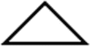

# 22.在画布上画画

在本章中，您将学习:

*   什么是画布 API

*   如何创建画布

*   如何在画布上绘图，如基本形状、文本、路径和图像

*   如何清除画布区域

*   如何在`GraphicsContext`中保存和恢复绘图状态

本章的例子在`com.jdojo.canvas`包中。为了让它们工作，您必须在`module-info.java`文件中添加相应的一行:

```java
...
opens com.jdojo.canvas to javafx.graphics, javafx.base;
...

```

## 什么是画布 API？

通过`javafx.scene.canvas`包，JavaFX 提供了 Canvas API，该 API 提供了一个绘图表面来使用绘图命令绘制形状、图像和文本。该 API 还提供了对绘图表面的像素级访问，您可以在表面上写入任何像素。API 只包含两个类:

*   `Canvas`

*   `GraphicsContext`

画布是位图图像，用作绘图表面。`Canvas`类的一个实例代表一个画布。它继承自`Node`类。因此，画布是一个节点。可以将它添加到场景图中，并对其应用效果和变换。

画布具有与之相关联的图形上下文，用于向画布发出绘制命令。`GraphicsContext`类的一个实例代表一个图形上下文。

## 创建画布

`Canvas`类有两个构造函数。无参数构造函数创建一个空画布。稍后，您可以使用画布的`width`和`height`属性来设置画布的大小。另一个构造函数将画布的宽度和高度作为参数:

```java
// Create a Canvas of zero width and height
Canvas canvas = new Canvas();

// Set the canvas size
canvas.setWidth(400);
canvas.setHeight(200);

// Create a 400X200 canvas
Canvas canvas = new Canvas(400, 200);

```

## 在画布上画画

一旦创建了画布，就需要使用`getGraphicsContext2D()`方法获取它的图形上下文，如下面的代码片段所示:

```java
// Get the graphics context of the canvas
GraphicsContext gc = canvas.getGraphicsContext2D();

```

所有绘图命令都作为方法在`GraphicsContext`类中提供。超出画布边界的绘图将被剪裁。画布使用缓冲区。绘图命令将必要的参数推送到缓冲区。值得注意的是，在将`Canvas`添加到场景图形之前，您应该使用来自任何一个线程的图形上下文。一旦`Canvas`被添加到场景图形中，图形上下文应该只在 JavaFX 应用程序线程上使用。`GraphicsContext`类包含绘制以下类型对象的方法:

*   基本形状

*   文本

*   小路

*   形象

*   像素

### 绘制基本形状

`GraphicsContext`类提供了两种绘制基本形状的方法。方法`fillXxx()`绘制一个形状`Xxx`，并用当前的填充颜料填充它。方法`strokeXxx()`用当前笔画绘制形状`Xxx`。使用下列方法绘制形状:

*   `fillArc()`

*   `fillOval()`

*   `fillPolygon()`

*   `fillRect()`

*   `fillRoundRect()`

*   `strokeArc()`

*   `strokeLine()`

*   `strokeOval()`

*   `strokePolygon()`

*   `strokePolyline()`

*   `strokeRect()`

*   `strokeRoundRect()`

下面的代码片段绘制了一个矩形。描边颜色为红色，描边宽度为 2px。矩形的左上角位于(0，0)。矩形宽 100 像素，高 50 像素:

```java
Canvas canvas = new Canvas(200, 100);
GraphicsContext gc = canvas.getGraphicsContext2D();
gc.setLineWidth(2.0);
gc.setStroke(Color.RED);
gc.strokeRect(0, 0, 100, 50);

```

### 绘图文本

您可以使用下面的代码片段，使用`GraphicsContext`的`fillText()`和`strokeText()`方法来绘制文本:

*   `void strokeText(String text, double x, double y)`

*   `void strokeText(String text, double x, double y, double maxWidth)`

*   `void fillText(String text, double x, double y)`

*   `void fillText(String text, double x, double y, double maxWidth)`

这两个方法都是重载的。一个版本允许您指定文本及其位置。另一个版本允许您指定文本的最大宽度。如果实际文本宽度超过指定的最大宽度，文本将调整大小以适合指定的最大宽度。以下代码片段绘制了两个字符串。图 [22-1](#Fig1) 显示了画布上的两根弦。


图 22-1

在画布上绘制文本

```java
Canvas canvas = new Canvas(200, 50);
GraphicsContext gc = canvas.getGraphicsContext2D();
gc.setLineWidth(1.0);
gc.setStroke(Color.BLACK);
gc.strokeText("Drawing Text", 10, 10);
gc.strokeText("Drawing Text", 100, 10, 40);

```

### 绘制路径

您可以使用路径命令和 SVG 路径字符串来创建您选择的形状。路径由多个子路径组成。以下方法用于绘制路径:

*   `beginPath()`

*   `lineTo(double x1, double y1)`

*   `moveTo(double x0, double y0)`

*   `quadraticCurveTo(double xc, double yc, double x1, double y1)`

*   `appendSVGPath(String svgpath)`

*   `arc(double centerX, double centerY, double radiusX, double radiusY, double startAngle, double length)`

*   `arcTo(double x1, double y1, double x2, double y2, double radius)`

*   `bezierCurveTo(double xc1, double yc1, double xc2, double yc2, double x1, double y1)`

*   `closePath()`

*   `stroke()`

*   `fill()`

`beginPath()`和`closePath()`方法分别启动和关闭一个路径。像`arcTo()`和`lineTo()`这样的方法是绘制特定类型子路径的路径命令。不要忘记在最后调用`stroke()`或`fill()`方法，它们将绘制轮廓或填充路径。下面这段代码画了一个三角形，如图 [22-2](#Fig2) 所示:



图 22-2

画三角形

```java
Canvas canvas = new Canvas(200, 50);
GraphicsContext gc = canvas.getGraphicsContext2D();
gc.setLineWidth(2.0);
gc.setStroke(Color.BLACK);

gc.beginPath();
gc.moveTo(25, 0);
gc.appendSVGPath("L50, 25L0, 25");
gc.closePath();
gc.stroke();

```

### 绘制图像

您可以使用`drawImage()`方法在画布上绘制图像。该方法有三个版本:

*   `void drawImage(Image img, double x, double y)`

*   `void drawImage(Image img, double x, double y, double w, double h)`

*   `void drawImage(Image img, double sx, double sy, double sw, double sh, double dx, double dy, double dw, double dh)`

你可以画出图像的全部或一部分。可以在画布上拉伸或缩短绘制的图像。以下代码片段在画布上以原始大小(10，10)绘制了整个图像:

```java
Image image = new Image("your_image_URL");
Canvas canvas = new Canvas(400, 400);
GraphicsContext gc = canvas.getGraphicsContext2D();
gc.drawImage(image, 10, 10);

```

下面的语句将在画布上绘制整个图像，方法是调整图像大小以适合 100 像素宽 150 像素高的区域。图像是拉伸还是缩短取决于其原始大小:

```java
// Draw the whole image in 100X150 area at (10, 10)
gc.drawImage(image, 10, 10, 100, 150);

```

下面的语句将在画布上绘制图像的一部分。这里，假设源图像大于 100 像素乘 150 像素。正在绘制的图像部分宽 100 像素，高 150 像素，其左上角在源图像中的(0，0)处。图像的一部分以(10，10)绘制在画布上，并被拉伸以适合画布上 200 像素宽和 200 像素高的区域:

```java
// Draw part of the image in 200X200 area at (10, 10)
gc.drawImage(image, 0, 0, 100, 150, 10, 10, 200, 200);

```

### 写入像素

你也可以直接在画布上修改像素。`GraphicsContext`对象的`getPixelWriter()`方法返回一个`PixelWriter`,可用于将像素写入关联的画布:

```java
Canvas canvas = new Canvas(200, 100);
GraphicsContext gc = canvas.getGraphicsContext2D();
PixelWriter pw = gc.getPixelWriter();

```

一旦你得到一个`PixelWriter`，你就可以把像素写到画布上。第 21 章[介绍了更多关于如何使用`PixelWriter`写像素的细节。](21.html)

## 清除画布区域

画布是一个透明区域。像素将具有颜色和不透明度，这取决于在这些像素上绘制的内容。有时，您可能想要清除整个或部分画布，以便像素再次透明。`GraphicsContext`的`clearRect()`方法让您清除画布上的指定区域:

```java
// Clear the top-left 100X100 rectangular area from the canvas
gc.clearRect(0, 0, 100, 100);

```

## 保存和恢复绘图状态

`GraphicsContext`的当前设置用于所有后续绘图。例如，如果您将线条宽度设置为 5px，则所有后续笔画的宽度都将为 5px。有时，您可能希望临时修改图形上下文的状态，并在一段时间后恢复修改前的状态。

`GraphicsContext`对象的`save()`和`restore()`方法分别让您保存当前状态和在以后恢复它。在你使用这些方法之前，让我们讨论一下它的必要性。假设您想按顺序向`GraphicsContext`对象发出以下命令:

*   画一个没有任何效果的矩形

*   绘制具有反射效果的字符串

*   画一个没有任何效果的矩形

以下是实现这一点的第一次(也是不正确的)尝试:

```java
Canvas canvas = new Canvas(200, 120);
GraphicsContext gc = canvas.getGraphicsContext2D();
gc.strokeRect(10, 10, 50, 20);
gc.setEffect(new Reflection());
gc.strokeText("Chatar", 70, 20);
gc.strokeRect(120, 10, 50, 20);

```

图 [22-3](#Fig3) 为画布的绘制。请注意，反射效果也应用于第二个矩形，这是不希望的。


图 22-3

绘制形状和文本

您可以在绘制文本后通过将`Effect`设置为`null`来解决这个问题。您已经修改了`GraphicsContext`的几个属性，然后必须手动恢复它们。有时，一个`GraphicsContext`可能被传递给你的代码，但是你不想修改它的现有状态。

`save()`方法存储堆栈上`GraphicsContext`的当前状态。`restore()`方法将`GraphicsContext`的状态恢复到上次保存的状态。图 [22-4](#Fig4) 显示了这样的结果。您可以使用以下方法解决该问题:


图 22-4

使用`save()`和`restore()`方法绘制形状和文本

```java
Canvas canvas = new Canvas(200, 120);
GraphicsContext gc = canvas.getGraphicsContext2D();

gc.strokeRect(10, 10, 50, 20);

// Save the current state
gc.save();

// Modify the current state to add an effect and darw the text
gc.setEffect(new Reflection());
gc.strokeText("Chatar", 70, 20);

// Restore the state what it was when the last save() was called and draw the
// second rectangle
gc.restore();
gc.strokeRect(120, 10, 50, 20);

```

## 一个画布绘画的例子

清单 [22-1](#PC14) 中的程序展示了如何在画布上绘制基本的形状、文本、图像和行像素。图 [22-5](#Fig5) 显示了所有绘图的结果画布。


图 22-5

上面绘制有形状、文本、图像和原始像素的画布

```java
// CanvasTest.java
package com.jdojo.canvas;

import com.jdojo.util.ResourceUtil;
import java.nio.ByteBuffer;
import javafx.application.Application;
import javafx.scene.Scene;
import javafx.scene.canvas.Canvas;
import javafx.scene.canvas.GraphicsContext;
import javafx.scene.image.Image;
import javafx.scene.image.PixelFormat;
import javafx.scene.image.PixelWriter;
import javafx.scene.layout.Pane;
import javafx.scene.paint.Color;
import javafx.stage.Stage;

public class CanvasTest extends Application {

        private static final int RECT_WIDTH = 20;
        private static final int RECT_HEIGHT = 20;

        public static void main(String[] args) {
               Application.launch(args);
        }

        @Override
        public void start(Stage stage) {
               Canvas canvas = new Canvas(400, 100);
               GraphicsContext gc = canvas.getGraphicsContext2D();

               // Set line width and fill color
               gc.setLineWidth(2.0);
               gc.setFill(Color.RED);

               // Draw a rounded rectangle
               gc.strokeRoundRect(10, 10, 50, 50, 10, 10);

               // Fill an oval
               gc.fillOval(70, 10, 50, 20);

               // Draw text
               gc.strokeText("Hello Canvas", 10, 85);

               // Draw an Image
               String imagePath =
                        ResourceUtil.getResourceURLStr("picture/ksharan.jpg");
               Image image = new Image(imagePath);
               gc.drawImage(image, 130, 10, 60, 80);

               // Write custom pixels to create a pattern
               writePixels(gc);

               Pane root = new Pane();
               root.getChildren().add(canvas);
               Scene scene = new Scene(root);
               stage.setScene(scene);
               stage.setTitle("Drawing on a Canvas");
               stage.show();
        }

        private void writePixels(GraphicsContext gc) {
               byte[] pixels = this.getPixelsData();
               PixelWriter pixelWriter = gc.getPixelWriter();

               // Our data is in BYTE_RGB format
               PixelFormat<ByteBuffer> pixelFormat =
                        PixelFormat.getByteRgbInstance();

               int spacing = 5;
               int imageWidth = 200;
               int imageHeight = 100;

               // Roughly compute the number of rows and columns
               int rows = imageHeight/(RECT_HEIGHT + spacing);
               int columns = imageWidth/(RECT_WIDTH + spacing);

               // Write the pixels to the canvas
               for (int y = 0; y < rows; y++) {
                   for (int x = 0; x < columns; x++) {
                       int xPos = 200 + x * (RECT_WIDTH + spacing);
                       int yPos = y * (RECT_HEIGHT + spacing);
                       pixelWriter.setPixels(xPos, yPos,
                           RECT_WIDTH, RECT_HEIGHT,
                          pixelFormat,
                          pixels, 0,
                          RECT_WIDTH * 3);
                   }
               }
        }

        private byte[] getPixelsData() {
               // Each pixel in the w X h region will take 3 bytes
               byte[] pixels = new byte[RECT_WIDTH * RECT_HEIGHT * 3];

               // Height to width ration

               double ratio = 1.0 * RECT_HEIGHT/RECT_WIDTH;

               // Generate pixel data
               for (int y = 0; y < RECT_HEIGHT; y++) {
                   for (int x = 0; x < RECT_WIDTH; x++) {
                       int i = y * RECT_WIDTH * 3 + x * 3;
                       if (x <= y/ratio) {
                          pixels[i] = -1;  // red -1 means
                                           // 255 (-1 & 0xff = 255)
                          pixels[i+1] = 0; // green = 0
                          pixels[i+2] = 0; // blue = 0
                       } else {
                          pixels[i] = 0;    // red = 0
                          pixels[i+1] = -1; // Green 255
                          pixels[i+2] = 0;  // blue = 0
                       }
                   }
               }
               return pixels;
        }
}

Listing 22-1Drawing on a Canvas

```

## 摘要

通过`javafx.scene.canvas`包，JavaFX 提供了 Canvas API，该 API 提供了一个绘图表面来使用绘图命令绘制形状、图像和文本。该 API 还提供了对绘图表面的像素级访问，您可以在表面上写入任何像素。这个 API 只包含两个类:`Canvas`和`GraphicsContext`。画布是位图图像，用作绘图表面。`Canvas`类的一个实例代表一个画布。它继承自`Node`类。因此，画布是一个节点。可以将它添加到场景图中，并对其应用效果和变换。画布具有与之相关联的图形上下文，用于向画布发出绘制命令。`GraphicsContext`类的一个实例代表一个图形上下文。

`Canvas`类包含一个返回`GraphicsContext`类实例的`getGraphicsContext2D()`方法。获得画布的`GraphicsContext`后，向执行绘制的`GraphicsContext`发出绘制命令。

超出画布边界的绘图将被剪裁。画布使用缓冲区。绘图命令将必要的参数推送到缓冲区。在画布被添加到场景图之前，可以从任何一个线程使用画布的`GraphicsContext`。一旦画布被添加到场景图形中，图形上下文应该只在 JavaFX 应用程序线程上使用。`GraphicsContext`类包含绘制以下类型对象的方法:基本形状、文本、路径、图像和像素。

下一章将讨论如何使用拖放手势在同一个 JavaFX 应用程序的节点之间、两个不同的 JavaFX 应用程序之间以及 JavaFX 应用程序和本机应用程序之间传输数据。