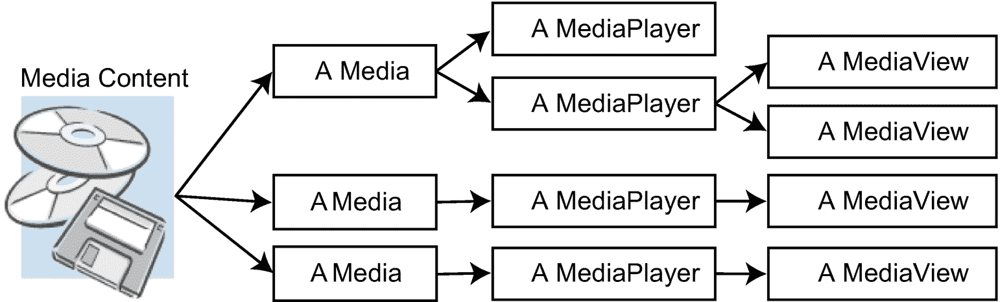
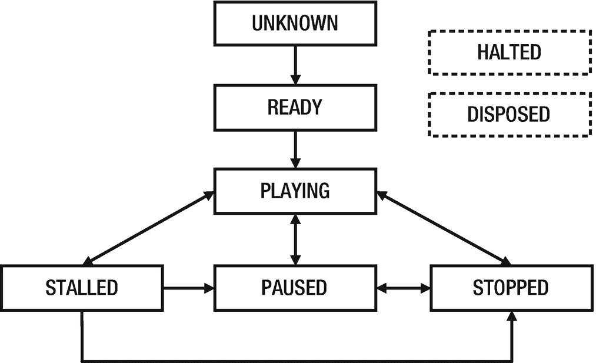

# 25.播放音频和视频

在本章中，您将学习:

*   什么是媒体 API

*   如何播放简短的音频剪辑

*   如何播放媒体(音频和视频)以及如何跟踪播放的不同方面，如播放速率、音量、播放时间、重复播放和媒体错误

本章的例子在`com.jdojo.media`包中。为了让它们工作，您必须在`module-info.java`文件中添加相应的一行:

```java
...
opens com.jdojo.media to javafx.graphics, javafx.base;
...

```

## 了解媒体 API

JavaFX 支持通过 JavaFX Media API 播放音频和视频。还支持静态媒体文件和实时提要的 HTTP 实时流。支持多种媒体格式，包括 AAC、AIFF、WAV 和 MP3。还支持包含 VP6 视频和 MP3 音频的 FLV 以及 H.264/AVC 视频格式的 MPEG-4 多媒体容器。对特定媒体格式的支持取决于平台。某些媒体播放功能和格式不需要任何额外安装；有些需要安装第三方软件。有关 JavaFX 的系统要求和支持的媒体格式的详细信息，请参考位于 [`https://openjfx.io/javadoc/17/javafx.media/javafx/scene/media/package-summary.html#SupportedMediaTypes`](https://openjfx.io/javadoc/17/javafx.media/javafx/scene/media/package-summary.html%2523SupportedMediaTypes) 的网页。

媒体 API 由几个类组成。图 [25-1](#Fig1) 显示了一个类图，它只包括媒体 API 中的核心类。API 中的所有类都包含在`javafx.scene.media`包中。


图 25-1

媒体 API 中核心类的类图

`AudioClip`用于以最小的延迟播放一小段音频剪辑。通常，这对于声音效果很有用，声音效果通常是很短的音频剪辑。使用`Media`、`MediaPlayer`和`MediaView`类播放较长的音频和视频。

`Media`和`MediaPlayer`类用于播放音频和视频。`Media`类的一个实例代表一个媒体资源，可以是音频或视频。它提供有关介质的信息，例如介质的持续时间。`MediaPlayer`类的一个实例提供了播放媒体的控件。

`MediaView`类的一个实例提供了由`MediaPlayer`播放的媒体的视图。一个`MediaView`用于观看视频。

当您尝试播放媒体时，可能会出现一些问题，例如，媒体格式可能不受支持，或者媒体内容可能已损坏。`MediaException`类的一个实例表示在媒体回放期间可能发生的特定类型的媒体错误。当出现与介质相关的错误时，会生成一个`MediaErrorEvent`。您可以通过向媒体对象添加适当的事件处理程序来处理该错误。

我将在这一章中详细介绍如何在媒体 API 中使用这些类和其他支持类。

## 播放短音频剪辑

`AudioClip`类的一个实例用于以最小的延迟播放一小段音频剪辑。通常，这对于播放简短的音频剪辑很有用，例如，当用户出错时发出嘟嘟声，或者在游戏应用程序中产生简短的声音效果。

`AudioClip`类只提供了一个构造器，它接受一个字符串形式的 URL，即音频源的 URL。音频剪辑会立即以原始、未压缩的形式加载到内存中。这就是为什么您不应该将此类用于长时间播放的音频剪辑的原因。源 URL 可以使用 HTTP、file 和 JAR 协议。这意味着您可以播放来自互联网、本地文件系统和 JAR 文件的音频剪辑。

以下代码片段使用 HTTP 协议创建了一个`AudioClip`:

```java
String clipUrl = "http://www.jdojo.com/myaudio.wav";
AudioClip audioClip = new AudioClip(clipUrl);

```

当一个`AudioClip`对象被创建时，音频数据被加载到内存中，并准备好立即播放。使用`play()`方法播放音频，使用`stop()`方法停止播放:

```java
// Play the audio
audioClip.play();
...
// Stop the playback

audioClip.stop();

```

清单 [25-1](#PC4) 中的程序展示了如何使用`AudioClip`类播放一个音频剪辑。它声明了一个实例变量来存储`AudioClip`引用。在`init()`方法中创建了`AudioClip`,以确保当窗口在`start()`方法中显示时，剪辑可以播放。您也可以在构造器中创建`AudioClip`。`start()`方法增加了开始和停止按钮。它们的动作事件处理程序分别开始和停止回放。

```java
// AudioClipPlayer.java
package com.jdojo.media;

import com.jdojo.util.ResourceUtil;
import java.net.URL;
import javafx.application.Application;
import javafx.scene.Scene;
import javafx.scene.control.Button;
import javafx.scene.layout.HBox;
import javafx.scene.media.AudioClip;
import javafx.stage.Stage;

public class AudioClipPlayer extends Application {
        private AudioClip audioClip;

        public static void main(String[] args) {
            Application.launch(args);
        }

        @Override
        public void init() {
                URL mediaUrl =
                    ResourceUtil.getResourceURL("media/chimes.wav");

            // Create an AudioClip, which loads the audio data
                // synchronously
            audioClip = new AudioClip(mediaUrl.toExternalForm());
        }

        @Override

        public void start(Stage stage) {
            Button playBtn = new Button("Play");
            Button stopBtn = new Button("Stop");

            // Set event handlers for buttons
            playBtn.setOnAction(e -> audioClip.play());
            stopBtn.setOnAction(e -> audioClip.stop());

            HBox root = new HBox(5, playBtn, stopBtn);
            root.setStyle("-fx-padding: 10;");
            Scene scene = new Scene(root);
            stage.setScene(scene);
            stage.setTitle("Playing Short Audio Clips");
            stage.show();
        }
}

Listing 25-1Playing Back an Audio Clip Using an AudioClip Instance

```

`AudioClip`类支持在播放剪辑时设置一些音频属性:

*   `cycleCount`

*   `volume`

*   `rate`

*   `balance`

*   `pan`

*   `priority`

除了`cycleCount`之外，前面的所有属性都可以在`AudioClip`类上设置。`S`对`play()`方法的后续调用将使用它们作为默认值。`play()`方法也可以覆盖特定回放的缺省值。必须在`AudioClip`上指定`cycleCount`属性，所有后续回放将使用相同的值。

`The cycleCount`指定调用`play()`方法时剪辑播放的次数。它默认为一个，只播放一次剪辑。您可以使用以下三个`INDEFINITE`常量之一作为`cycleCount`来播放`AudioClip`循环，直到停止:

*   `AudioClip.INDEFINITE`

*   `MediaPlayer.INDEFINITE`

*   `Animation.INDEFINITE`

以下代码片段显示了如何无限期地播放一个音频剪辑五次:

```java
// Play five times
audioClip.setCycleCount(5);
...
// Loop forever
audioClip.setCycleCount(AudioClip.INDEFINITE);

```

`volume`指定播放的相对音量。有效范围是 0.0 到 1.0。值 0.0 表示静音，而 1.0 表示最大音量。

`rate`指定播放音频的相对速度。有效范围是 0.125 到 8.0。值 0.125 表示剪辑播放速度慢八倍，值 8.0 表示剪辑播放速度快八倍。速率影响播放时间和音高。默认速率为 1.0，以正常速率播放剪辑。

`balance`指定左右声道的相对音量。有效范围是–1.0 到 1.0。值–1.0 将左声道的回放设定为正常音量，并将右声道静音。值 1.0 将右声道的回放设置为正常音量，并将左声道静音。默认值为 0.0，将两个通道中的回放设置为正常音量。

`pan`指定剪辑在左右声道之间的分布。有效范围是–1.0 到 1.0。值为–1.0 会将片段完全移到左通道。值为 1.0 会将剪辑完全移到右通道。默认值为 0.0，正常播放剪辑。设定单声道片段的声相值与设定平衡效果相同。您应该仅为使用立体声的音频剪辑更改此属性的默认值。

`priority`指定片段相对于其他片段的优先级。它仅在播放的剪辑数量超过系统限制时使用。将停止播放优先级较低的剪辑。它可以设置为任何整数。默认优先级设置为零。

`play()`方法被重载。它有三个版本:

*   `Void play()`

*   `void play(double volume)`

*   `void play(double volume, double balance, double rate, double pan, int priority)`

该方法的无参数版本使用在`AudioClip`上设置的所有属性。其他两个版本可以覆盖特定回放的指定属性。假设`AudioClip`的音量设置为 1.0。调用`play()`会以 1.0 的音量播放剪辑，调用`play(0.20)`会以 0.20 的音量播放剪辑，而`AudioClip`的音量属性保持为 1.0 不变。也就是说，带有参数的`play()`方法允许您在每次回放的基础上覆盖`AudioClip`属性。

`AudioClip`类包含一个`isPlaying()`方法来检查剪辑是否还在播放。如果剪辑正在播放，它将返回`true`。否则返回`false`。

## 播放媒体

JavaFX 提供了一个统一的 API 来处理音频和视频。您使用相同的类来处理这两者。媒体 API 在内部将它们视为对 API 用户透明的两种不同类型的媒体。从现在开始，我将使用术语媒体来表示音频和视频，除非另有说明。

媒体 API 包含三个播放媒体的核心类:

*   `Media`

*   `MediaPlayer`

*   `MediaView`

### 创建媒体对象

`Media`类的一个实例代表一个媒体资源，可以是音频或视频。它提供与媒体相关的信息，例如持续时间、元数据、数据等等。如果媒体是视频，则提供视频的宽度和高度。一个`Media`对象是不可变的。它是通过提供媒体资源的字符串 URL 来创建的，如以下代码所示:

```java
// Create a Media
String mediaUrl = "http://www.jdojo.com/mymusic.wav";
Media media = new Media(mediaUrl);

```

`Media`类包含以下属性，所有属性(除了`onError`)都是只读的:

*   `duration`

*   `width`

*   `height`

*   `error`

*   `onError`

`duration`以秒为单位指定媒体的持续时间。它是一个`Duration`对象。如果持续时间未知，则为`Duration.UNKNOWN`。

`width`和`height`分别以像素为单位给出源媒体的宽度和高度。如果媒体没有宽度和高度，它们被设置为零。

`error`和`onError`属性是相关的。`error`属性代表加载媒体时发生的`MediaException`。`onError`是一个`Runnable`对象，您可以设置它在错误发生时得到通知。发生错误时调用`Runnable`的`run()`方法:

```java
// When an error occurs in loading the media, print it on the console
media.setOnError(() -> System.out.println(player.getError().getMessage()));

```

### 创建一个 *MediaPlayer* 对象

`MediaPlayer`提供控制，例如播放、暂停、停止、搜索、播放速度、音量调节，用于播放媒体。`MediaPlayer`只提供了一个接受`Media`对象作为参数的构造器:

```java
// Create a MediaPlayer
MediaPlayer player = new MediaPlayer(media);

```

你可以使用`MediaPlayer`类的`getMedia()`方法从`MediaPlayer`中获取媒体的引用。

像`Media`类一样，`MediaPlayer`类也包含用于报告错误的`error`和`onError`属性。当`MediaPlayer`出现错误时，`Media`对象也会报告同样的错误。

`MediaPlayer`类包含许多属性和方法。我将在随后的章节中讨论它们。

### 创建一个*媒体视图*节点

一个`MediaView`是一个节点。它提供了由`MediaPlayer`播放的媒体的视图。请注意，音频剪辑没有视觉效果。如果你尝试为一个音频内容创建一个`MediaView`，它将是空的。要观看视频，您需要创建一个`MediaView`并将其添加到场景图中。

`MediaView`类提供了两个构造器，一个是无参数构造器，另一个以`MediaPlayer`作为参数:

*   `public MediaView()`

*   `public MediaView(MediaPlayer mediaPlayer)`

无参数构造器创建一个附加到任何`MediaPlayer`的`MediaView`。您需要使用`mediaPlayer`属性的 setter 来设置一个`MediaPlayer`:

```java
// Create a MediaView with no MediaPlayer
MediaView mediaView = new MediaView();
mediaView.setMediaPlayer(player);

```

另一个构造器让您为`MediaView`指定一个`MediaPlayer`:

```java
// Create a MediaView
MediaView mediaView = new MediaView(player);

```

### 结合*媒体*、*媒体播放器*和*媒体视图*

一个媒体的内容可以被多个`Media`对象同时使用。然而，一个`Media`对象在其生命周期中只能与一个媒体内容相关联。

一个`Media`对象可以与多个`MediaPlayer`对象相关联。然而，一只`MediaPlayer`在其一生中只与一只`Media`相关联。

一个`MediaView`可以可选地与一个`MediaPlayer`相关联。当然，与`MediaPlayer`无关的`MediaView`没有任何视觉效果。可以更改`MediaView`的`MediaPlayer`。改变`MediaView`的`MediaPlayer`类似于改变电视频道。`MediaView`的视图由其当前的`MediaPlayer`提供。您可以将同一个`MediaPlayer`与多个`MediaViews`相关联。不同的`MediaViews`在播放过程中可能会显示同一媒体的不同部分。图 [25-2](#Fig2) 显示了媒体播放中涉及的三类对象之间的关系。



图 25-2

不同媒体相关对象在媒体回放中的角色以及它们之间的关系

## 媒体播放器示例

现在，您已经有足够的背景知识来理解用于播放音频和视频的机制。清单 [25-2](#PC11) 中的程序使用`ResourceUtil`查找文件位置来播放视频剪辑。程序使用一个视频文件`resources/media/gopro.mp4`。这个文件可能没有包含在源代码中，因为它大约有 50MB。如果 JavaFX 支持您自己的媒体文件格式，您可以在此程序中替换它。

```java
// QuickMediaPlayer.java
package com.jdojo.media;

import com.jdojo.util.ResourceUtil;
import java.net.URL;
import javafx.application.Application;
import javafx.scene.Scene;
import javafx.scene.control.Button;
import javafx.scene.layout.BorderPane;
import javafx.scene.layout.HBox;
import javafx.scene.media.Media;
import javafx.scene.media.MediaPlayer;
import javafx.scene.media.MediaView;
import javafx.stage.Stage;
import static javafx.scene.media.MediaPlayer.Status.PLAYING;

public class QuickMediaPlayer extends Application {
        public static void main(String[] args) {
            Application.launch(args);
        }

        @Override
        public void start(Stage stage) {
            // Locate the media content
                URL mediaUrl = ResourceUtil.getResourceURL("media/gopro.mp4");
            String mediaStringUrl = mediaUrl.toExternalForm();

            // Create a Media
            Media media = new Media(mediaStringUrl);

            // Create a Media Player
            MediaPlayer player = new MediaPlayer(media);

            // Automatically begin the playback
            player.setAutoPlay(true);

            // Create a 400X300 MediaView
            MediaView mediaView = new MediaView(player);
            mediaView.setFitWidth(400);
            mediaView.setFitHeight(300);

            // Create Play and Stop player control buttons and add action
            // event handlers to them
            Button playBtn = new Button("Play");
            playBtn.setOnAction(e -> {
                    if (player.getStatus() == PLAYING) {
                            player.stop();
                            player.play();
                    } else {
                            player.play();
                    }

            });

            Button stopBtn = new Button("Stop");
            stopBtn.setOnAction(e -> player.stop());

            // Add an error handler
            player.setOnError(() ->
                    System.out.println(player.getError().getMessage()));

            HBox controlBox = new HBox(5, playBtn, stopBtn);
            BorderPane root = new BorderPane();

            // Add the MediaView and player controls to the scene graph
            root.setCenter(mediaView);
            root.setBottom(controlBox);

            Scene scene = new Scene(root);
            stage.setScene(scene);
            stage.setTitle("Playing Media");
            stage.show();
        }
}

Listing 25-2Using the Media, MediaPlayer, and MediaView Classes to Play a Media

```

`start()`方法中的前两条语句为媒体文件准备了一个字符串 URL:

```java
// Locate the media content
URL mediaUrl = ResourceUtil.getResourceURL("media/gopro.mp4");
String mediaStringUrl = mediaUrl.toExternalForm();

```

如果您想播放来自 Internet 的媒体，您可以用类似下面的语句替换这三个语句:

```java
String mediaStringUrl = "http://www.jdojo.com/video.flv";

```

程序创建一个`Media`、一个`MediaPlayer`和一个`MediaView`。它将`MediaPlayer`的`autoPlay`属性设置为 true，这将尽快开始播放媒体:

```java
// Automatically begin the playback
player.setAutoPlay(true);

```

`MediaView`的尺寸设定为 400 像素宽 300 像素高。如果媒体是视频，视频将被缩放以适合此大小。你会看到一个空的音频区。您可以稍后增强`MediaView`,这样它将占用媒体所需的空间。

创建了`Play`和`Stop`按钮。事件处理程序被添加到它们中。它们可以分别用于开始和停止播放。当媒体已经在播放时，点按“播放”按钮会停止播放并再次播放媒体。

播放媒体时，很多事情都会出错。程序为`MediaPlayer`设置`onError`属性，T1 是一个`Runnable`。它的`run()`方法在错误发生时被调用。`run()`方法在控制台上打印错误消息:

```java
// Add an error handler

player.setOnError(() -> System.out.println(player.getError().getMessage()));

```

当你运行程序时，视频应该会自动播放。您可以使用屏幕底部的按钮停止和重放它。如果有错误，您将在控制台上看到一条错误消息。

Tip

类可以播放音频和视频。你所需要做的就是改变源的 URL 来指向你想要播放的媒体。

## 处理回放错误

从`RuntimeException`类继承而来的`MediaException`类的一个实例表示一个可能发生在`Media`、`MediaPlayer`和`MediaView`中的媒体错误。媒体播放可能由于多种原因而失败。API 用户应该能够识别特定的错误。`MediaException`类定义了一个静态枚举`MediaException.Type`，其常量标识了错误的类型。`MediaException`类包含一个`getType()`方法，该方法返回`MediaException.Type`枚举的一个常量。

*   `MEDIA_CORRUPTED`

*   `MEDIA_INACCESSIBLE`

*   `MEDIA_UNAVAILABLE`

*   `MEDIA_UNSPECIFIED`

*   `MEDIA_UNSUPPORTED`

*   `OPERATION_UNSUPPORTED`

*   `PLAYBACK_HALTED`

*   `PLAYBACK_ERROR`

*   `UNKNOWN`

`MEDIA_CORRUPTED`错误类型表示介质损坏或无效。`MEDIA_INACCESSIBLE`错误类型表示介质不可访问。但是，媒体可能存在。`MEDIA_UNAVAILABLE`错误类型表示介质不存在或不可用。`MEDIA_UNSPECIFIED`错误类型表示尚未指定介质。`MEDIA_UNSUPPORTED`错误类型表示该平台不支持该媒体。`OPERATION_UNSUPPORTED`错误类型表示平台不支持在介质上执行的操作。`PLAYBACK_HALTED`错误类型表示停止播放的不可恢复的错误。`PLAYBACK_ERROR`错误类型表示不属于任何其他描述类别的回放错误。`UNKNOWN`错误类型表示发生了未知错误。

`Media`和`MediaPlayer`类包含一个属于`MediaException`的`error`属性。所有三个类——`Media`、`MediaPlayer`和`MediaView`——都包含一个`onError`属性，这是一个在发生错误时调用的事件处理程序。这些类中的`onError`属性的类型不一致。对于`Media`和`MediaPlayer`类是一个`Runnable`，对于`MediaView`类是一个`MediaErrorEvent`。下面的代码片段显示了如何处理`Media`、`MediaPlayer`和`MediaView`上的错误。他们在控制台上打印错误详细信息:

```java
player.setOnError(() -> {
        System.out.println(player.getError().getMessage());
});

media.setOnError(() -> {
        System.out.println(player.getError().getMessage());
});

mediaView.setOnError((MediaErrorEvent e) ->  {
        MediaException error = e.getMediaError();
        MediaException.Type errorType = error.getType();
        String errorMsg = error.getMessage();
        System.out.println("Error Type:" + errorType +
              ", error mesage:" + errorMsg);
});

```

在 JavaFX 应用程序线程上调用媒体错误处理程序。因此，从处理程序更新场景图是安全的。

建议您将`Media`、`MediaPlayer`和`MediaView`对象的创建放在`try-catch`块中，并适当地处理异常。这些对象的`onError`处理程序在对象被创建后被涉及。如果在创建这些对象的过程中出现错误，这些处理程序将不可用。例如，如果您尝试使用的媒体类型不受支持，创建`Media`对象会导致错误:

```java
try {
        Media media = new Media(mediaStringUrl);
        ...
}
catch (MediaException e) {
        // Handle errors here
}

```

## *媒体播放器*的状态转换

一个`MediaPlayer`总有一个状态。只读的`status`属性表示`MediaPlayer`的当前状态。在`MediaPlayer`上执行动作时，状态会改变。它不能直接设置。`MediaPlayer`的状态由`MediaPlayer.Status`枚举中的八个常量之一定义:

*   `UNKNOWN`

*   `READY`

*   `PLAYING`

*   `PAUSED`

*   `STALLED`

*   `STOPPED`

*   `HALTED`

*   `DISPOSED`

当调用以下方法之一时，`MediaPlayer`从一种状态转换到另一种状态:

*   `play()`

*   `pause()`

*   `stop()`

*   `dispose()`

图 [25-3](#Fig3) 显示了一个`MediaPlayer`的状态转换。图 [25-3](#Fig3) 不包括`HALTED`和`DISPOSED`状态，因为这两种状态都是终端状态。



图 25-3

媒体播放器的状态及其转换

当`MediaPlayer`被创建时，其状态为`UNKNOWN`。一旦媒体被预卷并准备好播放，`MediaPlayer`从`UNKNOWN`转换到`READY`。一旦`MediaPlayer`退出`UNKNOWN`状态，在其生命周期内就不能重新进入。

当调用`play()`方法时，`MediaPlayer`转换到`PLAYING`状态。此状态表示媒体正在播放。注意如果`autoPlay`属性设置为 true，`MediaPlayer`可能在创建后不需要显式调用`play()`方法就可以进入`PLAYING`状态。

当`MediaPlayer`正在播放时，如果它的缓冲区中没有足够的数据可以播放，它可能会进入`STALLED`状态。该状态表示`MediaPlayer`正在缓冲数据。当足够的数据被缓冲时，它回到`PLAYING`状态。当一个`MediaPlayer`被停止时，调用`pause()`和`stop()`方法，它分别转换到`PAUSED`和`STOPPED`状态。在这种情况下，缓冲继续进行；然而，一旦缓冲了足够的数据，`MediaPlayer`不会转换到`PLAYING`状态。而是停留在`PAUSED`或`STOPPED`状态。

调用`pause()`方法将`MediaPlayer`转换到`PAUSED`状态。调用`stop()`方法将`MediaPlayer`转换到`STOPPED`状态。

如果出现不可恢复的错误，`MediaPlayer`转换到`HALTED`终端状态。该状态表示`MediaPlayer`不能再次使用。如果您想再次播放媒体，您必须创建一个新的`MediaPlayer`。

`dispose()`方法释放所有与`MediaPlayer`相关的资源。然而，`MediaPlayer`使用的`Media`对象仍然可以使用。调用`dispose()`方法将`MediaPlayer`转换到终端状态`DISPOSED`。

在应用程序中显示`MediaPlayer`的状态是很常见的。向 status 属性添加一个`ChangeListener`来监听任何状态变化。

通常，当`MediaPlayer`的状态改变时，您会对收到通知感兴趣。有两种方法可以获得通知:

*   通过向状态属性添加一个`ChangeListener`

*   通过设置状态更改处理程序

如果您对监听任何类型的状态变化感兴趣，第一种方法是合适的。以下代码片段展示了这种方法:

```java
MediaPlayer player = new MediaPlayer(media);

// Add a ChangeListener to the player
player.statusProperty().addListener((prop, oldStatus, newStatus) -> {
        System.out.println("Status changed from " + oldStatus +
               " to " + newStatus);
});

```

如果您对处理特定类型的状态更改感兴趣，第二种方法是合适的。`MediaPlayer`类包含以下可设置为`Runnable`对象的属性:

*   `onReady`

*   `onPlaying`

*   `onRepeat`

*   `onStalled`

*   `onPaused`

*   `onStopped`

*   `onHalted`

当`MediaPlayer`进入特定状态时，调用`Runnable`对象的`run()`方法。例如，当玩家进入`PLAYING`状态时，调用`onPlaying`处理程序的`run()`方法。以下代码片段显示了如何为特定类型的状态更改设置处理程序:

```java
// Add a handler for PLAYING status
player.setOnPlaying(() -> {
        System.out.println("Playing...");
});

// Add a handler for STOPPED status
player.setOnStopped(() -> {
        System.out.println("Stopped...");
});

```

## 重复媒体播放

媒体可以重复播放指定的次数，甚至可以无限期播放。`cycleCount`属性指定回放将被重复的次数。默认情况下，它被设置为 1。将其设置为`MediaPlayer.INDEFINITE`可无限重复播放，直到播放器暂停或停止播放。只读的`currentCount`属性被设置为已完成的播放周期数。当媒体正在播放第一个循环时，它被设置为零。在第一个周期结束时，它被设置为 1；它在第二个周期结束时增加到 2；等等。以下代码将设置四次回放周期:

```java
// The playback should repeat 4 times
player.setCycleCount(4);

```

当播放周期的媒体结束时，您会收到通知。为`MediaPlayer`类的`onEndOfMedia p`属性设置一个`Runnable`来获取通知。注意，如果回放持续四个周期，媒体结束通知将被发送四次:

```java
player.setOnEndOfMedia(() -> {
        System.out.println("End of media...");
});

```

您可以添加一个`onRepeat`事件处理程序，当一个回放周期的媒体结束并且回放将要重复时，将调用该事件处理程序。它在`onEndOfMedia`事件处理程序之后被调用:

```java
player.setOnRepeat(() -> {
        System.out.println("Repeating...");
});

```

## 跟踪媒体时间

显示媒体持续时间和播放所用的时间对观众来说是一个重要的反馈。很好地理解这些持续时间类型对于开发一个好的媒体播放仪表板是很重要的。不同类型的持续时间可以与媒体相关联:

*   媒体播放的当前持续时间

*   媒体播放的持续时间

*   媒体播放一个周期的持续时间

*   开始偏移时间

*   结束偏移时间

默认情况下，媒体按其原始持续时间播放。例如，如果媒体的持续时间为 30 分钟，则媒体将在一个循环中播放 30 分钟。`MediaPlayer`让您指定回放的长度，可以是媒体持续时间中的任何时间。例如，对于每个回放周期，您可以指定只播放媒体的中间 10 分钟(第 11 到第 12 分钟)。媒体播放的长度由`MediaPlayer`类的以下两个属性指定:

*   `startTime`

*   `stopTime`

这两个属性都属于`Duration`类型。`startTime`和`stopTime`分别是媒体在每个周期开始和停止播放的时间偏移量。默认情况下，`startTime`设置为`Duration.ZERO`，而`stopTime`设置为媒体的持续时间。以下代码片段设置了这些属性，因此媒体将从第 10 分钟播放到第 21 分钟:

```java
player.setStartTime(Duration.minutes(10));
player.setStartTime(Duration.minutes(21));

```

以下限制适用于`startTime`和`stopTime`值:

```java
0 ≤ startTime < stopTime
startTime < stopTime ≤ Media.duration

```

只读的`currentTime`属性是媒体播放中的当前时间偏移。只读的`cycleDuration`属性是`stopTime`和`startTime`的区别。它是每个循环的播放长度。`The`只读`totalDuration`属性指定播放的总持续时间，如果播放被允许继续直到结束。它的值是`cycleDuration`乘以`cycleCount`。如果`cycleCount`为`INDEFINITE`，则`totalDuration`为`INDEFINITE`。如果媒体持续时间为`UNKNOWN`，则`totalDuration`将为`UNKNOWN`。

当您从网络播放媒体时，`MediaPlayer`可能会因为没有足够的数据继续播放而停止。只读的`bufferProgressTime`属性给出了媒体可以不间断播放的持续时间。

## 控制回放速率

`MediaPlayer`的`rate`属性指定回放的速率。有效范围是 0.0 到 8.0。例如，2.0 的`rate`播放媒体的速度是正常速度的两倍。默认值为 1.0，以正常速率播放媒体。只读的`currentRate`属性是回放的当前速率。以下代码会将速率设置为正常速率的三倍:

```java
// Play the media at 3x
player.setRate(3.0);

```

## 控制播放音量

`MediaPlayer`类中的三个属性控制媒体中音频的音量:

*   `volume`

*   `mute`

*   `balance`

`volume`指定音频的音量。范围是 0.0 到 1.0。值为 0.0 会使音频听不见，而值为 1.0 会以最大音量播放。默认值为 1.0。

`mute`指定音频是否由`MediaPlayer`产生。默认情况下，其值为 false，并产生音频。将其设置为 true 不会产生音频。请注意，设置`mute`属性不会影响`volume`属性。假设`volume`设置为 1.0，静音设置为真。没有产生音频。当`mute`设置为 false 时，音频将使用 1.0 的`volume`属性，并以最大音量播放。以下代码将音量设置为一半:

```java
// Play the audio at half the full volumne
player.setVolumne(0.5);
...
// Mute the audio
player.setMute(true)

```

`balance`指定左右声道的相对音量。有效范围是–1.0 到 1.0。值–1.0 将左声道的回放设定为正常音量，并将右声道静音。值 1.0 将右声道的回放设置为正常音量，并将左声道静音。默认值为 0.0，将两个通道中的回放设置为正常音量。

## 定位*媒体播放器*

您可以使用`seek(Duration position)`方法将`MediaPlayer`定位在特定的回放时间:

```java
// Position the media at the fifth minutes play time
player.seek(Duration.minutes(5.0));

```

调用`seek()`方法没有任何效果，如果

*   `MediaPlayer`处于`STOPPED`状态。

*   媒体持续时间为`Duration.INDEFINITE`。

*   您将`null`或`Duration.UNKNOWN`传递给`seek()`方法。

*   在所有其他情况下，该位置被夹在`MediaPlayer`的`startTime`和`stopTime`之间。

## 在媒体上标记位置

您可以将标记与媒体时间线上的特定点相关联。标记是简单的文本，在许多方面都很有用。你可以用它们来插入广告。例如，您可以插入 URL 作为标记文本。当到达标记时，您可以暂停播放媒体并播放另一个媒体。注意，播放另一个媒体需要创建新的`Media`和`MediaPlayer`对象。你可以重用一个`MediaView`。播放广告视频时，将`MediaView`与新的`MediaPlayer`联系起来。广告播放结束后，将`MediaView`重新关联到主`MediaPlayer`。

`Media`类包含一个返回`ObservableMap<String, Duration>`的`getMarkers()`方法。您需要在地图中添加(键，值)对来添加标记。以下代码片段向媒体添加了三个标记:

```java
Media media = ...
ObservableMap<String, Duration> markers = media.getMarkers();
markers.put("START", Duration.ZERO);
markers.put("INTERVAL", media.getDuration().divide(2.0));
markers.put("END", media.getDuration());

```

当到达一个标记时，`MediaPlayer`触发一个`MediaMarkerEvent`。您可以在`MediaPlayer`的`onMarker`属性中为该事件注册一个处理程序。下面的代码片段显示了如何处理`MediaMarkerEvent`。事件的`getMarker()`方法返回一个`Pair<String, Duration>`，其键和值分别是标记文本和标记持续时间:

```java
// Add a marker event handler
player.setOnMarker((MediaMarkerEvent e) -> {
        Pair<String, Duration> marker = e.getMarker();
        String markerText = marker.getKey();
        Duration markerTime = marker.getValue();
        System.out.println("Reached the marker " + markerText +
               " at " + markerTime);
});

```

## 显示媒体元数据

一些元数据可以被嵌入到描述媒体的媒体中。通常，元数据包含标题、艺术家姓名、专辑名称、流派、年份等等。下面的代码片段显示了当`MediaPlayer`进入`READY`状态时媒体的元数据。不要试图在创建`Media`对象后立即读取元数据，因为元数据可能不可用:

```java
Media media = ...
MediaPlayer player = new MediaPlayer(media);

// Display the metadata data on the console
player.setOnReady(() -> {
        ObservableMap<String, Object> metadata = media.getMetadata();
        for(String key : metadata.keySet()) {
            System.out.println(key + " = " + metadata.get(key));
        }
});

```

您无法确定媒体中是否有元数据或媒体可能包含的元数据类型。在您的应用程序中，您可以只查找标题、艺术家、专辑和年份。或者，您可以读取所有元数据，并在两列表中显示它们。有时，元数据可能包含艺术家的嵌入图像。您需要检查映射中值的类名才能使用该图像。

## 定制*媒体视图*

如果媒体有视图(如视频)，您可以使用以下属性自定义视频的大小、区域和质量:

*   `fitHeight`

*   `fitWidth`

*   `preserveRatio`

*   `smooth`

*   `viewport`

*   `x`

*   `y`

`fitWidth`和`fitHeight`属性分别指定调整后的视频宽度和高度。默认情况下，它们为零，这意味着将使用媒体的原始宽度和高度。

属性指定在调整大小时是否保留媒体的纵横比。默认情况下，它是假的。

`smooth`属性指定在调整视频大小时使用的过滤算法的质量。默认值取决于平台。如果设置为 true，则使用质量更好的过滤算法。请注意，质量较好的过滤需要更多的处理时间。对于较小的视频，您可以将其设置为 false。对于较大的视频，建议将该属性设置为 true。

视口是一个矩形区域，用于查看图形的一部分。通过`viewport`、`x`和`y`属性，您可以指定将在`MediaView`中显示的视频中的矩形区域。视口是在原始媒体帧的坐标系中指定的`Rectangle2D`。`x`和`y`属性是视口左上角的坐标。回想一下，一个`MediaPlayer`可以关联多个`MediaViews`。将多个`MediaViews`与视口一起使用，可以给观众分割视频的印象。使用一个带有视窗的`MediaView`，你可以让观众只看到视频可视区域的一部分。

一个`MediaView`是一个节点。因此，为了给观众更好的视觉体验，还可以对`MediaView`应用效果和变换。

## 开发媒体播放器应用程序

开发一个好看的、可定制的媒体播放器应用程序需要仔细的设计。我已经介绍了 JavaFX 中媒体 API 提供的大部分特性。结合开发用户界面和媒体 API 的知识，您可以设计和开发自己的媒体播放器应用程序。开发应用程序时，请记住以下几点:

*   应用程序应该能够指定媒体源。

*   应用程序应该提供一个 UI 来控制媒体播放。

*   当媒体源改变时，您将需要创建一个新的`Media`对象和一个`MediaPlayer`。您可以通过使用`setMediaPlayer()`方法设置新的`MediaPlayer`来重用`MediaView`。

## 摘要

JavaFX 支持通过 JavaFX Media API 播放音频和视频。还支持静态媒体文件和实时提要的 HTTP 实时流。支持多种媒体格式，如 AAC、AIFF、WAV 和 MP3。支持包含 VP6 视频和 MP3 音频的 FLV 以及 H.264/AVC 视频格式的 MPEG-4 多媒体容器。对特定媒体格式的支持取决于平台。某些媒体播放功能和格式不需要任何额外安装；但是有些需要安装第三方软件。媒体 API 由几个类组成。API 中的所有类都包含在`javafx.scene.media`包中。

一个`AudioClip`用于以最小的延迟播放一个短的音频剪辑。通常，这对于声音效果很有用，声音效果通常是很短的音频剪辑。使用`Media`、`MediaPlayer`和`MediaView`类播放较长的音频和视频。

`Media`和`MediaPlayer`类用于播放音频和视频。`Media`类的一个实例代表一个媒体资源，可以是音频或视频。它提供有关介质的信息，例如介质的持续时间。`MediaPlayer`类的一个实例提供了播放媒体的控件。一个`MediaPlayer`总是指示播放的状态。只读的`status`属性表示`MediaPlayer`的当前状态。当在`MediaPlayer`上执行一个动作时`status`改变。状态可以是未知、就绪、正在播放、暂停、停止、停止或已处置。

`MediaView`类的一个实例提供了由`MediaPlayer`播放的媒体的视图。一个`MediaView`用于观看视频。

当您尝试播放媒体时，可能会出现一些问题，例如，媒体格式可能不受支持，或者媒体内容可能已损坏。`MediaException`类的一个实例表示在媒体回放期间可能发生的特定类型的媒体错误。当出现与介质相关的错误时，会生成一个`MediaErrorEvent`。您可以通过向媒体对象添加适当的事件处理程序来处理该错误。

下一章将讨论 FXML，这是一种基于 XML 的语言，用于为 JavaFX 应用程序构建用户界面。