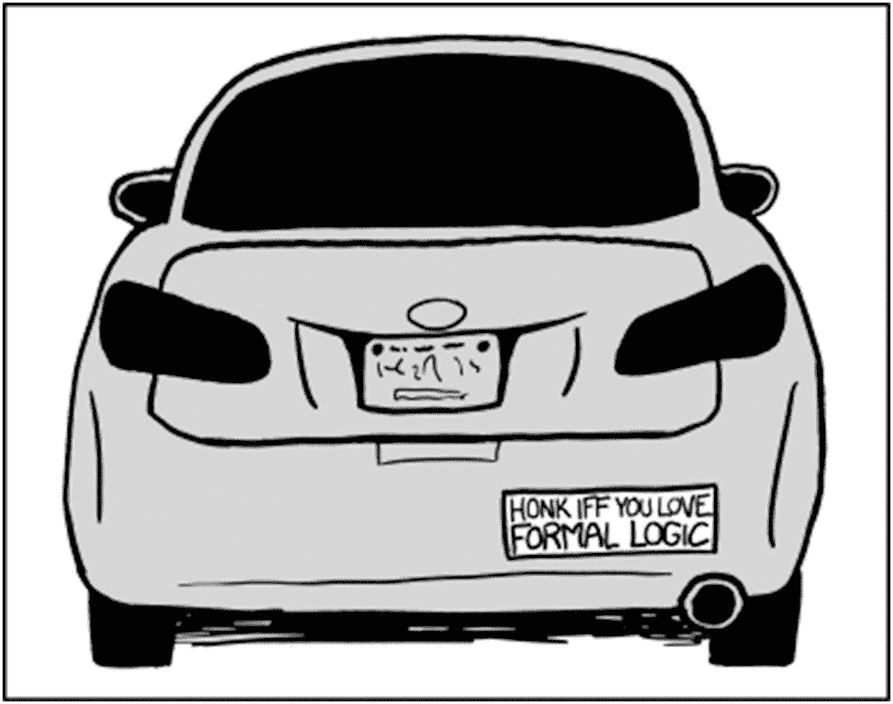

# 6.条件句和循环

为了超越*计算器*的标签，编程语言必须有条件语句和循环。

*条件语句*是一个根据具体情况可能执行也可能不执行的语句。

一个*循环*是一个被重复多次的语句。

## 如果，那么，别的

最基本的条件语句是`if`语句。只有给定的条件为真时，它才执行一些代码。这在本书涉及的所有语言中都是一样的。例如:

```
1   if (vampire) { // vampire is a boolean
2           useWoodenStake();
3   }

```

*花括号* ( `{}`)定义了一个代码块(在 Java、Scala、Groovy 和 JavaScript 中)。为了定义如果你的条件是`false`会发生什么，你可以使用`else`关键字。

```
1   if (vampire) {
2           useWoodenStake();
3   } else {
4           useAxe();
5   }

```

实际上，这可以缩短，因为在这种情况下，每个条件只有一个语句。

```
1   if (vampire) useWoodenStake();
2   else useAxe();

```

一般来说，最好在 Java 中使用花括号风格，以避免以后当另一个程序员添加更多代码时出现任何意外。如果您有多个条件需要测试，您可以使用`else if`样式，如下所示:

```
1   if  (vampire) useWoodenStake();
2   else if (zombie) useBat();
3   else useAxe();

```

## Switch 语句

有时候你有太多的条件，以至于你的`else if`语句跨越了好几页。在这种情况下，您可以考虑使用`switch`关键字。它允许你测试同一个变量的几个不同的值。例如:

```
1   switch (monsterType) {
2   case "Vampire": useWoodenStake(); break;
3   case "Zombie": useBat(); break;
4   case "Orc": shoutInsult();
5   default: useAxe();
6   }

```

`case`关键字表示要匹配的值。

`break`关键字总是导致程序退出当前代码块。这在`switch`语句中是必要的；否则，`case`后的每一条语句都将被执行。例如，在前面的代码中，当`monsterType`为`"Orc"`时，`shoutInsult`和`useAxe`都被执行，因为`shoutInsult()`之后没有`break`。

`default`关键字表示在没有其他匹配的情况下要执行的代码。这很像 i `f` / `else`区块的最后一个`else`区块。

还有更多关于`switch`的陈述，但这涉及到我们稍后将涉及的概念，所以我们将回到这个主题。



图 6-1

形式逻辑—XKCD 1033(承蒙 [http:// xkcd. com/ 1033/](http://xkcd.com/1033/) )

## 布尔逻辑

计算机使用一种特殊的数学，称为*布尔逻辑*(也称为*布尔代数*)。你真正需要知道的只是以下三个布尔运算符和六个比较器。操作员首先:

*   `&&` — `AND`:仅当左右值为`true`时`true`

*   `||` — `OR: true`如果左值或右值为`true`

*   `!` — `NOT`:对一个布尔型求反(`true`变成`false`；`false`变成了`true`

现在比较器:

*   `==` — `Equal`:如果两个值相等，则为真。

*   `!=` — `Not Equal:`左右值不相等。

*   `<` — `Less than`:左侧小于右侧。

*   `>` — `Greater than`:左侧大于右侧。

*   `<=` —小于或等于。

*   `>=` —大于或等于。

条件(如`if`)对布尔值(`true` / `false`)进行操作——与您在第 [3 章](03.html)中了解到的布尔类型相同。正确使用时，所有前面的运算符都会产生一个布尔值。

例如:

```
1   if (age > 120 && skin == Pale && !wrinkled) {
2           probablyVampire();
3   }

```

## 环

两种最简单的循环方式是`while`循环和`do` */* `while`循环。

当*循环条件*为`true`时，`while`循环简单重复。在每次循环开始时测试`while`条件。

```
1   boolean repeat = true;
2   while (repeat) {
3           doSomething();
4           repeat = false;
5   }

```

前面的代码将调用一次`doSomething()`方法。前面代码中的循环条件是`repeat`。这是一个简单的例子。通常，循环条件会更复杂。

`do`循环类似于`while`循环，除了它总是至少经历一次。每次运行循环后，测试`while`条件。例如:

```
1   boolean repeat = false;
2   do  {
3           doSomething();
4   } while(repeat);

```

在循环中增加一个数字通常很有帮助，例如:

```
1   int i = 0;
2   while (i < 10) {
3           doSomething(i);
4           i++;
5   }

```

循环十次的前一个循环可以使用`for`循环进行压缩，如下所示:

```
1   for  (int  i = 0; i < 10; i++) {
2           doSomething(i);
3   }

```

`for`循环有一个初始子句、一个循环条件和一个增量子句。*初始子句*最先出现(前一个循环中的`int i = 0`),在循环运行前只被调用一次。接下来是*循环条件*(我是`< 10`)，很像`while`条件。*增量子句*出现在最后(`i++`)，在每次循环执行后被调用。这种类型的循环对于遍历带有索引的数组非常有用。例如:

```
1   String[] strArray = {"a", "b", "c"};
2   for (int i = 0; i < strArray.length; i++)
3           System.out.print(strArray[i]);

```

这会打印出“abc”上述循环相当于以下循环:

```
1   int i = 0;
2   while  (i < strArray.length) {
3       String str = strArray[i];
4           System.out.print(str);
5           i++;
6   }

```

在 Java 中，可以用更简洁的方式为数组或集合(列表或集合)编写 for 循环。例如:

```
1   String[] strArray = {"a", "b", "c"};
2   for  (String str : strArray)
3             System.out.print(str);

```

这被称为`for each`循环。注意，它使用了冒号而不是分号。

## 摘要

在本章中，您学习了以下内容:

*   使用`if`语句

*   如何使用布尔逻辑

*   `switch`报表

*   使用`for`、`do`、`while`和`for each`循环