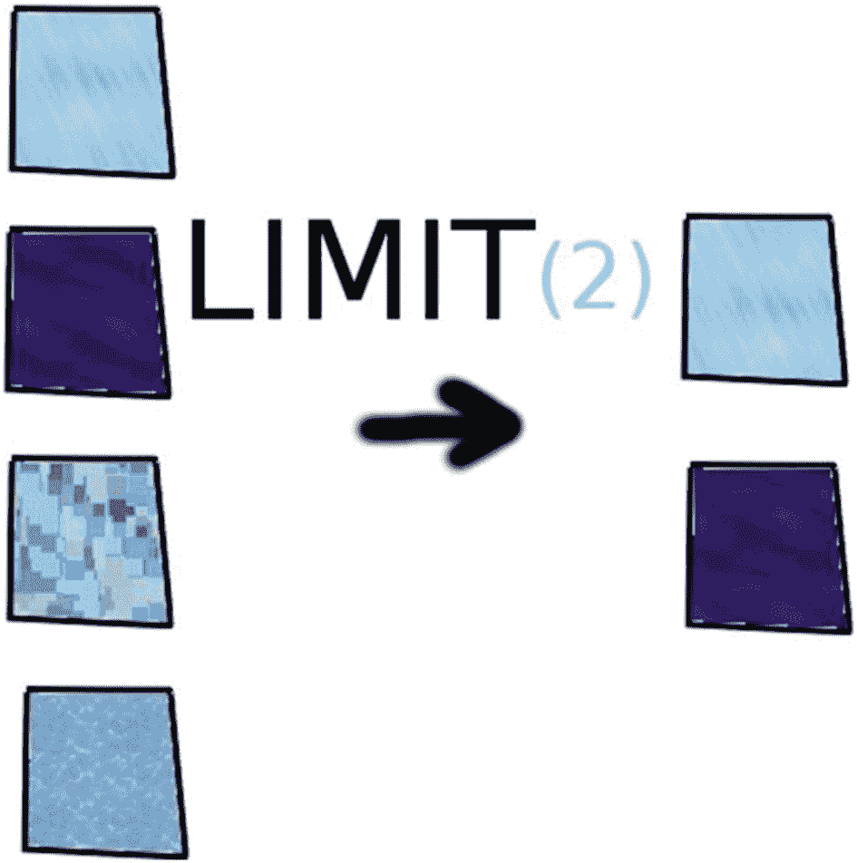
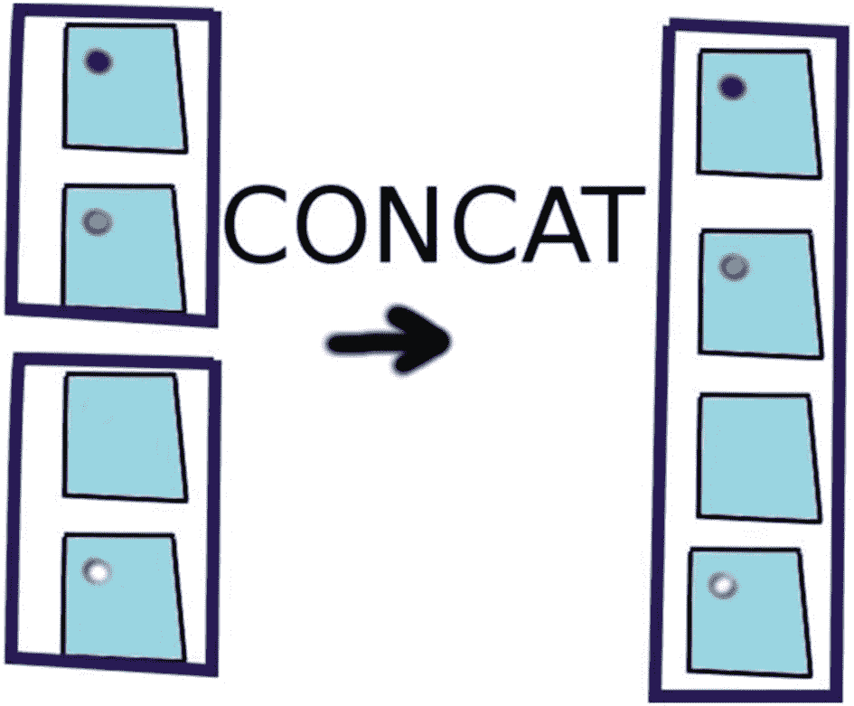

# 10.函数式编程

*函数式编程* (FP)是一种以函数为中心，最小化状态变化(使用不可变数据结构)的编程风格。它更接近于用数学来表达解决方案，而不是通过一步一步的指令。

在 FP 中，函数应该是“无副作用的”(函数之外的任何东西都不会改变)，并且*引用透明*(当给定相同的参数时，函数每次都返回相同的值)。例如，这将允许值被缓存(保存在内存中)。

FP 是更常见的*命令式编程*的替代，它更接近于告诉计算机要遵循的步骤。

虽然函数式编程可以在 Java-8 之前的 Java 中实现，但 Java 8 启用了语言级 FP 支持，包括λ表达式和*函数接口*。

Java 8、JavaScript、Groovy 和 Scala 都支持函数式编程，尽管它们不是 FP 语言。

Note

诸如 Common Lisp、Scheme、Clojure、Racket、Erlang、OCaml、Haskell 和 F#等著名的函数式编程语言已经被各种各样的组织用于工业和商业应用中。Clojure <sup>[2](#Fn2)</sup> 是一种运行在 JVM 上的类似 Lisp 的语言。

## 函数和闭包

函数作为一级特性是函数式编程的基础。*一级特性*意味着一个函数可以用在一个值可以用的任何地方。

例如，在 JavaScript 中，您可以将一个函数赋给一个变量，并像下面这样调用它:

```java
1   var func = function(x) { return x + 1; }
2   var three = func(2); //3

```

虽然 Groovy 没有一流的函数，但是它有一些非常相似的东西:闭包。闭包就是一个用大括号括起来的代码块，参数定义在`->`(箭头)的左边。例如:

```java
1   def closr = {x -> x + 1}
2   println( closr(2) ); //3

```

如果一个闭包有一个参数，那么在 Groovy 中它可以作为`it`被引用。例如，以下内容与前面的`closr`含义相同:

```java
1   def closr = {it + 1}

```

Java 8 引入了 lambda 表达式，它类似于实现函数接口的闭包(具有单一抽象方法的接口)。lambda 表达式的主要语法如下:

```java
parameters -> body

```

Java 编译器使用表达式的上下文来确定正在使用哪个函数接口(以及参数的类型)。例如:

```java
1   Function<Integer,Integer> func = x -> x + 1;
2   int three = func.apply(2); //3

```

这里的函数接口是`Function<T,R>`，它有`apply`方法— `T`为参数类型，`R`为返回类型。返回值和参数类型都是 I `nteger` s，因此`Integer,Integer`是泛型类型参数。

在 Java 8 中，*函数接口*被定义为只有一个抽象方法的接口。这甚至适用于用以前版本的 Java 创建的接口。

在 Scala 中，一切都是表达式，函数是一级特性。下面是 Scala 中的一个函数示例:

```java
1   var  f =  (x:  Int) =>  x + 1;
2   println(f(2)); //3

```

虽然 Java 和 Scala 都是静态类型的，但是 Scala 实际上是使用右边来推断被声明的函数的类型，而 Java 在大多数情况下是相反的。Java 11 引入了局部变量类型 **var** ，这使得语法非常接近 Scala 的 **var** 。

在 Java、Groovy 和 Scala 中，如果函数/闭包中有一个表达式，那么可以省略`return`关键字。但是，在 Groovy 和 Scala 中，如果返回值是最后一个表达式，也可以省略`return`关键字。

## 地图、过滤器等。

一旦您掌握了函数，您很快就会意识到您需要一种方法来对数据集合(或序列或流)执行操作。因为这些都是常见的操作，*顺序操作，*如`map`，`filter`，`reduce`等。，都是被发明的。

对于本节中的例子，我们将使用 JavaScript，因为它更容易阅读，并且函数名在各种编程语言中相当标准。创建以下`Person`原型和`Array`:

```java
1 function Person(name, age) { this.name = name; this.age = age; }
2 var persons = [new Person("Bob", 18),
3     new Person("Billy", 21), new Person("sam", 12)]

```

`The map`函数将输入元素翻译或改变成其他东西(图 [10-1](#Fig1) )。以下代码收集每个人的姓名:


图 10-1

地图

```java
1   var names = persons.map(function(person) { return person.name })

```

`filter`给出了元素的子集(从某个*谓词*函数返回`true`，该函数返回给定一个参数的布尔值【图 [10-2](#Fig2) 】)。例如，以下代码只收集年龄大于或等于 18 岁的人:


图 10-2

过滤器

```java
1   var adults = persons.filter(function(person) { return person.age >= 18 })

```

`reduce`对元素进行缩减(图 [10-3](#Fig3) )。例如，以下代码收集所有人的总年龄:


图 10-3

减少

```java
1   var totalAge = persons.reduce(function(total, p) { return total+p.age },0)

```

`limit`只给出前 N 个元素(图 [10-4](#Fig4) )。在 JavaScript 中，您可以使用`Array.slice(start, end)`函数来实现这一点。例如，下面的代码获取前两个人:



图 10-4

限制

```java
1   var firstTwo = persons.slice(0, 2)

```

`concat`组合两个不同的元素集合(图 [10-5](#Fig5) )。这可以在 JavaScript 中完成，如下例所示:



图 10-5

联结合并多个字符串

```java
1 var morePersons = [new Person("Mary", 55), new Person("Sue", 22)]
2 var all = persons.concat(morePersons);

```

## 不变

不变性和 FP 就像花生酱和果冻一样。虽然没有必要，但它们融合得很好。

在纯函数式语言中，其思想是每个函数对自身之外没有影响——没有副作用。这意味着每次你调用一个函数，在给定相同输入的情况下，它返回相同的值。

为了适应这种行为，有不可变的数据结构。不可变的数据结构不能被直接改变，但是每次操作都会返回一个新的数据结构。

例如，正如您之前了解到的，Scala 的默认`Map`是不可变的。

```java
1   val map = Map("Smaug" -> "deadly")
2   val map2 = map + ("Norbert" -> "cute")
3   println(map2) // Map(Smaug -> deadly, Norbert -> cute)

```

所以，在前文中，`map`将保持不变。

每种语言都有一个定义不可变变量(值)的关键字:

*   Scala 使用`val`关键字来表示不可变的值，与用于可变变量的`var`相反。

*   Java 有用于声明变量不可变的关键字`final`(这仅阻止值被修改，如果它是对另一个对象的引用，该对象的变量仍然可以被修改)。

*   除了`final`关键字，Groovy 还包括`@Immutable`注释 <sup>[3](#Fn3)</sup> ，用于声明整个类不可变。

*   JavaScript 使用了`const`关键字。<sup>[4](#Fn4)T4】</sup>

例如(在 Groovy 中):

```java
1   public class Centaur {
2       final String name
3       public Centaur(name) {this.name=name}
4   }
5   Centaur c = new Centaur("Bane");
6   println(c.name) // Bane
7
8   c.name = "Firenze" //error

```

这适用于简单的引用和原语，比如数字和字符串，但是对于列表和映射，就比较复杂了。对于这些情况，开源不可变库已经为不包含它的语言开发出来，如下所示:

*   番石榴 <sup>[5](#Fn5) 用于 Java 和 Groovy</sup>

*   不可变-JS<sup>T1】6T3】为 JavaScript</sup>

## 爪哇

在 Java 8 中，引入了`Stream<T>`接口。流就像一个改进的迭代器，支持链接方法来执行复杂的操作。

要使用流，您必须首先通过以下方式之一创建一个流:

*   `Collection's stream()` *方法或* `parallelStream()` *方法*:这些创建了一个由集合支持的流。使用`parallelStream`()方法可以使流操作并行运行。

*   `Arrays.stream()` *方法*:用于将数组转换为流。

*   `Stream.generate(Supplier<T> s)`:返回一个无限序列流，其中每个元素都是由给定的供应商生成的。

*   `Stream.iterate(T seed, UnaryOperator<T> f)`:返回一个函数对一个初始元素 seed 迭代应用产生的无限顺序有序流，产生一个由 seed，f(seed)，f(f(seed))等组成的流。

一旦有了一个流，就可以使用`filter`、`map`和`reduce`操作简洁地对数据执行计算。例如，以下代码从龙的列表中查找最长的名称:

```java
1   String longestName = dragons.stream()
2       .filter(d -> d.name != null)
3       .map(d -> d.name)
4       .reduce((n1, n2) -> n1.length() > n2.length() ? n1 : n2)
5       .get();

```

## 绝妙的

在 Groovy 中，`findAll`和其他方法对每个对象都可用，但对列表和集合尤其有用。Groovy 中使用了以下方法名:

*   `findAll`:与`filter`非常相似，它查找所有匹配闭包的元素。

*   `collect`:很像`map`，这是一个构建集合的迭代器。

*   `inject`:与`reduce`非常相似，它遍历这些值并返回一个值。

*   `each`:使用给定的闭包遍历值。

*   `eachWithIndex`:使用两个参数进行迭代:一个值和一个索引(值的索引，从零开始向上)。

*   `find`:查找匹配闭包的第一个元素。

*   `findIndexOf`:查找匹配闭包的第一个元素并返回其索引。

*   `any` : `True`如果有任何元素返回`true`结束。

*   `every` : `True`如果所有元素返回`true`则结束。

例如，下面假设`dragons`是具有`name`属性的`Dragon`对象的列表:

```java
1   String longestName = dragons
2      .findAll { it.name != null }
3      .collect { it.name }
4      .inject("") { n1, n2 -> n1.length() > n2.length() ? n1 : n2 }

```

记住 Groovy 中的`it`可以用来引用闭包的单个参数。

## 斯卡拉

Scala 的内置集合中有很多这样的方法，包括:

*   `map`:将值从一个值转换为另一个值

*   `flatMap`:将值转换为值的集合，然后将结果连接在一起(类似于 Groovy 中的`flatten()`方法)

*   `filter`:根据某个布尔表达式限制返回值

*   `find`:返回与给定谓词匹配的第一个值

*   `forAll` : `True`仅当所有元素都匹配给定的谓词时

*   `exists` : `True`如果至少有一个元素匹配给定的谓词

*   `foldLeft`:使用给定的闭包将值减少到一个值，从最后一个元素开始向左

*   `foldRight`:与`foldLeft`相同，但从第一个值开始向上(类似 Java 中的 reduce)

例如，您可以使用`map`对值列表执行操作，如下所示:

```java
1   val list = List(1, 2, 3)
2   list.map(_  * 2) // List(2, 4, 6)

```

与 Groovy 中的`it`非常相似，在 Scala 中，您可以使用下划线来引用单个参数。

假设`dragons`是 dragon 对象的列表，您可以在 Scala 中执行以下操作来确定最长的名称:

```java
1   var longestName = dragons.filter(_ != null).map(_.name).foldRight("")(
2       (n1:String,n2:String) => if (n1.length() > n2.length()) n1 else n2)

```

## 摘要

在本章中，您应该已经了解了

*   功能为一级功能

*   映射、过滤、减少

*   不变性及其与 FP 的关系

*   Java、Groovy、Scala 和 JavaScript 中支持 FPs 的各种特性

<aside aria-label="Footnotes" class="FootnoteSection" epub:type="footnotes">Footnotes [1](#Fn1_source)

[T2`http://functionaljava.org/`](http://functionaljava.org/)

  [2](#Fn2_source)

[T2`https://clojure.org/`](https://clojure.org/)

  [3](#Fn3_source)

[T2`http://bit.ly/32vyU8n`](http://bit.ly/32vyU8n)

  [4](#Fn4_source)

[T2`https://mzl.la/33u0JyY`](https://mzl.la/33u0JyY)

  [5](#Fn5_source)

[T2`https://github.com/google/guava`](https://github.com/google/guava)

  [6](#Fn6_source)

[T2`https://github.com/facebook/immutable-js`](https://github.com/facebook/immutable-js)

 </aside>