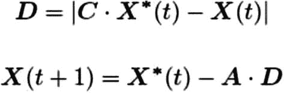
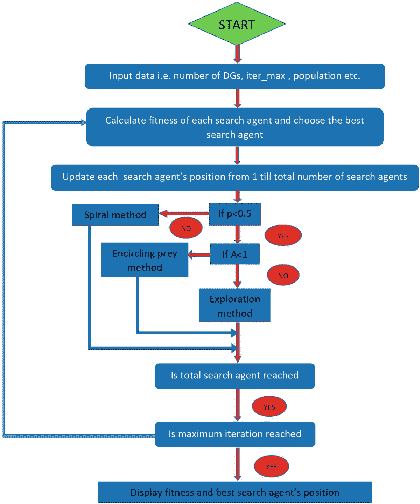
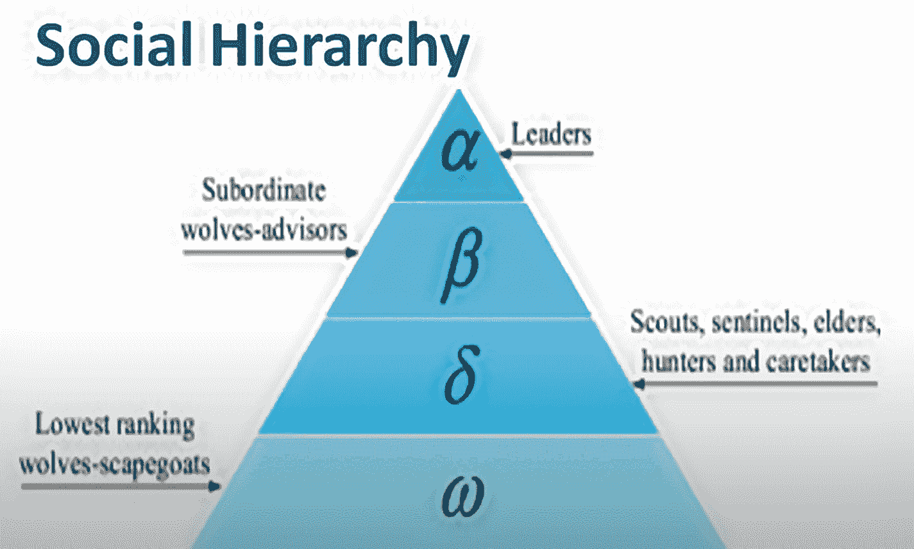
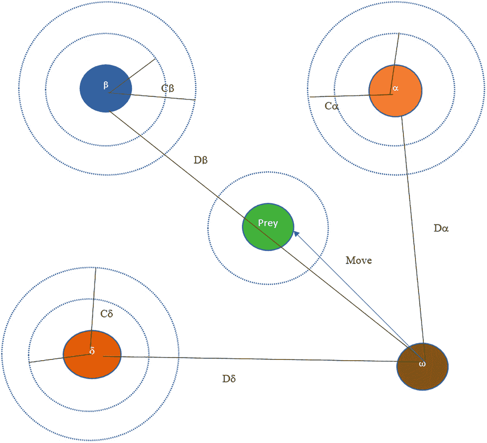
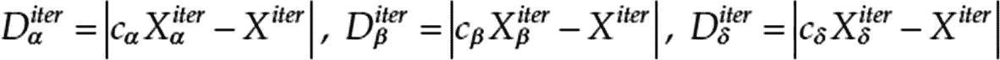
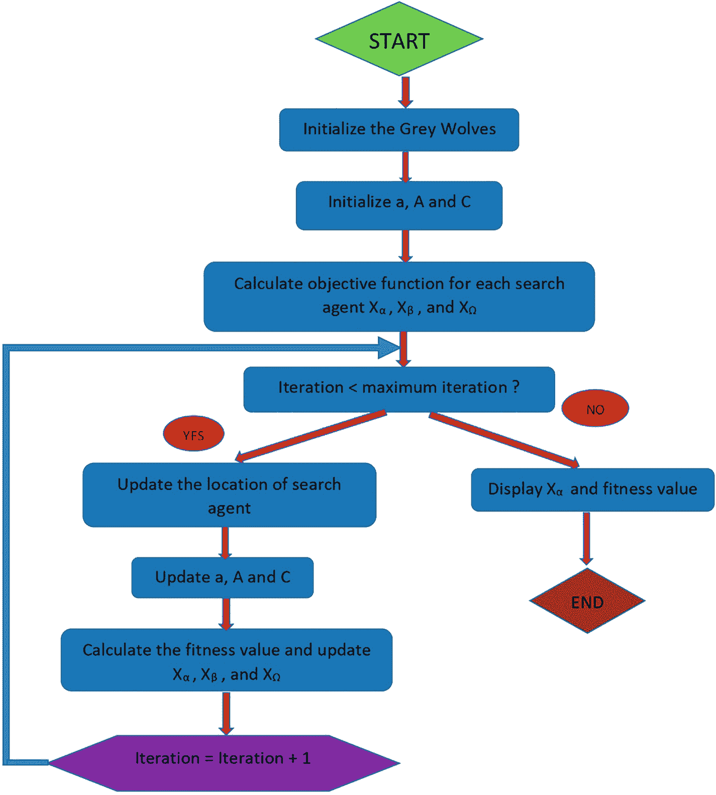
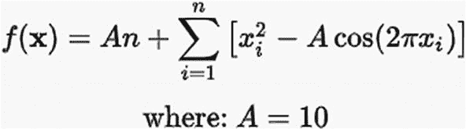
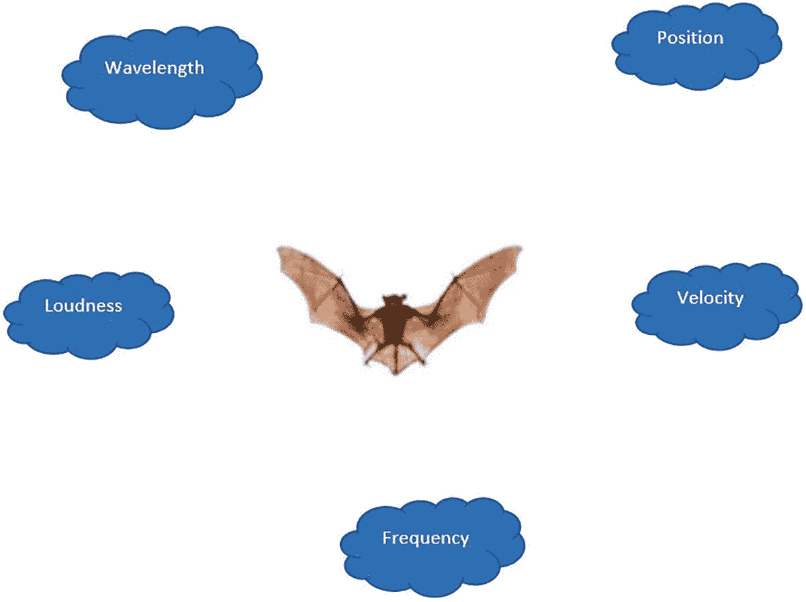

# 2.哺乳动物:鲸鱼、灰狼和蝙蝠优化

本章通过观察鲸鱼、灰狼和蝙蝠向你介绍最优化问题解决的世界。你将了解这些哺乳动物如何发展出特定的技术来解决它们生存所需要解决的某些问题。这些问题包括觅食或狩猎。

## 历史:鲸鱼

> *鲸鱼不唱歌是因为它们有答案。他们唱歌是因为他们有一首歌。*
> 
> —格利高里·考伯特，加拿大电影人

鲸鱼是世界上最大的哺乳动物。它们可以长到 30 米长，重达 180 吨。有许多不同种类的鲸鱼，包括虎鲸、小须鲸、座头鲸、露脊鲸、露脊鲸和蓝鲸。

鲸鱼是具有高智商和高情商的食肉哺乳动物。

根据研究，鲸鱼大脑中某些区域的细胞与人类相似。这些*纺锤体细胞*负责判断能力、情绪和社会行为。一只鲸鱼的这些细胞数量几乎是成年人的两倍，这是它们聪明的主要原因之一。已经证明，鲸鱼可以像人类一样思考、学习、判断、交流和变得情绪化，尽管智力水平低得多。鲸鱼也是群居的。他们中的一些物种(例如虎鲸)可以一生都生活在一个家庭中。

本章重点介绍座头鲸，最大的须鲸之一。

座头鲸最有趣的是它们特殊的捕猎方式。这种觅食行为被称为*泡网喂食法*。座头鲸喜欢捕食成群的磷虾或靠近水面的小鱼。据观察，这种觅食是通过沿着圆形或 9 字形路径产生独特的气泡来完成的。在 2011 年之前，这种行为只是从表面观察到的。然而，Goldbogen 等人[4]使用标签传感器研究了这种行为。他们捕获了 9 头座头鲸的 300 个标签衍生的泡泡网进食事件。他们发现了两种与泡沫相关的动作，并将它们命名为*上升螺旋*和*双循环*。在向上螺旋运动中，座头鲸潜到大约 12 米，在猎物周围形成一个螺旋形状的气泡，然后向水面游去。双环机动包括三个不同的阶段:珊瑚环、长尾和捕获环。

值得一提的是，泡网摄食是一种独特的行为，只有在座头鲸身上才能观察到。螺旋泡网进料策略的数学模型用于执行优化。

泡沫网喂食是鲸鱼故意从鼻子里吹出泡沫，像网一样包围它们的食物(磷虾和鱼)，将它们的猎物集中成一个紧密的球。然后，鲸鱼或一群鲸鱼一起从这个球下面游出来，浮上水面，张开它们的嘴，吞下它们的猎物。

鲸鱼优化算法(WOA)是最近开发的一种基于群体的元启发式算法，基于泡网搜索策略技术，用于解决复杂的优化问题。由于其结构简单、所需算子少、收敛速度快、在勘探和开发阶段之间具有更好的平衡能力，已成为一种被广泛接受的群体智能技术。由于其优化的性能和效率，该算法在多学科领域得到了广泛的应用。

Whale 优化基于两种策略。

*   探索(环绕)

*   漏洞利用(使用泡泡网方法的攻击)

### 包围猎物

让我们讨论一下鲸鱼在包围猎物时表现出的一些特征。



*   座头鲸知道猎物的位置并包围它们。

*   他们认为当前的最佳候选解决方案是获得的最佳和接近最佳的解决方案。

*   在指定最佳候选解之后，其他代理朝着最佳搜索代理更新它们的位置，如等式 [2-1](#Par21) 所示。

方程式 2-1。*鲸鱼位置更新*

在方程 [2-1](#Par21) 中， *t* 为当前迭代， *A* 和 *C* 为系数向量， *X* *为最佳解的位置向量， *X* 表示一个解的位置向量，| |为绝对值。

如公式 [2-2](#Par24) 所示计算 *A* 和 *C* 矢量。


方程式 2-2。*计算系数向量*

在整个迭代过程中， *a* 的分量从 2 线性减少到 0， *r* 是[0；1].

### 开发阶段:泡沫网攻击方法

座头鲸利用泡泡网机制攻击猎物。这种机制在数学上是通过收缩环绕机制来表述的。

在这个机制中， *A* 是区间[–*A*， *a* 中的随机值。在整个迭代过程中， *a* 的值从 2 减小到 0。然后，鲸鱼的位置以螺旋方式更新。这是基于鲸的位置和猎物的位置之间的距离，并基于两个相等的概率方程进行计算(见方程 [2-3](#Par30) 和 [2-4](#Par32) )。

*X(t + 1) = X* <sub>*缘*</sub> *，(t)-a*(p<0.5)

*X(t*+1)=*D′**T5】**e*<sup>*bl*</sup>*cos(27d)+*X*<sup>***</sup>*(t)*(p>0.5)*

 *方程式 2-3。*泡泡网机制*

*D′*是猎物与鲸鱼之间的距离。

*D’= | X*<sup>T3】*T5*(t)= X(t)*|</sup>

方程式 2-4。*猎物和鲸鱼之间的距离更新*

## 鲸鱼流程图

图 [2-1](#Fig1) 描绘了 whale 优化算法的流程。它首先初始化参数，如种群大小和迭代次数。它初始化群体本身，然后在每次迭代期间，它更新每个代理(群体成员)的位置，并计算每个代理的适应度。在最后一次迭代之后，最适合的代理被认为是最佳解决方案。



图 2-1

鲸鱼优化算法的流程图

## 鲸鱼伪代码

以下伪代码描述了图 [2-1](#Fig1) 中概述的 whale 优化算法。

```java
Randomly initialize the whale population.
Evaluate the fitness values of whales and find out the best search agent X* .
Initialize the whales population Xi (i = 1, 2, ..., n)
Calculate the fitness of each search agent
X*=the best search agent
while (t < maximum number of iterations)
    for each search agent
    Update a, A, C, l, and p
        if1 (p<0.5)
            if2 (|A| < 1)
                Update the position of the current search agent by the Eq. (2.1)
            else if2 (|A|>=1)
                Select a random search agent ( )
                Update the position of the current search agent by the Eq. (2.3)
            end if2
        else if1 (p >=0.5)
                Update the position of the current search by the Eq. (2.3)
        end if1
    end for
    Check if any search agent goes beyond the search space and amend it
    Calculate the fitness of each search agent
    Update X* if there is a better solution
    t=t+1
end while
return X*

```

## Whale 先决条件和代码

确保您的计算机上安装了 Java 8 (JDK8 或更高版本)。像 Eclipse 这样的 IDE 是推荐的，但不是必需的，因为您可以使用命令行界面来运行代码，而不需要 IDE。

whale 算法的代码包含以下类。


*   点工具类，有三个成员(见清单 [2-1](#PC2) )
    *   双数组

    *   整数数组

    *   整数

*   优化评估函数的 Rastrigin 实用程序类(见清单 [2-2](#PC3) 和方程 [2-5](#Par44)

*   WhaleOptimizer 优化类，算法功能的主要 Java 类(参见清单 [2-3](#PC4) )

方程式 2-5。 *Rastrigin 基准函数*

```java
import java.lang.Math;
import java.util.*;
public class WhaleOptimizer
{
// declare variables for population size, number of iterations, dimensions and bounds.

int popSize;
int iterations;

int dimensions;
int ub=100,lb=-100;
// an array to represent the fitness values.
double fitness[];
// Represents the best Solution
double[] bestSolution;

double minValueOfSolution;
double leaderDistance;
double[][] positions;
// other constants used within the algorithm
double a,t,a2,p;

/*
Initialize the variables

and arrays within the constructor. We will initialize the population here with dimensions capped between lower and upper bounds.
*/
public WhaleOptimizer(int iterations,int popSize, int dimensions)
{

    this.iterations=iterations;
    this.popSize=popSize;
    this.dimensions=dimensions;
    positions=new double[popSize][dimensions];
    fitness=new double[popSize];
//Initialize the population of all solutions
    for(int i=0;i<popSize;i++)
    {
    for (int j=0;j<dimensions;j++)
    {
// cap the values between upper and lower bounds
        positions[i][j]=Math.random()*(ub-lb)+lb;
    }
    }
// calculate the fitness of each solution in the population
    for(int i=0;i<popSize;i++)
    {
        fitness[i]=fitnessCalculator(positions[i]);

    }

// Get the best solution in population with random initialized values.
    int bestIndex= indexOfSmallest(fitness);
    bestSolution=positions[bestIndex];
    minValueOfSolution=smallestInArray(fitness);
}
//rastrigin function used for calculating the fitness of the solutions
private  double fitnessCalculator(double[] candidate)
{

    Point p= new Point(candidate);
    Rastrigin rast=new Rastrigin(10,dimensions);
// The other benchmark which can be experimented with is Ackley.
    //Ackley ack=new Ackley(10,10,10,10);
    return rast.f(p);

}
/*
Helper method which finds the smallest member in an array of doubles
*/
private static double smallestInArray(double[] array){

    // add this
    if (array.length == 0)
       return -1;

    int index = 0;
    double min = array[index];

    for (int i = 1; i < array.length; i++){
       if (array[i] <= min){
       min = array[i];
       //index = i;
       }
    }
    return min;
}

/*
Helper method which finds the index of the smallest member in an array of doubles
*/

private static int indexOfSmallest(double[] array){

    // add this
    if (array.length == 0)
       return -1;

    int index = 0;
    double min = array[index];

    for (int i = 1; i < array.length; i++){
       if (array[i] <= min){
       min = array[i];
       index = i;
       }
    }
    return index;
}

/*
Main method for running the algorithm
*/
private void optimize()
{
    //main loop for iterating over configured number of iterations

    for(int i=0;i<iterations;i++){
        //loop over individual whale in the population. Each whale represents a solution in the
        //search space

        for(int j=0;j<popSize;j++)
        {

            //get positions of whales in bounds
            positions[j]=simpleBounds(positions[j],lb,ub);
            //System.out.println("velocities="+s[j][0]);

            // calculate fitness of each whale
                   double fNew = fitnessCalculator(positions[j]);

             // Update the current best solution
          if (fNew < minValueOfSolution)
            {
             bestSolution =positions[j].clone();
             minValueOfSolution = fNew;

            }

        }
    //loop over the population again
        for(int j=0;j<popSize;j++)
        {

         a = 2 - i * ((2) / iterations);
       // a decreases linearly from 2 to 0

       // a2 linearly decreases from -1 to -2 to calculate t
       a2 = -1 + i * ((-1) / iterations);
        double r1=Math.random();
        double r2=Math.random();
        //exploit phase starts

        double A = 2 * a * r1 - a;  // Equation 2.2 for calculating A
        double  C = 2 * r2 ; // Equation 2.2 for calculating C

        int   b = 1;
          double l = (a2 - 1) * Math.random() + 1;

        //random variable for calculating probablity
        p= Math.random();
        // Iterate over individual dimension of each of the solution
        for(int k=0;k<dimensions;k++)
        {
            //check for probability value via a random variable p
        //update position of individual whale using Equation 2.3

            if (p < 0.5)
            {
                if (Math.abs(A) >= 1)
                    {
                    int rand_leader_index = (int)Math.floor(popSize * Math.random());
                   double[] X_rand = positions[rand_leader_index].clone();
           double val= C * X_rand[k] - positions[j][k];
                   double D_X_rand = Math.abs(val);
            //update the whale position
            positions[j][k]= X_rand[k] - A * D_X_rand;

                    }

                    else if (Math.abs(A) < 1){
                        double val=C * bestSolution[j] - positions[j][k];
                    leaderDistance = Math.abs(val);
            //update the whale position
                    positions[j][k] = bestSolution[j] - A * leaderDistance;
                    }
            }

            else if (p >= 0.5)
            {

                double distance2Leader = Math.abs(bestSolution[j] - positions[j][k]);
            //update the whale position
            positions[j][k] = distance2Leader * Math.exp(b * l) * Math.cos(l * 2 * Math.PI)+ bestSolution[j];

            }

        }
        }
                // print the best solution
        System.out.println("iter="+i+" best fitness is ="+minValueOfSolution);

    }

}

/*
Method for bounding the value between lower and upper bounds
*/
private double[] simpleBounds(double[] val, double lower, double upper){
    double[] result = new double[val.length];
    for (int i = 0; i < val.length; i++) {

       if (val[i] < lower){
          result[i] = lower;
        }
       else if (val[i] > upper){
          result[i] = upper;
        }
        else
        {
            result[i]=val[i];
        }

    }
       return result;
}

/*
Main method to pass inputs and launch the algorithm
*/

public static void main(String[] args)
{
//takes input as number of iterations, population size and dimensions
int iter=Integer.parseInt(args[0]);
int pop=Integer.parseInt(args[1]);
int dim=Integer.parseInt(args[2]);
WhaleOptimizer whale =new WhaleOptimizer(iter,pop,dim);
whale.optimize();
}

}

Listing 2-3The WhaleOptimizer Class

```

```java
    /*
    This class is used as the benchmark function and will be used throughout all algorithms.

    */
public class Rastrigin {

    private double A;
    private double n;

    public Rastrigin(double A, double n) {
        this.A = A;
        this.n = n;
    }

    /*
    This method is the main method for the Rastrigin benchmark function. It takes as input a Point object (explained above) and performs the calculations for the benchmark

.
    */

    public double f(Point x) {
        double sum = 0;
        //o = numpy.sum(x ** 2 - 10 * numpy.cos(2 * math.pi * x)) + 10 * dim
        for (int i = 0; i < x.dim; i++) {

            sum += Math.pow(x.p[i], 2) - A*Math.cos(2*Math.PI*x.p[i]);

        }
        return A*n + sum;
    }

}

/*
This class is the main optimizer class. Our objective function is the minimization of the benchmark function (Rastrigin in this case)

Listing 2-2The Rastrigin Class

```

```java
public class Point {
    public double p[];
    public int ip[];
    public int dim;

    public Point(double p[]) {
        this.dim = p.length;
        this.p = p.clone();
    }

    public Point(int p[]) {
        this.dim = p.length;
        this.ip = p.clone();
    }

    public Point(int dim) {
        this.dim = dim;
        p = new double[dim];
    }
    /*
    this method returns the square root of the sum of the square of the members in the array of doubles
    */
    public double norm(){
        double sum = 0;
        for (int i = 0; i < dim ; i ++) {
            sum += Math.pow(this.p[i], 2);
        }
        return Math.sqrt(sum);
    }
    /*
    This method

returns the square root of the distance between 2 points. Its calculated by taking sum of the square of the distance between each element of the double array and then doing a square root of it.
    */
    public double dist(Point b){
        double sum = 0;
        for (int i = 0; i < dim ; i ++) {
            sum += Math.pow(this.p[i]-b.p[i], 2);
        }
        return Math.sqrt(sum);
    }
    /*
    This method adds the two Points by taking sum of the individual elements of the double array of each Point
    */

    public static Point add(Point a, Point b) throws Exception {
        if (a.dim != b.dim){
            throw new IllegalArgumentException("Adding points from different dimensions");
        }
        int dim  = a.dim;
        double cp[] = new double[dim];
        for (int i = 0; i < dim; i++){
            cp[i] = a.p[i] + b.p[i];
        }
        return new Point(cp);
    }
    /*
    This method

adds the two Points by taking sum of the individual elements of the double array of each Point and then takes an average of each added elements and finally returns a Point with the averages points in the new array
    */

    public static Point mid(Point a, Point b) throws Exception{
        if (a.dim != b.dim){
            throw new IllegalArgumentException("Incompatible points");
        }
        int dim  = a.dim;
        double cor[] = new double[dim];
        for (int i = 0; i < dim; i++){
            cor[i] = (a.p[i] + b.p[i]) / 2.0;
        }
        return new Point (cor);
    }
    /*
    This method multiplies each element of the array of double with the constant a. a is the coefficient we use in the optimization algorithm.
    */
    public Point mull(double a) {
        double p[] = new double[this.dim];
        Point m = new Point(p);
        for (int i = 0; i < this.dim; i++){
            m.p[i] = this.p[i]*a;
        }
        return m;
    }
    /*
    This method returns a string representation of the double array
    */

    @Override
    public String toString() {
        if (p != null) {
            String s = "[";
            for (int i = 0; i < this.dim; i++){
                s += (float)p[i];
                if (i == this.dim - 1) {
                    s += "]";
                } else {
                    s += ",";
                }
            }

            return s;
        } else {
            String s = "[";
            for (int i = 0; i < this.dim; i++){
                s += (int)ip[i];
                if (i == this.dim - 1) {
                    s += "]";
                } else {
                    s += ",";
                }
            }
            return s;
        }
    }
}

Listing 2-1The Point Class

```

## 执行鲸鱼代码

要编译 Java 文件，请使用以下命令。

```java
javac Point.java
javac Rastrigin.java
javac WhaleOptimizer.java
//running the example with 50 iterations and population size of 10 and 30 dimensions
java WhaleOptimizer 50 10 30

```

以下是运行上述代码的输出。

```java
iter=0 best fitness is =64618.62705831786
iter=1 best fitness is =6089.687035911165
iter=2 best fitness is =1191.832252196124
iter=3 best fitness is =1191.832252196124
iter=4 best fitness is =557.1033568751382
iter=5 best fitness is =294.5584859459394
iter=6 best fitness is =227.37519747187895
iter=7 best fitness is =227.37519747187895
iter=8 best fitness is =169.87626519543952
iter=9 best fitness is =164.24808671529178
iter=10 best fitness is =164.24808671529178
iter=11 best fitness is =164.24808671529178
iter=12 best fitness is =38.5966387729996
iter=13 best fitness is =38.5966387729996
iter=14 best fitness is =38.5966387729996
iter=15 best fitness is =38.5966387729996
iter=16 best fitness is =38.5966387729996
iter=17 best fitness is =36.691018990274586
iter=18 best fitness is =31.104006893451526
iter=19 best fitness is =31.104006893451526
iter=20 best fitness is =31.104006893451526
iter=21 best fitness is =31.104006893451526

iter=22 best fitness is =31.104006893451526
iter=23 best fitness is =31.104006893451526
iter=24 best fitness is =31.104006893451526
iter=25 best fitness is =31.104006893451526
iter=26 best fitness is =31.104006893451526
iter=27 best fitness is =30.71055488621937
iter=28 best fitness is =30.030588201965543
iter=29 best fitness is =30.030588201965543
iter=30 best fitness is =30.030588201965543
iter=31 best fitness is =30.030588201965543
iter=32 best fitness is =30.01029093772968
iter=33 best fitness is =29.990401804857754
iter=34 best fitness is =29.990401804857754
iter=35 best fitness is =29.950989401883703
iter=36 best fitness is =29.950989401883703
iter=37 best fitness is =29.88823708275629
iter=38 best fitness is =29.883783242305753
iter=39 best fitness is =22.450413721771895
iter=40 best fitness is =5.573548743084075
iter=41 best fitness is =1.2819795525663835
iter=42 best fitness is =1.2819795525663835
iter=43 best fitness is =1.2819795525663835
iter=44 best fitness is =1.2819795525663835

iter=45 best fitness is =1.2819795525663835
iter=46 best fitness is =1.2819795525663835
iter=47 best fitness is =1.2819795525663835
iter=48 best fitness is =1.2819795525663835
iter=49 best fitness is =0.9079497282054376

```

## 历史:灰狼

> *一个人可以和一只狼套近乎，甚至驯服一只狼，但没有人能真正驯服一只狼。*
> 
> —乔治·马丁

这种元启发式算法是由 Seyedali Mirajaliali、Seyed Muhammad 和 Andrew Lewis 在 2014 年的一篇论文中提出的。它的灵感来自灰狼狩猎技术中的社会等级制度。

灰狼的社会等级根据适应度被定义为四个等级。

*   一级(阿尔法)
    *   群体的领导者(可以是男性或女性)

    *   负责决定何时何地狩猎

    *   低级狼跟随阿尔法狼，并通过压低尾巴来表示认可

*   2 级(测试版)
    *   这些狼帮助阿尔法做决策

    *   建议阿尔法狼并负责维持纪律

    *   在需要的时候从他们中间选出阿尔法(由于前阿尔法生病或死亡)

    *   充当阿尔法狼和其他低等狼之间的中间人，监督阿尔法狼的命令得到执行，并向阿尔法狼提供反馈

*   三级(增量)
    *   他们被称为*下属*

    *   向阿尔法和贝塔报告，向欧米茄报告

    *   三角洲进一步分为
        *   负责监视边界的侦察员

        *   负责保护狼群的哨兵

        *   曾经是阿尔法和贝塔的长者

        *   帮助阿尔法和贝塔打猎的猎人

        *   帮助狼群中伤病者的看护者

*   四级(欧米茄)
    *   等级制度中的最低层

    *   大多是族群的替罪羊

    *   必须最后一个吃

这种层次结构如图 [2-2](#Fig2) 所示。



图 2-2

灰狼的社会等级制度

狼越健康，它的级别就越高。这意味着阿尔法狼最适合，其次是贝塔狼，然后是德尔塔狼，最后是欧米加狼。

## 灰狼优化如何工作

寻找最优解的搜索过程基于灰狼狩猎行为模型，该模型有三个阶段。

1.  寻找猎物。

2.  包围猎物。

3.  攻击猎物。

前两个阶段是探索性的，最后一个阶段是开拓性的。

### 搜索(探索)

探险是根据狼α、 *β* 和 *δ* 的指引寻找猎物。 *C* α参数，如果其值为> 1，则表示正在进行探测。 *C* <sub>*p*</sub> 参数引入了狼与猎物之间距离的随机性。这种随机性对于避免解决方案陷入局部最优非常重要。

### 环绕(探索)

在捕猎过程中，灰狼包围猎物，数学上用方程 [2-6](#Par83) 表示。


方程式 2-6。*狼和猎物之间的距离更新*

在方程 [2-6](#Par83) 中， *t* 代表当前迭代， *A* 和 *C* 为系数向量。 *X* <sub>*p*</sub> 是猎物的位置向量， *X* 是狼的位置向量。在等式 [2-7](#Par85) 中计算出 *A* 和 *C* 矢量，并在迭代过程中线性减小。*r*T24】1 和*r*T28】2 为随机变量。


方程式 2-7。*更新系数*

### 攻击(剥削)

阿尔法狼带头发起攻击。贝塔狼和德尔塔狼可能会不时参与进来。最佳解决方案是根据阿尔法狼、贝塔狼和德尔塔狼的位置得出的。

攻击行为如图 [2-3](#Fig3) 所示。它还描述了该过程的开发阶段。当 *C* α参数减小时，暗示着狼正在向猎物靠近。相反，如果 *C* α增加，那么狼正在远离猎物。当这个参数变得小于 1 时，狼正在攻击猎物。



图 2-3

灰狼的狩猎行为

狼 *ω* 根据狼α、 *β* 和 *δ* 的位置不断更新其位置。等式 [2-8](#Par89) 反映了其位置的更新。




方程式 2-8。*根据狼α、β和δ的位置更新ω狼的位置*

## 灰狼流程图

图 [2-4](#Fig4) 展示了灰狼优化算法的流程图。在高层次上，该流程图从初始化迭代次数和群体大小等参数开始。在每次迭代中，狼群的位置根据猎物的位置进行更新，并计算每只狼的适应度函数。在所有迭代之后，选择最佳适应值作为最佳解。



图 2-4

灰狼优化流程图

## 灰狼伪代码

以下伪代码描述了灰狼优化算法，如图 [2-4](#Fig4) 所示。

```java
Begin
Initialize the parameters popsize, maxiter, ub and lb where
popsize: size of population,
maxiter: maximum number of iterations,
ub: upper bound(s) of the variables,
lb: lower bound(s) of the variables;
Generate the initial positions of gray wolves with ub and lb;
Initialize and Calculate the fitness of each gray wolf;
alpha = the gray wolf with the first maximum fitness;
beta = the gray wolf with the second maximum fitness;
delta = the gray wolf with the third maximum fitness;
While
   for  : popsize
     Update the position of the current gray wolf  ;
  end for
  Update and
  Calculate the fitness of all gray wolves;
  Update alpha, beta, and delta;
  ;;
end while
Return alpha;
End

```

## 灰狼先决条件和代码

同样，确保您的计算机上安装了 Java 8 (JDK8 或更高版本)。像 Eclipse 这样的 IDE 是推荐的，但不是必需的，因为您可以使用命令行界面来运行代码，而不需要 IDE。

whale 算法的代码包含以下 Java 类。



*   点工具类，有三个成员(见清单 [2-4](#PC8) )
    *   双数组

    *   整数数组

    *   整数

*   优化评估函数的 Rastrigin 实用程序类(见清单 [2-5](#PC9) 和方程 [2-9](#Par100)

*   GrayWolfOptimizer 优化类，算法功能的主要 Java 类(参见清单 [2-6](#PC10) )

方程式 2-9。 *Rastrigin 基准函数*

```java
/*
Main optimizer class for Gray Wolf optimization. Objective function is minimizing the Rastrigin benchmark function
*/
import java.lang.Math;
import java.util.*;
public class GrayWolfOptimizer
{
// declare variables for population size, iterations and dimensions
int popSize;
int iterations;

int dimensions;
//declare upper and lower bounds for the search space
double ub=5.12,lb=-5.12;
//declare array for holding the fitness values
double fitness[];
// array which holds dimensions of the best solution
double[] bestSolution;
// declare coefficients like alpha, beta and gamma
double alpha = 0.5 ; // Randomness 0--1 (highly random)
double betamin = 0.20 ; // minimum value of beta
// minimum value of the solution

double minValueOfSolution;
//declare two dimensional array for holding position of each solution
double[][] positions;
double[][] positions1;
int[] sortedIndex;
double[] alphaPosition;
double[] betaPosition;
double[] deltaPosition;
//start with a high value (randomly chosen as 100000000)
double alphaScore=10000000;
double betaScore=10000000;
double deltaScore=10000000;
public GrayWolfOptimizer(int iterations,int popSize, int dimensions)
{
//initialize the iterations , population size and dimensions
    this.iterations=iterations;
    this.popSize=popSize;
    this.dimensions=dimensions;
    positions=new double[popSize][dimensions];
    positions1=new double[popSize][dimensions];

    fitness=new double[popSize];
    alphaPosition=new double[dimensions];
    betaPosition=new double[dimensions];
    deltaPosition=new double[dimensions];
    //loop through the population size and initialize the dimensions for each solution
    // in the population
    for(int i=0;i<popSize;i++)
    {

    for (int j=0;j<dimensions;j++)
    {
    // cap the positions between lower and upper bounds
        positions[i][j]=Math.random()*(ub-lb)+lb;

    }

    }

}

//rastrigin function used
private  double fitnessCalculator(double[] candidate)
{

    Point p= new Point(candidate);
    Rastrigin rast=new Rastrigin(10,dimensions);
    //Ackley ack=new Ackley(10,10,10,10);
    return rast.f(p);
}

/*
Method for updating the position of the wolves. This takes in a coefficient as the parameter value
*/
private void updateWolvesPosition(double a)
{

    // Update the Position of search agents including omegas
       for (int i=0;i<popSize;i++)
        {
          for (int j=0;j<dimensions;j++){

             double r1 = Math.random()  ;// r1 is a random number in [0,1]
             double r2 = Math.random() ;//  r2 is a random number in [0,1]
// calculate A1 and C1 based on Equation 2-6.
             double A1 = 2 * a * r1 - a;
             double C1 = 2 * r2;
// update the position of alpha wolves

             double  D_alpha = Math.abs(C1 * alphaPosition[j] - positions[i][j]);
             double X1 = alphaPosition[j] - A1 * D_alpha;

             r1 = Math.random()  ;// r1 is a random number in [0,1]
             r2 = Math.random() ;//  r2 is a random number in [0,1]

             double A2 = 2 * a * r1 - a;
             double C2 = 2 * r2;
// update the position of beta wolves

             double D_beta = Math.abs(C2 * betaPosition[j] - positions[i][j]);
             double X2 = betaPosition[j] - A2 * D_beta;

             r1 = Math.random();
             r2 = Math.random();

             double A3 = 2 * a * r1 - a;
             double C3 = 2 * r2;
// update the position of delta wolves

             double D_delta = Math.abs(C3 * deltaPosition[j] - positions[i][j]);
             double X3 = deltaPosition[j] - A3 * D_delta;

             positions[i][j] = (X1 + X2 + X3) / 3  ;// Equation (2.8)
            }

        }
}

/*
This code is main method for the Gray Wolf optimization algorithm
*/
private void optimize()
{

    //main loop for number of iterations
    for(int it=0;it<iterations;it++){
        //loop over individual

    // loop through individual solution (wolves) in each iteration
        for(int i=0;i<popSize;i++)
    {
                       // calculate fitness of each solution
        fitness[i]=fitnessCalculator(positions[i]);

        // Update Alpha, Beta, and Delta scores and positions of alpha, beta and delta wolves
          if (fitness[i] < alphaScore)
            {
             deltaScore=betaScore;
                deltaPosition=betaPosition.clone();
             betaScore=alphaScore;
             betaPosition=alphaPosition.clone();
             alphaScore=fitness[i];
             alphaPosition=positions[i].clone();
            }
        // Update Alpha, Beta, and Delta scores and positions of alpha, beta and delta wolves

              if (fitness[i] > alphaScore && fitness[i] < betaScore)
              {
             deltaScore=betaScore;
                deltaPosition=betaPosition.clone();
             betaScore=fitness[i];

              betaPosition=positions[i].clone();
              }

        // Update Alpha, Beta, and Delta scores and positions of alpha, beta and delta wolves

        if (fitness[i] > alphaScore && fitness[i] > betaScore && fitness[i] < deltaScore)
        {
             deltaScore = fitness[i] ;
             deltaPosition=positions[i].clone();

        }

         double a = 2 - it * ((2) / iterations);
        // in each iteration update positions of wolves based on updates to a
updateWolvesPosition(a);
        }

    System.out.println("best score after iteration "+it+" ="+alphaScore);
}
}
/*
Main method for executing the code. It takes as input the number of iterations, population Size and number of dimensions as command line parameters
*/
public static void main(String[] args)
{
int iter=Integer.parseInt(args[0]);
int pop=Integer.parseInt(args[1]);
int dim=Integer.parseInt(args[2]);
GrayWolfOptimizer gwo =new GrayWolfOptimizer(iter,pop,dim);
gwo.optimize();
}
}

Listing 2-6The GrayWolfOptimizer Class

```

```java
     /*
     This class is used as the benchmark function and will be used throughout all algorithms.

     */

public class Rastrigin {

    private double A;
    private double n;

    public Rastrigin(double A, double n) {
        this.A = A;
        this.n = n;
    }

    /*
      This method is the main method for the Rastrigin benchmark function. It takes as input a Point object (explained above) and performs the calculations for the benchmark.
     */

    public double f(Point x) {
        double sum = 0;
        //o = numpy.sum(x ** 2 - 10 * numpy.cos(2 * math.pi * x)) + 10 * dim
        for (int i = 0; i < x.dim; i++) {

            sum += Math.pow(x.p[i], 2) - A*Math.cos(2*Math.PI*x.p[i]);

        }
        return A*n + sum;
    }

}

Listing 2-5The Rastrigin Class

```

```java
public class Point {
    public double p[];
    public int ip[];
    public int dim;

    public Point(double p[]) {
        this.dim = p.length;
        this.p = p.clone();
    }

    public Point(int p[]) {
        this.dim = p.length;
        this.ip = p.clone();
    }

    public Point(int dim) {
        this.dim = dim;
        p = new double[dim];
    }
    /*
     this method returns the square root of the sum of the square of the members in the array of doubles
    */
    public double norm(){
        double sum = 0;
        for (int i = 0; i < dim ; i ++) {
            sum += Math.pow(this.p[i], 2);
        }
        return Math.sqrt(sum);
    }

    /*
     This method returns the square root of the distance between 2 points. Its calculated by taking sum of the square of the distance between each element of the double array and then doing a square root of it.
    */
    public double dist(Point b){
        double sum = 0;
        for (int i = 0; i < dim ; i ++) {
            sum += Math.pow(this.p[i]-b.p[i], 2);
        }
        return Math.sqrt(sum);
    }
    /*
     This method adds the two Points by taking sum of the individual elements of the double array of each Point
    */

    public static Point add(Point a, Point b) throws Exception {
        if (a.dim != b.dim){
            throw new IllegalArgumentException("Adding points from different dimensions");
        }
        int dim  = a.dim;
        double cp[] = new double[dim];
        for (int i = 0; i < dim; i++){
            cp[i] = a.p[i] + b.p[i];
        }
        return new Point(cp);
    }

     /*
    This method adds the two Points by taking sum of the individual elements of the double array of each Point and then takes an average of each added elements and finally returns a Point with the averages points in the new array
    */

    public static Point mid(Point a, Point b) throws Exception{
        if (a.dim != b.dim){
            throw new IllegalArgumentException("Incompatible points");
        }
        int dim  = a.dim;
        double cor[] = new double[dim];
        for (int i = 0; i < dim; i++){
            cor[i] = (a.p[i] + b.p[i]) / 2.0;
        }
        return new Point (cor);
    }
    /*
    This method multiplies each element of the array of double with the constant a. a is the coefficient we use in the optimization algorithm.
    */
    public Point mull(double a) {
        double p[] = new double[this.dim];
        Point m = new Point(p);
        for (int i = 0; i < this.dim; i++){
            m.p[i] = this.p[i]*a;
        }
        return m;
    }
    /*
       This method returns a string representation of the double array
    */

    @Override
    public String toString() {
        if (p != null) {
            String s = "[";
            for (int i = 0; i < this.dim; i++){
                s += (float)p[i];
                if (i == this.dim - 1) {
                    s += "]";
                } else {
                    s += ",";
                }
            }

            return s;
        } else {
            String s = "[";
            for (int i = 0; i < this.dim; i++){
                s += (int)ip[i];
                if (i == this.dim - 1) {
                    s += "]";
                } else {
                    s += ",";
                }
            }
            return s;
        }
    }
}

Listing 2-4The Point Class

```

## 执行 Wolf 代码

下面的代码编译这些文件。

```java
javac Point.java
javac Rastrigin.java
javac GrayWolfOptimizer.java

//running the example with 50 iterations and population size of 10 and 30 dimensions
java GrayWolfOptimizer 50 10 30

```

以下是运行上述代码的输出。

```java
best score after iteration 0 =509.96673667327343
best score after iteration 1 =426.41598649085057
best score after iteration 2 =338.22309610465413
best score after iteration 3 =308.52361359264995
best score after iteration 4 =277.9213584359936
best score after iteration 5 =248.83646851559863
best score after iteration 6 =203.07265223211158
best score after iteration 7 =203.07265223211158
best score after iteration 8 =203.07265223211158
best score after iteration 9 =203.07265223211158
best score after iteration 10 =203.07265223211158
best score after iteration 11 =203.07265223211158
best score after iteration 12 =203.07265223211158
best score after iteration 13 =184.70404858170573
best score after iteration 14 =184.70404858170573
best score after iteration 15 =184.70404858170573
best score after iteration 16 =184.70404858170573
best score after iteration 17 =184.70404858170573
best score after iteration 18 =184.70404858170573
best score after iteration 19 =182.58434165600903
best score after iteration 20 =182.58434165600903
best score after iteration 21 =181.7495365991856
best score after iteration 22 =181.7495365991856
best score after iteration 23 =181.663022402521
best score after iteration 24 =181.663022402521
best score after iteration 25 =157.10334848914758
best score after iteration 26 =156.35153795887368
best score after iteration 27 =139.32771778897705

best score after iteration 28 =139.32771778897705
best score after iteration 29 =139.32771778897705
best score after iteration 30 =137.75584129668897
best score after iteration 31 =137.75584129668897
best score after iteration 32 =137.75584129668897
best score after iteration 33 =128.32651340584417
best score after iteration 34 =126.37388487653246
best score after iteration 35 =126.37388487653246
best score after iteration 36 =126.37388487653246
best score after iteration 37 =126.37388487653246
best score after iteration 38 =124.71241252923625
best score after iteration 39 =124.71241252923625
best score after iteration 40 =124.71241252923625
best score after iteration 41 =124.71241252923625
best score after iteration 42 =124.71241252923625
best score after iteration 43 =124.71241252923625
best score after iteration 44 =124.71241252923625
best score after iteration 45 =124.71241252923625
best score after iteration 46 =124.71241252923625
best score after iteration 47 =124.71241252923625
best score after iteration 48 =124.71241252923625
best score after iteration 49 =124.71241252923625

```

## 历史:蝙蝠

> *大黄蜂蝙蝠，你晚上怎么看？*

> *我发出吱吱的声音，无论碰到什么都会反弹回来。我通过听觉看到。*
> 
> *——达林伦德*

蝙蝠算法与其他元启发式算法是一致的，近似 NP 难问题。杨新社在 2010 年开发了这个算法。

这种算法是基于微老鼠的回声定位能力，其中发射率和响度是变化的。

微型蝙蝠是一种体重约 2 克的小蝙蝠。回声定位是蝙蝠以一定角度发出的声音脉冲。蝙蝠听到声波从周围物体反射回来的回声。这有助于蝙蝠找到猎物并避开障碍物。声波的频率范围从 25 千赫到 150 千赫。

图 [2-5](#Fig5) 展示了蝙蝠发射声纳波时回声定位的工作原理。距离障碍物的距离是通过结合声波反射回来的时间和发射波的频率来计算的。


图 2-5

蝙蝠的回声定位

蝙蝠利用图 [2-6](#Fig6) 所示的尺寸来搜寻猎物。



图 2-6

蝙蝠的各种尺寸

蝙蝠会根据与猎物的距离自动调整发射脉冲的频率或波长。假设响度从很高的值( *A* 0)变化到固定的最小值。等式 [2-10](#Par113) 计算蝙蝠变化的位置和速度。


方程式 2-10。*根据物体的位置改变位置和速度*

## Bat 流程图

图 [2-7](#Fig7) 是蝙蝠优化算法的流程图。在高层次上，该流程图从初始化参数(例如，迭代次数和蝙蝠种群大小)开始。在每次迭代中，蝙蝠的位置和速度被更新，并且每个蝙蝠的适应度函数被计算。在所有迭代之后，选择最佳适应值作为最佳解。


图 2-7

Bat 优化流程图

## Bats 伪代码

以下伪代码描述了 bat 优化算法，如图 [2-7](#Fig7) 所示。

```java
   Objective function f(x), x = (x1, ..., xd)
   Initialize the bat population Xi (i = 1, 2, . . ., n)
   Define the pulse rate ri and the loudness Ai
   Input: Initial bat population
   while ( t < Max number of iterations ) do
       Generate new solutions by adjusting frequency, and updating velocities and locations/solutions (Equations in 2-10 )
      if ( rand > ri ) then
             Select a solution among the best solutions
             Generate a local solution around the selected best solution
       end if
       Generate a new solution by flying randomly
       if ( rand < Ai & f(Xi) < f(X∗) ) then
             Accept the new solutions
            Increase emission rate and reduce loudness
       end if
       Rank the bats and find the current best Xbest
    end while
    Output: Best bat found (i.e. best solution)

```

## Bat 先决条件和 Bat 代码

同样，确保您的计算机上安装了 Java 8 (JDK8 或更高版本)。像 Eclipse 这样的 IDE 是推荐的，但不是必需的，因为您可以使用命令行界面来运行代码，而不需要 IDE。

bat 算法的代码包含以下类。


*   点工具类，有三个成员(见清单 [2-7](#PC14) )
    *   双数组

    *   整数数组

    *   整数

*   优化评估函数的 Rastrigin 实用程序类(见清单 [2-8](#PC15) 和方程 [2-11](#Par124)

*   BatOptimizer 优化类，算法功能的主要 Java 类(参见清单 [2-9](#PC16) )

方程式 2-11。 *Rastrigin 基准函数*

```java
/*
Main class for the Bat optimizer. Goal is to minimize the objective function represented by the Rastrigin benchmark
*/
import java.lang.Math;
import java.util.*;
public class BatOptimizer
{
// Declare number of iterations, population size and dimensions of each bat
int popSize;
int iterations;
int dimensions;
int ub=100,lb=-100;
// declare different coefficients and constants for the algo
double a=0.5;
double r=0.5;
double freq_min=0;
double freq_max=2;
// double array to hold the frequencies
double[] frequencies;
//two dimensional array of doubles for bat velocities
double[][] velocities;
double[][] solutions;
// array holding fitness value for each solution

double fitness[];
double[] bestSolution;
double[][] s;
double minValueOfSolution;

/*
Constructor for initializing the population and populating initial fitness of each solution (bat)
*/
public BatOptimizer(int iterations,int popSize, int dimensions)
{
    this.iterations=iterations;
    this.popSize=popSize;
    this.dimensions=dimensions;
    frequencies=new double[popSize];
    velocities=new double[popSize][dimensions];
    solutions=new double[popSize][dimensions];
    s=new double[popSize][dimensions];
    fitness=new double[popSize];
    //initialize solutions by looping over each member in the population

    for(int i=0;i<popSize;i++)
    {
    for (int j=0;j<dimensions;j++)
    {

        solutions[i][j]=Math.random()*(ub-lb)+lb;
    }
    }
    // calculate fitness of each solution
    for(int i=0;i<popSize;i++)
    {
        fitness[i]=fitnessCalculator(solutions[i]);
    }

// find the index of the best solution initially as well as the bestSolution
    int bestIndex= indexOfSmallest(fitness);
    bestSolution=solutions[bestIndex];
    minValueOfSolution=smallestInArray(fitness);
}
//rastrigin function used
private  double fitnessCalculator(double[] candidate)
{

    Point p= new Point(candidate);
    Rastrigin rast=new Rastrigin(10,dimensions);
    return rast.f(p);

    }
/*
Helper method for returning smallest value in array of doubles.
*/
private static double smallestInArray(double[] array){

    // add this
    if (array.length == 0)
       return -1;

    int index = 0;
    double min = array[index];

    for (int i = 1; i < array.length; i++){
       if (array[i] <= min){
       min = array[i];
       //index = i;
       }
    }
    return min;
}

/*
Helper method for returning index of the smallest member in the array
*/

private static int indexOfSmallest(double[] array){

    // add this
    if (array.length == 0)
       return -1;

    int index = 0;
    double min = array[index];

    for (int i = 1; i < array.length; i++){
       if (array[i] <= min){
       min = array[i];
       index = i;
       }
    }
    return index;
}
/*
Main method of the algorithm
*/

private void optimize()
{
    //main loop for number of iterations

    for(int i=0;i<iterations;i++){
        //loop over individual bat
        for(int j=0;j<popSize;j++)
        {
            // update frequency of each bat
            frequencies[j]=freq_min+(freq_max-freq_min)*Math.random();
            //velocities update for each bat

                //v[i, :] = v[i, :] + (Sol[i, :] - best) * Q[i]
// calculate difference from the best solution
double[] diffFromBest=subtractElementwise(solutions[j],bestSolution,frequencies);
            //update velocities for the bat
            velocities[j]= addElementwise(velocities[j],diffFromBest);

            s[j]= addElementwise(solutions[j],velocities[j]);

            s[j]=simpleBounds(s[j],lb,ub);

          if( Math.random() > r){

            s[j] = addArrayToRnd(bestSolution , 0.001 * rnd(dimensions));

            }

            //update the solution if fitness is better for the candidate
            // Evaluate new solutions
          double fNew = fitnessCalculator(s[j]);

          // Update if the solution improves
          if ((fNew <= fitness[j]) && (Math.random() < a))
            {
                solutions[j]= s[j].clone();
             //Sol[i, :] = numpy.copy(S[i, :])
             fitness[j] = fNew;
            }

             // Update the current best solution
          if (fNew <= minValueOfSolution)
            {
             bestSolution =s[j].clone();
             minValueOfSolution = fNew;

            }

        }
        System.out.println("iter="+i+" best fitness is ="+minValueOfSolution);
    }

}

/*
Helper method for returning a new array of double by adding the passed argument to individual member of the array
*/

private static double[] addArrayToRnd(double[] a, double num) throws ArithmeticException {

          double[] result = new double[a.length];
          for (int i = 0; i < a.length; i++) {
             result[i] = (a[i] + num);
          }
          return result;
}

/*
Helper method for returning a random value sampled from a gaussian
*/

private double rnd(int dim)
{

    Random r = new Random(dim);
double randomValue =  0+ r.nextGaussian()*1;
return randomValue;
}

/*
Helper method for keeping values in between lower and upper bounds
*/
private double[] simpleBounds(double[] val, double lower, double upper){
    double[] result = new double[val.length];
    for (int i = 0; i < val.length; i++) {

       if (val[i] < lower){
          result[i] = lower;
        }
       else if (val[i] > upper){
          result[i] = upper;
        }

        else
        {
            result[i]=val[i];
        }

    }
       return result;
}
/*
Helper method for returning difference between the elements of two array of doubles multiplied by the frequency of the specific bat
*/

 private static double[] subtractElementwise(double[] a, double[] b, double[] freq) throws ArithmeticException {

       if (a.length != b.length) {
          throw new ArithmeticException();
       } else {
          double[] result = new double[a.length];
          for (int i = 0; i < a.length; i++) {
             result[i] = (a[i] - b[i])*freq[i];
          }
          return result;
       }

    }

/*
Helper method for adding individual elements of the arrays of doubles
*/

private static double[] addElementwise(double[] a, double[] b) throws ArithmeticException {

       if (a.length != b.length) {
          throw new ArithmeticException();
       } else {
          double[] result = new double[a.length];
          for (int i = 0; i < a.length; i++) {
             result[i] = (a[i] + b[i]);
          }
          return result;
       }

    }
public static void main(String[] args)
{
int iter=Integer.parseInt(args[0]);
int pop=Integer.parseInt(args[1]);
int dim=Integer.parseInt(args[2]);
BatOptimizer bat=new BatOptimizer(iter,pop,dim);
bat.optimize();
}

}

Listing 2-9The BatOptimizer Class

```

```java
      /*
      This class is used as the benchmark function and will be used throughout all algorithms.

      */

public class Rastrigin {

    private double A;
    private double n;

    public Rastrigin(double A, double n) {
        this.A = A;
        this.n = n;
    }

    /*
      This method is the main method for the Rastrigin benchmark function. It takes as input a Point object (explained above) and performs the calculations for the benchmark

.
       */

    public double f(Point x) {
        double sum = 0;
        //o = numpy.sum(x ** 2 - 10 * numpy.cos(2 * math.pi * x)) + 10 * dim
        for (int i = 0; i < x.dim; i++) {

            sum += Math.pow(x.p[i], 2) - A*Math.cos(2*Math.PI*x.p[i]);

        }
        return A*n + sum;
    }

}

Listing 2-8The Rastrigin Class

```

```java
public class Point {
    public double p[];
    public int ip[];
    public int dim;

    public Point(double p[]) {
        this.dim = p.length;
        this.p = p.clone();
    }

    public Point(int p[]) {
        this.dim = p.length;
        this.ip = p.clone();
    }

    public Point(int dim) {
        this.dim = dim;
        p = new double[dim];
    }
     /*
     this method returns the square root of the sum of the square of the members in the array of doubles
     */
    public double norm(){
        double sum = 0;
        for (int i = 0; i < dim ; i ++) {
            sum += Math.pow(this.p[i], 2);
        }

        return Math.sqrt(sum);
    }
    /*
      This method returns the square root of the distance between 2 points. Its calculated by taking sum of the square of the distance between each element of the double array and then doing a square root of it.
    */
    public double dist(Point b){
        double sum = 0;
        for (int i = 0; i < dim ; i ++) {
            sum += Math.pow(this.p[i]-b.p[i], 2);
        }
        return Math.sqrt(sum);
    }
    /*
      This method adds the two Points by taking sum of the individual elements of the double array of each Point
     */

    public static Point add(Point a, Point b) throws Exception {
        if (a.dim != b.dim){
            throw new IllegalArgumentException("Adding points from different dimensions");
        }
        int dim  = a.dim;
        double cp[] = new double[dim];
        for (int i = 0; i < dim; i++){
            cp[i] = a.p[i] + b.p[i];
        }
        return new Point(cp);
    }
      /*
       This method adds the two Points by taking sum of the individual elements of the double array of each Point and then takes an average of each added elements and finally returns a Point with the averages points in the new array
      */

    public static Point mid(Point a, Point b) throws Exception{
        if (a.dim != b.dim){
            throw new IllegalArgumentException("Incompatible points");
        }

        int dim  = a.dim;
        double cor[] = new double[dim];
        for (int i = 0; i < dim; i++){
            cor[i] = (a.p[i] + b.p[i]) / 2.0;
        }
        return new Point (cor);
    }
    /*
      This method multiplies each element of the array of double with the constant a. a is the coefficient we use in the optimization algorithm.
     */
    public Point mull(double a) {
        double p[] = new double[this.dim];
        Point m = new Point(p);
        for (int i = 0; i < this.dim; i++){
            m.p[i] = this.p[i]*a;
        }
        return m;
    }
    /*
       This method returns a string representation of the double array
      */

    @Override
    public String toString() {
        if (p != null) {
            String s = "[";
            for (int i = 0; i < this.dim; i++){
                s += (float)p[i];
                if (i == this.dim - 1) {
                    s += "]";
                } else {
                    s += ",";
                }
            }

            return s;
        } else {
            String s = "[";
            for (int i = 0; i < this.dim; i++){
                s += (int)ip[i];
                if (i == this.dim - 1) {
                    s += "]";
                } else {
                    s += ",";
                }
            }
            return s;
        }
    }
}

Listing 2-7The Point Class

```

## 执行 Bat 代码

下面的代码编译这些文件。

```java
javac Point.java
javac Rastrigin.java
javac BatOptimizer.java

//running the example with 50 iterations and population size of 10 and 30 dimensions
java BatOptimizer 50 10 30

```

以下是运行上述代码的输出。

```java
iter=0 best fitness is =76483.71345283325
iter=1 best fitness is =76478.96155973038
iter=2 best fitness is =42783.77839770218
iter=3 best fitness is =42781.20842991052
iter=4 best fitness is =42779.167603237656
iter=5 best fitness is =42776.63576280687
iter=6 best fitness is =42774.62583068019
iter=7 best fitness is =42772.62987212166
iter=8 best fitness is =42771.63717776008
iter=9 best fitness is =42769.66244601229
iter=10 best fitness is =42766.72724352279
iter=11 best fitness is =42764.3061741315
iter=12 best fitness is =42761.43117104229
iter=13 best fitness is =42758.589572619385
iter=14 best fitness is =42755.31708648613
iter=15 best fitness is =42753.00804487652
iter=16 best fitness is =42751.17802334106
iter=17 best fitness is =42748.01258167695
iter=18 best fitness is =42746.22509580061
iter=19 best fitness is =42743.57316308794
iter=20 best fitness is =42742.260442575454
iter=21 best fitness is =42741.82483808292
iter=22 best fitness is =42738.80326661441
iter=23 best fitness is =42736.25202522932
iter=24 best fitness is =42733.320918717385
iter=25 best fitness is =42731.25727358482
iter=26 best fitness is =42728.007604724946
iter=27 best fitness is =42726.406891353756
iter=28 best fitness is =42723.64438883426
iter=29 best fitness is =42721.315796905874
iter=30 best fitness is =42718.64490574986
iter=31 best fitness is =42716.767293101264
iter=32 best fitness is =42714.54728307373
iter=33 best fitness is =42713.45080389827
iter=34 best fitness is =42711.64333019462

iter=35 best fitness is =42709.50725503373
iter=36 best fitness is =42708.10307075944
iter=37 best fitness is =42707.40691961385
iter=38 best fitness is =42705.34214633038
iter=39 best fitness is =42704.66175678234
iter=40 best fitness is =42703.64852114836
iter=41 best fitness is =42702.31121228729
iter=42 best fitness is =42700.33439530883
iter=43 best fitness is =42698.713593464
iter=44 best fitness is =42697.752620941945
iter=45 best fitness is =42695.54366609986
iter=46 best fitness is =42693.68707677068
iter=47 best fitness is =42691.56348775477
iter=48 best fitness is =42690.37030417116
iter=49 best fitness is =42688.31731561078

```

## 摘要

本章介绍了针对哺乳动物的优化问题解决方案，特别是鲸鱼、灰狼和蝙蝠。它涵盖了优化问题和解决方案的基本流程，并提供了相关的流程图、伪代码和用 Java 编写的代码。Rastrigin 基准函数用作所有算法的目标函数。*