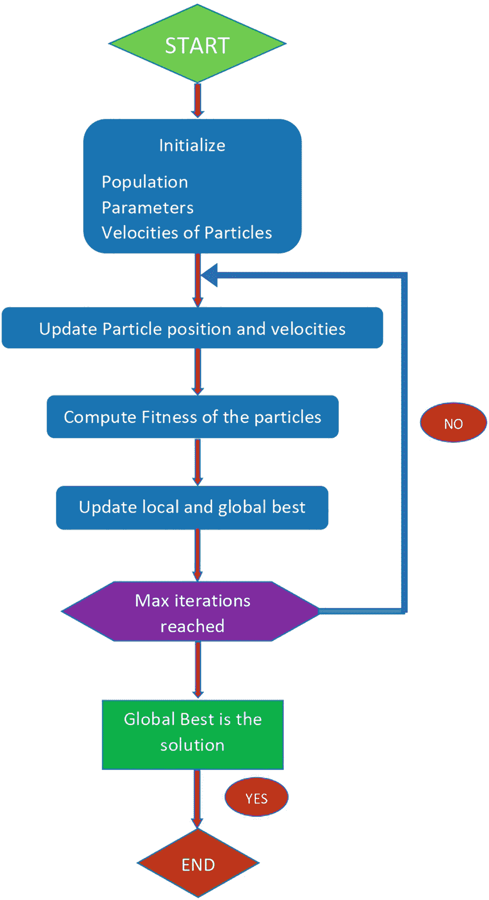
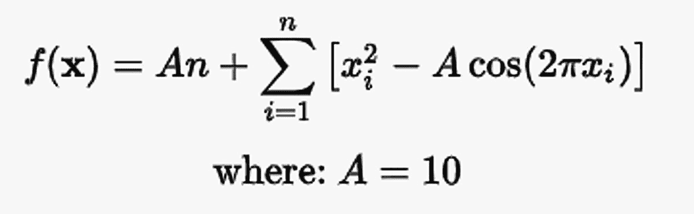

# 3.鸟类:粒子群和布谷鸟搜索优化

本章讨论了鸟类如何利用群体行为来觅食。在这个过程中，他们寻找优化食物搜索的方法。本章简要介绍了这种行为的历史，然后讨论了驱动鸟类搜索行为的算法。

## 历史:粒子群

### 物以类聚，人以群分

群体行为是一组实体——动物、鸟类或昆虫——在参与觅食或迁徙等活动时表现出的集体行为。动物或鸟类的群体在特定的方向上同步运动。从一个更抽象的概念来看，群体行为是一种基于自组织原则的自律行为。鸥群没有核心领袖。多是去中心化、自我调节的行为，有一些随意的动作。鸟群示例如图 [3-1](#Fig1) 所示。


图 3-1

鸟群

正如克雷格·w·雷诺兹在 1987 年的论文中所解释的那样，鸟类遵循三个简单的规则。

*   **避免碰撞**:每只鸟都避免与鸟群中的其他鸟发生碰撞。

*   **速度均匀性**:所有的鸟保持相同的速度。

*   **羊群对中**。所有的鸟都试图向鸟群的中心移动。

在一个鸟群中，每只鸟都有一种本地行为，称为*认知成分*。还有一种全球行为叫做*社会成分*。群体的动态是基于个体成员和整个群体先前行为的历史。鸟儿根据自己和群体的经验改变它们的位置和速度。

## 粒子群优化算法

假设有 *N* 个粒子。这里的每个粒子代表搜索空间中的一个解。每个粒子都应该有大小为 *D* 的维度(每个粒子的向量表示，包含了粒子的距离和速度)。目标函数是基于为特定问题指定的标准来定义的。粒子群均匀分布在整个搜索空间中。速度和位置最初是随机分配的。

全局最小值必须位于搜索空间内。这意味着在空间中寻找最佳解决方案。只有一个全局最小值。没有一个粒子知道全局最小值在哪里。他们只知道每个粒子的适应度函数。

粒子以一定的速度移动，这些速度是在每次迭代中随机选择的。这允许他们探索搜索空间并不断更新他们的位置。每只鸟以一定的速度移动时都会改变位置。它试图根据直觉寻找食物，但也会受到群体行为的影响。随着粒子在搜索空间中移动，它们会记住自己的最佳位置和群体的最佳位置，如方程 [3-1](#Par13) 所示。这总是影响粒子向那个方向运动，并使它们向那个方向加速。

等式 [3-1](#Par13) 首先更新速度( *V* ，然后更新粒子的位置( *P* )。


方程式 3-1。*根据局部最佳和全局最佳位置更新速度*

等式 [3-1](#Par13) 中的第一个等式是对位置的更新。

等式 [3-1](#Par13) 中的第二个等式是每个时间戳的速度更新。它有三个术语。

*   是当前时间的惯性。

*   第二项通过从粒子看到的最佳位置中减去当前粒子位置来更新粒子在时间 *t* +1 的速度。这使得粒子向其最佳位置移动。

*   第三项使粒子速度的更新向目前所见的全局最佳位置移动。

一旦粒子速度在时间 *t* +1 发生更新，位置也使用第一方程在时间 *t* +1 被更新。

第二个方程中也有两个系数:*c*<sub>1</sub>*r*<sub>1</sub>和*c*<sub>2</sub>*r*<sub>2</sub>。这些系数控制着勘探和开采的程度。**利用**是粒子瞄准目前为止发现的最佳解的能力。**探索**则是粒子评估整个研究空间的能力。本文剩余部分的挑战是确定这些系数的影响，以便在勘探和开采之间找到良好的平衡。

## 粒子群算法流程图

PSO 算法的流程图如图 [3-2](#Fig2) 所示。该算法初始化群体、迭代次数和其他参数。在每次迭代中，每个粒子的速度和位置都会更新。在每次迭代中，计算每个粒子的适应度，并估计全局和局部最佳值。这一直持续到达到最大迭代次数并获得全局最大值。



图 3-2

流程图

## PSO 伪代码

以下伪代码描述了 PSO 算法，如图 [3-2](#Fig2) 所示。

```java
For each particle
{
    Initialize particle
}

Do until maximum iterations are done
{
    For each particle
    {
        Calculate Data fitness value
        If the fitness value is better than pBest
        {
            Set pBest = current fitness value
        }
        If pBest is better than gBest
        {
            Set gBest = pBest
        }
    }

    For each particle
    {
        Calculate particle Velocity
        Use gBest and Velocity to update particle Data
    }
}

```

## PSO 先决条件和代码

确保您的计算机上安装了 Java 8 (JDK8 或更高版本)。像 Eclipse 这样的 IDE 是推荐的，但不是必需的，因为您可以使用命令行界面来运行代码，而不需要 IDE。

PSO 算法的代码由两个实用程序类和一个优化器类组成。

*   点工具类，有三个成员(见清单 [3-1](#PC2) )
    *   双数组

    *   整数数组

    *   整数

*   优化评估函数的 Rastrigin 实用程序类(参见清单 [3-2](#PC3)

*   ParticleSwarmOptimizer 类，算法功能的主要 Java 类(参见清单 [3-3](#PC4) )

Rastrigin 基准函数如公式 [3-2](#Par32) 所示。


方程式 3-2。 *Rastrigin 基准函数*

```java
public class Point {
    public double p[];
    public int ip[];
    public int dim;

    public Point(double p[]) {
        this.dim = p.length;
        this.p = p.clone();
    }

    public Point(int p[]) {
        this.dim = p.length;
        this.ip = p.clone();
    }

    public Point(int dim) {
        this.dim = dim;
        p = new double[dim];
    }

    /*
    this method returns the square root of the sum of the square of the members in the array of doubles
    */
    public double norm(){
        double sum = 0;
        for (int i = 0; i < dim ; i ++) {
            sum += Math.pow(this.p[i], 2);
        }
        return Math.sqrt(sum);
    }
    /*
    This method returns the square root of the distance between 2 points. It's calculated by taking sum of the square of the distance between each element of the double array and then doing a square root of it.
    */
    public double dist(Point b){
        double sum = 0;
        for (int i = 0; i < dim ; i ++) {
            sum += Math.pow(this.p[i]-b.p[i], 2);
        }
        return Math.sqrt(sum);
    }
    /*
    This method adds the two Points by taking sum of the individual elements of the double array of each Point
    */

    public static Point add(Point a, Point b) throws Exception {
        if (a.dim != b.dim){
            throw new IllegalArgumentException("Adding points from different dimensions");
        }

        int dim  = a.dim;
        double cp[] = new double[dim];
        for (int i = 0; i < dim; i++){
            cp[i] = a.p[i] + b.p[i];
        }
        return new Point(cp);
    }
    /*
    This method adds the two Points by taking sum of the individual elements of the double array of each Point and then takes an average of each added elements and finally returns a Point with the averages points in the new array
    */

    public static Point mid(Point a, Point b) throws Exception{
        if (a.dim != b.dim){
            throw new IllegalArgumentException("Incompatible points");
        }
        int dim  = a.dim;
        double cor[] = new double[dim];
        for (int i = 0; i < dim; i++){
            cor[i] = (a.p[i] + b.p[i]) / 2.0;
        }
        return new Point (cor);
    }
    /*
     This method multiplies each element of the array of double with the constant a. a is the coefficient we use in the optimization algorithm.
    */
    public Point mull(double a) {
        double p[] = new double[this.dim];
        Point m = new Point(p);
        for (int i = 0; i < this.dim; i++){
            m.p[i] = this.p[i]*a;
        }
        return m;
    }

    /*
    This method returns a string representation of the double array
     */

    @Override
    public String toString() {
        if (p != null) {
            String s = "[";
            for (int i = 0; i < this.dim; i++){
                s += (float)p[i];
                if (i == this.dim - 1) {
                    s += "]";
                } else {
                    s += ",";
                }
            }
            return s;
        } else {
            String s = "[";
            for (int i = 0; i < this.dim; i++){
                s += (int)ip[i];
                if (i == this.dim - 1) {
                    s += "]";
                } else {
                    s += ",";
                }
            }
            return s;
        }
    }

}// Point class ends here.

Listing 3-1The Point Class

```

接下来是下一个 Java 类，也就是用作基准函数的 Rastrigin 类。

```java
/*
Main class for the Particle Swarm Optimizer

. Goal is to minimize the objective function which is the Rastrigin benchmark function in this case
*/
import java.lang.Math;
import java.util.*;
public class ParticleSwarmOptimizer
{
// declare the variables for iterations, population size and number of dimensions
int popSize;
int iterations;
int dimensions;
// bound variables for upper and lower bounds
double ub=5.12,lb=-5.12;
// array to hold fitness values of the solutions
double fitness[];
// array holding dimension of best solution
double[] bestSolution;
// declare dimensions of each member
double[][] positions;
double[][] positions1;
double[] pBestScore,gBest;
double[][] pBest;
// keep best score as high. We will try and minimize this
double gBestScore=100000000;
int Vmax = 6;
double wMax = 0.9;
double wMin = 0.2;
int c1 = 2;
int c2 = 2;
/*
Constructor for initializing the population
*/
public ParticleSwarmOptimizer(int iterations,int popSize, int dimensions)
{

    this.iterations=iterations;
    this.popSize=popSize;
    this.dimensions=dimensions;
    positions=new double[popSize][dimensions];
    positions1=new double[popSize][dimensions];

    fitness=new double[popSize];
    //initialize solutions

    // local best score
    pBestScore = new double[popSize];

    pBest = new double[popSize][dimensions];
//global best
    gBest = new double[popSize];

    for(int i=0;i<popSize;i++)
    {
        pBestScore[i]=10000000;
    for (int j=0;j<dimensions;j++)
    {
        positions[i][j]=Math.random()*(ub-lb)+lb;
    }
    }
}

//rastrigin function used
private  double fitnessCalculator(double[] candidate)
{

    Point p= new Point(candidate);
    Rastrigin rast=new Rastrigin(10,dimensions);
    //Ackley ack=new Ackley(10,10,10,10);
    return rast.f(p);
}
/*
Optimize function for running the optimization code
*/
private void optimize()
{

    //main loop
    //loop through the population

    for(int it=0;it<iterations;it++){

        //loop over individual
        for(int i=0;i<popSize;i++)
    {
        //calculate the fitness of the individual particle
        fitness[i]=fitnessCalculator(positions[i]);

        if (pBestScore[i] > fitness[i]){
            pBestScore[i] = fitness[i];
                for(int j=0;j<dimensions;j++)
                {
                //update local best solution
           pBest[i][j] = positions[i][j];
                }

        if (gBestScore > fitness[i]){
           gBestScore = fitness[i];
                for(int j=0;j<dimensions;j++)
                {
                //update global best
           gBest[i] = positions[i][j];
                }
            }
         }

    }
       //Update the W of PSO
      double w = wMax - it * ((wMax - wMin) / iterations);
    //loop through population
    for(int i=0;i<popSize;i++)
    {

// loop through each dimension of each particle/bird
        for (int j=0;j<dimensions;j++){
           double r1 = Math.random();
           double r2 = Math.random();
// update positions as per Equation 3-1
           positions1[i][j] = (w * positions1[i][j]+ c1 * r1 * (pBest[i][j] - positions[i][j])+ c2 * r2 * (gBest[i] - positions[i][j]));

           if (positions1[i][j] > Vmax)

                {
             positions1[i][j] = Vmax;
                }

           if (positions1[i][j] < -Vmax)
                {
             positions1[i][j] = -Vmax;
                }
                //update the position of the individual particle
           positions[i][j] = positions[i][j] + positions1[i][j];
            }

    }

    System.out.println("best score after iteration "+it+" ="+gBestScore);
}
}

 /*
Main method to take command line arguments like iterations, population size and number of dimensions
*/
public static void main(String[] args)
{
int iter=Integer.parseInt(args[0]);
int pop=Integer.parseInt(args[1]);
int dim=Integer.parseInt(args[2]);
ParticleSwarmOptimizer pso =new ParticleSwarmOptimizer(iter,pop,dim);
pso.optimize();
}
}

Listing 3-3The PSO Class

```

```java
    /*
    This class is used as the benchmark function and will be used throughout all algorithms.

     */
public class Rastrigin {

    private double A;
    private double n;

    public Rastrigin(double A, double n) {
        this.A = A;
        this.n = n;
    }

    /*
    This method is the main method for the Rastrigin benchmark function. It takes as input a Point object (explained above) and performs the calculations for the benchmark.
    */

    public double f(Point x) {
        double sum = 0;
        //o = numpy.sum(x ** 2 - 10 * numpy.cos(2 * math.pi * x)) + 10 * dim
        for (int i = 0; i < x.dim; i++) {

            sum += Math.pow(x.p[i], 2) - A*Math.cos(2*Math.PI*x.p[i]);

        }
        return A*n + sum;
    }

}//Rastrigin class ends here

Listing 3-2The Rastrigin Class

```

## 执行完整的 PSO 代码

要编译 Java 文件，请使用以下命令。

```java
javac Point.java
javac Rastrigin.java
javac ParticleSwarmOptimizer.java

//running the example with 50 iterations and population size of 10 and 30 dimensions
Command for running the Optimizer class is shown below
java ParticleSwarmOptimizer 50 10 30

```

以下是运行代码后的输出。

```java
best score after iteration 0 =478.2638626565206
best score after iteration 1 =310.2955850826501
best score after iteration 2 =310.2955850826501
best score after iteration 3 =310.2955850826501
best score after iteration 4 =310.2955850826501
best score after iteration 5 =310.092438291369
best score after iteration 6 =310.092438291369
best score after iteration 7 =310.092438291369
best score after iteration 8 =310.092438291369
best score after iteration 9 =310.092438291369
best score after iteration 10 =306.3686693103556
best score after iteration 11 =306.3686693103556
best score after iteration 12 =306.3686693103556
best score after iteration 13 =286.6539375829212
best score after iteration 14 =286.6539375829212
best score after iteration 15 =233.26582419197734
best score after iteration 16 =233.26582419197734
best score after iteration 17 =233.26582419197734
best score after iteration 18 =233.26582419197734
best score after iteration 19 =233.26582419197734
best score after iteration 20 =233.26582419197734

best score after iteration 21 =206.18491064141006
best score after iteration 22 =206.18491064141006
best score after iteration 23 =206.18491064141006
best score after iteration 24 =206.18491064141006
best score after iteration 25 =203.7517447417162
best score after iteration 26 =203.7517447417162
best score after iteration 27 =203.7517447417162
best score after iteration 28 =203.7517447417162
best score after iteration 29 =203.7517447417162
best score after iteration 30 =203.7517447417162
best score after iteration 31 =203.7517447417162
best score after iteration 32 =203.7517447417162
best score after iteration 33 =203.7517447417162
best score after iteration 34 =203.7517447417162
best score after iteration 35 =203.7517447417162
best score after iteration 36 =203.7517447417162
best score after iteration 37 =190.62736084546805
best score after iteration 38 =190.62736084546805
best score after iteration 39 =190.62736084546805
best score after iteration 40 =190.62736084546805
best score after iteration 41 =190.62736084546805
best score after iteration 42 =190.62736084546805
best score after iteration 43 =190.62736084546805
best score after iteration 44 =190.62736084546805
best score after iteration 45 =190.62736084546805
best score after iteration 46 =190.62736084546805
best score after iteration 47 =190.62736084546805

best score after iteration 48 =190.62736084546805
best score after iteration 49 =190.62736084546805

```

您已经看到了 PSO 算法是如何工作的。接下来，让我们讨论另一种基于鸟优化的算法，称为*布谷鸟搜索*。

## 历史:布谷鸟搜索

> *阿咕！我可以称你为鸟，还是只是一个流浪的声音？*
> 
> —威廉·华兹华斯

布谷鸟搜索算法是由杨新社和 Suash Deb 于 2009 年提出的一种元启发式优化算法。布谷鸟的两种行为被用于布谷鸟搜索算法中。它基于一种布谷鸟的专性寄生繁殖行为，即在其他鸟类的巢中产卵，以增加其存活率和生产力。它也解释了杜鹃和其他鸟类、动物和昆虫所表现出的笨拙的飞行动作。

### 幼虫寄生

一些杜鹃物种表现出繁殖寄生行为。孵卵寄生行为包括在其他鸟类的巢中产卵，以便其他鸟类可以孵化杜鹃的蛋。通过进化，布谷鸟产下的蛋在形状和颜色上与宿主鸟的蛋非常相似。这使得布谷鸟欺骗宿主鸟来孵化布谷鸟蛋。雌布谷鸟拜访各种各样的巢来产卵。然而，如果宿主鸟发现了布谷鸟的蛋，它们要么扔掉蛋，要么放弃巢去建一个新的。图 [3-3](#Fig3) 显示了一个宿主巢，一只布谷鸟的蛋在宿主蛋旁边。


图 3-3

布谷鸟蛋

### 莱维航班

Lévy flight 是自然过程、科学和社交媒体中的一个数学概念。许多鸟类和昆虫表现出很强的飞行行为。这是一类被称为*随机行走*的随机过程。它的特点是以 90 度的急转弯打断直线运动。伴随着一点直觉，这种运动允许探索和开发机制被使用。解决方案通常是在当地社区进行探索，急转弯可以让探索发生。图 [3-4](#Fig4) 展示了李维的飞行行为。


图 3-4

李维函数

它的特点是许多随机的短动作，并由不常见的大动作连接起来。以经常光顾一家喜欢的商店为例，然后探索新的商店并经常光顾它们。Lévy flights 的特征是步长是从“重尾”概率分布中选择的，这意味着更长长度的下降概率不会小到足以压倒增加的长度；从技术上讲，重尾分布具有无限的方差(可能的长度)。

## 布谷鸟搜索优化算法

在一个简单的公式中，布谷鸟搜索算法具有以下假设

*   每个宿主巢有一个蛋，每个蛋代表搜索空间中的一个解。

*   有一个固定数量的宿主巢，这是解决方案的人口。

*   布谷鸟下一个蛋，这是新的解决方案。布谷鸟随机地用它的蛋替换另一个巢里的蛋。这相当于用新的解决方案取代旧的解决方案。

*   拥有高质量卵(溶液)的最好的巢会延续到下一代。

*   发现布谷鸟蛋的概率由 p 表示。在每次迭代中，总巢的一部分被丢弃。这意味着一小部分糟糕的解决方案被扔掉了。

让我们从一组 *N* 个解开始。

( *X* <sub>1</sub> ， *X* <sub>2</sub> ，… *X* <sub>N</sub> )代表搜索空间内解的数量。每个解决方案都有 *D* 尺寸。每次迭代都通过更新现有的解决方案来创建新的解决方案。Lévy 函数执行更新(见公式 [3-3](#Par52) )。

X(t+1)=X(t)+c.L(u)

方程式 3-3。*解决方案更新*

通过对其应用 Lévy 飞行来更新时间 t 处的解，从而更新时间 *t* +1 处的解。L(u)是模拟转移概率的 Lévy 分布，从而使下一个位置取决于当前位置和转移概率(见方程 [3-4](#Par55) )。

l(u)= t<sup>–u</sup>其中 1 < = u < =3

方程式 3-4。*李维函数*

在这里，您可以看到 Lévy flight 运算符允许通过开发和探索进行搜索。使步长变大允许解决方案探索。保持较小的步长可以更好地利用空间。

在较大的步长下，搜索不会陷入局部最优，并能很快地跳出局部最优。概率参数控制勘探和开采的量。所以，p=.2 意味着 20%的开发和 80%的探索。

## CSO 流程图

图 [3-5](#Fig5) 描绘了布谷鸟搜索算法。它首先初始化群体和其他参数，比如迭代次数。在每次迭代期间，计算每个巢(称为*解*)的适应度。在所有迭代结束时，选择最适合的解决方案。


图 3-5

流程图

## CSO 伪代码

下面的伪代码描述了布谷鸟搜索算法，如图 [3-5](#Fig5) 所示。

```java
Initialize
    Create N nests
    Create 1 solution in each nest. Each solution has D dimensions . Initialize the dimension randomly
    Define number of iterations we should run the process
Iterate
In each iteration
    Generate a new cuckoo solution using Levy flight (Cn)
    Calculate fitness (Fc)
    Choose a random nest j and pick a solution with Fitness Fj
    If (Fc>Fj)
        Replace j by new solution
    End if
    Abandon worst nest with probability p and build new nest (solution)
    Nests are ranked according to fitness
    Nest with best fitness is ranked the current best
Iterate till the max iterations configured
Nest with best fitness is the global best solution

```

## CSO 先决条件和代码

同样，确保您的计算机上安装了 Java 8 (JDK8 或更高版本)。像 Eclipse 这样的 IDE 是推荐的，但不是必需的，因为您可以使用命令行界面来运行代码，而不需要 IDE。

CSO 算法的代码包含以下类。



*   Point 是具有三个成员的实用程序类(参见清单 [3-4](#PC8) )。
    *   双份

    *   整数数组

    *   整数

*   Rastrigin 是优化评估函数的实用程序类(参见清单 [3-5](#PC9) )。Rastrigin 基准函数如方程 [3-4](#Par68) 所示。

方程式 3-4。 *Rastrigin 基准函数*

*   CuckooSearchDataHolder 类充当数据容器(参见清单 [3-6](#PC10) )。它保存了最佳解决方案、嵌套数组以及每个嵌套的适应值。

*   CuckooSearchOptimizer 类是主要的 Java 类(参见清单 [3-7](#PC11) )。它通过最小化由 Rastrigin 基准函数表示的目标函数来进行优化。

和上一节一样，我在代码中添加了注释。

```java
/*
This class optimizes by minimizing the objective function

represented by the Rastrigin benchmark function
*/

import java.lang.Math;
import java.util.*;
public class CuckooSearch
{
// declare the iterations, population size and the dimensions variables
int popSize;
int iterations;

int dimensions;
// declare and initialize lower and upper bounds
double ub=5.12,lb=-5.12;
double fitness[];
double[] bestSolution;
//coefficients and constants for the algo
double beta = 1.5;
//discovery rate of alien/egg solution

double pa = 0.25;
double minValueOfSolution;
double leaderDistance;
double[][] positions;
List solutionCurve;

public CuckooSearch(int iterations,int popSize, int dimensions)
{
    solutionCurve=new ArrayList();
    this.iterations=iterations;
    this.popSize=popSize;
    this.dimensions=dimensions;
    positions=new double[popSize][dimensions];

    fitness=new double[popSize];
    //initialize solutions
    for(int i=0;i<popSize;i++)
    {
    for (int j=0;j<dimensions;j++)
    {
        //System.out.println("i="+i+"j="+j);
        positions[i][j]=Math.random()*(ub-lb)+lb;
    }
    }
    for(int i=0;i<popSize;i++)
    {
        //passing high fitness to start with
        fitness[i]=100000;
        System.out.println("fitness for "+i +" solution="+fitness[i]);
    }

}
/*
Sigma function for standard variance
*/
private double doSigma(){
      double term1 = this.logGamma(beta+1)*Math.sin((Math.PI*beta)/2);
      double term2 = this.logGamma((beta+1)/2)*beta*Math.pow(2,(beta-1)/2);
      return Math.pow((term1/term2),(1/beta));
    }
    private Double logGamma(double x){
      double tmp = (x - 0.5) * Math.log(x + 4.5) - (x + 4.5);
      double ser = 1.0 + 76.18009173    / (x + 0)   - 86.50532033    / (x + 1)
                + 24.01409822    / (x + 2)   -  1.231739516   / (x + 3)
                +  0.00120858003 / (x + 4)   -  0.00000536382 / (x + 5);
      return Math.exp(tmp + Math.log(ser * Math.sqrt(2 * Math.PI)));
    }

/*
Replace few nests from the initial population of nests
*/
private double[][] emptyNests(double[][] nest, double pa){

    double[][] tmpPositions=nest.clone();

    int k;
    if(Math.random()>pa)
    {
        k=1;
    }
    else
        k=0;

    for(int i=0;i<popSize;i++)
    {
        double tmp1[]=nest[i].clone();
        double tmp2[]=nest[i].clone();
        Collections.shuffle(Arrays.asList(tmp1));
        Collections.shuffle(Arrays.asList(tmp2));
        for(int j=0;j<dimensions;j++)
    {

    double stepsize =Math.random()*(tmp1[j]-tmp2[j])*k;
    tmpPositions[i][j]=nest[i][j]+stepsize;
    }
    }

    return tmpPositions;

}

/*
Return a nest by performing a levy flight.
*/
private double[][] getCuckooNest(double[][] nest, double[] best){

    // perform Levy flights

    double[][] tmpPositions=nest.clone();

    double beta = 3 / 2;
    double sigma = doSigma();

    double[] s = new double[dimensions];
    System.out.println("lent="+nest.length);

    for (int j =0;j<nest.length;j++)
    {
        s=nest[j].clone();
        Random rnd=new Random();

        double u= rnd.nextGaussian()*sigma ;
        double v = rnd.nextGaussian();
        double step = u / Math.abs(v) * (1 / beta);

      for (int k=0;k<dimensions;k++)
        {
            double x=s[k]- best[k];
            double  stepsize = 0.01 * (step * x);

            double y= stepsize * rnd.nextGaussian();
            s[k]=s[k]+y;
        tmpPositions[j][k] = clipVal(s[k],lb,ub);
        }

    }
    return tmpPositions;

}
/*
Get the best fit nest
*/
private CuckooSearchDataHolder getBestNest(double[][]nest, double[][]newnest, double[]fitness){
    // Evaluating all new solutions
    double[][] tmpPositions=nest.clone();
    for(int j=0;j<popSize;j++)
    {

     double fNew=fitnessCalculator(newnest[j]);

      if (fNew <= fitness[j])
        {
        fitness[j] = fNew;
        tmpPositions[j] = newnest[j];

        }
    }
    // Find the current best

    int bestIndex= indexOfSmallest(fitness);
    bestSolution=tmpPositions[bestIndex];
    minValueOfSolution=smallestInArray(fitness);

    CuckooSearchDataHolder    csdh=new CuckooSearchDataHolder(minValueOfSolution,bestSolution,tmpPositions,fitness);
return csdh;
    }

private double clipVal(double val,double lower,double upper)
{
    double result;
      if (val < lower){
        result = lower;

        }
      else if (val > upper){
        result = upper;

        }
        else
        {
            result=val;

        }
    return result;
}

//rastrigin function used
private  double fitnessCalculator(double[] candidate)
{

    Point p= new Point(candidate);
    Rastrigin rast=new Rastrigin(10,dimensions);
    //Ackley ack=new Ackley(10,10,10,10);
    return rast.f(p);
}
/*
Helper method which finds the smallest member in an array of doubles
*/

private static double smallestInArray(double[] array){

    // add this
    if (array.length == 0)
      return -1;

    int index = 0;
    double min = array[index];

    for (int i = 1; i < array.length; i++){
      if (array[i] <= min){
      min = array[i];
      //index = i;
      }
    }

    return min;
}
/*
Helper method which finds the index of the smallest member in an array of doubles
*/

private static int indexOfSmallest(double[] array){

    // add this
    if (array.length == 0)
      return -1;

    int index = 0;
    double min = array[index];

    for (int i = 1; i < array.length; i++){
      if (array[i] <= min){
      min = array[i];
      index = i;
      }
    }
    return index;
}
/*
Main method for running the Cuckoo Search algorithm
*/

private void optimize()
{
    //main loop
    //bestSolution is initialized

    CuckooSearchDataHolder csdh=getBestNest(positions,positions.clone(),fitness);

    for(int i=0;i<iterations;i++){
        //loop over individual
        // get a nest by performing a Levy flight

    CuckooSearchDataHolder csdh1;
        double[][] newNest=getCuckooNest(csdh.nest,csdh.best);
        // get best nest by evaluating the fitness function
        csdh1=getBestNest(positions,newNest,csdh.fitness);
        // create some new nests and discard some old nests
         newNest = emptyNests(newNest, pa);

        // get best nest by evaluating the fitness function

      csdh1=getBestNest(positions,newNest,csdh1.fitness);

      //fnew, best, nest, fitness = get_best_nest(nest, new_nest, fitness, n, dim, objf)

        if (csdh1.fNew < csdh.fNew)
        {
        csdh.fNew = csdh1.fNew;
            csdh.best = csdh1.best;

        }

        for(int j=0;j<popSize;j++)
        {

        System.out.println("iter="+i+" best fitness is ="+csdh.fNew);
        solutionCurve.add(minValueOfSolution);
    }

}
for (int i=0;i< solutionCurve.size();i++)
        {
            System.out.println("\n"+solutionCurve.get(i));
        }
}
/*
Main method to pass inputs and launch the algorithm
*/
//takes input as number of iterations, population size and dimensions

public static void main(String[] args)
{

int iter=Integer.parseInt(args[0]);
int pop=Integer.parseInt(args[1]);
int dim=Integer.parseInt(args[2]);
CuckooSearch cuckoo =new CuckooSearch(iter,pop,dim);
cuckoo.optimize();
}
}

Listing 3-7The CuckooSearch Class

```

```java
/*
A data holder class for holding the best solution

, array of nests and the fitness values of each nest.
*/
public class CuckooSearchDataHolder
{
 double fNew;
double[] best;
double[][]nest;
 double[]fitness;
 public CuckooSearchDataHolder(double fNew,double[] best,double[][]nest,double[]fitness)
 {
    this.fNew=fNew;
    this.best=best;
    this.nest=nest;
    this.fitness=fitness;
 }
}

Listing 3-6The CuckooSearchDataHolder Class

```

```java
    /*
    This class

is used as the benchmark function and will be used throughout all algorithms.

    */
public class Rastrigin {

    private double A;
    private double n;

    public Rastrigin(double A, double n) {
        this.A = A;
        this.n = n;
    }

    /*
    This method is the main method for the Rastrigin benchmark function. It takes as input a Point object (explained above) and performs the calculations for the benchmark.
     */

    public double f(Point x) {
        double sum = 0;
        //o = numpy.sum(x ** 2 - 10 * numpy.cos(2 * math.pi * x)) + 10 * dim
        for (int i = 0; i < x.dim; i++) {

            sum += Math.pow(x.p[i], 2) - A*Math.cos(2*Math.PI*x.p[i]);

        }
        return A*n + sum;
    }

}

Listing 3-5The Rastrigin Class

```

```java
public class Point {
    public double p[];
    public int ip[];
    public int dim;

    public Point(double p[]) {
        this.dim = p.length;
        this.p = p.clone();
    }

    public Point(int p[]) {
        this.dim = p.length;
        this.ip = p.clone();
    }

    public Point(int dim) {
        this.dim = dim;
        p = new double[dim];
    }

    /*
    this method returns the square root of the sum of the square of the members in the array of doubles
    */
    public double norm(){
        double sum = 0;
        for (int i = 0; i < dim ; i ++) {
            sum += Math.pow(this.p[i], 2);
        }
        return Math.sqrt(sum);
    }
    /*
    This method returns the square root of the distance between 2 points. Its calculated by taking sum of the square of the distance between each element of the double array and then doing a square root of it.
    */
    public double dist(Point b){
        double sum = 0;
        for (int i = 0; i < dim ; i ++) {
            sum += Math.pow(this.p[i]-b.p[i], 2);
        }
        return Math.sqrt(sum);
    }
    /*
    This method adds the two Points by taking sum of the individual elements of the double array of each Point
    */

    public static Point add(Point a, Point b) throws Exception {
        if (a.dim != b.dim){
            throw new IllegalArgumentException("Adding points from different dimensions");
        }
        int dim  = a.dim;
        double cp[] = new double[dim];
        for (int i = 0; i < dim; i++){
            cp[i] = a.p[i] + b.p[i];
        }
        return new Point(cp);
    }

    /*
    This method adds the two Points by taking sum of the individual elements of the double array of each Point and then takes an average of each added elements and finally returns a Point with the averages points in the new array
    */

    public static Point mid(Point a, Point b) throws Exception{
        if (a.dim != b.dim){
            throw new IllegalArgumentException("Incompatible points");
        }
        int dim  = a.dim;
        double cor[] = new double[dim];
        for (int i = 0; i < dim; i++){
            cor[i] = (a.p[i] + b.p[i]) / 2.0;
        }
        return new Point (cor);
    }
    /*
    This method multiplies each element of the array of double with the constant a. a is the coefficient we use in the optimization algorithm.
    */
    public Point mull(double a) {
        double p[] = new double[this.dim];
        Point m = new Point(p);
        for (int i = 0; i < this.dim; i++){
            m.p[i] = this.p[i]*a;
        }
        return m;
    }

    /*
    This method returns a string representation of the double array
    */

    @Override
    public String toString() {
        if (p != null) {
            String s = "[";
            for (int i = 0; i < this.dim; i++){
                s += (float)p[i];
                if (i == this.dim - 1) {
                    s += "]";
                } else {
                    s += ",";
                }
            }
            return s;
        } else {
            String s = "[";
            for (int i = 0; i < this.dim; i++){
                s += (int)ip[i];
                if (i == this.dim - 1) {
                    s += "]";
                } else {
                    s += ",";
                }
            }
            return s;
        }
    }
}

Listing 3-4The Point Class

```

## 执行代码

要编译 Java 文件，请使用以下命令。

```java
javac Point.java
javac Rastrigin.java
javac CuckooSearchDataHolder.java
javac CuckooSearch.java

//running the example with 50 iterations and population size of 10 and 30 dimensions
java CuckooSearch 50 10 30

```

### 输出

以下是运行代码后的输出。

```java
iter=0 best fitness is =465.6496390625076
iter=1 best fitness is =465.6496390625076
iter=2 best fitness is =465.6496390625076
iter=3 best fitness is =465.6496390625076
iter=4 best fitness is =465.6496390625076
iter=5 best fitness is =465.6496390625076
iter=6 best fitness is =465.6496390625076

```

最佳适应度是 1000 度。36860.88888888667

```java
iter=8 best fitness is =465.6496390625076
iter=9 best fitness is =465.6496390625076
iter=10 best fitness is =465.6496390625076
iter=11 best fitness is =465.6496390625076
iter=12 best fitness is =465.6496390625076
iter=13 best fitness is =465.6496390625076
iter=14 best fitness is =465.6496390625076
iter=15 best fitness is =465.6496390625076
iter=16 best fitness is =465.6496390625076
iter=17 best fitness is =465.6496390625076
iter=18 best fitness is =465.6496390625076
iter=19 best fitness is =465.6496390625076
iter=20 best fitness is =465.6496390625076
iter=21 best fitness is =465.6496390625076
iter=22 best fitness is =465.6496390625076
iter=23 best fitness is =465.6496390625076
iter=24 best fitness is =465.6496390625076
iter=25 best fitness is =465.6496390625076
iter=26 best fitness is =465.6496390625076
iter=27 best fitness is =465.6496390625076
iter=28 best fitness is =465.6496390625076
iter=29 best fitness is =465.6496390625076
iter=30 best fitness is =465.6496390625076
iter=31 best fitness is =465.6496390625076
iter=32 best fitness is =465.6496390625076

iter=33 best fitness is =465.6496390625076
iter=34 best fitness is =465.6496390625076
iter=35 best fitness is =465.6496390625076
iter=36 best fitness is =465.6496390625076
iter=37 best fitness is =464.14178857501577
iter=38 best fitness is =464.14178857501577
iter=39 best fitness is =464.14178857501577
iter=40 best fitness is =464.14178857501577
iter=41 best fitness is =464.14178857501577
iter=42 best fitness is =464.14178857501577
iter=43 best fitness is =464.14178857501577
iter=44 best fitness is =464.14178857501577
iter=45 best fitness is =458.7217674665756
iter=46 best fitness is =443.12284759917725
iter=47 best fitness is =443.12284759917725
iter=48 best fitness is =443.12284759917725
iter=49 best fitness is =443.12284759917725

```

## 摘要

本章介绍了针对一类鸟类的优化问题解决方案，特别是粒子群优化和布谷鸟搜索优化。它涵盖了优化问题和解决方案的基本流程，并提供了流程图、伪代码和用 Java 编写的代码。Rastrigin 基准函数被用作算法中的目标函数。