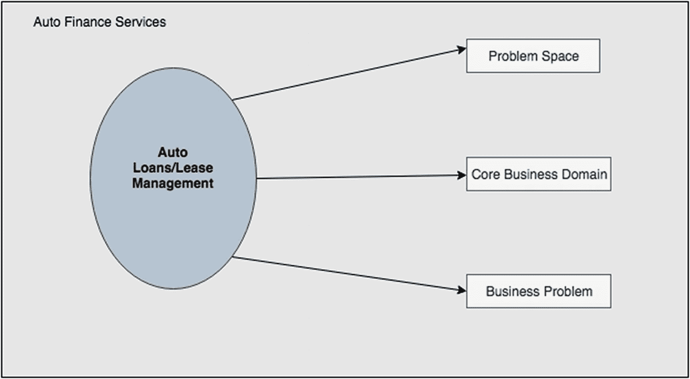
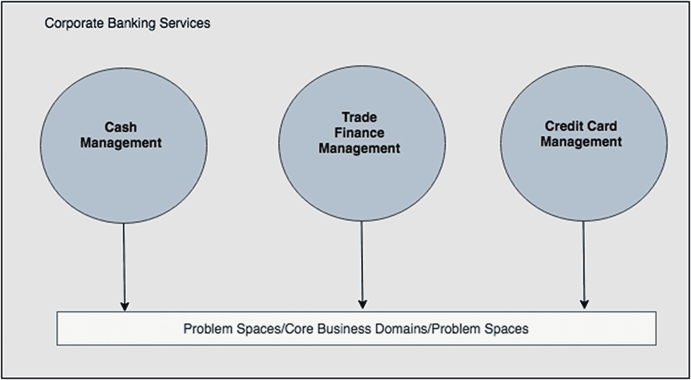
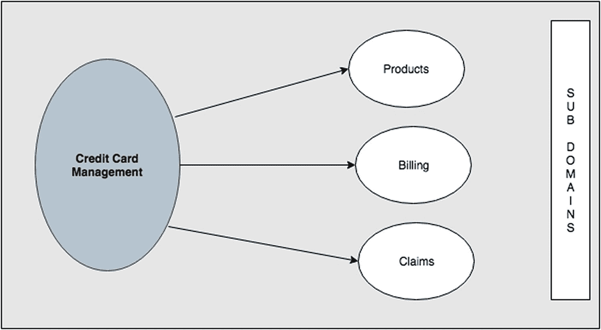
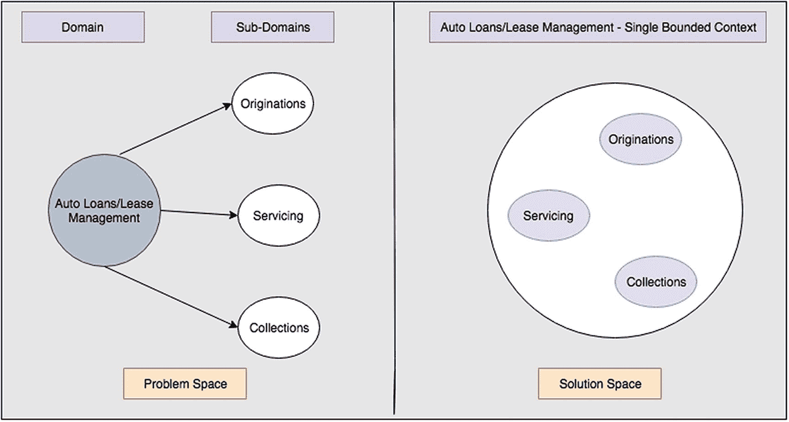
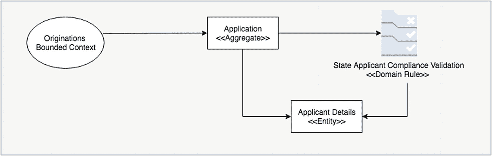
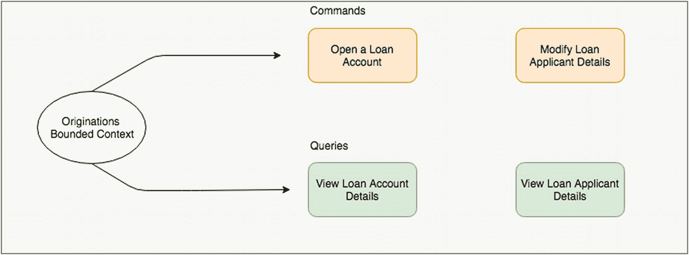

# 一、领域驱动设计

领域驱动设计为软件设计和开发提供了一种可靠的、系统的和全面的方法。它提供了一套工具和技术，有助于分解业务复杂性，同时保持核心业务模型作为该方法的核心。

长期以来，DDD 一直是传统(读取单片)项目的首选方法，随着微服务架构的出现，DDD 概念甚至越来越多地应用于这种新的架构范式。

这本书分成两大部分。

*DDD 概念的建模*

实现 DDD 从识别映射到 DDD 概念的工件(子域、有界上下文、域模型、域规则)的建模过程开始。这本书的前几章给出了 DDD 概念的高级概述，然后概述了一个完整的建模过程，以识别和记录相关的工件，遍历我们的参考应用的用例。

*DDD 概念的实施*

该书随后深入探讨了这些概念的实现。使用 Enterprise Java 作为基础平台，它经历了三种不同的实现:

*   第一个实现详细描述了基于使用 Java EE/Jakarta EE 平台的整体架构的 DDD 概念的实现。

*   第二个实现详细描述了 DDD 概念的实现，该实现基于微文件平台上的微服务架构。

*   最后，第三个实现详细介绍了基于 Spring 平台上微服务架构的 DDD 概念的实现。

这些实现涵盖了企业 Java 领域中流行的三个主要的主流平台，并提供了 DDD 模式实现的完整细节。

## DDD 概念

清楚了这本书的意图后，让我们通过快速浏览它的概念来步入 DDD 之旅。

### 问题空间/业务领域

我们需要熟悉的 DDD 的第一个主要概念是“问题空间”或“业务领域”的识别问题空间/业务领域是 DDD 之旅的起点，它确定了您打算使用 DDD 解决的主要业务问题。

让我们用一些实例来阐述这个概念。

第一个例子取自汽车金融行业的一个案例，如图 [1-1](#Fig1) 所示。如果你从事汽车金融业务，你从事的是管理汽车贷款和租赁的业务，也就是说，作为汽车金融提供商，你需要向消费者发放贷款/租赁，为他们提供服务，最后如果出现问题，收回贷款或终止租赁。这种情况下的 ***问题空间*** 可以归类为汽车贷款/租赁管理，也可以称为您的 ***核心业务领域*** 和您希望使用领域驱动设计解决的 ***业务问题*** 。

图 1-1

汽车金融服务问题空间

第二个例子是银行业的一个案例。与第一个例子不同，在这种情况下，不是一个而是多个问题空间需要使用领域驱动设计来解决(图 [1-2](#Fig2) )。

图 1-2

零售银行服务中的业务领域

作为一家银行，你可以向普通客户提供零售银行服务(图 [1-2](#Fig2) )或者向企业客户提供企业银行服务(图 [1-3](#Fig3) )。这些服务每个都有多个问题空间或核心业务领域。

图 1-3

企业银行服务中的核心业务领域

***问题空间/业务领域*** 总是不变地转化为你作为一家公司提供的核心业务主张。

### 子域/有界上下文

一旦我们确定了主要的业务领域，下一步就是将该领域分解为其子领域。子域的识别本质上包括将主业务域的各种业务能力分解成业务功能的内聚单元。

再次以汽车金融业务领域为例，这可以分为三个子领域，如图 [1-4](#Fig4) 所示。

图 1-4

汽车金融业务领域内的子域

*   ***发放子域***——该子域负责向客户发放新的汽车贷款/租赁的业务能力。

*   ***服务子域***–该子域负责为这些汽车贷款/租赁服务的业务能力(例如，每月计费/支付)。

*   ***托收子域***–该子域负责在出现问题(例如，客户拖欠付款)时管理这些汽车贷款/租赁的业务能力。

显而易见，子域是根据日常使用的主要业务的业务能力来确定的。

图 [1-5](#Fig5) 所示为另一个为我们的零售银行业务领域之一——信用卡管理业务领域确定子域的示例。

图 1-5

信用卡管理业务领域中的子域

*   ***产品子域***——该子域负责管理所有类型的信用卡产品的业务能力。

*   ***计费子域***–该子域负责客户信用卡的计费业务能力。

*   ***索赔子域***–该子域负责管理客户信用卡任何类型索赔的业务能力。

再次强调实际的业务能力有助于清晰地识别子域。

那么什么是有界上下文呢？

概括地说，我们从确定我们的业务领域开始我们的旅程。我们进一步阐述了我们的业务领域，将它们分成不同的功能，以确定映射到业务中不同功能的子域。

我们需要开始为之前确定的相应领域/子域创建解决方案，也就是说，我们需要从*问题空间*区域转移到*解决方案空间*区域，这就是有界上下文发挥核心作用的地方。

> 简单地说，有界上下文是我们确定的业务领域/子域的设计解决方案。

有界上下文的标识主要由业务领域内和子域之间所需的内聚性控制。

回到汽车金融业务领域的第一个例子，我们可以选择为整个领域提供一个单一的解决方案，也就是说，为所有子域提供一个单一的有界上下文；或者我们可以选择将一个有界的上下文映射到一个子域/多个子域。

图 [1-6](#Fig6) 中汽车贷款/租赁管理问题空间的解决方案是所有子域的单一有界上下文。

图 1-6

汽车金融子域作为单个有界上下文解决

另一种方法是将汽车金融领域中的不同子域作为单独的有界上下文来解决。图 [1-7](#Fig7) 展示了这一点。

图 1-7

汽车金融子域作为独立的有界上下文解决

只要有界的上下文被视为一个单一的内聚单元，对部署的选择就没有限制。您可以对多绑定上下文方法进行整体部署(单个 Web Archive [WAR]文件，每个绑定上下文有多个 JAR 文件)，您可以选择一个微服务部署模型，每个绑定上下文作为一个单独的容器，或者您可以选择一个无服务器模型，每个绑定上下文作为一个功能进行部署。

作为后续章节中实现的一部分，我们将研究各种可用的部署模型。

## 领域模型

我们现在处于领域解决过程中最重要和最关键的部分，即有界上下文的领域模型的建立。简而言之，领域模型是核心业务逻辑在特定范围内的实现。

在商业语言中，这包括识别

*   商业实体

*   商业规则

*   业务流程

*   业务操作

*   企业业务

在 DDD 世界的技术语言中，这可以解释为识别

*   聚合/实体/值对象

*   域规则

*   萨迦

*   命令/查询

*   事件

这如图 [1-8](#Fig8) 所示。如图所示，业务语言结构被映射到它们相应的 DDD 技术语言结构。

图 1-8

在 DDD 范式中，按照业务语言及其相应的技术语言，有界上下文的领域模型

虽然我们将在随后的章节中详细阐述这些不同的概念，但让我们在这里简单地讨论一下。如果现在还没有什么意义，不要担心。接下来的章节将确保你对这些概念有一个良好的基础。

### 聚合/实体对象/值对象

聚合(也称为根聚合)是有界上下文中的中心业务对象，它定义了有界上下文中的一致性范围。有界上下文的每个方面都在根聚合中开始和结束。

*   *Aggregate =您的有界上下文的主标识符*

实体对象有自己的身份，但没有根聚合就不能存在，也就是说，它们在创建根聚合时创建，在销毁根聚合时销毁。

*   *实体对象=你的有界上下文的二级标识符*

值对象没有标识，在根聚合或实体的实例中很容易替换。

作为一个例子，让我们以我们的汽车贷款/租赁管理领域的发起有界上下文为例(图 [1-9](#Fig9) )。

图 1-9

发起有界上下文中的聚合/实体/值对象

**贷款申请集合*是发起有界上下文中的根集合。如果没有贷款申请，在这个有界的上下文中什么都不存在，因此在这个有界的上下文或根聚合中没有主体标识符。*

 ***贷款申请人详细信息实体对象*捕获贷款申请的申请人详细信息(人口统计、地址等。).它有自己的标识符(申请人 ID)，但没有贷款申请就不能存在，也就是说，在创建贷款申请时，会创建贷款申请人详细信息；同样，当贷款申请被取消时，贷款申请人的详细信息也被删除。*

 **贷款金额值对象*表示贷款申请的贷款金额。它没有自己的身份，可以在贷款申请聚合实例中替换。

我们在下一章中的参考应用将更详细地介绍所有这些概念，所以如果现在还没有什么意义，不要担心。请注意，我们需要识别集合/实体和值对象。

### 域规则

*领域规则*是纯业务规则定义。也被建模为对象，它们帮助聚合在一个有限的上下文范围内执行任何类型的业务逻辑。

在我们的 Originations Bounded 上下文中，域规则的一个很好的例子是“State Applicant Compliance Validation”业务规则。该规则基本上规定，根据贷款申请的“州”(例如，CA，NY)，额外的验证检查可能适用于贷款申请人。

州申请人合规性验证域规则与贷款聚合一起工作，根据创建贷款申请的州来验证贷款申请，如图 [1-10](#Fig10) 所示。

图 1-10

始发有界上下文中的域规则

### 命令/查询

命令和查询代表有界上下文内的任何种类的操作，这些操作或者影响集合/实体的状态，或者查询集合/实体的状态。

如图 [1-11](#Fig11) 所示，发起有界上下文中的一些命令示例包括“开立贷款账户”和“修改贷款申请人详细信息”，而查询示例包括“查看贷款账户详细信息”和“查看贷款申请人详细信息”

图 1-11

始发有界上下文中的命令/查询

### 事件

事件捕获有界上下文中聚合或实体的任何类型的状态变化。如图 [1-12](#Fig12) 所示。

图 1-12

发起有界上下文中的事件

### 萨迦

DDD 模型的最后一个方面是在你的业务领域内清除任何种类的业务流程/工作流。在 DDD 的术语中，这些被称为传奇。如上所述，sagas 是唯一不局限于单个有界上下文的工件，并且可能跨越多个有界上下文，并且在大多数情况下，它将跨越多个有界上下文。

有界上下文或者具体地说有界上下文内的集合充当传奇参与者。Sagas 对跨越有界上下文的多个业务事件做出反应，并通过协调这些有界上下文之间的交互来"*编排业务流程*。

让我们来看一个汽车金融业务领域的传奇案例——开立贷款账户。

如果我们为贷款账户的开立制定业务流程

1.  客户向 X 汽车金融公司提出 ***贷款申请*** 购买新车。

2.  x 汽车金融公司验证贷款申请详细信息，以确定最适合客户的贷款产品。

3.  x 汽车金融公司要么批准贷款申请，要么拒绝贷款申请。

4.  如果贷款申请获得批准，X 汽车金融公司向客户提供贷款产品条款，包括利率、期限等。

5.  客户接受贷款产品条款。

6.  x 汽车金融公司受理贷款申请后进行审批。

7.  x 汽车金融公司为客户开立新的 ***贷款账户*** 。

很明显，这个业务流程涉及多个有界上下文，也就是说，它从发起有界上下文(批准贷款申请)开始，在服务有界上下文(开立贷款帐户)中结束。这如图 [1-13](#Fig13) 所示。

图 1-13

贷款开户传奇

我们现在已经为我们的业务领域建立了一个领域模型，并准备实现它。

## 摘要

总结我们的章节

*   我们从建立主要问题空间或我们打算使用 DDD 解决的业务问题开始。

*   一旦建立起来，我们就将问题空间分成多个业务能力或子域。然后，我们开始通过确定有界上下文来进入解决方案空间。

*   最后一部分是通过为有界上下文建立域模型来深入解决方案空间。这包括在每个限定的上下文中识别集合/操作/过程流。**