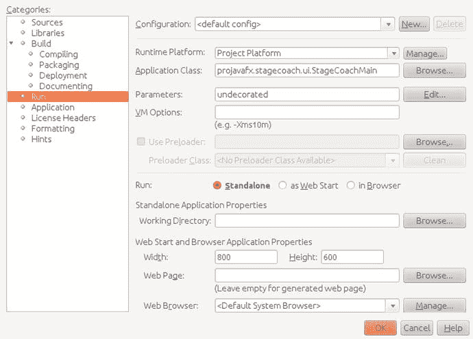
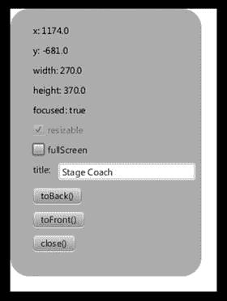
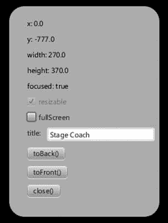
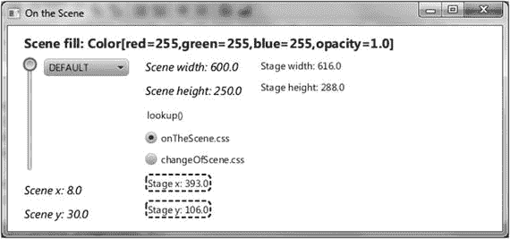
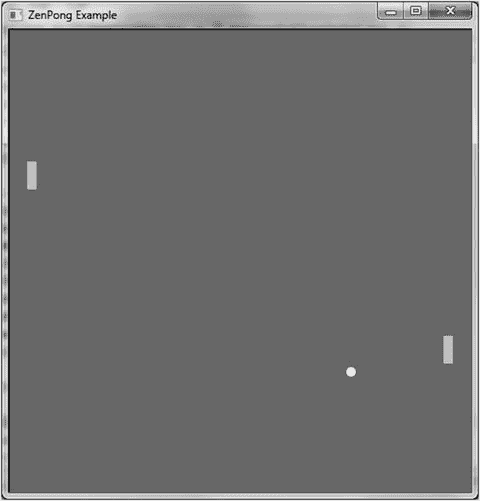

# 2.在 JavaFX 中创建用户界面

生活是没有橡皮擦的绘画艺术。—约翰·w·加德纳

第 [1](1.html) 章讲述了开发和执行 JavaFX 程序的基础知识，帮助您快速使用 JavaFX。现在我们将讲述在 JavaFX 中创建 UI 的许多细节，这些细节在第 1 章[中被忽略了。议程上的第一项是让您熟悉 JavaFX 用来表达 UI 的剧场隐喻，并涵盖我们称之为以节点为中心的 UI 的意义。](1.html)

## 用户界面的编程式创建与声明式创建

JavaFX 平台为创建 UI 提供了两种互补的方式。在本章中，我们将讨论如何使用 Java API 来创建和填充 UI。对于习惯于编写代码来利用 API 的 Java 开发人员来说，这是一种方便的方式。

设计者经常使用图形工具来声明而不是编程 UI。JavaFX 平台定义了 FXML，这是一种基于 XML 的标记语言，可用于以声明方式描述 UI。此外，Gluon 提供了一个名为 Scene Builder 的图形工具，该工具能够处理 FXML 文件。场景生成器的使用在第 [4](4.html) 章中演示。

请注意，部分 UI 可以使用 API 创建，而其他部分可以使用 Scene Builder 创建。FXML APIs 提供了两种方法之间的桥梁和集成粘合剂。

## 以节点为中心的用户界面简介

在 JavaFX 中创建 UI 就像创建一部戏剧，因为它通常由以下非常简单的步骤组成:

1.  创造一个你的程序可以表演的舞台。您的阶段的实现将取决于它所部署的平台(例如，台式机、平板电脑或嵌入式系统)。
2.  创建一个场景，其中演员和道具(节点)将在视觉上相互交流，并与观众(您的程序的用户)交流。像戏剧行业中任何优秀的布景设计师一样，优秀的 JavaFX 开发人员努力使他们的场景在视觉上吸引人。为此，与平面设计师合作完成你的“戏剧”通常是个好主意
3.  在场景中创建节点。这些节点是`javafx.scene.Node`类的子类，包括 UI 控件、形状、文本(一种形状)、图像、媒体播放器、嵌入式浏览器和您创建的自定义 UI 组件。节点也可以是其他节点的容器，通常提供跨平台的布局功能。场景具有包含节点的有向图的场景图。通过更改一组非常丰富的`Node`属性的值，可以以多种方式操作单个节点和节点组(例如，移动、缩放和设置不透明度)。
4.  创建表示场景中节点模型的变量和类。正如在第 [1](1.html) 章中所讨论的，JavaFX 的一个非常强大的方面是绑定，它使应用程序的 UI 能够很容易地与应用程序的状态或模型保持同步。注本章中的大多数例子都是用来演示 UI 概念的小程序。由于这个原因，许多例子中的模型由出现在主程序中的变量组成，而不是包含在单独的 Java 类中(例如第 [1](1.html) 章中的`AudioConfigModel`类)。
5.  创建事件处理程序，比如`onMousePressed`，允许用户与你的程序交互。通常，这些事件处理程序操纵模型中的实例变量。许多这样的处理程序需要实现一个抽象方法，因此提供了一个使用 lambda 表达式的绝佳机会。
6.  创建为场景添加动画的时间轴和过渡。例如，您可能希望书籍列表的缩略图在场景中平滑移动，或者希望 UI 中的某个页面淡入视图。你可能只是想让一个乒乓球在场景中移动，从墙壁和球拍上反弹回来；这将在本章后面的“节点冲突检测的原理”一节中演示。

让我们从第 1 步开始，在这一步中，我们检查阶段的功能。

## 搭建舞台

您的舞台的外观和功能将取决于它所部署的平台。例如，如果部署在移动设备或带有触摸屏的嵌入式设备中，您的舞台可能是整个触摸屏。部署在 X11 系统中的 JavaFX 程序的舞台将是一个窗口。

### 了解舞台类

对于任何具有图形用户界面的 JavaFX 程序来说,`Stage`类都是顶级容器。它有几个属性和方法，例如，允许它被定位、调整大小、给定标题、变得不可见或给定某种程度的不透明度。我们所知道的学习一个类的能力的两个最好的方法是研究 JavaFX API 文档和检查(和编写)使用它的程序。在本节中，我们要求您两者都做，从查看 API 文档开始。

JavaFX API 文档和其他 Java API 文档一样，可以在 [`http://download.java.net/java/jdk9/docs/api/overview-summary`](http://download.java.net/java/jdk9/docs/api/overview-summary) 在线获得。在浏览器中打开`index.html`文件，导航到 javafx.graphics 模块中的`javafx.stage`包，并选择`Stage`类。该页面应包含属性、构造器和方法的表格，包括图 [2-1](#Fig1) 摘录中显示的部分。


图 2-1。

A portion of the `Stage` class documentation in the JavaFX API

继续浏览`Stage`类中每个属性和方法的文档，记住点击链接以显示更详细的信息。当您完成时，请回来，我们将向您展示一个程序，它演示了在`Stage`类中可用的许多属性和方法。

### 使用 Stage 类:StageCoach 示例

图 [2-2](#Fig2) 显示了一个谦逊的、故意不合适的 StageCoach 示例程序的截图。


图 2-2。

A screenshot of the StageCoach example

StageCoach 程序旨在指导您使用`Stage`类和相关类，如`StageStyle`和`Screen`。此外，我们用这个程序向您展示如何将参数传递到程序中。在浏览程序的行为之前，先打开项目。遵循第 [1 章](1.html)中构建和执行音频配置项目的说明。项目文件位于 Chapter02 目录中，该目录隶属于您提取本书的代码下载包的位置。

Examining the Behavior of the Stagecoach Program

当程序启动时，其外观应该类似于图 [2-2](#Fig2) 中的截图。要全面检查其行为，请执行以下步骤。注意，出于教学目的，UI 上的属性和方法名称对应于`Stage`实例中的属性和方法。

请注意，StageCoach 程序的窗口最初显示在屏幕顶部附近，其水平位置在屏幕中央。拖动程序的窗口，观察 UI 顶部附近的 x 和 y 值会动态更新，以反映它在屏幕上的位置。

调整程序窗口的大小，观察宽度和高度值的变化，以反映`Stage`的宽度和高度。请注意，这个大小包括窗口的装饰(标题栏和边框)。

单击该程序(或以其他方式使其成为焦点),注意聚焦的值为 true。使窗口失去焦点，可能是通过单击屏幕上的其他地方，注意焦点值变为 false。

清除 resizable 复选框，然后注意 resizable 值变为 false。然后尝试调整窗口大小，注意这是不允许的。再次选中可调整大小复选框，使窗口可调整大小。

选择全屏复选框。请注意，程序占据了整个屏幕，窗口装饰不可见。清除“全屏”复选框，将程序恢复到原来的大小。

编辑标题标签旁边的文本字段中的文本，注意窗口标题栏中的文本已更改以反映新值。

拖动窗口以部分覆盖另一个窗口，然后单击后退()。请注意，这会将程序放在另一个窗口的后面，因此会导致 z 顺序发生变化。

当程序窗口的一部分在另一个窗口后面，但 toFront()按钮可见时，点按该按钮。请注意，该程序的窗口位于另一个窗口的前面。

单击 close()，注意程序已退出。

再次调用程序，传入字符串`"undecorated"`。如果从 NetBeans 调用，请使用项目属性对话框来传递此参数，如图 [2-3](#Fig3) 所示。`"undecorated"`字符串作为不带值的参数传递。



图 2-3。

Using NetBeans’ Project Properties dialog box to pass an argument into the program

注意，这次程序出现时没有任何窗口装饰，但是程序的白色背景包括了窗口的背景。图 [2-4](#Fig4) 截图中的黑色轮廓是桌面背景的一部分。

通过单击 close()再次退出程序，然后再次运行程序，将字符串`"transparent"`作为参数传入。注意程序以圆角矩形的形状出现，如图 [2-5](#Fig5) 所示。



图 2-4。

The StageCoach program after being invoked with the undecorated argument

注意你可能已经注意到图 [2-4](#Fig4) 和 [2-5](#Fig5) 中的截图有负的`y`值。这是因为在拍摄屏幕截图时，应用程序位于辅助显示器上，逻辑上位于主显示器之上。



图 2-5。

The StageCoach program after being invoked with the transparent argument

单击应用程序的用户界面，在屏幕上拖动它，完成后单击关闭()。祝贺你坚持这个 13 步练习！进行这个练习可以让你对它背后的代码有所了解，现在我们一起来看一看。

### 了解公共马车项目

在我们指出新的相关概念之前，请看一下清单 [2-1](#Par39) 中 StageCoach 程序的代码。

```java
package projavafx.stagecoach.ui;
import java.util.List;
import javafx.application.Application;
import javafx.beans.property.SimpleStringProperty;
import javafx.beans.property.StringProperty;
import javafx.geometry.Rectangle2D;
import javafx.geometry.VPos;
import javafx.scene.Group;
import javafx.scene.Scene;
import javafx.scene.control.Button;
import javafx.scene.control.CheckBox;
import javafx.scene.control.Label;
import javafx.scene.control.TextField;
import javafx.scene.input.MouseEvent;
import javafx.scene.layout.HBox;
import javafx.scene.layout.VBox;
import javafx.scene.paint.Color;
import javafx.scene.shape.Rectangle;
import javafx.scene.text.Text;
import javafx.stage.Screen;
import javafx.stage.Stage;
import javafx.stage.StageStyle;
import javafx.stage.WindowEvent;

public class StageCoachMain extends Application {

    StringProperty title = new SimpleStringProperty();

    Text textStageX;
    Text textStageY;
    Text textStageW;
    Text textStageH;
    Text textStageF;
    CheckBox checkBoxResizable;
    CheckBox checkBoxFullScreen;

    double dragAnchorX;
    double dragAnchorY;

    public static void main(String[] args) {
        Application.launch(args);
    }

    @Override
    public void start(Stage stage) {
        StageStyle stageStyle = StageStyle.DECORATED;
        List<String> unnamedParams = getParameters().getUnnamed();
        if (unnamedParams.size() > 0) {
            String stageStyleParam = unnamedParams.get(0);
            if (stageStyleParam.equalsIgnoreCase("transparent")) {
                stageStyle = StageStyle.TRANSPARENT;
            } else if (stageStyleParam.equalsIgnoreCase("undecorated")) {
                stageStyle = StageStyle.UNDECORATED;
            } else if (stageStyleParam.equalsIgnoreCase("utility")) {
                stageStyle = StageStyle.UTILITY;
            }
        }
        final Stage stageRef = stage;
        Group rootGroup;
        TextField titleTextField;
        Button toBackButton = new Button("toBack()");
        toBackButton.setOnAction(e -> stageRef.toBack());
        Button toFrontButton = new Button("toFront()");
        toFrontButton.setOnAction(e -> stageRef.toFront());
        Button closeButton = new Button("close()");
        closeButton.setOnAction(e -> stageRef.close());
        Rectangle blue = new Rectangle(250, 350, Color.SKYBLUE);
        blue.setArcHeight(50);
        blue.setArcWidth(50);
        textStageX = new Text();
        textStageX.setTextOrigin(VPos.TOP);
        textStageY = new Text();
        textStageY.setTextOrigin(VPos.TOP);
        textStageH = new Text();
        textStageH.setTextOrigin(VPos.TOP);
        textStageW = new Text();
        textStageW.setTextOrigin(VPos.TOP);
        textStageF = new Text();
        textStageF.setTextOrigin(VPos.TOP);
        checkBoxResizable = new CheckBox("resizable");
        checkBoxResizable.setDisable(stageStyle == StageStyle.TRANSPARENT
                || stageStyle == StageStyle.UNDECORATED);
        checkBoxFullScreen = new CheckBox("fullScreen");
        titleTextField = new TextField("Stage Coach");
        Label titleLabel = new Label("title");
        HBox titleBox = new HBox(titleLabel, titleTextField);
        VBox contentBox = new VBox(
                textStageX, textStageY, textStageW, textStageH, textStageF,
                checkBoxResizable, checkBoxFullScreen,
                titleBox, toBackButton, toFrontButton, closeButton);
        contentBox.setLayoutX(30);
        contentBox.setLayoutY(20);
        contentBox.setSpacing(10);
        rootGroup = new Group(blue, contentBox);

        Scene scene = new Scene(rootGroup, 270, 370);
        scene.setFill(Color.TRANSPARENT);

        //when mouse button is pressed, save the initial position of screen
        rootGroup.setOnMousePressed((MouseEvent me) -> {
            dragAnchorX = me.getScreenX() - stageRef.getX();
            dragAnchorY = me.getScreenY() - stageRef.getY();
        });

        //when screen is dragged, translate it accordingly
        rootGroup.setOnMouseDragged((MouseEvent me) -> {
            stageRef.setX(me.getScreenX() - dragAnchorX);
            stageRef.setY(me.getScreenY() - dragAnchorY);
        });

        textStageX.textProperty().bind(new SimpleStringProperty("x: ")
                .concat(stageRef.xProperty().asString()));
        textStageY.textProperty().bind(new SimpleStringProperty("y: ")
                .concat(stageRef.yProperty().asString()));
        textStageW.textProperty().bind(new SimpleStringProperty("width: ")
                .concat(stageRef.widthProperty().asString()));
        textStageH.textProperty().bind(new SimpleStringProperty("height: ")
                .concat(stageRef.heightProperty().asString()));
        textStageF.textProperty().bind(new SimpleStringProperty("focused: ")
                .concat(stageRef.focusedProperty().asString()));
        stage.setResizable(true);
        checkBoxResizable.selectedProperty()
                .bindBidirectional(stage.resizableProperty());
        checkBoxFullScreen.selectedProperty().addListener((ov, oldValue, newValue) -> {
            stageRef.setFullScreen(checkBoxFullScreen.selectedProperty().getValue());
        });
        title.bind(titleTextField.textProperty());

        stage.setScene(scene);
        stage.titleProperty().bind(title);
        stage.initStyle(stageStyle);
        stage.setOnCloseRequest((WindowEvent we) -> {
            System.out.println("Stage is closing");
        });
        stage.show();
        Rectangle2D primScreenBounds = Screen.getPrimary().getVisualBounds();
        stage.setX((primScreenBounds.getWidth() - stage.getWidth()) / 2);
        stage.setY((primScreenBounds.getHeight() - stage.getHeight()) / 4);
    }
}

Listing 2-1.
StageCoachMain.java

```

#### 获取程序参数

这个程序引入的第一个新概念是读取传递给 JavaFX 程序的参数的能力。`javafx.application`包包含一个名为`Application`的类，该类包含与应用程序生命周期相关的方法，如`launch()`、`init()`、`start()`和`stop()`。`Application`类中的另一个方法是`getParameters()`，它允许应用程序访问命令行上传递的参数，以及 JNLP 文件中指定的未命名参数和`<name,value>`对。为了方便起见，下面是清单 [2-1](#Par39) 中的相关代码片段:

```java
StageStyle stageStyle = StageStyle.DECORATED;
List<String> unnamedParams = getParameters().getUnnamed();
if (unnamedParams.size() > 0) {
  String stageStyleParam = unnamedParams.get(0);
  if (stageStyleParam.equalsIgnoreCase("transparent")) {
    stageStyle = StageStyle.TRANSPARENT;
  }
  else if (stageStyleParam.equalsIgnoreCase("undecorated")) {
    stageStyle = StageStyle.UNDECORATED;
  }
  else if (stageStyleParam.equalsIgnoreCase("utility")) {
    stageStyle = StageStyle.UTILITY;
  }
}
...code omitted...
stage.initStyle(stageStyle);

```

#### 设定舞台风格

我们使用前面描述的`getParameters()`方法来获得一个参数，告诉我们`Stage`实例的舞台样式应该是它的默认样式(`StageStyle.DECORATED`)、`StageStyle.UNDECORATED`还是`StageStyle.TRANSPARENT`。在前面的练习中，您已经看到了每种方法的效果，特别是在图 [2-2](#Fig2) 、 [2-4](#Fig4) 和 [2-5](#Fig5) 中。

#### 控制阶段是否可调整大小

如清单 [2-1](#Par39) 中的摘录所示，为了使这个应用程序的窗口最初可调整大小，我们调用了`Stage`实例的`setResizable()`方法。为了保持`Stage`的 resizable 属性和 resizable 复选框的状态同步，复选框被双向绑定到`Stage`实例的 resizable 属性。

```java
stage.setResizable(true);
checkBoxResizable.selectedProperty()
        .bindBidirectional(stage.resizableProperty());

```

Tip

无法显式设置绑定的属性。在代码段之前的代码中，在下一行中绑定 resizable 属性之前，使用`setResizable()`方法设置该属性。

#### 使舞台全屏显示

通过将`Stage`实例的`fullScreen`属性设置为 true，可以使`Stage`以全屏模式显示。如清单 [2-1](#Par39) 中的代码片段所示，为了保持`Stage`的`fullScreen`属性和全屏复选框的状态同步，每当`checkBox`的 selected 属性改变时，就会更新`Stage`实例的`fullScreen`属性。

```java
checkBoxFullScreen.selectedProperty().addListener((ov, oldValue, newValue) -> {
    stageRef.setFullScreen(checkBoxFullScreen.selectedProperty().getValue());
});

```

注意，全屏模式对某些平台没有影响。例如，在移动设备上，JavaFX 应用程序将默认为全屏模式，而 JavaFX 在移动设备上的发行版不允许非全屏选项，因为这在设备上的移动应用程序世界中没有意义。

#### 在舞台的边界上工作

`Stage`的边界由它的`x`、`y`、`width`和`height`属性表示，这些属性的值可以随意更改。清单 [2-1](#Par39) 中的以下代码片段演示了这一点，其中`Stage`被放置在顶部附近，并且在`Stage`被初始化后在主屏幕上水平居中。

```java
Rectangle2D primScreenBounds = Screen.getPrimary().getVisualBounds();
stage.setX((primScreenBounds.getWidth() - stage.getWidth()) / 2);
stage.setY((primScreenBounds.getHeight() - stage.getHeight()) / 4);

```

我们使用`javafx.stage`包的`Screen`类来获取主屏幕的尺寸，以便计算出所需的位置。

Note

我们有意使图 [2-2](#Fig2) 中的`Stage`大于其中包含的`Scene`以说明以下要点。`Stage`的宽度和高度包括其装饰(标题栏和边框)，在不同的平台上有所不同。因此，通常最好控制`Scene`的宽度和高度(我们稍后会向您展示如何控制)，并让`Stage`符合该尺寸。

#### 绘制圆角矩形

正如第 [1](1.html) 章所指出的，通过指定拐角的`arcWidth`和`arcHeight`，可以在`Rectangle`上设置圆角。清单 [2-1](#Par39) 中的以下代码片段绘制了天蓝色圆角矩形，该矩形成为图 [2-5](#Fig5) 中透明窗口示例的背景。

```java
Rectangle blue = new Rectangle(250, 350, Color.SKYBLUE);
blue.setArcHeight(50);
blue.setArcWidth(50);

```

在这个代码片段中，我们使用了三个参数的构造器`Rectangle`，其中前两个参数指定了`Rectangle`的宽度和高度。第三个参数定义了`Rectangle`的填充颜色。

从这段代码中可以看出，使用`arcWidth(double v)`和`arcHeight(double v)`方法很容易创建圆角矩形，其中参数`v`定义了圆弧的直径。

#### 标题栏不可用时在桌面上拖动舞台

可以使用标题栏在桌面上拖动`Stage`，但是当`StageStyle`是`UNDECORATED`或`TRANSPARENT`时，标题栏不可用。为了允许在这种情况下拖动，我们添加了清单 [2-1](#Par39) 中的代码片段。

```java
//when mouse button is pressed, save the initial position of screen
rootGroup.setOnMousePressed((MouseEvent me) -> {
    dragAnchorX = me.getScreenX() - stageRef.getX();
    dragAnchorY = me.getScreenY() - stageRef.getY();
});

//when screen is dragged, translate it accordingly
rootGroup.setOnMouseDragged((MouseEvent me) -> {
    stageRef.setX(me.getScreenX() - dragAnchorX);
    stageRef.setY(me.getScreenY() - dragAnchorY);
});

```

事件处理程序将在本章稍后介绍，但是作为预览，当鼠标被拖动时，提供给`onMouseDragged()`方法的 lambda 表达式将被调用。因此，`x`和`y`属性的值会根据鼠标被拖动的像素数而改变，这将随着鼠标被拖动而移动`Stage`。

#### 使用 UI 布局容器

当开发将在跨平台环境中部署或国际化的应用程序时，最好使用布局容器。使用布局容器的一个优点是，当节点大小改变时，它们彼此之间的可视关系是可预测的。另一个优点是，您不必计算放在 UI 中的每个节点的位置。

清单 [2-1](#Par39) 中的以下代码片段显示了位于`javafx.scene.layout`包中的`VBox`布局类如何用于在一列中排列`Text`、`CheckBox`、`HBox`和`Button`节点。这个代码片段还显示了布局容器可能是嵌套的，如名为`titleBox`的`HBox`所示，它水平排列`Label`和`TextField`节点。请注意，为了清楚地显示布局嵌套，此代码片段中省略了几行代码:

```java
HBox titleBox = new HBox(titleLabel, titleTextField);
VBox contentBox = new VBox(
        textStageX, textStageY, textStageW, textStageH, textStageF,
        checkBoxResizable, checkBoxFullScreen,
        titleBox, toBackButton, toFrontButton, closeButton);

```

布局类`VBox`类似于第 [1](1.html) 章中 Hello Earthrise 示例中讨论的`Group`类，因为它包含一个节点集合。与`Group`类不同，`VBox`类垂直排列其包含的节点，按照 spacing 属性中指定的像素数来分隔它们。

#### 确定舞台是否在焦点上

要知道您的 JavaFX 应用程序是否是当前处于焦点中的应用程序(例如，按下的键被传送到应用程序)，只需查询`Stage`实例的`focused`属性。清单 [2-1](#Par39) 中的以下片段演示了这一点。

```java
textStageF.textProperty().bind(new SimpleStringProperty("focused: ")
        .concat(stageRef.focusedProperty().asString()));

```

#### 控制舞台的 Z 顺序

如果您希望 JavaFX 应用程序出现在屏幕上其他窗口的顶部或后面，您可以分别使用`toFront()`和`toBack()`方法。清单 [2-1](#Par39) 中的以下片段展示了这是如何实现的。

```java
Button toBackButton = new Button("toBack()");
toBackButton.setOnAction(e -> stageRef.toBack());
Button toFrontButton = new Button("toFront()");
toFrontButton.setOnAction(e -> stageRef.toFront());

```

再次注意使用 lambda 表达式如何增强代码的可读性。从代码片段的第一行可以清楚地看到，创建了一个名为`toBackButton`的`Button`，按钮上显示了一个文本`"toBack()"`。第二行定义了当在按钮上执行一个动作时(即点击按钮)，stage 被发送到后面。

如果不使用 lambda 表达式，第二行将被对匿名内部类的调用所替换，如下所示:

```java
toBackButton.setOnAction(new EventHandler<javafx.event.ActionEvent>() {
  @Override public void handle(javafx.event.ActionEvent e) {
    stageRef.toBack();
  }
})

```

这种方法不仅需要更多的代码，而且不允许 Java 运行时优化调用，可读性也差得多。

#### 关闭载物台并检测其关闭时间

如清单 [2-1](#Par39) 中的代码片段所示，您可以用它的`close()`方法以编程方式关闭`Stage`。当`stageStyle`未装饰或透明时，这很重要，因为窗口系统提供的关闭按钮不存在。

```java
Button closeButton = new Button("close()");
closeButton.setOnAction(e -> stageRef.close());

```

顺便说一下，您可以通过使用清单 [2-1](#Par39) 中的代码片段所示的`onCloseRequest`事件处理程序来检测何时有关闭`Stage`的外部请求。

```java
stage.setOnCloseRequest((WindowEvent we) -> {
        System.out.println("Stage is closing");
});

```

要看到这一点，在没有任何参数的情况下运行应用程序，使其具有前面显示的图 [2-2](#Fig2) 的外观，然后单击窗口装饰上的关闭按钮。

Tip

只有当有外部请求关闭窗口时，才会调用`onCloseRequest`事件处理程序。这就是为什么当您单击标有“close()”的按钮时，本例中没有出现“Stage is closing”消息。

## 大吵大闹

继续我们创建 JavaFX 应用程序的剧场隐喻，我们现在讨论在`Stage`上放置一个`Scene`。如你所知，`Scene`是演员和道具(节点)与观众(你的节目的使用者)进行视觉互动的地方。

### 使用场景类:OnTheScene 示例

与`Stage`类一样，我们将使用一个虚构的示例应用程序来演示和教授`Scene`类中可用功能的细节。OnTheScene 程序截图见图 [2-6](#Fig6) 。



图 2-6。

The OnTheScene program when first invoked

继续运行 OnTheScene 程序，按照下面的练习中的指示测试它的速度。接下来我们将对代码进行演练，以便您可以将行为与其背后的代码关联起来。

Examining the Behavior of the Onthescene Program

当 OnTheScene 程序启动时，其外观应该类似于图 [2-6](#Fig6) 中的截图。要全面检查其行为，请执行以下步骤。请注意，UI 上的属性和方法名称对应于`Scene`、`Stage`和`Cursor`类中的属性和方法，以及级联样式表(CSS)文件名。

1.  拖动应用程序，注意虽然`Stage x`和`y`值是相对于屏幕的，但是`Scene`的`x`和`y`值是相对于`Stage`(包括装饰)外部的左上角的。同样，`Scene`的宽度和高度是`Stage`内部的尺寸(不包括装饰)。如前所述，最好显式地设置`Scene`的宽度和高度(或者通过假设所包含节点的大小来隐式地设置它们)，而不是设置修饰过的`Stage`的宽度和高度。
2.  调整程序窗口的大小，观察宽度和高度值的变化，以反映`Scene`的宽度和高度。另请注意，当您更改窗口的高度时，场景中大部分内容的位置也会发生变化。
3.  单击 lookup()超链接，注意字符串“场景高度:XXX。x "打印在控制台中，其中 XXX。x 是`Scene`的高度。
4.  将鼠标悬停在选择框下拉列表上，注意它会变得稍微大一些。单击选择框并在列表中选择一种光标样式，注意光标会变为该样式。选择“无”时要小心，因为光标可能会消失，你需要使用键盘(或移动鼠标时的心灵力量)来使其可见。
5.  拖动左侧的滑块，注意到`Scene`的填充颜色发生了变化，并且`Scene`顶部的字符串反映了当前填充颜色的红绿蓝(RGB)和不透明度值。
6.  Notice the appearance and content of the text on the `Scene`. Then click changeOfScene.css, noticing that the color and font and content characteristics for some of the text on the `Scene` changes as shown in the screenshot in Figure [2-7](#Fig7).

    

    图 2-7。

    The OnTheScene program with the changeOfScene CSS style sheet applied  
7.  单击 OnTheScene.css，注意颜色和字体特征恢复到它们以前的状态。

既然您已经研究了这个演示了`Scene`特性的示例程序，那么让我们浏览一下代码吧！

### 了解 OnTheScene 程序

在我们指出新的和相关的概念之前，先看看清单 [2-2](#Par91) 中的 OnTheScene 程序的代码。

```java
import javafx.application.Application;
import javafx.beans.property.DoubleProperty;
import javafx.beans.property.SimpleDoubleProperty;
import javafx.beans.property.SimpleStringProperty;
import javafx.collections.FXCollections;
import javafx.collections.ObservableList;
import javafx.geometry.HPos;
import javafx.geometry.Insets;
import javafx.geometry.Orientation;
import javafx.geometry.VPos;
import javafx.scene.Cursor;
import javafx.scene.Scene;
import javafx.scene.control.ChoiceBox;
import javafx.scene.control.Hyperlink;
import javafx.scene.control.Label;
import javafx.scene.control.RadioButton;
import javafx.scene.control.Slider;
import javafx.scene.control.ToggleGroup;
import javafx.scene.layout.FlowPane;
import javafx.scene.layout.HBox;
import javafx.scene.paint.Color;
import javafx.scene.text.Font;
import javafx.scene.text.FontWeight;
import javafx.scene.text.Text;
import javafx.stage.Stage;

public class OnTheSceneMain extends Application {

    DoubleProperty fillVals = new SimpleDoubleProperty(255.0);

    Scene sceneRef;

    ObservableList cursors = FXCollections.observableArrayList(
            Cursor.DEFAULT,
            Cursor.CROSSHAIR,
            Cursor.WAIT,
            Cursor.TEXT,
            Cursor.HAND,
            Cursor.MOVE,
            Cursor.N_RESIZE,
            Cursor.NE_RESIZE,
            Cursor.E_RESIZE,
            Cursor.SE_RESIZE,
            Cursor.S_RESIZE,
            Cursor.SW_RESIZE,
            Cursor.W_RESIZE,
            Cursor.NW_RESIZE,
            Cursor.NONE
    );

    public static void main(String[] args) {
        Application.launch(args);
    }

    @Override
    public void start(Stage stage) {
        Slider sliderRef;
        ChoiceBox choiceBoxRef;
        Text textSceneX;
        Text textSceneY;
        Text textSceneW;
        Text textSceneH;
        Label labelStageX;
        Label labelStageY;
        Label labelStageW;
        Label labelStageH;

        final ToggleGroup toggleGrp = new ToggleGroup();
        sliderRef = new Slider(0, 255, 255);
        sliderRef.setOrientation(Orientation.VERTICAL);
        choiceBoxRef = new ChoiceBox(cursors);
        HBox hbox = new HBox(sliderRef, choiceBoxRef);
        hbox.setSpacing(10);
        textSceneX = new Text();
        textSceneX.getStyleClass().add("emphasized-text");
        textSceneY = new Text();
        textSceneY.getStyleClass().add("emphasized-text");
        textSceneW = new Text();
        textSceneW.getStyleClass().add("emphasized-text");
        textSceneH = new Text();
        textSceneH.getStyleClass().add("emphasized-text");
        textSceneH.setId("sceneHeightText");
        Hyperlink hyperlink = new Hyperlink("lookup");
        hyperlink.setOnAction((javafx.event.ActionEvent e) -> {
            System.out.println("sceneRef:" + sceneRef);
            Text textRef = (Text) sceneRef.lookup("#sceneHeightText");
            System.out.println(textRef.getText());
        });
        RadioButton radio1 = new RadioButton("onTheScene.css");
        radio1.setSelected(true);
        radio1.setToggleGroup(toggleGrp);
        RadioButton radio2 = new RadioButton("changeOfScene.css");
        radio2.setToggleGroup(toggleGrp);
        labelStageX = new Label();
        labelStageX.setId("stageX");
        labelStageY = new Label();
        labelStageY.setId("stageY");
        labelStageW = new Label();
        labelStageH = new Label();

        FlowPane sceneRoot = new FlowPane(Orientation.VERTICAL, 20, 10, hbox,
                textSceneX, textSceneY, textSceneW, textSceneH, hyperlink,
                radio1, radio2,
                labelStageX, labelStageY,
                labelStageW,
                labelStageH);
        sceneRoot.setPadding(new Insets(0, 20, 40, 0));
        sceneRoot.setColumnHalignment(HPos.LEFT);
        sceneRoot.setLayoutX(20);
        sceneRoot.setLayoutY(40);

        sceneRef = new Scene(sceneRoot, 600, 250);

        sceneRef.getStylesheets().add("onTheScene.css");
        stage.setScene(sceneRef);

        choiceBoxRef.getSelectionModel().selectFirst();

        // Setup various property binding
        textSceneX.textProperty().bind(new SimpleStringProperty("Scene x: ")
                .concat(sceneRef.xProperty().asString()));
        textSceneY.textProperty().bind(new SimpleStringProperty("Scene y: ")
                .concat(sceneRef.yProperty().asString()));
        textSceneW.textProperty().bind(new SimpleStringProperty("Scene width: ")
                .concat(sceneRef.widthProperty().asString()));
        textSceneH.textProperty().bind(new SimpleStringProperty("Scene height: ")
                .concat(sceneRef.heightProperty().asString()));
        labelStageX.textProperty().bind(new SimpleStringProperty("Stage x: ")
                .concat(sceneRef.getWindow().xProperty().asString()));
        labelStageY.textProperty().bind(new SimpleStringProperty("Stage y: ")
                .concat(sceneRef.getWindow().yProperty().asString()));
        labelStageW.textProperty().bind(new SimpleStringProperty("Stage width: ")
                .concat(sceneRef.getWindow().widthProperty().asString()));
        labelStageH.textProperty().bind(new SimpleStringProperty("Stage height: ")
                .concat(sceneRef.getWindow().heightProperty().asString()));
        sceneRef.cursorProperty().bind(choiceBoxRef.getSelectionModel()
                .selectedItemProperty());
        fillVals.bind(sliderRef.valueProperty());

        // When fillVals changes, use that value as the RGB to fill the scene
        fillVals.addListener((ov, oldValue, newValue) -> {
            Double fillValue = fillVals.getValue() / 256.0;
            sceneRef.setFill(new Color(fillValue, fillValue, fillValue, 1.0));
        });

        // When the selected radio button changes, set the appropriate style sheet
        toggleGrp.selectedToggleProperty().addListener((ov, oldValue, newValue) -> {
            String radioButtonText = ((RadioButton) toggleGrp.getSelectedToggle())
                    .getText();
            sceneRef.getStylesheets().clear();
            sceneRef.getStylesheets().addAll(radioButtonText);
        });

        stage.setTitle("On the Scene");
        stage.show();

        // Define an unmanaged node that will display Text
        Text addedTextRef = new Text(0, -30, "");
        addedTextRef.setTextOrigin(VPos.TOP);
        addedTextRef.setFill(Color.BLUE);
        addedTextRef.setFont(Font.font("Sans Serif", FontWeight.BOLD, 16));
        addedTextRef.setManaged(false);

        // Bind the text of the added Text node to the fill property of the Scene
        addedTextRef.textProperty().bind(new SimpleStringProperty("Scene fill: ").
                concat(sceneRef.fillProperty()));

        // Add to the Text node to the FlowPane
        ((FlowPane) sceneRef.getRoot()).getChildren().add(addedTextRef);
    }
}

Listing 2-2.
OnTheSceneMain.java

```

#### 为场景设置光标

可以为给定节点、整个场景或两者设置光标。要实现后者，将`Scene`实例的 cursor 属性设置为`Cursor`类中的一个常量值，如清单 [2-2](#Par91) 中的代码片段所示。

```java
sceneRef.cursorProperty().bind(choiceBoxRef.getSelectionModel()
        .selectedItemProperty());

```

通过查看 JavaFX API 文档中的`javafx.scene.Cursor`类可以看到这些光标值；我们在清单 [2-2](#Par91) 中创建了这些常量的集合。

#### 绘制场景的背景

`Scene`类有一个`javafx.scene.paint` `.Paint`类型的填充属性。查看 JavaFX API 会发现`Paint`的已知子类是`Color`、`ImagePattern`、`LinearGradient`和`RadialGradient`。因此，`Scene`的背景可以填充纯色、图案和渐变。如果不设置`Scene`的 fill 属性，将使用默认颜色(白色)。

Tip

其中一个`Color`常量是`Color.TRANSPARENT`，所以如果需要，你可以让`Scene`的背景完全透明。事实上，图 [2-5](#Fig5) 中 StageCoach 截图中圆角矩形后面的`Scene`不是白色的原因是它的 fill 属性被设置为`Color.TRANSPARENT`(见清单 [2-1](#Par39) )。

为了在 OnTheScene 示例中设置 fill 属性，我们使用 RGB 公式来创建颜色，而不是使用`Color`类中的常量之一(例如`Color.BLUE`)。查看 JavaFX API 文档中的`javafx.scene.paint.Color`类，向下滚动常量，如`ALICEBLUE`和`WHITESMOKE`，查看构造器和方法。我们使用了一个`Color`类的构造器，为它设置了 fill 属性，如清单 [2-2](#Par91) 中的代码片段所示。

```java
sceneRef.setFill(new Color(fillValue, fillValue, fillValue, 1.0));

```

当您移动绑定了`fillVals`属性的滑块时，`Color()`构造器的每个参数都被设置为一个从 0 到 255 的值，如清单 [2-2](#Par91) 中的代码片段所示。

```java
fillVals.bind(sliderRef.valueProperty());

```

#### 用节点普及场景

如第 [1](1.html) 章所述，您可以通过实例化节点并将它们添加到可以包含其他节点的容器节点(例如`Group`和`VBox`)来填充节点`Scene`。这些功能使您能够构建包含节点的复杂场景图。在这里的例子中，`Scene`的根属性包含一个`Flow`布局容器，这使得它的内容垂直或水平流动，根据需要换行。我们示例中的`Flow`容器包含一个`HBox`(包含一个`Slider`和一个`ChoiceBox`)和几个其他节点(类`Text`、`Hyperlink`和`RadioButton`的实例)。

#### 通过 ID 查找场景节点

可以在节点的`id`属性中为`Scene`中的每个节点分配一个 ID。例如，在清单 [2-2](#Par91) 的以下代码片段中，`Text`节点的`id`属性被赋予了`String "sceneHeightText"`。当调用超链接控件中的 action 事件处理程序时，使用`Scene`实例的`lookup()`方法获取对`id`为`"sceneHeightText"`的节点的引用。然后，事件处理程序将`Text`节点的内容打印到控制台。

Note

超链接控件本质上是一个具有超链接文本外观的按钮。它有一个动作事件处理程序，您可以在其中放置打开浏览器页面或任何其他所需功能的代码。

```java
textSceneH = new Text();
textSceneH.getStyleClass().add("emphasized-text");
textSceneH.setId("sceneHeightText");
Hyperlink hyperlink = new Hyperlink("lookup");
hyperlink.setOnAction((javafx.event.ActionEvent e) -> {
    System.out.println("sceneRef:" + sceneRef);
    Text textRef = (Text) sceneRef.lookup("#sceneHeightText");
    System.out.println(textRef.getText());
});

```

仔细检查动作事件处理程序可以发现，`lookup()`方法返回了一个`Node`，但是这个代码片段中返回的实际对象类型是一个`Text`对象。因为我们需要访问不在`Node`类中的`Text`类(文本)的属性，所以有必要强迫编译器相信在运行时该对象将是`Text`类的实例。

#### 从现场进入舞台

为了从`Scene`中获得对`Stage`实例的引用，我们使用了`Scene`类中名为`window`的属性。该属性的访问器方法出现在清单 [2-2](#Par91) 的以下代码片段中，用于获取屏幕上`Stage`的 x 和 y 坐标。

```java
labelStageX.textProperty().bind(new SimpleStringProperty("Stage x: ")
        .concat(sceneRef.getWindow().xProperty().asString()));
labelStageY.textProperty().bind(new SimpleStringProperty("Stage y: ")
        .concat(sceneRef.getWindow().yProperty().asString()));

```

#### 将节点插入场景的内容序列

有时向 UI 容器类的子类动态添加一个节点是很有用的。下面清单 [2-2](#Par91) 中的代码片段演示了如何通过向`FlowPane`实例的子实例动态添加一个`Text`节点来实现这一点:

```java
// Define an unmanaged node that will display Text
Text addedTextRef = new Text(0, -30, "");
addedTextRef.setTextOrigin(VPos.TOP);
addedTextRef.setFill(Color.BLUE);
addedTextRef.setFont(Font.font("Sans Serif", FontWeight.BOLD, 16));
addedTextRef.setManaged(false);

// Bind the text of the added Text node to the fill property of the Scene
addedTextRef.textProperty().bind(new SimpleStringProperty("Scene fill: ").
        concat(sceneRef.fillProperty()));

// Add the Text node to the FlowPane
((FlowPane) sceneRef.getRoot()).getChildren().add(addedTextRef);

```

这个特定的`Text`节点是图 [2-6](#Fig6) 和 [2-7](#Fig7) 中所示的`Scene`顶部的节点，其中显示了`Scene`的 fill 属性的值。注意，在这个例子中，`addedTextRef`实例的`managed`属性被设置为 false，所以它的位置不受`FlowPane`的控制。默认情况下，节点是“托管的”，这意味着它们的父节点(该节点添加到的容器)负责节点的布局。通过将`managed`属性设置为 false，假设开发人员负责布局节点。

#### CSS 样式化场景中的节点

JavaFX 的一个非常强大的方面是能够使用 CSS 动态地样式化`Scene`中的节点。在上一个练习的步骤 6 中，当您单击 changeOfScene.css 将 UI 的外观从图 [2-6](#Fig6) 中看到的更改为图 [2-7](#Fig7) 中显示的时，您使用了该功能。此外，在本练习的第 7 步中，当您选择 onTheScene.css 单选按钮时，UI 的外观变回图 [2-6](#Fig6) 所示的样子。清单 [2-2](#Par91) 中的相关代码片段如下所示:

```java
sceneRef.getStylesheets().add("onTheScene.css");
...code omitted...
// When the selected radio button changes, set the appropriate stylesheet
        toggleGrp.selectedToggleProperty().addListener((ov, oldValue, newValue) -> {
        String radioButtonText = ((RadioButton) toggleGrp.getSelectedToggle())
                .getText();
        sceneRef.getStylesheets().clear();
        sceneRef.getStylesheets().addAll("/"+radioButtonText);
});

```

在这个代码片段中，`Scene`的`stylesheets`属性被初始化为`onTheScene.css`文件的位置，在本例中是根目录。片段中还显示了当点击适当的按钮时，CSS 文件被分配给`Scene`。`RadioButton`实例的文本等于样式表的名称，因此我们可以很容易地为场景设置相应的样式表。查看清单 [2-3](#Par114) 以查看与图 [2-6](#Fig6) 中的截图相对应的样式表。这个样式表中的一些 CSS 选择器表示其`id`属性为`"stageX"`或`"stageY"`的节点。这个样式表中还有一个选择器，它表示`styleClass`属性为`"emphasized-text"`的节点。此外，在这个样式表中有一个选择器，它通过将控件的驼色名称替换为小写连字符名称(选择框)来映射到 ChoiceBox UI 控件。该样式表中的属性以“`-fx`”开头，并对应于它们所关联的节点类型。该样式表中的值(例如，黑色、斜体和 14pt)表示为标准 CSS 值。

```java
#stageX, #stageY {
  -fx-padding: 1;
  -fx-border-color: black;
  -fx-border-style: dashed;
  -fx-border-width: 2;
  -fx-border-radius: 5;
}

.emphasized-text {
  -fx-font-size: 14pt;
  -fx-font-weight: normal;
  -fx-font-style: italic;
}

.choice-box:hover {
    -fx-scale-x: 1.1;
    -fx-scale-y: 1.1;
}

.radio-button .radio  {
   -fx-background-color: -fx-shadow-highlight-color, -fx-outer-border,
                         -fx-inner-border, -fx-body-color;
   -fx-background-insets: 0 0 -1 0,  0,  1,  2;
   -fx-background-radius: 1.0em;
   -fx-padding: 0.333333em;
}

.radio-button:focused .radio {
    -fx-background-color: -fx-focus-color, -fx-outer-border,
                          -fx-inner-border, -fx-body-color;
    -fx-background-radius: 1.0em;
    -fx-background-insets: -1.4, 0, 1, 2;
}

Listing 2-3.
onTheScene.css

```

清单 [2-4](#Par116) 是图 [2-7](#Fig7) 中截图对应的样式表。有关 CSS 样式表的更多信息，请参阅本章末尾的“参考资料”部分。

```java
#stageX, #stageY {
  -fx-padding: 3;
  -fx-border-color: blue;
  -fx-stroke-dash-array: 12 2 4 2;
  -fx-border-width: 4;
  -fx-border-radius: 5;
}

.emphasized-text {
  -fx-font-size: 14pt;
  -fx-font-weight: bold;
  -fx-font-style: normal;
}

.radio-button *.radio  {
    -fx-padding: 10;
    -fx-background-color: red, yellow;
    -fx-background-insets: 0, 5;
    -fx-background-radius: 30, 20;
}

.radio-button:focused *.radio {
    -fx-background-color: blue, red, yellow;
    -fx-background-insets: -5, 0, 5;
    -fx-background-radius: 40, 30, 20;
}

Listing 2-4.

changeOfScene.css

```

现在，您已经有了一些使用`Stage`和`Scene`类、几个`Node`子类和 CSS 样式的经验，我们将向您展示如何处理 JavaFX 程序运行时可能发生的事件。

## 处理输入事件

到目前为止，我们已经展示了几个事件处理的例子。例如，我们使用`onAction`事件处理程序在点击按钮时执行代码。我们还使用了`Stage`类的`onCloseRequest`事件处理程序，在外部请求`Stage`关闭时执行代码。在本节中，我们将探索 JavaFX 中更多可用的事件处理程序。

### 调查鼠标、键盘、触摸和手势事件和处理程序

JavaFX 程序中发生的大多数事件都与用户操作输入设备(如鼠标、键盘或多点触摸屏)有关。为了查看可用的事件处理程序及其关联的事件对象，我们再看一下 JavaFX API 文档。首先，导航到`javafx.scene.Node`类，查找以字母“on”开头的属性。这些属性表示 JavaFX 中所有节点通用的事件处理程序。以下是 JavaFX 8 API 中这些事件处理程序的列表:

*   关键事件处理程序:`onKeyPressed`、`onKeyReleased`、`onKeyTyped`
*   鼠标事件处理程序:`onMouseClicked`、`onMouseDragEntered`、`onMouseDragExited`、`onMouseDragged`、`onMouseDragOver`、`onMouseDragReleased`、`onMouseEntered`、`onMouseExited`、`onMouseMoved`、`onMousePressed`、`onMouseReleased`
*   拖放处理程序:`onDragDetected`、`onDragDone`、`onDragDropped`、`onDragEntered`、`onDragExited`、`onDragOver`
*   触摸处理者:`onTouchMoved`、`onTouchPressed`、`onTouchReleased`、`onTouchStationary`
*   手势处理程序:`onRotate`，`onRotationFinished`，`onRotationStarted`，`onScroll`，`onScrollStarted`，`onScrollFinished`，`onSwipeLeft`，`onSwipeRight`，`onSwipeUp`，`onSwipeDown`，`onZoom`，`onZoomStarted`，`onZoomFinished`

其中的每一个都是一个属性，它定义了当特定的输入事件发生时要调用的方法。对于关键事件处理程序，如 JavaFX API 文档所示，该方法的参数是一个`javafx.scene.input.KeyEvent`实例。鼠标事件处理程序的方法参数是一个`javafx.scene.input.MouseEvent`。Touch handlers 消耗一个`javafx.scene.input.TouchEvent`实例，当一个手势事件发生时，handle 事件的方法参数是一个`javax.scene.input.GestureInput`实例。

### 了解 KeyEvent 类

查看一下`KeyEvent`类的 JavaFX API 文档，您会看到它包含了几个方法，其中一个常用的是`getCode()`。`getCode()`方法返回一个`KeyCode`实例，代表按下时导致事件的按键。查看 JavaFX API 文档中的`javafx.scene.input.KeyCode`类可以发现，存在大量的常量来表示国际键盘上的按键。另一种确定按下了哪个键的方法是调用`getCharacter()`方法，该方法返回一个字符串，该字符串表示与按下的键相关联的 Unicode 字符。

通过分别调用`isAltDown()`、`isControlDown()`、`isMetaDown()`或`isShiftDown()`方法，`KeyEvent`类还使您能够查看 Alt、Ctrl、Meta 和/或 Shift 键在事件发生时是否被按下。

### 了解 MouseEvent 类

看一看 JavaFX API 文档中的`MouseEvent`类，您会看到比`KeyEvent`中可用的方法多得多。和`KeyEvent`一样，`MouseEvent`也有`isAltDown()`、`isControlDown()`、`isMetaDown()`和`isShiftDown()`方法，以及 source 字段，它是对事件起源的对象的引用。此外，它有几个方法可以精确定位鼠标事件发生的各个坐标空间，所有坐标空间都以像素表示:

*   `getX()`和`getY()`返回鼠标事件相对于发生鼠标事件的节点原点的水平和垂直位置。
*   `getSceneX()`和`getSceneY()`返回鼠标事件相对于`Scene`的水平和垂直位置。
*   `getScreenX()`和`getScreenY()`返回鼠标事件相对于屏幕的水平和垂直位置。

以下是其他一些常用的方法:

*   如果检测到拖动事件，返回 true。
*   `getButton()`、`isPrimaryButtonDown()`、`isSecondaryButtonDown()`、`isMiddleButtonDown()`和`getClickCount()`包含关于点击了什么按钮以及点击了多少次的信息。

在本章的稍后部分，你将获得一些在 ZenPong 示例程序中创建按键和鼠标事件处理程序的经验。为了继续为 ZenPong 的例子做准备，我们现在给你看一下如何为场景中的节点制作动画。

### 了解 TouchEvent 类

随着越来越多的设备配备了触摸屏，对触摸事件的内置支持使 JavaFX 成为创建利用多点触摸功能的应用程序的一流平台，这意味着该平台能够在一组事件中跟踪多个触摸点。

`TouchEvent`类提供了`getTouchPoint()`方法，该方法返回一个特定的触摸点。这个`TouchPoint`上的方法类似于`MouseEvent`上的方法，比如可以通过调用`getX()`和`getY()`，或者`getSceneX()`和`getSceneY()`，或者`getScreenX()`和`getScreenY()`来检索相对和绝对位置。

`TouchEvent`类还允许开发人员获得属于同一组的其他接触点的信息。通过调用`getEventSetId()`，得到`TouchEvent`实例集合的唯一标识符，通过调用`getTouchPoints()`，可以得到集合中所有接触点的列表，T3 返回一个`TouchPoint`实例的列表。

### 了解 GestureEvent 类

除了处理多点触摸事件，JavaFX 还支持手势事件的创建和调度。手势越来越多地用于智能手机、平板电脑、触摸屏和其他输入设备。它们提供了一种执行操作的直观方式，例如，让用户滑动他或她的手指。`GestureEvent`类目前有四个子类，每个子类代表一个特定的手势:`RotateEvent`、`ScrollEvent`、`SwipeEvent`和`ZoomEvent`。所有这些事件都有类似于检索动作位置的`MouseEvent`的方法——`getX()`和`getY()`、`getSceneX()`和`getSceneY()`以及`getScreenX()`和`getScreenY()`方法。

特定的子类都允许检索更详细的事件类型。例如，`SwipeEvent`可以是向右或向左、向上或向下的滑动。这个信息是通过调用`GestureEvent`上的`getEventType()`方法获得的。

## 在场景中设置节点动画

JavaFX 的优势之一是可以轻松地创建图形丰富的 ui。这种丰富性的一部分是能够动画显示位于`Scene`中的节点。在其核心，动画节点涉及改变其属性值在一段时间内。制作节点动画的示例包括。

*   当鼠标进入其边界时逐渐增大节点的大小，当鼠标退出其边界时逐渐减小节点的大小。请注意，这需要缩放节点，这被称为变换。
*   逐渐增加或减少节点的不透明度，以分别提供淡入或淡出效果。
*   逐渐改变节点中改变其位置的属性值，使其从一个位置移动到另一个位置。例如，这在创建诸如 Pong 之类的游戏时非常有用。一个相关的功能是检测一个节点何时与另一个节点发生冲突。

制作节点动画需要使用位于`javafx.animation`包中的`Timeline`类。根据动画的要求和个人偏好，使用两种通用技术之一:

*   直接创建一个`Timeline`类的实例，并提供在特定时间点指定值和动作的关键帧。
*   使用`javafx.animation.Transition`子类来定义特定的过渡并将其与节点相关联。转换的示例包括使节点在一段时间内沿着定义的路径移动，以及在一段时间内旋转节点。这些转换类中的每一个都扩展了`Timeline`类。

我们现在介绍这些技术，展示每种技术的例子，从列出的第一种开始。

### 为动画使用时间轴

看看 JavaFX API 文档中的`javafx.animation`包，您会看到直接创建时间线时使用的三个类:`Timeline`、`KeyFrame`和`Interpolator`。仔细阅读这些类的文档，然后回来，这样我们可以向您展示一些使用它们的例子。

Tip

对于您遇到的任何新的包、类、属性和方法，请记住查阅 JavaFX API 文档。

#### 节拍器 1 示例

我们使用一个简单的节拍器示例来演示如何创建时间轴。

如图 [2-8](#Fig8) 中的截图所示，Metronome1 程序有一个钟摆和四个按钮，用于开始、暂停、恢复和停止动画。本例中的钟摆是一个`Line`节点，我们将通过在一秒钟的时间内插入其`startX`属性来激活该节点。继续做下面的练习，并以这个例子为例。


图 2-8。

The Metronome1 program Examining the Behavior of the Metronome1 Program

当 Metronome1 程序启动时，其外观应该类似于图 [2-8](#Fig8) 中的截图。要全面检查其行为，请执行以下步骤。

1.  注意，在场景中的四个按钮中，只有 Start 按钮处于启用状态。
2.  单击开始。请注意，线的顶端来回移动，每个方向移动一秒钟。此外，请注意，Start 和 Resume 按钮被禁用，Pause 和 Stop 按钮被启用。
3.  单击暂停，注意动画暂停。此外，请注意启动和暂停按钮被禁用，恢复和停止按钮被启用。
4.  单击“继续”,注意动画会从暂停的地方继续播放。
5.  单击 Stop，注意动画停止，按钮状态与程序第一次启动时相同(参见步骤 1)。
6.  再次单击 Start，注意该行在开始动画之前跳回到它的起始点(而不是像在步骤 4 中那样简单地恢复)。
7.  单击停止。

现在，您已经体验了 Metronome1 程序的行为，让我们浏览一下它背后的代码。

#### 了解 Metronome1 程序

在我们讨论相关概念之前，先看看清单 [2-5](#Par163) 中的 Metronome1 程序的代码。

```java
package projavafx.metronome1.ui;

import javafx.animation.Animation;
import javafx.animation.Interpolator;
import javafx.animation.KeyFrame;
import javafx.animation.KeyValue;
import javafx.animation.Timeline;
import javafx.application.Application;
import javafx.beans.property.DoubleProperty;
import javafx.beans.property.SimpleDoubleProperty;
import javafx.scene.Group;
import javafx.scene.Scene;
import javafx.scene.control.Button;
import javafx.scene.layout.HBox;
import javafx.scene.paint.Color;
import javafx.scene.shape.Line;
import javafx.stage.Stage;
import javafx.util.Duration;

public class Metronome1Main extends Application {

    DoubleProperty startXVal = new SimpleDoubleProperty(100.0);

    Button startButton;
    Button pauseButton;
    Button resumeButton;
    Button stopButton;
    Line line;
    Timeline anim;

    public static void main(String[] args) {
        Application.launch(args);
    }

    @Override
    public void start(Stage stage) {
        anim = new Timeline(
                new KeyFrame(new Duration(0.0), new KeyValue(startXVal, 100.)),
                new KeyFrame(new Duration(1000.0), new KeyValue(startXVal, 300., Interpolator.LINEAR))
        );
        anim.setAutoReverse(true);
        anim.setCycleCount(Animation.INDEFINITE);
        line = new Line(0, 50, 200, 400);
        line.setStrokeWidth(4);
        line.setStroke(Color.BLUE);
        startButton = new Button("start");
        startButton.setOnAction(e -> anim.playFromStart());
        pauseButton = new Button("pause");
        pauseButton.setOnAction(e -> anim.pause());
        resumeButton = new Button("resume");
        resumeButton.setOnAction(e -> anim.play());
        stopButton = new Button("stop");
        stopButton.setOnAction(e -> anim.stop());
        HBox commands = new HBox(10,
                startButton,
                pauseButton,
                resumeButton,
                stopButton);
        commands.setLayoutX(60);
        commands.setLayoutY(420);
        Group group = new Group(line, commands);
        Scene scene = new Scene(group, 400, 500);

        line.startXProperty().bind(startXVal);
        startButton.disableProperty().bind(anim.statusProperty()
                .isNotEqualTo(Animation.Status.STOPPED));
        pauseButton.disableProperty().bind(anim.statusProperty()
                .isNotEqualTo(Animation.Status.RUNNING));
        resumeButton.disableProperty().bind(anim.statusProperty()
                .isNotEqualTo(Animation.Status.PAUSED));
        stopButton.disableProperty().bind(anim.statusProperty()
                .isEqualTo(Animation.Status.STOPPED));

        stage.setScene(scene);
        stage.setTitle("Metronome 1");
        stage.show();
    }
}

Listing 2-5.
Metronome1Main.java

```

#### 了解时间轴类

`Timeline`类的主要目的是提供在给定的时间段内以渐进的方式改变属性值的能力。请看清单 [2-5](#Par163) 中的以下代码片段，看看时间轴是如何创建的，以及它的一些常用属性。

```java
DoubleProperty startXVal = new SimpleDoubleProperty(100.0);

  ...code omitted...

Timeline anim = new Timeline(
                new KeyFrame(new Duration(0.0), new KeyValue(startXVal, 100.)),
                new KeyFrame(new Duration(1000.0), new KeyValue(startXVal, 300., Interpolator.LINEAR))
        );
anim.setAutoReverse(true);
        anim.setCycleCount(Animation.INDEFINITE);

  ...code omitted...

line = new Line(0, 50, 200, 400);
        line.setStrokeWidth(4);
        line.setStroke(Color.BLUE);

  ...code omitted...

    line.startXProperty().bind(startXVal);

```

Note

在 JavaFX 2 中，建议使用 builder 模式来创建`Nodes`。因此，创建一个`Line`将按如下方式完成:

```java
line = LineBuilder.create()
.startY(50)
.endX(200)
.endY(400)
.strokeWidth(4)
.stroke(Color.BLUE)
.build();

```

这种方法的优点是很清楚第二行中的参数“50”是什么意思:该行在垂直位置的起始坐标是 50。同样的可读性可以通过调用 setter 方法来实现，例如

```java
line.setStartY(50);

```

然而，在实践中，许多参数是通过`Node`的构造器传递的。对于一个`Line`实例，第二个参数是`startY`参数。这种方法减少了代码行，但是开发人员应该注意构造器中参数的顺序和含义。我们再次强烈建议在编写 JavaFX 应用程序时使用 Javadoc。

#### 将关键帧插入时间轴

我们的时间轴包含两个`KeyFrame`实例的集合。使用`KeyValue`构造器，其中一个实例在时间轴开始时将 100 赋给`startXVal`属性，另一个实例在时间轴运行一秒后将 300 赋给`startXVal`属性。因为`Line`的`startX`属性被绑定到`startXVal`属性的值，所以最终结果是该行的顶部在一秒钟内水平移动了 200 个像素。

在时间轴的第二个`KeyFrame`中，`KeyValue`构造器被传递了第三个参数，该参数指定从 100 到 300 的插值将在一秒的持续时间内以线性方式发生。其他`Interpolation`常数包括`EASE_IN`、`EASE_OUT`和`EASE_BOTH`。这些分别导致`KeyFrame`中的插值在开始、结束或两者都较慢。

下面是本例中使用的从`Animation`类继承的其他`Timeline`属性:

*   我们将其初始化为真。这会导致时间轴在到达最后一个`KeyFrame`时自动反转。反向时，插值在一秒钟内从 300 到 100。
*   `cycleCount`，我们将其初始化为`Animation.INDEFINITE`。这导致时间轴无限重复，直到被`Timeline`类的`stop()`方法停止。

说到`Timeline`类的方法，现在是向您展示如何控制时间轴并监控其状态的好时机。

#### 控制和监控时间线

正如您在使用 Metronome1 程序时观察到的，单击按钮会导致动画开始、暂停、恢复和停止。这进而会影响动画的状态(运行、暂停或停止)。这些状态以启用或禁用的形式反映在按钮中。清单 [2-5](#Par163) 中的以下片段显示了如何开始、暂停、恢复和停止时间线，以及如何判断时间线是正在运行还是暂停。

```java
startButton = new Button("start");
startButton.setOnAction(e -> anim.playFromStart());
pauseButton = new Button("pause");
pauseButton.setOnAction(e -> anim.pause());
resumeButton = new Button("resume");
resumeButton.setOnAction(e -> anim.play());
stopButton = new Button("stop");
stopButton.setOnAction(e -> anim.stop());

...code omitted...

startButton.disableProperty().bind(anim.statusProperty()
        .isNotEqualTo(Animation.Status.STOPPED));
pauseButton.disableProperty().bind(anim.statusProperty()
        .isNotEqualTo(Animation.Status.RUNNING));
resumeButton.disableProperty().bind(anim.statusProperty()
        .isNotEqualTo(Animation.Status.PAUSED));
stopButton.disableProperty().bind(anim.statusProperty()
        .isEqualTo(Animation.Status.STOPPED));

```

如开始按钮的动作事件处理程序所示，调用了`Timeline`实例的`playFrom` `Start()`方法，该方法从头开始播放时间轴。此外，那个`Button`的`disable`属性被绑定到一个表达式，该表达式评估时间线的状态属性是否不等于`Animation.Status.STOPPED`。这将导致按钮在时间线未停止时被禁用(在这种情况下，时间线必须处于运行或暂停状态)。

当用户单击暂停按钮时，动作事件处理程序调用时间轴的`pause()`方法，暂停动画。那个`Button`的`disable`属性被绑定到一个表达式，该表达式评估时间轴是否没有运行。

仅当时间线未暂停时,“继续”按钮才会被禁用。为了从暂停的地方恢复时间轴，动作事件处理程序调用时间轴的`play()`方法。

最后，当时间轴停止时,“停止”按钮被禁用。为了停止时间轴，动作事件处理程序调用时间轴的`stop()`方法。

既然您已经知道了如何通过创建`Timeline`类和`KeyFrame`实例来制作节点动画，那么是时候学习如何使用过渡类来制作节点动画了。

### 为动画使用过渡类

使用`TimeLine`允许非常灵活的动画。JavaFX 支持许多现成的通用动画，有助于从一种状态转换到另一种状态。`javafx.animation`包包含几个类，它们的目的是提供方便的方法来完成这些常用的动画任务。`TimeLine`和`Transition`(所有具体转换的抽象根类)都扩展了`Animation`类。

表 [2-1](#Tab1) 包含该包中的过渡类列表。

表 2-1。

Transition Classes in the `javafx.animation` Package for Animating Nodes

<colgroup><col> <col></colgroup> 
| 过渡类名 | 描述 |
| --- | --- |
| `TranslateTransition` | 在给定时间段内将节点从一个位置平移(移动)到另一个位置。这在第 [1](1.html) 章的 Hello Earthrise 示例程序中使用。 |
| `PathTransition` | 沿指定路径移动节点。 |
| `RotateTransition` | 在给定时间段内旋转节点。 |
| `ScaleTransition` | 在给定时间段内缩放(增大或减小)节点。 |
| `FadeTransition` | 在给定时间段内淡化(增加或减少不透明度)节点。 |
| `FillTransition` | 在给定时间内更改形状的填充。 |
| `StrokeTransition` | 在给定时间段内更改形状的笔触颜色。 |
| `PauseTransition` | 在动作持续时间结束时执行动作；主要设计用于`SequentialTransition`中，作为等待一段时间的手段。 |
| `SequentialTransition` | 允许您定义一系列按顺序执行的转换。 |
| `ParallelTransition` | 允许您定义一系列并行执行的转换。 |

让我们来看看节拍器主题的一个变体，其中我们使用`TranslateTransition`为动画创建了一个节拍器。

#### 节拍器过渡示例

当使用过渡类时，我们对动画采取了与直接使用`Timeline`类不同的方法:

*   在基于时间轴的 Metronome1 程序中，我们将一个节点的属性(具体来说就是，`startX`)绑定到模型中的属性(`startXVal`)，然后使用时间轴在模型中插入属性的值。
*   然而，当使用转换类时，我们给`Transition`子类的属性赋值，其中一个是节点。最终结果是节点本身受到影响，而不仅仅是节点的绑定属性受到影响。

当我们浏览 MetronomeTransition 示例时，这两种方法之间的区别就变得很明显了。图 [2-9](#Fig9) 显示了该程序第一次被调用时的屏幕截图。


图 2-9。

The MetronomeTransition program

这个例子和上一个(Metronome1)例子的第一个显著区别是，我们将让一个`Circle`节点来回移动，而不是让一行的一端来回移动。

#### 节拍器过渡程序的行为

继续运行程序，并使用 Metronome1 执行与上一个练习中相同的步骤。除了前面指出的视觉差异之外，所有东西都应该功能相同。

#### 了解节拍器转换程序

在我们指出相关概念之前，先看一下清单 [2-6](#Par194) 中节拍器转换程序的代码。

```java
package projavafx.metronometransition.ui;

import javafx.animation.Animation;
import javafx.animation.Interpolator;
import javafx.animation.TranslateTransition;
import javafx.application.Application;
import javafx.scene.Group;
import javafx.scene.Scene;
import javafx.scene.control.Button;
import javafx.scene.layout.HBox;
import javafx.scene.paint.Color;
import javafx.scene.shape.Circle;
import javafx.stage.Stage;
import javafx.util.Duration;

public class MetronomeTransitionMain extends Application {

    Button startButton;
    Button pauseButton;
    Button resumeButton;
    Button stopButton;
    Circle circle;

    public static void main(String[] args) {
        Application.launch(args);
    }

    @Override
    public void start(Stage stage) {
        circle = new Circle(100, 50, 4, Color.BLUE);
        TranslateTransition anim = new TranslateTransition(new Duration(1000.0), circle);
        anim.setFromX(0);
        anim.setToX(200);
        anim.setAutoReverse(true);
        anim.setCycleCount(Animation.INDEFINITE);
        anim.setInterpolator(Interpolator.LINEAR);
        startButton = new Button("start");
        startButton.setOnAction(e -> anim.playFromStart());
        pauseButton = new Button("pause");
        pauseButton.setOnAction(e -> anim.pause());
        resumeButton = new Button("resume");
        resumeButton.setOnAction(e -> anim.play());
        stopButton = new Button("stop");
        stopButton.setOnAction(e -> anim.stop());
        HBox commands = new HBox(10, startButton,
                pauseButton,
                resumeButton,
                stopButton);
        commands.setLayoutX(60);
        commands.setLayoutY(420);
        Group group = new Group(circle, commands);
        Scene scene = new Scene(group, 400, 500);
        startButton.disableProperty().bind(anim.statusProperty()
                .isNotEqualTo(Animation.Status.STOPPED));
        pauseButton.disableProperty().bind(anim.statusProperty()
                .isNotEqualTo(Animation.Status.RUNNING));
        resumeButton.disableProperty().bind(anim.statusProperty()
                .isNotEqualTo(Animation.Status.PAUSED));
        stopButton.disableProperty().bind(anim.statusProperty()
                .isEqualTo(Animation.Status.STOPPED));

        stage.setScene(scene);
        stage.setTitle("Metronome using TranslateTransition");
        stage.show();
    }
}

Listing 2-6.

MetronomeTransitionMain.fx

```

#### 使用 translalaternsition 类

如清单 [2-6](#Par194) 中的代码片段所示，为了创建一个`TranslateTransition`，我们提供了一些值，这些值让人想起我们在前面的例子中创建时间轴时使用的值。例如，我们将`autoReverse`设置为真，将`cycleCount`设置为`Animation.INDEFINITE`。同样，就像为时间轴创建`KeyFrame`一样，我们在这里也提供了持续时间和插值类型。

此外，我们为特定于某个`TranslateTransition`的属性提供一些值，即`fromX`和`toX`。在请求的持续时间内对这些值进行插值，并将其分配给由过渡控制的节点的`layoutX`属性(在本例中为圆形)。如果我们还想引起垂直移动，给`fromY`和`toY`赋值会导致它们之间的插值被赋给`layoutY`属性。

提供`toX`和`toY`值的另一种方法是向`byX`和`byY`属性提供值，这使您能够指定在每个方向上行进的距离，而不是起点和终点。此外，如果不为`fromX`提供值，插值将从节点的`layoutX`属性的当前值开始。同样适用于`fromY`(如果未提供，插值将从`layoutY`的值开始)。

```java
circle = new Circle(100, 50, 4, Color.BLUE);
TranslateTransition anim = new TranslateTransition(new Duration(1000.0), circle);
anim.setFromX(0);
anim.setToX(200);
anim.setAutoReverse(true);
anim.setCycleCount(Animation.INDEFINITE);
anim.setInterpolator(Interpolator.LINEAR);

```

#### 控制和监控过渡

与表 [2-1](#Tab1) 中的所有类一样，`TranslateTransition`类扩展了`javafx.animation.Transition`类，后者又扩展了`Animation`类。因为`Timeline`类扩展了`Animation`类，通过比较清单 [2-5](#Par163) 和 [2-6](#Par194) 可以看出，本例中按钮的所有代码都与上例中的相同。事实上，开始、暂停、恢复和停止动画所需的功能是在`Animation`类本身上定义的，并且由`Translation`类和`Timeline`类继承。

#### MetronomePathTransition 示例

如表 [2-1](#Tab1) 所示，`PathTransition`是一个转换类，使你能够沿着一个定义的几何路径移动一个节点。图 [2-10](#Fig10) 显示了一个名为 MetronomePathTransition 的节拍器示例版本的屏幕截图，演示了如何使用`PathTransition`类。


图 2-10。

The MetronomePathTransition program

#### MetronomePathTransition 程序的行为

继续运行程序，再次执行与节拍器 1 练习相同的步骤。除了节点是一个椭圆而不是一个圆，并且节点沿着一条弧线的路径移动之外，一切都应该与 MetronomeTransition 示例中的功能相同。

#### 了解 MetronomePathTransition 程序

清单 [2-7](#Par203) 包含了 MetronomePathTransition 程序的代码片段，突出了与前面的(MetronomeTransition)程序的不同之处。看一下代码，然后我们回顾相关的概念。

```java
package projavafx.metronomepathtransition.ui;

...imports omitted...

public class MetronomePathTransitionMain extends Application {

    Button startButton;
    Button pauseButton;
    Button resumeButton;
    Button stopButton;
    Ellipse ellipse;

    Path path;

    public static void main(String[] args) {
        Application.launch(args);
    }

    @Override
    public void start(Stage stage) {
        ellipse = new Ellipse(100, 50, 4, 8);
        ellipse.setFill(Color.BLUE);
        path = new Path(
                new MoveTo(100, 50),
                new ArcTo(350, 350, 0, 300, 50, false, true)
        );
        PathTransition anim = new PathTransition(new Duration(1000.0), path, ellipse);
        anim.setOrientation(OrientationType.ORTHOGONAL_TO_TANGENT);
        anim.setInterpolator(Interpolator.LINEAR);
        anim.setAutoReverse(true);
        anim.setCycleCount(Timeline.INDEFINITE);
        startButton = new Button("start");
        startButton.setOnAction(e -> anim.playFromStart());
        pauseButton = new Button("pause");
        pauseButton.setOnAction(e -> anim.pause());
        resumeButton = new Button("resume");
        resumeButton.setOnAction(e -> anim.play());
        stopButton = new Button("stop");
        stopButton.setOnAction(e -> anim.stop());
        HBox commands = new HBox(10, startButton,
                pauseButton,
                resumeButton,
                stopButton);
        commands.setLayoutX(60);
        commands.setLayoutY(420);
        Group group = new Group(ellipse, commands);
        Scene scene = new Scene(group, 400, 500);

        startButton.disableProperty().bind(anim.statusProperty()
                .isNotEqualTo(Animation.Status.STOPPED));
        pauseButton.disableProperty().bind(anim.statusProperty()
                .isNotEqualTo(Animation.Status.RUNNING));
        resumeButton.disableProperty().bind(anim.statusProperty()
                .isNotEqualTo(Animation.Status.PAUSED));
        stopButton.disableProperty().bind(anim.statusProperty()
                .isEqualTo(Animation.Status.STOPPED));

        stage.setScene(scene);
        stage.setTitle("Metronome using PathTransition");
        stage.show();
    }
}

Listing 2-7.Portions of 
MetronomePathTransitionMain.java

```

#### 使用 PathTransition 类

如清单 [2-7](#Par203) 所示，定义一个`PathTransition`包括向 path 属性提供一个类型为`Path`的实例，该属性表示节点将要行进的几何路径。这里我们创建了一个`Path`实例，它定义了一个弧线，起点在 x 轴上 100 像素，y 轴上 50 像素，终点在 x 轴上 300 像素，y 轴上 50 像素，水平和垂直半径为 350 像素。这是通过创建一个包含`MoveTo`和`ArcTo`路径元素的`Path`来实现的。查看 JavaFX API 文档中的`javafx.scene.shape`包，了解关于用于创建路径的`PathElement`类及其子类的更多信息。

Tip

除了`sweepFlag`之外，`ArcTo`类中的属性相当直观。如果`sweepFlag`为真，连接圆弧中心和圆弧本身的线扫过的角度越来越大；否则，它会以递减的角度扫描。

`PathTransition`类的另一个属性是 orientation，它控制节点的方向是保持不变还是在沿着路径移动时保持垂直于路径的切线。清单 [2-7](#Par203) 使用`OrientationType.ORTHOGONAL_TO_TANGENT`常量来完成后者，因为前者是默认的。

#### 画一个椭圆

如清单 [2-7](#Par203) 所示，绘制一个`Ellipse`与绘制一个`Circle`相似，不同的是需要一个额外的半径(`radiusX`和`radiusY`而不仅仅是`radius`)。

现在，您已经学习了如何通过创建时间轴和过渡来制作节点动画，我们将创建一个非常简单的 Pong 风格的游戏，它需要制作一个乒乓球动画。在这个过程中，你学会了如何在游戏中检测球何时击中了球拍或墙壁。

### 节点冲突检测之禅

设置节点动画时，有时需要知道节点何时与另一个节点发生碰撞。为了展示这种能力，我们的同事克里斯·赖特开发了一款简单的乒乓风格游戏，我们称之为 ZenPong。原来我们让他只用一个桨搭建游戏，这就带来了著名的禅宗公案(哲学谜语)“一只手拍手的声音是什么？”铭记在心。Chris 在开发游戏中获得了如此多的乐趣，以至于他偷偷加入了第二个球拍，但我们仍然称这个例子为 ZenPong。图 [2-11](#Fig11) 显示了第一次调用时这个非常简单的游戏形式。


图 2-11。

The initial state of the ZenPong game

按照接下来的练习中的说明来尝试这个游戏，记住你控制两个桨(除非你能让一个同事分享你的键盘来玩)。

Examining the Behavior of the Zenpong Game

程序启动时，其外观应该类似于图 [2-11](#Fig11) 中的截图。要全面检查其行为，请执行以下步骤。

1.  在点按“开始”之前，将每个桨垂直拖到其他位置。一个游戏欺骗是向上拖动左桨和向下拖动右桨，这将使他们在发球后处于良好的位置来回应球。
2.  练习使用 A 键向上移动左拨片，Z 键向下移动左拨片，L 键向上移动右拨片，逗号(，)键向下移动右拨片。
3.  Click Start to begin playing the game. Notice that the Start button disappears and the ball begins moving at a 45° angle, bouncing off paddles and the top and bottom walls . The screen should look similar to Figure [2-12](#Fig12).

    

    图 2-12。

    The ZenPong game in action  
4.  如果球击中左墙或右墙，你的一只手就输掉了比赛。请注意游戏重置，再次看起来像图 [2-11](#Fig11) 中的截图。

现在您已经体验了 ZenPong 程序的行为，让我们回顾一下它背后的代码。

#### 了解 zenping 计划

在我们强调其中演示的一些概念之前，先检查清单 [2-8](#Par218) 中 ZenPong 程序的代码。

```java
package projavafx.zenpong.ui;

...imports omitted...

public class ZenPongMain extends Application {

    /**
     * The center points of the moving ball
     */
    DoubleProperty centerX = new SimpleDoubleProperty();
    DoubleProperty centerY = new SimpleDoubleProperty();

    /**
     * The Y coordinate of the left paddle
     */
    DoubleProperty leftPaddleY = new SimpleDoubleProperty();

    /**
     * The Y coordinate of the right paddle
     */
    DoubleProperty rightPaddleY = new SimpleDoubleProperty();

    /**
     * The drag anchor for left and right paddles
     */
    double leftPaddleDragAnchorY;
    double rightPaddleDragAnchorY;

    /**
     * The initial translateY property for the left and right paddles
     */
    double initLeftPaddleTranslateY;
    double initRightPaddleTranslateY;

    /**
     * The moving ball
     */
    Circle ball;

    /**
     * The Group containing all of the walls, paddles, and ball. This also
     * allows us to requestFocus for KeyEvents on the Group
     */
    Group pongComponents;

    /**
     * The left and right paddles
     */
    Rectangle leftPaddle;
    Rectangle rightPaddle;

    /**
     * The walls
     */
    Rectangle topWall;
    Rectangle rightWall;
    Rectangle leftWall;
    Rectangle bottomWall;

    Button startButton;

    /**
     * Controls whether the startButton is visible
     */
    BooleanProperty startVisible = new SimpleBooleanProperty(true);

    /**
     * The animation of the ball
     */
    Timeline pongAnimation;

    /**
     * Controls whether the ball is moving right
     */
    boolean movingRight = true;

    /**
     * Controls whether the ball is moving down
     */
    boolean movingDown = true;

    /**
     * Sets the initial starting positions of the ball and paddles
     */
    void initialize() {
        centerX.setValue(250);
        centerY.setValue(250);
        leftPaddleY.setValue(235);
        rightPaddleY.setValue(235);
        startVisible.set(true);
        pongComponents.requestFocus();
    }

    /**
     * Checks whether or not the ball has collided with either the paddles,
     * topWall, or bottomWall. If the ball hits the wall behind the paddles, the
     * game is over.
     */
    void checkForCollision() {
        if (ball.intersects(rightWall.getBoundsInLocal())
                || ball.intersects(leftWall.getBoundsInLocal())) {
            pongAnimation.stop();
            initialize();
        } else if (ball.intersects(bottomWall.getBoundsInLocal())
                || ball.intersects(topWall.getBoundsInLocal())) {
            movingDown = !movingDown;
        } else if (ball.intersects(leftPaddle.getBoundsInParent()) && !movingRight) {
            movingRight = !movingRight;
        } else if (ball.intersects(rightPaddle.getBoundsInParent()) && movingRight) {
            movingRight = !movingRight;
        }
    }

    /**
     * @param args the command line arguments
     */
    public static void main(String[] args) {
        Application.launch(args);
    }

    @Override
    public void start(Stage stage) {
        pongAnimation = new Timeline(
                new KeyFrame(new Duration(10.0), t -> {
                    checkForCollision();
                    int horzPixels = movingRight ? 1 : -1;
                    int vertPixels = movingDown ? 1 : -1;
                    centerX.setValue(centerX.getValue() + horzPixels);
                    centerY.setValue(centerY.getValue() + vertPixels);
                })
        );
        pongAnimation.setCycleCount(Timeline.INDEFINITE);
        ball = new Circle(0, 0, 5, Color.WHITE);
        topWall = new Rectangle(0, 0, 500, 1);
        leftWall = new Rectangle(0, 0, 1, 500);
        rightWall = new Rectangle(500, 0, 1, 500);
        bottomWall = new Rectangle(0, 500, 500, 1);
        leftPaddle = new Rectangle(20, 0, 10, 30);
        leftPaddle.setFill(Color.LIGHTBLUE);
        leftPaddle.setCursor(Cursor.HAND);
        leftPaddle.setOnMousePressed(me -> {
            initLeftPaddleTranslateY = leftPaddle.getTranslateY();
            leftPaddleDragAnchorY = me.getSceneY();
        });
        leftPaddle.setOnMouseDragged(me -> {
            double dragY = me.getSceneY() - leftPaddleDragAnchorY;
            leftPaddleY.setValue(initLeftPaddleTranslateY + dragY);
        });
        rightPaddle = new Rectangle(470, 0, 10, 30);
        rightPaddle.setFill(Color.LIGHTBLUE);
        rightPaddle.setCursor(Cursor.CLOSED_HAND);
        rightPaddle.setOnMousePressed(me -> {
            initRightPaddleTranslateY = rightPaddle.getTranslateY();
            rightPaddleDragAnchorY = me.getSceneY();
        });
        rightPaddle.setOnMouseDragged(me -> {
            double dragY = me.getSceneY() - rightPaddleDragAnchorY;
            rightPaddleY.setValue(initRightPaddleTranslateY + dragY);
        });
        startButton = new Button("Start!");
        startButton.setLayoutX(225);
        startButton.setLayoutY(470);
        startButton.setOnAction(e -> {
            startVisible.set(false);
            pongAnimation.playFromStart();
            pongComponents.requestFocus();
        });
        pongComponents = new Group(ball,
                topWall,
                leftWall,
                rightWall,
                bottomWall,
                leftPaddle,
                rightPaddle,
                startButton);
        pongComponents.setFocusTraversable(true);
        pongComponents.setOnKeyPressed(k -> {
            if (k.getCode() == KeyCode.SPACE
                    && pongAnimation.statusProperty()
                    .equals(Animation.Status.STOPPED)) {
                rightPaddleY.setValue(rightPaddleY.getValue() - 6);
            } else if (k.getCode() == KeyCode.L
                    && !rightPaddle.getBoundsInParent().intersects(topWall.getBoundsInLocal())) {
                rightPaddleY.setValue(rightPaddleY.getValue() - 6);
            } else if (k.getCode() == KeyCode.COMMA
                    && !rightPaddle.getBoundsInParent().intersects(bottomWall.getBoundsInLocal())) {
                rightPaddleY.setValue(rightPaddleY.getValue() + 6);
            } else if (k.getCode() == KeyCode.A
                    && !leftPaddle.getBoundsInParent().intersects(topWall.getBoundsInLocal())) {
                leftPaddleY.setValue(leftPaddleY.getValue() - 6);
            } else if (k.getCode() == KeyCode.Z
                    && !leftPaddle.getBoundsInParent().intersects(bottomWall.getBoundsInLocal())) {
                leftPaddleY.setValue(leftPaddleY.getValue() + 6);
            }
        });
        Scene scene = new Scene(pongComponents, 500, 500);
        scene.setFill(Color.GRAY);

        ball.centerXProperty().bind(centerX);
        ball.centerYProperty().bind(centerY);
        leftPaddle.translateYProperty().bind(leftPaddleY);
        rightPaddle.translateYProperty().bind(rightPaddleY);
        startButton.visibleProperty().bind(startVisible);

        stage.setScene(scene);
        initialize();
        stage.setTitle("ZenPong Example");
        stage.show();
    }
}

Listing 2-8.
ZenPongMain.java

```

#### 使用关键帧动作事件处理程序

我们在时间线中使用了与本章前面的 Metronome1 程序中演示的不同的技术(见图 [2-8](#Fig8) 和清单 [2-5](#Par163) )。我们不是在一段时间内插入两个值，而是在时间轴中使用`KeyFrame`实例的动作事件处理程序。请看清单 [2-8](#Par218) 中的以下代码片段，了解这项技术的使用情况。

```java
pongAnimation = new Timeline(
                new KeyFrame(new Duration(10.0), t -> {
                    checkForCollision();
                    int horzPixels = movingRight ? 1 : -1;
                    int vertPixels = movingDown ? 1 : -1;
                    centerX.setValue(centerX.getValue() + horzPixels);
                    centerY.setValue(centerY.getValue() + vertPixels);
                })
);
pongAnimation.setCycleCount(Timeline.INDEFINITE);

```

如代码片段所示，我们只使用了一个`KeyFrame`，而且它的时间非常短(10 毫秒)。当一个`KeyFrame`有一个动作事件处理程序时，该处理程序中的代码——在本例中也是一个 lambda 表达式——在到达那个`KeyFrame`的时间时被执行。因为这个时间轴的`cycleCount`是不确定的，所以动作事件处理程序会每隔 10 毫秒执行一次。该事件处理程序中的代码做两件事:

*   调用一个名为`checkForCollision()`的方法，这个方法是在这个程序中定义的，其目的是查看球是否与任一球拍或任何墙壁发生碰撞
*   考虑到球已经移动的方向，更新球的位置绑定到的模型中的属性

#### 使用 Node intersects()方法检测碰撞

看看清单 [2-8](#Par218) 中下面的代码片段中的`checkForCollision()`方法，看看我们如何通过检测两个节点何时相交(共享任何相同的像素)来检查冲突。

```java
void checkForCollision() {
  if (ball.intersects(rightWall.getBoundsInLocal()) ||
      ball.intersects(leftWall.getBoundsInLocal())) {
    pongAnimation.stop();
    initialize();
  }
  else if (ball.intersects(bottomWall.getBoundsInLocal()) ||
           ball.intersects(topWall.getBoundsInLocal())) {
    movingDown = !movingDown;
  }
  else if (ball.intersects(leftPaddle.getBoundsInParent()) && !movingRight) {
    movingRight = !movingRight;
  }
  else if (ball.intersects(rightPaddle.getBoundsInParent()) && movingRight) {
    movingRight = !movingRight;
  }
}

```

这里显示的`Node`类的`intersects()`方法接受位于`javafx.geometry`包中的`Bounds`类型的参数。它表示节点的矩形边界，例如，前面代码片段中显示的`leftPaddle`节点。请注意，为了获得包含它的`Group`中左挡板的位置，我们使用了`leftPaddle` (a `Rectangle`)从`Node`类继承的`boundsInParent`属性。

上述代码片段中 intersect 方法调用的最终结果如下。

*   如果球与`rightWall`或`leftWall`的边界相交，则`pongAnimation Timeline`停止，并为下一局初始化游戏。注意，`rightWall`和`left Wall`节点是位于`Scene`左右两侧的一个像素宽的矩形。看一下清单 [2-8](#Par218) 看看它们是在哪里定义的。
*   如果球与`bottomWall`或`topWall`的边界相交，球的垂直方向将通过否定程序的布尔`movingDown`变量来改变。
*   如果球与`leftPaddle`或`rightPaddle`的边界相交，球的水平方向将通过否定程序的布尔`movingRight`变量来改变。

Tip

有关`boundsInParent`及其相关属性`layoutBounds`和`boundsInLocal`的更多信息，请参见 JavaFX API 文档中`javafx.scene.Node`类开头的“边界矩形”讨论。例如，通常使用表达式`myNode.getLayoutBounds().getWidth()`或`myNode.getLayoutBounds().getHeight()`来找出节点的宽度或高度。

#### 拖动节点

正如您之前所经历的，ZenPong 应用程序的拨片可能会被鼠标拖动。清单 [2-8](#Par218) 中的以下代码片段展示了如何在 ZenPong 中实现这一功能来拖动右球拍。

```java
  DoubleProperty rightPaddleY = new SimpleDoubleProperty();
  ...code omitted...
  double rightPaddleDragStartY;
  double rightPaddleDragAnchorY;
  ...code omitted...
  void initialize() {
...code omitted...
    rightPaddleY.setValue(235);

  }
  ...code omitted...

rightPaddle = new Rectangle(470, 0, 10, 30);
rightPaddle.setFill(Color.LIGHTBLUE);
rightPaddle.setCursor(Cursor.CLOSED_HAND);
rightPaddle.setOnMousePressed(me -> {
    initRightPaddleTranslateY = rightPaddle.getTranslateY();
    rightPaddleDragAnchorY = me.getSceneY();
});
rightPaddle.setOnMouseDragged(me -> {
    double dragY = me.getSceneY() - rightPaddleDragAnchorY;
    rightPaddleY.setValue(initRightPaddleTranslateY + dragY);
});

...code omitted...

rightPaddle.translateYProperty().bind(rightPaddleY);

```

请注意，在这个 ZenPong 示例中，我们只垂直拖动桨，而不是水平拖动。因此，代码片段只处理 y 轴上的拖动。在初始位置创建 paddle 后，我们为`MousePressed`和`MouseDragged`事件注册事件处理程序。后者操纵`rightPaddleY`属性，该属性用于沿 y 轴平移桨。属性和绑定将在第 [3 章](3.html)中详细解释。

#### 为节点提供键盘输入焦点

对于接收按键事件的节点，它必须拥有键盘焦点。这在 ZenPong 示例中是通过做这两件事来实现的，如清单 [2-8](#Par218) 中的代码片段所示:

*   将 true 赋给`Group`节点的`focusTraversable`属性。这允许节点接受键盘焦点。
*   调用`Group`节点的`requestFocus()`方法(由`pongComponents`变量引用)。这要求节点获得焦点。

Tip

您不能直接设置`Stage`的聚焦属性的值。查阅 API 文档还会发现，您不能设置一个`Node`(例如，我们现在正在讨论的`Group`)的聚焦属性的值。然而，正如在刚刚提到的第二点中所讨论的，您可以在节点上调用`requestFocus()`，如果被授予权限(并且`focusTraversable`为真)，就会将聚焦属性设置为真。顺便说一下，`Stage`没有`requestFocus()`方法，但是它有一个`toFront()`方法，这应该会给它键盘焦点。

```java
...code omitted...

pongComponents.setFocusTraversable(true);
pongComponents.setOnKeyPressed(k -> {
    if (k.getCode() == KeyCode.SPACE
            && pongAnimation.statusProperty()
            .equals(Animation.Status.STOPPED)) {
        rightPaddleY.setValue(rightPaddleY.getValue() - 6);
    } else if (k.getCode() == KeyCode.L
            && !rightPaddle.getBoundsInParent().intersects(topWall.getBoundsInLocal())) {
        rightPaddleY.setValue(rightPaddleY.getValue() - 6);
    } else if (k.getCode() == KeyCode.COMMA
            && !rightPaddle.getBoundsInParent().intersects(bottomWall.getBoundsInLocal())) {
        rightPaddleY.setValue(rightPaddleY.getValue() + 6);
    } else if (k.getCode() == KeyCode.A
            && !leftPaddle.getBoundsInParent().intersects(topWall.getBoundsInLocal())) {
        leftPaddleY.setValue(leftPaddleY.getValue() - 6);
    } else if (k.getCode() == KeyCode.Z
            && !leftPaddle.getBoundsInParent().intersects(bottomWall.getBoundsInLocal())) {
        leftPaddleY.setValue(leftPaddleY.getValue() + 6);
    }
});

```

现在节点有了焦点，当用户与键盘交互时，将调用适当的事件处理程序。在这个例子中，我们感兴趣的是某些键被按下的时间，这将在下面讨论。

#### 使用 onKeyPressed 事件处理程序

当用户按键时，提供给`onKeyPressed`方法的 lambda 表达式被调用，传递一个包含事件信息的`KeyEvent`实例。这个表达式的方法体，如清单 [2-8](#Par218) 中的代码片段所示，将`KeyEvent`实例的`getCode()`方法与代表箭头键的`KeyCode`常量进行比较，以确定哪个键被按下了。

## 摘要

恭喜你！在本章中，您已经学习了很多关于在 JavaFX 中创建 ui 的知识，包括以下内容。

*   在 JavaFX 中创建一个 UI，我们大致基于创建一部戏剧的隐喻，通常包括创建一个舞台、一个场景、节点、一个模型和事件处理程序，并制作一些节点的动画
*   关于使用`Stage`类的大多数属性和方法的细节，包括如何创建一个没有窗口装饰的透明的`Stage`
*   如何使用`HBox`和`VBox`布局容器分别水平和垂直组织节点
*   关于使用`Scene`类的许多属性和方法的细节
*   如何通过将一个或多个样式表与`Scene`相关联来创建 CSS 样式并将其应用于程序中的节点
*   如何处理键盘和鼠标输入事件
*   如何使用`Timeline`类和过渡类来制作场景中节点的动画
*   如何检测场景中的节点何时发生碰撞

在第 3 章中，我们将讨论创建用户界面的另一种方法，这次是使用场景构建器。然后，在第 4 章[中，我们将更深入地探讨属性和绑定领域。](4.html)

## 资源

有关创建 JavaFX UIs 的更多信息，可以参考以下资源。

*   JavaFX 9 SDK 文档在线: [`http://download.java.net/jdk9/jfxdocs/`](http://download.java.net/jdk9/jfxdocs/)
*   JavaFX 9 CSS 参考指南: [`http://docs.oracle.com/javase/9/docs/api/javafx/scene/doc-files/cssref.html`](http://docs.oracle.com/javase/9/docs/api/javafx/scene/doc-files/cssref.html)
*   w3schools.com CSS 教程: [`www.w3schools.com/css`](http://www.w3schools.com/css)