# 五、集合和并发

当你知道一件事时，坚持你知道它；当你不知道一件事时，允许你不知道它——这就是知识。—孔子

在第 [4](4.html) 章对 JavaFX UI 控件进行了快速探索之后，我们在本章中重新将注意力集中在 JavaFX 的一些底层功能上。

回想一下，在第 [4](4.html) 章中，您学习了`Observable`接口及其一个子接口`ObservableValue`。在这一章中，我们研究了`Observable` — `ObservableList`、`ObservableMap`、`ObservableSet`和`ObservableArray`的其他四个子接口，从而完成了`Observable`系列接口和类的故事。

然后我们将介绍 JavaFX 中的并发性。我们解释 JavaFX 线程模型，指出 JavaFX 应用程序中最重要的线程。我们看一下您必须遵循的规则，以确保您的 JavaFX 应用程序能够响应用户输入，并且不会被执行时间过长的事件处理程序锁定。我们还向您展示了如何使用`javafx.concurrent`框架将长期运行的例程卸载到后台线程。

我们用一些例子来结束本章，这些例子展示了如何使用`JFXPanel`将 JavaFX 场景图嵌入到 Swing 应用程序中，如何使用`FXCanvas`将 JavaFX 场景图嵌入到 SWT 应用程序中，注意如何使 JavaFX 事件线程与 Swing 事件调度线程配合良好，以及如何使用`SwingNode`将 Swing 组件嵌入到 Java FX 场景中。

## 理解可观察的集合和数组

正如我们在第 [4](4.html) 章中看到的，`Observable`接口有五个直接子接口——`ObservableValue`接口、`ObservableList`接口、`ObservableMap`接口、`ObservableSet`接口和`ObservableArray`接口。我们了解到`ObservableValue`接口在 JavaFX 属性和绑定框架中起着核心作用。

`ObservableList`、`ObservableMap`、`ObservableSet`和`ObservableArray`接口位于`javafx.collections`包中，被称为 JavaFX 可观察集合和数组。除了扩展`Observable`接口之外，`ObservableList`、`ObservableMap`和`ObservableSet al`分别扩展`java.util.List`、`java.util.Map`和`java.util.Set`接口，使它们成为 Java 集合框架眼中的真正集合。您可以在这些接口的对象上调用您熟悉的所有 Java 集合框架方法，并期望得到完全相同的结果。除了普通的 Java 集合框架之外，JavaFX observable 集合和数组还提供了对注册侦听器的通知。因为它们是`Observable`的，所以您可以向 JavaFX 可观察集合对象注册`InvalidationListener`的，并在可观察集合和数组的内容无效时得到通知。

每个 JavaFX observable 集合和数组接口都支持一个 change 事件，该事件传达了更详细的变更信息。在接下来的小节中，我们将研究 JavaFX 可观察集合和数组以及它们支持的变更事件。

### 理解观察列表

图 [5-1](#Fig1) 是显示`ObservableList`和支持接口的 UML 图。

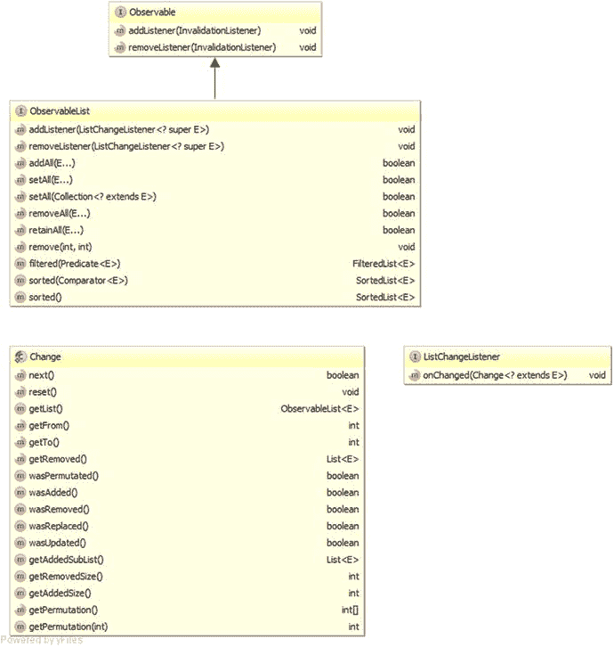

图 5-1。

Key interfaces that support the JavaFX observable list

为了避免混乱，我们从图 [5-1](#Fig1) 中省略了`java.util.List`接口。`java.util.List`接口是`ObservableList`的另一个超级接口。在`ObservableList`接口上有以下两种方法可以让你注册和注销`ListChangeListener`:

*   `addListener(ListChangeListener<? super E> listener)`
*   `removeListener(ListChangeListener<? super E> listener)`

以下关于`ObservableList`的额外方法使得使用界面更加容易:

*   `addAll(E... elements)`
*   `setAll(E... elements)`
*   `setAll(Collection<? extends E> col)`
*   `removeAll(E... elements)`
*   `retainAll(E... elements)`
*   `remove(int from, int to)`
*   `filtered(Predicate<E>)`
*   `sorted(Comparator<E>)`
*   `sorted()`

`The filtered()`和两个`sorted()`方法返回一个包装了`ObservableList`的`FilteredList`或`SortedList`。当最初的`ObservableList`发生变异时，包装器`FilteredList`和`SortedList`会反映这些变化。

`ListChangeListener`接口只有一个方法:`onChange(ListChangeListener.Change<? extends E> change)`。当`ObservableList`的内容被操作时，这个方法被调用。注意，这个方法的参数类型是嵌套类`Change`，它在`ListChangeListener`接口中声明。我们将在下一小节中向您展示如何使用`ListChangeListener.Change`类。现在，我们来看看清单 [5-1](#Par27) 中的一个简单例子，它展示了当一个`ObservableList`被操作时无效和列表改变事件的触发。

```java
package com.projavafx.collections;

import javafx.beans.Observable;
import javafx.collections.FXCollections;
import javafx.collections.ObservableList;

import java.util.Arrays;
import java.util.Iterator;
import java.util.List;

import static javafx.collections.ListChangeListener.Change;

public class ObservableListExample {
    public static void main(String[] args) {
        ObservableList<String> strings = FXCollections.observableArrayList();

        strings.addListener((Observable observable) -> {
            System.out.println("\tlist invalidated");
        });

        strings.addListener((Change<? extends String> change) -> {
            System.out.println("\tstrings = " + change.getList());
        });

        System.out.println("Calling add(\"First\"): ");
        strings.add("First");

        System.out.println("Calling add(0, \"Zeroth\"): ");
        strings.add(0, "Zeroth");

        System.out.println("Calling addAll(\"Second\", \"Third\"): ");
        strings.addAll("Second", "Third");

        System.out.println("Calling set(1, \"New First\"): ");
        strings.set(1, "New First");

        final List<String> list = Arrays.asList("Second_1", "Second_2");
        System.out.println("Calling addAll(3, list): ");
        strings.addAll(3, list);

        System.out.println("Calling remove(2, 4): ");
        strings.remove(2, 4);

        final Iterator<String> iterator = strings.iterator();
        while (iterator.hasNext()) {
            final String next = iterator.next();
            if (next.contains("t")) {
                System.out.println("Calling remove() on iterator: ");
                iterator.remove();
            }
        }

        System.out.println("Calling removeAll(\"Third\", \"Fourth\"): ");
        strings.removeAll("Third", "Fourth");
    }
}

Listing 5-1.
ObservableListExample.java

```

与 Java 集合框架不同，在 Java 集合框架中，公共 API 既包含接口，如`List`、`Map`和`Set`，也包含可以实例化的接口的具体实现，如`ArrayList`、`HashMap`和`HashSet`，JavaFX 可观察集合框架仅提供接口`ObservableList`、`ObservableMap`、`ObservableSet`和`ObservableArray`。具体的实现类不是公共的，但是您必须使用实用程序类`FXCollections`来获得 JavaFX 可观察集合和数组的对象。在清单 [5-1](#Par27) 中，我们通过调用`FXCollections`上的工厂方法来获得一个`ObservableList<String>`对象:

```java
        ObservableList<String> strings = FXCollections.observableArrayList();

```

然后，我们将一个`InvalidationListener`和一个`ListChangeListener`与可观察列表挂钩。因为两个侦听器都有一个单参数方法，并且是使用`addListener()`添加的，所以我们必须在 lambda 表达式中指定参数类型。失效侦听器只是在每次被调用时打印出一条消息。列表更改监听器打印出可观察列表的内容。程序的其余部分只是以各种方式操纵可观察列表的内容:通过调用`java.util.List`接口上的方法，通过调用添加到`ObservableList`中的一些新的便利方法，以及通过调用从可观察列表中获得的`Iterator`上的`remove()`方法。

当我们运行清单 [5-1](#Par27) 中的程序时，以下输出被打印到控制台:

```java
Calling add("First"):
        list invalidated
        strings = [First]
Calling add(0, "Zeroth"):
        list invalidated
        strings = [Zeroth, First]
Calling addAll("Second", "Third"):
        list invalidated
        strings = [Zeroth, First, Second, Third]
Calling set(1, "New First"):
        list invalidated
        strings = [Zeroth, New First, Second, Third]
Calling addAll(3, list):
        list invalidated
        strings = [Zeroth, New First, Second, Second_1, Second_2, Third]
Calling remove(2, 4):
        list invalidated
        strings = [Zeroth, New First, Second_2, Third]
Calling remove() on iterator:
        list invalidated
        strings = [New First, Second_2, Third]
Calling remove() on iterator:
        list invalidated
        strings = [Second_2, Third]
Calling removeAll("Third", "Fourth"):
        list invalidated
        strings = [Second_2]

```

事实上，我们在代码中进行的每个更改可观察列表内容的调用都会触发失效侦听器和列表更改侦听器上的回调。

如果失效侦听器或列表更改侦听器的实例已经作为侦听器添加到可观察列表中，则所有后续的将该实例作为参数的`addListener()`调用都将被忽略。当然，您可以向一个可观察列表中添加任意数量的不同失效侦听器和列表更改侦听器。

### 处理 ListChangeListener 中的更改事件

在这一节中，我们将仔细研究一下`ListChangeListener.Change`类，并讨论`onChange()`回调方法应该如何处理列表更改事件。

正如我们在上一节中看到的，对于通过调用`FXCollections.observableArrayList()`获得的`ObservableList`,每个 mutator 调用——也就是说，对更改可观察列表内容的单个方法的每个调用——都会生成一个发送给每个注册观察者的列表更改事件。事件对象是一个实现了`ListChangeListener.Change`接口的类的实例，可以认为它代表了一个或多个离散的变化，每个变化都属于四种类型之一:添加元素、删除元素、替换元素或置换元素。`ListChangeListener.Change`类提供了以下方法，允许您获得关于变更的详细信息:

*   `boolean next()`
*   `void reset()`
*   `boolean wasAdded()`
*   `boolean wasRemoved()`
*   `boolean wasReplaced()`
*   `boolean wasPermutated()`
*   `int getFrom()`
*   `int getTo()`
*   `int getAddedSize()`
*   `List<E> getAddedSublist()`
*   `int getRemovedSize()`
*   `List<E> getRemoved()`
*   `int getPermutation(int i)`
*   `ObservableList<E> getList()`

`next()`和`reset()`方法控制遍历事件对象中所有离散变化的游标。在进入`ListChangeListener`的`onChange()`方法时，光标位于第一次离散变化之前。您必须调用`next()`方法来将光标移动到第一个离散变更处。对`next()`方法的后续调用会将光标移动到剩余的离散变更上。如果到达下一个离散变化，返回值将是`true`。如果光标已经在最后一个离散变化上，返回值将是`false`。一旦光标定位在有效的离散变更上，就可以调用`wasAdded()`、`wasRemoved()`、`wasReplaced()`和`wasPermutated()`方法来确定离散变更所代表的变更类型。

Caution

`wasAdded()`、`wasRemoved()`、`wasReplaced()`和`wasPermutated()`方法不是正交的。只有当离散变更既是添加又是删除时，它才是替换。测试离散变化类型的正确顺序是，首先确定它是排列还是替换，然后确定它是添加还是删除。

一旦您确定了离散变化的种类，您就可以调用其他方法来获得更多的信息。对于加法，`getFrom()`方法返回添加了新元素的可观察列表中的索引；`getTo()`方法返回元素的索引，该元素比添加的元素的末尾多一个；`getAddedSize()`方法返回添加的元素数量；而`getAddedSublist()`方法返回一个包含添加元素的`List<E>`。对于移除，`getFrom()`和`getTo()`方法都返回可观察列表中移除元素的索引；`getRemovedSize()`方法返回被移除的元素的数量；而`getRemoved()`方法返回一个包含被移除元素的`List<E>`。对于替换，既要检查与添加相关的方法，也要检查与移除相关的方法，因为替换可以被视为移除，然后在相同的索引处添加。对于排列，`getPermutation(int i)`方法返回排列后可观察列表中元素的索引，该元素在排列前在可观察列表中的索引是`i`。在所有情况下，`getList()`方法总是返回底层的可观察列表。

在清单 [5-2](#Par55) 所示的例子中，我们在将一个`ListChangeListener`附加到一个`ObservableList`之后执行各种列表操作。名为`MyListener`的`ListChangeListener`的实现包括一个用于`ListChangeListener.Change`对象的漂亮的打印机，当一个事件被触发时打印出列表改变事件对象。

```java
package com.projavafx.collections;

import javafx.collections.FXCollections;
import javafx.collections.ListChangeListener;
import javafx.collections.ObservableList;

public class ListChangeEventExample {
    public static void main(String[] args) {
        ObservableList<String> strings = FXCollections.observableArrayList();
        strings.addListener(new MyListener());

        System.out.println("Calling addAll(\"Zero\", \"One\", \"Two\", \"Three\"): ");
        strings.addAll("Zero", "One", "Two", "Three");

        System.out.println("Calling FXCollections.sort(strings): ");
        FXCollections.sort(strings);

        System.out.println("Calling set(1, \"Three_1\"): ");
        strings.set(1, "Three_1");

        System.out.println("Calling setAll(\"One_1\", \"Three_1\", \"Two_1\", \"Zero_1\"): ");
        strings.setAll("One_1", "Three_1", "Two_1", "Zero_1");

        System.out.println("Calling removeAll(\"One_1\", \"Two_1\", \"Zero_1\"): ");
        strings.removeAll("One_1", "Two_1", "Zero_1");
    }

    private static class MyListener implements ListChangeListener<String> {
        @Override
        public void onChanged(Change<? extends String> change) {
            System.out.println("\tlist = " + change.getList());
            System.out.println(prettyPrint(change));
        }

        private String prettyPrint(Change<? extends String> change) {
            StringBuilder sb = new StringBuilder("\tChange event data:\n");
            int i = 0;
            while (change.next()) {
                sb.append("\t\tcursor = ")
                    .append(i++)
                    .append("\n");

                final String kind =
                    change.wasPermutated() ? "permutated" :
                        change.wasReplaced() ? "replaced" :
                            change.wasRemoved() ? "removed" :
                                change.wasAdded() ? "added" : "none";

                sb.append("\t\tKind of change: ")
                    .append(kind)
                    .append("\n");

                sb.append("\t\tAffected range: [")
                    .append(change.getFrom())
                    .append(", ")
                    .append(change.getTo())
                    .append("]\n");

                if (kind.equals("added") || kind.equals("replaced")) {
                    sb.append("\t\tAdded size: ")
                        .append(change.getAddedSize())
                        .append("\n");
                    sb.append("\t\tAdded sublist: ")
                        .append(change.getAddedSubList())
                        .append("\n");
                }

                if (kind.equals("removed") || kind.equals("replaced")) {
                    sb.append("\t\tRemoved size: ")
                        .append(change.getRemovedSize())
                        .append("\n");
                    sb.append("\t\tRemoved: ")
                        .append(change.getRemoved())
                        .append("\n");
                }

                if (kind.equals("permutated")) {
                    StringBuilder permutationStringBuilder = new StringBuilder("[");
                    for (int k = change.getFrom(); k < change.getTo(); k++) {
                        permutationStringBuilder.append(k)
                            .append("->")
                            .append(change.getPermutation(k));
                        if (k < change.getTo() - 1) {
                            permutationStringBuilder.append(", ");
                        }
                    }
                    permutationStringBuilder.append("]");
                    String permutation = permutationStringBuilder.toString();
                    sb.append("\t\tPermutation: ").append(permutation).append("\n");
                }
            }
            return sb.toString();
        }
    }
}

Listing 5-2.
ListChangeEventExample.java

```

在前面的例子中，我们触发了可观察列表中的四种离散变化。因为`ObservableList`上没有方法会触发置换事件，所以我们使用了`FXCollections`类中的`sort()`实用方法来实现置换。在后面的章节中，我们将详细介绍`FXCollections`。我们触发了两次替换事件，一次是用`set()`，一次是用`setAll()`。`setAll()`的好处在于它在一个操作中有效地执行了一个`clear()`和一个`addAll()`，并且只生成一个变更事件。

当我们运行清单 [5-2](#Par55) 中的程序时，以下输出被打印到控制台:

```java
Calling addAll("Zero", "One", "Two", "Three"):
        list = [Zero, One, Two, Three]
        Change event data:
                cursor = 0
                Kind of change: added
                Affected range: [0, 4]
                Added size: 4
                Added sublist: [Zero, One, Two, Three]

Calling FXCollections.sort(strings):
        list = [One, Three, Two, Zero]
        Change event data:
                cursor = 0
                Kind of change: permutated
                Affected range: [0, 4]
                Permutation: [0->3, 1->0, 2->2, 3->1]

Calling set(1, "Three_1"):
        list = [One, Three_1, Two, Zero]
        Change event data:
                cursor = 0
                Kind of change: replaced
                Affected range: [1, 2]
                Added size: 1
                Added sublist: [Three_1]
                Removed size: 1
                Removed: [Three]

Calling setAll("One_1", "Three_1", "Two_1", "Zero_1"):
        list = [One_1, Three_1, Two_1, Zero_1]
        Change event data:
                cursor = 0
                Kind of change: replaced
                Affected range: [0, 4]
                Added size: 4
                Added sublist: [One_1, Three_1, Two_1, Zero_1]
                Removed size: 4
                Removed: [One, Three_1, Two, Zero]

Calling removeAll("One_1", "Two_1", "Zero_1"):
        list = [Three_1]
        Change event data:
                cursor = 0
                Kind of change: removed
                Affected range: [0, 0]
                Removed size: 1
                Removed: [One_1]
                cursor = 1
                Kind of change: removed
                Affected range: [1, 1]
                Removed size: 2
                Removed: [Two_1, Zero_1]

```

在除了`removeAll()`调用之外的所有调用中，列表更改事件对象只包含一个离散的更改。`removeAll()`调用生成包含两个离散变化的列表变化事件的原因是，我们希望删除的三个元素落在列表中两个不相交的范围内。

在我们关心列表变更事件的大多数用例中，您不一定需要区分离散变更的种类。有时你只是想对所有添加和删除的元素做些什么。在这种情况下，您的`ListChangeListener`方法可以像下面这样简单。

```java
@Override
public void onChanged(Change<? extends Foo> change) {
    while (change.next()) {
        for (Foo foo : change.getAddedSubList()) {
            // starting up
        }
        for (Foo foo : change.getRemoved()) {
            // cleaning up
        }
    }
}

```

### 理解可观察地图

虽然在 JavaFX observable collections 框架层次结构中,`ObservableMap`看起来相当于`ObservableList`,但它实际上没有`ObservableList`复杂。图 [5-2](#Fig2) 是显示`ObservableMap`和支持接口的 UML 图。

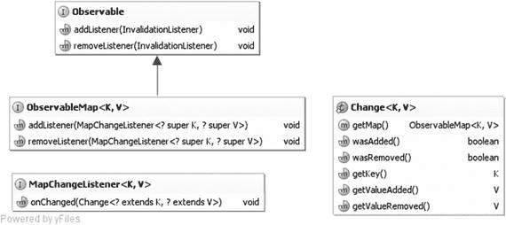

图 5-2。

Key interfaces that support the JavaFX observable map

为了避免混乱，我们从图 [5-2](#Fig2) 中省略了`java.util.Map`接口。`java.util.Map`接口是`ObservableMap`的另一个超级接口。`ObservableMap`界面上的以下方法允许您注册和注销`MapChangeListeners`:

*   `addListener(MapChangeListener<? super K, ? super V> listener)`
*   `addListener(MapChangeListener<? super K, ? super V> listener)`

`ObservableMap`上没有额外的方便方法。

`MapChangeListener`接口只有一个方法:`onChange(MapChangeListener.Change<? extends K, ? extends V> change)`。当`ObservableMap`的内容被操作时，这个方法被调用。注意，这个方法的参数类型是嵌套类`Change`，它在`MapChangeListener`接口中声明。与`ListChangeListener.Change`类不同的是，`MapChangeListener.Change`类适用于报告地图中单个键的变化。如果`ObservableMap`上的方法调用影响了多个键，那么将触发与受影响的键数量一样多的地图改变事件。

`MapChangeListener.Change`类为您提供了以下方法来检查对键所做的更改。

*   如果为键添加了新值，则`boolean wasAdded()`返回`true`。
*   如果从键中删除了旧值，则`boolean wasRemoved()`返回`true`。
*   `K getKey()`返回受影响的键。
*   `V getValueAdded()`返回为键添加的值。
*   `V getValueRemoved()`返回为键删除的值。(注意，使用现有键的`put()`调用将导致旧值被删除。)
*   `ObservableMap<K, V> getMap()`

在清单 [5-3](#Par76) 的例子中，我们在将一个`MapChangeListener`附加到一个`ObservableMap`之后执行各种地图操作。名为`MyListener`的`MapChangeListener`的实现包括一个用于`MapChangeListener.Change`对象的漂亮的打印机，当一个事件被触发时打印出地图改变事件对象。

```java
package com.projavafx.collections;

import javafx.collections.FXCollections;
import javafx.collections.MapChangeListener;
import javafx.collections.ObservableMap;

import java.util.HashMap;
import java.util.Iterator;
import java.util.Map;

public class MapChangeEventExample {
    public static void main(String[] args) {
        ObservableMap<String, Integer> map = FXCollections.observableHashMap();
        map.addListener(new MyListener());

        System.out.println("Calling put(\"First\", 1): ");
        map.put("First", 1);

        System.out.println("Calling put(\"First\", 100): ");
        map.put("First", 100);

        Map<String, Integer> anotherMap = new HashMap<>();
        anotherMap.put("Second", 2);
        anotherMap.put("Third", 3);
        System.out.println("Calling putAll(anotherMap): ");
        map.putAll(anotherMap);

        final Iterator<Map.Entry<String, Integer>> entryIterator = map.entrySet().iterator();
        while (entryIterator.hasNext()) {
            final Map.Entry<String, Integer> next = entryIterator.next();
            if (next.getKey().equals("Second")) {
                System.out.println("Calling remove on entryIterator: ");
                entryIterator.remove();
            }
        }

        final Iterator<Integer> valueIterator = map.values().iterator();
        while (valueIterator.hasNext()) {
            final Integer next = valueIterator.next();
            if (next == 3) {
                System.out.println("Calling remove on valueIterator: ");
                valueIterator.remove();
            }
        }
    }

    private static class MyListener implements MapChangeListener<String, Integer> {
        @Override
        public void onChanged(Change<? extends String, ? extends Integer> change) {
            System.out.println("\tmap = " + change.getMap());
            System.out.println(prettyPrint(change));
        }

        private String prettyPrint(Change<? extends String, ? extends Integer> change) {
            StringBuilder sb = new StringBuilder("\tChange event data:\n");
            sb.append("\t\tWas added: ").append(change.wasAdded()).append("\n");
            sb.append("\t\tWas removed: ").append(change.wasRemoved()).append("\n");
            sb.append("\t\tKey: ").append(change.getKey()).append("\n");
            sb.append("\t\tValue added: ").append(change.getValueAdded()).append("\n");
            sb.append("\t\tValue removed: ").append(change.getValueRemoved()).append("\n");
            return sb.toString();
        }
    }
}

Listing 5-3.
MapChangeEventExample.

java

```

当我们运行清单 [5-3](#Par76) 中的程序时，以下输出被打印到控制台:

```java
Calling put("First", 1):
        map = {First=1}
        Change event data:
                Was added: true
                Was removed: false
                Key: First
                Value added: 1
                Value removed: null

Calling put("First", 100):
        map = {First=100}
        Change event data:
                Was added: true
                Was removed: true
                Key: First
                Value added: 100
                Value removed: 1
Calling putAll(anotherMap):
        map = {Second=2, First=100}
        Change event data:
                Was added: true
                Was removed: false
                Key: Second
                Value added: 2
                Value removed: null

        map = {Second=2, Third=3, First=100}
        Change event data:
                Was added: true
                Was removed: false
                Key: Third
                Value added: 3
                Value removed: null
Calling remove on entryIterator:
        map = {Third=3, First=100}
        Change event data:
                Was added: false
                Was removed: true
                Key: Second
                Value added: null
                Value removed: 2

Calling remove on valueIterator:
        map = {First=100}
        Change event data:
                Was added: false
                Was removed: true
                Key: Third
                Value added: null
                Value removed: 3

```

在前面的例子中，注意到`putAll()`调用生成了两个 map change 事件，因为另一个 map 包含两个键。

### 了解可观察集

`ObservableSet`接口类似于`ObservableMap`接口，因为它的`SetChangeListener.Change`对象跟踪单个元素。图 [5-3](#Fig3) 是显示`ObservableSet`和支持接口的 UML 图。

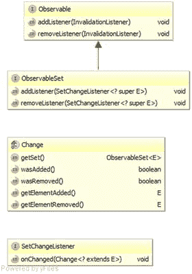

图 5-3。

Key interfaces that support the JavaFX observable set

为了避免混乱，我们从图 [5-3](#Fig3) 中省略了`java.util.Set`接口。`java.util.Set`接口是`ObservableSet`的另一个超级接口。`ObservableSet`界面上的以下方法允许您注册和注销`SetChangeListeners`:

*   `addListener(SetChangeListener<? super E> listener)`
*   `addListener(SetChangeListener<? super E> listener)`

`ObservableSet`上没有额外的方便方法。

`SetChangeListener`接口只有一个方法:`onChange(SetChangeListener.Change<? extends E> change)`。当`ObservableSet`的内容被操作时，这个方法被调用。注意，这个方法的参数类型是嵌套类`Change`，它在`SetChangeListener`接口中声明。`SetChangeListener.Change`类适用于报告集合中单个元素的变化。如果对`ObservableSet`的方法调用影响了多个元素，那么将触发与受影响元素数量一样多的 set change 事件。

`SetChangeListener.Change`类为您提供了以下方法来检查对元素所做的更改。

*   如果一个新元素被添加到集合中，`boolean wasAdded()`返回`true`。
*   如果从集合中删除了一个元素，则`boolean wasRemoved()`返回`true`。
*   `E getElementAdded()`返回添加到集合中的元素。
*   `E getElementRemoved()`返回从集合中删除的元素。
*   `ObservableSet<E> getSet()`

在清单 [5-4](#Par93) 的例子中，我们在将一个`SetChangeListener`附加到一个`ObservableSet`之后执行各种设置操作。名为`MyListener`的`SetChangeListener`的实现包括一个用于`SetChangeListener.Change`对象的漂亮的打印机，当一个事件被触发时打印出设置的变更事件对象。

```java
package com.projavafx.collections;

import javafx.collections.FXCollections;
import javafx.collections.ObservableSet;
import javafx.collections.SetChangeListener;

import java.util.Arrays;

public class SetChangeEventExample {
    public static void main(String[] args) {
        ObservableSet<String> set = FXCollections.observableSet();
        set.addListener(new MyListener());

        System.out.println("Calling add(\"First\"): ");
        set.add("First");

        System.out.println("Calling addAll(Arrays.asList(\"Second\", \"Third\")): ");
        set.addAll(Arrays.asList("Second", "Third"));

        System.out.println("Calling remove(\"Third\"): ");
        set.remove("Third");
    }

    private static class MyListener implements SetChangeListener<String> {
        @Override
        public void onChanged(Change<? extends String> change) {
            System.out.println("\tset = " + change.getSet());
            System.out.println(prettyPrint(change));
        }

        private String prettyPrint(Change<? extends String> change) {
            StringBuilder sb = new StringBuilder("\tChange event data:\n");
            sb.append("\t\tWas added: ").append(change.wasAdded()).append("\n");
            sb.append("\t\tWas removed: ").append(change.wasRemoved()).append("\n");
            sb.append("\t\tElement added: ").append(change.getElementAdded()).append("\n");
            sb.append("\t\tElement removed: ").append(change.getElementRemoved()).append("\n");
            return sb.toString();
        }
    }
}

Listing 5-4.
SetChangeEventExample.

java

```

当我们运行清单 [5-4](#Par93) 中的程序时，以下输出被打印到控制台:

```java
Calling add("First"):
        set = [First]
        Change event data:
                Was added: true
                Was removed: false
                Element added: First
                Element removed: null

Calling addAll(Arrays.asList("Second", "Third")):
        set = [Second, First]
        Change event data:
                Was added: true
                Was removed: false
                Element added: Second
                Element removed: null

        set = [Second, First, Third]
        Change event data:
                Was added: true
                Was removed: false
                Element added: Third
                Element removed: null

Calling remove("Third"):
        set = [Second, First]
        Change event data:
                Was added: false
                Was removed: true
                Element added: null
                Element removed: Third

```

在前面的例子中，注意到`addAll()`调用生成了两个集合变更事件，因为添加到可观察集合的列表包含两个元素。

### 了解可观察阵列

`ObservableArray`接口是在需要观察原始 int 或 float 值列表的情况下引入的，但是每次在列表中添加或删除原始值时，装箱和取消装箱的开销出于性能原因是不可接受的。预计`ObservableArray`及其两个子接口`ObservableIntegerArray`和`ObservableFloatArray`的实现将使用原始数组作为其内容的后备存储。JavaFX 3D API 使用了`ObservableArray`、`ObservableIntegerArray`和`ObservableFloatArray`。图 [5-4](#Fig4) 是显示`ObservableArray`和支持接口的 UML 图。


图 5-4。

Key interfaces that support the JavaFX observable array

与`ObservableList`、`ObservableMap`和`ObservableSet`接口不同，`ObservableArray`接口不实现任何 Java 集合框架接口。`ObservableArray`界面上的以下方法允许您注册和注销`ArrayChangeListeners`:

*   `addListener(ArrayChangeListener<T> listener)`
*   `removeListener(ArrayChangeListener<T> listener)`

`ObservableArray`上的以下附加方法让您可以控制底层的原始数组:

*   `resize(int size)`
*   `ensureCapacity(int capacity)`
*   `trimToSize()`
*   `clear()`
*   `size()`

这些方法处理一个`ObservableArray`的容量和大小。容量是基础基元数组的长度。大小是实际包含应用程序数据的元素的数量。容量总是大于或等于大小。如果当前底层基元数组的长度小于所需的新容量，则`ensureCapacity()`方法分配新的底层基元数组。`resize()`方法改变`ObservableArray`的大小。如果新大小大于当前容量，则容量会增加。如果新大小大于当前大小，则附加元素用零填充。如果新的大小小于当前的大小，`resize()`实际上并不收缩数组，而是用零填充“丢失”的元素。`trimToSize()`方法用一个长度与`ObservableArray`的大小相同的数组替换底层的原始数组。`clear()`方法将`ObservableArray`的大小调整为零。`size()`方法返回`ObservableArray`的当前大小。

`ArrayChangeListener`接口只有一个方法:`onChanged(T observableArray, boolean sizeChanged, int from, int to)`。注意，`ArrayChangeListener`没有像在`ListChangeListener`、`MapChangeListener`和`SetChangeListener`中那样将`Change`对象传递给`onChange()`方法，而是直接将变化的特征作为参数传递。第一个参数是`ObservableArray`本身。如果可观察数组的大小已经改变，则`sizeChanged`参数将是`true`。`from`和`to`参数标记被改变元素的范围，包括在`from`端，不包括在`to`端。

`ObservableIntegerArray`和`ObservableFloatArray`接口具有以特定于类型的方式操作数据的方法。我们列出`ObservableIntegerArray`的方法(`ObservableFloatArray`的方法类似):

*   `copyTo(int srcIndex, int[] dest, int destIndex, int length)`
*   `copyTo(int srcIndex, ObservableIntegerArray dest, int destIndex, int length)`
*   `int get(int index)`
*   `addAll(int... elements)`
*   `addAll(ObservableIntegerArray src)`
*   `addAll(int[] src, int srcIndex, int length)`
*   `addAll(ObservableIntegerArray src, int srcIndex, int length)`
*   `setAll(int... elements)`
*   `setAll(int[] src, int srcIndex, int length)`
*   `setAll(ObservableIntegerArray src)`
*   `setAll(ObservableIntegerArray src, int srcIndex, int length)`
*   `set(int destIndex, int[] src, int srcIndex, int length)`
*   `set(int destIndex, ObservableIntegerArray src, int srcIndex, int length)`
*   `set(int index, int value)`
*   `int[] toArray(int[] dest)`
*   `int[] toArray(int srcIndex, int[] dest, int length)`

`addAll()`方法追加到`ObservableIntegerArray`中。`setAll()`方法取代了`ObservableIntegerArray`的内容。这两组方法的源可以是一个包含`int`的 vararg 数组、`ObservableIntegerArray`、一个包含起始索引和长度的`int`数组，或者一个包含起始索引和长度的`ObservableIntegerArray`。`get()`方法返回指定索引处的值。`set()`方法从第一个参数中指定的索引开始，用新值替换`ObservableIntegerArray`的一部分。替换数据可以是单个`int`值、具有起始索引和长度的`int`数组，或者具有起始索引和长度的`ObservableIntegerArray`。如果原始`ObservableIntegerArray`中没有足够的空间来容纳替换数据，则抛出`ArrayIndexOutOfBoundsException`。`copyTo()`方法将从指定`srcIndex`开始的`ObservableIntegerArray`的一部分复制到从指定`destIndex`开始的目的`int`数组或`ObservableIntegerArray`中。`length`参数规定了复制部分的长度。如果源`ObservableIntegerArray`中没有足够的元素来形成指定长度的一部分，或者如果目标中没有足够的空间来容纳复制的部分，则会抛出`ArrayIndexOutOfBoundsException`。`toArray()`方法将`ObservableIntegerArray`的内容复制到一个`int`数组中。如果`dest`参数不为空且有足够空间，则填充并返回；否则，分配、填充并返回一个新的`int`数组。在指定了`srcIndex`和`length`的表单中，如果`ObservableIntegerArray`中没有足够的元素，就会抛出`ArrayIndexOutOfBoundsException`。

在清单 [5-5](#Par128) 所示的例子中，我们在将`ArrayChangeListener`附加到`ObservableIntegerArray`之后执行各种数组操作。当事件被触发时，我们打印出传递给`onChange()`方法的参数。

```java
package com.projavafx.collections;

import javafx.collections.FXCollections;
import javafx.collections.ObservableIntegerArray;

public class ArrayChangeEventExample {
    public static void main(String[] args) {
        final ObservableIntegerArray ints = FXCollections.observableIntegerArray(10, 20);
        ints.addListener((array, sizeChanged, from, to) -> {
            StringBuilder sb = new StringBuilder("\tObservable Array = ").append(array).append("\n")
                .append("\t\tsizeChanged = ").append(sizeChanged).append("\n")
                .append("\t\tfrom = ").append(from).append("\n")
                .append("\t\tto = ").append(to).append("\n");
            System.out.println(sb.toString());
        });

        ints.ensureCapacity(20);

        System.out.println("Calling addAll(30, 40):");
        ints.addAll(30, 40);

        final int[] src = {50, 60, 70};
        System.out.println("Calling addAll(src, 1, 2):");
        ints.addAll(src, 1, 2);

        System.out.println("Calling set(0, src, 0, 1):");
        ints.set(0, src, 0, 1);

        System.out.println("Calling setAll(src):");
        ints.setAll(src);

        ints.trimToSize();

        final ObservableIntegerArray ints2 = FXCollections.observableIntegerArray();
        ints2.resize(ints.size());

        System.out.println("Calling copyTo(0, ints2, 0, ints.size()):");
        ints.copyTo(0, ints2, 0, ints.size());

        System.out.println("\tDestination = " + ints2);
    }
}

Listing 5-5.
ArrayChangeEventExample.java

```

当我们运行清单 [5-5](#Par128) 中的程序时，以下输出被打印到控制台:

```java
Calling addAll(30, 40):
        Observable Array = [10, 20, 30, 40]
                sizeChanged = true
                from = 2
                to = 4

Calling addAll(src, 1, 2):
        Observable Array = [10, 20, 30, 40, 60, 70]
                sizeChanged = true
                from = 4
                to = 6

Calling set(0, src, 0, 1):
        Observable Array = [50, 20, 30, 40, 60, 70]
                sizeChanged = false
                from = 0
                to = 1

Calling setAll(src):
        Observable Array = [50, 60, 70]
                sizeChanged = true
                from = 0
                to = 3

Calling copyTo(0, ints2, 0, ints.size()):
        Destination = [50, 60, 70]

```

### 使用 FXCollections 中的工厂和实用程序方法

`FXCollections`类在 Java FX observable collections and arrays 框架中扮演的角色类似于`java.util.Collections`类在 Java collections 框架中扮演的角色。`FXCollections`类包含以下`ObservableList`的工厂方法:

*   `ObservableList<E> observableList(List<E> list)`
*   `ObservableList<E> observableList(List<E> list, Callback<E, Observable[]> extractor);`
*   `ObservableList<E> observableArrayList()`
*   `ObservableList<E> observableArrayList(Callback<E, Observable[]> extractor);`
*   `ObservableList<E> observableArrayList(E... items)`
*   `ObservableList<E> observableArrayList(Collection<? extends E> col)`
*   `ObservableList<E> concat(ObservableList<E>... lists)`
*   `ObservableList<E> unmodifiableObservableList(ObservableList<E> list)`
*   `ObservableList<E> checkedObservableList(ObservableList<E> list, Class<E> type)`
*   `ObservableList<E> synchronizedObservableList(ObservableList<E> list)`
*   `ObservableList<E> emptyObservableList()`
*   `ObservableList<E> singletonObservableList(E e)`

它包含以下`ObservableMap`的工厂方法:

*   `ObservableMap<K, V> observableMap(Map<K, V> map)`
*   `ObservableMap<K, V> unmodifiableObservableMap(ObservableMap<K, V> map)`
*   `ObservableMap<K, V> checkedObservableMap(ObservableMap<K, V> map, Class<K> keyType, Class<V> valType)`
*   `ObservableMap<K, V> synchronizedObservableMap(ObservableMap<K, V> map)`
*   `ObservableMap<K, V> emptyObservableMap();`
*   `ObservableMap<K, V> observableHashMap()`

它包含以下`ObservableSet`的工厂方法:

*   `ObservableSet<E> observableSet(Set<E> set)`
*   `ObservableSet<E> observableSet(E...)`
*   `ObservableSet<E> unmodifiableObservableSet(ObservableSet<E> set)`
*   `ObservableSet<E> checkedObservableSet(ObservableSet<E> set, Class<E> type)`
*   `ObservableSet<E> synchronizedObservableSet(ObservableSet<E>)`
*   `ObservableSet<E> emptyObservableSet()`

它包含以下`ObservableIntegerArray`和`ObservableFloatArray`的工厂方法:

*   `ObservableIntegerArray observableIntegerArray()`
*   `ObservableIntegerArray observableIntegerArray(int...)`
*   `ObservableIntegerArray observableIntegerArray(ObservableIntegerArray)`
*   `ObservableFloatArray observableFloatArray()`
*   `ObservableFloatArray observableFloatArray(float...)`
*   `ObservableFloatArray observableFloatArray(ObservableFloatArray)`

它还包含九个实用方法，与`java.util.Collections`中同名的方法类似。它们都作用于`ObservableList`物体。它们与它们的`java.util.Collections`对手的不同之处在于，当它们作用于`ObservableList`时，注意只生成一个列表改变事件，而它们的`java.util.Collections`对手会生成不止一个列表改变事件。

*   `void copy(ObservableList<? super T> dest, java.util.List<? extends T> src)`
*   `void fill(ObservableList<? super T> list, T obj)`
*   `boolean replaceAll(ObservableList<T> list, T oldVal, T newVal)`
*   `void reverse(ObservableList list)`
*   `void rotate(ObservableList list, int distance)`
*   `void shuffle(ObservableList<?> list)`
*   `void shuffle(ObservableList list, java.util.Random rnd)`
*   `void sort(ObservableList<T> list)`
*   `void sort(ObservableList<T> list, java.util.Comparator<? super T> c)`

我们在清单 [5-6](#Par176) 中展示了这些实用方法的效果。

```java
package com.projavafx.collections;

import javafx.collections.FXCollections;
import javafx.collections.ListChangeListener;
import javafx.collections.ObservableList;

import java.util.Arrays;
import java.util.Comparator;
import java.util.Random;

public class FXCollectionsExample {
    public static void main(String[] args) {
        ObservableList<String> strings = FXCollections.observableArrayList();
        strings.addListener(new MyListener());

        System.out.println("Calling addAll(\"Zero\", \"One\", \"Two\", \"Three\"): ");
        strings.addAll("Zero", "One", "Two", "Three");

        System.out.println("Calling copy: ");
        FXCollections.copy(strings, Arrays.asList("Four", "Five"));

        System.out.println("Calling replaceAll: ");
        FXCollections.replaceAll(strings, "Two", "Two_1");

        System.out.println("Calling reverse: ");
        FXCollections.reverse(strings);

        System.out.println("Calling rotate(strings, 2): ");
        FXCollections.rotate(strings, 2);

        System.out.println("Calling shuffle(strings): ");
        FXCollections.shuffle(strings);

        System.out.println("Calling shuffle(strings, new Random(0L)): ");
        FXCollections.shuffle(strings, new Random(0L));

        System.out.println("Calling sort(strings): ");
        FXCollections.sort(strings);

        System.out.println("Calling sort(strings, c) with custom comparator: ");
        FXCollections.sort(strings, new Comparator<String>() {
            @Override
            public int compare(String lhs, String rhs) {
                // Reverse the order
                return rhs.compareTo(lhs);
            }
        });

        System.out.println("Calling fill(strings, \"Ten\"): ");
        FXCollections.fill(strings, "Ten");
    }

    // We omitted the nested class MyListener, which is the same as in Listing 5-2
}

Listing 5-6.
FXCollectionsExample.java

```

当我们运行清单 [5-6](#Par178) 中的程序时，以下输出被打印到控制台:

```java
Calling addAll("Zero", "One", "Two", "Three"):
        list = [Zero, One, Two, Three]
        Change event data:
                cursor = 0
                Kind of change: added
                Affected range: [0, 4]
                Added size: 4
                Added sublist: [Zero, One, Two, Three]

Calling copy:
        list = [Four, Five, Two, Three]
        Change event data:
                cursor = 0
                Kind of change: replaced
                Affected range: [0, 4]
                Added size: 4
                Added sublist: [Four, Five, Two, Three]
                Removed size: 4
                Removed: [Zero, One, Two, Three]

Calling replaceAll:
        list = [Four, Five, Two_1, Three]
        Change event data:
                cursor = 0
                Kind of change: replaced
                Affected range: [0, 4]
                Added size: 4
                Added sublist: [Four, Five, Two_1, Three]
                Removed size: 4
                Removed: [Four, Five, Two, Three]

Calling reverse:
        list = [Three, Two_1, Five, Four]
        Change event data:
                cursor = 0
                Kind of change: replaced
                Affected range: [0, 4]
                Added size: 4
                Added sublist: [Three, Two_1, Five, Four]
                Removed size: 4
                Removed: [Four, Five, Two_1, Three]

Calling rotate(strings, 2):
        list = [Five, Four, Three, Two_1]
        Change event data:
                cursor = 0
                Kind of change: replaced
                Affected range: [0, 4]
                Added size: 4
                Added sublist: [Five, Four, Three, Two_1]
                Removed size: 4
                Removed: [Three, Two_1, Five, Four]

Calling shuffle(strings):
        list = [Three, Four, Two_1, Five]
        Change event data:
                cursor = 0
                Kind of change: replaced
                Affected range: [0, 4]
                Added size: 4
                Added sublist: [Three, Four, Two_1, Five]
                Removed size: 4
                Removed: [Five, Four, Three, Two_1]

Calling shuffle(strings, new Random(0L)):
        list = [Five, Three, Four, Two_1]
        Change event data:
                cursor = 0
                Kind of change: replaced
                Affected range: [0, 4]
                Added size: 4
                Added sublist: [Five, Three, Four, Two_1]
                Removed size: 4
                Removed: [Three, Four, Two_1, Five]
Calling sort(strings):
        list = [Five, Four, Three, Two_1]
        Change event data:
                cursor = 0
                Kind of change: permutated
                Affected range: [0, 4]
                Permutation: [0->0, 1->2, 2->1, 3->3]
Calling sort(strings, c) with custom comparator:
        list = [Two_1, Three, Four, Five]
        Change event data:
                cursor = 0
                Kind of change: permutated
                Affected range: [0, 4]
                Permutation: [0->3, 1->2, 2->1, 3->0]

Calling fill(strings, "Ten"):
        list = [Ten, Ten, Ten, Ten]
        Change event data:
                cursor = 0
                Kind of change: replaced
                Affected range: [0, 4]
                Added size: 4
                Added sublist: [Ten, Ten, Ten, Ten]
                Removed size: 4
                Removed: [Two_1, Three, Four, Five]

```

请注意，每次调用`FXCollections`中的实用程序方法都会生成一个列表更改事件。

## 使用 JavaFX 并发框架

众所周知，现在几乎所有的 GUI 平台都使用单线程事件调度模型。JavaFX 也不例外，事实上 JavaFX 中的所有 UI 事件都是在 JavaFX 应用程序线程中处理的。然而，随着近年来多核台式机变得越来越普遍(例如，本章是在四核 PC 上编写的)，JavaFX 的设计人员很自然地通过利用 Java 编程语言的出色并发支持来利用硬件的全部功能。

在本节中，我们将研究所有 JavaFX 应用程序中存在的重要线程。我们解释它们在 JavaFX 应用程序的整体方案中扮演的角色。然后我们将注意力转向 JavaFX 应用程序线程，解释为什么在 JavaFX 应用程序线程中执行长时间运行的代码会使您的应用程序看起来挂起。最后，我们来看一下`javafx.concurrent`框架，并向您展示如何使用它在 JavaFX 应用程序线程之外的工作线程中执行长期运行的代码，并将结果反馈给 JavaFX 应用程序线程以更新 GUI 状态。

Note

如果您熟悉 Swing 编程，JavaFX 应用程序线程类似于 Swing 的事件调度器线程(EDT)，通常名为 AWT-EventQueue-0。

### 识别 JavaFX 应用程序中的线程

清单 [5-7](#Par184) 中的程序创建了一个简单的 JavaFX GUI，带有一个`ListView`、一个`TextArea`和一个`Button`，并用应用程序所有活动线程的名称填充 ListView。当您从`ListView`中选择一个项目时，该线程的堆栈跟踪会显示在`TextArea`中。线程和堆栈跟踪的原始列表是在应用程序启动时填充的。您可以通过单击 update 按钮来更新线程和堆栈跟踪的列表。

```java
package com.projavafx.collections;

import javafx.application.Application;
import javafx.beans.value.ChangeListener;
import javafx.beans.value.ObservableValue;
import javafx.collections.FXCollections;
import javafx.collections.ObservableList;
import javafx.event.ActionEvent;
import javafx.event.EventHandler;
import javafx.geometry.Insets;
import javafx.scene.Scene;
import javafx.scene.control.Button;
import javafx.scene.control.ListView;
import javafx.scene.control.TextArea;
import javafx.scene.layout.VBox;
import javafx.stage.Stage;

import java.util.Map;

public class JavaFXThreadsExample extends Application
    implements EventHandler<ActionEvent>, ChangeListener<Number> {

    private Model model;
    private View view;

    public static void main(String[] args) {
        launch(args);
    }

    public JavaFXThreadsExample() {
        model = new Model();
    }

    @Override
    public void start(Stage stage) throws Exception {
        view = new View(model);
        hookupEvents();
        stage.setTitle("JavaFX Threads Information");
        stage.setScene(view.scene);
        stage.show();
    }

    private void hookupEvents() {
        view.updateButton.setOnAction(this);
        view.threadNames.getSelectionModel().selectedIndexProperty().addListener(this);
    }

    @Override
    public void changed(ObservableValue<? extends Number> observableValue,
                        Number oldValue, Number newValue) {
        int index = (Integer) newValue;
        if (index >= 0) {
            view.stackTrace.setText(model.stackTraces.get(index));
        }
    }

    @Override
    public void handle(ActionEvent actionEvent) {
        model.update();
    }

    public static class Model {
        public ObservableList<String> threadNames;
        public ObservableList<String> stackTraces;

        public Model() {
            threadNames = FXCollections.observableArrayList();
            stackTraces = FXCollections.observableArrayList();
            update();
        }

        public void update() {
            threadNames.clear();
            stackTraces.clear();
            final Map<Thread, StackTraceElement[]> map = Thread.getAllStackTraces();
            for (Map.Entry<Thread, StackTraceElement[]> entry : map.entrySet()) {
                threadNames.add("\"" + entry.getKey().getName() + "\"");
                stackTraces.add(formatStackTrace(entry.getValue()));
            }
        }

        private String formatStackTrace(StackTraceElement[] value) {
            StringBuilder sb = new StringBuilder("StackTrace: \n");
            for (StackTraceElement stackTraceElement : value) {
                sb.append("    at ").append(stackTraceElement.toString()).append("\n");
            }
            return sb.toString();
        }
    }

    private static class View {
        public ListView<String> threadNames;
        public TextArea stackTrace;
        public Button updateButton;
        public Scene scene;

        private View(Model model) {
            threadNames = new ListView<>(model.threadNames);
            stackTrace = new TextArea();
            updateButton = new Button("Update");
            VBox vBox = new VBox(10, threadNames, stackTrace, updateButton);
            vBox.setPadding(new Insets(10, 10, 10, 10));
            scene = new Scene(vBox, 440, 640);
        }
    }
}

Listing 5-7.
JavaFXThreadsExample.

java

```

这是一个非常小的 JavaFX GUI 应用程序。在让您运行该程序之前，我们指出了该程序的几个特点。首先，记住`main()`方法:

```java
public static void main(String[] args) {
    launch(args);
}

```

这个方法你已经见过几次了。这种风格化的`main()`方法总是出现在扩展了`javafx.application.Application`类的类中。有一个重载版本的`Application.launch()`方法，它将一个`Class`对象作为第一个参数，可以从其他类调用:

```java
launch(Class<? Extends Application> appClass, String[] args)

```

因此，您可以将`main()`方法移到另一个类中:

```java
public class Main {
    public static void main(String[] args) {
        Application.launch(JavaFXThreadsExample.class, args);
    }
}

```

达到同样的效果。

接下来，请注意嵌套类`Model`在其`update()`方法中构建了它的数据模型，该模型由所有活动线程的列表和每个线程的堆栈跟踪组成:

```java
public void update() {
    threadNames.clear();
    stackTraces.clear();
    final Map<Thread, StackTraceElement[]> map = Thread.getAllStackTraces();
    for (Map.Entry<Thread, StackTraceElement[]> entry : map.entrySet()) {
        threadNames.add("\"" + entry.getKey().getName() + "\"");
        stackTraces.add(formatStackTrace(entry.getValue()));
    }
}

```

该方法在`Model`的构造器中调用一次，从`JavaFXThreadsExample`的构造器调用，从更新按钮的事件处理程序调用一次。

当我们运行清单 [5-7](#Par184) 中的程序时，屏幕上会显示图 [5-5](#Fig5) 中的 GUI。您可以通过单击列表中的每个线程名称并在文本区域中查看该线程的堆栈跟踪来浏览 JavaFX 程序中的线程。以下是一些有趣的观察结果:

*   “`main`”线程的调用堆栈包括对`com.sun.javafx.application.LauncherImpl.launchApplication()`的调用。
*   “`JavaFX-Launcher`”线程的调用堆栈包括对`com.sun.javafx.application.PlatformImpl.runAndWait()`的调用。这将代码(包括构造器的调用)放在 JavaFX 应用程序线程上。
*   “`JavaFX Application Thread`”线程的调用栈包括 Windows 机器上的本机`com.sun.glass.ui.win.WinApplication._runLoop()`方法，以及 Mac 或 Linux 机器上的类似方法。
*   “`QuantumRenderer-0`”线程的调用栈包含了`com.sun.javafx.tk.quantum.QuantumRenderer$PipelineRunnable.run()`方法。

现在，当您单击 Update 按钮并检查“`JavaFX Application Thread`”线程的调用堆栈时，您会发现 Update 按钮的事件处理程序是在 JavaFX 应用程序线程上执行的。

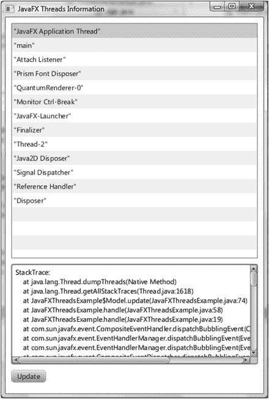

图 5-5。

The `JavaFXThreadsExample` program

这个小实验揭示了 JavaFX 运行时系统的一些架构元素。尽管部分信息包括由`com.sun`层次结构中的类适当表示的实现细节(因此不能在普通 JavaFX 应用程序的代码中使用)，但是了解一些内部工作原理是有益的。

Caution

在接下来的讨论中，我们提到了包中名称以`com.sun`开头的 Java 类。这些类是 JavaFX 运行时系统的实现细节，不打算在普通的 JavaFX 应用程序中使用。它们可能会在 JavaFX 的未来版本中发生变化。

`javafx.application.Application`类为 JavaFX 应用程序提供生命周期支持。除了我们在本节前面提到的两个静态`launch()`方法，它还提供了以下生命周期方法。

*   `public void init() throws Exception`
*   `public abstract void start(Stage stage) throws Exception`
*   `public void stop() throws Exception`

在“`JavaFX-Launcher`”线程中调用了`init()`方法。在 JavaFX 应用程序线程中调用构造器、`start()`和`stop()`方法。JavaFX 应用程序线程是`com.sun.glass`包层次结构中玻璃窗口工具包的一部分。JavaFX 事件在 JavaFX 应用程序线程上处理。所有实时场景操作都必须在 JavaFX 应用程序线程中执行。未附加到实时场景的节点可以在其他线程中创建和操纵，直到它们附加到实时场景。

Note

Glass Windowing Toolkit 在 JavaFX 应用程序中的作用类似于 AWT 在 Swing 应用程序中的作用。它从本机平台提供绘图表面和输入事件。在 AWT 中，EDT 不同于本机平台的 UI 线程，它们之间必须进行通信，与 AWT 不同，Glass Windowing Toolkit 中的 JavaFX 应用程序线程直接使用本机平台的 UI 线程。

`"QuantumRenderer-0"`线程的所有者是位于`com.sun.javafx.tk.quantum`包层次结构中的 Quantum 工具包。该线程负责使用`com.sun.prism`包层次结构中的 Prism 图形引擎渲染 JavaFX 场景图。如果 JavaFX 支持图形硬件，Prism 将使用完全加速的渲染路径。如果 JavaFX 不支持图形硬件，Prism 将退回到 Java2D 渲染路径。Quantum Toolkit 还负责协调事件线程和渲染线程的活动。它使用`pulse`事件进行协调。

Note

脉冲事件是放在 JavaFX 应用程序线程队列中的事件。当它被处理时，它沿着渲染层同步场景图形元素的状态。如果场景图形的状态发生变化(通过运行动画或直接修改场景图形),则会安排脉冲事件。脉冲事件被限制在每秒 60 帧。

如果 JavaFXThreadsExample 程序包含媒体播放，那么另一个名为“`JFXMedia Player EventQueueThread`”的线程就会出现在列表中。这个线程负责通过使用 JavaFX 应用程序线程来同步场景图中的最新帧。

### 修复无响应的用户界面

事件处理程序在 JavaFX 应用程序线程上执行，因此，如果一个事件处理程序花费太长时间来完成它的工作，整个 UI 将变得无响应，因为任何后续的用户操作将简单地排队，直到长时间运行的事件处理程序完成后才会被处理。

我们在清单 [5-8](#Par214) 中对此进行了说明。

```java
package com.projavafx.collections;

import javafx.application.Application;
import javafx.beans.property.ObjectProperty;
import javafx.beans.property.SimpleObjectProperty;
import javafx.geometry.Insets;
import javafx.geometry.Pos;
import javafx.scene.Scene;
import javafx.scene.control.Button;
import javafx.scene.layout.BorderPane;
import javafx.scene.layout.HBox;
import javafx.scene.paint.Color;
import javafx.scene.paint.Paint;
import javafx.scene.shape.Rectangle;
import javafx.stage.Stage;

public class UnresponsiveUIExample extends Application {
    private Model model;
    private View view;

    public static void main(String[] args) {
        launch(args);
    }

    public UnresponsiveUIExample() {
        model = new Model();
    }

    @Override
    public void start(Stage stage) throws Exception {
        view = new View(model);
        hookupEvents();
        stage.setTitle("Unresponsive UI Example");
        stage.setScene(view.scene);
        stage.show();
    }

    private void hookupEvents() {
        view.changeFillButton.setOnAction(actionEvent -> {
            final Paint fillPaint = model.getFillPaint();
            if (fillPaint.equals(Color.LIGHTGRAY)) {
                model.setFillPaint(Color.GRAY);
            } else {
                model.setFillPaint(Color.LIGHTGRAY);
            }
            // Bad code, this will cause the UI to be unresponsive
            try {
                Thread.sleep(Long.MAX_VALUE);
            } catch (InterruptedException e) {
                //  TODO properly handle interruption
            }
        });

        view.changeStrokeButton.setOnAction(actionEvent -> {
            final Paint strokePaint = model.getStrokePaint();
            if (strokePaint.equals(Color.DARKGRAY)) {
                model.setStrokePaint(Color.BLACK);
            } else {
                model.setStrokePaint(Color.DARKGRAY);
            }
        });
    }

    private static class Model {
        private ObjectProperty<Paint> fillPaint = new SimpleObjectProperty<>();
        private ObjectProperty<Paint> strokePaint = new SimpleObjectProperty<>();

        private Model() {
            fillPaint.set(Color.LIGHTGRAY);
            strokePaint.set(Color.DARKGRAY);
        }

        final public Paint getFillPaint() {
            return fillPaint.get();
        }

        final public void setFillPaint(Paint value) {
            this.fillPaint.set(value);
        }

        final public Paint getStrokePaint() {
            return strokePaint.get();
        }

        final public void setStrokePaint(Paint value) {
            this.strokePaint.set(value);
        }

        final public ObjectProperty<Paint> fillPaintProperty() {
            return fillPaint;
        }

        final public ObjectProperty<Paint> strokePaintProperty() {
            return strokePaint;
        }
    }

    private static class View {
        public Rectangle rectangle;
        public Button changeFillButton;
        public Button changeStrokeButton;
        public HBox buttonHBox;
        public Scene scene;

        private View(Model model) {
            rectangle = new Rectangle(200, 200);
            rectangle.setStrokeWidth(10);
            rectangle.fillProperty().bind(model.fillPaintProperty());
            rectangle.strokeProperty().bind(model.strokePaintProperty());

            changeFillButton = new Button("Change Fill");
            changeStrokeButton = new Button("Change Stroke");

            buttonHBox = new HBox(10, changeFillButton, changeStrokeButton);
            buttonHBox.setPadding(new Insets(10, 10, 10, 10));
            buttonHBox.setAlignment(Pos.CENTER);

            BorderPane root = new BorderPane(rectangle, null, null, buttonHBox, null);
            root.setPadding(new Insets(10, 10, 10, 10));

            scene = new Scene(root);
        }
    }
}

Listing 5-8.
UnresponsiveUIExample.

java

```

这个类建立了一个简单的 UI，在一个`BorderPane`的中心有一个带有明显的`Color.DARKGRAY`笔划和`Color.LIGHTGRAY`填充的矩形，在底部有两个标记为“改变填充”和“改变笔划”的按钮。更改填充按钮应该在`Color.LIGHTGRAY`和`Color.GRAY`之间切换矩形的填充。改变笔划按钮应该在`Color.DARKGRAY`和`Color.BLACK`之间切换矩形的笔划。当我们运行清单 [5-8](#Par214) 中的程序时，屏幕上会显示图 [5-6](#Fig6) 中的 GUI。

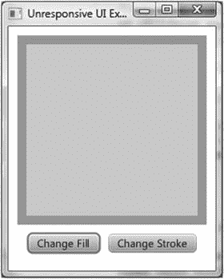

图 5-6。

The `UnresponsiveUIExample` program

但是，这个程序在“更改填充”按钮的事件处理程序中有一个错误:

```java
@Override
public void handle(ActionEvent actionEvent) {
    final Paint fillPaint = model.getFillPaint();
    if (fillPaint.equals(Color.LIGHTGRAY)) {
        model.setFillPaint(Color.GRAY);
    } else {
        model.setFillPaint(Color.LIGHTGRAY);
    }
    // Bad code, this will cause the UI to be unresponsive
    try {
        Thread.sleep(Long.MAX_VALUE);
    } catch (InterruptedException e) {
        // TODO properly handle interruption
    }
}

```

`Thread.sleep(Long.MAX_VALUE)`模拟需要很长时间执行的代码。在实际应用中，这可能是一个数据库调用、一个 web 服务调用或一段复杂的代码。因此，如果您单击“更改填充”按钮，在矩形中看不到颜色变化。更糟糕的是，整个 UI 似乎被锁定了:更改填充和更改描边按钮停止工作；操作系统提供的关闭窗口按钮将不会产生预期的效果。操作系统也可能将该程序标记为不响应，停止该程序的唯一方法是使用操作系统的强制终止功能。

要解决这样的问题，我们需要将长时间运行的代码卸载到工作线程，并将长时间计算的结果传递回 JavaFX 应用程序线程，以更新 UI 的状态，以便用户可以看到结果。根据您学习 Java 的时间，您对将代码卸载到工作线程的第一个问题的回答可能会有所不同。如果你是一名资深的 Java 程序员，你的本能反应可能是实例化一个`Runnable`，将其包装在一个`Thread`中，并对其调用`start()`。如果你在 Java 5 之后开始使用 Java，并且学习了`java.util.concurrent`类的层次结构，你的反应可能是站起来一个`java.util.concurrent.ExecutorService`并向它提交`java.util.concurrent.FutureTask` s。JavaFX 在`javafx.concurrent`包中包含了一个基于后一种方法的工作线程框架。

我们将在接下来的几节中研究这个框架中的接口和类，但在此之前，我们使用`Runnable`和`Thread`方法将计算卸载到一个工作线程。我们在这里的目的是强调第二个问题的答案，即如何使代码从一个工作线程运行在 JavaFX 应用程序线程上。完整的修正程序可以在`ResponsiveUIExample.java`中找到。以下是“更改填充”按钮的事件处理程序的新代码:

```java
view.changeFillButton.setOnAction(actionEvent -> {
    final Paint fillPaint = model.getFillPaint();
    if (fillPaint.equals(Color.LIGHTGRAY)) {
        model.setFillPaint(Color.GRAY);
    } else {
        model.setFillPaint(Color.LIGHTGRAY);
    }
    Runnable task = () -> {
        try {
            Thread.sleep(3000);
            Platform.runLater(() -> {
                final Rectangle rect = view.rectangle;
                double newArcSize =
                    rect.getArcHeight() < 20 ? 30 : 0;
                rect.setArcWidth(newArcSize);
                rect.setArcHeight(newArcSize);
            });
        } catch (InterruptedException e) {
            // TODO properly handle interruption
        }
    };
    new Thread(task).start();
});

```

我们已经用在工作线程中执行的代码取代了长睡眠。休眠三秒钟后，工作线程调用`javafx.application.Platform`类的`runLater()`方法，传递给它另一个切换矩形圆角的`Runnable`。因为长时间运行的计算是在工作线程中完成的，所以事件处理程序不会阻塞 JavaFX 应用程序线程。填充的变化现在立即反映在用户界面中。因为`Platform.runLater()`调用导致`Runnable`在 JavaFX 应用程序线程上执行，所以圆角的变化在三秒钟后反映在 UI 中。我们必须在 JavaFX 应用程序线程上执行`Runnable`的原因是它修改了现场场景的状态。

`Platform`类包括以下其他有用的实用方法:

*   如果在 JavaFX 应用程序线程上执行，`public static boolean isFxApplicationThread()`返回`true`，否则返回`false`。
*   `public static boolean isSupported(ConditionalFeature)`测试执行环境是否支持`ConditionalFeature`。可测试的`ConditionalFeatures`包括`GRAPHICS`、`CONTROLS`、`MEDIA`、`WEB`、`SWT`、`SWING`、`FXML`、`SCENE3D`、`EFFECT`、`SHAPE_CLIP`、`INPUT_METHOD`、`TRANSPARENT_WINDOW`、`UNIFIED_WINDOW`、`TWO_LEVEL_FOCUS`、`VIRTUAL_KEYBOARD`、`INPUT_TOUCH`、`INPUT_MULTITOUCH`和`INPUT_POINTER`。
*   如果在应用程序的`start()`方法被调用之后调用`public static void exit()`，则在 JavaFX 应用程序线程和其他 JavaFX 平台线程被关闭之前，导致应用程序的`stop()`方法在 JavaFX 应用程序线程上执行。如果应用程序的`start()`方法还没有被调用，应用程序的`stop()`方法可能不会被调用。
*   `public static boolean isImplicitExit()`和`public static void setImplicitExit(boolean)`测试并设置隐式退出标志。当此标志为真时，JavaFX 运行时将在最后一个应用程序窗口关闭时关闭；否则，您必须显式调用`Platform.exit()`来关闭 JavaFX 运行时。该标志的默认值为`true`。

Note

如果你熟悉 Swing 编程，你应该会看到 JavaFX 的`Platform.runLater()`和 Swing 的`EventQueue.invokeLater()`，或者说`SwingUtilities.invokeLater()`的相似之处。

既然我们已经用`Runnable`和`Thread`和`Platform.runLater()`解决了我们的问题，是时候看看我们如何使用 JavaFX 的内置工人线程框架以一种更加灵活和优雅的方式解决问题了。

### 了解 javafx.concurrent 框架

`javafx.concurrent`包中的 JavaFX worker 线程框架将 Java 5 中引入的 Java 并发框架的多功能性和灵活性与 JavaFX 属性和绑定框架的便利性相结合，以产生一个易于使用的工具集，该工具集能够识别 JavaFX 应用程序线程规则，并且非常易于使用。它由一个接口`Worker`和实现该接口的三个抽象基类`Task<V>`、`Service<V>`和`ScheduledService<V>`组成。

#### 了解工作接口

`Worker`接口指定了一个 JavaFX bean，它有九个只读属性、一个名为`cancel()`的方法、一个状态模型和状态转换规则。一个`Worker`代表一个工作单元，它运行在一个或多个后台线程中，但是 JavaFX 应用程序线程可以安全地观察到它的一些内部状态。九个只读属性如下。

*   `title`是表示任务标题的`String`属性。
*   `message`是一个`String`属性，表示随着任务的进行，更详细的消息。
*   `running`是一个只有当`Worker`处于`Worker.State.SCHEDULED`或`Worker.State.RUNNING`状态时才为真的`boolean`属性。
*   `state`是一个代表任务的`Worker.State`的`Object`属性。
*   `totalWork`是一个`double`属性，表示任务的总工作量。当工作总量未知时，其值为`–1.0`。
*   `workDone`是一个`double`属性，表示任务中到目前为止已经完成的工作量。它的值是`–1.0`或介于`0`和`totalWork`之间的一个数。
*   `progress`是一个`double`属性，表示任务中到目前为止已经完成的总工作量的百分比。其值为`–1.0`或`workDone`与`totalWork`之比。
*   `value`是表示任务输出的`Object`属性。只有当任务已经成功完成，即已经达到`Worker.State.SUCCEEDED`状态时，它的值才是非空的。
*   `exception`是一个`Object`属性，表示任务的实现已经抛出给 JavaFX worker 线程框架的一个`Throwable`。只有当任务处于`Worker.State.FAILED`状态时，它的值才是非空的。

上述属性旨在从 JavaFX 应用程序线程中访问。将场景图属性绑定到它们是安全的，因为这些属性的失效事件和更改事件是在 JavaFX 应用程序线程上触发的。通过在许多 GUI 应用程序中看到的虚构的任务进度消息框来考虑这些属性是有帮助的。它们通常有一个标题，一个进度条，指示已经完成的工作的百分比，还有一条消息告诉用户已经处理了多少项，还有多少项需要处理。所有这些属性都是由 JavaFX worker threading framework 本身或任务的实际实现来设置的。

`running`、`state`、`value`和`exception`属性由框架控制，无需用户干预即可在 JavaFX 应用程序线程中观察到它们。当框架想要更改这些属性时，它会确保更改是在 JavaFX 应用程序线程上完成的。任务的实现代码可以通过调用框架提供的受保护方法来更新`title`、`message`、`totalWork`、`workDone`和`progress`属性，这些方法保证在 JavaFX 应用程序线程上完成更改。

`Worker.State`是一个嵌套枚举，它定义了`Worker`的以下六种状态:

*   `READY (initial state)`
*   `SCHEDULED (transitional state)`
*   `RUNNING (transitional state)`
*   `SUCCEEDED (terminal state)`
*   `CANCELLED (terminal state)`
*   `FAILED (terminal state)`

如果还没有处于`SUCCEEDED`或`FAILED`状态，`cancel()`方法将把`Worker`转换到`CANCELLED`状态。

现在您已经熟悉了`Worker`接口的属性和状态，您可以继续学习 JavaFX worker threading framework 中实现该接口的三个抽象类，`Task<V>`和`Service<V>`以及`ScheduledService<V>`。

#### 理解任务<v>抽象类</v>

`Task<V>`抽象类是用于一次性任务的`Worker`接口的实现。一旦它的状态前进到`SUCCEEDED`或`FAILED`或`CANCELLED`，它将永远停留在终止状态。`Task<V>`抽象类扩展了`FutureTask<V>`类，因此支持`Runnable`、`Future<V>`和`RunnableFuture<V>`接口以及`Worker`接口。`Future<V>`、`RunnableFuture<V>`和`FutureTask<V>`接口和类是`java.util.concurrent`包的一部分。由于这种继承，一个`Task<V>`对象可以以适合其父类的各种方式使用。然而，对于典型的 JavaFX 用法，只使用`Task<V>`类本身的方法就足够了，可以在该类的 Javadoc 中找到这些方法的列表。以下是这些方法的列表，不包括上一节中讨论的只读属性:

*   `protected abstract V call() throws Exception`
*   `public final boolean cancel()`
*   `public boolean cancel(boolean mayInterruptIfRunning)`
*   `protected void updateTitle(String title)`
*   `protected void updateMessage(String message)`
*   `protected void updateProgress(long workDone, long totalWork)`
*   `protected void updateProgress(double workDone, double totalWork)`
*   `protected void updateValue(V)`

`Task<V>`抽象类实现了`javafx.event.EventTarget`接口。它支持的事件由`WorkerStateEvent`类表示。五个`Worker.State`中的每一个都有一个`WorkerStateEvent`，当`Task<V>`转换到一个状态时，事件被触发。在`Task<V>`中有五个类型为`EventHandler<WorkerStateEvent>`的对象属性和五个受保护的方法。触发相应的事件时，将调用这些事件处理程序和受保护的方法:

*   `onScheduled`属性
*   `onRunning`属性
*   `onSucceeded`属性
*   `onCancelled`属性
*   `onFailed`属性
*   `protected void scheduled()`
*   `protected void running()`
*   `protected void succeeded()`
*   `protected void cancelled()`
*   `protected void failed()`

`Task<V>`的扩展必须覆盖受保护的抽象`call()`方法来执行实际的工作。`call()`方法的实现可以调用受保护的方法`updateTitle()`、`updateMessage()`、`updateProgress()`和`updateValue()`向 JavaFX 应用线程发布其内部状态。实现完全控制任务的标题和消息。对于需要两个 longs 的`updateProgress()`调用，`workDone`和`totalWork`必须要么都是`–1`，表示进度不确定，要么满足关系`workDone >= 0`和`workDone <= totalWork`，导致`progress`值在`0.0`和`1.0`之间(`0%`到`100%`)。

Caution

如果`workDone > totalWork`，或者其中一个是`<–1`，那么`updateProgress()` API 将抛出一个异常。但是，它允许你传入`(0, 0)`，导致一个`NaN`的进程。

这两个`cancel()`方法可以从任何线程调用，如果任务还没有处于`SUCCEEDED`或`FAILED`状态，它们会将任务转移到`CANCELLED`状态。如果在任务运行之前调用了任何一个`cancel()`方法，它将进入`CANCELLED`状态，并且永远不会运行。两个`cancel()`方法的不同之处仅在于任务处于`RUNNING`状态，并且仅在于它们对正在运行的线程的处理。如果`cancel(true)`被调用，线程将接收一个中断。为了使该中断具有使任务快速完成处理的预期效果，必须对`call()`方法的实现进行编码，以检测该中断并跳过任何进一步的处理。无参数的`cancel()`方法简单地转发到`cancel(true)`。

清单 [5-9](#Par276) 展示了一个`Task`的创建，启动它，并从一个显示所有九个属性的简单 GUI 中观察任务的属性。

```java
package com.projavafx.collections;

import javafx.application.Application;
import javafx.beans.binding.Bindings;
import javafx.beans.property.ReadOnlyObjectProperty;
import javafx.concurrent.Task;
import javafx.concurrent.Worker;
import javafx.geometry.HPos;
import javafx.geometry.Insets;
import javafx.geometry.Pos;
import javafx.scene.Scene;
import javafx.scene.control.Button;
import javafx.scene.control.Label;
import javafx.scene.control.ProgressBar;
import javafx.scene.layout.BorderPane;
import javafx.scene.layout.ColumnConstraints;
import javafx.scene.layout.GridPane;
import javafx.scene.layout.HBox;
import javafx.stage.Stage;

import java.util.concurrent.atomic.AtomicBoolean;

public class WorkerAndTaskExample extends Application {
    private Model model;
    private View view;

    public static void main(String[] args) {
        launch(args);
    }

    public WorkerAndTaskExample() {
        model = new Model();
    }

    @Override
    public void start(Stage stage) throws Exception {
        view = new View(model);
        hookupEvents();
        stage.setTitle("Worker and Task Example");
        stage.setScene(view.scene);
        stage.show();
    }

    private void hookupEvents() {
        view.startButton.setOnAction(actionEvent -> {
            new Thread((Runnable) model.worker).start();
        });
        view.cancelButton.setOnAction(actionEvent -> {
            model.worker.cancel();
        });
        view.exceptionButton.setOnAction(actionEvent -> {
            model.shouldThrow.getAndSet(true);
        });
    }

    private static class Model {
        public Worker<String> worker;
        public AtomicBoolean shouldThrow = new AtomicBoolean(false);

        private Model() {
            worker = new Task<String>() {
                @Override
                protected String call() throws Exception {
                    updateTitle("Example Task");
                    updateMessage("Starting...");
                    final int total = 250;
                    updateProgress(0, total);
                    for (int i = 1; i <= total; i++) {
                        if (isCancelled()) {
                            updateValue("Canceled at " + System.currentTimeMillis());
                            return null; // ignored
                        }
                        try {
                            Thread.sleep(20);
                        } catch (InterruptedException e) {
                                updateValue("Canceled at " + System.currentTimeMillis());
                                return null; // ignored                        }
                        if (shouldThrow.get()) {
                            throw new RuntimeException("Exception thrown at " + System.currentTimeMillis());
                        }
                        updateTitle("Example Task (" + i + ")");
                        updateMessage("Processed " + i + " of " + total + " items.");
                        updateProgress(i, total);
                    }
                    return "Completed at " + System.currentTimeMillis();
                }

                @Override
                protected void scheduled() {
                    System.out.println("The task is scheduled.");
                }

                @Override
                protected void running() {
                    System.out.println("The task is running.");
                }
            };
            ((Task<String>) worker).setOnSucceeded(event -> {
                System.out.println("The task succeeded.");
            });
            ((Task<String>) worker).setOnCancelled(event -> {
                System.out.println("The task is canceled.");
            });
            ((Task<String>) worker).setOnFailed(event -> {
                System.out.println("The task failed.");
            });
        }
    }

    private static class View {
        public ProgressBar progressBar;

        public Label title;
        public Label message;
        public Label running;
        public Label state;
        public Label totalWork;
        public Label workDone;
        public Label progress;
        public Label value;
        public Label exception;

        public Button startButton;
        public Button cancelButton;
        public Button exceptionButton;

        public Scene scene;

        private View(final Model model) {
            progressBar = new ProgressBar();
            progressBar.setMinWidth(250);

            title = new Label();
            message = new Label();
            running = new Label();
            state = new Label();
            totalWork = new Label();
            workDone = new Label();
            progress = new Label();
            value = new Label();
            exception = new Label();

            startButton = new Button("Start");
            cancelButton = new Button("Cancel");
            exceptionButton = new Button("Exception");

            final ReadOnlyObjectProperty<Worker.State> stateProperty =
                model.worker.stateProperty();

            progressBar.progressProperty().bind(model.worker.progressProperty());

            title.textProperty().bind(
                model.worker.titleProperty());
            message.textProperty().bind(
                model.worker.messageProperty());
            running.textProperty().bind(
                Bindings.format("%s", model.worker.runningProperty()));
            state.textProperty().bind(
                Bindings.format("%s", stateProperty));
            totalWork.textProperty().bind(
                model.worker.totalWorkProperty().asString());
            workDone.textProperty().bind(
                model.worker.workDoneProperty().asString());
            progress.textProperty().bind(
                Bindings.format("%5.2f%%", model.worker.progressProperty().multiply(100)));
            value.textProperty().bind(
                model.worker.valueProperty());
            exception.textProperty().bind(Bindings.createStringBinding(() -> {
                final Throwable exception = model.worker.getException();
                if (exception == null) return "";
                return exception.getMessage();
            }, model.worker.exceptionProperty()));

            startButton.disableProperty().bind(
                stateProperty.isNotEqualTo(Worker.State.READY));
            cancelButton.disableProperty().bind(
                stateProperty.isNotEqualTo(Worker.State.RUNNING));
            exceptionButton.disableProperty().bind(
                stateProperty.isNotEqualTo(Worker.State.RUNNING));

            HBox topPane = new HBox(10, progressBar);
            topPane.setAlignment(Pos.CENTER);
            topPane.setPadding(new Insets(10, 10, 10, 10));

            ColumnConstraints constraints1 = new ColumnConstraints();
            constraints1.setHalignment(HPos.CENTER);
            constraints1.setMinWidth(65);

            ColumnConstraints constraints2 = new ColumnConstraints();
            constraints2.setHalignment(HPos.LEFT);
            constraints2.setMinWidth(200);

            GridPane centerPane = new GridPane();
            centerPane.setHgap(10);
            centerPane.setVgap(10);
            centerPane.setPadding(new Insets(10, 10, 10, 10));
            centerPane.getColumnConstraints()
                .addAll(constraints1, constraints2);

            centerPane.add(new Label("Title:"), 0, 0);
            centerPane.add(new Label("Message:"), 0, 1);
            centerPane.add(new Label("Running:"), 0, 2);
            centerPane.add(new Label("State:"), 0, 3);
            centerPane.add(new Label("Total Work:"), 0, 4);
            centerPane.add(new Label("Work Done:"), 0, 5);
            centerPane.add(new Label("Progress:"), 0, 6);
            centerPane.add(new Label("Value:"), 0, 7);
            centerPane.add(new Label("Exception:"), 0, 8);

            centerPane.add(title, 1, 0);
            centerPane.add(message, 1, 1);
            centerPane.add(running, 1, 2);
            centerPane.add(state, 1, 3);
            centerPane.add(totalWork, 1, 4);
            centerPane.add(workDone, 1, 5);
            centerPane.add(progress, 1, 6);
            centerPane.add(value, 1, 7);
            centerPane.add(exception, 1, 8);

            HBox buttonPane = new HBox(10,
                startButton, cancelButton, exceptionButton);
            buttonPane.setPadding(new Insets(10, 10, 10, 10));
            buttonPane.setAlignment(Pos.CENTER);

            BorderPane root = new BorderPane(centerPane,
                topPane, null, buttonPane, null);
            scene = new Scene(root);
        }
    }
}

Listing 5-9.
WorkerAndTaskExample.

java

```

这个程序的`Model`嵌套类包含一个`Worker`类型的`worker`字段和一个`AtomicBoolean`类型的`shouldThrow`字段。字段`worker`被初始化为一个匿名子类`Task<String>`的实例，该实例通过以每项 20 毫秒的速度模拟 250 项的处理来实现其`call()`方法。它在调用开始时和循环的每次迭代中更新任务的属性。它在两个地方处理取消。它在每次迭代的顶部检查`isCancelled()`标志，并且还检查`Thread.sleep()`调用的`InterruptedException`处理程序中的`isCancelled()`标志。如果任务被取消，它调用`updateValue()`，并从`loop`中出来，迅速返回。返回值被框架忽略。`shouldThrow`字段由`View`控制，通知任务应该抛出异常。

这个程序的`View`嵌套类创建了一个简单的 UI，在顶部有一个`ProgressBar`，在中心有一组`Labels`，显示工作人员的各种属性，在底部有三个按钮。`Label`的内容与`worker`的各种属性绑定在一起。按钮的`disable`属性也被绑定到`worker`的 state 属性，以便在任何时候只有相关的按钮被启用。例如,“开始”按钮在程序启动时是启用的，但在按下该按钮并开始执行任务后就被禁用了。同样，只有当任务正在运行时，才会启用“取消”和“异常”按钮。

当我们运行清单 [5-9](#Par276) 中的程序时，屏幕上会显示图 [5-7](#Fig7) 中的 GUI。

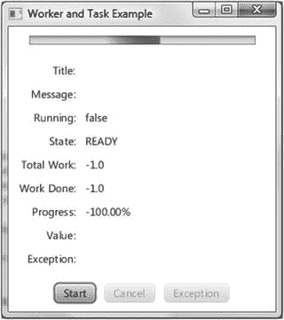

图 5-7。

The `WorkerAndTaskExample` program after starting up

请注意，进度条处于不确定的状态。标题、消息、值和异常的值为空。跑步的价值是假的。状态的值为就绪，总工作量和已完成工作量的值为–1.0，进度显示为–100%。“开始”按钮被启用，而“取消”和“例外”按钮被禁用。

单击 Start 按钮后，任务开始执行，GUI 会随着任务的进行自动反映属性值。图 [5-8](#Fig8) 是这个阶段的应用截图。请注意，进度条处于确定状态，反映了任务的进度。Title 和 Message 的值反映了在任务中的`call()`方法的实现中为这些属性设置了什么。跑步的价值是真实的。State 的值是 RUNNING，而 Total Work、Work Done 和 Progress 的值反映了正在执行的任务的当前状态:250 项中的 156 项已完成。值和例外字段为空，因为任务中既没有值也没有例外。开始按钮现在被禁用。Cancel 和 Exception 按钮已启用，这表示我们可能会尝试取消任务，或者在此时强制从任务中抛出一个异常。

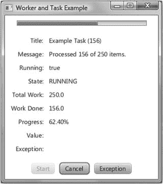

图 5-8。

The `WorkerAndTaskExample` program while a task is in progress

当任务正常完成时，我们到达图 [5-9](#Fig9) 中的截图。请注意，进度条位于 100.00%。“标题”、“消息”、“总工时”、“已完成工时”和“进度”域的值都反映了任务已经处理完所有 250 个项目的事实。运行值为假。状态为 SUCCEEDED，Value 字段现在包含来自`call()`方法的返回值。

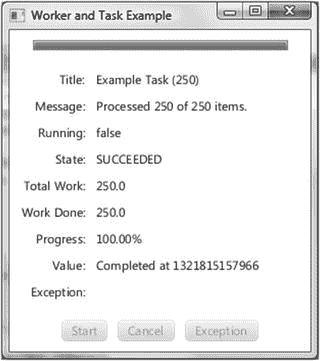

图 5-9。

The `WorkerAndTaskExample` program after the task succeeded

如果我们没有让任务正常完成，而是点击取消按钮，任务将立即完成，并显示图 [5-10](#Fig10) 中的屏幕截图。请注意，State 字段的值现在已被取消。值字段包含当任务被取消时我们传递给`updateValue()`方法的字符串。当我们检测到任务被取消时，我们有两个退出方法体的选择。在清单 [5-7](#Par184) 的程序中，我们选择更新值并从方法返回。我们也可以通过抛出一个`RuntimeException`来选择退出方法体。如果我们做了这个选择，屏幕截图将会有一个空的值字段，但是有一个非空的异常字段。无论如何，工人的状态都是`CANCELLED`。

Caution

当您响应取消而正常返回时，`Task`的当前实现中的一个错误导致一个`IllegalStateException`被记录为`Task`的异常。这将在下一版本中修复。

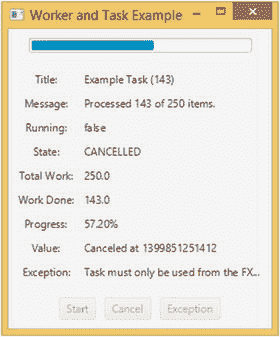

图 5-10。

The `WorkerAndTaskExample` program after the task has been cancelled

最后一个截图，图 [5-11](#Fig11) ，展示了在任务执行时点击异常按钮会发生什么。我们通过从 JavaFX 应用程序中设置一个`AtomicBoolean`标志来模拟任务中的异常，然后任务在`worker`线程中拾取这个标志并抛出异常。请注意,“状态”字段的值为“现在失败”。值字段为空，因为任务未成功完成。异常字段填充了我们抛出的`RuntimeException`的消息。


图 5-11。

The `WorkerAndTaskExample` program after the task threw an exception

我们在`Task`的匿名扩展中重写了`scheduled()`和`running()`方法，并在`Model`类中为成功、取消和失败的事件设置了事件处理程序。当您处理这些场景时，应该会看到这些事件被记录到控制台中。

Note

`Task<V>`类定义了一次性任务，这些任务只执行一次，不会再次运行。每次运行任务后，您必须重启`WorkerAndTaskExample`程序。

#### 理解服务<v>抽象类</v>

`Service<V>`抽象类是打算被重用的`Worker`接口的实现。它扩展了`Worker`的状态模型，允许其状态被重置为`Worker.State.READY`。`Service<V>`抽象类不扩展任何类，并且实现了`Worker`和`EventTarget`接口。除了`Worker`接口的九个只读属性外，`Service<V>`还有一个类型为`Executor`的读写属性，称为`executor`。它也有事件处理器属性和受保护的事件回调方法，就像`Task`类一样。以下是其余`Service<V>`方法的列表:

*   `protected abstract Task<V> createTask()`
*   `public void start()`
*   `public void reset()`
*   `public void restart()`
*   `public boolean cancel()`

`Service<V>`的扩展必须覆盖受保护的抽象`createTask()`方法，以生成新创建的`Task`。只有当`Service<V>`对象处于`Worker.State.READY`状态时，才能调用`start()`方法。它调用`createTask()`来获得一个新生成的`Task`，并向`executor`属性请求一个`Executor`。如果没有设置`executor`属性，它会创建自己的`Executor`。它将`Service<V>`对象的九个`Worker`属性绑定到`Task`的属性。然后将`Task`转换到`Worker.State.SCHEDULED`状态，并在`Executor`上执行`Task`。只有当`Service<V>`的状态不是`Worker.State.SCHEDULED`或`Worker.State.RUNNING`时，才能调用`reset()`方法。它只是将九个`Service<V>`属性从底层`Task`的属性中解除绑定，并将它们的值重置为新的启动值:`state`属性为`Worker.State.READY`，其他属性为`null`或`""`或`false`或`–1`。`restart()`方法简单地取消当前正在执行的`Task`，如果有的话，然后执行一个`reset()`，接着执行一个`start()`。`cancel()`方法将取消当前正在执行的`Task`，如果有的话；否则，它将把`Service<V>`转换到`Worker.State.CANCELLED`状态。

清单 [5-10](#Par296) 展示了使用`Service<V>`抽象类的匿名子类的一个实例在它自己的`Executor`中重复执行`Task` s。

```java
package com.projavafx.collections;

import javafx.application.Application;
import javafx.beans.binding.Bindings;
import javafx.beans.property.IntegerProperty;
import javafx.beans.property.ReadOnlyObjectProperty;
import javafx.beans.property.SimpleIntegerProperty;
import javafx.concurrent.Service;
import javafx.concurrent.Task;
import javafx.concurrent.Worker;
import javafx.geometry.HPos;
import javafx.geometry.Insets;
import javafx.geometry.Pos;
import javafx.scene.Scene;
import javafx.scene.control.Button;
import javafx.scene.control.Label;
import javafx.scene.control.ProgressBar;
import javafx.scene.control.TextField;
import javafx.scene.layout.BorderPane;
import javafx.scene.layout.ColumnConstraints;
import javafx.scene.layout.GridPane;
import javafx.scene.layout.HBox;
import javafx.stage.Stage;

import java.util.concurrent.atomic.AtomicBoolean;

public class ServiceExample extends Application {
    private Model model;
    private View view;

    public static void main(String[] args) {
        launch(args);
    }

    public ServiceExample() {
        model = new Model();
    }

    @Override
    public void start(Stage stage) throws Exception {
        view = new View(model);
        hookupEvents();
        stage.setTitle("Service Example");
        stage.setScene(view.scene);
        stage.show();
    }

    private void hookupEvents() {
        view.startButton.setOnAction(actionEvent -> {
            model.shouldThrow.getAndSet(false);
            ((Service) model.worker).restart();
        });
        view.cancelButton.setOnAction(actionEvent -> {
            model.worker.cancel();
        });
        view.exceptionButton.setOnAction(actionEvent -> {
            model.shouldThrow.getAndSet(true);
        });
    }

    private static class Model {
        public Worker<String> worker;
        public AtomicBoolean shouldThrow = new AtomicBoolean(false);
        public IntegerProperty numberOfItems = new SimpleIntegerProperty(250);

        private Model() {
            worker = new Service<String>() {
                @Override
                protected Task createTask() {
                    return new Task<String>() {
                        @Override
                        protected String call() throws Exception {
                            updateTitle("Example Service");
                            updateMessage("Starting...");
                            final int total = numberOfItems.get();
                            updateProgress(0, total);
                            for (int i = 1; i <= total; i++) {
                                if (isCancelled()) {
                                    updateValue("Canceled at " + System.currentTimeMillis());
                                    return null; // ignored
                                }
                                try {
                                    Thread.sleep(20);
                                } catch (InterruptedException e) {
                                    if (isCancelled()) {
                                        updateValue("Canceled at " + System.currentTimeMillis());
                                        return null; // ignored
                                    }                                }
                                if (shouldThrow.get()) {
                                    throw new RuntimeException("Exception thrown at " + System.currentTimeMillis());
                                }
                                updateTitle("Example Service (" + i + ")");
                                updateMessage("Processed " + i + " of " + total + " items.");
                                updateProgress(i, total);
                            }
                            return "Completed at " + System.currentTimeMillis();
                        }
                    };
                }
            };
        }
    }

    private static class View {
        public ProgressBar progressBar;

        public Label title;
        public Label message;
        public Label running;
        public Label state;
        public Label totalWork;
        public Label workDone;
        public Label progress;
        public Label value;
        public Label exception;

        public TextField numberOfItems;
        public Button startButton;
        public Button cancelButton;
        public Button exceptionButton;

        public Scene scene;

        private View(final Model model) {
            progressBar = new ProgressBar();
            progressBar.setMinWidth(250);

            title = new Label();
            message = new Label();
            running = new Label();
            state = new Label();
            totalWork = new Label();
            workDone = new Label();
            progress = new Label();
            value = new Label();
            exception = new Label();
            numberOfItems = new TextField();
            numberOfItems.setMaxWidth(40);

            startButton = new Button("Start");
            cancelButton = new Button("Cancel");
            exceptionButton = new Button("Exception");

            final ReadOnlyObjectProperty<Worker.State> stateProperty =
                model.worker.stateProperty();

            progressBar.progressProperty().bind(model.worker.progressProperty());

            title.textProperty().bind(
                model.worker.titleProperty());
            message.textProperty().bind(
                model.worker.messageProperty());
            running.textProperty().bind(
                Bindings.format("%s", model.worker.runningProperty()));
            state.textProperty().bind(
                Bindings.format("%s", stateProperty));
            totalWork.textProperty().bind(
                model.worker.totalWorkProperty().asString());
            workDone.textProperty().bind(
                model.worker.workDoneProperty().asString());
            progress.textProperty().bind(
                Bindings.format("%5.2f%%", model.worker.progressProperty().multiply(100)));
            value.textProperty().bind(
                model.worker.valueProperty());
            exception.textProperty().bind(Bindings.createStringBinding(() -> {
                final Throwable exception = model.worker.getException();
                if (exception == null) return "";
                return exception.getMessage();
            }, model.worker.exceptionProperty()));

            model.numberOfItems.bind(Bindings.createIntegerBinding(() -> {
                final String text = numberOfItems.getText();
                int n = 250;
                try {
                    n = Integer.parseInt(text);
                } catch (NumberFormatException e) {
                }
                return n;
            }, numberOfItems.textProperty()));

            startButton.disableProperty().bind(
                stateProperty.isEqualTo(Worker.State.RUNNING));
            cancelButton.disableProperty().bind(
                stateProperty.isNotEqualTo(Worker.State.RUNNING));
            exceptionButton.disableProperty().bind(
                stateProperty.isNotEqualTo(Worker.State.RUNNING));

            HBox topPane = new HBox(10, progressBar);
            topPane.setPadding(new Insets(10, 10, 10, 10));
            topPane.setAlignment(Pos.CENTER);

            ColumnConstraints constraints1 = new ColumnConstraints();
            constraints1.setHalignment(HPos.RIGHT);
            constraints1.setMinWidth(65);
            ColumnConstraints constraints2 = new ColumnConstraints();
            constraints2.setHalignment(HPos.LEFT);
            constraints2.setMinWidth(200);

            GridPane centerPane = new GridPane();
            centerPane.setHgap(10);
            centerPane.setVgap(10);
            centerPane.setPadding(new Insets(10, 10, 10, 10));
            centerPane.getColumnConstraints().addAll(constraints1, constraints2);
            centerPane.add(new Label("Title:"), 0, 0);
            centerPane.add(new Label("Message:"), 0, 1);
            centerPane.add(new Label("Running:"), 0, 2);
            centerPane.add(new Label("State:"), 0, 3);
            centerPane.add(new Label("Total Work:"), 0, 4);
            centerPane.add(new Label("Work Done:"), 0, 5);
            centerPane.add(new Label("Progress:"), 0, 6);
            centerPane.add(new Label("Value:"), 0, 7);
            centerPane.add(new Label("Exception:"), 0, 8);

            centerPane.add(title, 1, 0);
            centerPane.add(message, 1, 1);
            centerPane.add(running, 1, 2);
            centerPane.add(state, 1, 3);
            centerPane.add(totalWork, 1, 4);
            centerPane.add(workDone, 1, 5);
            centerPane.add(progress, 1, 6);
            centerPane.add(value, 1, 7);
            centerPane.add(exception, 1, 8);

            HBox buttonPane = new HBox(10,
                new Label("Process"), numberOfItems, new Label("items"),
                startButton, cancelButton, exceptionButton);
            buttonPane.setPadding(new Insets(10, 10, 10, 10));
            buttonPane.setAlignment(Pos.CENTER);

            BorderPane root = new BorderPane(centerPane, topPane, null, buttonPane, null);
            scene = new Scene(root);
        }
    }
}

Listing 5-10.
ServiceExample.java

```

前面的程序是从我们在前一节中学习的`WorkerAndTaskExample`类派生而来的。这个程序的`Model`嵌套类包含一个`Worker`类型的`worker`字段、`AtomicBoolean`类型的`shouldThrow`字段和`IntegerProperty`类型的`numberOfItems`字段。`worker`字段被初始化为`Service<String>`的匿名子类的一个实例，该实例实现其`createTask()`方法以返回一个带有`call()`方法的`Task<String>`，该方法的实现几乎与上一节中的`Task<String>`实现完全相同，只是它并不总是处理 250 个项目，而是从`Model`类的`numberOfItems`属性中选取要处理的项目数。

这个程序的`View`嵌套类创建了一个与前一节几乎相同的 UI，但是在按钮面板中添加了一些额外的控件。添加到按钮面板的控件之一是名为`numberOfItems`的`TextField`。`model`的`numberOfItems IntegerProperty`被绑定到用`view`的`numberOfItems`字段的`textProperty()`创建的`IntegerBinding`。这有效地控制了每个新创建的`Task`将处理的项目数量。仅当服务处于`Worker.State.RUNNING`状态时，启动按钮才被禁用。因此，您可以在任务完成后单击开始按钮。

开始按钮的动作处理程序现在将`shouldThrow`标志重置为`false`，并调用服务的`restart()`。

图 [5-12](#Fig12) 至 [5-16](#Fig16) 中的截图是在与`WorkerAndTaskExample`程序的图 [5-7](#Fig7) 至 [5-11](#Fig11) 中的截图类似的情况下用`ServiceExample`程序拍摄的。

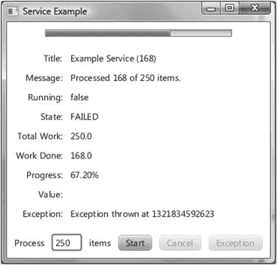

图 5-16。

The `ServiceExample` program after the task threw an exception

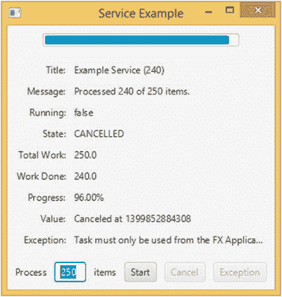

图 5-15。

The `ServiceExample` program after the task has been cancelled

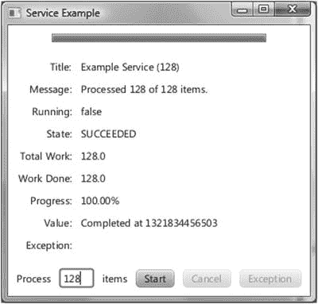

图 5-14。

The `ServiceExample` program after the task succeeded


图 5-13。

The `ServiceExample` program while a task is in progress


图 5-12。

The `ServiceExample` program after starting up

正如您从前面的屏幕截图中看到的，输入到文本字段中的数字确实会影响每次运行服务时处理的项目数量，屏幕截图中 UI 中反映的消息就是证明。

Caution

因为使用 JavaFX worker threading framework 启动的任务在后台线程中执行，所以不要访问任务代码中的任何实时场景非常重要。

#### 了解 ScheduledService <v>抽象类</v>

`ScheduledService<V>`抽象类扩展了`Service<V>`抽象类，并提供由服务创建的任务的重复执行。`ScheduledService<V>`类通过以下属性控制其任务的重复方式:

*   `delay`
*   `period`
*   `backOffStrategy`
*   `restartOnFailure`
*   `maximumFailureCount`
*   `currentFailureCount`
*   `cumulativePeriod`
*   `maximumCumulativePeriod`
*   `lastValue`

`delay`属性控制在调度服务上的`start()`调用之后任务开始运行之前必须经过的时间。`period`属性控制任务运行一次后，下一次运行开始前必须经过的时间。`period`测量一次运行开始和下一次运行开始之间的差异。`delay`和`period`是`Duration`类型的对象属性。如果任务执行过程中没有出现故障情况，则`ScheduledService`将无限期重复该任务。

如果在任务执行过程中出现故障，那么接下来会发生什么由`restartOnFailure`属性控制。如果该属性为`false`，`ScheduledService`将保持在`FAILED`状态，不会再发生任何事情。如果`restartOnFailure`属性是`true`，那么`ScheduledService`将再次运行任务。失败任务的重新运行由`backOffStrategy`、`maximumFailureCount`和`maximumCumulativePeriod`属性控制。后退策略只是一个 lambda 表达式，它将`ScheduledService`作为一个参数，并返回一个`Duration`，它被设置为`cumulativePeriod`属性的值。自上次任务运行失败开始后经过的时间达到`cumulativePeriod`时，任务将开始重新运行。除了`cumulativePeriod`之外，`ScheduledService`还跟踪`currentFailureCount`属性，它是当前失败运行序列中连续失败运行的次数。如果任务重新运行成功，`ScheduledService`将返回到其在`period`时间间隔内运行任务的正常行为；否则(即，如果重新运行再次失败)，`ScheduledService`将向`backOffStrategy`请求新的`cumulativePeriod`，并再次重新运行。如果`currentFailureCount`达到`maximumFailureCount`，或者`cumulativePeriod`大于或等于`maximumCumulativePeriod`，则`ScheduledService`将进入故障状态，不会再发生任何情况。

提供了三种后退策略。它们是`ScheduledService`中的常量。线性增长的`LINEAR_BACKOFF_STRATEGY`回报越来越长的`Durations`。`EXPONENTIAL_BACKOFF_STRATEGY`回报越来越长`Durations`呈指数增长。`LOGARITHMIC_BACKOFF_STRATEGY`返回以对数方式增长的更长的`Durations`。你可以很容易地定义自己的后退策略。

你可以通过调用`reset()`和`start()`方法来重置和重启一个`ScheduledService`。

## 将 JavaFX 与其他 GUI 工具包混合使用

在研究了 JavaFX 运行时的线程范例和从 JavaFX 应用程序线程执行代码的方法之后，我们现在来看看如何使 JavaFX 与其他 GUI 工具包共存。JavaFX 提供了将 JavaFX 与 Swing 或 SWT 混合使用的类和框架。您可以在 Swing 应用程序中嵌入 JavaFX 场景。您可以在 SWT 应用程序中嵌入 JavaFX 场景。并且可以在 JavaFX 应用程序中嵌入 Swing 组件。

### 在 Swing 应用程序中嵌入 JavaFX 场景

JavaFX 支持通过类的`javafx.embed.swing`包将 JavaFX 场景嵌入到 Swing 应用程序中。这是一个非常小的包，包括一个用于将 JavaFX 场景嵌入到 Swing 中的公共类—`JFXPanel`—和另一个用于将 Swing 组件嵌入到 JavaFX 应用程序中的类— `SwingNode`。`JFXPanel`类扩展了`javax.swing.JComponent`，因此可以像其他 Swing 组件一样放在 Swing 程序中。`JFXPanel`还可以托管一个 JavaFX 场景，这样就可以将 JavaFX 场景添加到 Swing 程序中。

然而，这个嵌入了 JavaFX 场景的 Swing 程序既需要 Swing 运行时来使其 Swing 部分正常工作，也需要 JavaFX 运行时来使 JavaFX 部分正常工作。因此，它同时具有 Swing 事件调度线程(EDT)和 JavaFX 应用程序线程。`JFXPanel`类在 Swing 和 JavaFX 之间进行所有用户事件的双向翻译。

正如 JavaFX 的规则要求对现场场景的所有访问都在 JavaFX 应用程序线程中完成一样，Swing 的规则要求对 Swing GUIs 的所有访问都在 EDT 中完成。如果您想从 JavaFX 事件处理程序改变 Swing 组件，或者相反，您仍然需要跳转线程。正如我们前面看到的，在 JavaFX 应用程序线程上执行一段代码的正确方法是使用`Platform.runLater()`。在 Swing EDT 上执行一段代码的正确方法是使用`EventQueue.invokeLater()`。

在本节中，我们将一个纯 Swing 程序转换成一个 Swing 和 JavaFX 混合程序。我们从清单 [5-11](#Par322) 中的 Swing 程序开始，它与`ResponsiveUIExample`程序非常相似。

```java
package com.projavafx.collections;

import javax.swing.*;
import java.awt.*;
import java.awt.event.ActionEvent;
import java.awt.event.ActionListener;

public class NoJavaFXSceneInSwingExample {
    public static void main(final String[] args) {
        EventQueue.invokeLater(new Runnable() {
            @Override
            public void run() {
                swingMain(args);
            }
        });
    }
    private static void swingMain(String[] args) {
        Model model = new Model();
        View view = new View(model);
        Controller controller = new Controller(model, view);
        controller.mainLoop();
    }

    private static class Model {
        public Color fillColor = Color.LIGHT_GRAY;
        public Color strokeColor = Color.DARK_GRAY;
    }

    private static class View {
        public JFrame frame;
        public JComponent canvas;
        public JButton changeFillButton;
        public JButton changeStrokeButton;

        private View(final Model model) {
            frame = new JFrame("No JavaFX in Swing Example");
            canvas = new JComponent() {
                @Override
                public void paint(Graphics g) {
                    g.setColor(model.strokeColor);
                    g.fillRect(0, 0, 200, 200);
                    g.setColor(model.fillColor);
                    g.fillRect(10, 10, 180, 180);
                }

                @Override
                public Dimension getPreferredSize() {
                    return new Dimension(200, 200);
                }
            };
            FlowLayout canvasPanelLayout = new FlowLayout(FlowLayout.CENTER, 10, 10);
            JPanel canvasPanel = new JPanel(canvasPanelLayout);
            canvasPanel.add(canvas);

            changeFillButton = new JButton("Change Fill");
            changeStrokeButton = new JButton("Change Stroke");
            FlowLayout buttonPanelLayout = new FlowLayout(FlowLayout.CENTER, 10, 10);
            JPanel buttonPanel = new JPanel(buttonPanelLayout);
            buttonPanel.add(changeFillButton);
            buttonPanel.add(changeStrokeButton);

            frame.add(canvasPanel, BorderLayout.CENTER);
            frame.add(buttonPanel, BorderLayout.SOUTH);
            frame.setDefaultCloseOperation(JFrame.EXIT_ON_CLOSE);
            frame.setLocationByPlatform(true)

;
            frame.pack();
        }
    }
    private static class Controller {
        private View view;

        private Controller(final Model model, final View view) {
            this.view = view;
            this.view.changeFillButton.addActionListener(new ActionListener() {
                @Override
                public void actionPerformed(ActionEvent e) {
                    if (model.fillColor.equals(Color.LIGHT_GRAY)) {
                        model.fillColor = Color.GRAY;
                    } else {
                        model.fillColor = Color.LIGHT_GRAY;
                    }
                    view.canvas.repaint();
                }
            });
            this.view.changeStrokeButton.addActionListener(new ActionListener() {
                @Override
                public void actionPerformed(ActionEvent e) {
                    if (model.strokeColor.equals(Color.DARK_GRAY)) {
                        model.strokeColor = Color.BLACK;
                    } else {
                        model.strokeColor = Color.DARK_GRAY;
                    }
                    view.canvas.repaint();
                }
            });
        }

        public void mainLoop() {
            view.frame.setVisible(true);
        }
    }
}

Listing 5-11.
NoJavaFXSceneInSwingExample.java

```

运行清单 [5-11](#Par322) 中的程序时，显示图 [5-17](#Fig17) 中的 UI。它是一个包含三个 Swing 组件的`JFrame`,一个包含被覆盖的`paint()`和`getPreferredSize()`方法的`JComponent`,使它看起来像我们在前面的程序中看到的矩形，以及两个将改变矩形的填充和笔划的`JButtons`。

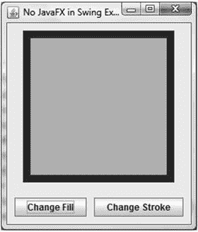

图 5-17。

The `NoJavaFXSceneInSwingExample` program

由于`NoJavaFXSceneInSwingExample`中的自定义绘制`JComponent`很难长期维护，我们用 JavaFX `Rectangle`替换了它。这是通过用等效的`JFXPanel`代码替换 Swing 代码来实现的。这是 Swing 代码:

```java
canvas = new JComponent() {
    @Override
    public void paint(Graphics g) {
        g.setColor(model.strokeColor);
        g.fillRect(0, 0, 200, 200);
        g.setColor(model.fillColor);
        g.fillRect(10, 10, 180, 180);
    }

    @Override
    public Dimension getPreferredSize() {
        return new Dimension(200, 200);
    }
};

```

这里是`JFXPanel`代码:

```java
canvas = new JFXPanel();
canvas.setPreferredSize(new Dimension(210, 210));
Platform.runLater(new Runnable() {
    @Override
    public void run() {
        final Rectangle rectangle = new Rectangle(200, 200);
        rectangle.setStrokeWidth(10);
        rectangle.fillProperty().bind(model.fillProperty());
        rectangle.strokeProperty().bind(model.strokeProperty());
        final VBox vBox = new VBox(rectangle);
        final Scene scene = new Scene(vBox);
        canvas.setScene(scene);
    }
});

```

`JFXPanel`构造器引导 JavaFX 运行时系统。我们为`JFXPanel`设置了首选大小，以便它在 Swing 容器中正确布局。然后，我们在 JavaFX 应用程序线程上构建场景图，并将其绑定到模型，我们将其更改为 JavaFX bean。需要进行的另一组更改是在两个`JButton`的`ActionListener`中。修改`model`会触发对 JavaFX 矩形的更改，因此需要在 JavaFX 应用程序线程上运行以下代码:

```java
this.view.changeFillButton.addActionListener(e -> {
    Platform.runLater(() -> {
        final Paint fillPaint = model.getFill();
        if (fillPaint.equals(Color.LIGHTGRAY)) {
            model.setFill(Color.GRAY);
        } else {
            model.setFill(Color.LIGHTGRAY);
        }
    });
});

```

清单 [5-12](#Par331) 显示了完整的 Swing JavaFX 混合程序。

```java
package com.projavafx.collections;

import javafx.application.Platform;
import javafx.beans.property.ObjectProperty;
import javafx.beans.property.SimpleObjectProperty;
import javafx.embed.swing.JFXPanel;
import javafx.scene.Scene;
import javafx.scene.layout.VBox;
import javafx.scene.paint.Color;
import javafx.scene.paint.Paint;
import javafx.scene.shape.Rectangle;

import javax.swing.*;
import java.awt.*;

public class JavaFXSceneInSwingExample {
    public static void main(final String[] args) {
        EventQueue.invokeLater(() -> {
            swingMain(args);
        });
    }

    private static void swingMain(String[] args) {

        Model model = new Model();
        View view = new View(model);
        Controller controller = new Controller(model, view);
        controller.mainLoop();
    }

    private static class Model {
        private ObjectProperty<Color> fill = new SimpleObjectProperty<>(Color.LIGHTGRAY);
        private ObjectProperty<Color> stroke = new SimpleObjectProperty<>(Color.DARKGRAY);

        public final Color getFill() {
            return fill.get();
        }

        public final void setFill(Color value) {
            this.fill.set(value);
        }

        public final Color getStroke() {
            return stroke.get();
        }

        public final void setStroke(Color value) {
            this.stroke.set(value);
        }

        public final ObjectProperty<Color> fillProperty() {
            return fill;
        }

        public final ObjectProperty<Color> strokeProperty() {
            return stroke;
        }
    }

    private static class View {
        public JFrame frame;
        public JFXPanel canvas;
        public JButton changeFillButton;
        public JButton changeStrokeButton;

        private View(final Model model) {
            frame = new JFrame("JavaFX in Swing Example");
            canvas = new JFXPanel();
            canvas.setPreferredSize(new Dimension(210, 210));
            Platform.runLater(new Runnable() {

                @Override
                public void run() {
                    final Rectangle rectangle = new Rectangle(200, 200);
                    rectangle.setStrokeWidth(10);
                    rectangle.fillProperty().bind(model.fillProperty());
                    rectangle.strokeProperty().bind(model.strokeProperty());
                    final VBox vBox = new VBox(rectangle);
                    final Scene scene = new Scene(vBox);
                    canvas.setScene(scene);
                }
            });
            FlowLayout canvasPanelLayout = new FlowLayout(FlowLayout.CENTER, 10, 10);
            JPanel canvasPanel = new JPanel(canvasPanelLayout);
            canvasPanel.add(canvas);

            changeFillButton = new JButton("Change Fill");
            changeStrokeButton = new JButton("Change Stroke");
            FlowLayout buttonPanelLayout = new FlowLayout(FlowLayout.CENTER, 10, 10);
            JPanel buttonPanel = new JPanel(buttonPanelLayout);
            buttonPanel.add(changeFillButton);
            buttonPanel.add(changeStrokeButton);

            frame.add(canvasPanel, BorderLayout.CENTER);
            frame.add(buttonPanel, BorderLayout.SOUTH);
            frame.setDefaultCloseOperation(JFrame.EXIT_ON_CLOSE);
            frame.setLocationByPlatform(true);
            frame.pack();
        }
    }

    private static class Controller {
        private View view;

        private Controller(final Model model, final View view) {
            this.view = view;
            this.view.changeFillButton.addActionListener(e -> {
                Platform.runLater(() -> {
                    final Paint fillPaint = model.getFill();
                    if (fillPaint.equals(Color.LIGHTGRAY)) {
                        model.setFill(Color.GRAY);
                    } else {
                        model.setFill(Color.LIGHTGRAY);
                    }
                });
            });
            this.view.changeStrokeButton.addActionListener(e -> {
                Platform.runLater(() -> {
                    final Paint strokePaint = model.getStroke();
                    if (strokePaint.equals(Color.DARKGRAY)) {
                        model.setStroke(Color.BLACK);
                    } else {
                        model.setStroke(Color.DARKGRAY);
                    }
                });
            });
        }

        public void mainLoop() {
            view.frame.setVisible(true);

        }
    }
}

Listing 5-12.
JavaFXSceneInSwingExample.java

```

运行清单 [5-12](#Par331) 中的程序时，显示图 [5-18](#Fig18) 中的 GUI。从截图上看不出来，但是`JFrame`中间的矩形是 JavaFX 矩形。


图 5-18。

The `JavaFXSceneInSwingExample` program

### 在 SWT 应用程序中嵌入 JavaFX 场景

JavaFX 能够通过类的`javafx.embed.swt`包将 JavaFX 场景嵌入到 SWT 应用程序中。它包含两个公共类，`FXCanvas`和`SWTFXUtils`。`FXCanvas`类扩展了`org.eclipse.swt.widgets.Canvas`，可以像任何其他 SWT 小部件一样放在 SWT 程序中。`FXCanvas`还可以托管一个 JavaFX 场景，并且可以将 JavaFX 场景添加到一个 SWT 程序中。

因为 SWT 和 JavaFX 都使用本地平台的 UI 线程作为自己的事件调度线程，所以 SWT UI 线程(在这里实例化一个`Display`对象，启动主循环，并且必须创建和访问所有其他 UI 小部件)和 JavaFX 应用程序线程是同一个线程。因此，在您的 SWT 和 JavaFX 事件处理程序中没有必要使用`Platform.runLater()`或其 SWT 等价物`display.asyncExec()`。

清单 [5-13](#Par337) 中的 SWT 程序是清单 [5-11](#Par322) 中 Swing 程序的 SWT 端口。

Note

您需要将包含 SWT 类的 jar 文件添加到您的类路径中，以编译清单 [5-13](#Par337) 和 [5-14](#Par344) 中的程序。在我们的开发机器上，SWT jar 位于`%ECLIPSE_HOME%\plugins\ org.eclipse.swt.win32.win32.x86_64_3.102.1.v20140206-1358.jar`，其中`%ECLIPSE_HOME%`是 Eclipse(开普勒 SR2)安装目录。

```java
import org.eclipse.swt.SWT;
import org.eclipse.swt.events.MouseEvent;
import org.eclipse.swt.events.MouseMoveListener;
import org.eclipse.swt.events.MouseTrackAdapter;
import org.eclipse.swt.events.PaintEvent;
import org.eclipse.swt.events.PaintListener;
import org.eclipse.swt.events.SelectionAdapter;
import org.eclipse.swt.events.SelectionEvent;
import org.eclipse.swt.graphics.Color;
import org.eclipse.swt.graphics.GC;
import org.eclipse.swt.graphics.RGB;
import org.eclipse.swt.layout.RowData;
import org.eclipse.swt.layout.RowLayout;
import org.eclipse.swt.widgets.Button;
import org.eclipse.swt.widgets.Canvas;
import org.eclipse.swt.widgets.Composite;
import org.eclipse.swt.widgets.Display;
import org.eclipse.swt.widgets.Label;
import org.eclipse.swt.widgets.Shell;

public class NoJavaFXSceneInSWTExample {
    public static void main(final String[] args) {
        Model model = new Model();
        View view = new View(model);
        Controller controller = new Controller(model, view);
        controller.mainLoop();
    }

    private static class Model {
        public static final RGB LIGHT_GRAY = new RGB(0xd3, 0xd3, 0xd3);
        public static final RGB GRAY = new RGB(0x80, 0x80, 0x80);
        public static final RGB DARK_GRAY = new RGB(0xa9, 0xa9, 0xa9);
        public static final RGB BLACK = new RGB(0x0, 0x0, 0x0);
        public RGB fillColor = LIGHT_GRAY;
        public RGB strokeColor = DARK_GRAY;

    }

    private static class View {
        public Display display;
        public Shell frame;
        public Canvas canvas;
        public Button changeFillButton;
        public Button changeStrokeButton;
        public Label mouseLocation;
        public boolean mouseInCanvas;

        private View(final Model model) {
            this.display = new Display();
            frame = new Shell(display);
            frame.setText("No JavaFX in SWT Example");
            RowLayout frameLayout = new RowLayout(SWT.VERTICAL);
            frameLayout.spacing = 10;
            frameLayout.center = true;
            frame.setLayout(frameLayout);

            Composite canvasPanel = new Composite(frame, SWT.NONE);
            RowLayout canvasPanelLayout = new RowLayout(SWT.VERTICAL);
            canvasPanelLayout.spacing = 10;
            canvasPanel.setLayout(canvasPanelLayout);

            canvas = new Canvas(canvasPanel, SWT.NONE);
            canvas.setLayoutData(new RowData(200, 200));
            canvas.addPaintListener(new PaintListener() {
                @Override
                public void paintControl(PaintEvent paintEvent) {
                    final GC gc = paintEvent.gc;
                    final Color strokeColor = new Color(display, model.strokeColor);
                    gc.setBackground(strokeColor);
                    gc.fillRectangle(0, 0, 200, 200);
                    final Color fillColor = new Color(display, model.fillColor);
                    gc.setBackground(fillColor);
                    gc.fillRectangle(10, 10, 180, 180);
                    strokeColor.dispose();
                    fillColor.dispose();
                }
            });

            Composite buttonPanel = new Composite(frame, SWT.NONE);
            RowLayout buttonPanelLayout = new RowLayout(SWT.HORIZONTAL);
            buttonPanelLayout.spacing = 10;
            buttonPanelLayout.center = true;
            buttonPanel.setLayout(buttonPanelLayout);

            changeFillButton = new Button(buttonPanel, SWT.NONE);
            changeFillButton.setText("Change Fill");
            changeStrokeButton = new Button(buttonPanel, SWT.NONE);
            changeStrokeButton.setText("Change Stroke");
            mouseLocation = new Label(buttonPanel, SWT.NONE);
            mouseLocation.setLayoutData(new RowData(50, 15));

            frame.pack();
        }
    }

    private static class Controller {
        private View view;

        private Controller(final Model model, final View view) {
            this.view = view;
            view.changeFillButton.addSelectionListener(new SelectionAdapter() {
                @Override
                public void widgetSelected(SelectionEvent e) {
                    if (model.fillColor.equals(model.LIGHT_GRAY)) {
                        model.fillColor = model.GRAY;
                    } else {
                        model.fillColor = model.LIGHT_GRAY;
                    }
                    view.canvas.redraw();
                }
            });
            view.changeStrokeButton.addSelectionListener(new SelectionAdapter() {
                @Override
                public void widgetSelected(SelectionEvent e) {
                    if (model.strokeColor.equals(model.DARK_GRAY)) {
                        model.strokeColor = model.BLACK;
                    } else {
                        model.strokeColor = model.DARK_GRAY;
                    }
                    view.canvas.redraw();
                }
            });
            view.canvas.addMouseMoveListener(new MouseMoveListener() {
                @Override
                public void mouseMove(MouseEvent mouseEvent) {
                    if (view.mouseInCanvas) {
                        view.mouseLocation.setText("(" + mouseEvent.x + ", " + mouseEvent.y + ")");
                    }
                }
            });
            this.view.canvas.addMouseTrackListener(new MouseTrackAdapter() {
                @Override
                public void mouseEnter(MouseEvent e) {
                    view.mouseInCanvas = true;
                }

                @Override
                public void mouseExit(MouseEvent e) {
                    view.mouseInCanvas = false;
                    view.mouseLocation.setText("");

                }
            });

        }

        public void mainLoop() {
            view.frame.open();
            while (!view.frame.isDisposed()) {
                if (!view.display.readAndDispatch()) {
                    view.display.sleep();
                }
            }
            view.display.dispose();
        }
    }
}

Listing 5-13.
NoJavaFXSceneInSWTExample.java

```

运行清单 [5-13](#Par337) 中的程序时，显示图 [5-19](#Fig19) 中的 UI。它是一个 SWT `Shell`包含四个 SWT 小部件，一个`Canvas`带有一个`PaintListener`使它看起来像我们前面看到的矩形，两个`Button`将改变矩形的填充和笔画，还有一个`Label`小部件当鼠标在矩形内时将显示鼠标指针的位置。

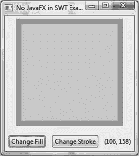

图 5-19。

The `NoJavaFXSceneInSWTExample` program

正如我们在 Swing 示例中所做的那样，我们用 JavaFX `Rectangle`替换了程序`NoJavaFXSceneInSWTExample`中自定义绘制的`Canvas`小部件。这是通过用等效的 FXCanvas 码替换 SWT 码来实现的。以下是 SWT 电码:

```java
canvas = new Canvas(canvasPanel, SWT.NONE);
canvas.setLayoutData(new RowData(200, 200));
canvas.addPaintListener(new PaintListener() {
    @Override
    public void paintControl(PaintEvent paintEvent) {
        final GC gc = paintEvent.gc;
        final Color strokeColor = new Color(display, model.strokeColor);
        gc.setBackground(strokeColor);
        gc.fillRectangle(0, 0, 200, 200);
        final Color fillColor = new Color(display, model.fillColor);
        gc.setBackground(fillColor);
        gc.fillRectangle(10, 10, 180, 180);
        strokeColor.dispose();
        fillColor.dispose();
    }
});

```

这是 FXCanvas 代码:

```java
canvas = new FXCanvas(canvasPanel, SWT.NONE);
rectangle = new Rectangle(200, 200);
rectangle.setStrokeWidth(10);
VBox vBox = new VBox(rectangle);
Scene scene = new Scene(vBox, 210, 210);
canvas.setScene(scene);
rectangle.fillProperty().bind(model.fillProperty());
rectangle.strokeProperty().bind(model.strokeProperty());

```

我们还将模型更改为 JavaFX bean。事件侦听器以自然的方式更改。完整的 SWT JavaFX 混合程序如清单 [5-14](#Par344) 所示。

```java
package com.projavafx.collections;

import javafx.beans.property.ObjectProperty;
import javafx.beans.property.SimpleObjectProperty;
import javafx.embed.swt.FXCanvas;
import javafx.event.EventHandler;
import javafx.scene.Scene;
import javafx.scene.input.MouseEvent;
import javafx.scene.layout.VBox;
import javafx.scene.paint.Color;
import javafx.scene.paint.Paint;
import javafx.scene.shape.Rectangle;
import org.eclipse.swt.SWT;
import org.eclipse.swt.events.SelectionAdapter;
import org.eclipse.swt.events.SelectionEvent;
import org.eclipse.swt.layout.RowData;
import org.eclipse.swt.layout.RowLayout;
import org.eclipse.swt.widgets.Button;
import org.eclipse.swt.widgets.Composite;
import org.eclipse.swt.widgets.Display;
import org.eclipse.swt.widgets.Label;
import org.eclipse.swt.widgets.Shell;

public class JavaFXSceneInSWTExample {
    public static void main(final String[] args) {
        Model model = new Model();
        View view = new View(model);
        Controller controller = new Controller(model, view);
        controller.mainLoop();
    }

    private static class Model {
        private ObjectProperty<Color> fill = new SimpleObjectProperty<>(Color.LIGHTGRAY);
        private ObjectProperty<Color> stroke = new SimpleObjectProperty<>(Color.DARKGRAY);

        public Color getFill() {
            return fill.get();
        }

        public void setFill(Color value) {
            this.fill.set(value);
        }

        public Color getStroke() {
            return stroke.get();
        }

        public void setStroke(Color value) {
            this.stroke.set(value);
        }

        public ObjectProperty<Color> fillProperty() {
            return fill;
        }

        public ObjectProperty<Color> strokeProperty() {
            return stroke;
        }
    }

    private static class View {

        public Display display;
        public Shell frame;
        public FXCanvas canvas;
        public Button changeFillButton;
        public Button changeStrokeButton;
        public Label mouseLocation;
        public boolean mouseInCanvas;
        public Rectangle rectangle;

        private View(final Model model) {
            this.display = new Display();
            frame = new Shell(display);
            frame.setText("JavaFX in SWT Example");
            RowLayout frameLayout = new RowLayout(SWT.VERTICAL);
            frameLayout.spacing = 10;
            frameLayout.center = true;
            frame.setLayout(frameLayout);

            Composite canvasPanel = new Composite(frame, SWT.NONE);
            RowLayout canvasPanelLayout = new RowLayout(SWT.VERTICAL);
            canvasPanelLayout.spacing = 10;
            canvasPanel.setLayout(canvasPanelLayout);
            canvas = new FXCanvas(canvasPanel, SWT.NONE);
            rectangle = new Rectangle(200, 200);
            rectangle.setStrokeWidth(10);
            VBox vBox = new VBox(rectangle);
            Scene scene = new Scene(vBox, 210, 210);
            canvas.setScene(scene);
            rectangle.fillProperty().bind(model.fillProperty());
            rectangle.strokeProperty().bind(model.strokeProperty());

            Composite buttonPanel = new Composite(frame, SWT.NONE);
            RowLayout buttonPanelLayout = new RowLayout(SWT.HORIZONTAL);
            buttonPanelLayout.spacing = 10;
            buttonPanelLayout.center = true;
            buttonPanel.setLayout(buttonPanelLayout);

            changeFillButton = new Button(buttonPanel, SWT.NONE);
            changeFillButton.setText("Change Fill");
            changeStrokeButton = new Button(buttonPanel, SWT.NONE);
            changeStrokeButton.setText("Change Stroke");
            mouseLocation = new Label(buttonPanel, SWT.NONE);
            mouseLocation.setLayoutData(new RowData(50, 15));

            frame.pack();

        }
    }

    private static class Controller {
        private View view;

        private Controller(final Model model, final View view) {
            this.view = view;
            view.changeFillButton.addSelectionListener(new SelectionAdapter() {
                @Override
                public void widgetSelected(SelectionEvent e) {
                    final Paint fillPaint = model.getFill();
                    if (fillPaint.equals(Color.LIGHTGRAY)) {
                        model.setFill(Color.GRAY);
                    } else {
                        model.setFill(Color.LIGHTGRAY);
                    }
                }
            });
            view.changeStrokeButton.addSelectionListener(new SelectionAdapter() {
                @Override
                public void widgetSelected(SelectionEvent e) {
                    final Paint strokePaint = model.getStroke();
                    if (strokePaint.equals(Color.DARKGRAY)) {
                        model.setStroke(Color.BLACK);
                    } else {
                        model.setStroke(Color.DARKGRAY);
                    }
                }
            });
            view.rectangle.setOnMouseEntered(new EventHandler<MouseEvent>() {
                @Override
                public void handle(MouseEvent mouseEvent) {
                    view.mouseInCanvas = true;
                }
            });
            view.rectangle.setOnMouseExited(new EventHandler<MouseEvent>() {
                @Override
                public void handle(final MouseEvent mouseEvent) {
                    view.mouseInCanvas = false;
                    view.mouseLocation.setText("");
                }
            });
            view.rectangle.setOnMouseMoved(new EventHandler<MouseEvent>() {
                @Override
                public void handle(final MouseEvent mouseEvent) {
                    if (view.mouseInCanvas) {
                        view.mouseLocation.setText("(" + (int) mouseEvent.getSceneX() + ", " + (int) mouseEvent.getSceneY() + ")");
                    }
                }

            });
        }

        public void mainLoop() {
            view.frame.open();
            while (!view.frame.isDisposed()) {
                if (!view.display.readAndDispatch()) view.display.sleep();
            }
            view.display.dispose();
        }
    }
}

Listing 5-14.
JavaFXSceneInSWTExample.java

```

运行清单 [5-14](#Par344) 中的程序时，显示图 [5-20](#Fig20) 中的 GUI。SWT 外壳中心的矩形是一个 JavaFX 矩形。


图 5-20。

The `JavaFXSceneInSWTExample` program

### 在 JavaFX 应用程序中嵌入 Swing 组件

`javafx.embed.swing`包中的`SwingNode`类是一个 JavaFX `Node`，它可以托管 Swing `JComponent`，因此允许您在 JavaFX 应用程序中嵌入一个 Swing 组件。这为遗留 Swing 应用程序提供了一种渐进的方式来迁移到 JavaFX。除了默认的构造器，为应用程序开发人员设计的唯一其他公共方法是一对用于嵌入式`JComponent`的 getter 和 setter 方法:

*   `public void setContent(JComponent)`
*   `public JComponent getContent()`

当包含一个`JComponent`的`SwingNode`被附加到一个现场 JavaFX 场景时，`SwingNode`类负责将所有 JavaFX 输入和焦点事件转发到嵌入的`JComponent`。JavaFX 应用程序中只允许嵌入轻量级 Swing 组件。就像在 Swing 应用程序中嵌入 JavaFX 场景的情况一样，在具有嵌入式 Swing 组件的 JavaFX 应用程序中存在两个事件调度线程，即 JavaFX 应用程序线程和 Swing EDT，值得我们注意。特别是，应该满足在 JavaFX 应用程序线程中执行 JavaFX 实时场景操作的要求和在 Swing EDT 中执行 Swing UI 操作的要求。实际上，这意味着如果您想在 JavaFX 事件处理程序中操作 Swing UI，您应该用`EventQueue.invokeLater();`将其发送到 Swing EDT，如果您想在 Swing 事件侦听器方法中操作 JavaFX 节点，您应该用`Platform.runLater()`将其发送到 JavaFX 应用程序线程。

在本节中，我们将本章中使用的示例程序转换成一个嵌入了定制 Swing 组件的 JavaFX 应用程序。自定义 Swing 组件是`JComponent`的一个简单子类，它用两种不同的颜色绘制一个带有粗边框的矩形。

```java
private static class MyRectangle extends JComponent {
    private final Model model;

    public MyRectangle(Model model) {
        this.model = model;
    }

    @Override
    public void paint(Graphics g) {
        g.setColor(model.getStrokeColor());
        g.fillRect(0, 0, 200, 200);
        g.setColor(model.getFillColor());
        g.fillRect(10, 10, 180, 180);
    }

    @Override
    public Dimension getMaximumSize() {
        return new Dimension(200, 200);
    }
}

```

当前的`SwingNode`实现缺乏很好地响应 JavaFX 容器节点布局请求的能力。我们对其进行了扩展，从而改进了应用程序的布局:

```java
private static class MySwingNode extends SwingNode {
    @Override
    public double minWidth(double height) {
        return 250;
    }

    @Override
    public double minHeight(double width) {
        return 200;
    }
}

```

当点击两个 JavaFX 按钮时，我们调用代码来改变通过`EventQueue.invokeLater()`表示为 lambda 表达式的`Runnable`中 Swing 组件`MyRectangle`的状态:

```java
view.changeFillButton.setOnAction(actionEvent -> {
    EventQueue.invokeLater(() -> {
        final java.awt.Color fillColor = model.getFillColor();
        if (fillColor.equals(java.awt.Color.LIGHT_GRAY)) {
            model.setFillColor(java.awt.Color.GRAY);
        } else {
            model.setFillColor(java.awt.Color.LIGHT_GRAY);
        }
        view.canvas.repaint();
    });
});

```

Note

`repaint()`方法实际上是罕见的可以从任何线程调用的 Swing UI 方法之一，而不仅仅是 Swing EDT。我们使用的`EventQueue.invokeLater()`仅用于说明目的。

当鼠标悬停在`MyRectangle`上时，我们通过更新`Label`的`textProperty`绑定到的`Model`类中名为`mouseLocation`的`StringProperty`来更新 JavaFX 标签:

```java
canvas.addMouseMotionListener(new MouseMotionListener() {
    @Override
    public void mouseDragged(MouseEvent e) {
    }

    @Override
    public void mouseMoved(MouseEvent e) {
        Platform.runLater(() -> {
            model.setMouseLocation("(" + e.getX() + ", " + e.getY() + ")");
        });
    }
});
swingNode.setContent(canvas);

```

JavaFX 示例应用程序中完整的 Swing 组件如清单 [5-15](#Par360) 所示。

```java
package com.projavafx.collections;

import javafx.application.Application;
import javafx.application.Platform;
import javafx.beans.property.SimpleStringProperty;
import javafx.beans.property.StringProperty;
import javafx.embed.swing.SwingNode;
import javafx.geometry.Insets;
import javafx.geometry.Pos;
import javafx.scene.Scene;
import javafx.scene.control.Button;
import javafx.scene.control.Label;
import javafx.scene.layout.HBox;
import javafx.scene.layout.VBox;
import javafx.stage.Stage;

import javax.swing.*;
import java.awt.*;
import java.awt.event.MouseAdapter;
import java.awt.event.MouseEvent;
import java.awt.event.MouseMotionListener;

public class SwingComponentInJavaFXExample extends Application {
    private Model model;
    private View view;

    public static void main(String[] args) {
        launch(args);
    }

    public SwingComponentInJavaFXExample() {
        model = new Model();
    }

    @Override
    public void start(Stage stage) throws Exception {
        view = new View(model);
        hookupEvents();
        stage.setTitle("Swing in JavaFX Example");
        stage.setScene(view.scene)

;
        stage.show();
    }

    private void hookupEvents() {
        view.changeFillButton.setOnAction(actionEvent -> {
            EventQueue.invokeLater(() -> {
                final java.awt.Color fillColor = model.getFillColor();
                if (fillColor.equals(java.awt.Color.LIGHT_GRAY)) {
                    model.setFillColor(java.awt.Color.GRAY);
                } else {
                    model.setFillColor(java.awt.Color.LIGHT_GRAY);
                }
                view.canvas.repaint();
            });
        });

        view.changeStrokeButton.setOnAction(actionEvent -> {
            EventQueue.invokeLater(() -> {
                final java.awt.Color strokeColor = model.getStrokeColor();
                if (strokeColor.equals(java.awt.Color.GRAY)) {
                    model.setStrokeColor(java.awt.Color.BLACK);
                } else {
                    model.setStrokeColor(java.awt.Color.GRAY);
                }
                view.canvas.repaint();
            });
        });
    }

    private static class Model {
        private java.awt.Color fillColor;
        private java.awt.Color strokeColor;
        final private StringProperty mouseLocation = new SimpleStringProperty(this, "mouseLocation", "");

        private Model() {
            fillColor = java.awt.Color.LIGHT_GRAY;
            strokeColor = java.awt.Color.GRAY;
        }

        public java.awt.Color getFillColor() {
            return fillColor;
        }

        public void setFillColor(java.awt.Color fillColor) {
            this.fillColor = fillColor;
        }

        public java.awt.Color getStrokeColor() {
            return strokeColor;
        }

        public void setStrokeColor(java.awt.Color strokeColor) {
            this.strokeColor = strokeColor;
        }

        public final void setMouseLocation(String mouseLocation) {
            this.mouseLocation.set(mouseLocation);
        }

        public final StringProperty mouseLocationProperty() {
            return mouseLocation;

        }
    }

    private static class View {
        public JComponent canvas;
        public Button changeFillButton;
        public Button changeStrokeButton;
        public Label mouseLocation;
        public HBox buttonHBox;
        public Scene scene;

        private View(Model model) {
            SwingNode swingNode = new MySwingNode();

            EventQueue.invokeLater(() -> {
                canvas = new MyRectangle(model);
                canvas.addMouseListener(new MouseAdapter() {
                    @Override
                    public void mouseExited(MouseEvent e) {
                        Platform.runLater(() -> {
                            model.setMouseLocation("");
                        });
                    }
                });
                canvas.addMouseMotionListener(new MouseMotionListener() {
                    @Override
                    public void mouseDragged(MouseEvent e) {
                    }

                    @Override
                    public void mouseMoved(MouseEvent e) {
                        Platform.runLater(() -> {
                            model.setMouseLocation("(" + e.getX() + ", " + e.getY() + ")");
                        });
                    }
                });
                swingNode.setContent(canvas);
            });

            changeFillButton = new Button("Change Fill");
            changeStrokeButton = new Button("Change Stroke");
            mouseLocation = new Label("(100, 100)");
            mouseLocation.setPrefSize(60, 15);
            mouseLocation.textProperty().bind(model.mouseLocationProperty());

            buttonHBox = new HBox(10, changeFillButton, changeStrokeButton, mouseLocation);
            buttonHBox.setPadding(new Insets(10, 0, 10, 0));
            buttonHBox.setAlignment(Pos.CENTER);

            VBox root = new VBox(10, swingNode, buttonHBox);
            root.setPadding(new Insets(10, 10, 10, 10));

            scene = new Scene(root);

        }
    }

    private static class MySwingNode extends SwingNode {
        @Override
        public double minWidth(double height) {
            return 250;
        }

        @Override
        public double minHeight(double width) {
            return 200;
        }
    }

    private static class MyRectangle extends JComponent {
        private final Model model;

        public MyRectangle(Model model) {
            this.model = model;
        }

        @Override
        public void paint(Graphics g) {
            g.setColor(model.getStrokeColor());
            g.fillRect(0, 0, 200, 200);
            g.setColor(model.getFillColor());
            g.fillRect(10, 10, 180, 180);
        }

        @Override
        public Dimension getMaximumSize() {
            return new Dimension(200, 200);
        }
    }
}

Listing 5-15.
SwingComponentInJavaFXExample.java

```

运行清单 [5-15](#Par360) 中的程序时，显示图 [5-21](#Fig21) 中的 GUI。JavaFX 应用程序中间的矩形是一个 Swing `JComponent`。


图 5-21。

The `SwingComponentInJavaFXExample` program Tip

如果您想知道是否有办法将 SWT 小部件嵌入 JavaFX 应用程序，答案是否定的。原因是 SWT 小部件是重量级组件，因此更难集成到 JavaFX 这样的轻量级 GUI 工具包中。

## 摘要

在本章中，我们查看了 JavaFX 可观察集合、JavaFX 工作线程框架、在 Swing 和 SWT 应用程序中嵌入 JavaFX 场景，以及在 JavaFX 应用程序中嵌入 Swing 组件，以帮助您理解以下原则和技术。

*   JavaFX 支持可观察的集合和数组:`ObservableList`、`ObservableMap`、`ObservableSet`和`ObservableArray`，子接口`ObservableIntegerArray`和`ObservableFloatArray`。
*   `ObservableList`激发`Change`事件到`ListChangeListener. ListChangeListener.Change`可能包含一个或多个离散的变化。
*   `ObservableMap`通过`MapChangeListener. MapChangeListener.Change`触发`Change`事件只代表一个键的变化。
*   `ObservableSet`通过`SetChangeListener. SetChangeListener.Change`引发`Change`事件只代表一个元素的变化。
*   `ObservableArray`及其子接口通过`ArrayChangeListener`触发变化事件。
*   `FXCollections`类包含创建可观察集合和数组的工厂方法，以及处理它们的实用方法。
*   JavaFX 应用程序中的主要事件处理线程是 JavaFX 应用程序线程。对实时场景的所有访问都必须通过 JavaFX 应用程序线程来完成。
*   prism 渲染线程和媒体事件线程等其他重要线程与 JavaFX 应用程序线程协作，使图形渲染和媒体回放成为可能。
*   JavaFX 应用程序线程上长时间运行的计算会使 JavaFX GUIs 无响应。它们应该被外包给后台线程或工作线程。
*   `Worker`接口定义了九个可以在 JavaFX 应用程序线程上观察到的属性。它还定义了一个`cancel()`方法。
*   `Task<V>`定义一次性任务，用于将工作卸载到后台或工作线程，并将结果或异常传达给 JavaFX 应用程序线程。
*   `Service<V>`为创建和运行后台任务定义了一个可重用的机制。
*   定义了一种可重复使用的机制，用于以循环方式创建和运行后台任务。
*   `JFXPanel`类是一个`JComponent`，它可以将 JavaFX 场景放入 Swing 应用程序中。
*   在 Swing JavaFX 混合程序中，使用 Swing 事件监听器中的`Platform.runLater()`来访问 JavaFX 场景，使用 JavaFX 事件处理程序中的`EventQueue.invokeLater()`或`SwingUtilities.invokeLater()`来访问 Swing 小部件。
*   `FXCanvas`类是一个 SWT 小部件，可以将 JavaFX 场景放到 SWT 应用程序中。
*   在 SWT JavaFX 混合程序中，SWT UI 线程和 JavaFX 应用程序线程是同一个线程。
*   `SwingNode`类是一个 JavaFX `Node`，它可以将一个 Swing 组件放入 JavaFX 应用程序中。

## 资源

以下是理解本章内容的一些有用资源:

*   原 JavaFX worker 线程框架编写于 FX Experience: [`http://fxexperience.com/2011/07/worker-threading-in-javafx-2-0/`](http://fxexperience.com/2011/07/worker-threading-in-javafx-2-0/)
*   原 JavaFX 和 SWT 互操作的经验总结: [`http://fxexperience.com/2011/12/swt-interop/`](http://fxexperience.com/2011/12/swt-interop/)