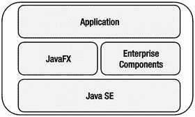
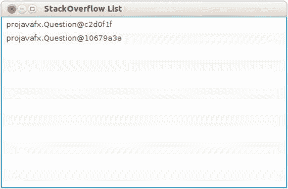
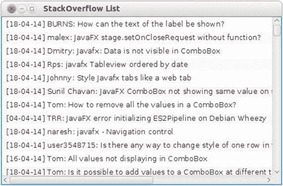
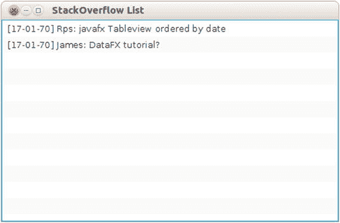
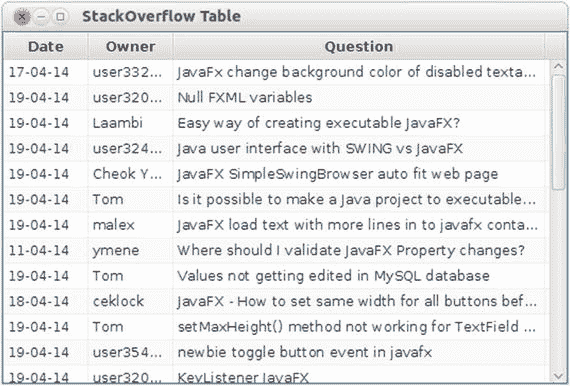

# 7.连接到企业服务

专家是在一个狭窄的领域里犯了所有可能犯的错误的人。—尼尔斯·玻尔

客户端应用程序可能非常令人兴奋，但通常它们不会生活在孤立的环境中。典型的客户端应用程序以某种方式与其他应用程序、后端组件和云环境交换数据和功能。这对客户端应用程序的开发提出了新的要求。

到目前为止，我们已经解释了如何使用 JavaFX 平台来呈现信息和交互操作数据。在本章中，我们简要概述了将 JavaFX 应用程序与企业系统集成的可用选项，然后继续介绍该过程的一些具体示例。

我们的示例旨在演示 JavaFX 应用程序如何轻松地访问 REST 资源，然后将响应(来自 JSON 或 XML 格式)转换为 JavaFX 控件可以理解的格式。作为我们的示例外部数据源，堆栈交换 API 是理想的，因为它们是公开可用的，易于理解，并且在互联网上广泛使用。

## 前端和后端平台

JavaFX 通常被认为是一个前端平台。虽然这种说法没有公平对待 JavaFX 平台中与 UI 无关的 API，但大多数 JavaFX 应用程序确实关注“内容”的丰富和交互式可视化。

Java 的一大优点是，一种语言可以在多种设备、桌面和服务器上使用。创建 JavaFX 核心的 Java 语言也是 Java 平台企业版(Java EE)的基础核心。

Java 平台是企业应用程序的头号开发平台。JavaFX 平台提供了丰富的交互式 UI，与运行在 Java 平台上的企业应用程序相结合，创造了巨大的可能性。为此，JavaFX 应用程序和 Java 企业应用程序必须交换数据。交换数据可以以多种方式发生，并且取决于需求(从前端以及从后端)；一种方式可能比另一种方式更合适。

基本上，有两种不同的方法:


图 7-2。

JavaFX application communicates with enterprise components on a remote server



图 7-1。

JavaFX and enterprise components on a single system

*   JavaFX 应用程序可以利用这样一个事实，即它运行在与典型企业应用程序相同的基础设施上，并且可以与这些企业组件深度集成。如图 [7-1](#Fig1) 所示。
*   JavaFX 应用程序运行在一个相对简单的 Java 平台上，使用 Java 企业组件已经支持的标准协议与企业服务器交换数据。如图 [7-2](#Fig2) 所示。

第一种方法已被提及并简要涉及，但本章的重点是第二种方法，即 JavaFX 客户端与远程服务器上的 Java 企业组件进行通信。

没有所谓的最佳方法，因为它实际上取决于环境和用例。一个典型的 Java 客户端应用程序运行在比今天的后端服务器和云环境功能更少的硬件上，在这种情况下，不推荐第一种方法。然而，很明显，在一些情况下，资源(CPU、集群、可伸缩性)在客户端系统上是广泛可用的，在这种情况下，这种方法肯定是可以考虑的。

这里还应该强调的是，只要使用标准的、定义良好的协议(例如 SOAP/REST)，就很有可能将 JavaFX 应用程序连接到非 Java 后端应用程序。客户机和服务器之间的分离确实允许在客户机和服务器上使用不同的编程语言。

## 在同一环境中合并 JavaFX 和 Java 企业模块

JavaFX 9 构建在 Java 平台标准版之上。因此，这个平台提供的所有功能都可以在 JavaFX 9 中使用。两个最流行的 Java 企业框架——Java 平台企业版和 Spring 框架——也构建在 Java 平台标准版之上。因此，JavaFX 应用程序可以与使用 Java Platform，Enterprise Edition 的应用程序或使用 Spring Framework 构建的应用程序生活在同一个环境中。

JavaFX 开发人员因此可以使用他或她喜欢的企业工具来创建应用程序。这样做有许多好处。企业组件提供的工具允许开发人员专注于特定的领域层，同时保护他们免受数据库资源和事务的影响。

Java 是企业环境中的一个流行平台，许多公司、组织和个人已经开发了许多企业组件和库。

Java 平台企业版是由通过 Java 社区进程(JCP)计划标准化的规范定义的。对于不同的组成部分，单独的 Java 规范请求(JSR)被归档。

这些单独的 JSR 中的大多数都是由许多公司实现的，并且这些实现通常被组合到一个产品中。典型的企业框架实现一个或多个 JSR，并且它们可能包含额外的特定于产品的功能。

在这些规范中最流行的实现中，有 Tomcat/TomEE、Hibernate、JBoss/WildFly、GlassFish、Payara、WebLogic 和 WebSphere。许多产品实现了所有的 JSR，这些产品被称为 Java 平台企业版的实现，通常被称为 Java EE 平台或应用服务器。

另一个流行的 Java 企业框架 Spring Framework 包含了 Java 平台企业版中定义的许多 JSR 的实现，并添加了更多特定的组件和 API。

从技术上讲，JavaFX 平台中没有阻止使用 Java 企业组件的限制。很有可能在客户机系统上运行 Java 企业应用服务器，或者在同一个客户机系统上执行 Spring 框架应用程序。利用 Java 企业应用服务器或 Spring 框架的应用程序也可以包含 JavaFX 代码。

然而，企业开发在许多方面不同于客户端开发:

*   企业基础设施正在向云转移。特定任务(例如，存储、邮件等。)外包给“云”中提供特定功能的组件。企业服务器通常位于云环境中，允许与云组件进行快速无缝的交互。
*   就资源需求而言，企业系统侧重于计算资源(CPU、缓存和内存)，而台式计算机和笔记本电脑侧重于视觉资源(例如，图形硬件加速)。
*   启动时间在服务器中几乎不成问题，但在许多桌面应用程序中却至关重要。此外，服务器应该是 24/7 全天候运行的，而大多数客户机并不是这样。
*   部署和生命周期管理通常特定于服务器产品或客户端产品。升级服务器或服务器软件通常是一个乏味的过程。必须尽量减少停机时间，因为客户端应用程序可能会打开与服务器的连接。部署客户端应用程序可以通过多种方式进行，例如通过独立、自包含的应用程序或 Java 网络启动协议(JNLP)。
*   企业开发使用了许多在客户端开发中有用的模式(例如，控制反转、基于容器的初始化)，但是这些模式通常需要与传统客户端不同的架构。

## 使用 JavaFX 调用远程(Web)服务

企业组件通常通过 web 资源来访问。一些规范清楚地描述了基于 web 的框架应该如何与企业组件交互以呈现信息。然而，还有其他规范允许从非 web 资源访问企业组件(用 Java 或其他语言编写)。因为那些规范允许企业开发和任何其他开发之间的解耦，所以它们已经被许多涉众定义了。

1998 年，简单对象访问协议(SOAP)由微软发明，随后被用作 Java 应用程序和。NET 应用程序。SOAP 是基于 XML 的，当前的版本 1.2 是 2003 年 W3C 推荐的。Java 提供了许多工具，允许开发人员与 SOAP 交换数据。

尽管 SOAP 功能强大且可读性相对较好，但通常被认为相当冗长。随着 mashups 和提供特定功能的简单服务的兴起，出现了一种新的架构风格:表述性状态转移(REST)。REST 允许服务器和客户端开发人员以一种松散耦合且更加简化的方式交换数据，其中协议可以是 XML、JSON、Atom 或任何其他格式。

在下一节中，我们将展示一些使用 REST APIs 在 JavaFX 客户端应用程序和服务器或云组件之间建立通信的例子。虽然这种方法将显示数据是如何传输的，但它仍然需要一些锅炉板代码。在本节之后，我们将讨论一些框架，这些框架使得与企业组件的连接对 JavaFX 开发人员来说更加透明。

### 休息

在互联网上可以找到大量关于 REST 和基于 REST 的 web 服务的资源和文档。基于 REST 的 web 服务公开了许多可以使用 HTTP 协议访问的 URIs。通常，不同的 HTTP `request`方法(get、post、put、delete)用于表示对资源的不同操作。

基于 REST 的 web 服务可以使用标准的 HTTP 技术来访问，Java 平台附带了许多 API(主要在`java.io`和`java.net`中),方便了对基于 REST 的 web 服务的访问。

JavaFX 在 Java 平台(Standard Edition 9)之上编写的主要优势之一是能够在 JavaFX 应用程序中使用所有这些 API。这就是我们在本章第一个例子中所做的。我们展示了如何使用 Java APIs 来消费基于 REST 的 web 服务，以及如何将结果集成到 JavaFX 应用程序中。

接下来，我们将展示如何利用 JavaFX APIs 来避免常见的缺陷(例如，无响应的应用程序、无动态更新等)。).最后，我们简要概述了使 JavaFX 开发人员能够轻松访问基于 REST 的 web 服务的第三方库。

#### 设置应用程序

首先，我们为样本创建框架。我们将使用 Stack Exchange 提供的 API。Stack Exchange 网络是一个论坛集群，每个论坛位于一个特定的域中，在这里，问题和答案以这样一种方式组合在一起，即来自最受信任的用户的“最佳”答案会出现在顶部。Java 开发人员可能对 Stack Overflow 很熟悉，它是 Stack Exchange 中的第一个站点，提供了大量与 IT 相关的问题和答案。

Stack Exchange 提供的 REST APIs 在 [`https://api.stackexchange.com`](https://api.stackexchange.com) 有很好的描述。我们的目标不是探索 Stack Exchange 和相应 API 提供的所有可能性，因此感兴趣的读者可以参考网站上的文档。

在本章的示例中，我们希望将问题的作者、问题的标题以及提出问题的日期可视化。

最初，我们用带有 getters 和 setters 的 Java 对象来表示一个问题。这显示在清单 [7-1](#Par42) 中。

```java
package projavafx;

public class Question {

    private String owner;
    private String question;
    private long timestamp;

    public Question () {
    }
    public Question (String o, String q, long t) {
        this.owner = o;
        this.question = q;
        this.timestamp = t;
    }

    public String getOwner() {
        return owner;
    }

    public void setOwner(String owner) {
        this.owner = owner;
    }

    public String getQuestion() {
        return question;
    }

    public void setQuestion(String question) {
        this.question = question;
    }

    public long getTimestamp() {
        return timestamp;
    }

    public void setTimestamp(long timestamp) {
        this.timestamp = timestamp;
    }

}

Listing 7-1.

Question Class

```

我们的`Question`类有两个构造函数。在下面的一个例子中需要零参数构造函数，我们稍后再回到这个例子。在其他示例中，为了方便起见，使用了带三个参数的构造函数。

在清单 [7-2](#Par45) 中，我们展示了如何显示问题。在第一个例子中，问题不是通过栈交换 API 获得的，但是它们在这个例子中是硬编码的。

```java
package projavafx;

import javafx.application.Application;
import javafx.collections.FXCollections;
import javafx.collections.ObservableList;
import javafx.scene.Scene;
import javafx.scene.control.ListView;
import javafx.scene.layout.StackPane;
import javafx.stage.Stage;

public class StackOverflowApp1 extends Application {

    public static void main(String[] args) {
        launch(args);

    }

    @Override
    public void start(Stage primaryStage) {
        ListView<Question> listView = new ListView<>();
        listView.setItems(getObservableList());
        StackPane root = new StackPane();
        root.getChildren().add(listView);

        Scene scene = new Scene(root, 500, 300);
        primaryStage.setTitle("StackOverflow List");
        primaryStage.setScene(scene);
        primaryStage.show();
    }

    ObservableList<Question> getObservableList() {
        ObservableList<Question> answer = FXCollections.observableArrayList();
        long now = System.currentTimeMillis();
        long yesterday = now - 1000 * 60 * 60 * 24;
        Question q1 = new Question("James", "How can I call a REST service?", now);
        Question q2 = new Question("Stephen", "Does JavaFX work on Android?", yesterday);
        answer.addAll(q1, q2);
        return answer;
    }

}

Listing 7-2.Framework for Rendering Questions in a 
ListView

```

如果您已经阅读了前面的章节，这段代码并没有包含任何新的内容。我们创建一个`ListView`，将其添加到一个`StackPane`，创建一个`Scene`，并渲染`Stage`。

用包含`Question` s 的`ObservableList`填充`ListView`，这个`ObservableList`是通过调用`getObservableList()`方法获得的。在下面的示例中，我们修改了这个方法，并展示了如何从堆栈交换 API 中检索`Question` s。

Note

`getObservableList`返回一个`ObservableList`。`ListView`自动观察这个`ObservableList`。因此，`ObservableList`的变化会立即呈现在`ListView`控件中。在后面的示例中，我们将利用这一功能。

运行该示例会产生如图 [7-3](#Fig3) 所示的窗口。



图 7-3。

The result of the first example

结果窗口包含一个有两个条目的`ListView`。这些条目对应于清单 [7-2](#Par45) 底部的`getObservableList()`方法中创建的两个问题。

窗口中显示的有关问题的信息不是很有用。事实上，我们告诉`ListView`它应该显示一些`Question`的实例，但是我们没有告诉它们应该如何显示。后者可以通过指定一个`CellFactory`来实现。在这一章中，我们的目标不是创建一个花哨的 UI；相反，我们希望展示如何检索数据并在 UI 中呈现这些数据。因此，我们简要地展示了开发人员如何通过使用`CellFactory`概念来改变数据的可视化。关于我们在示例中使用的 UI 控件的概述(`ListView`和`TableView`，请参考第 [6 章](6.html)。

在清单 [7-3](#Par53) 中，我们创建了一个`QuestionCell`类，它扩展了`ListCell`并定义了如何布局一个单元格。

```java
package projavafx;

import java.text.SimpleDateFormat;
import java.util.Date;
import javafx.scene.control.ListCell;

public class QuestionCell extends ListCell<Question> {

    static final SimpleDateFormat sdf = new SimpleDateFormat ("dd-MM-YY");
    @Override
    protected void updateItem(Question question, boolean empty){
        super.updateItem(question, empty);
        if (empty) {
            setText("");
        } else {
            StringBuilder sb= new StringBuilder();
            sb.append("[").append(sdf.format(new Date(question.getTimestamp()))).append("]")
                    .append(" ").append(question.getOwner()+": "+question.getQuestion());
            setText(sb.toString());
        }
    }
}

Listing 7-3.Define 
QuestionCell

```

当一个单元格项需要更新时，我们告诉它显示一些包含方括号中的时间戳的文本，后面是作者和问题的标题。接下来，`ListView`需要被告知它应该呈现`QuestionCell` s。我们通过调用`ListView.setCellFactory()`方法来做到这一点，并提供一个 lambda 表达式，该表达式在被调用时创建一个新的`QuestionCell`。在清单 [7-4](#Par55) 中，我们展示了我们的`StackOverflowApplication`的启动方法的修改版本。

```java
public void start(Stage primaryStage) {
      ListView<Question> listView = new ListView<>();
      listView.setItems(getObservableList());
      listView.setCellFactory(l -> new QuestionCell());
      StackPane root = new StackPane();
      root.getChildren().add(listView);

      Scene scene = new Scene(root, 500, 300);

      primaryStage.setTitle("StackOverflow List");
      primaryStage.setScene(scene);
      primaryStage.show();
  }

Listing 7-4.Use CellFactory on the ListView

```

如果我们现在运行应用程序，输出如图 [7-4](#Fig4) 所示。


图 7-4。

The result of adding a `QuestionCell`

对于`ListView`条目中的每个问题，现在的输出是我们所期望的。我们可以用`CellFactories`做更多的事情(例如，我们可以使用图形而不仅仅是文本)，但是这超出了本章的范围。

我们现在用通过堆栈交换 API 获得的真实信息替换硬编码的问题。

#### 使用堆栈交换 API

栈交换网( [`http://stackexchange.com`](http://stackexchange.com) )允许第三方开发者使用基于 REST 的接口浏览访问问题和答案。Stack Exchange 维护了许多基于 REST 的 API，但是在我们的例子中，我们仅限于 Stack Exchange Search API。关于此 API 的更多信息，请访问 [`http://api.stackexchange.com/docs`](http://api.stackexchange.com/docs) 。

资源 URL——REST 服务的端点——非常简单:

[T2`http://api.stackexchange.com/2.2/search`](http://api.stackexchange.com/2.2/search)

这里可以提供许多查询参数。我们将只使用两个参数，感兴趣的读者可以参考栈交换文档，了解关于其他参数的信息。

*   `site`:指定您想要搜索的域，在我们的例子中是“`stackoverflow"`。
*   `tagged`:分号分隔的标签列表。我们希望搜索所有标有`javafx"`的问题。

组合这两个参数会导致以下 REST 调用:

[T2`http://api.stackexchange.com/2.2/search?tagged=javafx&site=stackoverflow`](http://api.stackexchange.com/2.2/search%3Ftagged=javafx%26site=stackoverflow)

当在浏览器中执行这个 REST 调用，或者使用命令工具(例如 cURL)时，结果类似于清单 [7-5](#Par68) 中的 JSON-text。

```java
{
  "items": [
    {
      "tags": [
        "java",
        "sorting",
        "javafx",
        "tableview"
      ],
      "owner": {
        "reputation": 132,
        "user_id": 578518,
        "user_type": "registered",
        "accept_rate": 84,
        "profile_image": "https://www.gravatar.com/avatar/bdbee99c377a7063b24e09e7121fb1ab?s=128&d=identicon&r=PG",
        "display_name": "Rps",
        "link": "http://stackoverflow.com/users/578518/rps"
      },
      "is_answered": false,

      "view_count": 7,
      "answer_count": 1,
      "score": 0,
      "last_activity_date": 1397845222,
      "creation_date": 1397844823,
      "last_edit_date": 1397845143,
      "question_id": 23159737,
      "link": "http://stackoverflow.com/questions/23159737/javafx-tableview-ordered-by-date",
      "title": "javafx Tableview ordered by date"
    },

...
,"has_more":true
,"quota_max":300,
"quota_remaining":290
}

Listing 7-5.
JSON Response

Obtained from the Stack Exchange Search API

```

堆栈交换 API 只提供基于 JSON 的响应。许多 web 服务以 XML 的形式提供信息，还有一些同时提供 JSON 和 XML。因为我们还想展示如何处理 XML 响应，所以我们为 Stack Exchange REST 服务创建了自己的基于 XML 的输出。这个 XML 响应不是调用外部 REST 端点，而是通过读取本地文件获得的。

我们自定义的 XML 响应如清单 [7-6](#Par71) 所示。

```java
<?xml version="1.0" encoding="UTF-8"?>

<items>

  <item>

    <tags>

      <tag>java</tag>

      <tag>sorting</tag>

      <tag>javafx</tag>

      <tag>tableview</tag>

    </tags>

    <owner>Rps</owner>

    <creation_date>1397844823</creation_date>

    <title>javafx Tableview ordered by date</title>

  <item>

</items>

Listing 7-6.Artificial XML Response

Obtained from the Stack Exchange Search API

```

尽管 JSON 响应中的数据包含与 XML 响应中的数据相同的信息，但是格式当然是非常不同的。JSON 和 XML 都在互联网上广泛使用，大量 web 服务以这两种格式提供响应。

根据用例和开发人员的不同，一种格式可能比另一种格式更受青睐。一般来说，JavaFX 应用程序应该能够使用这两种格式，因为它们必须与第三方数据连接，JavaFX 开发人员不能总是影响后端使用的数据格式。

Note

许多应用程序允许多种格式，通过指定 HTTP“Accept”头，客户端可以在不同的格式之间进行选择。

在下一个例子中，我们将展示如何检索和解析栈交换搜索 API 中使用的 JSON 响应。

##### JSON 响应格式

JSON 是互联网上非常流行的格式，尤其是在用 JavaScript 解析输入数据的 web 应用程序中。JSON 数据相当紧凑，或多或少具有可读性。

Java 中有许多工具可以读写 JSON 数据。截至 2013 年 6 月，当 Java 企业版 7 发布时，Java 中有一个描述如何读写 JSON 数据的标准规范。本 Java 规范定义为 JSR 353，更多信息可在 [`www.jcp.org/en/jsr/detail?id=353`](http://www.jcp.org/en/jsr/detail?id=353) `.`获取

`JSR 353 only defines a specification, and an implementation is still needed to do the actual work. In our examples, we will use JSONP, which is the Reference Implementation of JSR 353\. This Reference Implementation can be found at` [`https://jsonp.java.net/`](https://jsonp.java.net/) 。不过，我们鼓励读者尝试他们最喜欢的 JSR 353 实现。

尽管 JSR 353 是 Java 企业版的一部分，但是参考实现也可以在 Java 标准版环境中工作。没有外部依赖性。

我们现在用通过 Stack Exchange REST API 获得的真题替换包含两个假题的硬编码列表。我们保留现有的代码，但是我们修改了清单 [7-7](#Par81) 中所示的`getObservableList()`方法。

```java
ObservableList<Question> getObservableList() throws IOException {
    String url = "http://api.stackexchange.com/2.2/search?tagged=javafx&site=stackoverflow";
    URL host = new URL(url);
    JsonReader jr = Json.createReader(new GZIPInputStream(host.openConnection().getInputStream()));

    JsonObject jsonObject = jr.readObject();
    JsonArray jsonArray = jsonObject.getJsonArray("items");
    ObservableList<Question> answer = FXCollections.observableArrayList();

    jsonArray.iterator().forEachRemaining((JsonValue e) -> {
        JsonObject obj = (JsonObject) e;
        JsonString name = obj.getJsonObject("owner").getJsonString("display_name");
        JsonString quest = obj.getJsonString("title");
        JsonNumber jsonNumber = obj.getJsonNumber("creation_date");
        Question q = new Question(name.getString(), quest.getString(), jsonNumber.longValue() * 1000);
        answer.add(q);
    });
    return answer;
}

Listing 7-7.Obtain Questions via the Stack Exchange REST API

, JSON Format, and Parse the JSON

```

在深入研究代码之前，我们在图 [7-5](#Fig5) 中展示了修改后的应用程序的结果。



图 7-5。

The result of the `StackOverflowApplication` retrieving JSON data

清单 [7-7](#Par81) 中的代码可以分为四个部分:

1.  调用 REST 端点。
2.  获取原始 JSON 数据。
3.  将每个项目转换成一个问题。
4.  将`Question`添加到结果中。

调用 REST 端点非常简单:

```java
String url = "http://api.stackexchange.com/2.2/search?tagged=javafx&site=stackoverflow";
URL host = new URL(url);
JsonReader jr = Json.createReader(new GZIPInputStream(host.openConnection().getInputStream()));

```

首先，我们创建一个指向所需位置的 URL 对象。接下来，我们打开到该位置的连接。因为 Stack Exchange 以压缩数据的形式发送数据，所以我们使用从连接中获得的`InputStream`打开一个`GZIPInputStream`。我们将这个`GZIPInputStream`作为`Json.createReader()`方法中的`InputStream`参数。

我们现在有了一个 JSON 阅读器，它使用我们想要的数据。从这个 JSON 阅读器手动提取 Java 对象需要针对特定情况的特定代码。

Note

我们也可以使用 JSON 解析器来代替 JSON 阅读器。我们并不打算提供详尽的 JSON 解析指南。我们只是试图展示如何将 JSON 数据转换成我们特定用例的 Java 对象。你可以很容易地在网上找到许多关于 JSON 的教程。

在清单 [7-5](#Par68) 中，我们观察到问题在一个名为 items 的数组中，从左边的方括号(`[`)开始。我们可以使用下面的语句获得这个 JSON 数组:

```java
JsonArray jsonArray = jsonObject.getJsonArray("items");

```

接下来，我们需要迭代所有这些元素。对于我们遇到的每个项目，我们希望创建一个`Question`实例。

遍历数组元素可以使用

```java
jsonArray.iterator().forEachRemaining((JsonValue e) -> {
    ...
}

```

为了创建一个`Question`实例，我们需要获得问题的作者姓名、标题和创建日期。Java JSON API 为此提供了一种标准的方法:

```java
JsonObject obj = (JsonObject) e;
JsonString name = obj.getJsonObject("owner").getJsonString("display_name");
JsonString quest = obj.getJsonString("title");
JsonNumber jsonNumber = obj.getJsonNumber("creation_date");

```

最后，我们需要基于这些信息创建一个`Question`实例，并将其添加到我们将返回的`ObservableList`实例中:

```java
Question q = new Question(name.getString(), quest.getString(), jsonNumber.longValue() * 1000);
answer.add(q);

```

这个例子表明，检索和读取从 REST 端点获得的 JSON 数据，并将结果转换成一个`ListView`是非常容易的。在下一节中，我们将演示 XML 响应的类似过程。

##### XML 响应格式

XML 格式在 Java 平台中被广泛使用。因此，Java 中基于 XML 的操作的标准化在几年前就开始了。Java 平台标准版内置了许多 XML 工具，我们可以在 JavaFX 中使用这些 API 和工具，而无需任何外部依赖。在本节中，我们首先使用一个 DOM 处理器来解析我们人工构建的 XML 响应。接下来，我们使用 JAXB 标准来自动获取 Java 对象。

将我们的应用程序从 JSON 输入更改为 XML 输入只需要更改`getObservableList`方法。新的实现如清单 [7-8](#Par105) 所示。

```java
ObservableList<Question> getObservableList() throws IOException, ParserConfigurationException, SAXException {
        ObservableList<Question> answer = FXCollections.observableArrayList();
        InputStream inputStream = this.getClass().getResourceAsStream("/stackoverflow.xml");
        DocumentBuilderFactory dbf = DocumentBuilderFactory.newInstance();
        DocumentBuilder db = dbf.newDocumentBuilder();
        Document doc = db.parse(inputStream);
        NodeList questionNodes = doc.getElementsByTagName("item");
        int count = questionNodes.getLength();
        for (int i = 0; i < count; i++) {
            Question question = new Question();
            Element questionNode = (Element) questionNodes.item(i);

            NodeList childNodes = questionNode.getChildNodes();
            int cnt2 = childNodes.getLength();
            for (int j = 0; j < cnt2; j++) {
                Node me = childNodes.item(j);
                String nodeName = me.getNodeName();
                if ("creation_date".equals(nodeName)) {
                    question.setTimestamp(Long.parseLong(me.getTextContent()));
                }
                if ("owner".equals(nodeName)) {
                    question.setOwner(me.getTextContent());
                }
                if ("title".equals(nodeName)) {
                    question.setQuestion(me.getTextContent());
                }
            }
            answer.add(question);
        }
        return answer;

    }

Listing 7-8.Obtaining Questions from the XML-Based Response

```

同样，本节的目标不是给出 DOM APIs 的全面概述。互联网上有大量的资源提供关于 XML 的信息，特别是关于 DOM 的信息。

为了能够编译清单 [7-8](#Par105) 中的代码，必须添加以下导入语句。

```java
import javax.xml.parsers.DocumentBuilder;
import javax.xml.parsers.DocumentBuilderFactory;
import javax.xml.parsers.ParserConfigurationException;
import org.w3c.dom.Document;
import org.w3c.dom.Node;
import org.w3c.dom.NodeList;
import org.xml.sax.SAXException;

```

在我们详细讨论代码之前，我们在图 [7-6](#Fig6) 中展示了这个例子的输出。



图 7-6。

The result of the question application using XML response

清单 [7-8](#Par105) 中的代码与清单 [7-7](#Par81) 中的代码有一些相似之处。在这两种情况下，我们处理文本格式(JSON 或 XML)的可用数据，并将数据转换成问题实例。在清单 [7-8](#Par105) 中，DOM 方法用于检查收到的响应。

使用下面的代码获得了一个`org.w3c.dom.Document`实例。

```java
InputStream inputStream = this.getClass().getResourceAsStream("/stackoverflow.xml");
DocumentBuilderFactory dbf = DocumentBuilderFactory.newInstance();
DocumentBuilder db = dbf.newDocumentBuilder();
Document doc = db.parse(inputStream);

```

在这种情况下，我们基于一个`InputStream`创建一个`Document`。`InputStream`是从人为创建的文件中获得的。我们还可以从一个`URLConnection`创建一个`InputStream`，并将这个`InputStream`传递给`db.parse()`方法。更简单的是，`DocumentBuilder.parse`方法还接受一个包含 REST 端点 URL 的`String`参数。

这表明，尽管我们在这种情况下使用的是包含问题的静态文件，但在使用真正的 REST 端点时，我们可以轻松地使用相同的代码。

现在可以查询结果`Document`。从清单 [7-6](#Par71) 中显示的 XML 响应中，我们了解到各个问题都包含在名为“item”的 XML 元素中。我们使用下面的代码来获取这些 XML 元素的列表。

```java
NodeList questionNodes = doc.getElementsByTagName("item");

```

然后我们遍历这个列表，通过检查各个 XML 元素中的`childNodes`来获得特定于问题的字段。最后，我们将产生的问题添加到名为 answer 的`Question`对象的`ObservableList`中。

这种方法相当简单，但是我们仍然需要做一些手工的 XML 解析。尽管这考虑到了灵活性，但是随着数据结构复杂性的增加，解析变得更加困难和容易出错。

幸运的是，Java 标准版 API 包含将 XML 直接转换成 Java 对象的工具。这些 API 的规范由 JAXB 标准定义，可以在`javax.xml.bind`包中获得。将 XML 数据转换成 Java 对象的过程称为解组。

我们现在修改我们的示例，并混合使用 DOM 解析和 JAXB 解组。同样，我们只改变了`getObservableList()`方法。修改后的实现如清单 [7-9](#Par121) 所示。

```java
ObservableList<Question> getObservableList() throws IOException, ParserConfigurationException, SAXException {
    ObservableList<Question> answer = FXCollections.observableArrayList();
     InputStream inputStream = this.getClass().getResourceAsStream("/stackoverflow.xml");
    DocumentBuilderFactory dbf = DocumentBuilderFactory.newInstance();
    DocumentBuilder db = dbf.newDocumentBuilder();
    Document doc = db.parse(inputStream);
    NodeList questionNodes = doc.getElementsByTagName("item");
    int count = questionNodes.getLength();
    for (int i = 0; i < count; i++) {
        Element questionNode = (Element) questionNodes.item(i);
        DOMSource source = new DOMSource(questionNode);
        final Question question = (Question) JAXB.unmarshal(source, Question.class);

        answer.add(question);
    }
    return answer;

}

Listing 7-9.Combining XML Parsing and JAXB

```

这种方法与清单 [7-8](#Par105) 中使用的方法的唯一区别是对单个问题的解析。我们使用 JAXB 中的 unmarshal 方法，而不是使用 DOM 解析来获取各个问题的特定字段。JAXB 规范允许大量的灵活性和配置，而`JAXB.unmarshal`方法只是一种方便的方法。但是，在很多情况下，这种方法就足够了。`JAXB.unmarshal`方法有两个参数:输入源和作为转换结果的类。

我们希望将 XML 源转换成我们的`Question`类的实例，但是 JAXB 框架如何知道如何映射字段呢？在许多情况下，映射很简单，不需要修改现有的代码，但是在其他情况下，映射稍微复杂一些。很好，有一个完整的带注释的包，我们可以用它来帮助 JAXB 确定 XML 和 Java 对象之间的转换。

为了让清单 [7-9](#Par121) 中的代码工作，我们对`Question`类做了一些小的修改。清单 [7-10](#Par125) 显示了`Question`类的新代码。

```java
package projavafx;

import javax.xml.bind.annotation.XmlAccessType;
import javax.xml.bind.annotation.XmlAccessorType;
import javax.xml.bind.annotation.XmlElement;

@XmlAccessorType(XmlAccessType.FIELD)
public class Question {

    private String owner;
    @XmlElement(name = "title")
    private String question;
    @XmlElement(name = "creation_date")
    private long timestamp;

    public Question(String o, String q, long t) {
        this.owner = o;
        this.question = q;
        this.timestamp = t;
    }

    public Question() {
    }

    /**
     * @return the owner
     */
    public String getOwner() {
        return owner;
    }

    /**
     * @param owner the owner to set
     */
    public void setOwner(String owner) {
        this.owner = owner;
    }

    /**
     * @return the question
     */
    public String getQuestion() {
        return question;
    }

    /**
     * @param question the question to set
     */
    public void setQuestion(String question) {
        this.question = question;
    }

    /**
     * @return the timestamp
     */
    public long getTimestamp() {
        return timestamp;
    }

    /**
     * @param timestamp the timestamp to set
     */
    public void setTimestamp(long timestamp) {
        this.timestamp = timestamp;
    }

}

Listing 7-10.
Question Class with JAXB Annotations

```

我们向原始的`Question`类添加了三个注释。首先，我们用

```java
@XmlAccessorType(XmlAccessType.FIELD)

```

这个注释告诉 JAXB 框架将 XML 数据映射到这个类的字段上，而不是映射到这个类的`JavaBean`属性(getter/setter 方法)上。第二个和第三个注释被添加到`question`字段和`timeStamp`字段:

```java
@XmlElement(name = "title")
private String question;
@XmlElement(name = "creation_date")
private long timestamp;

```

这表明`question`字段对应于名为“title”的 XML 元素，时间戳字段对应于名为`"creation_date"`的 XML 元素。事实上，如果我们查看清单 [7-6](#Par71) ，它显示问题在名为“标题”的元素中，时间戳在名为“`creation_date"`的元素中。我们必须指示 JAXB 运行时用我们的时间戳字段映射这个元素，这就是我们对`@XmlElement`注释所做的。

使用 JAXB 注释可以很容易地将 XML 问题元素转换成单独的`Question`实例，但是在我们的主类中仍然有一些手工的 XML 处理。但是，我们可以完全去掉手动的`XMLParsing`，将整个 XML 响应转换成一个 Java 对象。这样做，`getObservableList()`方法变得非常简单，如清单 [7-11](#Par132) 所示。

```java
ObservableList<Question> getObservableList() {
    InputStream inputStream = this.getClass().getResourceAsStream("/stackoverflow.xml");
    QuestionResponse response = JAXB.unmarshal(inputStream, QuestionResponse.class);
    return FXCollections.observableArrayList(response.getItem());
}
Listing 7-11.Parsing Incoming XML Data Using JAXB

```

在这个例子中，我们使用 JAXB 将 XML 响应转换成一个`QuestionResponse`实例，然后通过这个`QuestionResponse`实例获得问题。注意，按照方法签名的要求，我们将问题从常规的`List`对象转换为`ObservableList`对象。稍后，我们将展示一个无需进行额外转换的示例。

`QuestionResponse`类有两个目标:将 XML 响应映射到 Java 对象上，并使问题项作为`Question`实例的`List`可用。这是通过清单 [7-12](#Par135) 中的代码实现的。

```java
package projavafx;

import java.util.List;
import javax.xml.bind.annotation.XmlAccessType;
import javax.xml.bind.annotation.XmlAccessorType;
import javax.xml.bind.annotation.XmlRootElement;

@XmlRootElement(name="items")
@XmlAccessorType(XmlAccessType.FIELD)
public class QuestionResponse {

    private List<Question> questions;

    public List<Question> getQuestions() {
        return questions;
    }

    public void setQuestions(List<Question> questions) {
        this.questions = questions;
    }
}

Listing 7-12.

QuestionResponse Class

, Enabling Conversion Between XML Response and Java Objects

```

`QuestionResponse`类本身有两个注释。我们已经讨论了以下内容:

```java
@XmlAccessorType(XmlAccessType.FIELD)

```

这个注释表明这个类对应于 XML 结构中的一个名为`"items"`的根对象。

```java
@XmlRootElement(name="items")

```

这确实对应于我们在清单 [7-6](#Par71) 中创建的 XML 响应的语法。

前面的示例展示了如何使用 Java 2 平台标准版中的现有技术从 web 服务获取数据，并将这些数据注入 JavaFX 控件中。我们现在修改示例代码，以利用 JavaFX 平台的一些特定特性。

##### 异步处理

到目前为止，示例的一个主要问题是它们在数据检索和解析过程中阻塞了 UI。在许多现实情况下，这是不可接受的。由于网络或服务器问题，对外部 web 服务的调用可能会比预期时间长。即使外部调用很快，暂时没有响应的 UI 也会降低应用程序的整体质量。

幸运的是，JavaFX 平台允许并发和异步任务。任务、工人和服务的概念在第 7 章中讨论过。在这一节中，我们将展示如何在访问 web 服务时利用`javafx.concurrent`包。我们还利用了这样一个事实，即`ListView`监视包含其项目的`ObservableList`。

基本思想是，当创建`ListView`时，我们立即返回一个空的`ObservableList`，同时在后台线程中检索数据。一旦我们检索并解析了数据，我们将它添加到`ObservableList`，结果将立即在`ListView`中可见。

清单 [7-13](#Par146) 显示了这个例子的主类。我们从清单 [7-7](#Par81) 中的代码开始，在那里我们使用一个对栈交换 API 的 REST 请求获得了 JSON 格式的问题。不过，经过一些小的修改，我们也可以使用 XML 响应。

```java
package projavafx;

import java.io.IOException;
import javafx.application.Application;
import static javafx.application.Application.launch;
import javafx.beans.InvalidationListener;
import javafx.beans.Observable;
import javafx.collections.FXCollections;
import javafx.collections.ObservableList;
import javafx.concurrent.Service;
import javafx.concurrent.Worker;
import javafx.scene.Scene;
import javafx.scene.control.ListView;
import javafx.scene.layout.StackPane;
import javafx.stage.Stage;

public class StackOverflow4 extends Application {

    @Override
    public void start(Stage primaryStage) throws IOException {
        ListView<Question> listView = new ListView<>();
        listView.setItems(getObservableList());
        listView.setCellFactory(l -> new QuestionCell());
        StackPane root = new StackPane();
        root.getChildren().add(listView);

        Scene scene = new Scene(root, 500, 300);

        primaryStage.setTitle("StackOverflow List");
        primaryStage.setScene(scene);
        primaryStage.show();
        System.out.println (« Done with the setup ») ;
    }

    ObservableList<Question> getObservableList() throws IOException {
        String url = "http://api.stackexchange.com/2.2/search?order=desc&sort=activity&tagged=javafx&site=stackoverflow";
        Service<ObservableList<Question>> service = new QuestionRetrievalService(url);

        ObservableList<Question> answer = FXCollections.observableArrayList();
        service.stateProperty().addListener(new InvalidationListener() {

            @Override
            public void invalidated(Observable observable) {
                System.out.println("value is now "+service.getState());
                if (service.getState().equals(Worker.State.SUCCEEDED)) {
                    answer.addAll(service.getValue());
                }
            }
        });
        System.out.println("START SERVICE = "+service.getTitle());
        service.start();
        return answer;
    }

    /**
     * @param args the command line arguments
     */
    public static void main(String[] args) {
        launch(args);
    }
}

Listing 7-13.Use a Background Thread for Retrieving Question 
ListView

```

main 方法与前面的例子没有什么不同，除了添加了一个`System.out`日志消息，它将在我们完成设置时打印一条消息。

`getObservableList`方法将首先创建一个`ObservableList`的实例，该实例在方法完成时返回。最初，这个实例将是一个空列表。在这个方法中，创建了一个`QuestionRetrievalService`的实例，并在构造函数中传递了 REST 端点的位置。扩展了`javafx.concurrent.Service`的`QuestionRetrievalService`被启动，我们监听服务的`State`的变化。当服务的状态变为`State.SUCCEEDED`时，我们将检索到的问题添加到`ObservableList`中。请注意，在`QuestionRetrievalService`实例的每个状态变化时，我们都会向`System.out`记录一条消息。

我们现在仔细看看`QuestionRetrievalService`以理解它如何启动一个新线程，以及它如何确保使用 JavaFX 线程将检索到的问题添加到`ListView`控件中。`QuestionRetrievalService`的代码如清单 [7-14](#Par150) 所示。

```java
package projavafx;

import java.net.URL;
import java.util.zip.GZIPInputStream;
import javafx.collections.FXCollections;
import javafx.collections.ObservableList;
import javafx.concurrent.Service;
import javafx.concurrent.Task;
import javax.json.Json;
import javax.json.JsonArray;
import javax.json.JsonNumber;
import javax.json.JsonObject;
import javax.json.JsonReader;
import javax.json.JsonString;
import javax.json.JsonValue;

public class QuestionRetrievalService extends Service<ObservableList<Question>> {

    private String loc;

    public QuestionRetrievalService(String loc) {
        this.loc = loc;
    }

    @Override
    protected Task<ObservableList<Question>> createTask() {
        return new Task<ObservableList<Question>>() {

            @Override
            protected ObservableList<Question> call() throws Exception {
                URL host = new URL(loc);
                JsonReader jr = Json.createReader(new GZIPInputStream(host.openConnection().getInputStream()));

                JsonObject jsonObject = jr.readObject();
                JsonArray jsonArray = jsonObject.getJsonArray("items");
                ObservableList<Question> answer = FXCollections.observableArrayList();

                jsonArray.iterator().forEachRemaining((JsonValue e) -> {
                    JsonObject obj = (JsonObject) e;
                    JsonString name = obj.getJsonObject("owner").getJsonString("display_name");
                    JsonString quest = obj.getJsonString("title");
                    JsonNumber jsonNumber = obj.getJsonNumber("creation_date");
                    Question q = new Question(name.getString(), quest.getString(), jsonNumber.longValue() * 1000);
                    System.out.println("Adding question "+q);
                    answer.add(q);
                });
                return answer;
            }
        };
    }

}

Listing 7-14.

QuestionRetrievalService

```

`QuestionRetrievalService`扩展了`Service`，因此必须实现一个`createTask`方法。当`Service`启动时，该任务在一个单独的线程中执行。`QuestionRetrievalService`上的`createTask`方法创建一个新的`Task`并返回它。这种方法的特征，

```java
Task<ObservableList<Question>> createTask(),

```

确保`Task`创建一个`ObservableList`问题。泛型类型参数`ObservableList<Question>`与`Service`声明中的类型参数相同。因此，`Service`的`getValue()`方法也将返回`Question` s 的`ObservableList`

事实上，下面的代码片段说明了`questionRetrievalService.getValue()`应该返回一个`ObservableList<Question>`。

```java
ObservableList<Question> answer = FXCollections.observableArrayList();
...
    if (now == State.SUCCEEDED) {
        answer.addAll(service.getValue());
    }

```

我们在`QuestionRetrievalService`中创建的`Task`实例必须实现 call 方法。这个方法实际上在做前面例子中的`getObservableList`方法正在做的事情:检索数据并解析它们。

虽然`Service`(由`createTask`创建的`Task`)中的实际工作是在后台线程中完成的，但是`Service`上的所有方法，包括`getValue()`调用，都应该从 JavaFX 线程中访问。内部实现确保对`Service`中可用属性的所有更改都在 JavaFX 应用程序线程上执行。

运行该示例会给出与运行上一个示例完全相同的视觉输出。然而，为了清楚起见，我们添加了一些`System.out`消息。如果我们运行该示例，可以在控制台上看到以下消息。

```java
State of service is READY
State of service is SCHEDULED
Done with the setup
State of service is RUNNING
Adding question projavafx.Question@482fb3d5
...
Adding question projavafx.Question@2d622bf7
State of service is SUCCEEDED

```

这表明`getObservableList`方法在问题被获取并添加到列表之前返回。

Note

理论上，您可能会注意到一种不同的行为，因为后台线程可能会在其他初始化完成之前完成。然而，在实践中，当涉及网络调用时，这种行为是不太可能的。

##### 将 Web 服务数据转换为`TableView`

到目前为止，我们所有的例子都显示了 a `ListView`中的问题。`ListView`是一个简单而强大的 JavaFX 控件，然而，在某些情况下还有其他控件更适合呈现信息。

我们也可以在一个`TableView`中显示`Question`数据，这就是我们在本节中所做的。数据的检索和解析与上一个示例中的一样。然而，我们现在使用一个`TableView`来呈现数据，并且我们必须定义我们想要看到的列。对于每一列，我们必须指定数据的来源。清单 [7-15](#Par164) 中的代码显示了示例中使用的启动方法。

```java
@Override
public void start(Stage primaryStage) throws IOException {
    TableView<Question> tableView = new TableView<>();
    tableView.setItems(getObservableList());
    TableColumn<Question, String> dateColumn = new TableColumn<>("Date");
    TableColumn<Question, String> ownerColumn = new TableColumn<>("Owner");
    TableColumn<Question, String> questionColumn = new TableColumn<>("Question");
    dateColumn.setCellValueFactory((CellDataFeatures<Question, String> cdf) -> {
        Question q = cdf.getValue();
        return new SimpleStringProperty(getTimeStampString(q.getTimestamp()));
    });
    ownerColumn.setCellValueFactory((CellDataFeatures<Question, String> cdf) -> {
        Question q = cdf.getValue();
        return new SimpleStringProperty(q.getOwner());
    });
    questionColumn.setCellValueFactory((CellDataFeatures<Question, String> cdf) -> {
        Question q = cdf.getValue();
        return new SimpleStringProperty(q.getQuestion());
    });
    questionColumn.setPrefWidth(350);
    tableView.getColumns().addAll(dateColumn, ownerColumn, questionColumn);
    StackPane root = new StackPane();
    root.getChildren().add(tableView);

    Scene scene = new Scene(root, 500, 300);

    primaryStage.setTitle("StackOverflow Table");
    primaryStage.setScene(scene);
    primaryStage.show();
}

Listing 7-15.The Start Method

in the Application Rendering Questions in a 
TableView

```

显然，这个例子比显示`ListView`的例子需要更多的代码。设置一个表稍微复杂一些，因为涉及到不同的列。设置`ListView`的内容和设置`TableView`的内容没有太大区别。这是通过做来实现的

```java
tableView.setItems(getObservableList());

```

其中的`getObservableList()`方法与上一个例子中的实现相同。注意，我们也可以使用方便的构造函数

```java
TableView<Question> tableView = new TableView<>(getObservableList());

```

当使用一个`TableView`时，我们必须定义若干个`TableColumns`。这是在下面的代码片段中完成的。

```java
TableColumn<Question, String> dateColumn = new TableColumn<>("Date");
TableColumn<Question, String> ownerColumn = new TableColumn<>("Owner");
TableColumn<Question, String> questionColumn = new TableColumn<>("Question");

```

使用`TableColumn`构造函数，我们创建一个标题为“Date”的`TableColumn`，一个标题为“Owner”，第三个标题为“Question”`Generics <Question, String>`表示一行中的每个条目代表一个`Question`，指定列中的单个单元格属于`String`类型。

接下来，我们创建的`TableColumn`的实例需要知道它们应该呈现什么数据。这是使用`CellFactories`完成的，如下面的代码片段所示。

```java
dateColumn.setCellValueFactory((CellDataFeatures<Question, String> cdf) -> {
    Question q = cdf.getValue();
    return new SimpleStringProperty(getTimeStampString(q.getTimestamp()));
});

```

对`setCellValueFactory`方法的详细描述超出了本章的范围。我们鼓励读者在处理表格的时候看看`TableView`和`TableColumn`类的 Javadoc。Javadoc 解释说，我们必须用 call 方法指定一个`Callback`类，该方法返回一个包含特定单元格内容的`ObservableValue`。幸运的是，我们可以为此使用 lambda 表达式。

我们在这一行中显示的问题可以通过在这个 lambda 表达式中作为单个参数传递的`CellDataFeatures`实例获得。因为我们想要显示时间戳，所以我们返回一个`SimpleStringProperty`，它的内容被设置为指定的`Question`的时间戳。

同样的技术必须用于另一个`TableColumns`(包含所有者和适用的`Question`对象中包含的问题)。

最后，我们必须将列添加到`TableView`:

```java
tableView.getColumns().addAll(dateColumn, ownerColumn, questionColumn);

```

运行此示例会产生如图 [7-7](#Fig7) 所示的可视化输出。



图 7-7。

Using a `TableView` for rendering questions

对于一个简单的表，这个示例需要大量的样板代码，但幸运的是，JavaFX 平台包含了一种减少代码量的方法。为每一列手动设置`CellValueFactory`实例很麻烦，但是我们可以使用另一种方法来完成，通过使用 JavaFX 属性。清单 [7-16](#Par181) 包含了主类的 start 方法的修改版本，其中我们利用了 JavaFX 属性的概念。

```java
@Override
public void start(Stage primaryStage) throws IOException {
    TableView<Question> tableView = new TableView<>();
    tableView.setItems(getObservableList());
    TableColumn<Question, String> dateColumn = new TableColumn<>("Date");
    TableColumn<Question, String> ownerColumn = new TableColumn<>("Owner");
    TableColumn<Question, String> questionColumn = new TableColumn<>("Question");
    dateColumn.setCellValueFactory(new PropertyValueFactory<>("timestampString"));
    ownerColumn.setCellValueFactory(new PropertyValueFactory<>("owner"));
    questionColumn.setCellValueFactory(new PropertyValueFactory<>("question"));
    questionColumn.setPrefWidth(350);
    tableView.getColumns().addAll(dateColumn, ownerColumn, questionColumn);
    StackPane root = new StackPane();
    root.getChildren().add(tableView);

    Scene scene = new Scene(root, 500, 300);

    primaryStage.setTitle("StackOverflow Table");
    primaryStage.setScene(scene);
    primaryStage.show();
}

Listing 7-16.Rendering Data in Columns Based on JavaFX Properties

```

这段代码显然比前一个示例中的代码要短。我们实际上替换了

```java
dateColumn.setCellValueFactory((CellDataFeatures<Question, String> cdf) -> {
    Question q = cdf.getValue();
    return new SimpleStringProperty(getTimeStampString(q.getTimestamp()));
});

```

经过

```java
dateColumn.setCellValueFactory(new PropertyValueFactory<>("timestampString"));

```

这同样适用于`ownerColumn`和`questionColumn`。

我们使用`javafx.scene.control.cell.PropertyValueFactory<S,T>(String name)`的实例来定义哪些特定数据应该呈现在哪个单元格中。

`PropertyValueFactory`搜索具有指定名称的 JavaFX 属性，并在被调用时返回该属性的`ObservableValue`。如果找不到具有这样名称的属性，Javadoc 会这样说:

> In this example, the "firstName" string is used as a reference to the firstNameProperty () method assumed in the `Person` class type (the class type of TableView items list). In addition, the method must return a `Property` instance. If you find a way to meet these requirements, then fill `TableCell` with this observable value. In addition, TableView will automatically add an observer to the return value, so that TableView will observe any triggered changes, which will cause the cell to be updated immediately. If there is no method matching this pattern, there is failure support for trying to call the get < attribute > () or the is < attribute > () (that is, `getFirstName()` or `isFirstName()` in the previous example). If there is a method that matches the pattern, the value returned from this method is wrapped in a `ReadOnlyObjectWrapper` and returned to TableCell. However, in this case, this means that TableCell will not be able to observe the change of ObservableValue (this is the case with the first method).

由此可见，JavaFX 属性是在`TableView`中呈现信息的首选方式。到目前为止，我们使用带有 JavaBean getter 和 setter 方法的 POJO `Question`类作为显示在`ListView`和`TableView`中的值对象。

尽管前面的例子在不使用 JavaFX 属性的情况下也能工作，如 Javadoc 所述，我们现在修改`Question`类，使用 JavaFX 属性来表示所有者信息。`timeStamp`和文本字段也可以修改为使用 JavaFX 属性，但是混合示例表明 Javadoc 中描述的失败场景确实有效。修改后的`Question`级如清单 [7-17](#Par193) 所示。

```java
package projavafx;

import java.text.SimpleDateFormat;
import java.util.Date;
import javafx.beans.property.SimpleStringProperty;
import javafx.beans.property.StringProperty;
import javax.xml.bind.annotation.XmlAccessType;
import javax.xml.bind.annotation.XmlAccessorType;

@XmlAccessorType(XmlAccessType.PROPERTY)
public class Question {

    static final SimpleDateFormat sdf = new SimpleDateFormat ("dd-MM-YY");

    private StringProperty ownerProperty = new SimpleStringProperty();
    private String question;
    private long timestamp;

    public Question (String o, String q, long t) {
        this.ownerProperty.set(o);
        this.question = q;
        this.timestamp = t;
    }

    public String getOwner() {
        return ownerProperty.get();
    }

    public void setOwner(String owner) {
        this.ownerProperty.set(owner);
    }

    public String getQuestion() {
        return question;
    }

    public void setQuestion(String question) {
        this.question = question;
    }

    public long getTimestamp() {
        return timestamp;
    }

    public void setTimestamp(long timestamp) {
        this.timestamp = timestamp;
    }

    public String getTimestampString() {
        return sdf.format(new Date(timestamp));
    }

}

Listing 7-17.Implementation of Question Class Using JavaFX Properties

for the Author Field

```

关于这个实现，有一些事情需要注意。`ownerProperty`遵循标准的 JavaFX 约定，如第 [3 章](3.html)所述。

除了引入 JavaFX 属性之外，`Question`类的实现还有另一个重大变化。该类现在用

```java
@XmlAccessorType(XmlAccessType.PROPERTY)

```

这样做的原因是，在这样做的时候，setter 方法将被`JAXB.unmarshal`方法调用，当它用一些特定的信息创建一个`Question`的实例时。既然我们正在使用 JavaFX 属性而不是基本类型，这是必需的。JAXB 框架可以很容易地将 XML 元素“owner”的值赋给 owner `String`字段，但是默认情况下它不能将值赋给 JavaFX `Property`对象。

通过使用`XmlAccessType.PROPERTY`，JAXB 框架将调用`setOwner(String v)`方法，向`setOwner`方法提供 XML 元素的值。此方法的实现

```java
ownerProperty.set(owner);

```

然后将更新随后被`TableColumn`和`TableView`使用的 JavaFX 属性。

`Question`实现中的另一个重要变化是我们添加了一个方法

```java
String getTimestampString()

```

该方法将以人类可读的格式返回时间戳。您可能已经注意到，在清单 [7-16](#Par181) 中，我们将`dateColumn`的`CellValueFactory`设置为指向`"timestampString"`而不是`"timeStamp"`的`PropertyValueFactory`:

```java
dateColumn.setCellValueFactory(new PropertyValueFactory<>("timestampString"));

```

这样做的原因是`getTimestamp()`方法返回一个 long 类型，而我们更喜欢以一种可读性更好的格式来显示时间戳。通过添加一个`getTimestampString()`方法并将`CellValueFactory`指向该方法，该列中单元格的内容将成为可读的时间指示。

到目前为止，我们在本章中展示的例子表明，Java 平台标准版已经包含了许多在访问 web 服务时非常有用的 API。我们还展示了如何使用 JavaFX 并发框架、`ObservableList`模式、JavaFX 属性和`PropertyValueFactory`类来增强调用 web 服务和在 JavaFX 控件中呈现数据之间的流程。

虽然示例中没有涉及火箭科学，但是额外的需求会使事情变得更加复杂，并且需要更多的样板代码。幸运的是，JavaFX 社区中已经出现了许多倡议，目标是让我们的生活变得更容易。

### 使用外部库

到目前为止，我们所有的例子都不需要任何额外的外部库。Java Platform，Standard Edition 和 JavaFX platform 提供了一个很好的环境，可以用来访问 web 服务。在本节中，我们使用两个外部库，并展示它们如何使访问 web 服务变得更容易。

#### 胶子连接

本书之前的版本提到 DataFX 是一个外部库，它提供了一个 JavaFX API 来连接移除端点。DataFX 数据服务的开发已经并入了 Gluon Connect 的开发。

Gluon Connect 是一个开源的、BSD 许可的框架，由 Gluon 管理。胶子连接产品在 [`http://gluonhq.com/products/mobile/connect`](http://gluonhq.com/products/mobile/connect) 描述，代码在 Bitbucket ( [`https://bitucket.org/gluon-oss/gluon-connect`](https://bitucket.org/gluon-oss/gluon-connect) )提供。

根据 Bitbucket 的说法:“Gluon Connect 是一个客户端库，它简化了将任何来源和格式的数据绑定到 JavaFX UI 控件的过程。它的工作原理是从数据源中检索数据，并将数据从特定格式转换成 JavaFX 可观察列表和可观察对象，这些列表和对象可以直接在 JavaFX UI 控件中使用。它旨在允许开发人员轻松添加对自定义数据源和数据格式的支持。”

Gluon Connect 的一个主要优势是它也支持移动平台。我们将在下一章讨论移动设备上的 JavaFX。

在下一个例子中，我们将 Gluon Connect 与我们的栈交换例子集成在一起。同样，唯一的变化是在`getObservableList`方法中，但是为了清楚起见，我们在清单 [7-18](#Par214) 中显示了整个主类。

```java
import java.io.IOException;
import javafx.application.Application;
import static javafx.application.Application.launch;
import javafx.collections.ObservableList;
import javafx.concurrent.Worker;
import javafx.scene.Scene;
import javafx.scene.control.ListView;
import javafx.scene.layout.StackPane;
import javafx.stage.Stage;
import org.datafx.provider.ListDataProvider;
import org.datafx.provider.ListDataProviderBuilder;
import org.datafx.io.RestSource;
import org.datafx.io.RestSourceBuilder;
import org.datafx.io.converter.InputStreamConverter;
import org.datafx.io.converter.JsonConverter;

public class StackOverflowGluonConnect extends Application {

    @Override
    public void start(Stage primaryStage) throws IOException {
        ListView<Question> listView = new ListView<>();
        listView.setItems(getObservableList());
        listView.setCellFactory(l -> new QuestionCell());
        StackPane root = new StackPane();
        root.getChildren().add(listView);

        Scene scene = new Scene(root, 500, 300);

        primaryStage.setTitle("StackOverflow List");
        primaryStage.setScene(scene);
        primaryStage.show();
        System.out.println ("Done with the setup");
    }

    ObservableList<Question> getObservableList() throws IOException {
        InputStreamConverter converter = new JsonConverter("item", Question.class);

        RestSource restSource = RestSourceBuilder.create()
                .converter(converter)
                .host("http://api.stackexchange.com")
                .path("2.2").path("search")
                .queryParam("order", "desc")
                .queryParam("sort", "activity")
                .queryParam("tagged", "javafx")
                .queryParam("site", "stackoverflow").build();
        ListDataProvider<Question> ldp = ListDataProviderBuilder.create()
                .dataReader(restSource)
                .build();
        Worker<ObservableList<Question>> retrieve = ldp.retrieve();
        return retrieve.getValue();
    }

public static void main(String[] args) {
        launch(args);
    }
}

Listing 7-18.Obtaining Questions Using Gluon Connect

```

相关的部分，`getObservableList`方法的实现非常简单。

我们首先使用构建器模式创建一个`RestClient`。我们通过添加请求方法、主机名和路径来提供关于 REST 端点的信息。通过为查询中需要使用的每个查询参数调用`queryParam()`方法来提供查询参数。

接下来，我们调用 DataProvider 上的一个便利方法，并要求它检索属于我们刚刚创建的 RestClient 的列表。我们为列表中的不同实体提供目标类。这样，DataProvider 将尝试将传入的数据映射到我们指定的目标。Gluon Connect 将识别 JSON 和 XML 格式的数据，并且可以处理压缩的输入流。

后者在堆栈溢出示例中是必需的，因为堆栈溢出端点以压缩格式返回其数据。手动检查数据是否被压缩需要大量样板代码。

调用`DataProvider.retrieveList`的结果是`GluonObservableList`的一个实例，一个扩展标准 JavaFX `ObservableList`的类。`GluonObservableList`为`ObservableList`增加了一些属性，使其更适合远程数据检索的特定领域。例如，有一个状态属性可以具有下列值之一:

*   准备好的
*   运转
*   不成功的
*   成功
*   离开的

如果数据检索失败，state 属性将设置为 FAILED。另一个属性 exception 属性将包含包装的异常，该异常指示数据检索失败的原因。

调用`DataProvider.retrieveList`方法启动一个异步服务。我们可以立即将结果对象返回给我们的可视控件，而不是等待结果。Gluon Connect 框架将在读取和解析输入数据的同时更新结果对象。对于大块数据，这非常有用，因为这种方法允许开发人员在其他部分仍在输入或仍在处理时呈现部分数据。

Gluon Connect 是一个开源框架，在业务友好的 BSD 许可下获得许可，因此您可以在开源和专有(商业)软件中自由使用它。它已经包含了许多增强功能，删除了样板代码，使它更适合客户端到服务器的通信。

使用 Gluon Connect，您可以轻松地从各种来源检索数据，包括文件和 REST 端点。

胶子也为此提供了商业扩展。位于 [`https://gluonhq.com/products/cloudlink`](https://gluonhq.com/products/cloudlink) 的 Gluon CloudLink 允许开发人员在 JavaFX 客户端应用程序和许多云提供商和后端服务之间同步数据和功能。Gluon CloudLink 中的数据服务组件允许内容的实时双向同步。这样，Java 企业开发人员可以在一些后端代码中修改 Java 类，结果将立即在 JavaFX 客户端的 UI 组件中可见。

Gluon Connect 包含对 Gluon CloudLink 的支持，在数据来自 Gluon CloudLink 的情况下，您在前面的示例中使用的 API 可以重用。

#### JAX-RS 啊

Java 企业版 7 的发布包括 JAX-RS 2.0 的发布。该规范不仅定义了 Java 开发人员如何提供 REST 端点，还定义了 Java 代码如何消费 REST 端点。

在下一个例子中，我们修改清单 [7-14](#Par150) 的`QuestionRetrievalService`来使用 JAX-RS API。这显示在清单 [7-19](#Par233) 中。

```java
package projavafx.jerseystackoverflow;

import javafx.collections.FXCollections;
import javafx.collections.ObservableList;
import javafx.concurrent.Service;
import javafx.concurrent.Task;
import javax.ws.rs.client.Client;
import javax.ws.rs.client.ClientBuilder;
import javax.ws.rs.client.WebTarget;
import javax.ws.rs.core.MediaType;

public class QuestionRetrievalService extends Service<ObservableList<Question>> {

    private String loc;
    private String path;
    private String search;

    public QuestionRetrievalService(String loc, String path, String search) {
        this.loc = loc;
        this.path = path;
        this.search = search;
    }

    @Override
    protected Task<ObservableList<Question>> createTask() {
        return new Task<ObservableList<Question>>() {
            @Override
            protected ObservableList<Question> call() throws Exception {
                Client client = ClientBuilder.newClient();
                WebTarget target = client.target(loc).path(path).queryParam("tagged", search).queryParam("site", "stackoverflow");
                QuestionResponse response = target.request(MediaType.APPLICATION_JSON).get(QuestionResponse.class);
                return FXCollections.observableArrayList(response.getItem());

            }
        };
    }

}

Listing 7-19.Using JAX-RS for Retrieving Questions

```

为了展示 JAX-RS 的一个很好的工具，我们稍微修改了一下`QuestionRetrievalService`的构造函数，以接受三个参数:

```java
public QuestionRetrievalService(String host, String path, String search);

```

这是因为 JAX-RS 允许我们使用`Builder`模式来构建 REST 资源，允许区分主机名、路径、查询参数和其他内容。

因此，我们必须对清单 [7-13](#Par238) 稍作修改:

```java
String url = "http://api.stackexchange.com/2.2/search?order=desc&sort=activity&tagged=javafx&site=stackoverflow";
Service<ObservableList<Question>> service = new QuestionRetrievalService(url);

```

被替换为

```java
String url = "http://api.stackexchange.com/";
String path = "2.2/search";
String search = "javafx";
Service<ObservableList<Question>> service = new QuestionRetrievalService(url, path, search);

```

主机名、路径和搜索参数用于创建 JAX-RS `WebTarget`:

```java
Client client = ClientBuilder.newClient();
WebTarget target = client.target(loc).path(path).queryParam("tagged", search)
        .queryParam("site", "stackoverflow");

```

在这个`WebResource`上，我们可以调用 request 方法来执行请求，后面是`get(Class clazz)`方法，并提供一个类参数。REST 调用的结果将被解析成所提供的类的一个实例，这也是我们在清单 [7-11](#Par244) 的例子中使用 JAXB 所做的。

```java
QuestionResponse response = target.request(MediaType.APPLICATION_JSON).get(QuestionResponse.class);

```

响应现在包含一个问题列表，我们可以使用与清单 [7-4](#Par55) 中完全相同的代码来呈现问题。

## 摘要

在本章中，我们简要解释了集成 JavaFX 应用程序和企业应用程序的两个选项。我们展示了许多通过 web 服务检索数据的技术，还展示了如何在典型的 JavaFX 控件(如`ListView`和`TableView`)中呈现数据。

我们使用了第三方工具来简化检索、解析和呈现数据的过程。我们演示了一些与远程 web 服务相关的特定于 JavaFX 的问题(例如，更新 UI 应该发生在 JavaFX 应用程序线程上)。

重要的是要认识到 JavaFX 客户端应用程序和 web 服务之间的解耦允许很大程度的自由度。处理 web 服务有不同的工具和技术，我们鼓励开发人员在 JavaFX 应用程序中使用他们喜欢的工具。